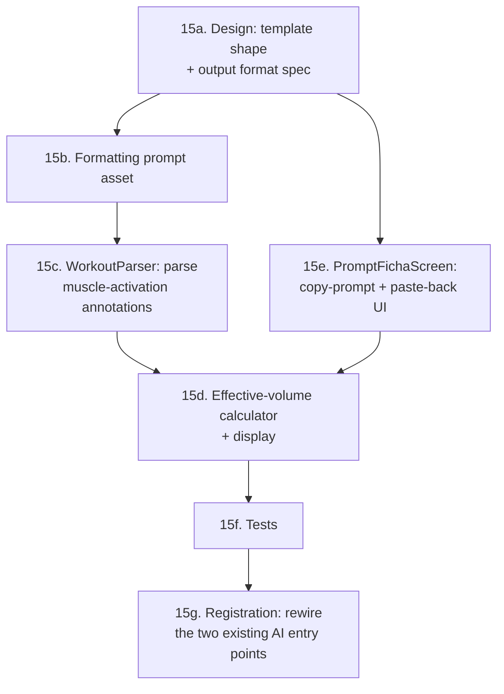
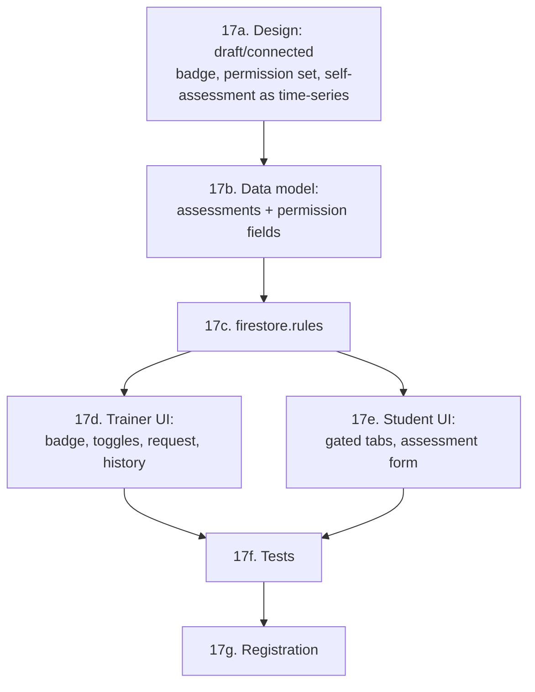
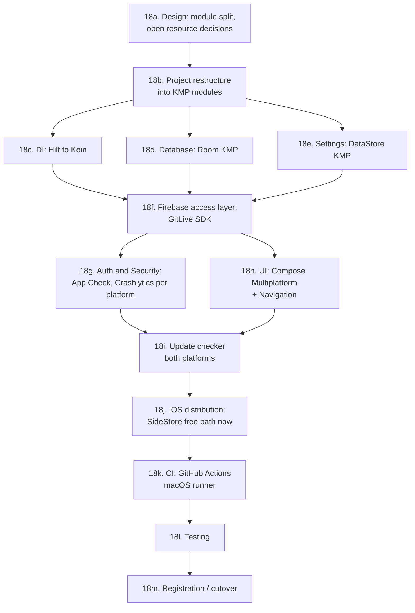

# GOALS.md — Personal Tracker (Android)

Master plan for the Personal Tracker app: native Android (Kotlin + Jetpack Compose) for
Personal Trainers to manage students, workouts, schedule and AI-generated training plans.

This file is the input for a future `/buildproject` execution pass. It reflects the **real
current state** of the codebase (read directly from source on 2026-08-15), not a greenfield
plan — items already implemented are checked off; everything else is what remains.

Stack (already chosen, in use): Kotlin, Jetpack Compose (Material 3), Room, Hilt, Navigation
Compose, DataStore, Firebase (Auth + Firestore), Google Generative AI SDK (Gemini), Clean
Architecture / MVVM. `compileSdk`/`targetSdk` = 37, `minSdk` = 24, AGP 9.3.1, Kotlin 2.3.20.

---

## Product goal (defined 2026-08-15, via `/newgoal`)

The app connects a Personal Trainer and their Students in one place, end to end:

1. The Trainer builds a workout plan ("ficha") for a student — manually or AI-assisted
   (already built, see §5) — and **assigns it to that student's account** (not built yet).
2. The Student has their **own login**, connected to their Trainer, and can see the ficha(s)
   assigned to them (not built yet — this is the entire missing "Student role", §4/§5).
3. When the Student trains, they **log what they actually lifted** (weight/reps performed per
   exercise, per session — "atualização de carga") back through the app. This is new: today
   the data model only stores the *planned* exercise (`Exercise` in `WorkoutEntity`) and a
   single `intensity` rating per session (`HistoryEntity`) — there is no record of actual
   performed weight/reps anywhere. A new "workout log" concept is required (§4).
4. The Trainer can see and **manage a per-student evolution report**: body metrics
   (weight/height/body fat — the `BiometricEntity` chart already exists, see §5) *plus* strength
   progression per exercise over time (new, depends on #3).
5. The UI should read as a finished, professional product, not a scaffold — see the concrete UI
   debt catalogued in §5.
6. Every pre-existing feature (student CRUD, manual/AI workout builder, schedule, settings)
   should be brought up to the same "professional and functional" bar — see the concrete gaps
   flagged inline in §5 and §9, not just the new features above.

This goal supersedes the earlier framing of §4 as "an open decision" — the Firestore migration
is now a confirmed requirement, not optional, because the Student login/sync flow directly
depends on it.

---

## Archived sections (every item `[x]`)

Moved out of this file on 2026-09-17 per `/execgoals` rule 4a; the numbering below is still
what §-references throughout this file mean. Checksums are in `dev/goals-archive/README.md`.

- §0 Toolchain / local setup → [`dev/goals-archive/goals-00-toolchain-local-setup.md`](dev/goals-archive/goals-00-toolchain-local-setup.md)
- §1 Project identity → [`dev/goals-archive/goals-01-project-identity.md`](dev/goals-archive/goals-01-project-identity.md)
- §2 Version control → [`dev/goals-archive/goals-02-version-control.md`](dev/goals-archive/goals-02-version-control.md)
- §3 Backend (Firebase + planned AI proxy) → [`dev/goals-archive/goals-03-backend.md`](dev/goals-archive/goals-03-backend.md)
- §4 Database — Firestore sync + new workout-log model → [`dev/goals-archive/goals-04-database-firestore-sync-new-workout-log-model.md`](dev/goals-archive/goals-04-database-firestore-sync-new-workout-log-model.md)
- §5 Frontend (Jetpack Compose) → [`dev/goals-archive/goals-05-frontend.md`](dev/goals-archive/goals-05-frontend.md)
- §6 Connectivity → [`dev/goals-archive/goals-06-connectivity.md`](dev/goals-archive/goals-06-connectivity.md)
- §7 Auth → [`dev/goals-archive/goals-07-auth.md`](dev/goals-archive/goals-07-auth.md)
- §8 Security → [`dev/goals-archive/goals-08-security.md`](dev/goals-archive/goals-08-security.md)
- §9 Testing → [`dev/goals-archive/goals-09-testing.md`](dev/goals-archive/goals-09-testing.md)
- §10 Code quality → [`dev/goals-archive/goals-10-code-quality.md`](dev/goals-archive/goals-10-code-quality.md)
- §11 CI / Deployment → [`dev/goals-archive/goals-11-ci-deployment.md`](dev/goals-archive/goals-11-ci-deployment.md)
- §13 Post-MVP Fixes & Validation (2026-08-19, via `/newgoal`) → [`dev/goals-archive/goals-13-post-mvp-fixes-validation.md`](dev/goals-archive/goals-13-post-mvp-fixes-validation.md)
- §14 Research — cost-effective AI providers for a future constraint-aware ficha generator → [`dev/goals-archive/goals-14-research-cost-effective-ai-providers-for-a.md`](dev/goals-archive/goals-14-research-cost-effective-ai-providers-for-a.md)
- §16 Feature — DeepSeek + Claude as selectable providers, dedicated Settings tabs → [`dev/goals-archive/goals-16-feature-deepseek-claude-as-selectable-providers.md`](dev/goals-archive/goals-16-feature-deepseek-claude-as-selectable-providers.md)

---

## 12. Phase 2 — full feature parity with commercial PT/coaching apps (researched, deliberately
deferred — not started, not blocking the MVP above)

Researched 2026-08-17 what personal-trainer client-management apps are expected to have today
(GetApp/Jotform/Capsule CRM/1fit market surveys — see sources at the end of this session's reply,
not reproduced here). Cross-referenced against this app's current + planned (§§1-11) scope:

| Commercial feature | This app's status |
|---|---|
| Client profiles + progress tracking | Have it (`BiometricEntity`/`WeightChart`, §4a sync) |
| Workout/program delivery | Have it (manual + AI builder, §5a) |
| Mobile access | Have it (native Android) |
| Booking with automatic reminders | Have scheduling (`ScheduleScreen`); **no reminders** — would need push notifications (FCM), explicitly out of scope per the original Product goal ("don't add FCM unless explicitly requested") |
| In-app messaging | **Don't have** — no chat/messaging feature or data model anywhere |
| Progress photos | **Don't have** — `BiometricEntity` is numeric only, no image storage/Firebase Storage integration |
| Payment processing | **Don't have** — no billing/subscription concept, no payment processor integration |
| Habit tracking | **Don't have** — out of scope, not part of the Product goal |

None of these are started, and none should be picked up silently — each is a real subsystem
(messaging needs a data model + real-time UI + likely FCM for delivery; payments need a processor
decision, PCI-scope discussion, and real business terms; photos need Firebase Storage + upload
UI + storage-rules; reminders need FCM). Flagging them here so the *complete* picture is visible,
per the request that triggered this research pass — not recommending building any of them without
an explicit go-ahead and, for payments specifically, real business decisions only the user can
make (pricing, which processor, subscription vs. one-time).

If/when any of these become real priorities, treat each as its own `/newgoal` research pass (the
depth needed — e.g. messaging's real-time delivery model, or payment PCI scope — deserves the same
front-loaded research this file already does for the rest of the app, not a rushed bolt-on).

---

## 15. Feature — replace in-app AI ficha generation with a prompt-template + paste workflow
(2026-08-19, via `/newgoal`)

The immediate, ship-now response to §14a: stop depending on a live in-app AI call for ficha
generation. Instead, give the trainer a pre-written formatting prompt (authored once, embedded in
the app) that they combine with their own requirements and run in *whatever* AI app they already
have (ChatGPT, Gemini app, Claude, web — doesn't matter, no API integration needed for this to
work) — then paste the reply back into the app's existing Smart Paste importer, extended to also
parse the muscle-activation annotations `REPERTOIRE.md` validated. The trainer keeps 100% manual
edit control afterward — nothing new needed there, `ManualWorkoutScreen`'s existing exercise-list
editing already applies to imported fichas exactly like manually-typed ones.

**15a. Design rationale**
- [x] **Output format**: extend, don't replace, the existing Smart Paste shape (`WorkoutParser.kt`
      — `Ficha X` header line + `Exercício NxM` lines, GOALS.md's own module docs) with an
      *optional* trailing annotation per exercise line naming which muscles it hits and at what
      coefficient from `hypertrophy_volume_reference.md`, e.g.:
      `Supino reto 4x10 [Peitoral:1.0, Delt.ant:0.5, Tríceps:0.5]`
      Optional so a line with no annotation (or a human pasting a plain WhatsApp-style ficha,
      today's existing use case) still parses exactly as before — this is additive, not a
      breaking format change.
- [x] **Explicit out of scope for this pass** (prevents scope creep): no new in-app AI API call
      (that's §14's later phase, if ever); no anatomy-diagram/heatmap visualization (Hevy/Boostcamp
      style, per `REPERTOIRE.md` §2) — this pass shows effective volume as a simple per-muscle
      number-vs-band line, not a body diagram; no change to `AIWorkoutViewModel`'s JSON-based
      direct-call contract — that code stays as-is, just unwired from the primary UI path (§14c
      keeps the door open to re-enable it later without a rewrite).

**15b. Formatting-prompt asset**
- [x] New asset `app/src/main/assets/ficha_prompt_template.md` — the fixed prompt text the app
      hands the trainer, containing: (1) the exact output format spec from 15a with a worked
      example, (2) the full `hypertrophy_volume_reference.md` table content (reused verbatim —
      already bundled, no duplication of research), (3) an instruction to compute and report
      effective volume per targeted muscle as `Σ(sets × coefficient)` against whatever weekly
      target the trainer states, applying the existing RIR adjustment rules from the same table —
      this is the exact validated method from `REPERTOIRE.md` §1, written into the prompt as
      plain instructions so any general-purpose AI (not just Gemini) can follow it.

**15c. `WorkoutParser.kt` — parse the muscle-activation annotation**
- [x] New regex for the optional trailing `[Muscle:coef, Muscle:coef, ...]` block per exercise
      line, parsed into a `Map<String, Double>` on the exercise (nullable/empty when absent —
      backward compatible with every existing `WorkoutParserTest` case, which must keep passing
      unchanged).

**15d. Effective-volume calculator + display**
- [x] New pure function: given a parsed ficha's exercises (sets × per-muscle coefficients), sum
      `sets × coefficient` per muscle across the whole ficha → effective weekly volume per muscle.
      Display as a compact per-muscle line (muscle name, computed number, generic MEV/MAV/MRV band
      as context text, per `REPERTOIRE.md` §2's finding that a bare number without a
      range/context is the wrong UX) — added to the ficha view already shown on
      `ManualWorkoutScreen`/`StudentDetailsScreen`, not a new screen.

**15e. `PromptFichaScreen` — copy-prompt + paste-back UI**
- [x] New screen (or a new mode on the existing `AIWorkoutScreen`, reusing its student-profile
      auto-fill from `buildPrompt()`'s existing field-gathering logic): a text field for the
      trainer's own requirements (what they want in the ficha, target volumes per muscle, etc.),
      a **"Copiar Prompt"** button that concatenates 15b's template + the student's existing
      profile fields + this free text, and copies it to the clipboard (`ClipboardManager`, same
      API already used for the invite-code share sheet) — then the existing "Importador
      Inteligente" paste box (already on `ManualWorkoutScreen`) is where the trainer pastes the
      AI's reply back in. No new paste UI needed, just the "Copiar Prompt" half.

**15f. Tests**
- [x] `WorkoutParserTest`: new cases for the muscle-activation annotation (present, absent,
      malformed — skipped, not errored, same convention as every other unparseable line today).
      Found and fixed a real bug while writing these: a comma-decimal coefficient (e.g.
      `[Costas:0,75]`) silently parsed wrong (comma also separates muscles in the same bracket) —
      the annotation format now requires a period, documented in the prompt template and in a
      code comment, not just fixed silently.
- [x] New unit test for the effective-volume calculator: multiple exercises contributing
      fractional credit to the same muscle sum correctly; a muscle with zero contributing
      exercises reports 0, not a crash.
- [ ] **(manual)** confirm "Copiar Prompt" actually populates the system clipboard on a real
      device — Compose clipboard interaction isn't meaningfully covered by a JVM/Robolectric test.

**15g. Registration — rewire the two existing AI entry points**
- [x] `StudentDetailsScreen`'s "Ficha Personal" dialog ("Manual" vs. "Com IA") and
      `WorkoutBuilderScreen`'s "Criar com IA" button both currently navigate straight to
      `AIWorkoutScreen` (the live-chat direct-call screen, GOALS.md §5d) — repoint both at the new
      `PromptFichaScreen` instead. Done when: neither entry point reaches a live Gemini/OpenAI API
      call without the trainer explicitly choosing to (§14c keeps that path available, just not
      the default one a tap away).

---

## 17. Feature — student connection clarity, trainer-granted permissions, self-assessment
(2026-08-19, via `/newgoal`)

**Built 2026-09-17 via `/execgoals`, on the user's explicit go-ahead (chosen alongside "push +
PR" and "pause iOS"). Android-verified end to end at the build level; the two things only a
person can do — publish the new `firestore.rules` and run the flows on real devices — are the
open items in §17f.** Deviations from the plan below are noted inline where they happen.

Grounded in a direct code read (not assumption) before designing anything, since the request
questioned whether the current model is architecturally broken:

- **"Meus Alunos" already merges both states** — `TrainerRepository.getStudents()` reads one Room
  `users` table populated by *two* Firestore listeners: `students/{id}` drafts (`AddStudentScreen`,
  no Firebase Auth account) and `users/{uid}` docs where `trainerId` matches (real linked/claimed
  accounts). A trainer already sees both kinds of "aluno" in one list — the data layer isn't
  fragmented. What's actually missing is **visual distinction on the card** between "cadastrado,
  ainda não conectado" and "conectado" — a UI gap, not an architecture one.
- **`AddStudentScreen` should stay** — it's the same pattern real competing tools use (Trainerize,
  TrueCoach: "add a client record" and "invite them to the app" are two separate, sequential
  steps, not one). A trainer meeting a new client in person, before that person has installed
  anything, needs somewhere to write down what they already know. Removing it would regress a
  real, common workflow to solve a labeling problem — fix the label, not the feature.
- **Real bug found while reading `AuthRepository.claimInvite()` for this pass**: the claim write
  is `transaction.set(userRef, mapOf(...))` — a full overwrite, not a merge. Harmless *today*
  (nothing lets an unclaimed self-registered STUDENT write anything to their own profile yet, per
  the code read), but it becomes a real data-loss bug the moment any self-service capability
  ships: a student who filled out a self-assessment (17e) *before* claiming an invite would have
  it silently wiped the moment they claim. Rather than touch the claim mechanism (out of scope,
  risk of regressing §7/§13d's already-working invite logic), **every new self-service capability
  in this section is scoped to apply only to already-linked (claimed) students** — matches the
  user's own framing ("aluno... conectar para o personal e aí sim [fazer coisas]") and sidesteps
  the overwrite risk entirely rather than papering over it.

**17a. Design rationale**
- [x] **Done** — **Draft vs. connected badge**: purely visual, uses the existing `UserEntity.linked` field
      already returned by the merged query — no new data needed. Closes the actual confusion the
      user flagged without touching the data model.
- [x] **Done** — **Permission set stays small and named, not a generic feature-flag framework**: exactly two
      toggles, both trainer-controlled and default OFF (per "que o personal libera... quando
      personal autorizar"):
      - `canSelfAssess` — student may fill out a self-assessment when the trainer requests one.
      - `canLogBiometrics` — student may log their own weight/measurements (distinct from the
        trainer's own biometric entries on `StudentDetailsScreen`).
      A third or fourth toggle can be added later the same way if a real need shows up — building
      a generic per-feature permission engine now for two known toggles is speculative flexibility
      this project's own conventions already avoid elsewhere.
- [x] **Done, one deviation** (`requestedAt` dropped — see 17b) — **Self-assessment is a time-series collection (`assessments/{id}`), not a single overwritable
      profile field** — mirrors the existing `biometrics`/`workoutLogs` pattern (Firestore source
      of truth + Room mirror), giving the trainer a real history instead of only ever seeing the
      latest answers. Content grounded in the **PAR-Q+** (Physical Activity Readiness
      Questionnaire), the international-standard pre-exercise health screening tool used
      industry-wide before a new client starts training — 7 general yes/no health-risk questions
      (heart condition needing medical clearance, chest pain during/at rest, dizziness or loss of
      consciousness, a bone/joint problem, current blood-pressure/heart medication, any other
      medical reason) — plus the profile fields `UserEntity` already has (`goal`,
      `experienceLevel`, `trainingDays`), not an invented bespoke form. A "yes" answer should be
      flagged visibly to the trainer (liability/safety relevance), not just logged silently.
- [x] **Done** — **Request is pull-based, not push** — the trainer "requesting" an assessment just flips
      `pendingAssessmentRequest = true` on the student's own doc; the student sees it next time
      they open the app (same pattern already used for role-promotion — GOALS.md explicitly keeps
      push notifications/FCM out of scope project-wide). No new messaging infrastructure needed.

**17b. Data model**
- [x] **Done** (`data/local/entity/AssessmentEntity.kt`, Room migration 7→8 with SQL copied from the exported `8.json`; `requestedAt` deliberately **not** stored — the request only ever lives as the profile's `pendingAssessmentRequest` flag and the doc is created at submission, so the field would always have been null) — New Room entity `AssessmentEntity` + Firestore collection `assessments/{id}`:
      `studentId`, `trainerId`, `requestedAt`, `submittedAt` (null until answered), `parQAnswers`
      (map of question key → boolean), `goal`/`experienceLevel`/`trainingDays` snapshot at
      submission time (so history reflects what was true *then*, not the current live profile).
      Room migration (schema version bump, exported schema committed under `app/schemas/`, per
      CLAUDE.md's own convention — no `fallbackToDestructiveMigration` reliance).
- [x] **Done** (`FirestoreMappers.toLinkedUserEntity` reads them; drafts in `students/{id}` never carry them) — New fields on `UserEntity`/`users/{uid}`: `canSelfAssess: Boolean = false`,
      `canLogBiometrics: Boolean = false`, `pendingAssessmentRequest: Boolean = false`. Extend
      `FirestoreMappers.kt` (`toFirestoreMap()`/`toUserEntity()`) — same three-places-in-lockstep
      rule CLAUDE.md already documents for this data layer.
- [x] **Done** (`setStudentPermissions`/`requestAssessment` take the `UserEntity` and use GitLive `updateFields { }` — targeted field writes, never a whole-profile merge; `observeUserById` added so the details screen follows the row) — `TrainerRepository`: `requestAssessment(studentId)` (sets the pending flag),
      `getAssessmentsForStudent(studentId): Flow<List<AssessmentEntity>>`,
      `setStudentPermission(studentId, canSelfAssess, canLogBiometrics)`.
- [x] **Done** (`getMyProfile` live `users/{uid}` snapshots; `submitAssessment` is one `WriteBatch` — assessment doc + `pendingAssessmentRequest=false` + `lastAssessmentId`; `logOwnBiometric`) — `StudentRepository`: `submitAssessment(answers, profileSnapshot)` (writes the doc, clears
      the pending flag), `logOwnBiometric(entry)` (only meaningful when `canLogBiometrics` is
      true — the rule in 17c is the real gate, this is just the write path).

**17c. `firestore.rules`**
- [x] **Done, narrower than planned** (only the *student* creates assessment docs — the trainer's "request" is a flag on the profile, so a trainer-create branch had nothing to write; append-only, no update/delete) — `assessments/{id}`: `allow create` if `isOwningTrainer(request.resource.data.trainerId)`
      (the request) **or** if the caller is the student themselves, `request.resource.data.studentId
      == request.auth.uid`, and their own `users/{uid}.canSelfAssess == true` (the submission —
      same `get()`-a-related-doc pattern already used for invite validation). `allow read` if
      owning trainer or the student themselves (same shape as `workoutLogs`).
- [x] **Done** (self-update now also pins `canSelfAssess`/`canLogBiometrics` and only lets `pendingAssessmentRequest` go true→false when `existsAfter(assessments/$lastAssessmentId)` — the batch's own write. **Plus a fix for a pre-existing bug found here**: there was *no* update branch for the owning trainer at all, so `EditStudentScreen`'s save on a linked student was silently `PERMISSION_DENIED` in production — the 2026-08-26 fix noted in memory never reached `main`. Added: `isOwningTrainer` may update exactly the profile fields + the three §17 flags, via `diff().affectedKeys().hasOnly([...])`) — `users/{uid}` self-`update`: add one more narrow, additive exception (same style as §13d's
      re-claim exception) permitting `pendingAssessmentRequest` to change **only** `true → false`
      and **only** as part of the same write that creates an `assessments/{id}` doc for that
      student — this is the "submitting an assessment clears its own pending flag" self-write,
      distinct from `canSelfAssess`/`canLogBiometrics` themselves, which stay trainer-only
      (`isAdmin() || isOwningTrainer(...)`), never student-settable.
- [x] **Done** — `biometrics/{entryId}` `allow create`: add a narrow exception permitting a student to create
      their own entry (`request.resource.data.studentId == request.auth.uid`) only when their own
      `users/{uid}.canLogBiometrics == true` — additive to the existing `isOwningTrainer`-only
      create rule, not a replacement.

**17d. Trainer-side UI**
- [x] **Done** (`StudentCard`: Link/LinkOff icon + "Conectado" / "Aguardando conexão" under the name) — Student list/card (`StudentsScreen`/`MainScreen`): a small badge — "Conectado" vs
      "Cadastrado (aguardando conexão)" — driven by the existing `linked` field.
- [x] **Done** (`StudentPermissionsSection.kt`: two `Switch`es, "Solicitar autoavaliação" enabled only with permission, pending state shown; `AssessmentCard` history with any PAR-Q+ "sim" in `errorContainer` listing the exact questions; rendered only for `linked` students) — `StudentDetailsScreen`: new "Permissões" section with two switches
      (`canSelfAssess`/`canLogBiometrics`), a "Solicitar Autoavaliação" button (enabled only when
      `canSelfAssess` is already on — request presupposes permission, not the other way around),
      and an assessment-history list (newest first, flags any "yes" PAR-Q answer visibly).

**17e. Student-side UI**
- [x] **Done** (`StudentViewModel.profile` from `getMyProfile`; "Registrar medida" on Evolução exists only while `canLogBiometrics`; the assessment route is reachable only from the pending banner) — `StudentNavigation`: reads the student's own `canSelfAssess`/`canLogBiometrics` from their
      already-synced profile (via `StudentRepository`'s existing listener, no new sync mechanism)
      and conditionally shows the corresponding tab/action — hidden entirely, not just disabled,
      when the trainer hasn't granted it.
- [x] **Done** (banner on both top-level tabs → `StudentAssessmentScreen`: 7 PAR-Q+ questions as Sim/Não switches, goal/level editable, day chips prefilled from the live profile; submit = the batch above, then back) — Pending-assessment banner/screen: when `pendingAssessmentRequest == true`, show the PAR-Q
      questions (pre-filled `goal`/`experienceLevel`/`trainingDays` from the current profile,
      editable) → submit writes `assessments/{id}` + clears the pending flag in the same logical
      action (17c's rule requires this).
- [x] **Done** (the trainer's `AddBiometricDialog` reused verbatim from `StudentEvolutionScreen`, gated by the flag; `height` is 0 there too, as on the trainer side) — Self-log biometrics screen: reuses the existing `WeightChart`/biometric-entry UI pattern
      already built for the trainer side (`StudentDetailsScreen`/`Components.kt`) rather than
      building a second one — same component, a student-facing write path gated by 17c's rule.

**17f. Tests**
- [x] **Done for CRUD + the new users columns** (`src/roomTest/.../AssessmentDaoTest`, 4 cases, device/iOS-simulator only like `AppDaoTest`) plus pure `commonTest` coverage (`AssessmentTest`: PAR-Q flagging order/unknown keys, converter round trip — runs in `verify`). **Not written**: a `MigrationTestHelper` test for 7→8 — Room 3's testing artifact would need the exported schemas packaged as instrumented-test assets, itself unverifiable here; the migration SQL was instead cross-checked byte-for-byte against `8.json`'s `createSql`, the same guarantee the helper would assert — Room DAO test for `AssessmentEntity` CRUD + the new migration (same in-memory-DB pattern
      `AppDaoTest` already uses — note the existing caveat: written and compiling is verifiable
      here, actually *running* needs a device/emulator, same as every other `androidTest` in this
      project).
- [ ] **(manual — needs you)** **Live test started 2026-09-17 (emulator = trainer, Galaxy S24+ = student): "Conectado" badge, the permission switches, "Solicitar autoavaliação" and the student's banner → PAR-Q+ screen all worked end to end; the student's submit was `PERMISSION_DENIED` because the rules below were still the 2026-09-15 version — the only thing left is publishing them and re-running the submit.** Publish the updated `firestore.rules` (Console → Firestore → Regras, paste the whole file, read it back — same as 2026-09-15) and verify live, on two phones: trainer flips a switch → student's banner appears → student submits → trainer sees the card; a student with `canSelfAssess == false` must be **blocked** on a direct write, not just hidden. Also confirms the trainer-edit fix (edit a linked student's phone and check the Firestore doc changed). `firestore.rules` changes always need live verification after publishing — this
      is no different from every other rules change this session: publish, then confirm both the
      trainer-request path and the student-submit path actually work, and that a `canSelfAssess ==
      false` student is genuinely blocked (not just hidden in the UI) from creating an
      `assessments/{id}` doc directly.

**17g. Registration**
- [x] **Done** — Wire the new "Permissões"/assessment-history section into `StudentDetailsScreen`'s existing
      layout (not a new top-level screen — it belongs alongside the other per-student management
      already there). Wire the new student-side screens into `StudentNavigation`'s existing tab
      list, conditionally per 17e.

---

## 18. Build — Cross-platform: bring the app to iOS via Kotlin Multiplatform
(2026-08-21, via `/newgoal /repertoire`)

> **⏸ iOS paused — user decision, 2026-09-17.** The KMP restructure is done and verified on
> Android (§18b–§18i, §18l); everything that needs a Mac, an iPhone, or the Firebase iOS SDK
> linked (§18g, §18j's `.ipa`/source JSON, the iOS half of §18m, every "not verified on iOS"
> note below) stays open on purpose and is **not** to be picked up by `/execgoals` until iOS is
> un-paused. Nothing iOS has been built, linked or run from this repo yet; `ios-ci.yml` is
> expected to fail at link time until the CocoaPods/SPM step from §18f lands.

The single biggest architecture change to this project since it began — bigger than the §4a
Firestore migration. Full research feeding this section is in `REPERTOIRE.md` Part 2 (regulatory
lens: what iOS distribution actually costs/allows in 2026; competitive lens: why KMP fits this
specific codebase better than a Flutter/React Native rewrite). This section is the *how*; that
file is the *why these choices*.

**Business framing (confirmed with the user, drives scope/sequencing below):** free/test phase
now (current client base is under 10 students, staying free through ~20), paid platforms
(App Store + Play Store) only once the trainer actually starts charging students and the pricing
math is done. That means this section explicitly plans for **zero ongoing cost**, not "cheapest
possible paid tier" — every choice below is free-tier-first, with the paid migration path
documented (18g) but not built now.

**Cross-platform connectivity is not a subsystem to build.** Android↔Android, Android↔iOS, and
iOS↔iOS all resolve automatically once the iOS app talks to the same Firestore project the
Android app already uses — Firestore is the shared source of truth regardless of client platform
(§4a). The real engineering risk isn't "connecting" the platforms, it's making sure the *shared*
Kotlin code has zero hidden Android-only assumptions that would silently produce
platform-divergent behavior (e.g. a date/time formatter that behaves differently, a JSON shape
that only round-trips correctly on one platform). Item 18h below is what actually protects this.

**18a. Design rationale and open decisions**
- [x] **Framework choice: Kotlin Multiplatform + Compose Multiplatform**, not Flutter/React
      Native. Decided per `REPERTOIRE.md` Part 2 §4 — this app already *is* Kotlin/Compose, so
      KMP reuses the existing domain/data layer and most Compose UI directly; Flutter/React Native
      would both be full rewrites from zero. Compose Multiplatform reached stable iOS support in
      version 1.8.0 (May 2025) and Navigation reached stable multiplatform status in 1.10.0
      (January 2026) — both current and load-bearing enough to build on, not bleeding-edge risk.
- [x] **iOS distribution: SideStore (free Apple ID sideload) for the free/test phase, Apple
      Developer Program ($99/yr) deferred until the trainer starts charging.** Per
      `REPERTOIRE.md` Part 2 §3: there is no zero-cost path to a *professional* iOS distribution
      (TestFlight, alternative marketplaces, and the App Store all require the same $99/year
      membership just for Apple's mandatory notarization step) — SideStore is the only genuinely
      free route, and it's viable at this app's current scale because the trainer already
      configures each Android device by hand today, so a one-time per-iPhone SideStore pairing
      is the same category of effort, not new overhead. Real limitation accepted: max 3
      sideloaded apps at once on the person's iPhone (irrelevant unless they already sideload
      other things), and updates depend on SideStore's periodic re-sign/refresh actually
      succeeding (mitigated by 18i's expiry warning).
- [x] **Decided 2026-08-21: no local Mac access** (confirmed with the user — owns an iPhone for
      testing, but no Mac, and there is no legal free equivalent: Apple's EULA restricts macOS
      virtualization to genuine Apple hardware, ruling out a "hackintosh"-style VM on the
      existing Windows dev machine). **Plan**: do everything that doesn't need Xcode now
      (18b–18g) using CI (18k) as the iOS verification gate instead of local compilation; rent a
      real cloud-hosted Mac by the hour (e.g. MacinCloud, ~US$1/hr, genuine Apple hardware — not
      a licensing violation, unlike a local VM) only when 18h/18j's Xcode-only steps (initial
      signing certificate, SideStore source pairing) are actually reached. Not rented yet — no
      need until then.
- [x] **Module shape**: rename/restructure the existing single `app` Android module into a KMP
      layout — `shared/` (or `composeApp/`, matching current JetBrains project-template
      convention) holding `commonMain` (business logic, ViewModels, repositories, Compose UI,
      Room database, Koin modules) plus `androidMain`/`iosMain` (platform-specific `expect`/
      `actual` implementations only: DB file path, DataStore file location, App Check provider,
      Crashlytics/CrashKiOS wiring, update-download mechanism). A thin `androidApp` module wraps
      `commonMain` for the existing Android entry point (`MainApplication`, manifest); a
      generated Xcode project wraps it for iOS. This is the standard KMP+Compose Multiplatform
      project shape (JetBrains' own multiplatform wizard produces this layout) — not a bespoke
      structure invented for this app.

**18b. Project restructure into KMP modules**
- [x] **Toolchain checkpoint — done and verified 2026-08-21.** New `:shared` module (branch
      `feature/kmp-ios`) using `org.jetbrains.kotlin.multiplatform` +
      `com.android.kotlin.multiplatform.library` — **not** the classic `com.android.library`,
      which AGP 9 made incompatible with the Kotlin Multiplatform plugin (confirmed live: the
      classic plugin combo fails with an explicit error naming the new plugin as Google's own
      recommended migration). Targets: the Android library target plus `iosX64()`/`iosArm64()`/
      `iosSimulatorArm64()`. Holds one trivial common function + test on purpose — this is the
      "does the whole toolchain actually work" checkpoint before any real logic moves in, exactly
      as planned. **Verified for real, not just "configured":**
      - Android side, locally: `:app:compileDebugKotlin` (now depending on `:shared`) succeeds,
        `:shared:testAndroidHostTest` (the commonTest run on the JVM/Android host) passes, and
        the full `./gradlew verify assembleDebug` still passes project-wide.
      - iOS side, via CI (this Windows dev machine can't compile Kotlin/Native's Apple targets at
        all — confirmed current fact, not an assumption): new `.github/workflows/ios-ci.yml` on
        `macos-latest` (free — this repo is public) compiles all three iOS targets **and** runs
        the shared module's test on the iOS simulator — both green, ~2 minutes.
      - **Two real, previously-undiscovered bugs found and fixed while getting this checkpoint
        green** (see §11 for detail): `gradlew`'s missing executable bit (broke *every* CI run on
        this project, iOS and Android both, unrelated to this migration) and the never-added
        `GOOGLE_SERVICES_JSON` repo secret. Both fixed; `main`'s own `android-ci.yml` is now
        confirmed green for the first time.
- [x] **Done 2026-09-15**: moved `Exercise`, `PerformedSet` (`data/model/`), `WorkoutParser`
      (`util/`), and `AIWorkoutResponse`/`AIWorkout`/`AIExercise` (extracted from
      `AIWorkoutViewModel.kt` into a new `AIWorkoutModels.kt`, same package — `ChatMessage` stayed
      behind since it references `WorkoutEntity`, a Room entity not yet in `commonMain`) into
      `:shared`'s `commonMain`, same package names throughout so every existing import in `:app`
      resolves unchanged via the `implementation(project(":shared"))` dependency — zero import
      changes needed anywhere else. Added `kotlin.serialization` plugin +
      `kotlinx-serialization-json` to `shared/build.gradle.kts` (`Exercise`/`PerformedSet`/the new
      AI models are all `@Serializable`). `WorkoutParserTest` moved to `commonTest`, converted
      from JUnit4 (`org.junit.Assert`) to `kotlin.test` (JUnit4 doesn't run on Kotlin/Native) —
      same 15 assertions, unchanged logic. **Verified**: `./gradlew :shared:testAndroidHostTest`
      (all 15 cases pass on the JVM host) and `./gradlew verify assembleDebug` (app module still
      green). **Not verified**: the `iosSimulatorArm64Test` run — this Windows machine can't
      compile Kotlin/Native's Apple targets locally, and running `ios-ci.yml` needs a push, which
      wasn't done in this pass (see the run's final report). Confirm this once pushed before
      treating the iOS side of this item as more than "should work."
      `WorkoutEntity` itself (Room entity, still Android-only) intentionally stays in `:app` —
      moving it is §18d's job (Room → Room KMP), not this item's.

**18c. Dependency injection: Hilt → Koin**
- [x] **Hilt has no Kotlin Multiplatform support at all** (confirmed current, `REPERTOIRE.md`
      research) — this is a hard blocker, not a preference. Replaced every `@HiltViewModel`/
      `@Inject`/`@Module`/`@InstallIn` (32 files: 9 ViewModels, 5 repositories/services, 2 Hilt
      modules, `MainApplication`/`MainActivity`, 14 `hiltViewModel()` call sites) with Koin
      4.2.2's `module { }`/`viewModel { }`/`get()`/`androidContext()` DSL in a single new
      `di/AppModule.kt` (replaces `AuthModule.kt`/`DatabaseModule.kt`, both deleted).
      `MainApplication.onCreate()` calls `startKoin { androidContext(this@MainApplication);
      modules(appModule) }`; `MainActivity`'s `@AndroidEntryPoint` removed (Koin needs no
      activity annotation for Compose-only injection). Every `hiltViewModel()` call site now
      calls `koinViewModel()` (`org.koin.compose.viewmodel`). Verified via
      `./gradlew compileDebugKotlin verify assembleDebug` (all green) — no test needed updating,
      `AuthRepositoryTest`/`TrainerGoldenPathTest` already built their dependencies with plain
      MockK fakes, never through Hilt's test DSL, so there was no `@TestInstallIn` to migrate.
      **Scoping note**: this replaces the DI *framework* only, still declared in `app`'s own
      `di/AppModule.kt`, not in `commonMain` as originally sketched — §18b (moving the
      ViewModels/repositories themselves into `commonMain`) hasn't happened yet, so there's
      nothing multiplatform for a `commonMain` Koin module to wire up yet. Moving `appModule`
      into `commonMain` is now a mechanical follow-up once §18b actually relocates those classes,
      not a separate design problem — deliberately not done speculatively ahead of that move.

**18d. Database: Room → Room Kotlin Multiplatform — done 2026-09-16**
- [x] **No SQLDelight migration needed, but the original "largely unchanged" premise was
      wrong — corrected during implementation.** Room's multiplatform support is not an
      in-place mode of classic `androidx.room` 2.x; Room 3.0 (stable `3.0.3`, released
      2026-09-09, confirmed live via developer.android.com) is a **full artifact/package fork**
      to `androidx.room3` made specifically to be Kotlin-first/multiplatform, per Google's own
      migration guide (updated 2026-09-11). Real consequences beyond a version bump: every
      `androidx.room.*` import becomes `androidx.room3.*`; `@TypeConverter`/`@TypeConverters`
      rename to `@ColumnTypeConverter`/`@ColumnTypeConverters`; migrations move from
      `Migration(x,y) { override fun migrate(db: SupportSQLiteDatabase) }` to
      `Migration(x,y) { override suspend fun migrate(connection: SQLiteConnection) }` using
      `connection.execSQL(...)` (import `androidx.sqlite.execSQL`); the Room Gradle plugin's
      DSL extension is `room3 { schemaDirectory(...) }`, not `room { }`. None of this changes the
      actual schema/SQL — same entities, same column names, same migration statements, same
      version number (7) — so an already-installed app's database should upgrade in place, not
      get treated as a new/different schema. **Residual risk, explicitly flagged**: this
      upgrade path (a real device already on schema v7 via the old `androidx.room` 2.x engine,
      now opening the same file via `androidx.room3`) has not been tested on a real device in
      this environment (none available) — low-stakes since Firestore is the source of truth for
      every actively-used table (§4a) and would just resync, except `HistoryEntity`, which stays
      Room-only and would be lost on a genuine destructive fallback. Test this specifically
      before distributing a build over an existing install.
- [x] `AppDatabase`, `AppDao`, `Converters`, and all 6 entities moved to `:shared`'s `commonMain`
      (same package names). `getDatabaseBuilder()` implemented as a plain top-level function
      (not `expect`/`actual` itself — the `@ConstructedBy(AppDatabaseConstructor::class)` +
      `expect object AppDatabaseConstructor : RoomDatabaseConstructor<AppDatabase>` pattern Room's
      compiler requires is on the constructor, not the builder function): `androidMain`'s
      `getDatabaseBuilder(context)` resolves the exact same on-disk file location the old
      `Context.getDatabasePath("personal_app_database")` call always used (preserves existing
      installs' data); `iosMain`'s parameterless `getDatabaseBuilder()` uses `NSDocumentDirectory`
      (new — no existing iOS installs to preserve). A common `getRoomDatabase(builder)` in
      `AppDatabase.kt` applies `.addMigrations(...)`, `.fallbackToDestructiveMigration(...)`,
      `.setDriver(BundledSQLiteDriver())`, `.setQueryCoroutineContext(Dispatchers.IO)` — same
      driver Google's own KMP guide recommends (compiled-from-source SQLite, one consistent
      version across platforms). Koin's `AppModule.kt` updated:
      `single { getRoomDatabase(getDatabaseBuilder(androidContext())) }`.
      **`iosX64` dropped as a `:shared` target** (also updated in `ios-ci.yml`) — discovered
      during this pass that `androidx.room3`/`androidx.sqlite` publish no `iosX64` variant at all
      (Intel Mac simulator, effectively dead now that Apple no longer sells Intel Macs);
      `iosArm64` (real devices) + `iosSimulatorArm64` (Apple Silicon Mac simulator) cover every
      real 2026 target, so this isn't a functional loss. **Verified**:
      `./gradlew :shared:compileAndroidMain verify assembleDebug` all green, and the packaged
      `app-debug.apk` bundles `libsqliteJni.so` (confirms the real-device native driver path,
      not just compile success). **Not verified**: `iosArm64`/`iosSimulatorArm64` compilation —
      this Windows machine can't run Kotlin/Native's Apple toolchain at all; needs `ios-ci.yml`,
      which needs a push (not done this pass, see the run's final report).
- [x] **Re-verified**: `MIGRATION_5_6`/`MIGRATION_6_7` ported with identical SQL (only the
      surrounding API changed, per above); `shared/schemas/` now holds the same
      package-qualified schema JSON files moved unchanged from `app/schemas/` (`git mv`, history
      preserved); `room3 { schemaDirectory("$projectDir/schemas") }` in `shared/build.gradle.kts`
      replaces the old `ksp { arg("room.schemaLocation", ...) }` block in `app/build.gradle.kts`
      (removed, along with every other now-unused `androidx.room` 2.x dependency/KSP setup in
      `:app` — Room lives only in `:shared` now).
- [x] **`AppDaoTest`/`workoutLog_roundTripsPerformedSets` — real coverage gained, with an
      honest limitation found.** Converted from JUnit4/`AndroidJUnit4`/`InstrumentationRegistry`
      to `kotlin.test`, using `Room.inMemoryDatabaseBuilder<AppDatabase>().setDriver(
      BundledSQLiteDriver())` (no `Context` needed at all — this is new; the old
      `androidx.room` 2.x version needed a real device/emulator for its in-memory builder).
      **Placed in `shared/src/iosTest/`, not `commonTest`**: tried `commonTest` first since that
      was the plan's original intent, but `:shared:testAndroidHostTest` failed with
      `UnsatisfiedLinkError: no sqliteJni in java.library.path` — confirmed via research this is
      a known, documented limitation (the Android build variant of `androidx.sqlite:sqlite-bundled`
      ships no JVM-host native binary, only real Android `.so`s), not a bug introduced here.
      Moving the test to `iosTest` gives real, previously-impossible iOS coverage (pending CI
      confirmation, needs a push); real Android-device coverage for this test is unchanged from
      before this pass (still needs a real device/emulator, still tracked as its own item in
      §18l, not silently dropped).

**18e. Settings/preferences: DataStore → DataStore Multiplatform — done 2026-09-16**
- [x] DataStore Preferences (not DataStore Proto) has official multiplatform support since 1.1.0
      (this project already pinned 1.2.1) — confirmed accurate against the current Android
      Developers KMP setup guide (updated 2026-09-11). Unlike §18d's Room surprise, this premise
      held: no artifact/package fork, same `androidx.datastore.*` names throughout.
      `SettingsRepository` (all three `stringPreferencesKey`s — OpenAI/DeepSeek/Claude; Gemini has
      no key, it's project-level per §3) moved to `:shared`'s `commonMain` whole, not just the
      keys — its constructor now takes `DataStore<Preferences>` directly instead of `Context`,
      so the class itself has zero platform dependency.
- [x] Platform split implemented as a `createDataStore(...)` builder pair, same shape as §18d's
      `getDatabaseBuilder`: `androidMain`'s `createDataStore(context)` uses `FileStorage` +
      `PreferencesFileSerializer` (not `PreferencesSerializer` — that one implements
      `OkioSerializer`, for `OkioStorage`; using it with `FileStorage` fails to compile with a
      type mismatch, found via the compiler after the official guide's own Android snippet
      turned out to use the wrong serializer name); `iosMain`'s parameterless `createDataStore()`
      uses `OkioStorage` + `PreferencesSerializer` + `NSDocumentDirectory`, matching the guide
      exactly. A common `createDataStore(storage)` in `DataStore.kt` finishes both via
      `DataStoreFactory.create(storage = storage)`. Koin's `AppModule.kt`:
      `single { createDataStore(androidContext()) }` → `single { SettingsRepository(get()) }`.
      **Verified**: `./gradlew :shared:compileAndroidMain verify assembleDebug` all green.
      **Not verified**: iOS compilation (needs `ios-ci.yml`, needs a push) and an actual saved-key
      round-trip on a real device (no device in this environment) — same category of gap as
      §18d, not a new one.
- [x] **Re-verified**: `androidMain`'s `createDataStore(context)` resolves
      `context.applicationContext.filesDir.resolve("datastore/settings.preferences_pb")` —
      the exact same on-disk path Android's old `Context.preferencesDataStore(name = "settings")`
      delegate always produced (confirmed against `backup_rules.xml`/`data_extraction_rules.xml`'s
      own hardcoded `datastore/settings.preferences_pb` exclusion path, GOALS.md §8). Since the
      path is identical, both XML files needed no edit — the exclusion still covers the right
      file after the move, and an already-installed app's saved API keys stay at the path it
      already wrote to.

**18f. Backend access layer: Firebase via the GitLive Kotlin SDK — done 2026-09-16 (Android-verified; iOS linking pending, see below)**
- [x] **Google ships no official Firebase KMP SDK** (confirmed current, mid-2026) — use the
      community-maintained `dev.gitlive:firebase-firestore`/`firebase-auth` (`GitLiveApp/
      firebase-kotlin-sdk` on GitHub), the established option for exactly this gap, actively
      maintained, in production use by other teams. The newer `KFire` alternative is still beta
      as of this research — not a safe bet for an app already depending heavily on Firestore
      transactions (`AuthRepository.claimInvite`) and listeners.
- [x] **Done 2026-09-16** — `TrainerRepository`/`StudentRepository`/`AuthRepository` rewritten
      against GitLive `2.7.0` (latest stable; `3.0.0` exists only as `alpha02`, same "not a safe
      bet" reasoning as KFire above) in `:shared`'s `commonMain`. Real API differences hit,
      beyond package names: snapshot listeners are `Flow`s (`Query.snapshots`), so
      `startListening` now holds a `Job` per mirrored collection (`onEach { documentChanges… }
      .catch { crashlytics }.launchIn(scope)`) and `stopListening` cancels them, and
      `StudentRepository`'s three `callbackFlow`+`addSnapshotListener` wrappers collapsed into one
      `snapshots.map { … }` helper; `signOut()` is `suspend` (`AuthViewModel.logout()` now
      launches it); field reads are reified `get<T?>("field")` and decode *strictly*, so
      `FirestoreMappers` gained a lenient `fieldOrNull<T>()` to keep the old "malformed → null →
      default" semantics; `runTransaction { }` has a `Transaction` receiver (`get`/`set`/
      `updateFields(ref) { "used" to true }`); `whereEqualTo` is deprecated in favour of
      `where { "f" equalTo v }` / `where { all(…) }`. `System.currentTimeMillis()`/`java.util.UUID`
      (JVM-only) replaced by `kotlin.time.Clock`/`kotlin.uuid.Uuid` (`util/Platform.kt`), same
      epoch-millis and canonical UUID text. Also **JVM target 11 → 17 in both modules**: GitLive
      ships JVM-17 bytecode and its API is mostly `inline`, which Kotlin refuses to inline into a
      lower target (found via compiler error, not documented anywhere obvious). Koin registers the
      GitLive `FirebaseAuth`/`FirebaseFirestore` alongside the official `FirebaseFirestore`, which
      stays only for `AdminViewModel` (ADM-only, Android-only, untouched) — on Android both wrap
      the same default `FirebaseApp` instance. Crashlytics calls in the moved code use GitLive's
      `Firebase.crashlytics` (it *does* ship a KMP `firebase-crashlytics` module — see the §18g
      note). **Tests**: the MockK-based `AuthRepositoryTest` (JVM-only, mocked the Android SDK's
      `Task`s) is gone; its five role-resolution assertions moved to a pure
      `resolveAuthResult(role, trainerId)` + `commonTest`'s `AuthResultResolutionTest` (6 cases,
      no mocking, runs on every target) — the one dropped case, "sign-in exception →
      `Result.failure`", is generic try/catch plumbing, noted rather than silently lost (§18l's
      own "decide and document" ask). **Verified**: `./gradlew :shared:testAndroidHostTest verify
      assembleDebug` all green (22 shared tests). **Not verified, and expected to need macOS work
      before it can be**: the `iosSimulatorArm64Test` half of this item's "done when" — GitLive's
      iOS actuals bind to the Firebase iOS SDK, which the test/app binaries must *link* (CocoaPods
      `pod("FirebaseFirestore")`/`("FirebaseAuth")`/`("FirebaseCrashlytics")` via the Kotlin
      CocoaPods plugin, or SPM in the Xcode project). That setup can't be done or checked from
      this Windows machine, so `ios-ci.yml`'s test step will most likely fail at link time until
      it lands — belongs with §18j's cloud-Mac session, flagged here so it isn't a surprise.
- [x] `FirestoreMappers.kt` moved to `commonMain` — plain-map writes unchanged; reads ported to
      GitLive's `DocumentSnapshot.get<T?>()` behind the `fieldOrNull` helper above.
- [x] **Done 2026-09-16** — `GenerativeAiService` moved to `commonMain` on Ktor Client `3.6.0`
      (latest stable): OpenAI/DeepSeek/Claude are `httpClient.post(url) { contentType(json);
      header(...); setBody(requestBodyString) }` + `bodyAsText()`, same manual
      kotlinx.serialization encode/decode as before (no ContentNegotiation plugin — nothing to
      gain for one POST per provider), `HttpTimeout` at the old 30 s connect/request values, and
      non-2xx still surfaced as the same "Erro ao chamar a IA (<provider> <status>): <body>"
      string. Engines: `ktor-client-okhttp` in `androidMain`, `ktor-client-darwin` in `iosMain`;
      `HttpClient { }` in common code auto-selects whichever is on that target's classpath.
      The Android-only `context.assets.open("hypertrophy_volume_reference.md")` read became a
      `volumeReference: String` constructor parameter supplied by the platform DI (Koin's Android
      module reads the asset once) — the asset file itself stays in `app/src/main/assets/` until
      §18h moves resources to Compose Multiplatform's resource system. Crashlytics via GitLive.
      **Gemini on iOS — confirmed and scoped as a known gap, not dropped and not silent**:
      Firebase AI Logic *does* have a native iOS SDK (`FirebaseAI`, Swift), but no Kotlin
      Multiplatform wrapper exists (GitLive's module list doesn't cover AI Logic), so it isn't
      reachable from `commonMain` without a hand-written Swift/cinterop bridge. Implemented as
      `internal expect suspend fun generateWithGeminiPlatform(modelId, prompt)`: the
      `androidMain` actual is the existing Firebase AI Logic call verbatim (`firebase-ai` +
      BOM moved from `:app` to `:shared`'s `androidMain` deps — nothing in `:app` uses it
      anymore), the `iosMain` actual returns an explicit "Gemini ainda não está disponível no
      iOS — use OpenAI, DeepSeek ou Claude" string. §18h should hide the Gemini chip on iOS;
      closing the gap for real means writing that bridge, tracked nowhere else, so: it's a
      follow-up of its own, only worth doing if Gemini's free tier ever becomes the
      *reliable* choice again (§14a says it currently isn't). **Verified**: `./gradlew
      :shared:testAndroidHostTest verify assembleDebug` all green. **Not verified**: a live
      call through Ktor on Android (no API key/device here — same manual check §16f already
      relies on) and the iOS Darwin engine compilation (needs CI, needs a push).

**18g. Auth and Security — platform-specific pieces GitLive doesn't cover**
- [ ] **⏸ iOS paused (2026-09-17).** **App Check**: GitLive's SDK doesn't wrap App Check. Keep Android's existing
      `DebugAppCheckProviderFactory`/`PlayIntegrityAppCheckProviderFactory` wiring in
      `androidMain` unchanged; add a thin `iosMain` `actual` bridging to Firebase iOS SDK's own
      App Check (App Attest provider for release, debug provider for local iOS testing) — a
      real native-bridge implementation, not optional, since `firestore.rules`'/Auth's security
      posture assumes App Check is active on every client.
- [x] **Crashlytics — decided 2026-09-16, and the premise was stale**: a drop-in *does* exist
      for what this app uses. GitLive ships `dev.gitlive:firebase-crashlytics` (KMP wrapper over
      Firebase Crashlytics on both platforms, found while doing §18f), and this project only ever
      calls `recordException(...)` for non-fatal errors — every such call now goes through
      `Firebase.crashlytics` from `commonMain` (`TrainerRepository`, `StudentRepository`,
      `GenerativeAiService`). CrashKiOS (option a) solves a *different* problem — symbolicated
      Kotlin/Native stack traces for native *crashes* — which this app doesn't rely on today;
      revisit only if iOS crash reports turn out unreadable once real iOS usage exists. Like
      every other GitLive iOS actual, the Crashlytics one links against the Firebase iOS SDK,
      which is the same pending CocoaPods/SPM macOS step flagged in §18f.
- [ ] **⏸ iOS paused (2026-09-17).** Re-verify §8's App Check debug-token registration flow (§13a) still applies correctly once
      requests can come from either platform's debug provider — the Firebase Console's debug
      token allow-list is per-install, not per-platform, so this should be mechanically the same
      process repeated once per iOS test device, not a new mechanism.

**18h. UI: Jetpack Compose → Compose Multiplatform, Navigation — done 2026-09-16 (Android-verified)**
- [x] **All 22 UI files** (every screen, `Components.kt`, `AppNavigation`/`StudentNavigation`/
      `RoleRouter`) and all 9 ViewModels moved to `:shared`'s `commonMain`, same package names,
      plus a new common `App()` root (`ui/App.kt`) that `MainActivity.setContent { App() }` and
      iOS's `MainViewController()` both host. `:app` is now three files (`MainActivity`,
      `MainApplication`, manifest) and its own Compose/Navigation/Lifecycle dependencies are
      gone — the migration reports were right: the Composables themselves moved unchanged.
      Compose Multiplatform `1.11.0` (plugin already in the catalog since §18b), with the
      component versions from its own compatibility table: `org.jetbrains.androidx.navigation
      2.9.2`, `lifecycle 2.11.0`, Koin `koin-compose`/`koin-compose-viewmodel` (the
      `koinViewModel()` import was already the multiplatform one since §18c). Consequence worth
      knowing: this **retired `:app`'s Compose BOM `2024.12.01`** (the ~1.5-years-behind pin
      §10 deliberately left for "a dedicated future pass") — Android now gets Jetpack Compose
      `1.11.1` via CMP, so that upgrade happened here, implicitly; `ui-test-junit4` is pinned to
      the same `1.11.1` for the golden-path test. **The Android-only bits, each with its
      replacement**: `Intent(ACTION_SEND)` share sheet → `expect`/`actual`
      `rememberTextSharer()` (`ui/platform/Share.*.kt`; iOS `UIActivityViewController`);
      `Intent(ACTION_VIEW)` for the Crashlytics console link → `LocalUriHandler` (common);
      `FirebaseApp.getInstance().options.projectId` → GitLive `Firebase.app.options.projectId`;
      `SimpleDateFormat` + `LocalConfiguration.current.locales[0]` → `util/DateFormat.kt` on
      `kotlinx-datetime 0.8.0` (the locale only ever fed a fixed numeric pattern, so nothing
      user-visible changes); `String.format("%02dh")` → `padStart`; `java.util.UUID`/
      `System.currentTimeMillis()` → the §18f `Platform.kt` helpers; `android.util.Log` →
      `println` (debug-only chatter); `@Preview` → `org.jetbrains.compose.ui.tooling.preview`.
      `LocalClipboardManager` and the `ContentType` autofill semantics on `LoginScreen` are
      already common in CMP 1.11 — kept as-is. **Resources**: the two `.md` prompt files moved
      from `app/src/main/assets/` to `shared/src/commonMain/composeResources/files/`, read via
      `Res.readBytes` behind a `PromptAssets` Koin single (`GenerativeAiService` and
      `PromptFichaViewModel` no longer take a `Context`; the ViewModel preloads the template so
      the "Copiar Prompt" click stays synchronous). There were no `R.string`/`R.drawable` uses to
      migrate — the app's strings are hardcoded pt-BR. `AdminViewModel` (the last official-SDK
      Firestore user) ported to GitLive too (`Query.count()` = the same server-side aggregation),
      so the official `FirebaseFirestore` type is gone from DI entirely. **Koin split**:
      `sharedModule` (`commonMain`, the whole graph) + `expect val platformModule` (Android:
      Room builder + DataStore via `androidContext()`; iOS: the parameterless builders) and an
      iOS `initKoin()`. **Verified**: `./gradlew :shared:testAndroidHostTest
      :app:compileDebugAndroidTestKotlin verify assembleDebug` all green (22 shared tests; the
      35 MB debug APK builds). Found and fixed along the way: `TrainerGoldenPathTest` hadn't
      compiled since §16g added `onNavigateToPromptFicha` to `StudentDetailsScreen` — nobody
      ran `compileDebugAndroidTestKotlin` after that, and `verify` doesn't include it (§9's
      "written, compiles" claim had silently gone stale). **Not verified**: anything on iOS
      (needs CI, needs a push — and, before the test binary can even link, the Firebase iOS SDK
      step from §18f) and a real-device run of the migrated UI on Android (no device here — the
      Compose version jump is the one change here that deserves a hands-on smoke test before
      the next sideloaded build goes to the trainer).
- [x] Navigation: `org.jetbrains.androidx.navigation:navigation-compose 2.9.2` was a true
      drop-in — same `androidx.navigation.compose` package, so `AppNavigation.kt`/
      `StudentNavigation.kt` moved without a single import change (`NavHost`, `composable`,
      `navArgument`, `NavType.StringType` all resolve). **iOS swipe-back: still open, and now
      tracked as its own note here rather than a checkbox** — CMP's navigation 2.9 does *not*
      provide the native edge-swipe back gesture on iOS automatically; it needs either the
      `iosMain` gesture-recognizer approach or waiting for the navigation-event integration that
      CMP 1.11.0's release notes list (`navigationevent-compose 1.1.0`). Decide when the iOS app
      is actually being run (§18j) — it can't be evaluated from here and doesn't affect Android.
- [x] Re-verified each earlier Android-only UI fix against the move: the `NonObservableLocale`
      fix (§10) is **superseded**, not regressed — the locale read is gone entirely because the
      date formatter never used it for anything observable (see above); the R8/lint sweep
      (§8/§10) still applies unchanged to the Android build (`lint` is part of `verify`, still
      green), and has no iOS counterpart to regress; `Icons.AutoMirrored.*` compiles from
      `commonMain` via `compose.materialIconsExtended`, confirming it's multiplatform-safe. One
      more Android-only assumption *was* found and removed by the compiler, not by this list:
      `String.format(Locale.ROOT, …)` in `ScheduleScreen` (JVM-only) — noted in the first item.

**18i. In-app update checker — both platforms (user's explicit ask) — done 2026-09-16 (Android-verified)**
- [x] `data/service/UpdateChecker.kt` (`commonMain`): fetches the raw `latest.json` from this
      repo's `main` (the file committed in `1246bea`; URL in `DEFAULT_MANIFEST_URL`) through the
      same Ktor `HttpClient` the AI providers use (now one Koin single), decodes it with
      `kotlinx.serialization` (`ignoreUnknownKeys`, so extra fields can be added to the manifest
      without breaking older installs), and compares against an `AppVersion` (code, name,
      platform) that the platform Koin module supplies — Android from `PackageManager`, iOS
      from `Info.plist`'s `CFBundleVersion`/`CFBundleShortVersionString`. Returns a sealed
      `UpdateStatus`: `UpToDate`, `UpdateAvailable(versionName, changelog, downloadUrl?)`,
      `SignatureExpiring(daysLeft)` (iOS only), `Failed(message)` — network/parse problems are
      values, never exceptions, so an offline launch is quiet. **Tested** in `commonTest`
      (`UpdateCheckerTest`, 6 cases on Ktor's `MockEngine`: behind/at version for each
      platform, iOS has no download URL, HTTP 404 and malformed JSON both surface as `Failed`).
      **To publish a version**: bump `versionCode`/`versionName` in `app/build.gradle.kts`,
      attach the signed `app-release.apk` to a GitHub Release, edit `latest.json` on `main` to
      match — nothing else to deploy.
- [x] **Automatic check**: `ui/UpdateBanner.kt`, placed above `RoleRouter()` in the common
      `App()` root — one `check()` per process start (`produceState`), rendering a dismissible
      `tertiaryContainer` card only for `UpdateAvailable`/`SignatureExpiring`; `UpToDate` and
      `Failed` show nothing (offline is normal; the manual check below is where failures are
      shown). No background job, per the original scoping.
- [x] **Manual check**: `SettingsScreen` gained a second tab, "Atualização" (§16a's tabbed
      shell paid off — one list entry + one `when` branch), showing the installed version and a
      "Verificar atualização" button that runs the same `UpdateChecker` and renders the result
      through the shared `UpdateActions` composable (also used by the banner).
- [x] **Android-specific action**: "Baixar atualização" opens `downloadUrl` via the common
      `LocalUriHandler` — the browser downloads the `.apk` and Android's own install prompt takes
      over, same sideload flow as today's manual reinstall. **Not verified on a device** (none
      here); the URL itself points at `releases/latest/download/app-release.apk`, which only
      resolves once a GitHub Release with that asset exists — none published yet (§11 decided
      against the Play Store; a Release is the free equivalent this needs).
- [x] **iOS-specific action — implemented, unverifiable here**: the manifest's
      `ios.signatureExpiresAt` (ISO `YYYY-MM-DD`, currently `null`; maintained by hand when a
      build is re-signed) becomes `SignatureExpiring(daysLeft)` once within
      `SIGNATURE_WARNING_DAYS` (3 — free Apple IDs sign for 7 days), and both that state and an
      iOS `UpdateAvailable` render the clear instruction ("abra o SideStore e toque em Refresh
      All") plus an "Abrir SideStore" button that attempts the `sidestore://` URL scheme
      (wrapped in `runCatching`, so a scheme SideStore doesn't register just does nothing).
      Whether that scheme opens SideStore, and the whole iOS banner, can only be checked on an
      iPhone with SideStore — §18j's territory; the logic itself is covered by
      `UpdateCheckerTest`.

**18j. iOS distribution: SideStore free path (now) → Apple Developer Program (later, when paid)**
- [ ] **⏸ iOS paused (2026-09-17).** Host the built `.ipa` + an AltStore/SideStore-format "source" JSON (app metadata + download
      URL + version) somewhere stable and free — a GitHub Release asset on this same public repo
      is the natural choice, consistent with 18i's update-manifest hosting.
- [x] **Per-iPhone SideStore setup — documented 2026-09-17** from the official docs
      (docs.sidestore.io/docs/installation/prerequisites and /install, read that day; SideStore's
      tooling names have churned — the VPN helper was "StosVPN" until it was pulled from the App
      Store in 2026, now "LocalDevVPN"; the desktop installer is "iloader" — so re-check those
      two names against the docs before following this on a new phone):
      1. **Needs**: iPhone on iOS 15+ with a passcode; an Apple Account (a free one is fine — see
         the limits below); **Wi-Fi** (mobile data doesn't work for SideStore's local VPN trick);
         a computer (Windows/macOS/Linux) **only for the one-time install**, never again after.
      2. **On the iPhone**: install **LocalDevVPN** (App Store, or the AltStore PAL source), open
         it, add the VPN when prompted ("Allow VPN Configurations" → passcode) and connect. It
         must be on every time SideStore installs, updates or refreshes anything.
      3. **On the computer**: install **iloader** for that OS, connect the iPhone by USB, trust
         the computer on the phone, open iloader, sign in with the Apple Account (case-sensitive;
         doesn't have to be the phone's own account), pick the device, choose
         **"Install SideStore (Stable)"**.
      4. **Back on the iPhone**: Settings → General → VPN & Device Management → under
         "Developer App" tap the Apple Account → **Trust** → "Allow & Restart"; then Settings →
         Privacy & Security → **Developer Mode** on (restarts again). Open LocalDevVPN →
         Connect. Open SideStore, sign in with the *same* Apple Account, go to **My Apps** and tap
         the **"7 DAYS"** counter next to SideStore to refresh it (accept "Refresh Now" / the
         certificate-revoke prompt if asked). SideStore briefly closes and reopens — done.
      5. **Installing Personal Tracker**: SideStore → Sources → "+" → paste this repo's source
         URL (the AltStore/SideStore-format JSON from the item above — *not published yet*) →
         install "Personal Tracker" from it. Updates then arrive through the same source;
         refreshes happen on their own while LocalDevVPN is on, or by tapping the days counter.
      6. **App Check**: a debug build on an iPhone needs its debug token registered in Firebase
         Console → App Check → the iOS app → Manage debug tokens, exactly like §13a did for
         Android — one token per install.
      7. **Limits of the free Apple Account**: signatures last **7 days** (the in-app banner from
         §18i warns at 3 days left, reading `latest.json`'s `ios.signatureExpiresAt`, which is
         maintained by hand), at most **3 sideloaded apps** at once, and the pairing file can
         expire after an iOS update/reset — redo step 3 when that happens.
- [ ] **(manual, deferred)** When the trainer starts charging students: enroll in the Apple
      Developer Program ($99/yr), switch distribution to TestFlight (up to 10,000 testers, no
      per-device technical setup for the end user), and revisit whether the Play Store's one-time
      $25 fee is also worth paying at that point (§11 already declined this for Android at the
      free stage — same reasoning to revisit, not redo, once there's real revenue).

**18k. CI: build iOS on GitHub Actions' macOS runner**
- [x] **Pulled forward and done first, ahead of its original position in the plan — done
      2026-08-21.** Since this dev machine can't compile Kotlin/Native's Apple targets at all
      (confirmed, not assumed — Kotlin/Native's Apple-target compiler requires macOS/Xcode's
      toolchain), CI had to exist *before* any real iOS-affecting code could be verified, not
      after. New `.github/workflows/ios-ci.yml`, `macos-latest`, triggered on push to
      `main`/`feature/kmp-ios` + `workflow_dispatch`: compiles all three iOS Kotlin/Native
      targets and runs `:shared`'s test on the iOS simulator. **Confirmed green** (~2 min) and
      **confirmed free**: this repository is public, and GitHub Actions macOS runner minutes are
      unlimited/free on public repos (confirmed current, `REPERTOIRE.md` research) — no CI cost
      concern here, unlike a private repo where macOS minutes bill at 10× the standard rate.
      Producing a signed `.ipa` is deferred to 18j (needs real signing setup, not yet done).
- [x] Kept separate from `android-ci.yml`, which is unaffected — confirmed both workflows pass
      independently (`android-ci.yml` on `main`, `ios-ci.yml` on `feature/kmp-ios`).

**18l. Testing**
- [x] `WorkoutParserTest` — moved to `commonTest` in §18b (2026-09-15), converted to
      `kotlin.test`; passes on `:shared:testAndroidHostTest` (15/15). The iOS run is the same
      pending-CI/pending-push caveat as everything else on iOS.
- [x] `AuthRepositoryTest` — decided and done in §18f (2026-09-16): its assertions were all
      about role resolution, so that logic became the pure `resolveAuthResult()` and the test
      became `commonTest`'s `AuthResultResolutionTest` (6 cases, no mocking, every target). The
      one generic "exception → `Result.failure`" case was dropped knowingly (documented in §18f).
- [x] **Done 2026-09-17** — `AppDaoTest` (7 cases incl. `workoutLog_roundTripsPerformedSets`)
      now lives in `shared/src/roomTest/kotlin`, a plain source *directory* added via
      `kotlin.srcDir` to both `iosTest` and the new `androidDeviceTest` source set
      (`withDeviceTest { instrumentationRunner = AndroidJUnitRunner }` on the KMP-library
      plugin). Why a shared directory and not a shared source set: the first attempt used
      `val roomTest by creating { dependsOn(commonTest) }` + `dependsOn(roomTest)` edges, which
      (a) failed at configuration because `iosTest` doesn't exist yet at that point of the script
      and (b) would have made KGP *skip the default hierarchy template* ("explicit dependsOn
      edges were configured…"), silently disconnecting `iosMain` from the iOS targets. Two
      snags fixed on the way: Compose Multiplatform 1.11.0's resources plugin registers a
      `copyAndroidDeviceTestComposeResourcesToAndroidAssets` task for the deviceTest variant but
      never sets its `outputDirectory`, failing Gradle's property validation — disabled by name
      in `shared/build.gradle.kts` (the Room tests don't touch resources); and `androidx.test`
      `ext.junit` bumped 1.1.5 → 1.3.0 / `runner` 1.7.0 added (current stable per the AndroidX
      releases page). **Verified**: `./gradlew :shared:compileAndroidDeviceTest
      :shared:assembleAndroidDeviceTest` — the test APK builds
      (`shared/build/outputs/apk/androidTest/shared-androidTest.apk`) and `AppDaoTest` classes
      are in `build/classes/kotlin/android/deviceTest/`; `testAndroidHostTest` still green
      (28 tests, the Room ones correctly excluded). **Not verified**: actually running it —
      `:shared:connectedAndroidDeviceTest` needs a device/emulator (none here; same as it
      always was for this test), and the iOS run needs CI + the Firebase iOS SDK linking (§18f).
- [x] **Decided 2026-09-17: `TrainerGoldenPathTest` stays Android-only, deliberately.** CMP
      does ship a multiplatform UI-test API (`org.jetbrains.compose.ui:ui-test`,
      `runComposeUiTest { }`), so an iOS port is *possible* — but the test's whole substance is
      its MockK fakes of `TrainerRepository`/`StudentRepository` (`coEvery`/`every` over
      `MutableStateFlow`s), and MockK is JVM-only; porting means hand-writing fake repositories
      (or extracting interfaces to fake) first. That's a real, separate piece of work with no
      user-visible payoff until the iOS app itself exists and can be run, so it's not done now
      and not silently dropped: the test remains in `app/src/androidTest`, pinned to Jetpack
      Compose `1.11.1`'s `ui-test-junit4` (the version CMP 1.11.0 is based on), and
      `:app:compileDebugAndroidTestKotlin` is now part of every verification run in this file —
      it had silently stopped compiling once already (§18h). Revisit alongside §18j's first real
      iOS session, when `runComposeUiTest` can actually be exercised.

**18m. Registration/cutover**
- [x] **Android half done 2026-09-17; iOS half paused.** `:app` depends on `:shared` as its only
      source of truth — after §18h it holds exactly `MainActivity`, `MainApplication`, the
      manifest and resources; there is no Android-only duplicate of anything that moved to
      `commonMain` (`app/src/main/java` has two files). Verified via `./gradlew verify
      assembleDebug` plus, from this item on, `verify` itself also runs
      `:shared:testAndroidHostTest`, `:app:compileDebugAndroidTestKotlin` and
      `:shared:compileAndroidDeviceTest`, so the CI gate (`android-ci.yml` runs `verify`) covers
      the shared tests and the instrumented-test compilation too — closing the two gaps §18h and
      §18l found. The "equivalent iOS build succeeding in CI (18k)" half is the paused part:
      reopen this item's iOS check when iOS resumes; nothing in the Android cutover depends on it.
- [x] **Done 2026-09-17** — `CLAUDE.md` rewritten for the KMP shape (module layout and what
      goes where, the verification commands including the `compileDebugAndroidTestKotlin` and
      `testAndroidHostTest` gaps `verify` has, the `roomTest` source-directory rule, JVM 17 /
      `androidx.room3` / GitLive pointers, the corrected role routing — the old text still said
      the Student role had no screens — schemas under `shared/schemas/`, the load-bearing DB and
      DataStore file names, the derived `status`/`assignedAt` rule, the current AI provider
      setup, and a "Releasing a build" recipe tied to `latest.json`). `README.md` rewritten
      likewise (stack, prerequisites, commands, iOS status, distribution). Both describe what
      exists today, including that iOS is unverified — not the target state.

---

## Suggested build order (what blocks what) — revised 2026-08-18

**Done** (§0, §1 CLAUDE.md, §2 git, §4a Firestore migration, §5d UI debt + AI button wiring, §7
firestore.rules + self-registration, §8 INTERNET/backup-exclusion/R8, §9 first real tests, §10
lint) — see each section's `[x]` items for what was actually verified, not just attempted.

**Also done (2026-08-17, via `/execgoals`):** §7 invite-code linking (unify model), §5b Student
screens, §5e ADM Dashboard (Crashlytics + real counts + OpenAI as a real second provider), §8
Firebase App Check, §5c Trainer recent-activity + generalized `LineChart`. Verified via
`./gradlew compileDebugKotlin testDebugUnitTest lint` (all green) — not runtime-tested on a
device/emulator (none set up in this environment). **Two manual console steps still needed before
any of this is live**, not doable from here: publish the updated `firestore.rules` (invites +
users create/delete rules) in the Firebase console, and register the app for App Check enforcement
(Console → App Check → Play Integrity).

**Also done (2026-08-17, via `/execgoals`, same day):** §5d hypertrophy volume reference grounding
(text-embedding approach) — not yet checked against a live API call, see the item itself.

**Also done (2026-08-18, via `/execgoals`):** §1 KDoc pass (`WorkoutParser`, `AdminViewModel`),
§6 connectivity items confirmed accurate against the code, §9 Compose UI golden-path test
(`TrainerGoldenPathTest.kt`) + single `./gradlew verify` command, §11 `.github/workflows/android-ci.yml`,
§10 splitting `StudentDetailsScreen.kt`/`ManualWorkoutScreen.kt`, §11 release keystore + signing
config (verified via a real `assembleRelease`), §11 privacy policy + store listing copy drafted.
**Real bug found and fixed while verifying §6/writing the §9 test**: `WorkoutEntity.status` was
never actually set to `"assigned"` by anything — the Student's "Meus Treinos" query would have
matched zero workouts, ever. Fixed in `TrainerRepository` (see §6 for detail).

**Also done (2026-08-18, later the same day — §3 decision revised):** the user reconsidered and
chose to stay on Firebase's free Spark plan rather than pay for Blaze, which ruled out the Cloud
Function proxy entirely. Migrated Gemini to the **Firebase AI Logic SDK** instead (free on Spark,
officially maintained, no client-held key) — this fully resolves §3's deprecated-SDK and
key-exposure concerns without any billing change. Trade-off: Gemini is now one shared
project-level configuration instead of a key per trainer; **OpenAI stays fully per-trainer**
(unaffected, still BYO-key) as the alternative for anyone who wants that. §6's Cloud Function
contract item is now moot for the same reason. Verified via
`./gradlew compileDebugKotlin compileDebugAndroidTestKotlin verify assembleRelease` (all green).
**New manual Firebase Console step** (join the two already pending — see §8): enable the project
for Gemini access at Build → AI Logic → Get started → "Gemini Developer API" (free) — the app's
Gemini calls will fail at runtime until that's done. CI workflow itself also still unverified
until the `GOOGLE_SERVICES_JSON` repo secret is added (manual, user-only).

**Also decided (2026-08-18):** not publishing to the Play Store — small client base, the store's
ongoing overhead (Data Safety form, listing upkeep, review process) isn't worth it. Distribution
is direct (sideloaded signed APK) instead; dropped the Play Store-only prerequisites accordingly
(kept the privacy policy and release signing — both useful regardless of distribution channel).

**MVP checklist complete: 58/58.** Everything achievable without external decisions/access this
session doesn't have is done. What's left is either a manual step only the user can do (the three
Firebase Console steps above, the `GOOGLE_SERVICES_JSON` CI secret) or explicitly deferred
(§12 Phase 2 — only if/when prioritized, each deserving its own `/newgoal` pass when the time
comes).

**Post-MVP addition (2026-08-18/19, live device testing):** discovered while testing on a real
device — there was no way to create the *first* TRAINER account. Self-registration always yields
role=STUDENT by design (`AuthRepository.register()`, no self-promotion, see §7); only an ADM can
grant TRAINER, and `firestore.rules`' `isAdmin()` bypass already permitted this, but nothing in
the UI exposed it. Iterated through two designs (see conversation) before landing on a
**request/approve flow**, matching how the user actually wants to onboard trainers:

- A self-registered (unlinked) STUDENT can tap "Solicitar acesso de Trainer" on `LoginScreen`
  (`AuthViewModel.requestTrainerAccess()` → `AuthRepository`), writing a self-owned
  `trainerRequests/{uid}` doc (email + timestamp) — a pure mailbox, carries no privilege by
  itself.
- The ADM's Gestão tab lists pending requests (`AdminViewModel.loadTrainerRequests()`) with
  **Aceitar**/**Recusar** buttons. Aceitar writes `role: TRAINER` to `users/{uid}` (the same
  `isAdmin()`-gated write already built) and deletes the request; Recusar just deletes it.
  Approval takes effect immediately — no code to relay, the person just needs to re-login.
- Kept the earlier UID-paste form too, relabeled "Promover manualmente (avançado)" — a fallback
  for a request that never landed (offline write, etc.), not the primary path anymore.
- **New `firestore.rules` addition**: `trainerRequests/{uid}` (self-create by the owner, ADM-only
  read/delete) — bundle this into the same Console rules-publish as the other pending rule
  changes.

Compiled (`compileDebugKotlin`) and installed on a physical device (Samsung SM-S926B) for
verification at each iteration.

**Post-MVP fixes (2026-08-19, via `/newgoal` — see §13):** further live-device testing surfaced
three items, tracked with the `fix.md` repro/root-cause/fix/regression-test discipline instead of
this narrative log from here on — §13a (App Check) and §13b (ADM refresh) are fixed and verified
live; §13c (trainer-request end-to-end) and §13d (invite claim on an existing doc) still need
work — §13d's rules diff + UX fix aren't implemented yet.

**AI ficha strategy pivot (2026-08-19, via `/newgoal /repertoire` — see `REPERTOIRE.md`, §14,
§15):** after §13a's fix, the *next* Gemini error the user hit (`This model is currently
experiencing high demand`) turned out to be a real, external, industry-wide free-tier reliability
problem (confirmed via research, §14a) — not something to keep debugging in this codebase.
Decision: stop leading with live in-app AI calls for now. §15 replaces the direct-call
`AIWorkoutScreen` path with a prompt-template-and-paste workflow (provider-agnostic — the trainer
uses whatever AI app they already have) that also adds effective-volume-per-muscle math
(`Σ sets × activation-coefficient`, validated against real dose-response literature in
`REPERTOIRE.md` §1) to the ficha output. §14 researches cheap providers for a *later* phase-2
re-integration (recommendation: repoint the already-wired OpenAI path at a current cheap model
before building any new provider integration) — doesn't block §15. Run `/execgoals` against §15
first (it's the immediate, shippable half), then §13c/§13d, then §14 only when the user wants
in-app AI back.

**Provider choice expanded, Settings reorganized (2026-08-19, via `/newgoal` — see §16):** the
user chose to expand rather than narrow the in-app AI path — DeepSeek and Claude join
Gemini/OpenAI as selectable providers (all three non-Gemini providers BYO-key, same pattern),
and Settings becomes tabbed (starting with one "IA" tab) so future settings categories have
somewhere to go without a redesign. This amends §15g: `AIWorkoutScreen` stays reachable alongside
`PromptFichaScreen`, both offered from the same entry points, not one replacing the other. Run
`/execgoals` against §16 together with §15 — they share entry-point registration (16g/15g) and
should land in the same pass.

**§13d/§15/§16 implemented and verified via `compileDebugKotlin`, `testDebugUnitTest`, `lint`
(all green) — 2026-08-19, via `/execgoals`.** A real parsing bug was found and fixed while writing
the new `WorkoutParserTest` cases: a comma-decimal coefficient in a `[Muscle:coef]` annotation
silently parsed wrong because comma also separates muscles in the same bracket — the annotation
format now requires a period, documented in the prompt template. Remaining opens are all manual
(reconnect the device, republish `firestore.rules`, add test API keys for DeepSeek/Claude to
verify end-to-end) — no code left to write for §13d/§15/§16.

**§17 planned but explicitly not started (2026-08-19, via `/newgoal`) — student connection
clarity, trainer-granted permissions (`canSelfAssess`/`canLogBiometrics`), and a PAR-Q-based
self-assessment feature (`assessments/{id}`, time-series like `biometrics`).** Grounded in a real
code read: `AddStudentScreen`'s draft flow is not architecturally broken (the trainer's student
list already merges drafts + linked accounts) and should stay, matching how Trainerize/TrueCoach
also separate "add a client record" from "invite them to the app" — the actual gap is just a
missing visual badge for draft-vs-connected. A real latent bug was also found while researching
this: `AuthRepository.claimInvite()` overwrites (not merges) the claiming account's profile,
which would silently wipe any self-entered data (like a self-assessment) filled in before
claiming — every new capability in §17 is deliberately scoped to already-linked students only, to
avoid that risk without having to touch the working claim mechanism. The user was explicit that
now might not be the right time to build this — §17 is ready whenever they decide, not queued for
immediate execution.

**§18 planned (2026-08-21, via `/newgoal /repertoire`) — bring the app to iOS via Kotlin
Multiplatform + Compose Multiplatform, distributed free through SideStore until the trainer
starts charging students.** Triggered by a direct user need, not speculative scope: the trainer's
real client base includes iPhone users, and per `REPERTOIRE.md` Part 2, there is no zero-cost way
to distribute a *professional* iOS build (TestFlight and every 2026-era alternative marketplace,
including Brazil's new CADE-mandated one, still requires the same $99/yr Apple Developer Program
membership for mandatory notarization) — SideStore (free-Apple-ID sideload with periodic
self-refresh) is the one genuinely free route, judged acceptable at the current sub-20-student
scale given the trainer already does comparable per-device setup manually for Android today. Key
technical finding that de-risks this significantly: **Room now has official first-class Kotlin
Multiplatform support as of Room 3.0 (March 2026)**, so the existing Room-based data layer mostly
just moves into shared code rather than needing a separate database engine (SQLDelight) — this
was the single biggest unknown going in and turned out to be a non-issue. The two real forced
rewrites are **Hilt → Koin** (Hilt has zero KMP support, confirmed current) and the Firebase
access layer (**no official Google KMP Firebase SDK exists**; using the community-maintained
GitLive `firebase-kotlin-sdk`, the established option). Cross-platform connectivity
(Android↔Android/Android↔iOS/iOS↔iOS) needs no separate engineering — it's a free consequence of
both platforms sharing one Firestore backend, not a subsystem to build. §18 is a large,
foundational restructure — run `/execgoals` against it only when ready to commit real time to it,
and confirm Mac access (18a's one open item) before starting the UI/distribution-heavy back half
(18h onward).

**§18 started 2026-08-21 — toolchain checkpoint (18b) and CI (18k) done and verified green,
first real code of the migration.** Working on branch `feature/kmp-ios`, not `main` — this is a
large, multi-step migration best kept isolated until it's stable. Confirmed with the user: no
Mac access (18a decided — CI is the iOS verification gate for now, a cloud Mac rental is deferred
until the Xcode-only steps in 18h/18j are actually reached, not needed yet). Set up the new
`:shared` KMP module (using AGP 9's `com.android.kotlin.multiplatform.library` plugin, not the
classic `com.android.library`, which AGP 9 made incompatible with Kotlin Multiplatform) and
verified the whole toolchain end-to-end: Android compiles/tests locally, iOS compiles and its
test runs on CI's free macOS runner (public repo). **Found and fixed two real, previously-hidden
bugs unrelated to the migration itself while getting this green**: `gradlew` was committed
without its executable bit, breaking every CI run (Android and iOS) since at least the last two
pushes to `main`; and the `GOOGLE_SERVICES_JSON` repo secret documented as a pending manual step
in §11 had still never actually been added. Both fixed directly — `main`'s `android-ci.yml` is
now confirmed green for the first time this project has had working CI. Next: 18b's remaining
item (move `WorkoutParser`/data models into `commonMain`), then 18c onward in order.
