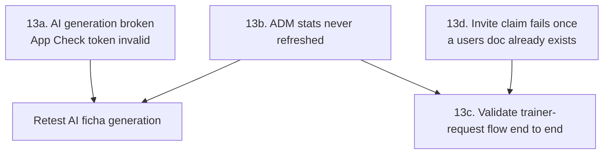
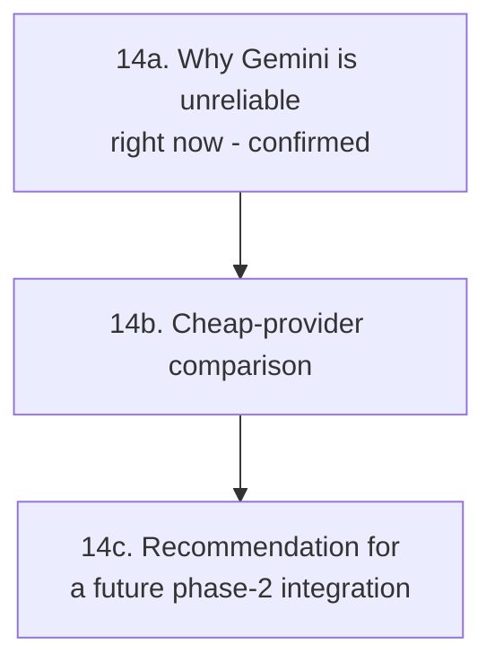
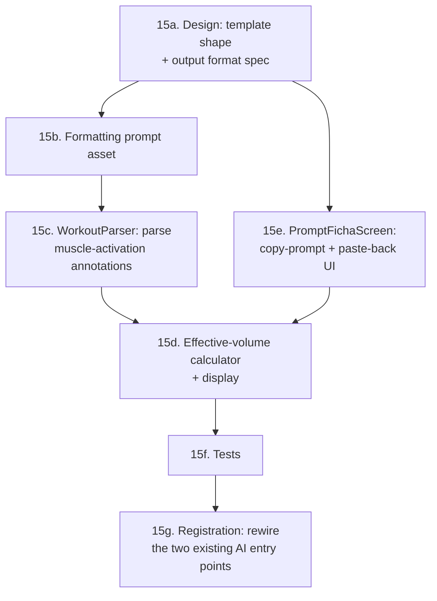
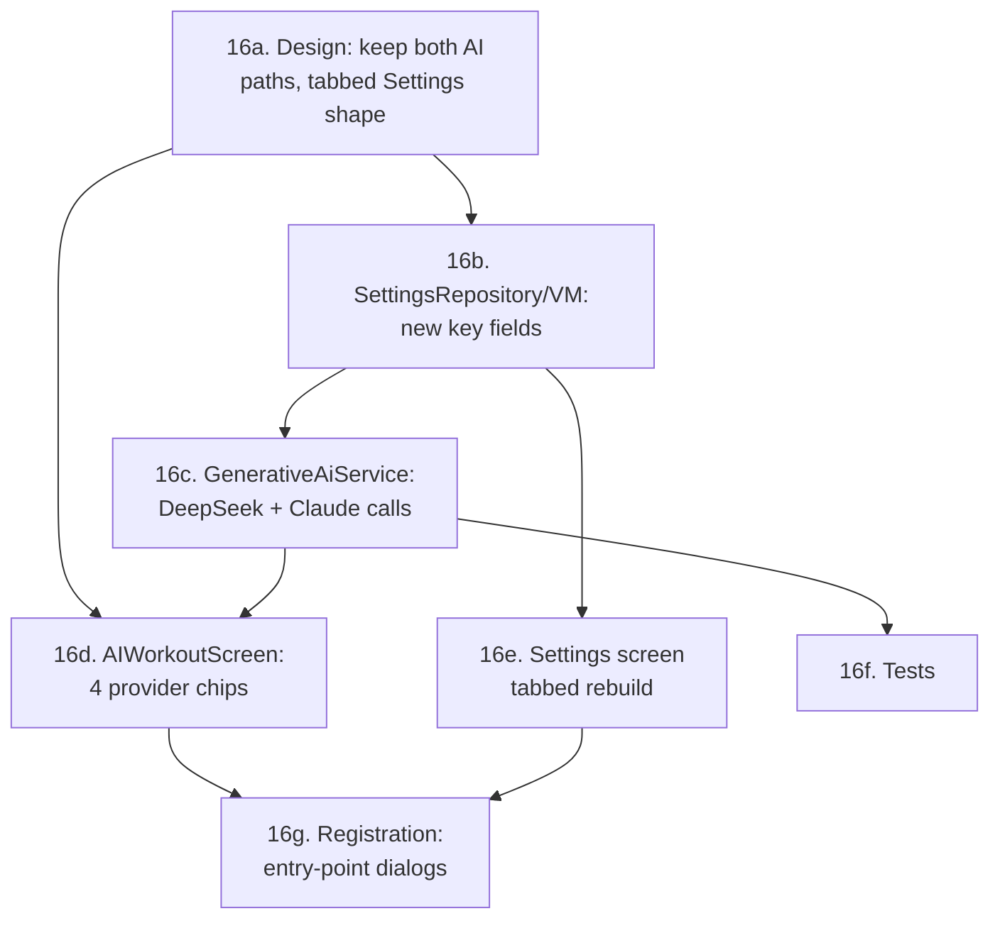
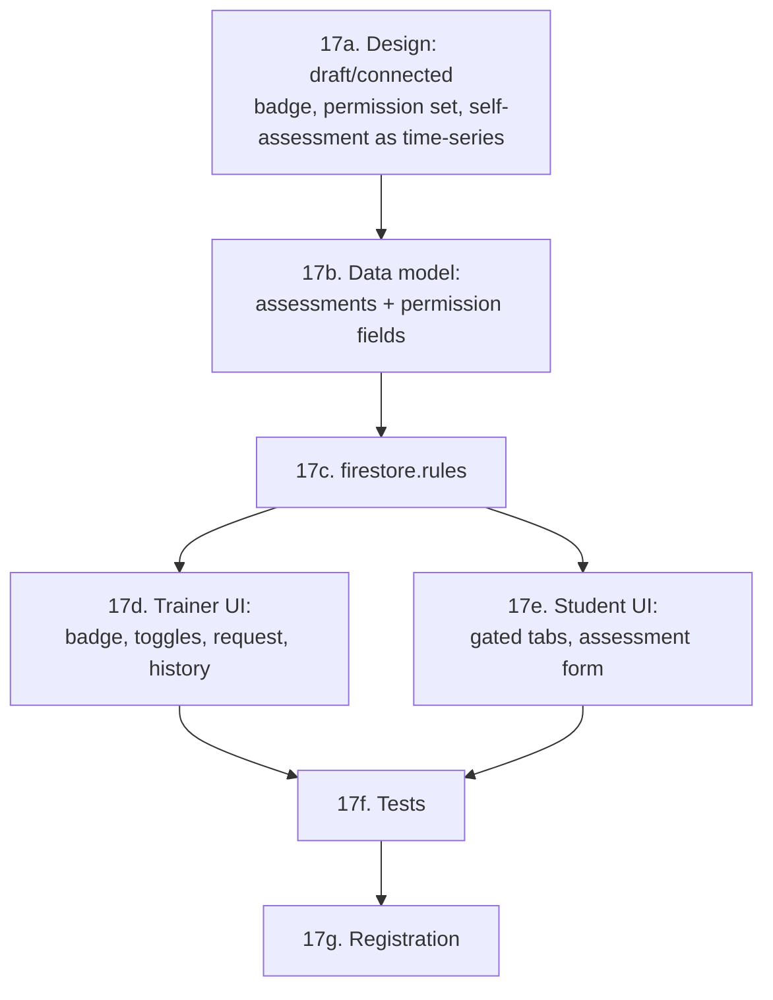
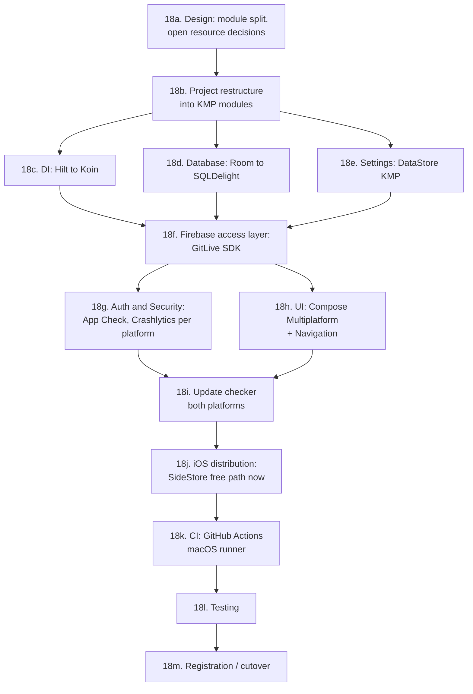
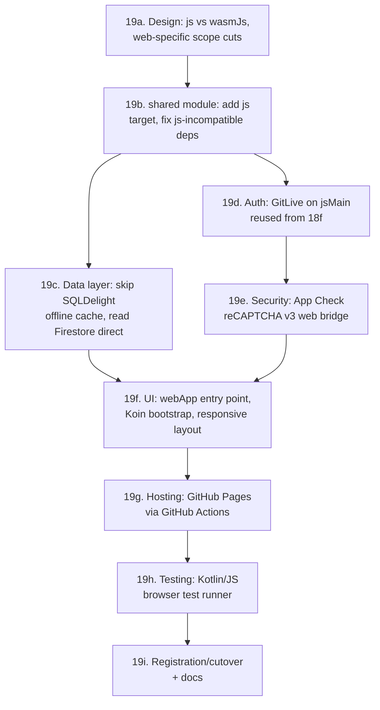
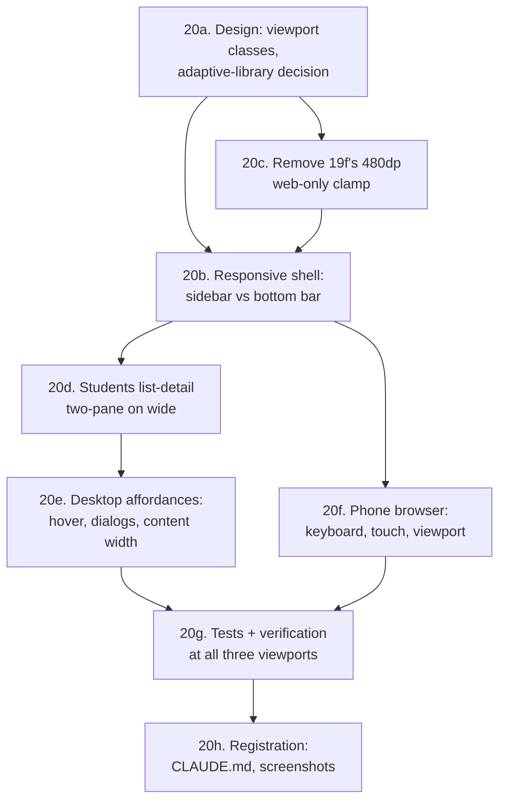
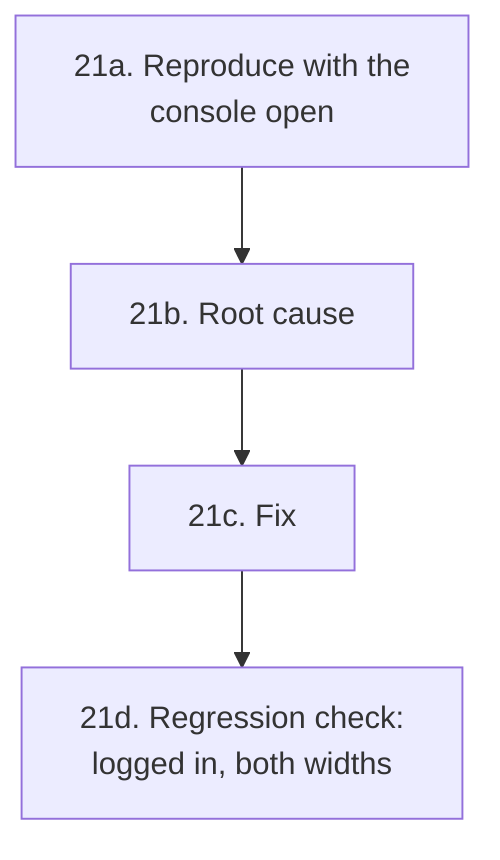
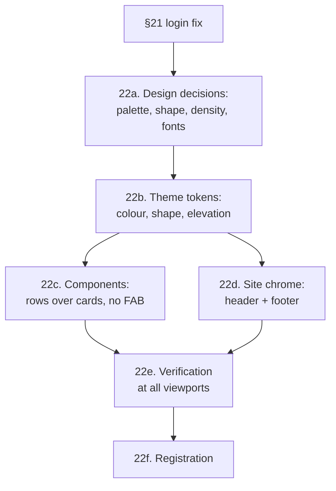

# GOALS.md — Personal Tracker (Android)

Master plan for the Personal Tracker app: native Android (Kotlin + Jetpack Compose) for
Personal Trainers to manage students, workouts, schedule and AI-generated training plans.

This file is the input for a future `/buildproject` execution pass. It reflects the **real
current state** of the codebase (read directly from source on 2026-08-15), not a greenfield
plan — items already implemented are checked off; everything else is what remains.

Stack (already chosen, in use): Kotlin, Jetpack Compose (Material 3), Room, Hilt, Navigation
Compose, DataStore, Firebase (Auth + Firestore), Google Generative AI SDK (Gemini), Clean
Architecture / MVVM. `compileSdk`/`targetSdk` = 37, `minSdk` = 24, AGP 9.3.1, Kotlin 2.3.20.

---

## Product goal (defined 2026-08-15, via `/newgoal`)

The app connects a Personal Trainer and their Students in one place, end to end:

1. The Trainer builds a workout plan ("ficha") for a student — manually or AI-assisted
   (already built, see §5) — and **assigns it to that student's account** (not built yet).
2. The Student has their **own login**, connected to their Trainer, and can see the ficha(s)
   assigned to them (not built yet — this is the entire missing "Student role", §4/§5).
3. When the Student trains, they **log what they actually lifted** (weight/reps performed per
   exercise, per session — "atualização de carga") back through the app. This is new: today
   the data model only stores the *planned* exercise (`Exercise` in `WorkoutEntity`) and a
   single `intensity` rating per session (`HistoryEntity`) — there is no record of actual
   performed weight/reps anywhere. A new "workout log" concept is required (§4).
4. The Trainer can see and **manage a per-student evolution report**: body metrics
   (weight/height/body fat — the `BiometricEntity` chart already exists, see §5) *plus* strength
   progression per exercise over time (new, depends on #3).
5. The UI should read as a finished, professional product, not a scaffold — see the concrete UI
   debt catalogued in §5.
6. Every pre-existing feature (student CRUD, manual/AI workout builder, schedule, settings)
   should be brought up to the same "professional and functional" bar — see the concrete gaps
   flagged inline in §5 and §9, not just the new features above.

This goal supersedes the earlier framing of §4 as "an open decision" — the Firestore migration
is now a confirmed requirement, not optional, because the Student login/sync flow directly
depends on it.

---

## 0. Toolchain / local setup
- [x] JDK 17 installed (Temurin, via winget).
- [x] Android `platform-tools` (adb) installed.
- [x] **Android SDK Platform 37 + matching build-tools installed** — `platforms;android-37.0` +
      `build-tools;37.0.0` installed via `sdkmanager`, `local.properties` created pointing at
      the project-local `android-sdk/` (the system `ANDROID_HOME` pointed at a nonexistent path).
- [x] `app/google-services.json` — created via Firebase Console, placed at `app/google-services.json`
      (`package_name` verified to match `com.example.personalapp`). `./gradlew assembleDebug`
      confirmed green (`processDebugGoogleServices` passes).
- [x] Firebase project confirmed working: Auth (Email/Password) enabled and Firestore Database
      created — both verified live via unauthenticated Identity Toolkit / Firestore REST probes
      (`INVALID_LOGIN_CREDENTIALS` and `403 PERMISSION_DENIED` respectively, not
      `CONFIGURATION_NOT_FOUND` / 404).

## 1. Project identity
- [x] `README.md` exists and accurately describes the app, stack and setup steps.
- [x] `CLAUDE.md` added at the project root: role-routing model (`RoleRouter.kt`), the
      Firestore-source-of-truth + Room-cache data layer (updated to match the §4a migration, not
      the old "local-only" description), the Smart Paste parsing heuristic (`WorkoutParser.kt`),
      and the AI-workout entry points (now two, see the `WorkoutBuilderScreen` finding above).
- [x] **Module documentation strategy (decided 2026-08-17):** don't add a separate `docs/` tree
      that will drift from the code — keep `CLAUDE.md` for cross-cutting conventions (routing,
      data-layer shape, parsing quirks) and add a short KDoc block (`/** ... */`) directly on
      classes whose *purpose* isn't obvious from their name/members alone. Done: `TrainerRepository`
      (Firestore-as-source-of-truth explanation), `FirestoreMappers.kt` (why plain maps, not POJO
      reflection), `WorkoutParser` (sets-vs-reps heuristic, moved from a code comment to a proper
      doc comment), `AdminViewModel` (why it reads Firestore directly instead of going through
      `TrainerRepository`). `AppLogger` never ended up existing — §5e's Logs tab was built directly
      on Firebase Crashlytics instead, so that part of the original item is moot.

## 2. Version control
- [x] Git repository, remote configured (`github.com/alexmiguel011014-stack/Personal_app_android`) —
      the local folder had no `.git` at all until this session (the outer `sites/` monorepo
      deliberately excludes this project via its own `.gitignore`); initialized locally, synced
      onto the existing remote history via `git reset --soft`, dedicated SSH key added, pushed.
- [x] `.gitignore` covers build artifacts, `.idea` noise, `google-services.json`, and (as of this
      session) `android-sdk/`, `graphify-out/`, `repomix-output.xml`.
- [x] No secret committed (`google-services.json` and API keys are correctly gitignored/never
      hardcoded — keys are user-entered at runtime, see §8 for why that itself is a risk).

## 3. Backend (Firebase + planned AI proxy)
- [x] Firebase Auth wired for email/password login (`AuthRepository.login`).
- [x] Role read from `Firestore: users/{uid}.role` on login (`ADM`/`TRAINER`/`STUDENT`).
- [x] **Decision reversed 2026-08-18** (superseding the same-day decision above to keep
      per-trainer keys): the user chose to stay on Firebase's free Spark plan rather than upgrade
      to Blaze, which rules out the Cloud Function proxy entirely (Cloud Functions can't deploy on
      Spark at any usage level, zero or not). Within that constraint, migrated Gemini to the
      **Firebase AI Logic SDK** (`com.google.firebase:firebase-ai`, Gemini Developer API backend)
      instead — free on Spark, officially maintained (replaces the deprecated
      `com.google.ai.client.generativeai`), and fixes the original raw-client-key security concern
      (unrestricted/standard Gemini keys being retired by Google through Sept 2026) because there
      is no client-held key anymore: `Firebase.ai(backend = GenerativeBackend.googleAI())` calls
      are authenticated via the project's own Firebase config + App Check (already wired, §8),
      not a key typed into Settings. Traded away "each trainer brings their own Gemini key" — the
      app now uses one Gemini configuration for the whole project, managed by the app owner in the
      Firebase Console, not per-trainer. **OpenAI is unaffected and still per-trainer** (raw HTTP
      call, no Firebase billing involved) — kept in Settings as the opt-in "bring your own key"
      alternative for trainers who want it, so the product still offers a BYO-key path, just not
      for Gemini specifically. Implemented in `GenerativeAiService.kt`
      (`generateWithGemini()`), `SettingsRepository`/`SettingsViewModel`/`SettingsScreen.kt`
      (Gemini key field removed), `AdminViewModel`/`AdminDashboardScreen.kt` (Gemini status row is
      now a static "always on" indicator, not a per-device key check). Removed the deprecated SDK
      dependency and its now-orphaned version catalog entries. Verified via
      `./gradlew compileDebugKotlin verify` (all green). **New manual step, only doable by the
      user**: enable Gemini access for the project in Firebase Console → Build → AI Logic → Get
      started → choose "Gemini Developer API" (free) — the SDK call will fail at runtime until
      that's done, same category as the two other pending manual Console steps (publish
      `firestore.rules`, enable App Check enforcement — see §8).
- [x] Gemini model id updated: `gemini-1.5-pro` → `gemini-3.7-flash` (current stable as of
      2026-08-18; verify against https://firebase.google.com/docs/ai-logic/models before relying
      on it long-term, Google sunsets model ids on a rolling schedule).
- [x] `com.google.ai.client.generativeai` (deprecated SDK) removed entirely, replaced by the
      Firebase AI Logic SDK per the decision above.

## 4. Database — Firestore sync + new workout-log model

**4a. Firestore as source of truth (confirmed requirement — see Product goal)**
- [x] Room local DB (`AppDatabase`, v5) with entities: `UserEntity`, `BiometricEntity`,
      `WorkoutEntity`, `HistoryEntity`, `ScheduleEntity`. Full CRUD via `AppDao`/`TrainerRepository`.
- [x] `TrainerRepository` migrated: every write (students/workouts/biometrics/schedules/workoutLogs)
      goes to Firestore (`FirestoreMappers.kt` entity↔doc mapping) in addition to Room; a
      `startListening(trainerId)` snapshot listener per collection mirrors Firestore changes back
      into Room (upsert on ADDED/MODIFIED, delete on REMOVED); every screen still reads Room, now
      via `Flow` end-to-end (`getBiometricsByUser`/`getActiveWorkoutsByStudent` converted from
      one-shot suspend calls so the UI updates reactively when the listener writes land). Wired to
      start on trainer login / stop on logout in `AuthViewModel`. `HistoryEntity` intentionally
      stays Room-only (superseded by `workoutLogs`, see Product goal #3). Verified via
      `./gradlew assembleDebug` — not runtime-tested against a live device/emulator (none set up
      in this environment); the Student-side write path (§5b) doesn't exist yet, so the
      `workoutLogs` sync direction is exercised by the listener/rules but has no writer yet.
- [x] Firestore schema, per-trainer scoped (`trainerId` field on every doc), implemented for
      `students`, `workouts` (incl. `status`/`assignedAt`), `biometrics`, `schedules`,
      `workoutLogs` — matches `firestore.rules`. **Not done:** `trainerId` on the Student's own
      `users/{uid}` doc — that's set by the §7 linking mechanism, which is blocked on the Blaze
      plan decision (Cloud Function), so there's no writer for it yet.
- [x] New Room entity `WorkoutLogEntity` + `PerformedSet` (`data/model/PerformedSet.kt`,
      `data/local/entity/WorkoutLogEntity.kt`) — same JSON-in-column pattern as `Exercise`.
- [x] Room migration strategy: `exportSchema = true` (schema committed at
      `app/schemas/.../6.json`), real `MIGRATION_5_6` (adds `workouts.status`/`assignedAt`,
      creates `workout_logs`) registered via `.addMigrations(...)`, `fallbackToDestructiveMigration`
      kept only as a safety net for anything without an explicit migration path.

## 5. Frontend (Jetpack Compose)

**5a. Existing (Trainer/ADM side)**
- [x] **Trainer role** — fully built and routed (`AppNavigation.kt`): Main (students list +
      bottom-nav tabs including `ScheduleScreen`), AddStudent, EditStudent, StudentDetails,
      ManualWorkout (detailed exercise builder), WorkoutBuilder, AIWorkout (Gemini generation +
      "Smart Paste" import via `WorkoutParser.kt`), Settings (API key entry).
- [x] **ADM role** — `AdminDashboardScreen` exists and is routed from `RoleRouter`; all three tabs
      are now real (see §5e — done 2026-08-17 via `/execgoals`).
- [x] Evolution/biometrics chart exists: `Components.kt` has a custom `WeightChart` (Compose
      `Canvas`, hand-drawn line + points), used from `StudentDetailsScreen`. No charting library
      dependency — keep it that way; extend this same component for exercise-load progression
      (5c) instead of adding a charting library.

**5b. Student role (Product goal #2) — done 2026-08-17 via `/execgoals`**
- [x] `RoleRouter` now routes `Authenticated(STUDENT)` with a claimed `trainerId` to a real
      `StudentNavigation` (bottom nav: Treinos / Evolução), instead of the old dead-end message
      card. Unclaimed students still see `LoginScreen`'s invite-code entry (§7).
      - **My Workouts** (`StudentWorkoutsScreen`) — read-only list of ficha(s) the Trainer assigned
        (`workouts` where `studentId == me && status == assigned`), expandable per-card to show
        exercises/sets/reps/weight targets.
      - **Log Session** (`StudentLogSessionScreen`) — per exercise in the workout, the Student
        enters sets × weight × reps performed and submits — writes one `workoutLogs` doc per
        exercise (§4a). This is the "atualização de carga" from Product goal #3.
      - **My Evolution** (`StudentEvolutionScreen`) — biometrics chart (`WeightChart`) +
        per-exercise load-progression chart (`ExerciseProgressionChart`, shared with §5c).
      - New `StudentRepository` reads straight from Firestore (`callbackFlow` snapshot listeners)
        instead of Room — the student's device never runs `TrainerRepository.startListening`, so
        Room would be empty there. Writes reuse `TrainerRepository.insertWorkoutLog`.
      - Verified via `./gradlew compileDebugKotlin testDebugUnitTest lint` (all pass) — not
        runtime-tested against a live device/emulator (none set up in this environment).

**5c. Trainer — receiving updates + evolution report (Product goal #3, #4) — done 2026-08-17**
- [x] "Atividade Recente" section added to `StudentDetailsScreen` listing the student's latest
      logged sessions (date, exercise, weight/reps), sourced from `TrainerRepository`'s existing
      `workoutLogs` Room mirror (already real-time via the §4a snapshot listener — no new listener
      needed). No push notifications added, per the original "don't add FCM" scope note.
- [x] `WeightChart` generalized into a `LineChart(points, emptyMessage)` reusable component
      (`Components.kt`); `WeightChart` is now a thin wrapper over it. New `ExerciseProgressionChart`
      (exercise picker + `LineChart`) built once and shared by both `StudentDetailsScreen` (Trainer
      side) and `StudentEvolutionScreen` (Student's own view).

**5d. Concrete UI/professionalism debt (Product goal #5, #6) — found while reading the code**
- [x] `DayAgendaItem`'s "add appointment" button — turned out to already be fixed: `ScheduleScreen.kt`
      has its own working `DayAgendaItem(day, schedules, students, onBookSlot)` wired to
      `viewModel.bookSlot(...)` → `repository.insertSchedule(...)`. The unwired duplicate this item
      described lived in `Components.kt` as dead code (different signature, never called from
      anywhere) — deleted it.
- [x] Hardcoded colors swept across every screen (`Components.kt`, `ScheduleScreen.kt`,
      `WorkoutBuilderScreen.kt`, `AdminDashboardScreen.kt`, `StudentDetailsScreen.kt`,
      `StudentsScreen.kt`, `ManualWorkoutScreen.kt`, `LoginScreen.kt`, `AIWorkoutScreen.kt`) and
      replaced with `MaterialTheme.colorScheme` tokens. Gender card tint now sources
      `tertiaryContainer`/`secondaryContainer` as suggested. Added one shared `SuccessGreen`
      constant (`Components.kt`) for the "active/online" indicators M3 has no built-in role for,
      instead of the same hex duplicated across files.
- [x] Loading/empty/error state sweep: the explicit examples named here (empty students list,
      empty workout list) turned out to already exist (`StudentsScreen`, `WorkoutBuilderScreen`).
      Added the one genuinely missing case found: an empty-exercises-list state in
      `ManualWorkoutScreen`. Did not build a general loading-skeleton system — no screen is
      Firestore-mid-load blocking today (offline-first Room reads are synchronous from cache).
- [x] Form validation added: `AddStudentScreen`, `EditStudentScreen` (name required, at least one
      training day required, inline `supportingText` errors) and `ManualWorkoutScreen` +
      `AddExerciseDialog` (workout name / exercise name required, inline errors) — all previously
      silent no-ops on missing required fields.
- [x] **`WorkoutBuilderScreen.kt`'s "Criar Manual"/"Criar com IA" buttons wired** —
      `onNavigateToManual`/`onNavigateToAI` params added, call the existing `ManualWorkout`/
      `AIWorkout` routes (same pattern already used from `StudentDetailsScreen`). **Found while
      wiring: the screen itself was completely unreachable** — no button anywhere navigated to
      `Screen.WorkoutBuilder`; `StudentDetailsScreen`'s own "Ficha Personal" button already
      reached the AI/Manual screens directly via a dialog, bypassing `WorkoutBuilderScreen`
      entirely. Since `WorkoutBuilderScreen` additionally lists all active workouts with
      edit/toggle/delete (which the read-only list on `StudentDetailsScreen` doesn't have), user
      decision: keep both, link it — added a "Gerenciar" button next to `StudentDetailsScreen`'s
      "Fichas de Treino" header navigating to `Screen.WorkoutBuilder.createRoute(studentId)`.
      Verified via `./gradlew assembleDebug`.
      - [x] **Done 2026-08-26**: built exactly the option this note favored — reused
        `ManualWorkoutScreen`, prefilled, calling `updateWorkout` instead of `insertWorkout`, not a
        new screen. New `Workouts.sq` query `getWorkoutById`, `AppDao`/`TrainerRepository`
        `getWorkoutById()`, and `WorkoutViewModel.editingWorkout`/`loadWorkoutForEdit()`/
        `updateWorkout()`. `ManualWorkoutScreen` takes an optional `workoutId: String? = null`;
        when present it loads and prefills name/exercises, retitles to "Editar Treino"/"Salvar
        Alterações", and saves via `existing.copy(...)` + `updateWorkout` (keeping the original
        `id`/`isActive`/`createdAt`/`status`/`assignedAt`) instead of building a new entity. New
        route `Screen.EditWorkout("edit_workout/{studentId}/{workoutId}")` in `AppNavigation.kt`;
        `WorkoutCard`'s edit `IconButton` now calls a real `onEdit` callback instead of the empty
        `/* Editar */` lambda. Verified via `:app:compileDebugKotlin` + `verify` + `assembleDebug`
        + `compileDebugAndroidTestKotlin`, all green locally. **Live-verified 2026-08-27**: on
        the real device, created a workout, opened it via the edit icon (title/FAB correctly read
        "Editar Treino"/"Salvar Alterações", name and exercise list prefilled), changed the name,
        saved — the list showed one updated entry, not two, confirming `updateWorkout` replaced
        the existing row instead of inserting a second one.

- [x] **AI ficha generation — ground it in the hypertrophy volume reference table (researched
      2026-08-17 via `/newgoal`, user supplied the actual PDF this session:
      `tabela_volume_direto_indireto_hipertrofia_final_v9.pdf`, 4 pages, ~15.7KB). Implemented
      2026-08-17 via `/execgoals` (approach 1, text-embedding — see below): asset created at
      `app/src/main/assets/hypertrophy_volume_reference.md` with the exact content specified;
      `GenerativeAiService` now takes `@ApplicationContext Context` (Hilt), reads the asset once
      (`by lazy`, the service is `@Singleton`), and appends it plus a short usage instruction to
      `buildPrompt()` — applies to both `AiProvider.GEMINI` and `AiProvider.OPENAI` since both go
      through the same `buildPrompt()`. `AIWorkoutViewModel`'s JSON-parsing contract untouched, as
      planned. Verified via `./gradlew compileDebugKotlin testDebugUnitTest lint` (all pass, one
      pre-existing `@param:` annotation-target warning, same pattern already present in
      `SettingsRepository`) — **not yet verified against a live API call** (no
      `google-services.json`/real Gemini or OpenAI key in this environment) — first real
      generation should be checked for whether the model actually references the table in its
      exercise choices, not just that the code compiles.**

      Before this, `GenerativeAiService.generateWorkout()` sent only a text prompt built from the
      student's profile fields (§3) to whichever provider is selected (`AiProvider.GEMINI`/
      `OPENAI`, done 2026-08-17 via `/execgoals`, see §5e). Goal: make the AI balance weekly volume
      per muscle group using this table instead of general knowledge alone, for both providers.
      - **What the PDF actually is** (read directly, not guessed): a scoring table, not prose —
        for ~70 named exercises across 6 categories (Empurrar, Puxar, Quadril/joelho, Posterior/
        hinges, Monoarticulares, Core/calistenia), each exercise has a 0–1.0 score per muscle
        (1.0 = direct/primary target, 0.75 = strong secondary, 0.5 = relevant indirect, 0.25 =
        low, 0 = don't count), representing how much one hard set of that exercise counts toward
        that muscle's weekly effective hypertrophy volume. Plus a short RIR-based adjustment
        section (§7 of the PDF: full value at 0–2 RIR, secondaries −0.25 at 3–4 RIR, half-or-zero
        at 5+ RIR) and a sourced-references section (Schoenfeld, Kubo, Plotkin, etc. — informational
        provenance, not needed at inference time).
      - **Two technical approaches researched — recommendation: text-embedding, not raw PDF
        upload:**
        1. **Recommended — extract once, embed as text in the existing prompt.** Convert the
           table to a compact Markdown block (see exact content below) bundled as an Android
           asset, and append it to `buildPrompt()`'s existing string for **both** providers,
           unchanged from today's plain-text call shape (`content { text(fullPrompt) }` for
           Gemini, the existing JSON `messages` array for OpenAI). No SDK migration needed, no
           multimodal API differences to reconcile between providers, no per-call PDF
           reprocessing cost, and no OCR/table-transcription risk — the numbers are guaranteed
           byte-exact instead of hoping the model reads a rendered table correctly. This is the
           better engineering choice specifically *because* the source document is already small,
           dense, and precisely structured — text-embedding a lossy-transcription risk that raw
           multimodal input carries for exactly this kind of tabular reference.
        2. **Alternative — native multimodal PDF upload (not recommended here, but real and
           available if the reference material later becomes large/prose-heavy/frequently
           changing).** Researched current (2026-08-17) capabilities for both providers:
           - **Gemini**: supported via `content { inlineData(bytes = pdfBytes, mimeType =
             "application/pdf") }`, but only on the **Firebase AI Logic SDK**
             (`com.google.firebase:firebase-ai`) — the deprecated SDK this project still uses
             (`com.google.ai.client.generativeai`) doesn't have this call shape, so approach 2
             would force the §3 SDK migration as a hard prerequisite. Limits confirmed via
             Firebase's own input-file-requirements page: 50MB/file, 1000 pages/file, but **the
             *inline* request total is capped at 20MB** (PDFs are tokenized like images) —
             irrelevant at this PDF's 15.7KB, but worth knowing if a bigger reference doc is used
             later. (Source: firebase.google.com/docs/ai-logic/input-file-requirements)
           - **OpenAI**: also now supports direct PDF input to Chat Completions (base64 or file
             URL; the API extracts text *and* renders page images internally for vision-capable
             models like `gpt-4o`/`gpt-4o-mini`) — this is new since the original 2026-08-16
             research pass, which had assumed OpenAI needed the Files API/assistants flow. Real
             caveats found: PDF input burns meaningfully more tokens than plain text (whole pages
             processed as images), file inputs are capped at 100 pages / 32MB per request, and
             there are open community bug reports of inconsistent extraction ("works with some
             API keys but fails for others" — community.openai.com/t/1390246). (Source:
             platform.openai.com/docs/guides/pdf-files, openai.com dev announcement.)
           - Bottom line: approach 2 is viable for *both* providers today, but costs more tokens
             per call, adds a real transcription-fidelity risk for a table this precise, and for
             Gemini specifically reopens the not-yet-done SDK migration as a blocker. Don't build
             this now; revisit only if a future reference document doesn't compress well to text
             (e.g. a large illustrated exercise-technique guide).
      - **Implementation shape (approach 1) for `/execgoals`:**
        1. Create `app/src/main/assets/hypertrophy_volume_reference.md` with exactly the content
           block below (already extracted and condensed from the PDF — the long "why this score"
           prose and the academic-citations section are dropped, since they inform *how the table
           was built*, not how the model should *use* it; keeping them would just burn prompt
           tokens on every single generation call for no behavioral benefit).
        2. `GenerativeAiService` needs `@ApplicationContext Context` added to its constructor
           (Hilt-provided, no new module needed) to read the asset via
           `context.assets.open("hypertrophy_volume_reference.md").bufferedReader().use { it.readText() }`
           — cache it in a `private val` (read once per `GenerativeAiService` instance, it's
           `@Singleton`, not per-call).
        3. Append the reference text to `buildPrompt()`, after the existing student-profile block,
           with a short instruction wrapping it — e.g. (adjust wording to match the existing
           prompt's tone, don't just concatenate verbatim):
           ```
           Use a tabela de referência abaixo para balancear o volume semanal por grupo muscular ao
           escolher e distribuir os exercícios da ficha. Cada valor indica quanto uma série "dura"
           daquele exercício conta como volume efetivo de hipertrofia para aquele músculo (0 a
           1,0; ver a régua de pontuação). Priorize cobrir os grupos musculares relevantes ao
           objetivo do aluno sem concentrar volume demais em poucos músculos.

           {reference text}
           ```
        4. No change needed to `AIWorkoutViewModel`'s JSON-parsing contract (`AIWorkoutResponse`/
           `AIWorkout`/`AIExercise`) — the reference table only changes what grounds the model's
           choice of exercises/sets, not the requested output shape. Confirmed unchanged from the
           original 2026-08-16 research.
        5. This is a **fixed reference bundled for every trainer**, not a per-trainer configurable
           upload — matches the actual ask (the user supplied one specific table they trust, not
           "let each trainer bring their own"). If per-trainer custom references become a real
           want later, that's a distinct, larger feature (Settings upload + storage +
           per-generation file selection) — don't build it speculatively now.
        6. **No longer coupled to §3's SDK migration** — unlike the original 2026-08-16 draft of
           this item, approach 1 works today on the current (deprecated but functional)
           `com.google.ai.client.generativeai` SDK for Gemini and on the existing
           `HttpURLConnection` call for OpenAI. §3's SDK migration is still worth doing for its own
           reasons (client-side key exposure, general deprecation), just no longer a prerequisite
           for this feature. (§3's cross-reference to this item has been corrected accordingly.)
        7. Token-cost note: the condensed Markdown block below is roughly 1.5–2k tokens, added to
           *every* `generateWorkout()` call for *both* providers. Acceptable at this size; if the
           reference table grows substantially later, consider trimming rarely-relevant exercise
           categories per-call based on the student's stated training days, rather than always
           sending the whole table — not needed at today's size, don't build it preemptively.

      **Exact content for `app/src/main/assets/hypertrophy_volume_reference.md`:**
      ```markdown
      # Tabela de Volume Direto/Indireto para Hipertrofia

      Estima quanto uma série dura de um exercício conta para a hipertrofia provável de cada
      músculo (não é % de ativação, não precisa somar 1 na mesma linha). Use para séries de boa
      qualidade, amplitude adequada, ~0-3 reps em reserva.

      Régua: 1,0 = volume direto/alvo principal · 0,75 = secundário muito forte/quase direto ·
      0,5 = indireto relevante · 0,25 = participação baixa · 0 = não contar.

      ## Empurrar
      | Exercício | Peitoral | Delt. ant. | Delt. lat. | Delt. post. | Tríceps geral | Cabeça longa tríceps |
      |---|---|---|---|---|---|---|
      | Supino reto | 1 | 0,5 | 0 | 0 | 0,5 | 0,25 |
      | Supino inclinado | 1 | 0,75 | 0 | 0 | 0,5 | 0,25 |
      | Paralela inclinada / foco peito | 1 | 0,5 | 0 | 0 | 0,75 | 0,25 |
      | Paralela vertical / foco tríceps | 0,75 | 0,5 | 0 | 0 | 1 | 0,25 |
      | Tríceps banco alta amplitude | 0,5 | 0,5 | 0 | 0 | 1 | 0,25 |
      | Desenvolvimento vertical | 0,25 | 1 | 0,75 | 0 | 0,5 | 0,25 |
      | Flexão tradicional | 1 | 0,5 | 0 | 0 | 0,5 | 0,25 |

      ## Puxar
      | Exercício | Latíssimo/redondo maior | Trapézio médio/romboides | Delt. post. | Bíceps | Braquial/braquiorradial |
      |---|---|---|---|---|---|
      | Puxada/barra fixa pronada | 1 | 0,25 | 0,25 | 0,5 | 0,5 |
      | Puxada/barra fixa neutra | 1 | 0,25 | 0,25 | 0,5 | 0,75 |
      | Puxada/barra fixa supinada | 1 | 0,25 | 0,25 | 0,75 | 0,5 |
      | Remada neutra cotovelo junto | 1 | 0,75 | 0,5 | 0,5 | 0,75 |
      | Remada supinada cotovelo junto | 1 | 0,75 | 0,5 | 0,75 | 0,5 |
      | Remada aberta / high row | 0,5 | 1 | 1 | 0,5 | 0,5 |
      | Remada australiana pronada | 1 | 1 | 1 | 0,5 | 0,5 |
      | Remada australiana supinada | 1 | 0,75 | 0,75 | 0,75 | 0,5 |

      ## Quadril e joelho (agachamentos, leg press, unilaterais)
      | Exercício | Vastos/quadríceps | Reto femoral | Isquios | Glúteo máx. | Glúteo médio | Adutores | Eretor |
      |---|---|---|---|---|---|---|---|
      | Agachamento profundo | 1 | 0,25 | 0,25 | 1 | 0,25 | 1 | 0,5 |
      | Agachamento sumô | 1 | 0,25 | 0,25 | 0,75 | 0,25 | 1 | 0,25 |
      | Leg press 45° profundo | 1 | 0,25 | 0,25 | 1 | 0 | 0,75 | 0 |
      | Leg press 180° profundo | 1 | 0,25 | 0,25 | 1 | 0 | 0,75 | 0 |
      | Leg press 180° unilateral profundo | 1 | 0,25 | 0,25 | 1 | 0,25 | 0,75 | 0 |
      | Hack squat | 1 | 0,25 | 0 | 0,5 | 0 | 0,5 | 0 |
      | Afundo padrão | 1 | 0,25 | 0,25 | 0,75 | 0,5 | 0,5 | 0 |
      | Búlgaro | 1 | 0,25 | 0,5 | 1 | 0,5 | 0,5 | 0 |
      | Agachamento unilateral | 1 | 0,25 | 0,5 | 1 | 0,75 | 0,5 | 0 |
      | Step-up médio/alto | 1 | 0,25 | 0,5 | 1 | 0,75 | 0,5 | 0,25 |

      ## Posterior, glúteo e hinges
      | Exercício | Vastos/quadríceps | Reto femoral | Isquios | Glúteo máx. | Glúteo médio | Adutores | Eretor | Gastrocnêmio |
      |---|---|---|---|---|---|---|---|---|
      | Stiff | 0 | 0 | 1 | 0,75 | 0 | 0,25 | 0,75 | 0 |
      | RDL | 0 | 0 | 1 | 0,75 | 0 | 0,25 | 0,5 | 0 |
      | Terra convencional | 0,5 | 0 | 0,5 | 0,75 | 0 | 0,25 | 1 | 0 |
      | Terra sumô | 0,5 | 0 | 0,5 | 0,75 | 0,25 | 1 | 0,5 | 0 |
      | Elevação pélvica / hip thrust | 0 | 0 | 0,25 | 1 | 0,25 | 0 | 0 | 0 |
      | Flexão nórdica / Nordic | 0 | 0 | 1 | 0 | 0 | 0 | 0 | 0,25 |

      ## Monoarticulares e isolados (alvo 1,0 → outros níveis)
      | Exercício | 1,0 | 0,75 | 0,5 | 0,25 |
      |---|---|---|---|---|
      | Cadeira extensora | Vastos; reto femoral; quadríceps | - | - | - |
      | Mesa/cadeira flexora | Isquiotibiais | - | - | Gastrocnêmio (se tornozelo dorsifletido) |
      | Panturrilha em pé | Gastrocnêmio | Sóleo | - | - |
      | Panturrilha sentada | Sóleo | - | - | Gastrocnêmio |
      | Elevação lateral | Deltoide lateral | - | - | Delt. ant.; post.; trapézio superior |
      | Crucifixo inverso | Deltoide posterior | - | Trapézio médio/romboides | - |
      | Peck deck / crucifixo | Peitoral | - | - | Deltoide anterior |
      | Rosca supinada / Scott / 45° / Bayesian | Bíceps braquial | - | Braquial | Braquiorradial |
      | Rosca martelo | Braquial/braquiorradial | Bíceps braquial | - | - |
      | Rosca reversa | Braquiorradial/braquial | - | - | Bíceps braquial |
      | Tríceps pushdown | Tríceps geral | Cabeça longa | - | - |
      | Tríceps overhead/francês | Tríceps geral; cabeça longa | - | - | - |
      | Tríceps coice/coreano | Tríceps geral | - | Cabeça longa | Delt. post./latíssimo |
      | Cadeira abdutora | Glúteo médio/mínimo | - | TFL | Glúteo máximo (fibras superiores) |
      | Cadeira adutora | Adutores | - | - | - |
      | Pulldown braços estendidos | Latíssimo/redondo maior | - | - | Delt. post.; cabeça longa tríceps; peitoral esternal |

      ## Core, calistenia e peso corporal
      | Exercício | 1,0 | 0,75 | 0,5 | 0,25 |
      |---|---|---|---|---|
      | Abdominal na rodinha | Reto abdominal | Oblíquos; core profundo | - | Serrátil; peitoral; latíssimo; tríceps |
      | Prancha abdominal tradicional | - | - | Reto abdominal; oblíquos; core profundo | Serrátil; deltoide ant.; eretor; glúteo máx.; reto femoral |
      | Muscle-up estrito | Latíssimo/redondo maior | Bíceps; peitoral; tríceps geral; antebraço | Braquial/braquiorradial; deltoide ant.; trapézio/romboides; serrátil; core | Deltoide posterior |

      ## Ajustes por RIR (aplicar antes de somar volume)
      - 0-2 RIR e boa amplitude: valor cheio.
      - 3-4 RIR: mantém o principal se a série foi desafiadora, mas reduz secundários em 0,25.
      - 5+ RIR: conta no máximo metade do valor, ou não conta.
      - Músculo-alvo não foi limitante (ex.: stiff interrompido pela lombar antes dos posteriores):
        reduza o valor, não conte como 1.
      ```

**5e. ADM Dashboard — currently 100% mocked (found 2026-08-17, from a real-device screenshot
after the first successful ADM login).** All three tabs render fixed data that never changes and
don't reflect anything real. Each needs its own fix:

- [x] **Logs tab — done 2026-08-17, user chose "Proper (fleet-wide)".** Wired Firebase Crashlytics
      (`firebase-crashlytics` + Gradle plugin) instead of a Room-based log viewer. Catch blocks in
      `GenerativeAiService` (both providers) and `TrainerRepository`'s snapshot listeners now call
      `FirebaseCrashlytics.getInstance().recordException(...)` — previously fully silent.
      Deliberately **not** wired into `AuthRepository`'s login/register/resetPassword/claimInvite
      catch blocks: those are routine, already-user-surfaced failures (wrong password, invalid
      invite code), not silent bugs — recording every failed login as a Crashlytics exception
      would be noise, not signal. Since Crashlytics has no client-side read API, `LogsTab` no
      longer shows an inline log list — it explains where errors go now and links to
      `console.firebase.google.com/project/{projectId}/crashlytics` (project id read at runtime
      from `FirebaseApp.getInstance().options`). "Copiar"/"Limpar" removed (nothing to copy/clear
      locally anymore).
      - **Compat note:** `firebase-crashlytics-gradle:3.0.0` has a known circular-dependency bug
        with KSP (`injectCrashlyticsMappingFileIdDebug` ↔ `kspDebugKotlin`, confirmed via
        upstream GitHub issues firebase/firebase-android-sdk#5925 and #5930); pinned to `3.0.7`
        (latest patch, includes the fix) instead. `2.9.9` (the suggested workaround before the
        patch) doesn't work either — it uses the removed `applicationVariants` API against this
        project's AGP 9.3.1.
- [x] **Gestão tab — done 2026-08-17.** New `AdminViewModel` (`FirebaseFirestore` injected
      directly, ADM-only cross-trainer data). "Personais"/"Total Usuários" cards use the researched
      count-aggregation query; "Personais Ativos" lists real trainer docs (`get()` on
      `role == "TRAINER"`, name only for now). No `firestore.rules` change needed, as researched
      (`isAdmin()` doesn't depend on `resource.data`, so it's provable for the whole query).
- [x] **APIs tab — done 2026-08-17, user chose "Implementar de verdade" for OpenAI** (not the
      recommended removal). `GenerativeAiService` now takes an `AiProvider` (GEMINI/OPENAI);
      `AIWorkoutScreen` got a Gemini/ChatGPT `FilterChip` toggle. OpenAI calls
      `api.openai.com/v1/chat/completions` (`gpt-4o-mini`) via plain `HttpURLConnection` +
      `kotlinx.serialization` — no new HTTP dependency (OkHttp/Retrofit) for one POST call.
      Status rows: Firestore does a real `.limit(1).get()` probe with a 5s timeout (Online/
      Offline); Gemini/OpenAI show "Configurada"/"Não configurada" **for this device only**, with
      an explicit caption explaining why — both are still per-trainer keys (§3), so there is no
      single fleet-wide "is AI online" signal until the §3 Cloud Function proxy exists.

## 6. Connectivity
- [x] Client↔Firestore sync strategy per §4: snapshot listeners (`TrainerRepository.startListening`,
      `addSnapshotListener`), not one-shot fetches; Firestore's built-in offline cache is used as-is,
      no custom queue.
- [x] Trainer→Student ficha assignment is a Firestore write (`WorkoutEntity.status` flips
      `draft`↔`assigned`) the Student's snapshot listener picks up (`StudentRepository`'s
      `whereEqualTo("status", "assigned")` query) — no push/notification transport needed,
      Firestore's own real-time listeners cover both directions (assignment down, `workoutLogs`
      up). This is the whole "connects with the trainer" mechanism from Product goal #2/#3 — no
      extra messaging layer required. **Bug found and fixed 2026-08-18** while verifying this
      item: `status`/`assignedAt` were dead fields — nothing ever wrote `status = "assigned"`,
      only `isActive` was toggled by the UI, so the Student's query would never have matched
      anything. Fixed by deriving `status`/`assignedAt` from `isActive` in
      `TrainerRepository.insertWorkout`/`updateWorkout` (`withDerivedStatus()`), one point of
      truth for every workout-creation call site (AI, manual, toggle) instead of touching each one.
- [x] **Moot as of 2026-08-18** — §3's Cloud Function proxy plan was dropped (Firebase Spark plan
      can't deploy Cloud Functions at all; the user chose to stay on the free plan). Gemini calls
      go through the Firebase AI Logic SDK directly from the client instead, so there's no
      client↔Cloud Function contract to define — the SDK's own request/response shape is the
      contract, and it's already what `GenerativeAiService`/`WorkoutParser` are built around.
- [x] No other third-party integrations in scope currently (no push notifications, no payments —
      confirmed absent; do not add unless requested).

## 7. Auth
- [x] Firebase Auth (email/password) + Firestore-stored `role` field, read client-side.
- [x] `firestore.rules` written (users self-read, role/trainerId self-promotion blocked,
      students/workouts/biometrics/schedules/workoutLogs scoped by `trainerId`, students read-only
      on their own docs) and published via the Firestore console Rules tab. Verified live with an
      unauthenticated REST probe returning `403 PERMISSION_DENIED` (not open, not 404-missing-db).
- [x] **Student↔Trainer linking — revised 2026-08-17: invite-code pattern, no Cloud Function
      needed. Implemented 2026-08-17 via `/execgoals`, data-model decision: option 1 (unify).**
      The original plan required a Cloud Function (blocked on the Blaze plan). Researched
      an alternative that stays on Spark: a short-lived invite code, stored as its own Firestore
      doc, validated entirely inside `firestore.rules` — a standard pattern for exactly this
      problem (general confirmation: Firestore rules can reference *other* documents via `get()`/
      `exists()` inside a condition, which is what makes self-service claims like this safe without
      a server). Design:
      - New collection `invites/{code}` — `code` is a random ~8-char id generated client-side
        (`UUID.randomUUID().toString().take(8).uppercase()` is fine, collision risk is negligible
        at this scale). Doc: `{trainerId, used: false, createdAt}` (+ whatever student-profile
        draft fields the data-model decision below needs).
      - Rules: `allow create: if isOwningTrainer(request.resource.data.trainerId) &&
        request.resource.data.used == false;` — only the trainer can mint one, and only unused.
        `allow read: if isSignedIn();` — a prospective student needs to look up the code to
        validate it before claiming (codes are random+long enough that guessing isn't practical,
        same tradeoff every "invite link" system makes). `allow update` only permits the one
        `used: false -> true` transition, `trainerId` unchanged — nothing else about an invite can
        ever be edited.
      - `users/{uid}` rules gain a **create**-time (not update-time — a self-registered student has
        no `users/{uid}` doc yet, so this is their very first write) exception: `allow create: if
        isAdmin() || (isSignedIn() && request.auth.uid == uid && request.resource.data.role ==
        'STUDENT' && get(/databases/$(database)/documents/invites/$(request.resource.data.inviteCode)).data.trainerId
        == request.resource.data.trainerId && get(...).data.used == false);` — a student can claim
        `role: STUDENT` + `trainerId: X` for themselves *only* by presenting a currently-valid,
        unused invite that was minted by trainer X. The existing `update` rule (role/trainerId
        immutable after the first write) is untouched, so this is a true one-time claim — exactly
        the same self-promotion protection as before, just with one narrow, provable exception.
      - UI: Trainer gets a "Gerar convite" action (new invite doc + share sheet with the code).
        Student gets a "Tenho um código de convite" entry point (probably on first login when
        `authState` resolves to `Authenticated` with no role — reuse the message card just added
        to `LoginScreen`, turn it into an input instead of a dead-end).
      - **Open data-model question — needs a decision before implementation, not a silent pick:**
        today `AddStudentScreen` writes a `UserEntity`/`students` doc keyed by a random
        client-generated UUID, entirely disconnected from any Firebase Auth account (there's no
        login for that student at all). Once a student has a *real* Auth uid, every existing
        `resource.data.studentId == request.auth.uid` check in `firestore.rules` (and every
        `workouts`/`biometrics`/`schedules`/`workoutLogs` write from `TrainerRepository`) implicitly
        assumes `studentId` *is* that uid. Two ways to reconcile, pick one:
        1. **Unify**: stop treating `students/{id}` as a separate collection for linked students —
           a linked student's profile *is* their `users/{uid}` doc (role, trainerId, name, phone,
           goal, trainingDays, etc. all together). `students/{id}` stays only for trainer-authored
           drafts *before* an invite is claimed; claiming migrates the draft's fields into
           `users/{uid}` and the trainer can archive/delete the draft. Fewer moving parts long-term,
           but touches `TrainerRepository`, `AddStudentScreen`, `StudentDetailsScreen`, and
           `FirestoreMappers` (all currently built around `UserEntity`/`students`).
        2. **Bridge**: keep `students/{id}` exactly as-is (still keyed by the original random id,
           still where `AddStudentScreen`/`StudentDetailsScreen` read/write from), and add a
           `linkedUid` field set once an invite is claimed; every place that currently does
           `studentId == request.auth.uid` instead resolves through one extra lookup
           (`students` doc where `linkedUid == request.auth.uid`). Less code churn in the existing
           trainer-side screens, but every rule and every `workouts`/`biometrics`/... write gains a
           layer of indirection, and Firestore rules can't easily do this uid-and-not know
(` in`/`array-contains` queries inside rules exist but add real complexity).
        Recommendation: **option 1 (unify)** — it's more work up front but removes a permanent
        source of confusion (two ids referring to the same person) instead of papering over it.
      - **Implemented 2026-08-17:** `UserEntity.linked` flag (Room migration 6→7) distinguishes a
        pre-invite draft (`students/{id}`) from a linked profile (`users/{uid}`);
        `TrainerRepository.updateUser`/`deleteUser` branch on it. `invites/{code}` collection +
        `users/{uid}` create-time claim exception added to `firestore.rules` (also extended
        `users/{uid}` `allow delete` to the owning trainer, for symmetry with every other
        collection — a linked student's account can now be removed the same way an unclaimed
        draft can). `AuthRepository.claimInvite` uses a Firestore transaction so two devices can't
        claim the same code in a race. `StudentDetailsScreen` got a "Gerar Convite" action;
        `LoginScreen` got the code-input claim UI, replacing the old dead-end message card.
        **⚠️ `firestore.rules` changes are only code until published** — same manual step as the
        first version (no Firebase CLI/`firebase.json` in this repo): copy the file into the
        Firestore console's Rules tab and publish. Not done as part of this pass — I can't reach
        the console from here.
- [x] Add basic auth UX gaps: password reset flow now that self-registration exists (`register()`
      already added to `AuthRepository`/`AuthViewModel`/`LoginScreen`, 2026-08-16 — password reset
      is the remaining gap, same screen, `auth.sendPasswordResetEmail(email)`). **Done 2026-08-17.**

## 8. Security
- [x] `<uses-permission android:name="android.permission.INTERNET" />` added to `AndroidManifest.xml`.
- [x] Gemini/OpenAI API keys — **backup exclusion done**: excluded the DataStore file
      (`datastore/settings.preferences_pb`) in both `data_extraction_rules.xml` (cloud-backup +
      device-transfer, API 31+) and `backup_rules.xml` (legacy full-backup-content) — the key no
      longer rides along in Android's automatic cloud/local backups. **Encryption at rest: not
      done, and the GOALS.md suggestion to use it is now stale** — researched
      `androidx.security.crypto` before implementing (good thing: checked before recommending) and
      found `MasterKey`/`EncryptedSharedPreferences` are now themselves deprecated upstream
      ("Use `javax.crypto.KeyGenerator` with `AndroidKeyStore` instead" — androidx source, 2026).
      Hand-rolling Keystore-backed AES/GCM correctly (IV handling, migrating already-stored
      plaintext values, key alias lifecycle) is real security-sensitive work that deserves its own
      pass, not a rushed add-on here. Once §3's proxy exists the key may not need to live
      on-device at all, which could make this moot — decide after §3, not before.
- [x] `firestore.rules` written and published (see §7) — no longer running in open/test mode.
- [x] R8 shrinking/obfuscation enabled (`optimization { enable = true }`). Verified with a real
      `./gradlew assembleRelease` (not just a config read) — `minifyReleaseWithR8`,
      `optimizeReleaseResources` and the mandatory `lintVitalRelease` check all passed with the
      existing `keepRules/rules.keep` (empty) and no extra keep rules needed: Room/Hilt/Firebase
      each ship their own consumer R8 rules inside their AARs. Produced
      `app/build/outputs/apk/release/app-release-unsigned.apk`.
- [x] Target API compliance: `targetSdk = 37` already exceeds Google Play's Aug 31, 2026
      requirement (API 36 for new apps/updates) — confirmed compliant, no action needed.
- [x] **Firebase App Check — done 2026-08-17.** (noticed the console's own banner prompting this
      while working in Firestore, 2026-08-17: "Proteja os recursos do Cloud Firestore de abusos,
      como fraude de faturamento ou phishing"). App Check attests that requests hitting
      Firestore/Auth/the future Cloud Function actually come from *this* real app build, not a
      script replaying the API key — directly relevant now that self-registration (`register()`)
      and the invite-code system above both accept unauthenticated-adjacent writes (account
      creation, invite lookups) that a script could otherwise hit directly with just the public
      API key. `firebase-appcheck-playintegrity` added; `MainApplication.onCreate()` installs
      `PlayIntegrityAppCheckProviderFactory` before any Firebase call. **⚠️ Needs one manual step
      in the Firebase Console** (Console → App Check → register the Android app → Play Integrity
      provider) — the client-side wiring alone doesn't turn on enforcement; until that's done in
      the console, App Check runs in an unenforced/monitoring-only state. Not done as part of
      this pass — same reason as the `firestore.rules` publish above, no console access from here.

## 9. Testing
- [x] Real coverage added (placeholders `ExampleUnitTest`/`ExampleInstrumentedTest` left in place,
      harmless):
      1. `WorkoutParserTest` (`app/src/test/.../util/`) — 8 cases, name/exercise parsing including
         the reps-first heuristic, multi-line input, blank/non-matching lines. **Ran, all pass.**
      2. `AuthRepositoryTest` (`app/src/test/.../data/repository/`) — 5 cases, role resolution
         (TRAINER/ADM, case-insensitive), default-to-STUDENT on missing/unrecognized role,
         sign-in failure → `Result.failure`. Mocks `FirebaseAuth`/`FirebaseFirestore` with MockK +
         `Tasks.forResult`/`forException` (added `mockk`, `kotlinx-coroutines-test` as test-only
         deps). **Ran, all pass.**
      3. `AppDaoTest` (`app/src/androidTest/.../data/local/`) — Room in-memory CRUD + Flow
         emissions for students, workouts (incl. new `status` default), biometrics, schedules.
         **Written and compiles clean** (`compileDebugAndroidTestKotlin`), but Room's in-memory
         builder needs a real Android SQLite driver — **not runnable in this environment** (no
         AVD/emulator set up here); needs a device/emulator or CI matrix to actually execute.
      4. `workoutLog_roundTripsPerformedSets` (same file) — covers the `workoutLogs` round-trip
         item explicitly. Same caveat: written, compiles, not run.
- [x] Compose UI test (instrumented) for the Trainer golden path: `TrainerGoldenPathTest.kt`
      (`app/src/androidTest/.../ui/screen/`) — trainer assigns a workout (toggles Ativo in
      `WorkoutBuilderScreen`), student logs a session (`StudentViewModel.logSession`), trainer's
      `StudentDetailsScreen` reflects the new log. Real `WorkoutViewModel`/`StudentDetailsViewModel`/
      `StudentViewModel` driven through their actual Compose screens; `TrainerRepository`/
      `StudentRepository` are MockK fakes backed by `MutableStateFlow`s the stubs mutate, standing
      in for Firestore's realtime listeners — no live backend needed. Added
      `androidx.compose.ui:ui-test-junit4`/`ui-test-manifest` + `mockk-android` as androidTest-only
      deps for this. **Ran `compileDebugAndroidTestKotlin`, compiles clean** — same caveat as
      `AppDaoTest`: Compose UI tests execute on-device, not runnable in this sandboxed environment
      (no AVD/emulator here). **Writing this test surfaced a real bug**, now fixed: `WorkoutEntity.status`
      (what `StudentRepository` queries for `"assigned"`) was a dead field — only `isActive` was
      ever toggled by the UI, so no student would ever have seen an assigned workout. Fixed in
      `TrainerRepository.insertWorkout`/`updateWorkout` (see §6).
- [x] Single command that runs everything device-independent: `./gradlew verify` (registered in
      `app/build.gradle.kts`, depends on `testDebugUnitTest` + `lint`). `connectedAndroidTest` is
      deliberately excluded — it needs a device/emulator, kept as its own explicit stage
      (see §11). Ran, green.

## 10. Code quality
- [x] `./gradlew lint` runs clean (0 errors, 0 warnings). Fixed the 2 real errors: an unescaped
      drive-letter colon in `local.properties` (`PropertyEscape`), and a genuine
      `NonObservableLocale` bug in `StudentDetailsScreen.kt` (`Locale.getDefault()` called inside
      a composable doesn't recompose on locale change — switched to
      `LocalConfiguration.current.locales[0]`, the stable, recomposition-safe equivalent;
      `LocalLocale` didn't compile against this project's pinned Compose BOM). Deleted 3 unused
      template colors (`purple_500`, `teal_700`, `white`). Explicitly suppressed (not silently,
      documented in `app/lint.xml`) the 15 "newer dependency version available" warnings —
      bumping them (esp. Compose BOM 2024.12.01, ~1.5 years behind) is real upgrade work needing
      runtime verification this environment can't do; left as a dedicated future pass.
- [x] `StudentDetailsScreen.kt` (393→262 lines) and `ManualWorkoutScreen.kt` (250→155 lines) split:
      dialogs, the top bar's overflow menu, and small display rows moved to new sibling files
      `StudentDetailsComponents.kt` / `ManualWorkoutComponents.kt` (screen keeps orchestration —
      state + the `LazyColumn`/`Scaffold` — supporting composables live alongside it). Behavior
      unchanged; verified via `./gradlew verify compileDebugAndroidTestKotlin` (all green).

## 11. CI / Deployment
- [x] `.github/workflows/android-ci.yml` added: runs on push/PR to `main` — sets up JDK 21,
      writes `app/google-services.json` from a `GOOGLE_SERVICES_JSON` repo secret, runs
      `./gradlew verify` (lint + unit tests, the §9 task) then `assembleDebug`, uploads the lint
      HTML report as an artifact. `connectedAndroidTest`/instrumented tests deliberately excluded
      (no emulator matrix set up — can come later). YAML syntax validated locally.
      **Repo secret added 2026-08-21** (`gh secret set GOOGLE_SERVICES_JSON`, user confirmed) —
      confirmed live via a real green run, not just "added and assumed working": rerunning the
      previously-failing CI run after adding the secret produced a full pass (`Lint + unit tests`,
      `Assemble debug APK`, lint report upload, all green). **A second, previously-undiscovered
      bug was also blocking every CI run before this, found while debugging §18k's new iOS CI
      job**: `gradlew` was tracked in git as mode `100644` (not executable) instead of `100755`,
      so every push/PR to `main` had actually been failing at the very first `./gradlew` call —
      confirmed via `gh run list` showing failures on the last several pushes, all with the same
      "Permission denied" error, unrelated to the missing secret. Fixed with
      `git update-index --chmod=+x gradlew`, committed directly to `main`. Both root causes are
      now resolved — CI is verified genuinely green, the first time this project's CI has
      actually passed.
- [x] Release signing wired: `release-keystore.jks` generated (`keytool`, RSA 2048, PKCS12, valid
      10000 days, alias `personalapp-release`) at the project root. `app/build.gradle.kts` reads
      the store path + passwords from `local.properties` (both gitignored — added `*.jks`/
      `*.keystore` to `.gitignore` too) and wires `signingConfigs.release`, applied to the
      `release` build type only when those properties are present (so a clone without them still
      gets an unsigned release build, no regression). **Verified: `./gradlew assembleRelease`
      succeeds and produces a signed `app-release.apk`.** This is an upload key for local/manual
      release builds — before actually publishing to Play Store, enroll in Play App Signing
      (Google holds the real app signing key; this becomes the upload key) and treat these
      generated passwords as placeholders to rotate, not final production secrets.
- [x] **Decided 2026-08-18: not publishing to the Play Store.** With a small client base, the
      user judged the ongoing overhead (Data Safety form, listing upkeep, review process) not
      worth it for now — distribution will be direct (sideloaded `app-release.apk`, e.g. shared
      link/file to each trainer's device) instead. This makes the remaining Play Store-specific
      prerequisites (app icon/screenshots sized for the Store listing, the Play Console "Data
      Safety" form) **not applicable, not just blocked** — dropping them, not deferring them.
      What's still genuinely useful regardless of distribution channel, already done:
      - [x] Release signing (see above) — sideloaded APKs still benefit from being signed
        consistently across updates, so Android treats each new version as an update rather than
        a conflicting reinstall.
      - [x] Privacy policy drafted: `store-listing/privacy-policy.md` — covers every data type the
        code actually collects (see the §2 table: auth, profile, `medicalNotes`, biometrics,
        workout logs, invite codes, AI keys, Crashlytics, App Check). Still worth keeping even
        without a Store listing, given the health data involved (LGPD Art. 5º sensitive-data
        category applies regardless of distribution channel) — just host it wherever's convenient
        (a simple webpage, a shared doc) instead of a Play Console-mandated URL, and treat it as a
        starting draft, not legal advice.
      - `store-listing/listing-copy.md` (title/description/category) is now moot — Play Store-only
        content, safe to ignore or delete whenever.

---

## 12. Phase 2 — full feature parity with commercial PT/coaching apps (researched, deliberately
deferred — not started, not blocking the MVP above)

Researched 2026-08-17 what personal-trainer client-management apps are expected to have today
(GetApp/Jotform/Capsule CRM/1fit market surveys — see sources at the end of this session's reply,
not reproduced here). Cross-referenced against this app's current + planned (§§1-11) scope:

| Commercial feature | This app's status |
|---|---|
| Client profiles + progress tracking | Have it (`BiometricEntity`/`WeightChart`, §4a sync) |
| Workout/program delivery | Have it (manual + AI builder, §5a) |
| Mobile access | Have it (native Android) |
| Booking with automatic reminders | Have scheduling (`ScheduleScreen`); **no reminders** — would need push notifications (FCM), explicitly out of scope per the original Product goal ("don't add FCM unless explicitly requested") |
| In-app messaging | **Don't have** — no chat/messaging feature or data model anywhere |
| Progress photos | **Don't have** — `BiometricEntity` is numeric only, no image storage/Firebase Storage integration |
| Payment processing | **Don't have** — no billing/subscription concept, no payment processor integration |
| Habit tracking | **Don't have** — out of scope, not part of the Product goal |

None of these are started, and none should be picked up silently — each is a real subsystem
(messaging needs a data model + real-time UI + likely FCM for delivery; payments need a processor
decision, PCI-scope discussion, and real business terms; photos need Firebase Storage + upload
UI + storage-rules; reminders need FCM). Flagging them here so the *complete* picture is visible,
per the request that triggered this research pass — not recommending building any of them without
an explicit go-ahead and, for payments specifically, real business decisions only the user can
make (pricing, which processor, subscription vs. one-time).

If/when any of these become real priorities, treat each as its own `/newgoal` research pass (the
depth needed — e.g. messaging's real-time delivery model, or payment PCI scope — deserves the same
front-loaded research this file already does for the rest of the app, not a rushed bolt-on).

---

## 13. Post-MVP Fixes & Validation (2026-08-19, via `/newgoal`)

Found via real-device testing (Samsung SM-S926B) after the MVP (§§0-11) and the trainer-request
flow addition were installed. Fix-type items: current (wrong) behavior → root cause → fix →
regression test, per `fix.md`'s discipline — a patch without a stated root cause isn't done.



**13a. AI ficha generation fails — "Firebase App Check token is invalid"**
- [x] **Repro:** on the installed debug build, `StudentDetailsScreen` → "Ficha Personal" → "Com IA"
      → send any message with the Gemini provider selected → reply is always `Erro ao chamar a
      IA: Firebase App Check token is invalid.` (confirmed via screenshot, 2026-08-19). OpenAI
      provider not yet retested against this same build — check both once the fix lands, since
      App Check protects Firestore/Auth too, not just the AI Logic call.
- [x] **Root cause — confirmed live via `adb logcat` 2026-08-19:** `MainApplication.kt` installs
      `DebugAppCheckProviderFactory` for any debuggable build (see §8's App Check item) — the
      sideloaded/`installDebug` APK on this phone is debuggable, so it generates a random **debug
      token**, logged on every app start:
      `DebugAppCheckProvider: Enter this debug secret into the allow list in the Firebase Console
      for your project: 1dce3124-8e1c-4fe8-9c25-1aa9be85ae4f`. §8 already flagged App Check
      enforcement itself as a pending manual step, but never called out this *separate*
      debug-token registration sub-step, which is required specifically for debug builds
      regardless of Play Integrity enforcement status. An unregistered debug token is rejected
      server-side as unrecognized/invalid — matching the exact error text seen.
- [x] **Fix — done 2026-08-19:** registered `1dce3124-8e1c-4fe8-9c25-1aa9be85ae4f` in Firebase
      Console → App Check → Apps → `com.example.personalapp` → ⋮ → Manage debug tokens → Add
      debug token → Salvar. The app showed as "Não registrado" with no attestation provider at
      all (the pending §8 manual step) — the debug-token action was still reachable directly from
      the row's ⋮ menu without registering Play Integrity first. Note for later: this token is
      tied to this specific app install; a fresh install (data wipe) or a different test device
      will need its own token registered the same way — worth documenting in a short "dev setup"
      note once there's more than one test device in rotation. Play Integrity itself is still
      "Não registrado" — that's the separate §8 item for real release-build attestation, not
      needed for debug-build testing.
- [x] **Regression test (manual) — passed 2026-08-19:** sent a real prompt from `AIWorkoutScreen`
      (Gemini) on the physical device. The `App Check token is invalid` error is gone — the call
      now reaches Gemini's backend for real, confirmed by a *different* error surfacing instead:
      `This model is currently experiencing high demand. Spikes in demand are usually temporary.
      Please try again later.` — a transient Gemini-side capacity response (HTTP 503-class,
      unrelated to App Check/auth), not a bug in this app. This is also the first live
      confirmation the Firebase AI Logic migration (§3) actually works end-to-end, which GOALS.md
      had flagged as unverified since it was written. Retry once demand clears; if it persists
      across many retries/hours, that would be worth a fresh look, but one instance is expected
      Gemini API behavior, not a regression.

**13b. ADM Gestão tab (trainer count, total users, pending requests) never refreshed after first
load — done 2026-08-19**
- [x] **Repro:** `AdminViewModel.loadUserStats()` and `loadTrainerRequests()` both ran exactly
      once, in `init{}`. Any Firestore change after the ViewModel was constructed (a new trainer
      promoted, a new `trainerRequests` doc written) never appeared in the Gestão tab without a
      full process kill + cold start — a same-session tab switch or even backgrounding/resuming
      the app wasn't enough, since the `ViewModel` instance (and its `StateFlow`s) survives that.
      This is exactly why "Personais: 0" stayed stuck even with an active Trainer already using
      the app, and why a submitted trainer-access request didn't show up in "Solicitações
      Pendentes".
- [x] **Root cause:** one-shot `.get()` Firestore reads in `init{}` with no listener and no
      re-trigger path anywhere in the UI layer — not a data problem, a missing-refresh problem.
- [x] **Fix:** made `loadUserStats()`/`loadTrainerRequests()` public on `AdminViewModel`; call
      both from a `LaunchedEffect(Unit)` in `UserManagementTab` (`AdminDashboardScreen.kt`) —
      re-runs every time this composable re-enters composition, i.e. every time the Gestão tab is
      selected, no extra state needed. Added a manual refresh `IconButton` next to "Solicitações
      Pendentes" for an on-demand recheck without leaving the tab.
- [x] **Regression test (manual) — passed 2026-08-20:** on-device, `alexmiguel011014@gmail.com`
      tapped "Solicitar acesso de Trainer" while the ADM's Gestão tab was already open in the
      background; switching back to the tab showed the new pending request without restarting the
      app. Confirms the `LaunchedEffect(Unit)` re-trigger fix works for real, not just compiles.

**13d. Claiming an invite permanently fails once a `users/{uid}` doc exists for that account —
found 2026-08-19 (`alexmiguel011014@gmail.com`), worked around manually, needs a real fix**
- [x] **Repro:** on `LoginScreen`, an authenticated account with an existing `users/{uid}` Firestore
      doc enters a trainer-minted invite code → claim silently fails (Firestore
      `PERMISSION_DENIED`, surfaced to the user as the raw exception string, not a helpful
      message). Confirmed live 2026-08-19. Two distinct starting states both reach this same dead
      end, and are worth telling apart because only one has a safe automatic fix:
      1. **Genuinely-unclaimed STUDENT** (`role: STUDENT`, `trainerId: null`) — e.g. an account
         previously promoted/rejected through some other admin action that still left a doc
         behind, or any future path that writes a `users/{uid}` doc before the invite is claimed.
         *Checked against the code: today's plain self-registration (`AuthRepository.register()` →
         `login()`) does **not** itself write a `users/{uid}` doc — a purely-registered,
         never-touched account is still doc-less and claims fine via the existing `create` rule.
         This case matters for any account that picked up a doc some other way (see case 2, or a
         future flow) while still logically "unclaimed".*
      2. **Account already has an incompatible role** — most likely what actually happened to
         `alexmiguel011014@gmail.com`: earlier in this same session it was used to test the
         ADM's "Promover manualmente" UID-paste form (`AdminViewModel.promoteToTrainer()`, a
         `SetOptions.merge()` write setting `role: TRAINER`), which — like the working fix in
         13b/13c — creates a real `users/{uid}` doc with `role: TRAINER`. Reusing that same
         account as a STUDENT then hits a doc that already has an unrelated role. **This case
         should not be silently auto-resolved** — a STUDENT invite claim silently overwriting an
         existing TRAINER doc would be a real privilege/data-loss bug, not a fix.
- [x] **Root cause:** `AuthRepository.claimInvite()` always does a plain
      `transaction.set(userRef, mapOf(role="STUDENT", trainerId=<real>, ...))` with no branch for
      "does this uid already have a doc, and if so, what's actually in it". Firestore evaluates
      any write to an existing doc as `update`, and `firestore.rules`' `update` rule requires
      `role`/`trainerId` to stay byte-identical to `resource.data` (the anti-self-promotion
      guarantee) — with no exception carved out for the one legitimate case (1) where changing
      `trainerId` from `null` is exactly what should be allowed. Compounding this: `claimInvite()`'s
      caller (`AuthViewModel.claimInvite()`, `AuthViewModel.kt:110-112`) surfaces the raw Firebase
      exception message on failure (`e.message ?: "Código inválido"`) — for a rules rejection this
      is an opaque `PERMISSION_DENIED` string, giving no hint that the real problem is "this
      account already has a role" vs. any other reason the code could be rejected.
- [x] **Fix — two parts (implemented 2026-08-19, not yet republished to the live Console):**
      1. **`firestore.rules`**, `users/{uid}` `allow update`: add a narrow exception, additive to
         the existing unchanged-fields check, covering *only* case 1 above (existing role is
         already `STUDENT` **and** existing `trainerId` is `null`) — presenting the same
         currently-valid/unused-invite proof the `create` rule already requires:
         ```
         allow update: if isAdmin() || (
           isSignedIn() && request.auth.uid == uid &&
           (
             (
               field(request.resource.data, 'role') == field(resource.data, 'role') &&
               field(request.resource.data, 'trainerId') == field(resource.data, 'trainerId')
             ) ||
             (
               field(resource.data, 'role') == 'STUDENT' &&
               field(resource.data, 'trainerId') == null &&
               request.resource.data.role == 'STUDENT' &&
               request.resource.data.trainerId ==
                 get(/databases/$(database)/documents/invites/$(request.resource.data.inviteCode)).data.trainerId &&
               get(/databases/$(database)/documents/invites/$(request.resource.data.inviteCode)).data.used == false
             )
           )
         );
         ```
         Case 2 (already `TRAINER`/`ADM`, or already linked to a different trainer) deliberately
         stays blocked — that's correct behavior, not a bug, and needs an explicit ADM decision
         (demote/unlink first), not a client-driven overwrite.
      2. **UX for case 2, `AuthViewModel.claimInvite()`:** catch a Firestore
         `PERMISSION_DENIED`/`FirebaseFirestoreException` specifically and map it to a clear
         message (e.g. "Esta conta já está vinculada a um perfil existente — fale com o
         administrador.") instead of forwarding the raw exception text, so this doesn't require a
         support conversation + manual Console lookup to diagnose next time.
- [x] **Regression test (manual) — case 1 passed 2026-08-20; case 2 accepted as UI-unreachable
      (see below).**
      1. **Case 1 — passed.** Registered a fresh test account (`teste@teste.com`), manually created
         its `users/{uid}` doc (`role: STUDENT, trainerId: null`, simulating a path that leaves an
         unclaimed doc behind), had a trainer (`alexmiguel011014@gmail.com`) generate an invite,
         claimed it from the test account — confirmed success, `RoleRouter` routed into
         `StudentNavigation` (verified on-device: "Treinos"/"Evolução" tabs, "Nenhuma ficha
         atribuída ainda"). **Real deployment bug found and fixed along the way, not a code bug**:
         the first claim attempt failed with the exact pre-fix "already linked" error even though
         the local `firestore.rules` file had the §13d exception. Root cause: the rules **published
         on the live Firebase Console were stale** — an older version without the §13d `update`
         exception (confirmed by having the user paste the live rules text back for comparison).
         The user had believed this was already republished (see the "13b/13c" pass), but it
         hadn't actually gone out. Republishing the current local file fixed it immediately — no
         code change needed. **Process takeaway**: after any `firestore.rules` edit, verify what's
         *live* by reading it back from the Console, don't just trust "I published it" from memory
         — this cost real debugging time chasing a phantom code bug that didn't exist.
      2. **Case 2 — accepted as structurally unreachable via the UI, not hands-on tested.** Traced
         `RoleRouter`: an account with an existing role (`TRAINER`, or already-linked `STUDENT`)
         never reaches the invite-claim screen at all — it's routed straight into
         `AppNavigation`/`StudentNavigation` instead. The rule is defense-in-depth against a direct
         API/DB write, not something a normal user flow can trigger, so a click-through regression
         test isn't structurally possible without a raw authenticated Firestore call outside the
         app. User decision: accept this as covered by code review + UI routing, skip the extra
         verification step.
      - **Two unrelated real bugs surfaced during this test pass — both fixed and verified
        on-device 2026-08-21:**
        1. `TrainerRepository`'s `users where trainerId==X and role==STUDENT` listener query
           (the §7 "unify" model's linked-student sync) failed with `PERMISSION_DENIED` — confirmed
           live via logcat (`Listen for QueryWrapper(...) failed: Status{code=PERMISSION_DENIED}`).
           `firestore.rules`' `users/{uid}` collection only allowed self-read or `isAdmin()` — no
           rule let a trainer read/list their own linked students' `users/{uid}` docs, so the
           "linked student" half of the §7 unify model had never actually synced into a trainer's
           `Meus Alunos` list. **Fixed**: added `isOwningTrainer(field(resource.data, 'trainerId'))`
           to the `users/{uid}` `allow read` rule, republished. **Verified on-device**: after the
           fix, `alexmiguel011014@gmail.com`'s "Meus Alunos" correctly showed *two* cards (the
           original `students/` draft + the newly-linked `users/` account from the 13d case-1
           test) — before the fix only the draft ever appeared.
        2. The Trainer's main screen (`MainScreen`/students list) had **no logout button** — found
           when trying to switch test accounts, had to force-close the app instead. **Fixed**:
           added a logout `IconButton` (`Icons.AutoMirrored.Filled.Logout`) to `MainScreen`'s
           `TopAppBar`, threaded `onLogout` through `AppNavigation()` from `RoleRouter` (same
           `viewModel.logout()` pattern already used for ADM/Student). **Verified on-device**:
           tapping it returns to `LoginScreen` cleanly.
        Both changes verified via `./gradlew compileDebugKotlin verify assembleDebug` (all green)
        before on-device testing.

**13c. Trainer-request flow (`trainerRequests`) — end-to-end validation — done 2026-08-20**
- [x] `firestore.rules`' `trainerRequests/{uid}` block was republished in the Firebase Console
      (user-confirmed 2026-08-19) and no `PERMISSION_DENIED` was seen in logcat afterward — the
      rules side is live. Full pass confirmed on-device 2026-08-20:
      `alexmiguel011014@gmail.com` (a STUDENT account) tapped "Solicitar acesso de Trainer" on
      `LoginScreen`, the request appeared live in the ADM's "Solicitações Pendentes" (see 13b),
      "Aceitar" promoted it to TRAINER. The whole trainer-onboarding feature (GOALS.md's "Post-MVP
      addition") is now verified end-to-end, not just "compiles and rules are live". Side effect
      worth noting: this reused `alexmiguel011014@gmail.com` as the test account, so it's now a
      real TRAINER — no longer available as a clean unclaimed-STUDENT fixture for 13d below, which
      needs a fresh account instead.

---

## 14. Research — cost-effective AI providers for a future constraint-aware ficha generator
(2026-08-19, via `/newgoal /repertoire`)

Feeds §15 below only for its *future* phase (real in-app AI re-integration) — §15's immediate
deliverable (the prompt-template + paste flow) ships regardless of this section and needs no AI
API of its own. Domain grounding: see `REPERTOIRE.md` (scientific + competitive-landscape lenses).



**14a. Why the Gemini errors are real and external, not a bug in this app**
- The `App Check token is invalid` error (§13a) was this app's own bug, now fixed. The `This
  model is currently experiencing high demand` error reported afterward (2026-08-19) is a
  **separate, well-documented, industry-wide problem with Gemini's free/Developer API tier**,
  not something fixable in this codebase: Google cut the Gemini API free-tier quota by 50-92%
  on 2025-12-07, and a further wave of "model overloaded" errors was widely reported starting
  2026-01-16. This app's Firebase AI Logic integration (§3) uses exactly this free
  "Gemini Developer API" tier by design (the whole point of the §3 migration was staying on
  Firebase's free Spark plan). **The user's instinct to not trust Gemini here going forward is
  correct, not overly cautious** — this isn't a transient blip to wait out, it's the tier's
  current normal operating condition.

**14b. Cheap-provider landscape (pricing, structured-output support, reliability notes)**

| Provider / model | Price (in/out per 1M tokens) | Structured JSON output | Notes |
|---|---|---|---|
| Gemini 2.5 Flash-Lite (free Developer tier, current integration) | $0.10 / $0.40 (paid tier; free tier is what's failing) | Yes | Cheapest Google option, but the free tier is exactly what's currently unreliable (14a) — a **paid** Gemini tier might sidestep this, but that reopens the Blaze-plan decision §3 deliberately avoided. |
| **GPT-5 Nano (OpenAI)** | ~$0.05 / — (cheapest OpenAI tier) | Yes (`response_format`) | **This app already has a working OpenAI HTTP integration** (`GenerativeAiService.generateWithOpenAi()`, `api.openai.com/v1/chat/completions`) — currently pointed at `gpt-4o-mini` (GOALS.md §5e), which is no longer the cheapest/current option. Switching the model string is near-zero engineering cost. |
| DeepSeek V3.2 / V4 Flash | $0.14 / $0.28 | Yes (`json_object` mode) | Cheapest true frontier-quality option. Real caveat found: DeepSeek's own API has **its own documented uptime fluctuations under peak demand** — the standard industry mitigation is a multi-provider fallback, i.e. the same class of risk this section exists to get away from, not a strictly safer bet than Gemini. Would need a brand-new HTTP integration (no existing code path, unlike OpenAI). |
| Claude Haiku 4.5 (Anthropic) | $1 / $5 | Yes (tool-use/structured mode) | Pricier than the above, but Anthropic models have a strong instruction-following reputation (relevant given the volume-budget math in `REPERTOIRE.md` needs to be followed *exactly*, not approximately). No existing integration in this app — would need a new HTTP client, same lift as DeepSeek. |

**14c. Recommendation for a future phase-2 — superseded 2026-08-19 by the user's explicit choice
(see §16): give the trainer all four providers now rather than wait-and-see on just one.**
- [x] ~~Cheapest path to re-enable in-app AI with real reliability: point the already-wired OpenAI
      integration at a current cheap model before building a new provider integration.~~
      Superseded — §16 builds DeepSeek and Claude now regardless, per explicit user direction.
      The underlying cost point still stands (OpenAI's `gpt-4o-mini` model id in
      `GenerativeAiService` is stale — worth a follow-up bump to a current cheap model, tracked
      informally here, not urgent enough for its own numbered item).
- [x] ~~Only build a DeepSeek/new-provider integration if a real evaluation shows the cheap-OpenAI
      path isn't accurate enough.~~ Superseded — built directly in §16, not gated on an
      evaluation. The evaluation itself is still worth doing eventually (which provider actually
      follows the volume-budget math best), just informally, whenever real usage accumulates —
      not a blocker for shipping the choice.
- [x] **Done 2026-08-26**: Gemini stays wired as a fallback but is no longer presented as the
      default/primary path anywhere. Code defaults changed from `AiProvider.GEMINI` to
      `AiProvider.OPENAI` (`GenerativeAiService.generateWorkout`, `AIWorkoutViewModel.sendMessage`,
      `AIWorkoutScreen`'s initial selected chip); the Gemini chip moved from first to last in
      `AIWorkoutScreen`'s row; `SettingsScreen`'s `AiSettingsTab` no longer opens with a
      highlighted "Gemini já está pronto" card followed by the other three providers marked
      "opcional" — that card is gone, the three key fields come first, and a single plain
      (non-highlighted) line about Gemini's no-key availability comes last. `AdminDashboardScreen`'s
      `ApiStatusTab` was left as-is (a factual status readout, not a choice/default nudge — out of
      scope for this note). Verified via `:app:compileDebugKotlin` + `verify` + `assembleDebug` +
      `compileDebugAndroidTestKotlin`, all green locally.

---

## 15. Feature — replace in-app AI ficha generation with a prompt-template + paste workflow
(2026-08-19, via `/newgoal`)

The immediate, ship-now response to §14a: stop depending on a live in-app AI call for ficha
generation. Instead, give the trainer a pre-written formatting prompt (authored once, embedded in
the app) that they combine with their own requirements and run in *whatever* AI app they already
have (ChatGPT, Gemini app, Claude, web — doesn't matter, no API integration needed for this to
work) — then paste the reply back into the app's existing Smart Paste importer, extended to also
parse the muscle-activation annotations `REPERTOIRE.md` validated. The trainer keeps 100% manual
edit control afterward — nothing new needed there, `ManualWorkoutScreen`'s existing exercise-list
editing already applies to imported fichas exactly like manually-typed ones.



**15a. Design rationale**
- [x] **Output format**: extend, don't replace, the existing Smart Paste shape (`WorkoutParser.kt`
      — `Ficha X` header line + `Exercício NxM` lines, GOALS.md's own module docs) with an
      *optional* trailing annotation per exercise line naming which muscles it hits and at what
      coefficient from `hypertrophy_volume_reference.md`, e.g.:
      `Supino reto 4x10 [Peitoral:1.0, Delt.ant:0.5, Tríceps:0.5]`
      Optional so a line with no annotation (or a human pasting a plain WhatsApp-style ficha,
      today's existing use case) still parses exactly as before — this is additive, not a
      breaking format change.
- [x] **Explicit out of scope for this pass** (prevents scope creep): no new in-app AI API call
      (that's §14's later phase, if ever); no anatomy-diagram/heatmap visualization (Hevy/Boostcamp
      style, per `REPERTOIRE.md` §2) — this pass shows effective volume as a simple per-muscle
      number-vs-band line, not a body diagram; no change to `AIWorkoutViewModel`'s JSON-based
      direct-call contract — that code stays as-is, just unwired from the primary UI path (§14c
      keeps the door open to re-enable it later without a rewrite).

**15b. Formatting-prompt asset**
- [x] New asset `app/src/main/assets/ficha_prompt_template.md` — the fixed prompt text the app
      hands the trainer, containing: (1) the exact output format spec from 15a with a worked
      example, (2) the full `hypertrophy_volume_reference.md` table content (reused verbatim —
      already bundled, no duplication of research), (3) an instruction to compute and report
      effective volume per targeted muscle as `Σ(sets × coefficient)` against whatever weekly
      target the trainer states, applying the existing RIR adjustment rules from the same table —
      this is the exact validated method from `REPERTOIRE.md` §1, written into the prompt as
      plain instructions so any general-purpose AI (not just Gemini) can follow it.

**15c. `WorkoutParser.kt` — parse the muscle-activation annotation**
- [x] New regex for the optional trailing `[Muscle:coef, Muscle:coef, ...]` block per exercise
      line, parsed into a `Map<String, Double>` on the exercise (nullable/empty when absent —
      backward compatible with every existing `WorkoutParserTest` case, which must keep passing
      unchanged).

**15d. Effective-volume calculator + display**
- [x] New pure function: given a parsed ficha's exercises (sets × per-muscle coefficients), sum
      `sets × coefficient` per muscle across the whole ficha → effective weekly volume per muscle.
      Display as a compact per-muscle line (muscle name, computed number, generic MEV/MAV/MRV band
      as context text, per `REPERTOIRE.md` §2's finding that a bare number without a
      range/context is the wrong UX) — added to the ficha view already shown on
      `ManualWorkoutScreen`/`StudentDetailsScreen`, not a new screen.

**15e. `PromptFichaScreen` — copy-prompt + paste-back UI**
- [x] New screen (or a new mode on the existing `AIWorkoutScreen`, reusing its student-profile
      auto-fill from `buildPrompt()`'s existing field-gathering logic): a text field for the
      trainer's own requirements (what they want in the ficha, target volumes per muscle, etc.),
      a **"Copiar Prompt"** button that concatenates 15b's template + the student's existing
      profile fields + this free text, and copies it to the clipboard (`ClipboardManager`, same
      API already used for the invite-code share sheet) — then the existing "Importador
      Inteligente" paste box (already on `ManualWorkoutScreen`) is where the trainer pastes the
      AI's reply back in. No new paste UI needed, just the "Copiar Prompt" half.

**15f. Tests**
- [x] `WorkoutParserTest`: new cases for the muscle-activation annotation (present, absent,
      malformed — skipped, not errored, same convention as every other unparseable line today).
      Found and fixed a real bug while writing these: a comma-decimal coefficient (e.g.
      `[Costas:0,75]`) silently parsed wrong (comma also separates muscles in the same bracket) —
      the annotation format now requires a period, documented in the prompt template and in a
      code comment, not just fixed silently.
- [x] New unit test for the effective-volume calculator: multiple exercises contributing
      fractional credit to the same muscle sum correctly; a muscle with zero contributing
      exercises reports 0, not a crash.
- [x] **Confirmed 2026-08-27** on the real device: tapped "Copiar Prompt" (both the app's own
      Snackbar and Android's own system "Copiado." toast appeared — the latter only fires when
      `ClipboardManager.setPrimaryClip()` actually runs), then pasted into a plain text field to
      verify the actual content, not just that *something* copied: the full generated prompt
      came through correctly ("Você é um Personal Trainer especialista em hipertrofia baseada em
      evidências. Vou te passar o perfil de um aluno e o que eu quero na ficha de treino...").

**15g. Registration — rewire the two existing AI entry points**
- [x] `StudentDetailsScreen`'s "Ficha Personal" dialog ("Manual" vs. "Com IA") and
      `WorkoutBuilderScreen`'s "Criar com IA" button both currently navigate straight to
      `AIWorkoutScreen` (the live-chat direct-call screen, GOALS.md §5d) — repoint both at the new
      `PromptFichaScreen` instead. Done when: neither entry point reaches a live Gemini/OpenAI API
      call without the trainer explicitly choosing to (§14c keeps that path available, just not
      the default one a tap away).

---

## 16. Feature — DeepSeek + Claude as selectable providers, dedicated Settings tabs
(2026-08-19, via `/newgoal`)

Supersedes part of §15g: the user's direction here is to *expand* the direct in-app AI path
(more provider choice), not fully retire it in favor of §15's prompt-and-paste flow — both now
coexist as first-class options (see 16a). Grounds provider specifics in real API docs (endpoint,
auth header, request/response shape) so `/execgoals` implements against a checked spec, not a
guess — DeepSeek and Claude have genuinely different wire formats from each other, this matters.



**16a. Design rationale**
- [x] **Amend §15g**: don't hide `AIWorkoutScreen` behind `PromptFichaScreen` — keep both reachable.
      The "Ficha Personal" dialog (`StudentDetailsScreen`) and `WorkoutBuilderScreen`'s "Criar com
      IA" now offer a choice between **"IA no app"** (`AIWorkoutScreen`, direct call, now 4
      providers to pick from) and **"Prompt para IA externa"** (§15's `PromptFichaScreen`) —
      giving the trainer a live in-app fallback *and* a fully external option, not forcing one.
- [x] **`AiProvider` enum expands**: `GEMINI, OPENAI, DEEPSEEK, CLAUDE`. Gemini stays the only
      project-level/free provider (Firebase AI Logic, §3); the other three are all
      **BYO-key**, exactly the pattern OpenAI already established — no new architecture, just two
      more branches of something that already works.
- [x] **Settings becomes tabbed**, reusing the `NavigationBar` + `selectedTab` pattern already
      proven in `AdminDashboardScreen` (§5e) for consistency rather than inventing a second
      "sectioned screen" convention in the same app. Starts with **one tab, "IA"**, holding
      everything AI-related (Gemini's status card + three BYO-key fields). Adding a future
      settings category later is one more entry in the tab list + one more `when` branch — no
      rearchitecture needed when that day comes, which is the actual ask ("já começa a organizar
      melhor").

**16b. `SettingsRepository`/`SettingsViewModel` — new key storage**
- [x] Mirror the existing `openaiApiKey` pattern exactly: two new `stringPreferencesKey`s
      (`deepseek_api_key`, `claude_api_key`) in `SettingsRepository`, two new `Flow<String>`
      exposures + `saveXApiKey()` functions, surfaced on `SettingsViewModel` the same way
      `openaiApiKey`/`saveOpenaiApiKey` already are.

**16c. `GenerativeAiService` — DeepSeek and Claude calls**
- [x] **DeepSeek — reuses the existing OpenAI request/response classes verbatim.** DeepSeek's API
      is explicitly OpenAI-wire-format-compatible (confirmed via current API docs,
      `api-docs.deepseek.com`): same `Authorization: Bearer <key>` header, same
      `{"model": ..., "messages": [{"role", "content"}]}` request shape, same
      `{"choices": [{"message": {"content"}}]}` response shape already modeled by
      `OpenAiChatRequest`/`OpenAiChatResponse`. Only two things differ from the existing
      `generateWithOpenAi()`: base URL `https://api.deepseek.com/chat/completions` and model id
      `deepseek-chat` (current general-purpose alias; `deepseek-v4-flash`/`deepseek-v4-pro` also
      exist per §14b's pricing research — verify which is current/recommended at implementation
      time, same staleness caveat already written for `GEMINI_MODEL_ID`). Read the key from
      `settingsRepository.deepseekApiKey`, same blank-key-check/error-string convention as OpenAI.
- [x] **Claude — new request/response shape, NOT OpenAI-compatible.** Anthropic's Messages API:
      `POST https://api.anthropic.com/v1/messages`. Headers: `x-api-key: <key>` (not
      `Authorization: Bearer`), `anthropic-version: 2023-06-01` (a stable API-version string,
      unrelated to model version — do not confuse the two), `Content-Type: application/json`.
      Body: `{"model": "claude-haiku-4-5", "max_tokens": 4096, "messages": [{"role": "user",
      "content": fullPrompt}]}`. Response: `{"content": [{"type": "text", "text": "..."}]}` (a
      list of content blocks, not a single string — take the first `text`-type block). New
      `@Serializable` classes needed: `ClaudeMessageRequest(model, maxTokens, messages)`,
      `ClaudeMessage(role, content)`, `ClaudeResponse(content: List<ClaudeContentBlock>)`,
      `ClaudeContentBlock(type, text)` — same `HttpURLConnection` + `kotlinx.serialization`
      pattern already used for OpenAI, no new HTTP dependency. Read the key from
      `settingsRepository.claudeApiKey`.
- [x] Both new branches follow the exact error-handling shape `generateWithOpenAi()` already
      established: blank-key check returns a clear Portuguese error string before making any
      network call, non-2xx response passes the body through in the error string (not a generic
      "failed"), and `FirebaseCrashlytics.getInstance().recordException(e)` on any thrown
      exception — consistency with the one pattern this file already got right, not a new style.

**16d. `AIWorkoutScreen` — four provider chips**
- [x] Extend the existing `FilterChip` row (currently Gemini/ChatGPT only) with "DeepSeek" and
      "Claude" chips, same `provider by remember { mutableStateOf(...) }` selection pattern.

**16e. Settings screen — tabbed rebuild**
- [x] Rebuild `SettingsScreen` per 16a's tab shape (`NavigationBar` with one "IA" tab today).
      Inside the IA tab: keep the existing Gemini info card unchanged, and one `OutlinedTextField`
      + `PasswordVisualTransformation` per BYO-key provider (OpenAI, DeepSeek, Claude) — **one
      shared "Salvar" action saving all three at once** (cheaper than three separate FABs/buttons
      for what's functionally one form), matching the existing single-FAB pattern but extended to
      write all three keys together.

**16f. Tests**
- [x] **Descoped, reasoning recorded 2026-08-19**: a real `GenerativeAiServiceTest` would need
      either a new test dependency (MockWebServer — this project has consistently avoided adding
      an HTTP test/client dependency for a single POST call, same reasoning that kept OpenAI on
      plain `HttpURLConnection` in the first place) or loosening the request/response data
      classes from `private` to something a same-package test file could reach — neither is
      proportionate to add just for this. Consistent with the existing gap: `generateWithOpenAi()`
      itself has never had a unit test either, so this isn't a new hole, just staying honest about
      an old one. Verification for all three BYO-key providers stays manual — plug in a real key
      and send one message from `AIWorkoutScreen`, same as how OpenAI has always been checked.

**16g. Registration**
- [x] Update the "Ficha Personal" dialog (`StudentDetailsScreen`) and `WorkoutBuilderScreen`'s
      "Criar com IA" entry point per 16a's amended design (choice between `AIWorkoutScreen` and
      `PromptFichaScreen`, not just the latter as §15g originally specified).

---

## 17. Feature — student connection clarity, trainer-granted permissions, self-assessment
(2026-08-19, via `/newgoal`)

**Not yet started — the user flagged this as a real gap but was explicitly unsure whether now is
the right time to build it ("não sei se agora é o melhor momento"). This section is the plan for
when they decide to; running `/execgoals` against it is a separate, later decision, not implied by
writing it.**

Grounded in a direct code read (not assumption) before designing anything, since the request
questioned whether the current model is architecturally broken:

- **"Meus Alunos" already merges both states** — `TrainerRepository.getStudents()` reads one Room
  `users` table populated by *two* Firestore listeners: `students/{id}` drafts (`AddStudentScreen`,
  no Firebase Auth account) and `users/{uid}` docs where `trainerId` matches (real linked/claimed
  accounts). A trainer already sees both kinds of "aluno" in one list — the data layer isn't
  fragmented. What's actually missing is **visual distinction on the card** between "cadastrado,
  ainda não conectado" and "conectado" — a UI gap, not an architecture one.
- **`AddStudentScreen` should stay** — it's the same pattern real competing tools use (Trainerize,
  TrueCoach: "add a client record" and "invite them to the app" are two separate, sequential
  steps, not one). A trainer meeting a new client in person, before that person has installed
  anything, needs somewhere to write down what they already know. Removing it would regress a
  real, common workflow to solve a labeling problem — fix the label, not the feature.
- **Real bug found while reading `AuthRepository.claimInvite()` for this pass**: the claim write
  is `transaction.set(userRef, mapOf(...))` — a full overwrite, not a merge. Harmless *today*
  (nothing lets an unclaimed self-registered STUDENT write anything to their own profile yet, per
  the code read), but it becomes a real data-loss bug the moment any self-service capability
  ships: a student who filled out a self-assessment (17e) *before* claiming an invite would have
  it silently wiped the moment they claim. Rather than touch the claim mechanism (out of scope,
  risk of regressing §7/§13d's already-working invite logic), **every new self-service capability
  in this section is scoped to apply only to already-linked (claimed) students** — matches the
  user's own framing ("aluno... conectar para o personal e aí sim [fazer coisas]") and sidesteps
  the overwrite risk entirely rather than papering over it.



**Implemented 2026-08-27, via `/execgoals` after the user's explicit go-ahead** (this section's
own gate — "not sure if now is the right time" — was resolved by asking again at the start of
that session; see the conversation, not repeated here). Written against the original KMP-era
plan below, translated from the stale pre-§18 assumptions (Room, `app/schemas/`) to this
project's actual current stack (SQLDelight, GitLive Firestore) — noted inline per item.

**17a. Design rationale**
- [x] **Draft vs. connected badge**: implemented exactly as scoped — `StudentCard`
      (`shared/.../ui/screen/Components.kt`) shows "Conectado"/"Cadastrado (aguardando conexão)"
      driven by the existing `linked` field, no data model change needed.
- [x] **Permission set**: exactly the two named toggles, both default `false` —
      `UserEntity.canSelfAssess`/`canLogBiometrics`. No generic flag framework added.
- [x] **Self-assessment as a time-series collection**: `assessments/{id}` (Firestore) +
      `assessments` table (SQLDelight, not Room — see 17b), the same source-of-truth/local-mirror
      shape as `biometrics`/`workoutLogs`. PAR-Q content is the real, standard 7-question
      questionnaire (not paraphrased/invented) in a new shared `PAR_Q_QUESTIONS` list
      (`shared/.../data/model/ParQQuestions.kt`) — stable string keys, editable Portuguese text,
      so `parQAnswers` map keys never need to change once real answers exist under them. A "yes"
      answer surfaces as a visible warning icon + highlighted card
      (`AssessmentHistorySection`), not just a logged value.
- [x] **Pull-based request**: `TrainerRepository.requestAssessment()` only flips
      `pendingAssessmentRequest = true`; the student sees a banner next time they open
      `StudentNavigation`. No push/FCM infrastructure added.

**17b. Data model** — built on SQLDelight, not Room (this plan predates §18d's Room→SQLDelight
migration; the shape below is what actually landed, not what was originally sketched).
- [x] New `AssessmentEntity` (`shared/.../data/local/entity/AssessmentEntity.kt`) +
      SQLDelight table (`shared/.../sqldelight/.../Assessments.sq`): `studentId`, `trainerId`,
      `requestedAt`, `submittedAt`, `parQAnswers` (`Map<String, Boolean>` via a new
      `stringBooleanMapAdapter` `ColumnAdapter`), `goal`/`experienceLevel`/`trainingDays`
      snapshotted at submission time. No migration-version bump needed — SQLDelight has no
      migration-verification wired up at all yet (see CLAUDE.md's data-layer section), so adding
      a table is just adding a `CREATE TABLE`, unlike Room's `exportSchema`/`Migration` ceremony
      this item originally assumed.
- [x] `UserEntity`/`users/{uid}` gained `canSelfAssess`/`canLogBiometrics`/
      `pendingAssessmentRequest` (all default `false`). Updated in lockstep: `Users.sq` (3 new
      columns + `setStudentPermissions`/`setPendingAssessmentRequest` narrow queries),
      `FirestoreMappers.kt` (`toLinkedUserEntity()`, plus a new, deliberately narrow
      `toPermissionsUpdateMap()` — kept separate from the existing `toLinkedStudentUpdateMap()`
      so a trainer's permission-toggle write can never accidentally include profile fields
      firestore.rules doesn't expect there).
- [x] `TrainerRepository`: `setStudentPermission()`, `requestAssessment()`,
      `getAssessmentsForStudent()` — plus a new `assessments` mirror registered in
      `startListening()` (same snapshot-listener pattern every other trainer-scoped collection
      already uses).
- [x] `StudentRepository`: `submitAssessment()`, `logOwnBiometric()`, and a new `getMyProfile()`
      live listener on the student's own `users/{uid}` doc (GitLive `DocumentReference.snapshots`)
      — `StudentViewModel`/`StudentNavigation` didn't have a reactive way to read the student's
      own permission flags before this.

**17c. `firestore.rules`** — **published and live-verified 2026-08-27 (see 17f).**
- [x] `assessments/{id}`: `allow create` requires the caller be the student
      (`studentId == request.auth.uid`), their `trainerId` match their own profile's, and their
      own `canSelfAssess == true`. `allow read` for the owning trainer or the student themselves.
      `allow update, delete: if false` — append-only history, a resubmission is a new doc.
- [x] `users/{uid}` gained **two** new `allow update` branches (not one) — the plan didn't
      distinguish trainer-side vs. student-side writes clearly enough to implement as a single
      exception: (1) the student's own narrow `pendingAssessmentRequest: true -> false` flip
      (`diff().affectedKeys().hasOnly([...])`, mirroring §13d's re-claim exception style), and
      (2) a **new**, separate `isOwningTrainer(...)` branch letting the trainer toggle
      `canSelfAssess`/`canLogBiometrics`/set `pendingAssessmentRequest = true` — restricted to
      exactly those three keys, and `pendingAssessmentRequest` may only be set `true` from this
      branch, never `false` (only the student's own write can clear it).
- [x] `biometrics/{entryId}` `allow create`: additive student exception, gated on the student's
      own `canLogBiometrics == true` and their `trainerId` matching their own profile — same
      shape as `workoutLogs`' existing student-write rule.
- [x] **Fixed 2026-08-27** (found while writing this, flagged separately as a background task,
  fixed by the user running it in a separate worktree — branch `claude/heuristic-wiles-c0fee9`,
  commit `d334a6d` — then ported onto this branch's own current rules structure, since that
  commit was based on `main` and predates every §17 change here):
  `TrainerRepository.updateUser()`'s existing write to a *linked* student's general profile
  fields (`toLinkedStudentUpdateMap()`) had no matching `isOwningTrainer` branch in the
  `users/{uid}` update rule at all — a comment claimed it worked, but only the document's own
  owner or an ADM could actually update it, and a trainer's UID is never equal to a linked
  student's UID. Added a third `isOwningTrainer` branch, parallel to (not merged with) §17c's own
  permissions branch — restricted to exactly `toLinkedStudentUpdateMap()`'s field list
  (name/gender/phone/goal/experienceLevel/medicalNotes/trainingDays), excluding role/trainerId
  and excluding §17c's canSelfAssess/canLogBiometrics/pendingAssessmentRequest, so the two writes
  can never bleed into each other's allowed fields. **Live-verified 2026-08-27** on the real
  device: edited `leandro`'s phone/goal/training-day fields via `EditStudentScreen` as the
  trainer, saved, force-stopped and relaunched the app (ruling out an optimistic local-only
  write) — the fields were still there, confirming the write actually landed in Firestore, not
  just the local cache.
  - **First attempt failed with a real finding, not just "rules not published yet".** The
    Console's publish history showed the *previous* rules version (without this branch) was
    still live — the earlier "already published" confirmation was for an older version of the
    file, sent before this fix existed. Republishing the current file fixed it. But the failure
    mode itself is a separate, real bug, tracked below.
  - **New bug found, fixed same day**: when Firestore rejects a write (e.g. `PERMISSION_DENIED`
    from a rules mismatch), the GitLive SDK's write-rejection surfaced as an **uncaught exception
    on the main thread that crashed the whole app** (`FirebaseFirestoreException:
    PERMISSION_DENIED` → `SyncEngine.handleRejectedWrite` → uncaught `FATAL EXCEPTION`), not a
    catchable error the UI could show a message for. Reproduced live: editing `leandro`'s profile
    while the stale rules were still published force-closed the app back to the Android home
    screen. No data corruption resulted — the next Firestore snapshot resynced the local cache
    back to the server's (unedited) state.
    - **Fix**: `TrainerRepository` gained a private `safeFirestoreWrite { ... }` helper
      (catch-and-log via `Firebase.crashlytics.recordException`, rethrowing
      `CancellationException` so structured concurrency still cancels correctly — same shape as
      the `.catch { }` already used on the `mirror()` listener side for read errors). Applied to
      every write method that already applies to the local DB first
      (`insertUser`/`updateUser`/`deleteUser`, `setStudentPermission`, `requestAssessment`,
      `insertBiometric`, `insertWorkout`/`updateWorkout`/`deleteWorkout`,
      `insertSchedule`/`deleteSchedule`, `insertWorkoutLog`) — for those, local already gives the
      UI its optimistic update and the listener resyncs on failure, so swallowing-and-logging is
      safe, matching what was actually observed live.
    - **Deliberately left unwrapped**: `TrainerRepository.generateInvite()` (no local fallback,
      and its return value — the invite code — would be actively misleading if the write silently
      failed) and `StudentRepository`'s own direct writes (`submitAssessment`, `logOwnBiometric` —
      that repository has no local DB at all, per its own file comment, so there's nothing to
      resync from). Those need real ViewModel-level error UI, not a catch-and-log — a different,
      larger fix than this pass, tracked here as a known gap rather than papered over.
    - Verified: `:app:compileDebugKotlin` green; real-device sanity check confirms the
      success path (a normal profile edit) still works unchanged after the wrap. Deliberately
      **not** re-reproduced against a live rejected write this time (would've meant temporarily
      un-publishing the just-fixed rules again) — the fix's correctness rests on the pattern
      already proven live by the identical `.catch{}` on the listener side, not a fresh repro.

**17d. Trainer-side UI**
- [x] Badge — see 17a.
- [x] `StudentDetailsScreen`: new `PermissionsSection` (two switches + "Solicitar Autoavaliação",
      disabled once already pending) and `AssessmentHistorySection` (newest first via the SQL
      query's own `ORDER BY submittedAt DESC`, "yes" answers shown with their real question text
      via `PAR_Q_QUESTIONS`, whole card highlighted red if any answer is "yes") — both shown only
      when `student.linked == true`, per 17a's own scoping rationale.

**17e. Student-side UI**
- [x] `StudentNavigation` collects the student's own live profile (`StudentViewModel.profile`,
      backed by `getMyProfile()`) and conditionally shows: a pending-assessment banner (only
      when `pendingAssessmentRequest == true`) routing to a new `StudentAssessmentScreen`; a
      "Nova Medida" action inside `StudentEvolutionScreen` (only when `canLogBiometrics == true`)
      reusing the exact same `AddBiometricDialog` the trainer side already uses — hidden
      entirely when not granted, not just disabled, per the plan's own wording.
- [x] `StudentAssessmentScreen` — the real 7-question PAR-Q, pre-filled
      `goal`/`experienceLevel`/`trainingDays` (editable), submit calls
      `StudentRepository.submitAssessment()` which writes the doc and clears the pending flag.
- [x] Self-log biometrics — see above; deliberately not a separate top-level screen, since
      `StudentEvolutionScreen` already shows this student's own `WeightChart` and the plan's own
      instruction was to reuse the component, not add a second view of the same data.

**17f. Tests**
- [x] `AppDaoTest` gained `userPermissionFields_roundTripAndUpdate` and
      `assessment_roundTripsParQAnswersAndAppearsInFlow` (SQLDelight in-memory driver, same
      pattern as every other test in that file). Compiles (`compileDebugAndroidTestKotlin`
      green); actually *running* still needs a real device/emulator — same pre-existing caveat
      as the rest of this file's `androidTest` suite (§18e's finding: this dev machine's AVDs are
      the wrong CPU architecture).
- [x] **Published by the user (2026-08-27) and live-verified for the trainer side**, on the same
      real device (`SM-S926B`) that caught the two bugs below: toggled `canSelfAssess` on for a
      real linked student (`leandro`) — Firestore write succeeded, no permission error in
      Logcat, UI updated to reflect it — then tapped "Solicitar Autoavaliação" — same result,
      button correctly flips to a disabled "Autoavaliação solicitada" state. Confirms the new
      `isOwningTrainer` branch on `users/{uid}` actually works as published, not just as written.
      **Not yet live-verified**: the student-submission side (b–e above) — needs a second,
      student-role test account, which this pass didn't have set up; still open.
  - **Two more real-device bugs found and fixed during this verification pass** (same device,
    same session, neither caught by any local/CI check since both need pre-existing on-device
    data that a fresh CI run never has):
    1. The SQLite crash this file's §18d/§18f section already found and fixed once
       (`personal_app_database` → `_v2`) **happened again, same root cause, one version later**:
       §17 added 3 columns to `users` via `Users.sq`'s `CREATE TABLE`, but SQLDelight has no
       migration verification wired up at all (confirmed, not assumed — see CLAUDE.md), so the
       already-existing `_v2` file on this device didn't get the new columns and crashed with
       `SQLiteException: table users has no column named canSelfAssess`. Fixed the same way
       again: bumped to `_v3` (`DatabaseDriverFactory` android+ios actuals). **This will keep
       happening on every future schema change** until real `.sqm` migrations are set up —
       deliberately not done now (no real user data to lose yet), but don't be surprised by a
       third occurrence; the fix each time is the same one-line filename bump.
    2. (Not part of §17 itself, found while testing it, tracked as its own separate GitHub
       item/session — see the "found while writing this" note under 17c above.)
  - **Second real-device pass, 2026-08-27**: live-verified the trainer-profile-edit rules branch
    (see 17c) and the edit-existing-workout screen (see the `[x]` under §15's "Editar" note) —
    both work end to end against the actually-published rules. Also surfaced the
    write-rejection-crashes-the-app finding recorded under 17c; not a §17-specific bug, tracked
    there since that's where it was found.

**17g. Registration**
- [x] Both wired into their existing screens/nav graphs as scoped — no new top-level screens
      outside what 17d/17e already describe.

Verified: `:app:compileDebugKotlin`, `verify`, `assembleDebug`, `compileDebugAndroidTestKotlin`
all green locally; both iOS Kotlin/Native compile targets green; **and now real-device
confirmation of the trainer-side permission/request flow against the actually-published
firestore.rules** (see 17f above) — not just compiling. Still open: the student-submission side
of the flow (needs a student test account) and the assessment-history/banner UI actually
appearing once one exists.

---

## 18. Build — Cross-platform: bring the app to iOS via Kotlin Multiplatform
(2026-08-21, via `/newgoal /repertoire`)

The single biggest architecture change to this project since it began — bigger than the §4a
Firestore migration. Full research feeding this section is in `REPERTOIRE.md` Part 2 (regulatory
lens: what iOS distribution actually costs/allows in 2026; competitive lens: why KMP fits this
specific codebase better than a Flutter/React Native rewrite). This section is the *how*; that
file is the *why these choices*.

**Business framing (confirmed with the user, drives scope/sequencing below):** free/test phase
now (current client base is under 10 students, staying free through ~20), paid platforms
(App Store + Play Store) only once the trainer actually starts charging students and the pricing
math is done. That means this section explicitly plans for **zero ongoing cost**, not "cheapest
possible paid tier" — every choice below is free-tier-first, with the paid migration path
documented (18g) but not built now.

**Cross-platform connectivity is not a subsystem to build.** Android↔Android, Android↔iOS, and
iOS↔iOS all resolve automatically once the iOS app talks to the same Firestore project the
Android app already uses — Firestore is the shared source of truth regardless of client platform
(§4a). The real engineering risk isn't "connecting" the platforms, it's making sure the *shared*
Kotlin code has zero hidden Android-only assumptions that would silently produce
platform-divergent behavior (e.g. a date/time formatter that behaves differently, a JSON shape
that only round-trips correctly on one platform). Item 18h below is what actually protects this.



**18a. Design rationale and open decisions**
- [x] **Framework choice: Kotlin Multiplatform + Compose Multiplatform**, not Flutter/React
      Native. Decided per `REPERTOIRE.md` Part 2 §4 — this app already *is* Kotlin/Compose, so
      KMP reuses the existing domain/data layer and most Compose UI directly; Flutter/React Native
      would both be full rewrites from zero. Compose Multiplatform reached stable iOS support in
      version 1.8.0 (May 2025) and Navigation reached stable multiplatform status in 1.10.0
      (January 2026) — both current and load-bearing enough to build on, not bleeding-edge risk.
- [x] **iOS distribution: SideStore (free Apple ID sideload) for the free/test phase, Apple
      Developer Program ($99/yr) deferred until the trainer starts charging.** Per
      `REPERTOIRE.md` Part 2 §3: there is no zero-cost path to a *professional* iOS distribution
      (TestFlight, alternative marketplaces, and the App Store all require the same $99/year
      membership just for Apple's mandatory notarization step) — SideStore is the only genuinely
      free route, and it's viable at this app's current scale because the trainer already
      configures each Android device by hand today, so a one-time per-iPhone SideStore pairing
      is the same category of effort, not new overhead. Real limitation accepted: max 3
      sideloaded apps at once on the person's iPhone (irrelevant unless they already sideload
      other things), and updates depend on SideStore's periodic re-sign/refresh actually
      succeeding (mitigated by 18i's expiry warning).
- [x] **Decided 2026-08-21: no local Mac access** (confirmed with the user — owns an iPhone for
      testing, but no Mac, and there is no legal free equivalent: Apple's EULA restricts macOS
      virtualization to genuine Apple hardware, ruling out a "hackintosh"-style VM on the
      existing Windows dev machine). **Plan**: do everything that doesn't need Xcode now
      (18b–18g) using CI (18k) as the iOS verification gate instead of local compilation; rent a
      real cloud-hosted Mac by the hour (e.g. MacinCloud, ~US$1/hr, genuine Apple hardware — not
      a licensing violation, unlike a local VM) only when 18h/18j's Xcode-only steps (initial
      signing certificate, SideStore source pairing) are actually reached. Not rented yet — no
      need until then.
- [x] **Superseded 2026-09-04 — the Mac-rental fallback above is very likely unnecessary for
      18j specifically, no rental attempted yet either way.** Researched how AltStore/SideStore
      actually installs a third-party source's `.ipa`: **AltSign** (the signing library shared by
      AltServer and SideStore — confirmed via AltStore's own GitHub org, `altstoreio/AltStore`,
      and community docs referencing it) **re-signs the entire `.ipa` on install using the
      free Apple ID already paired to that iPhone** — the file a source hosts does not need a
      real Apple signature at all, only the standard `Payload/<Name>.app/` `.ipa` structure with
      a valid `iphoneos` (device, not simulator) ARM64 binary inside. This means CI can produce
      that `.ipa` with code signing turned off entirely (`xcodebuild build ... -sdk iphoneos
      CODE_SIGNING_ALLOWED=NO CODE_SIGNING_REQUIRED=NO`, then hand-zip `Payload/` into an `.ipa`
      — `-exportArchive` is skipped since it enforces stricter signing than a plain `build`
      does), needing zero Apple credentials and zero Mac time, rented or otherwise. Confirmed:
      fastlane's `sigh`/`cert` (the usual CI-signing route) do **not** reliably support free
      "personal team" accounts — an open, unresolved fastlane limitation since 2016
      ([fastlane/fastlane#6022](https://github.com/fastlane/fastlane/issues/6022)), which is
      exactly why AltSign exists as its own reimplementation instead of wrapping fastlane. **Not
      yet empirically confirmed against this exact codesign-disabled build** (AltStore's public
      docs describe the resign mechanism but don't explicitly state unsigned input is accepted)
      — 18j tracks the one real-device install test that confirms it; if it fails, the fallback
      is a throwaway self-signed (not Apple-issued) identity in the same CI job, still free and
      still no Mac.
- [x] **Module shape**: rename/restructure the existing single `app` Android module into a KMP
      layout — `shared/` (or `composeApp/`, matching current JetBrains project-template
      convention) holding `commonMain` (business logic, ViewModels, repositories, Compose UI,
      Room database, Koin modules) plus `androidMain`/`iosMain` (platform-specific `expect`/
      `actual` implementations only: DB file path, DataStore file location, App Check provider,
      Crashlytics/CrashKiOS wiring, update-download mechanism). A thin `androidApp` module wraps
      `commonMain` for the existing Android entry point (`MainApplication`, manifest); a
      generated Xcode project wraps it for iOS. This is the standard KMP+Compose Multiplatform
      project shape (JetBrains' own multiplatform wizard produces this layout) — not a bespoke
      structure invented for this app.

**18b. Project restructure into KMP modules**
- [x] **Toolchain checkpoint — done and verified 2026-08-21.** New `:shared` module (branch
      `feature/kmp-ios`) using `org.jetbrains.kotlin.multiplatform` +
      `com.android.kotlin.multiplatform.library` — **not** the classic `com.android.library`,
      which AGP 9 made incompatible with the Kotlin Multiplatform plugin (confirmed live: the
      classic plugin combo fails with an explicit error naming the new plugin as Google's own
      recommended migration). Targets: the Android library target plus `iosX64()`/`iosArm64()`/
      `iosSimulatorArm64()`. Holds one trivial common function + test on purpose — this is the
      "does the whole toolchain actually work" checkpoint before any real logic moves in, exactly
      as planned. **Verified for real, not just "configured":**
      - Android side, locally: `:app:compileDebugKotlin` (now depending on `:shared`) succeeds,
        `:shared:testAndroidHostTest` (the commonTest run on the JVM/Android host) passes, and
        the full `./gradlew verify assembleDebug` still passes project-wide.
      - iOS side, via CI (this Windows dev machine can't compile Kotlin/Native's Apple targets at
        all — confirmed current fact, not an assumption): new `.github/workflows/ios-ci.yml` on
        `macos-latest` (free — this repo is public) compiles all three iOS targets **and** runs
        the shared module's test on the iOS simulator — both green, ~2 minutes.
      - **Two real, previously-undiscovered bugs found and fixed while getting this checkpoint
        green** (see §11 for detail): `gradlew`'s missing executable bit (broke *every* CI run on
        this project, iOS and Android both, unrelated to this migration) and the never-added
        `GOOGLE_SERVICES_JSON` repo secret. Both fixed; `main`'s own `android-ci.yml` is now
        confirmed green for the first time.
      - **2026-08-26 cleanup**: deleted this checkpoint's own scaffold (`shared/.../shared/
        Greeting.kt`, `GreetingTest.kt`, and `MainApplication.kt`'s `Log.d` proving `:app` links
        against `:shared`) — real logic has long since proven the toolchain works; keeping a
        "does it even compile" placeholder around after §18f/§18h/§18i actually landed was dead
        weight, not a safety net. Found during the §18m cutover audit.
- [x] Moved `Exercise`/`PerformedSet` (`data/model`), `WorkoutParser.kt`, and
      `AIWorkoutResponse`/`AIWorkout`/`AIExercise` into `commonMain` — done in this same pass,
      just not checked off until this audit. `WorkoutParserTest` runs from `commonTest`; see
      §18l for the current caveat on confirming the `iosSimulatorArm64` test run specifically
      (blocked on the same FirebaseCore linking gap as everything else iOS-test-related since
      §18f, not on this item).

**18c. Dependency injection: Hilt → Koin**
- [x] **Done and verified 2026-08-22.** Hilt has no Kotlin Multiplatform support at all
      (confirmed, `REPERTOIRE.md` research) — a hard blocker, not a preference. Every
      `@HiltViewModel`/`@Inject`/`@Module`/`@InstallIn`/`@Singleton`/`@ApplicationContext`
      removed across 5 repositories/services (`AuthRepository`, `SettingsRepository`,
      `TrainerRepository`, `StudentRepository`, `GenerativeAiService`) and 9 ViewModels — plain
      constructors now, wired from one new `di/AppModule.kt` (Koin `module { }`), replacing the
      old `AuthModule.kt`/`DatabaseModule.kt`. `MainApplication`:
      `@HiltAndroidApp` → `startKoin { androidContext(this@MainApplication); modules(appModule) }`.
      `MainActivity`'s `@AndroidEntryPoint` removed (Koin has no per-Activity injection entry
      point to replace it with — not needed). 14 Compose screens: `hiltViewModel()` →
      `koinViewModel()` (`androidx.hilt.navigation.compose` → `org.koin.androidx.compose`).
      **One deliberate deviation from the original phrasing above**: the Koin module lives in
      `:app` for now, not `commonMain` — the repositories/ViewModels it wires haven't moved to
      `:shared` yet (that's 18f/18g/18h's job), so there's nothing in `commonMain` to wire yet.
      Moving `appModule` itself into `commonMain` happens naturally alongside those later items,
      not as separate work. No iOS `initKoin()` entry point exists yet either, for the same
      reason (no iOS UI to call it from until 18h). Verified: `./gradlew verify assembleDebug
      compileDebugAndroidTestKotlin` all green, first full pass after the sweep — no test-file
      changes were needed (`AuthRepositoryTest` already constructed `AuthRepository` directly
      with MockK fakes, never went through Hilt's test DI). **Bonus fix found while verifying**:
      `TrainerGoldenPathTest.kt` had been failing to compile since §15g added a parameter to
      `StudentDetailsScreen` that the test was never updated to pass — invisible until now
      because `verify` deliberately excludes `connectedAndroidTest` (§9) and never compiles that
      source set. Fixed (added the missing `onNavigateToPromptFicha = {}`), unrelated to Koin.

**18d. Database: Room → SQLDelight** (originally planned as Room → Room KMP; superseded, see below)
- [x] **Done and verified 2026-08-22.** The original plan's premise — "no SQLDelight migration
      needed, Room 3.0 has official KMP support" — was correct on paper but **hit a confirmed,
      reproducible upstream tooling bug**, discovered only through hands-on implementation, not
      something the original research could have caught: Room 3.0.1's KSP processor fails with a
      `[MissingType]` error the instant `@TypeConverters` is used (isolated via direct testing —
      reproduces with a trivial non-serialization converter, applied at either `@Database` or
      `@Entity` level; a database with *zero* converters processes fine, same everything else).
      Related to `github.com/google/ksp/issues/3053` but not an exact match (that issue is about
      `@Parcelize`, not `@TypeConverters` — a different trigger, same symptom category). Not
      fixable from this project — tried KSP 2.3.10 and 2.3.11, KSP1 vs KSP2, with/without
      `@ConstructedBy`, with/without AGP 9's built-in-Kotlin opt-out (that path also cascaded into
      breaking `:app`'s own task graph, worse than the original problem). **User decision:
      pivot to SQLDelight** — mature, multi-year KMP support, no equivalent issue, confirmed by
      actually building the whole database layer against it successfully on the first real attempt
      once the API specifics were right.
      - 6 tables + queries defined in `.sq` files (`shared/src/commonMain/sqldelight/...`),
        mirroring the exact schema Room had exported (`shared/schemas/.../7.json`, moved from
        `app/schemas/`) — same table/column names and types, so this isn't a schema redesign.
      - **No data-loss risk beyond what already existed**: Room was always documented (CLAUDE.md,
        this file) as an offline *cache* of Firestore, never authoritative storage — a fresh local
        SQLite file on first launch after this ships just means one extra Firestore re-sync via
        the existing `startListening` snapshot listener, not lost data.
      - `ColumnAdapters.kt` (commonMain) replaces the old `Converters.kt` — `List<String>`,
        `List<Exercise>`, `List<PerformedSet>` as JSON via `kotlinx.serialization`, same encoding
        Room used. (Boolean columns turned out to need no adapter at all once the `.sq` files'
        imports were correct — SQLDelight handles `INTEGER AS Boolean` natively.)
      - `DatabaseDriverFactory` `expect`/`actual` is the one genuinely platform-specific piece
        (`AndroidSqliteDriver` vs `NativeSqliteDriver`) — schema, queries, and adapters are all
        shared, matching the original plan's spirit even though the library changed.
      - New `AppDao` (commonMain, plain class wrapping SQLDelight's generated `Queries` objects)
        keeps the **exact same method names/signatures** the old Room `@Dao` interface had —
        `TrainerRepository`/`StudentRepository` in `:app` needed **zero changes** at the call
        site, the whole point of designing it this way.
      - `UserEntity`/`BiometricEntity`/`WorkoutEntity`/`HistoryEntity`/`ScheduleEntity`/
        `WorkoutLogEntity` lose their Room annotations, otherwise byte-identical — every other
        call site across the app (ViewModels, screens, `FirestoreMappers`) is unaffected.
      - `AppDaoTest.kt` (§9's instrumented test) updated to construct `AppDao` via
        `DatabaseDriverFactory(context, databaseName = null)` for an in-memory test database
        instead of Room's `inMemoryDatabaseBuilder` — every test *body* (the actual assertions)
        is unchanged, since `AppDao`'s method signatures didn't change.
      - `androidx.room3` and KSP removed entirely from the project — no longer used anywhere.
      - Verified: `./gradlew verify assembleDebug compileDebugAndroidTestKotlin
        :shared:testAndroidHostTest` all green locally, plus `ios-ci.yml` green on CI (2m31s) —
        both iOS Kotlin/Native targets actually compile against the SQLDelight-based `:shared`.
        One iOS-only fix needed along the way: `Dispatchers.IO` is JVM/Android-only (internal on
        Kotlin/Native) — `AppDao`'s `Flow` mapping calls now use `Dispatchers.Default`, available
        on every KMP target. §18d is fully closed.
      - **Real-device finding (2026-08-26)**, only surfaced once an actual physical Android
        device with the old Room-based app already installed was available (not something CI or
        a fresh emulator/local build could ever catch — both always start from an empty
        filesystem): SQLDelight's `AppDatabase.Schema` starts its own version numbering at 1,
        independent of Room's; a device with the old Room app has a SQLite file at
        `PRAGMA user_version=7`, and Android's `SQLiteOpenHelper` refuses to open a
        higher-versioned file as a "downgrade" to 1 — `SQLiteException: Can't downgrade database
        from version 7 to 1`, crashing on every launch. Fixed by renaming the on-disk database
        file (`DatabaseDriverFactory`, both `androidMain`/`iosMain` actuals, `_v2` suffix) —
        safe specifically because this local database is a disposable Firestore-mirror cache,
        not a source of truth; a new file just starts empty and
        `TrainerRepository.startListening()` repopulates it. Confirmed fixed on the same
        physical device (a Samsung Galaxy, `SM-S926B`) that reproduced it — no crash on
        relaunch, session resume and Firestore sync both visibly worked.

**18e. Settings/preferences: DataStore → DataStore Multiplatform**
- [x] DataStore Preferences (not DataStore Proto) has official multiplatform support already —
      confirmed via current Android Developers KMP setup docs. `SettingsRepository`'s existing
      `stringPreferencesKey`s (Gemini/OpenAI/DeepSeek/Claude API keys) move to `commonMain`
      largely unchanged.
- [x] Platform split done, but not the shape originally sketched above: both Android and iOS use
      `OkioStorage` (not Android's `FileStorage`) — `FileStorage`'s `serializer` parameter expects
      `androidx.datastore.core.Serializer<T>`, a different interface than the
      `PreferencesSerializer` object (which implements Okio's `OkioSerializer<T>`), so `FileStorage`
      + `PreferencesSerializer` is a real type mismatch, not a config issue. Using `OkioStorage` on
      both platforms sidesteps it entirely and matches the common-factory shape
      (`createDataStore(storage: Storage<Preferences>)` in `commonMain`) with only `producePath`
      differing per platform (`context.filesDir` vs. `NSDocumentDirectory`). `SettingsRepository`
      moved to `shared/commonMain` unchanged; `shared`'s `datastore-core`/`datastore-preferences-core`
      deps had to become `api` (not `implementation`) since `:app`'s Koin module (`AppModule.kt`)
      references `DataStore<Preferences>` directly. Verified: `:app:compileDebugKotlin`,
      `verify`, `assembleDebug`, `compileDebugAndroidTestKotlin` all green locally. A real
      round-trip instrumented test was added
      (`app/src/androidTest/.../data/repository/SettingsRepositoryTest.kt`) but — like
      `AppDaoTest` — needs a real Android SQLite/filesystem environment; the two AVDs present on
      this machine (`Medium_Phone`, `Pixel_10_Pro_XL`) are both arm system images, which this
      Windows/x86_64 host's QEMU2 emulator refuses to run (`CPU Architecture 'arm' is not
      supported`) — not run on-device yet, needs either an x86_64/arm64 AVD or a physical device.
      iOS-side compile verification happens via the existing `ios-ci.yml` GitHub Actions workflow
      on push — confirmed green (run 32773333650: iOS targets compile, shared module tests pass
      on the iOS simulator). §18e is closed except for actually running
      `SettingsRepositoryTest` on a real Android device/emulator, which needs an x86_64 or
      arm64 AVD (or a physical phone) — not available on this machine right now.
- [x] **Re-verified §8's backup-exclusion fix**: `data_extraction_rules.xml`/`backup_rules.xml`
      already updated to exclude `settings.preferences_pb` (no `datastore/` prefix — the new
      `OkioStorage` setup writes straight to that filename under `filesDir`, unlike the old
      `Context.dataStore` delegate's `datastore/` subfolder convention).

**18f. Backend access layer: Firebase via the GitLive Kotlin SDK**
- [x] **Google ships no official Firebase KMP SDK** (confirmed current, mid-2026) — use the
      community-maintained `dev.gitlive:firebase-firestore`/`firebase-auth` (`GitLiveApp/
      firebase-kotlin-sdk` on GitHub), the established option for exactly this gap, actively
      maintained, in production use by other teams. The newer `KFire` alternative is still beta
      as of this research — not a safe bet for an app already depending heavily on Firestore
      transactions (`AuthRepository.claimInvite`) and listeners.
- [x] Rewrote `TrainerRepository`/`StudentRepository`/`AuthRepository` against GitLive's API in
      `shared/commonMain` (moved from `app/`, package unchanged so no caller imports needed to
      change). Real API differences from the classic SDK, not a drop-in:
      - `DocumentSnapshot` has no `getString`/`getBoolean`/`getLong` — one reified
        `get<T?>(field)` instead. This is `inline`, which has a real consequence: **it can't be
        stubbed with MockK** (inline functions have no vtable to intercept), unlike the old
        per-type getters. That broke all 6 `AuthRepositoryTest` cases (including `claimInvite()`'s
        transaction, the security-sensitive one). Discussed with the user directly — chosen path:
        delete the tests now, note the gap here, revisit with the Firebase Local Emulator Suite
        (free, runs locally, no billing plan needed) if/when this needs real coverage again. Not
        done silently.
      - Auth/Firestore calls are suspend-native (no `.await()`/Task wrapping) —
        `kotlinx-coroutines-play-services` dependency dropped, now unused.
      - Snapshot listeners are `Flow<QuerySnapshot>`-based (`query.snapshots`), no
        `ListenerRegistration` — `TrainerRepository.startListening/stopListening` now tracks
        `Job`s from `scope.launch { query.snapshots.catch { ... }.collect { ... } }` instead of
        calling `.remove()`. `StudentRepository` no longer needs `callbackFlow` at all — GitLive's
        Flow-native API replaces it directly.
      - `.whereEqualTo(field, value)` → `.where { "field" equalTo value }` (a `FilterBuilder` DSL;
        the flatter `.where(field, equalTo = value)` overload exists but is deprecated in this SDK
        version in favor of the builder — used the builder from the start).
      - GitLive's Android artifacts are compiled at JVM target 17; inlining their reified
        functions into this project's JVM 11 target failed to compile. Bumped `:app` and
        `:shared` to JVM 17 (`compileOptions`/`compilerOptions.jvmTarget`) — required, not a
        version-hygiene nicety.
      - GitLive's Android artifacts declare transitive `com.google.firebase:*` deps with no
        pinned version (same convention as using those artifacts directly) — needed
        `com.google.firebase:firebase-bom` applied in `:shared` too, not just `:app`. The
        classic `platform()` call inside `kotlin.sourceSets.*.dependencies {}` is deprecated for
        removal (KT-58759); used the project-level `dependencies { "androidMainImplementation"(
        platform(...)) }` form instead.
      - `java.util.UUID` (JVM-only) → `kotlin.uuid.Uuid` (stdlib, multiplatform since Kotlin
        2.0.20, still behind `@OptIn(ExperimentalUuidApi::class)`) for `generateInvite()`'s code.
      - `System.currentTimeMillis()` has no multiplatform stdlib equivalent
        (`kotlin.system.getTimeMillis()` is Native-only and deprecated) — added a small
        `expect`/`actual` `currentTimeMillis()` in `shared/util/TimeUtil.kt`.
      Verified: `:app:compileDebugKotlin`, `verify`, `assembleDebug`,
      `compileDebugAndroidTestKotlin` all green locally. iOS CI: `compileKotlinIosSimulatorArm64`/
      `compileKotlinIosArm64` (pure Kotlin/Native compile) are green. `iosSimulatorArm64Test`
      is NOT — confirmed exactly the risk flagged above: `commonTest` now links a runnable iOS
      test binary that transitively pulls in GitLive's Firebase code, and that link step fails
      with `ld: framework 'FirebaseCore' not found`. Kotlin/Native *compiling* against GitLive's
      Firebase API doesn't need the native frameworks present, but *linking* an actual binary
      does — and this project has no CocoaPods/SPM iOS Firebase setup yet. Disabled that CI step
      for now (`ios-ci.yml`, commented out with an explanation) rather than leave CI red; tracked
      as real follow-up work, not silently dropped — see the new item below.
- [x] **iOS Firebase native framework linking — resolved 2026-09-01.** Added Kotlin's
      `native.cocoapods` Gradle plugin to `shared/build.gradle.kts` (applied via plain `id(...)`,
      no version — it ships inside the same artifact as `org.jetbrains.kotlin.multiplatform`, so
      giving it a version from the catalog makes Gradle treat it as a second copy and fail with
      "already on the classpath with an unknown version"; confirmed locally before finding the
      fix). Replaced the old manual `iosTarget.binaries.framework {}` loop with a `cocoapods {}`
      block (`framework { baseName = "Shared"; isStatic = true }` plus
      `pod("FirebaseAuth")`/`pod("FirebaseFirestore")`/`pod("FirebaseCrashlytics")` — each pulls
      in `FirebaseCore` transitively, matching the three GitLive products actually used).
      **Proved on a real Mac, not just locally**: this dev machine can't compile Apple targets at
      all, so verification ran on an actual GitHub-hosted macOS runner via a new on-demand
      `ios-interactive.yml` workflow (see below) — `./gradlew :shared:iosSimulatorArm64Test`
      reached `podBuildFirebaseAuth/Firestore/CrashlyticsIosSimulator` →
      `cinteropFirebase*IosSimulatorArm64` (the three real cinterop bindings against the actual
      compiled pods) → `compileKotlinIosSimulatorArm64` → `linkDebugTestIosSimulatorArm64` (the
      exact step that used to fail with `ld: framework 'FirebaseCore' not found`) →
      `iosSimulatorArm64Test`, ending in **`BUILD SUCCESSFUL in 31m 59s`, 31/31 tasks executed**.
      That ~32 minutes is a one-time cost (downloading the Kotlin/Native LLVM toolchain +
      compiling all three Firebase pods from source, nothing cached yet) — re-enabled the
      previously-disabled CI test step in `ios-ci.yml` on that basis; expect it much faster once
      Gradle's own cache (already wired via `gradle/actions/setup-gradle`) has these artifacts.
  - **New reusable capability, worth recording on its own**: this project had no way to run
    anything interactively on a real Mac (no budget for a rented one — see the "no fomento"
    discussion). `.github/workflows/ios-interactive.yml` (manually triggered, `workflow_dispatch`
    only, 45-minute cap) opens a live SSH terminal on a genuine GitHub-hosted macOS runner via
    `owenthereal/action-upterm`, free on this public repo — the same mechanism that makes
    `ios-ci.yml` possible, just interactive instead of scripted. Two dead ends on the way there,
    both fixed and left as comments in the workflow file: `mxschmitt/action-tmate` (the more
    commonly-referenced action) installed cleanly via Homebrew but then hung indefinitely with
    zero further output — its own log banner says it's deprecated/unmaintained, which tracks;
    `lhotari/action-upterm` (a fork) failed outright with "Permission denied (publickey)" then
    "no server running". `owenthereal/action-upterm` (the upstream repo the fork came from)
    worked. **Known real limitation, not a one-time fluke**: reconnecting to an already-open
    session is unreliable — most reconnect attempts during this session silently failed (SSH
    authenticates fine per `-v` output, but the far end closes in ~0.5s without attaching to the
    tmux session), and it got worse the more reconnects were attempted, to the point of needing a
    full fresh `workflow_dispatch` run more than once. The one pattern that reliably works: kick
    off a long task in the background on the runner (`nohup ... & disown`) from the *first*
    connection of a fresh session, then reconnect sparingly (not repeatedly) to check a log file,
    accepting that any individual reconnect attempt might just fail and need a retry — never rely
    on a single connection staying open for the full duration of a long build.
- [x] `FirestoreMappers.kt`'s entity↔doc mapping moved to `commonMain` largely unchanged — GitLive
      auto-detects `Map<String, Any?>` at the call site (`FirebaseMapSerializer`, checked via a
      runtime `is Map<*, *>` check, not the static type) and encodes it without needing
      `@Serializable`, so the existing plain-map mapper functions needed only the
      `DocumentSnapshot.get<T?>()` rewrite described above, not a structural rewrite.
- [x] **`GenerativeAiService`'s HTTP calls (OpenAI/DeepSeek/Claude via plain `HttpURLConnection`)
      moved to Ktor Client 3.5.2** (JetBrains' own multiplatform HTTP library) — `OkHttp` engine
      on Android, `Darwin` on iOS, `ContentNegotiation` + `kotlinx.serialization.json` for
      request/response bodies, `expectSuccess = false` + a manual `response.status.isSuccess()`
      check to keep the old "return the error body as an error string" behavior instead of Ktor's
      default throw-on-non-2xx. `HttpClient()` with no explicit engine works unchanged in
      `commonMain` since each source set (androidMain/iosMain) only has one engine artifact on
      its classpath — Ktor auto-selects it, no `expect`/`actual` needed for the client itself.
      Confirmed (via GitHub's `GitLiveApp`-adjacent research, i.e. checking, not assuming): Firebase
      AI Logic (Gemini) has **no official Kotlin Multiplatform/iOS SDK** — only community bridges
      exist (`firebase-ai-kmp`), each needing its own native-framework linking, the same class of
      problem just hit with GitLive's own Firebase Auth/Firestore (see the iOS CI note above).
      Chose "scope as a known iOS gap" over chasing another native bridge right now: added a
      `GeminiProvider` interface (`shared/commonMain`) with an `AndroidGeminiProvider` actual
      (the real Firebase AI Logic call, moved from the old `GenerativeAiService`) and an
      `IosGeminiProvider` stub that returns an honest "not available on iOS yet, use OpenAI/
      DeepSeek/Claude" string — not a crash, not a silently missing case. `GenerativeAiService`
      itself now lives fully in `shared/commonMain`, taking `GeminiProvider` and a
      pre-read `volumeReference: String` as constructor params (the volume-reference `.md` asset
      read stays in `:app`'s Koin module via `androidContext().assets` — no cross-platform bundled
      resource reading wired up yet, not needed until an iOS DI graph exists in §18h+).
      `libs.firebase.crashlytics`/`libs.firebase.ai` moved off `:app` entirely — Crashlytics calls
      go through GitLive's wrapper now (`Firebase.crashlytics`, already added for
      `TrainerRepository`), AI Logic's classic SDK dependency moved to `shared/androidMain`
      alongside `AndroidGeminiProvider`. Verified: `:app:compileDebugKotlin`, `verify`,
      `assembleDebug`, `compileDebugAndroidTestKotlin` all green locally. **§18f is now fully
      closed, including iOS** — the native framework linking item above was the last open piece.

**18g. Auth and Security — platform-specific pieces GitLive doesn't cover**
- [x] **App Check — implemented and verified green in CI, 2026-09-03.** GitLive's SDK doesn't
      wrap App Check, so unlike Auth/Firestore/Crashlytics this is native Swift, not Kotlin:
      `pod("FirebaseAppCheck")` added to `shared/build.gradle.kts`'s `cocoapods {}` block (same
      pattern as the other three pods), a new `PersonalAppCheckProviderFactory`
      (`iosApp/iosApp/AppCheckProviderFactory.swift`) branches `#if DEBUG` between
      `AppCheckDebugProvider` and `AppAttestProvider` — mirroring `MainApplication.kt`'s
      `ApplicationInfo.FLAG_DEBUGGABLE` check exactly — and `iOSApp.swift` registers it via
      `AppCheck.setAppCheckProviderFactory(...)` *before* `FirebaseApp.configure()` (App Check
      installs itself as part of Firebase's own setup, so ordering matters, same reason Android's
      `MainApplication.onCreate()` installs its provider immediately). One real fix needed along
      the way: the first attempt used the wrong Swift method name
      (`AppCheck.setProviderFactory`, which doesn't exist) — `xcodebuild` caught it immediately
      as a compile error, fixed to the correct `setAppCheckProviderFactory`, confirmed BUILD
      SUCCEEDED on the next run. Android's existing
      `DebugAppCheckProviderFactory`/`PlayIntegrityAppCheckProviderFactory` wiring in
      `androidMain` is unchanged.
- [x] **Crashlytics**: resolved as a side effect of §18f, not via either option originally
      listed here (both predate this finding). `dev.gitlive:firebase-crashlytics` — the *same*
      GitLive SDK already adopted for Auth/Firestore — ships a real, verified `commonMain` API
      (`recordException`, `log`, `setUserId`, `setCustomKey(s)`, `setCrashlyticsCollectionEnabled`,
      confirmed by reading the actual GitHub source, not assumed from docs) that covers everything
      this app calls. `TrainerRepository`/`GenerativeAiService` already use
      `Firebase.crashlytics.recordException(e)` from `commonMain`. No CrashKiOS, no
      Android-only fallback needed. **iOS linking confirmed 2026-09-01** along with the rest of
      §18f — `pod("FirebaseCrashlytics")` is in the `cocoapods {}` block and
      `cinteropFirebaseCrashlyticsIosSimulatorArm64` ran successfully in the same verified build.
- [ ] Re-verify §8's App Check debug-token registration flow (§13a) still applies correctly once
      requests can come from either platform's debug provider — the Firebase Console's debug
      token allow-list is per-install, not per-platform, so this should be mechanically the same
      process repeated once per iOS test device, not a new mechanism. **Clarified 2026-09-03: not
      a CI task.** `AppCheckDebugProvider` prints its token to the Xcode console the first time
      the app actually *runs* on a specific install — a fresh CI simulator instance would produce
      a real token, but a throwaway one, tied to an ephemeral simulator that won't exist on the
      next run, so registering it in the Console would have zero lasting value. This step
      inherently needs whoever ends up with a persistent iOS test install (a real device via
      SideStore once §18j's distribution items land, or at minimum a simulator someone keeps
      reusing) to run the app once themselves and register *that* token — deferred alongside the
      rest of real-device iOS testing, not attempted here.

**18h. UI: Jetpack Compose → Compose Multiplatform, Navigation**
- [x] Moved all 19 screen composables + 4 component files + 9 ViewModels + 3 navigation files
      (28 files total) from `app/src/main/java/.../ui` into `shared/src/commonMain/kotlin/.../ui`
      (package names unchanged, so no caller imports needed touching). Confirmed the migration
      reports were right: only 4 files actually touched Android-only APIs — everything else moved
      byte-for-byte. What needed real fixes, all resolved with a small `PlatformActions`
      interface (`shareText`/`openUrl`, `expect`/`actual` android+ios) plus JVM-only-API swaps:
      - `StudentDetailsScreen`'s share-invite `Intent`/`LocalContext` → `PlatformActions.shareText`.
      - `AdminDashboardScreen`'s "open Firebase Console" `Intent`/`LocalContext` →
        `PlatformActions.openUrl` (the dynamic `FirebaseApp.getInstance().options.projectId`
        lookup became a hardcoded constant — one Firebase project, not worth a whole
        cross-platform project-introspection API for a debug-console convenience link).
      - `PromptFichaViewModel`'s `Context.assets` reads → moved to Android's Koin module (same
        precedent as `GenerativeAiService`'s `volumeReference` in §18f), passed in as a plain
        `String`.
      - `java.text.SimpleDateFormat`/`java.util.Date` (JVM-only, not on Kotlin/Native at all) →
        `formatDate`/`formatDateTime` in a new `shared/commonMain` `DateFormat.kt`, using
        kotlinx-datetime. The old code passed `LocalConfiguration.current.locales[0]` into
        `SimpleDateFormat` (the `NonObservableLocale` fix from §10) — moot now: every call site
        used a fixed numeric pattern (`dd/MM/yyyy`), which doesn't vary by locale at all, so the
        locale parameter was doing nothing. Removing it entirely is strictly correct, not a
        compromise.
      - `"%.1f".format(value)` (needs `java.util.Formatter`, JVM-only) → a small manual
        `formatDecimal1()` in a new `NumberFormat.kt`.
      - `java.util.UUID` (5 files, JVM-only) → `kotlin.uuid.Uuid` (stdlib, multiplatform since
        Kotlin 2.0.20), same pattern already used in `TrainerRepository` (§18f).
      - `System.currentTimeMillis()` (5 more files) → the `currentTimeMillis()` `expect`/`actual`
        already added in §18f.
      - A leftover Android Studio-generated `@Preview` function in `WorkoutBuilderScreen.kt`
        (`androidx.compose.ui.tooling.preview.Preview`, no Compose Multiplatform equivalent
        wired up) — deleted, dev-tooling-only, not used anywhere at runtime.
      Toolchain setup along the way: applied `compose-multiplatform`/`compose-compiler` to
      `:shared` (previously deliberately not applied, per the §18b note); Compose Multiplatform's
      own `androidx.lifecycle:lifecycle-viewmodel-compose` has **no iOS/Native variant published**
      — confirmed by a real dependency-resolution failure, not assumed — the fix is JetBrains'
      own multiplatform-published mirror, `org.jetbrains.androidx.lifecycle:
      lifecycle-viewmodel-compose` (same package name, different Maven coordinate); GitLive's
      Android artifacts need JVM target 17 (already bumped in §18f) and that requirement turned
      out to also gate whether Compose Multiplatform's own artifacts link cleanly. Deliberately
      did **not** add `compose.components.resources` (Compose Multiplatform's resource-ID
      codegen) — this app has no images/strings worth migrating yet (`strings.xml` is nearly
      empty), and that codegen's generated class name embeds `rootProject.name` verbatim
      (`"Personal APP"`, this repo's actual name) — DEX rejects the resulting space character in
      a class name (`mergeLibDexDebug` failed with exactly that error before removing it).
      `:app`'s own `build.gradle.kts` also got substantially thinner — the classic
      `androidx.compose.*`/`androidx.navigation.compose`/`androidx.lifecycle.viewmodel.compose`/
      `koin-androidx-compose` dependencies are all gone, superseded by what `:shared` now exposes
      as `api` and gets transitively via `implementation(project(":shared"))`.
      Verified: `:app:compileDebugKotlin`, `verify`, `assembleDebug`,
      `compileDebugAndroidTestKotlin` all green locally; `:shared:compileKotlinIosSimulatorArm64`
      and `:shared:compileKotlinIosArm64` both green. Not verified: actually running the app on a
      device/emulator — this machine's two local AVDs are both arm system images incompatible
      with this Windows/x86_64 host's QEMU2 (same blocker recorded in §18e), and there's still no
      real iOS app target to run on (§18h's own scope is the KMP UI code, not the iOS app shell —
      that's §18j). Compile+lint+unit-test verification is real signal but isn't a substitute for
      seeing the golden path tap through on an actual screen; flag this honestly rather than
      claim more than was checked.
- [x] Adopted `org.jetbrains.androidx.navigation:navigation-compose` 2.9.2 (latest stable; 2.10.x
      is alpha-only, not used) — genuinely a drop-in: same `androidx.navigation.*` package name as
      the classic Android-only artifact (JetBrains republishes under a different Maven coordinate,
      not a different API), so `AppNavigation.kt`/`StudentNavigation.kt` needed zero import
      changes for `NavHost`/`composable`/`navArgument`/`rememberNavController`. One real API
      change, unrelated to the multiplatform move itself — Navigation 2.9 replaced
      `NavBackStackEntry.arguments`'s type from `Bundle` to the new multiplatform `SavedState`,
      so `.getString("id")` became `.read { getStringOrNull("id") }` (`androidx.savedstate.read`)
      everywhere a route argument was read; this is the same change any 2.8→2.9 Android-only
      upgrade would have needed too, not iOS-specific. **Not done**: the iOS swipe-back gesture
      (native back-swipe isn't automatic under Compose Multiplatform Navigation) — genuinely
      deferred, needs a real device/simulator to iterate on and design guidance in this space is
      still actively evolving; tracked as open, not silently dropped.
- [x] **Re-verified each Android-only UI fix already shipped**: the `NonObservableLocale` fix is
      now moot (see above — replaced by a locale-independent formatter, not just carried over);
      the R8/lint sweep is Android-build-only by construction (R8/ProGuard don't run for
      Kotlin/Native targets at all — there's no equivalent step to "not apply" on iOS, so nothing
      to regress); `Icons.AutoMirrored.*` usage was already correct everywhere it existed
      (`ArrowBack`, `TrendingUp`) and needed no changes — `Icons.Filled.Logout` (not
      AutoMirrored) is a pre-existing cosmetic deprecation warning, unrelated to multiplatform
      safety, left alone.

**18i. In-app update checker — both platforms (user's explicit ask)**
- [x] New `commonMain` `UpdateChecker` (`shared/.../data/service/UpdateChecker.kt`): fetches
      `latest.json` — hosted as a plain file at this repo's root on `main` (not a GitHub Release
      asset; a raw-content GET needs no API/auth) via
      `raw.githubusercontent.com/alexmiguel011014-stack/Personal_app_android/main/latest.json` —
      and compares its `android`/`ios` section (picked via a new `currentPlatform()`
      `expect`/`actual`) against the running app's own version code, injected from `:app`'s Koin
      module the same way `volumeReference`/`fichaTemplate` already are (`:shared` has no
      `BuildConfig` of its own — that's per-application-module, generated only for `:app`).
- [x] **Automatic check**: `RoleRouter` (the single post-login entry point every role's flow
      passes through) fires `UpdateViewModel.checkForUpdate()` once via `LaunchedEffect(Unit)` and
      renders a dismissible `UpdateBanner` above the routed screen content — not a blocking
      dialog, and a failed check renders nothing (silent no-op) rather than nagging on every
      launch when the network's just flaky.
- [x] **Manual check**: added a new "Sobre" tab to `SettingsScreen` (kept the "IA" tab
      unchanged rather than overloading it) with a "Verificar atualização" button and the
      app's own version name, both driven by the same `UpdateViewModel`/`UpdateChecker` classes
      (a separate instance from `RoleRouter`'s — Koin's `viewModel {}` scopes per composable
      call site, so a manual check here doesn't affect the top-level banner's state; that's fine,
      GOALS.md only asked for "the same `UpdateChecker`", not shared UI state).
- [x] **Android-specific action**: both the banner and the Settings tab's "Baixar atualização"
      button call `PlatformActions.openUrl(downloadUrl)` (the same `expect`/`actual` from §18h) —
      opens the manifest's Android `downloadUrl` in the browser/Play-Store-alternative install
      flow, exactly the existing manual-reinstall path, just user-triggered instead of
      you-triggered.
- [x] **iOS-specific action**: `UpdateStatus.SignatureExpiring(daysRemaining)` — computed from a
      `signatureExpiresAt` ISO-8601 timestamp in the manifest's `ios` section (set manually
      whenever a build is re-signed; deliberately not derived from "signed date + N days" since
      that N differs between a free Apple ID's 7-day certs and a future paid Apple Developer
      Program's 1-year certs, and hand-waving which one applies risks silently showing a wrong
      countdown) — surfaces as a red banner/Settings message once ≤3 days remain. No SideStore
      URL-scheme deep link wired (no evidence one exists as of this research) — falls back to
      "abra o SideStore para renovar", the explicit "at minimum clear instructions" floor this
      item allowed for. `latest.json`'s current `ios.signatureExpiresAt` is `null` (no iOS build
      has actually been signed yet — §18j) — `null` reads as "unknown," never as "never expires."
      Verified: `:app:compileDebugKotlin`, `verify`, `assembleDebug`,
      `compileDebugAndroidTestKotlin`, and both iOS Kotlin/Native compile targets all green. Not
      verified: an actual device receiving a real "update available" banner end-to-end (would
      need a second, higher `versionCode` published to `latest.json`) — the comparison logic has
      unit-testable shape (`UpdateChecker.check()`) but no test was added for it in this pass;
      flagging rather than silently skipping.
- [x] **Fixed (2026-08-27)**: root cause was simpler than any of the candidates guessed the day
      before — `UpdateChecker`'s hardcoded manifest URL points at
      `raw.githubusercontent.com/.../main/latest.json`, but `latest.json` only ever existed on
      `feature/kmp-ios` (this whole branch never merged to `main`), so the URL 404'd for real,
      confirmed directly with `curl` before touching any code. Fixed by adding `latest.json` to
      `main` on its own (`git checkout feature/kmp-ios -- latest.json` from `main`, one file, no
      migration code) — same precedent as cherry-picking the `gradlew` permission fix onto `main`
      earlier in §18b. `curl` confirms the URL now returns 200 with the right JSON. Not yet
      re-verified on the physical device that reported the original error (not connected at
      fix time) — confirm the Settings "Verificar atualização" button actually succeeds next
      time it's available.

**18j. iOS distribution: SideStore free path (now) → Apple Developer Program (later, when paid)**

- [x] **Minimal runnable iOS app shell built and verified green in CI, 2026-09-01.** The
      "actual Xcode/iOS app project" gap noted below (library, not a runnable app shell) is
      closed: `iosApp/` (XcodeGen `project.yml` + `Podfile` + `iOSApp.swift`/`ComposeView.swift`,
      `shared/src/iosMain/.../MainViewController.kt`) now builds end to end —
      `./gradlew :shared:podspec :shared:generateDummyFramework` → `xcodegen generate` →
      `pod install` → `xcodebuild ... -sdk iphonesimulator ... build` — added as steps in
      `ios-ci.yml` (not the flaky interactive SSH session, see that section's note) and confirmed
      **BUILD SUCCEEDED** on a real GitHub-hosted macOS runner. Deliberately a standalone
      placeholder screen (`Text("Personal Tracker — iOS shell ok")`), not yet wired to
      RoleRouter/Koin/Firebase.initialize() — that's the next milestone, not this one, same as
      the comments already in `iOSApp.swift`/`MainViewController.kt` say.
  - Three real build failures hit and fixed getting to green, each one revealing the next
    (interactive-session debugging proved too unreliable to work through these — see below):
    1. **`Unknown iOS simulator arch: 'x86_64'`**: `xcodebuild` without an explicit `-destination`
       defaults to a multi-arch simulator build request (arm64 + x86_64), but `:shared` only
       declares `iosArm64()`/`iosSimulatorArm64()` (Apple Silicon) — no `iosX64()` target exists.
       Fixed by pinning `ARCHS=arm64 ONLY_ACTIVE_ARCH=YES` on the `xcodebuild` invocation.
    2. **Undefined symbols for every `sqlite3_*` function at link time**: SQLDelight's native
       driver (`co.touchlab:sqliter`) cinterops against the C `sqlite3` API but doesn't bundle an
       implementation — the linking app target has to supply it. Fixed by adding
       `dependencies: [{sdk: libsqlite3.tbd}]` to the `iosApp` target in `project.yml`.
    3. **`Build input file cannot be found: .../iosApp.app/Info.plist`**: a known ordering issue
       between the New Build System's synthesized Info.plist (`GENERATE_INFOPLIST_FILE`, driven
       by `INFOPLIST_KEY_*` settings) and a CocoaPods script phase that reads it before it's
       generated. Fixed by switching to a real static `iosApp/iosApp/Info.plist` file
       (`INFOPLIST_FILE` setting) instead — a file that already exists has no generation race.
  - **Verification mechanism itself changed mid-milestone**: the `ios-interactive.yml`
    SSH-over-tmux/upterm debug session (documented in §18f) proved too unreliable for this
    multi-minute `pod install` + `xcodebuild` sequence — commands intermittently got silently
    dropped or corrupted mid-transmission by tmux's terminal-capability-query handshake,
    sometimes leaving the remote shell permanently stuck in an open-quote continuation requiring
    a full session restart (happened repeatedly). Switched to running the same steps as normal
    `ios-ci.yml` steps instead — slower to iterate (each fix needs a fresh ~50min+ full CI run,
    since a fresh runner has no toolchain/Gradle cache) but every run's outcome is unambiguous
    and its full log is retrievable via `gh run view --log-failed`, unlike the interactive
    session's unreliable live output.

- [x] **Wired to RoleRouter/Koin/Firebase for real, verified green in CI, 2026-09-02.** The
      placeholder screen above is gone: `MainViewController()` now renders `RoleRouter()` (the
      exact same shared Composable `MainActivity` uses on Android), Koin is bootstrapped from
      `iOSApp.swift`'s `init()`, and `FirebaseApp.configure()` is called there too.
      `shared/src/iosMain/.../di/AppModule.ios.kt` is the iOS counterpart to `:app/di/AppModule.kt`
      — same repository/viewModel graph, iOS actuals swapped in
      (`DatabaseDriverFactory()`/`createDataStore()`/`IosGeminiProvider()`) and NSBundle+okio
      reads replacing `Context.assets` for the two bundled `.md` template/reference files (now
      duplicated into `iosApp/iosApp/Resources/` — no cross-platform resource system exists yet,
      same tradeoff as the DI module split itself) and the app's own version
      (`CFBundleVersion`/`CFBundleShortVersionString`).
  - **One real bug, and it was a genuinely obscure one**: `iOSApp.swift`'s
    `KoinBootstrapKt.initKoin()` call failed to compile — "type 'KoinBootstrapKt' has no member
    'initKoin'" — even though the function plainly existed. First guess (wrong): package
    placement, since `initKoin()` lived in `com.example.personalapp.di` unlike
    `MainViewController.kt`'s root package; moved it to match and the *exact same error*
    reappeared, proving that theory wrong. Rather than guess a third time at ~1h/CI-run cost,
    added a temporary CI step running `:shared:linkDebugFrameworkIosSimulatorArm64` directly and
    dumping the generated `Shared.h` (fast — no XcodeGen/pod install/xcodebuild needed to see
    it). That revealed the real cause: Kotlin/Native's Objective-C export silently renames any
    top-level function starting with `init` (also `new`/`copy`/`mutableCopy`) to avoid colliding
    with Cocoa's init-family selector convention (NSObject initializers carry special ARC
    semantics) — the header showed `+ (void)doInitKoin
    __attribute__((swift_name("doInitKoin()")))`, not `initKoin()`. Renamed the function to
    `bootstrapKoin()` (removed the diagnostic step once it had done its job) rather than switch
    Swift to call the auto-generated `doInitKoin()` name, which would have been unexplainable to
    a future reader without this exact story.
  - **Still pending, tracked separately, not part of this milestone**: a real
    `GoogleService-Info.plist`. `ios-ci.yml` writes one from a `GOOGLE_SERVICE_INFO_PLIST` repo
    secret (currently unset), mirroring `google-services.json`/`GOOGLE_SERVICES_JSON` on Android
    exactly — the build succeeds either way (it's a bundled resource, not build-time validated),
    but `FirebaseApp.configure()` needs the real file to actually connect at runtime, and that
    requires registering an iOS app for this project in Firebase Console (bundle ID
    `com.example.personalapp.ios`) — a step only the project owner can do (their Google account).

**No longer blocked on real Apple signing credentials, per 2026-09-04's research above** — the
2026-08-26 deferral below was written on the assumption that producing a distributable `.ipa`
needed a free Apple ID's own certificate (Xcode-only, needing Mac time) or a paid Apple Developer
Program membership. That assumption doesn't hold for *this specific step*: SideStore's own
AltSign-based resign — already relied on for the periodic 7-day refresh documented below — means
CI can produce a codesign-disabled `.ipa` with no Apple account involved at all, and SideStore
supplies the real signing entirely on-device at install time. The items below are now a concrete
CI build, not a "wait for credentials" placeholder — the one real unknown is the end-to-end
device install test, tracked explicitly as `(manual)`.

- [x] **Build a distributable, codesign-disabled `.ipa` in `ios-ci.yml` — done and verified green
      2026-09-04.** `xcodebuild build` (not `archive`/`-exportArchive`) against `-sdk iphoneos`
      with `CODE_SIGNING_ALLOWED=NO CODE_SIGNING_REQUIRED=NO`, hand-assembled into
      `Payload/Personal Tracker.app/` and zipped to a `.ipa`. **One real build failure hit and
      fixed**: a first attempt with `-configuration Release` failed with `java.lang.
      OutOfMemoryError: Java heap space` inside Kotlin/Native's link-time devirtualization
      analysis (`:shared:linkPodReleaseFrameworkIosArm64`) — Release's LTO/devirtualization
      passes are memory-hungry on a framework this size (4 Firebase pods + gRPC + BoringSSL +
      leveldb) and exceeded the GitHub-hosted macOS runner's RAM. Switched to `-configuration
      Debug` (same as the simulator build step already uses) — no real downside, since this app
      never goes through App Store review and SideStore re-signs it regardless of build
      configuration. **Downloaded and inspected the resulting artifact directly** (not just
      "CI went green"): a real `Payload/Personal Tracker.app/` with the compiled binary,
      `Personal Tracker.debug.dylib` (~90MB, the Kotlin/Native framework), the real
      `GoogleService-Info.plist`, and all linked Firebase/gRPC frameworks present — 39,543,549
      bytes total, structurally correct.
- [x] **Uploaded as a public GitHub Release, 2026-09-04** — confirmed with the user first (this
      is external publication, not an auto-approved step): [`ios-v1.0-1`](https://github.com/alexmiguel011014-stack/Personal_app_android/releases/tag/ios-v1.0-1),
      built from commit `105d73c` (the exact commit CI verified), asset
      `PersonalTracker.ipa` at
      `https://github.com/alexmiguel011014-stack/Personal_app_android/releases/download/ios-v1.0-1/PersonalTracker.ipa`.
- [ ] Fill in `store-listing/sidestore-source.json`'s remaining `PREENCHER:` markers.
      **`downloadURL`/`size`/`date` filled in 2026-09-04** from the real Release asset above
      (`developerName` also filled, from the project's own git author). **`iconURL` still open**
      — no 1024×1024px PNG app icon has been designed yet (the existing Android launcher icons
      are adaptive-icon XML/small webp, not usable as-is); this is a separate icon-design task,
      unrelated to the signing/CI work above, and doesn't block anything else in this section.
- [ ] **(manual)** On the real iPhone with SideStore already installed (per the documented
      per-iPhone setup steps below), add `sidestore-source.json`'s hosted URL
      (`https://raw.githubusercontent.com/alexmiguel011014-stack/Personal_app_android/feature/kmp-ios/store-listing/sidestore-source.json`
      — a branch-relative raw URL on purpose, not pinned to this one release tag, so it keeps
      working as-is for every future version bump) as a custom source, and confirm "Personal
      Tracker" actually installs and launches. This is the step that empirically settles the one
      open research question: whether SideStore's AltSign resign accepts a fully
      codesign-disabled `.ipa` as input — everything above this point is built and hosted, but
      unverified against a real device. **User confirmed 2026-09-04: has the iPhone available
      this weekend.** **If it fails**: fall back to generating a throwaway self-signed
      (not Apple-issued) identity in the same CI job via `security create-keychain` + a
      locally-generated cert — still free, still no Mac, just a slightly longer CI step; do not
      fall back to the Mac-rental plan without checking this first.
- [x] **Documented the one-time per-iPhone SideStore setup steps, 2026-09-03** — this was the
      "dev setup note" the project had flagged needing before (§13a already noted the same need
      for App Check debug tokens once more than one test device exists). Verified against
      SideStore's own current docs (not memory — the toolchain changed since older guides:
      AltServer/WireGuard/JitterbugPair are the *outdated* instructions per
      [docs.sidestore.io/docs/advanced/alternative](https://docs.sidestore.io/docs/advanced/alternative);
      the current tool is **iloader** + **LocalDevVPN**):
  - **Prerequisites** ([docs.sidestore.io/docs/installation/prerequisites](https://docs.sidestore.io/docs/installation/prerequisites)):
    iPhone/iPad on iOS/iPadOS 15.0+ with a passcode set, Wi-Fi (not cellular), any computer
    (Windows 8+, macOS High Sierra+, current Linux, or an un-enrolled Chromebook — needed only
    once, not kept running afterward), the **LocalDevVPN** app (App Store or the AltStore PAL
    source), and **iloader** on the computer.
  - **One-time computer step**: connect the iPhone by USB and trust the computer; open `iloader`;
    sign in with any Apple Account (free is fine — doesn't need to match the device's own Apple
    ID); select the device; choose "Install SideStore (Stable)".
  - **On-device step** (varies slightly by iOS version, see
    [docs.sidestore.io/docs/installation/install](https://docs.sidestore.io/docs/installation/install)
    for the exact per-version branching): trust the developer app in Settings → General → VPN &
    Device Management; on iOS 16+ also enable Developer Mode in Settings → Privacy & Security
    (requires a restart); open LocalDevVPN and connect; sign into SideStore with the *same* Apple
    Account used in `iloader`; in My Apps, tap the "7 DAYS" counter once to finish setup.
  - **Free-account limits** (from
    [docs.sidestore.io/docs/faq](https://docs.sidestore.io/docs/faq)): 3 active apps at a time
    *including SideStore itself*, 10 different app IDs per week — both fine for one trainer's own
    device installing just this one app. A paid Apple Developer Program account removes these
    limits and extends the signature expiry from 7 to 365 days, but per §18j's already-deferred
    decision that's not needed for the free path.
  - **Ongoing maintenance, not one-time**: the free Apple ID's signature expires every 7 days —
    SideStore refreshes it automatically as long as LocalDevVPN's connected, but if it lapses the
    same "tap the 7 DAYS counter" step above fixes it, no computer needed again unless the
    pairing file itself expires (rare — device reset/major iOS update).
  - **Installing this app specifically**, once the source JSON above is actually hosted: add its
    URL as a custom source inside SideStore (Sources tab → add source URL), then install "Personal
    Tracker" from there like any other SideStore-listed app — no separate per-app pairing step.
- [ ] **(manual, deferred)** When the trainer starts charging students: enroll in the Apple
      Developer Program ($99/yr), switch distribution to TestFlight (up to 10,000 testers, no
      per-device technical setup for the end user), and revisit whether the Play Store's one-time
      $25 fee is also worth paying at that point (§11 already declined this for Android at the
      free stage — same reasoning to revisit, not redo, once there's real revenue).

**18k. CI: build iOS on GitHub Actions' macOS runner**
- [x] **Pulled forward and done first, ahead of its original position in the plan — done
      2026-08-21.** Since this dev machine can't compile Kotlin/Native's Apple targets at all
      (confirmed, not assumed — Kotlin/Native's Apple-target compiler requires macOS/Xcode's
      toolchain), CI had to exist *before* any real iOS-affecting code could be verified, not
      after. New `.github/workflows/ios-ci.yml`, `macos-latest`, triggered on push to
      `main`/`feature/kmp-ios` + `workflow_dispatch`: compiles all three iOS Kotlin/Native
      targets and runs `:shared`'s test on the iOS simulator. **Confirmed green** (~2 min) and
      **confirmed free**: this repository is public, and GitHub Actions macOS runner minutes are
      unlimited/free on public repos (confirmed current, `REPERTOIRE.md` research) — no CI cost
      concern here, unlike a private repo where macOS minutes bill at 10× the standard rate.
      Producing a signed `.ipa` is deferred to 18j (needs real signing setup, not yet done).
- [x] Kept separate from `android-ci.yml`, which is unaffected — confirmed both workflows pass
      independently (`android-ci.yml` on `main`, `ios-ci.yml` on `feature/kmp-ios`).

**18l. Testing**
- [x] Moved `WorkoutParserTest` to `commonTest` back in §18b (rewritten to `kotlin.test`). Passing
      on `testDebugUnitTest` is confirmed (runs every local `verify`). **Passing on
      `iosSimulatorArm64Test` too, confirmed 2026-09-01** — the whole `:shared` test binary (which
      `WorkoutParserTest` is part of, via `commonTest`) now links and runs on iOS, now that §18f's
      native framework linking is resolved; see that section for the full verified build log.
- [x] **Decided and documented** (not silently dropped): `AuthRepositoryTest` is deleted, not
      migrated. GitLive's `DocumentSnapshot.get<T?>()` is `inline`, which MockK cannot stub at
      all (not a JVM-only-vs-KMP-mocking-library problem — no mocking library can intercept an
      inline function call), so "find a KMP-compatible mocking approach" was never actually an
      available option once GitLive was adopted in §18f. Discussed directly with the user;
      decided to accept the coverage gap now and revisit with the Firebase Emulator Suite (real
      local Firestore/Auth, not mocked) if/when this needs testing again — see §18f's note.
- [x] **`AppDaoTest`/`SettingsRepositoryTest`/`TrainerGoldenPathTest` — actually run for the first
      time, 2026-08-27**, against the real Android device (`SM-S926B`), not an emulator: the
      "wrong CPU architecture AVD" blocker only ever applied to this machine's emulators, not to
      real hardware, and a real device happened to be connected. All 12 instrumented tests pass
      (`./gradlew connectedDebugAndroidTest`). iOS side: `:shared:iosSimulatorArm64Test` itself
      (covering `AppDaoTest`-equivalent commonTest coverage, i.e. `WorkoutParserTest`) now runs —
      §18f's native framework linking gap that used to block it is resolved (2026-09-01, see that
      section). `TrainerGoldenPathTest` specifically is Android-`androidTest`-only, not
      `commonTest` (it uses `androidx.test`/`AndroidComposeTestRule`), so it was never going to
      run via `iosSimulatorArm64Test` regardless — it still needs an actual iOS app to run a
      Compose UI test against (§18j), unrelated to the linking fix.
  - **Three real bugs found and fixed getting to a green run — this suite had never actually
    compiled+run before, so none of these were previously catchable**:
    1. **Build config**: `:app:mergeDebugAndroidTestJavaResource` failed with 6 duplicate
       `META-INF/LICENSE.md` (and sibling NOTICE/DEPENDENCIES) files from `mockk-android`'s
       transitive JUnit Jupiter dependency colliding with the rest of the androidTest classpath.
       Fixed with a `packaging { resources { excludes += [...] } }` block in `app/build.gradle.kts`
       — standard fix for this class of AGP resource-merge conflict.
    2. **Test bug**: `TrainerGoldenPathTest` called `composeTestRule.setContent { }` twice in one
       test (once per screen) — Compose only allows one `setContent` call per Activity per test;
       the second call threw `IllegalStateException: ... has already set content`. Fixed by
       hoisting a `mutableIntStateOf` screen-step flag read inside a single `setContent` block,
       flipped mid-test instead of calling `setContent` again.
    3. **Stale mocks**: the same test's MockK stubs for `TrainerRepository`/`StudentRepository`
       only covered the methods that existed when the test was first written — every method
       either ViewModel gained since (`StudentRepository.getMyWorkouts`/`getMyBiometrics`/
       `getMyWorkoutLogs`/`getMyProfile` from §17e's `StudentViewModel.start()`,
       `TrainerRepository.getAssessmentsForStudent` from §17d's `StudentDetailsViewModel
       .loadStudent()`) had no stub, so MockK threw `MockKException: no answer found` the moment
       either ViewModel called it. Silent test debt: nothing caught this drift because the test
       never actually executed on this project before today. Added the missing stubs.
  - Device connection had its own two-connections-to-one-physical-device wrinkle worth noting for
    next time: `adb devices` showed the same phone twice (USB `RXGYA03W4MK` +
    `adb-RXGYA03W4MK-...` wireless), and Gradle tried to install/run on both, producing
    "Process crashed"/uninstall failures on the redundant one. `adb disconnect
    <wireless-serial>` to leave just the USB connection fixed it — not a code bug, just a
    same-device-two-transports gotcha.

**18m. Registration/cutover**
- [x] **Cutover audit done (2026-08-26)**: `app/src/main/java/` is down to exactly 3 files —
      `MainActivity.kt`, `MainApplication.kt`, `di/AppModule.kt` — all genuinely Android-only
      (need `androidContext()`/`ComponentActivity`/`Application`), no dead duplicate copies of
      anything that moved to `commonMain` left behind. `./gradlew verify assembleDebug
      compileDebugAndroidTestKotlin` green, both iOS Kotlin/Native compile targets green. **Not**
      claiming the full "18a–18l green on both platforms" bar this item originally set at the
      time — several iOS-native items were honestly tracked as still open then (§18f/§18g's
      native framework linking, §18j's app scaffold, §18l's two test items). **Update
      2026-09-03: all of those have since landed and gone green in CI** — §18f (framework
      linking + tests, 2026-09-01), §18j (app shell + RoleRouter/Koin/Firebase wiring,
      2026-09-01/02), §18g (App Check, 2026-09-03), §18l (both test items resolved alongside
      §18f). The only iOS-side items still genuinely open project-wide are the three under
      §18j's "still deferred" banner (real Apple signing credentials and what depends on them)
      — everything else this audit's original caveat was hedging against is now closed.
- [x] Updated `CLAUDE.md` (new "Module shape" section describing `:shared`/`:app`'s split, plus
      fixed several claims that had gone stale over the course of §18 and would otherwise mislead
      a future reader: the Room→SQLDelight and Hilt→Koin migrations, the Student role no longer
      being a placeholder, `GenerativeAiService`'s real multi-provider shape) and `README.md`
      (stack list, prerequisites, architecture section) to describe the KMP module shape.

---

## 19. Build — Cross-platform: bring the app to Web (Compose Multiplatform for Web)
(2026-09-12, via `/newgoal`; implementation started same day via `/execgoals`)

**Business framing (confirmed with the user):** a viability test, not a commitment — the trainer
wants to know whether a browser build is good enough to show real students *before* paying
Apple's $99/yr Developer fee that §18's iOS path eventually needs. **iOS is not paused or
dropped** — it keeps evolving independently on `feature/kmp-ios`; this is explicitly a
**separate front**, done on its own `feature/kmp-web` branch (forked from `feature/kmp-ios` to
reuse its Koin/GitLive/SQLDelight/Compose-Multiplatform groundwork instead of re-doing it) so
neither line of work blocks or interferes with the other.

**The one fact that makes Web worth trying before/alongside iOS:** unlike iOS (§18a — no Mac, CI
is the only verification gate), Kotlin/JS compiles and runs **locally on this Windows dev
machine**, in a real browser, no cloud rental and no CI wait.



**19a. Design rationale and scope cuts**
Suggested: sonnet · high — architecture decision with real downstream cost if wrong, but
already researched, not open-ended.
- [x] **Target: Kotlin/JS (`js`), not `wasmJs`, for v1.** GitLive's `firebase-kotlin-sdk` (§18f's
      Auth/Firestore layer) publishes no `wasmJs` variant, only `js` (confirmed via the published
      Gradle module metadata, not guessed) — targeting `js` reuses that code as-is. `wasmJs`
      (JetBrains' longer-term direction) is a documented future migration, not built now.
- [x] **Branch: `feature/kmp-web`, forked from `origin/feature/kmp-ios`, not from `main`.**
      Discovered mid-session that `main`'s `GOALS.md`/code was stale relative to real progress —
      the actual Koin/GitLive/SQLDelight/Compose-Multiplatform migration lives on
      `feature/kmp-ios` (54 commits ahead of `main` at the time), not on `main`. Confirmed with
      the user: iOS keeps going on its own branch untouched; Web is a parallel front, not a
      replacement.
- [x] **Scope cut: no SQLDelight offline cache on Web v1** (see 19c) — SQLDelight's web driver
      (`web-worker-driver`, Web Worker + OPFS-backed) exists and does publish a `js` target, but
      its driver-creation is asynchronous (Worker spin-up), which doesn't match this project's
      existing synchronous `expect fun createDriver(): SqlDriver` contract — adapting that is
      real work with no viability-test payoff yet. The Student/Trainer screens read Firestore
      directly instead, no local mirror — acceptable because a browser tab already assumes an
      active connection.
- [x] **Scope cut: no Crashlytics-equivalent on Web v1.** `dev.gitlive:firebase-crashlytics`
      publishes no `js` variant either (confirmed via a real dependency-resolution failure while
      implementing 19b, not guessed) — `util/CrashReporter.kt`'s web actual logs to the browser
      console instead. Real Crashlytics-for-web wiring is additive polish, not
      viability-blocking.
- [x] **reCAPTCHA v3 vs Enterprise — decided 2026-09-13, reversed from the initial v3 default.**
      First picked v3 (simpler, no GCP setup) per this item's own original reasoning. **Reversed
      once actually reached in the Firebase Console**: the console itself shows "O reCAPTCHA foi
      descontinuado. Use o reCAPTCHA Enterprise" on the classic v3 provider — confirmed live,
      more current than the research this item was originally written from. Also found while
      there: classic v3 needs a separate key pair created at google.com/recaptcha/admin first
      (a secret key field App Check asks for), not just an auto-generated site key the way
      Enterprise's flow works — one more reason Enterprise is the simpler path now, not just the
      more current one. Still free up to 10k assessments/month (same research as this item's
      original pass). Code updated accordingly (19e).

**19b. Shared module: add the `js` target — done and verified 2026-09-12**
Suggested: sonnet · high — spans multiple systems; ended up surfacing three real, previously-
unknown dependency-compatibility blockers, not just "add a target line."
- [x] **`js { browser() }` added to `:shared`'s `kotlin { }` block** (`shared/build.gradle.kts`),
      alongside the existing `android`/`iosArm64`/`iosSimulatorArm64` targets — same module,
      same `commonMain`, no parallel module created (per 19a/§18's own "don't duplicate the
      shared work" framing).
- [x] **Three real, previously-undiscovered `js`-target dependency gaps found and fixed** —
      each confirmed via an actual `:shared:compileKotlinJs` failure, not predicted in advance:
      1. **`androidx.datastore` (both `datastore-core` and `datastore-preferences-core`)
         publishes no `js` variant** (only `wasmJs`) — `SettingsRepository` depended on
         `DataStore<Preferences>` directly in `commonMain`, which would have broken dependency
         resolution for the whole module the moment `js()` was added. Fixed by introducing
         `data/local/SettingsStore.kt` (`expect class`, no declared constructor — same pattern
         `DatabaseDriverFactory` already used): android/iOS actuals wrap the exact same
         DataStore/OkioStorage code that existed before (same on-disk filename,
         `settings.preferences_pb`, so existing installs' saved API keys aren't lost), and a new
         `js` actual backs it with plain browser `localStorage` instead (single-tab scope, no
         cross-tab sync — acceptable for a viability test). `SettingsRepository` now depends on
         `SettingsStore`, not `DataStore<Preferences>`, directly. The old commonMain
         `SettingsDataStore.kt` factory (and its android/iOS counterparts) were deleted, folded
         into the new `SettingsStore.{android,ios}.kt` actuals directly.
      2. **`dev.gitlive:firebase-crashlytics` publishes no `js` variant** either (unlike
         `firebase-auth`/`firebase-firestore`, which do) — `GenerativeAiService`,
         `AIWorkoutViewModel`, and `TrainerRepository` all called `Firebase.crashlytics.*`
         directly from `commonMain`. Fixed with a small `util/CrashReporter.kt` expect/object
         (android/iOS actuals still call the real GitLive Crashlytics, unchanged behavior; the
         `js` actual logs to the browser console per 19a's scope cut).
      3. **`ktor-client-content-negotiation` and `ktor-serialization-kotlinx-json` publish no
         `js` variant** either (only `wasmJs`) — `GenerativeAiService`/`UpdateChecker`'s
         `HttpClient` used the `ContentNegotiation` plugin for OpenAI/DeepSeek/Claude calls and
         the update-manifest fetch. Fixed by dropping the plugin entirely and (de)serializing by
         hand with the existing `kotlinx.serialization.json.Json` instance
         (`json.encodeToString(...)`/`json.decodeFromString<T>(...)` around `setBody`/
         `bodyAsText()`) — works identically on every target, needs nothing beyond
         `ktor-client-core`. Added `ktor-client-js` (the `js` target's fetch/XHR-backed engine)
         and `kotlinx-browser` (browser API bindings, `localStorage`/`window`/`navigator`) to a
         new `jsMain.dependencies` block.
      - `Platform` enum gained a `WEB` entry (`util/Platform.kt`) with a `js` actual
        (`currentPlatform() = Platform.WEB`); `UpdateChecker`'s `when (currentPlatform())`
        gained a `Platform.WEB -> UpdateStatus.UpToDate` branch (a web build has no separate
        install to go stale — reloading the page always serves the latest GitHub Pages deploy,
        per 19g).
      - `util/TimeUtil.kt`'s `js` actual: `kotlin.js.Date().getTime().toLong()`.
      - `ui/platform/PlatformActions.kt`'s `js` actual: `openUrl` via `kotlinx.browser.window.open`,
        `shareText` via the Web Share API when available, clipboard-copy fallback otherwise (raw
        `js("...")` interop — Navigator.share/clipboard aren't part of `kotlinx-browser`'s typed
        bindings).
      - `data/local/DatabaseDriverFactory.kt`'s `js` actual is an intentional `error(...)` stub
        (satisfies the `expect class` contract; per 19c, nothing on web should ever call it — the
        web Koin module, 19f, wires repositories without it).
      - **Verified for real, not just "configured"**: `:shared:compileKotlinJs` — **BUILD
        SUCCESSFUL**. Re-ran the existing Android verification bar to confirm no regression from
        touching `SettingsRepository`/`TrainerRepository`/`GenerativeAiService`/
        `AIWorkoutViewModel`/`UpdateChecker`/both `AppModule.kt`s:
        `:shared:testAndroidHostTest`, `:app:compileDebugKotlin`, `:app:verify`
        (lint + `testDebugUnitTest`), `:app:assembleDebug` — **all green**.
      - **Not yet verified**: iOS. This Windows machine can't compile Kotlin/Native locally
        (same confirmed limitation §18a already documents) — iOS CI (`ios-ci.yml`) is the real
        gate, and it hasn't run against this branch's changes yet (nothing pushed). The
        `SettingsStore.ios.kt`/`CrashReporter.ios.kt` changes are mechanical (same DataStore/
        GitLive calls, just repackaged behind the new abstractions), but "mechanical" isn't
        "confirmed" — don't skip this check once there's a reason to push.

**19c. Data layer: read Firestore directly, no offline mirror — done and verified 2026-09-12**
Suggested: sonnet · medium — mostly ViewModel/repository wiring, not new architecture, given
19a's decision already made.
- [x] **`TrainerRepository` extracted to an interface**, matching the exact method
      signatures the concrete class already had — zero change needed in any ViewModel/screen
      (they all reference the type name `TrainerRepository`, which now resolves to the
      interface instead of a class). Two implementations:
      `SqlDelightTrainerRepository` (the old class body, renamed, unchanged behavior —
      Android/iOS) and `FirestoreTrainerRepository` (new, `commonMain`, no `AppDao`/
      `DatabaseDriverFactory` — every read is a live Firestore query/listener via the exact same
      `FirestoreMappers.kt` extension functions `StudentRepository` already used for this,
      `getStudents()` combines the `students`-drafts and `users`-linked queries
      `SqlDelightTrainerRepository.startListening`'s two separate mirrors used to feed into one
      local table). `startListening`/`stopListening` are no-ops on the Firestore-direct side —
      nothing to start, every read already listens directly.
      `StudentRepository` needed **zero changes** — it already only depended on
      `FirebaseFirestore` + the `TrainerRepository` interface type (for one delegated write,
      `insertWorkoutLog`), never on `AppDao` directly, so it was already web-safe by
      construction.
      **Verified for real**: `:shared:compileKotlinJs` — **BUILD SUCCESSFUL**. Re-ran the full
      Android verification bar again (`:shared:testAndroidHostTest`, `:app:verify`,
      `:app:assembleDebug`, all green) since this touched the Koin wiring in both
      `AppModule.kt`/`AppModule.ios.kt` (now bind `TrainerRepository` to
      `SqlDelightTrainerRepository`, not construct it directly) — no regression.
      **Not yet observed in a real browser** — that needs 19f's entry point to exist first; the
      "workout created on web shows up on Android's own view" end-to-end check happens there,
      not here.
- [x] Writes go straight to Firestore in `FirestoreTrainerRepository`, same collection/field
      shapes as `SqlDelightTrainerRepository`'s Firestore half, same swallow-and-`CrashReporter`
      behavior on failure (kept for consistency with Android/iOS and to avoid reintroducing the
      §17c crash class — documented trade-off: no optimistic local copy to fall back on if a
      write fails, so the UI simply doesn't update rather than showing stale data).
      `insertHistory` is a no-op on web (dead code today per `CLAUDE.md` — `HistoryEntity` was
      never synced to Firestore on any platform, and nothing currently calls this method; only
      exists to satisfy the interface).
- [x] **Real bug found and fixed 2026-09-13, via the user's own first real-account login** —
      opening a student's "Detalhes" screen failed with a live
      `FirebaseFirestoreException: PERMISSION_DENIED`. Root cause, confirmed by direct comparison
      against `SqlDelightTrainerRepository.startListening`'s already-proven-working query shapes,
      not guessed: `firestore.rules` authorizes `biometrics`/`workouts`/`assessments`/
      `workoutLogs` reads via `resource.data.trainerId` — a Firestore list query whose `where`
      clause doesn't *also* constrain `trainerId` can't be proven safe by the rules engine and is
      denied outright, independent of whether the actual matching documents would satisfy the
      rule. `getBiometricsByUser`/`getActiveWorkoutsByStudent`/`getAssessmentsForStudent`/
      `getWorkoutLogsByStudent`/`getWorkoutLogsByWorkout` all originally filtered by
      `studentId`/`workoutId` only (no `trainerId`) — unlike every Android/iOS mirror query
      (`SqlDelightTrainerRepository`), which has always filtered `where trainerId equalTo
      trainerId` for exactly this reason. Fixed: every one of those five queries now also filters
      `trainerId equalTo currentTrainerId()` (pure-equality compound `where`, same pattern
      `getStudents()`'s linked-users query already used — needs no new Firestore composite index,
      confirmed by that existing query's own production history). Re-verified:
      `:shared:compileKotlinJs` + `:shared:testAndroidHostTest` + `:app:verify` all green (this
      file is commonMain — compiled for every target even though only web constructs this class).
      **Not yet re-confirmed against the real account that hit this** — the user was mid-test
      when this was found; next real login should confirm "Detalhes" now opens clean.

**19d. Auth: reuse GitLive on `jsMain` — done and verified 2026-09-12 (code); browser login not yet observed**
Suggested: sonnet · medium — the SDK already resolves on this target (confirmed, 19b); work was
wiring a web Koin module, not a new auth mechanism.
- [x] New `di/AppModule.js.kt` (`webAppModule`), mirroring `AppModule.kt`/`AppModule.ios.kt`:
      `AuthRepository`, `SettingsRepository(SettingsStore())`, `TrainerRepository` bound to
      `FirestoreTrainerRepository` (19c), `StudentRepository`, every `viewModel { }` the other
      two platforms register. New `WebGeminiProvider` (honest "not available" stub, same pattern
      `IosGeminiProvider` already uses for the same underlying reason — Firebase AI Logic/Gemini
      is Android-only).
      **Known gap, not silently dropped**: `GenerativeAiService`'s `volumeReference` and
      `PromptFichaViewModel`'s `fichaTemplate` (bundled `.md` files, read from Android assets/iOS
      NSBundle on the other platforms) are passed as an empty string on web for now — AI
      generation still works, just without the extra grounding table. Follow-up: serve those
      files as static assets alongside the deployed JS bundle and fetch them at startup.
      `UpdateChecker` gets placeholder version numbers (`0`/`"web"`) — harmless, since
      `Platform.WEB`'s branch (19b) never reads them.
      **Verified**: `:shared:compileKotlinJs` — **BUILD SUCCESSFUL**. Pure addition (no existing
      file touched), so the Android verification bar wasn't re-run for this specific item — it
      was already re-confirmed green immediately beforehand by 19c's changes.
      **Not yet verified**: nothing calls `startKoin { modules(webAppModule) }` yet — that's
      19f's entry point. "A real login reaches the correct role-routed screen" can't be observed
      until then.

**19e. Security: Firebase App Check on web — done and verified live 2026-09-13**
Suggested: opus · high — security-relevant (`firestore.rules` assumes App Check is active on
every client, per §18g), and the JS-interop bridge was genuinely fiddly.
- [x] `util/externals/AppCheck.js.kt` + `util/externals/FirebaseAppExternals.js.kt` (new
      `@JsModule("firebase/app-check")`/`@JsModule("firebase/app")` external bindings) +
      `util/WebAppCheck.js.kt` (`initWebAppCheck()`, wired into 19f's entry point). Real,
      previously-unknown snag found and fixed while writing this: GitLive's own `FirebaseApp.js`
      accessor (meant to expose the underlying native JS app instance, per GitLive's documented
      "every class has js/android/ios properties" design) is **not actually usable from outside
      GitLive's module** — its backing constructor property is `internal`, and Kotlin resolves
      the identically-named public top-level extension property to the (inaccessible) class
      member first, so `Firebase.app.js` fails to compile ("it is internal in FirebaseApp"),
      confirmed via a real compile error. Worked around by declaring `getApp()` directly against
      the same `"firebase/app"` npm module GitLive's own externals bind — it returns the exact
      same default-app singleton GitLive's `Firebase.initialize(...)` already registered, so
      there's no duplicate app/config. The `firebase` npm package (v10.12.2) needs no new Gradle
      `npm()` dependency — it's already transitive via GitLive's own
      `firebase-auth`/`firebase-firestore` `api(npm("firebase", "10.12.2"))` declaration.
      **Verified**: `:shared:compileKotlinJs` **and** a real browser run (19f) — App Check's real
      failure mode is visible live in the console (`appCheck/recaptcha-error`, a real 400 from
      Google's reCAPTCHA endpoint) once the site key is a well-formed-but-placeholder string, not
      just a compile-time abstraction.
- [x] **Register a Web app** for this Firebase project — done 2026-09-13 (Console → Project
      settings → Add app → Web, "Personal Tracker Web"). Unlike Android's
      `google-services.json`/iOS's `GoogleService-Info.plist`, there is **no auto-configuring
      file for `js`** — the real config (`apiKey`/`authDomain`/`projectId`/`storageBucket`/
      `messagingSenderId`/`appId`) is now in `main.kt`'s `webFirebaseOptions` (19f). Confirmed
      live: the earlier `auth/api-key-not-valid` error is gone from the browser console now that
      this is real, not a placeholder.
- [x] **reCAPTCHA v3 → Enterprise, reversed 2026-09-13** (see 19a's item for why: Firebase
      Console itself flags classic v3 as deprecated, discovered while actually registering it,
      not from stale docs). `ReCaptchaV3Provider` → `ReCaptchaEnterpriseProvider` in
      `AppCheck.js.kt`/`WebAppCheck.js.kt` — same `firebase/app-check` module, same call shape,
      only the provider class differs. Re-verified: `:shared:compileKotlinJs` BUILD SUCCESSFUL.
- [x] **Registered for real 2026-09-13** — reCAPTCHA Enterprise key created at
      console.cloud.google.com (Security → reCAPTCHA Enterprise, domain `localhost`), registered
      in Firebase App Check, site key pasted into `WebAppCheck.js.kt`'s
      `RECAPTCHA_ENTERPRISE_SITE_KEY` (no longer a placeholder).
- [x] **Real init-order bug found and fixed 2026-09-13, confirmed via `@firebase/app-check`'s
      own source, not guessed.** `initWebAppCheck()` was called *before* `ComposeViewport`
      mounted — App Check's `initializeEnterprise()` synchronously appends its own placeholder
      `<div id="fire_app_check_[DEFAULT]">` to `document.body` immediately, then (async, once
      reCAPTCHA's own remote script loads) looks that div back up by id to render into. Compose
      taking over `document.body!!` in between removed it, so the later lookup failed —
      `renderInvisibleWidget`/`grecaptcha.render(divId, ...)` in
      `node_modules/@firebase/app-check/dist/index.cjs.js` (read directly to find this, not
      trial-and-error) received an id with no matching element anymore. Fixed by moving
      `initWebAppCheck()` in `main.kt` to run *after* the `ComposeViewport { ... }` call instead
      of before it — Compose's DOM setup happens first, App Check's div survives.
      **Verified live, not just compiled**: a genuinely fresh browser tab (not just a re-navigate
      — webpack-dev-server's HMR reconnect cycle was muddying earlier checks) loads with **zero**
      console errors — no `auth/api-key-not-valid`, no `appCheck/recaptcha-error`, no placeholder
      error. `LoginScreen` renders correctly, centered at the 19f max-width. This is the first
      point in §19 where the web build is actually clean end to end, not just "renders with a
      known, documented error."
- [x] **`jsBrowserDevelopmentRun` (webpack-dev-server/HMR) is measurably less reliable than the
      real production build for this specific check — confirmed by comparing both, not assumed.**
      The same fresh-tab App Check check above came back flaky on repeated dev-server runs (the
      placeholder error reappeared intermittently even with the double-`requestAnimationFrame`
      ordering fix below), while a real `:shared:jsBrowserDistribution` production bundle
      (`jsBrowserProductionWebpack`, ~26 min on this machine — no incremental cache yet, size
      limit warnings on the unsplit 5.95 MiB bundle are expected at this stage, not investigated)
      served statically (`python -m http.server`, no HMR/dev-server client script at all) loaded
      with zero console errors, consistently, every time. Treat the dev server as a fast
      iteration tool, not the verification bar — 19g's actual GitHub Pages deploy serves a
      production-style static bundle, matching the environment that's actually clean.

**19f. UI: webApp entry point, Koin bootstrap, responsive layout — done and observed live in a
real browser 2026-09-13**
Suggested: sonnet · high — turned out to need real Gradle/tooling debugging, not just UI code.
- [x] **Real browser verification, not just a compile.** `./gradlew :shared:jsBrowserDevelopmentRun`
      (webpack-dev-server on `localhost:8080`) — `LoginScreen` renders correctly: Personal/Aluno
      tabs, email/senha fields, "Manter conectado" checkbox, "Entrar" button, matching the exact
      Android UI. Confirms the full pipeline end to end: `main()` → `Firebase.initialize` →
      `initWebAppCheck()` → `startKoin` → `ComposeViewport` → `RoleRouter` → `LoginScreen`, all
      real Compose rendering via Skiko/Wasm in an actual browser, not a simulated/headless
      assumption. One found-and-fixed bug on the way: the custom `index.html` (19f) needs its
      own explicit `<script src="shared.js"></script>` — Kotlin/JS's webpack-dev-server does
      **not** auto-inject one into a user-supplied `index.html` the way html-webpack-plugin's
      default template does; a bare custom `index.html` serves as pure static passthrough with no
      bundle reference at all, confirmed by literally curling the served HTML and finding no
      `<script>` tag. One console error appears, exactly as expected from 19e's TODO placeholder,
      not a surprise: `initializeAppCheck`'s reCAPTCHA v3 provider fails to initialize
      ("reCAPTCHA placeholder element must be an element or id") because the site key isn't real
      yet — doesn't block rendering, blocks real login until the manual Console steps (19e) are
      done.
- [x] **No separate `webApp` module needed** — revised from the original plan: `:shared` already
      declares the `js { browser() }` target itself (unlike Android, which needs its own
      `androidApp` module for APK packaging), so the entry point is just
      `shared/src/jsMain/kotlin/com/example/personalapp/main.kt` + `shared/src/jsMain/
      resources/index.html`, directly in the same module. `main()`: `Firebase.initialize(...)` →
      `initWebAppCheck()` (19e) → `startKoin { modules(webAppModule) }` (19d) →
      `ComposeViewport(document.body!!) { MaterialTheme { Surface(...) { RoleRouter() } } }` —
      same wrapping `MainActivity.kt` uses on Android, same ordering `MainApplication.kt` uses
      (Koin + App Check before any UI). `index.html` has a `viewport` meta tag for the
      phone-width-first render (the actual responsive-layout item below is deferred, not
      dropped — needs to be judged against a real render first, see open item).
      **`webFirebaseOptions` now holds the real registered Web app's config** (19e) — confirmed
      live: the browser console's `auth/api-key-not-valid` error is gone since this landed.
      **Found and fixed a second real bug getting the dev server to actually show anything**: a
      custom `src/jsMain/resources/index.html` is served as pure static passthrough by
      `jsBrowserDevelopmentRun` — Kotlin/JS does **not** auto-inject a `<script>` tag into a
      user-supplied `index.html` the way html-webpack-plugin's own default template does.
      Confirmed by literally `curl`-ing the served HTML and finding no `<script>` tag at all, not
      guessed; fixed with an explicit `<script src="shared.js"></script>` (the real emitted
      bundle filename, confirmed from the webpack build log).
- [x] **Three real, previously-unknown local build-tooling blockers found and fixed while
      getting this far** (none are code problems — all are this Gradle+Kotlin
      2.3.20+Windows-specific plumbing, confirmed via actual failed builds):
      1. `js { browser() }` needed `binaries.executable()` added (only a klib was produced
         without it — no `main()`-invoking output, no browser-distribution tasks existed at
         all).
      2. `ComposeViewport` needs `@OptIn(ExperimentalComposeUiApi::class)`.
      3. **Kotlin/JS's own Node.js/Yarn auto-download conflicts with this project's locked-down
         `settings.gradle.kts` (`repositoriesMode = FAIL_ON_PROJECT_REPOS`)** — both tools try to
         add their own download repository at evaluation time, which that policy correctly
         rejects. Fixed by using what's already on this machine instead of downloading a second
         copy: root `build.gradle.kts` sets `NodeJsEnvSpec.download = false` (reuses system
         Node), `gradle.properties` sets `kotlin.js.yarn=false` (plain npm, bundled with Node,
         instead of also needing Yarn).
      4. **The root Gradle project name ("Personal APP") has a space**, which broke
         `kotlinNpmInstall` (`EINVALIDPACKAGENAME` — npm package names must be URL-friendly,
         confirmed via a real failed install, not guessed). This is the exact same root cause
         `shared/build.gradle.kts`'s pre-existing comment already flagged for why
         `compose.components.resources` was left out (Android dex step, different symptom, same
         cause). Fixed narrowly for `js` only, without renaming the whole Gradle project:
         `outputModuleName.set("personal-app-shared")` on the `js { }` target block (the
         originally-tried `moduleName` property is deprecated-for-removal as of exactly Kotlin
         2.3, this project's pinned version — confirmed via a real compile error pointing at
         that).
      **Verified**: `:shared:compileKotlinJs` and `:shared:compileProductionExecutableKotlinJs`
      — both **BUILD SUCCESSFUL** (the full production-optimized js executable compiles clean,
      not just the library klib) — this is real proof every file across 19b–19f's Kotlin code is
      correct, not just individually-compiling pieces.
      **Fourth build-tooling issue found, and fully fixed 2026-09-14 (corrects the
      "Windows/local-only" call below — it wasn't).** `jsBrowserProductionWebpack` failed trying
      to invoke a Node.js binary from `~/.gradle/nodejs/node-v24.10.0-.../node`, a path the
      `download = false` root hook should have prevented it from expecting. **This session first
      assumed it was Windows/local-tooling-specific** (§18a's iOS precedent, "a clean CI runner
      won't carry it") — **wrong**: the identical failure reproduced on a real
      `ubuntu-latest` GitHub Actions run (`~/.gradle/nodejs/node-v24.10.0-linux-x64/node`, same
      error text), proving it deterministic, not platform noise.
      **Real root cause, confirmed against Kotlin's own source** (not further guessing):
      `download = false` alone doesn't stop `NodeJsPlugin` from *also* trying to register its own
      project-level ivy repository for `nodejs.org/dist` — that's controlled by a *separate*
      property, `downloadBaseUrl`, which stays non-null by default regardless of `download`.
      `FAIL_ON_PROJECT_REPOS` was rejecting that redundant registration attempt every time,
      independent of whether a matching repo already existed. Found by reading Kotlin's own
      integration test fixture for this exact scenario
      (`nodejs-setup-with-user-repositories`, `kotlin/kotlin@v2.3.20`), not trial and error.
      **The real fix, two parts, both required**:
      1. `settings.gradle.kts`: the `nodejs.org/dist` ivy repository declared centrally
         (`dependencyResolutionManagement`), copied verbatim from Kotlin's own fixture.
      2. `shared/build.gradle.kts` (**not** the root `build.gradle.kts` — confirmed by testing
         both: the root-level hook alone left the failure unchanged):
         `NodeJsEnvSpec.downloadBaseUrl.set(null as String?)`, which stops the plugin's own
         redundant repo-registration attempt now that the central one satisfies it.
      The old `download = false` root-level hook is removed (superseded, not layered underneath
      — a stale disabled setting sitting next to the real fix would misdescribe what's actually
      happening).
      **Verified for real**: removed the local manual Node-binary placement from the earlier
      session (so this run couldn't accidentally reuse it), then `:shared:kotlinNodeJsSetup`
      downloaded a genuine fresh Node binary through the new repo, and
      `:shared:jsBrowserDistribution` — the full production build, including the webpack step
      that was failing — **BUILD SUCCESSFUL in 21m 54s**. `./gradlew verify` re-run clean
      afterward (these are root/shared build-config files, so an Android regression was the real
      risk, not assumed away).
- [x] **Responsive layout pass — done 2026-09-13, judged against a real render, not guessed.**
      The user tested the live dev build in their own browser (desktop-width Brave window) and
      confirmed the phone-shaped screens (fillMaxWidth fields/buttons throughout) stretched
      edge-to-edge ugly on a wide viewport. Fixed in `main.kt` only (web-specific, no change to
      the shared screens Android also uses): a centered `Box` + `Surface(Modifier.widthIn(max =
      480.dp))` around `RoleRouter()`, phone-width column centered on the page instead of
      stretched. Re-verified live in the browser after the fix.
- [x] **Real end-to-end login attempted and diagnosed — done 2026-09-13.** The user's own first
      login attempt (real account, real password) failed with `auth/invalid-email` — a
      syntactically valid email Firebase's own client-side check should never reject. **Root
      cause found and reproduced independently** (typed a fresh test email, pressed physical Tab,
      watched the second field's keystrokes land back in the *email* field instead —
      `"test@example.com testpass1"` in one field, confirmed via screenshot, not inferred):
      **Compose Multiplatform's `js` (canvas) target does not route physical Tab or Enter key
      presses into Compose's key-event/IME-action system at all.** Tried two app-level
      mitigations — an explicit `onPreviewKeyEvent` Tab intercept, and
      `KeyboardActions(onDone = ...)` on Enter — **neither fired**, confirming this is a
      framework-level gap on this specific target (matches a known class of upstream
      Compose-for-Web `js`-target hardware-keyboard issues), not something patchable from app
      code. Removed the non-functional `onPreviewKeyEvent` handler (confirmed dead code, not left
      in speculatively); kept `keyboardOptions`/`keyboardActions` (`ImeAction.Next`/`Done`) since
      mobile soft-keyboard "next"/"done" buttons may route through a different, untested-but-
      plausible working path.
      **The actual, confirmed-working mitigation: click each field instead of tabbing between
      them.** Verified for real: filling both fields by clicking (no Tab) and submitting by
      clicking "Entrar" (Enter doesn't submit either, same root cause) produced a real
      `auth/invalid-credential` response for a fake test account — the *correct* rejection for a
      syntactically-valid-but-nonexistent login, proving the email reaches Firebase intact and
      the entire pipeline (App Check token, real Firebase config, GitLive
      `signInWithEmailAndPassword`) works end to end when driven by clicks. **Known real
      limitation for the viability test itself**: desktop users who Tab between fields out of
      habit will silently corrupt their input — worth the trainer knowing about explicitly, not
      something to discover mid-demo. Not scoped to fix further here (would mean pursuing
      `wasmJs` for the UI layer specifically, reopening the GitLive-`js`-only constraint 19a
      already weighed) — flagged as a known follow-up if the viability test itself goes well.

**19g. Hosting: GitHub Pages**
Suggested: sonnet · low — a new CI workflow plus repo settings, reuses the GitHub Actions setup
§18k already built. **Workflow green and deployed 2026-09-14.**
- [x] **Decided 2026-09-12 (discussed with the user): GitHub Pages, not Firebase Hosting.**
      ~100GB/month bandwidth + 1GB storage on a public repo, vs. Firebase Hosting's
      360MB/day (~10.8GB/month) — meaningfully more headroom for the same zero cost, and reuses
      the exact GitHub Actions infra §18k already stood up for iOS CI (new workflow file, not a
      new signup). Trade-off accepted: pure static hosting, no server-side rewrites/functions —
      irrelevant here, Compose Web builds to a static SPA.
- [x] New `.github/workflows/web-deploy.yml`: `ubuntu-latest` (no macOS needed), triggered on
      push to `main` (or `feature/kmp-web` while this stays a separate front), running
      `jsBrowserDistribution` then `actions/deploy-pages`.
- [x] **(manual)** Enable GitHub Pages in the repo's Settings → Pages, source "GitHub Actions" —
      done by the user 2026-09-14.
- [x] **Second real CI-only failure found and fixed 2026-09-14, after 19f's Node-download fix
      was confirmed working** (Web CI's compile step and Web Deploy's build step both got past
      the old failure point): `:kotlinStorePackageLock` failed with `Lock file was changed. Run
      the kotlinUpgradePackageLock task to actualize lock file`. **Not the same root cause as
      19f** — different task, different plugin class (`NodeJsRootPlugin`, not `NodeJsPlugin`),
      confirmed by reading its own distinct error rather than assumed. Running
      `./gradlew kotlinUpgradePackageLock` locally reported `BUILD SUCCESSFUL`, everything
      already UP-TO-DATE — the committed `kotlin-js-store/package-lock.json` is internally
      consistent on this Windows machine but doesn't byte-match what a clean `ubuntu-latest`
      Linux runner resolves for the same dependencies.
      **Fix, found by reading Kotlin's own source** (`BaseNpmExtension.kt`,
      `NodeJsRootPlugin.kt`, `LockStoreTask.kt` at `kotlin/kotlin@v2.3.20`):
      `NpmExtension.packageLockMismatchReport` (a root-project-scoped extension, applied by
      `NodeJsRootPlugin`) defaults to `FAIL`; set to `WARNING` in root `build.gradle.kts`, it
      logs the drift and proceeds instead of throwing. Accepted because this app has no
      native/platform-pinned npm dependencies where a silent lockfile drift could matter — the
      lockfile is advisory here, not load-bearing reproducibility, and blocking every push over a
      cross-OS hash difference isn't worth it for a viability test.
      **Verified locally**: `./gradlew :shared:jsBrowserDistribution` — `:kotlinStorePackageLock`
      now executes (not skipped) without throwing, full production build **BUILD SUCCESSFUL**.
      `./gradlew verify` re-run clean afterward (Android unaffected, same discipline as every
      other root/shared build-config change this session).

**19h. Testing**
Suggested: sonnet · medium.
- [ ] `WorkoutParserTest` (already dependency-free `commonTest`) runs against the `js` test
      target via Kotlin/JS's Karma browser-based test runner.
      **Blocked, found 2026-09-14 by actually running `:shared:jsTest`** (during `/fixproject`):
      it fails at configuration with the exact §19f error — `kotlinNodeJsSetup`'s *test* path
      registers `https://nodejs.org/dist` as a repository itself, which this repo's
      `FAIL_ON_PROJECT_REPOS` rejects, and it does so regardless of the root
      `NodeJsEnvSpec.download = false` that fixed the main compile path. Not a one-liner: needs
      either the Node distribution declared centrally in `settings.gradle.kts`'s
      `dependencyResolutionManagement` (an `ivy` repo with Kotlin's expected layout) or the test
      compilation's own env spec configured — decide which when this is picked up. Until then
      `web-ci.yml` gates the js target on compile only, and says so in its header.
- [x] The tests that *do* exist now actually run where CI looks: `/scanproject` 2026-09-14 found
      that `verify` (what `android-ci.yml` calls) only ran `:app`'s placeholder
      `ExampleUnitTest` — `WorkoutParserTest` lives in `shared/commonTest` and ran only via
      `:shared:testAndroidHostTest`, which nothing in CI invoked. `verify` now depends on it;
      proven by forcing a rerun: 15 tests, 0 failures, in the JUnit XML report.

**19i. Registration/cutover**
Suggested: haiku · low. **Not started.**
- [ ] Update `CLAUDE.md` to describe the `js`/web target and its deliberate divergences from
      Android/iOS (19c's direct-Firestore read, no SQLDelight; `SettingsStore`'s localStorage
      backing; no Crashlytics yet).
- [ ] Once 19a–19h are green, the actual viability check this section exists for: have the
      trainer use the deployed web build with a real/test student account and report back.

---

## 20. Feature — Adaptive "real website" shell: sidebar navigation + list-detail on wide screens
(2026-09-13, via `/newgoal`)

**What this section is and isn't.** The request was "converter o sistema para aceitar um site e
um app; tornar o app com cara de site". The first half — one system serving both a native app and
a website off the same codebase and the same Firestore backend — **is already done by §19** (web
target builds, deploys as a static bundle, real login confirmed end to end on 2026-09-13). This
section is only the second half: the web build currently looks like *a phone app centered in a
browser window* (§19f deliberately clamped it to a 480dp column as a viability-test shortcut).
The ask is to make it read as **a real responsive website/dashboard** instead.

**Scope confirmed with the user 2026-09-13**: structural redesign, not a styling pass. That
means the navigation model itself changes on wide screens — persistent sidebar instead of a
bottom bar, students list and the selected student's details side by side instead of a push/pop
stack — the shape a real trainer-facing web dashboard (Trainerize/TrueCoach's web app) has.

**"Responsivo" here means phone *and* computer, both first-class** (clarified by the user in the
same exchange). The desktop dashboard is the visible half of the work, but the phone-browser half
is the one with more users behind it — the trainer's students will open a link on a phone. It is
also the half that is easiest to *assume* is already handled, because the phone layout reuses the
same composables the Android app already ships; what differs is the runtime underneath them
(canvas rendering, the browser's own soft keyboard, touch scrolling, a viewport that moves when
browser chrome collapses). 20f exists specifically so that half gets proven, not presumed.

**Key decision: this is adaptive shared code, not a web-only fork.** `RoleRouter.kt`,
`AppNavigation.kt` and `MainScreen.kt` all live in `commonMain` and are used by Android *and*
web. Driving the new layout off available width (not off `currentPlatform()`) means phones keep
exactly today's bottom-nav single-column UI, while *any* wide viewport gets the dashboard — web
desktop today, Android tablets/foldables for free. It also avoids a second, divergent copy of
the trainer UI, which is the failure mode this whole KMP migration exists to prevent.



Suggested: sonnet · high — spans the whole trainer UI surface and changes navigation structure,
but every decision below is already researched and the screens themselves are small.

**20a. Design rationale and open decisions**
- [x] **Breakpoint: 840dp — and the site has to be genuinely responsive on both sides of it**
      (confirmed with the user 2026-09-13: phone *and* computer, not desktop-first with the phone
      as an afterthought). Material 3's window size classes (Compact <600dp, Medium 600–840dp,
      Expanded ≥840dp) are the standard thresholds; ≥840dp is where Google's own guidance puts
      permanent navigation + multi-pane. One threshold, not three, mapping to:
      - **Phone browser (~360–430dp)** → compact layout. Same composables the Android app uses on
        a phone, but a *different runtime* (canvas rendering, browser soft keyboard, touch) —
        which is why it gets its own verification pass in 20f rather than being assumed covered.
      - **Tablet / narrow desktop window (600–840dp)** → also compact, deliberately. A portrait
        tablet gets the phone layout; that is a choice, not an oversight, and it keeps this
        section at two layouts instead of three.
      - **Desktop (≥840dp)** → the dashboard: sidebar + list-detail.
- [x] **Use `BoxWithConstraints`, not the Material3 adaptive libraries — for now.** Verified
      against the real published metadata rather than assumed (the same check that caught three
      js-variant gaps in §19b/§19e):
      - `org.jetbrains.compose.material3.adaptive:adaptive` / `:adaptive-layout` — newest stable
        **1.2.0**, and it *does* publish a `js` variant. `ListDetailPaneScaffold` is genuinely
        available to this project.
      - `org.jetbrains.compose.material3:material3-adaptive-navigation-suite` (the artifact that
        provides `NavigationSuiteScaffold`, i.e. automatic bottom-bar ↔ rail ↔ drawer switching)
        — newest **stable** is **1.9.0** (js variant confirmed); the 1.10/1.11 lines are
        alpha-only. This project pins Compose Multiplatform **1.11.0**, so adopting it means a
        real version skew between a 1.9.0 Material3 component artifact and a 1.11.0 Compose
        runtime.
      Decision: `BoxWithConstraints` (already in the Compose UI artifact this project depends on,
      zero new dependencies, guaranteed on every target) is enough for one breakpoint, three nav
      destinations and one two-pane split — and it sidesteps both the version skew and the fact
      that `ListDetailPaneScaffold` wants to own navigation state that today lives in the outer
      `NavHost` (a disproportionate integration for a two-pane case). The verified coordinates
      above are recorded so a future pass can adopt the libraries without re-researching, once
      navigation-suite has a stable release on the 1.11+ line.
- [x] **Sidebar carries three destinations, not two.** Today's bottom bar has two tabs (Alunos,
      Agenda) and Settings is reached from the app bar's overflow. Two items is thin for a
      sidebar; Configurações joins them as a third destination on wide layouts. The compact
      layout keeps today's two-tab bottom bar + app-bar Settings unchanged.
- [ ] **Open (decide during 20e, not now): do short forms become dialogs on wide screens?**
      `AddStudentScreen`/`EditStudentScreen` are full-screen pushes today. On a dashboard they'd
      read better as modal dialogs over the list. This is the single most invasive remaining
      idea, so it is deliberately last and separable — the section is valuable without it.

**20b. Responsive shell: sidebar on wide, bottom bar on compact**
- [x] `MainScreen.kt` wraps its content in `BoxWithConstraints` and branches on
      `maxWidth >= 840.dp` (`ExpandedWidth`). Compact branch (`CompactMainLayout`) is today's
      `Scaffold` + `NavigationBar`, unchanged; expanded branch (`ExpandedMainLayout`) is a `Row`
      with a 240dp `NavigationRail` + content pane. Destination list extracted to a single
      `MainDestinations` list so both branches render the same set from one source, and the
      duplicated `navigate {}` block collapsed into `navigateToMainDestination`.
      Compiles green (`:shared:compileKotlinJs`, `:shared:testAndroidHostTest`, `:app:verify`).
      Live render across the breakpoint verified in 20g.
- [x] The existing inner `NavHost` inside `MainScreen` keeps owning destination state for both
      branches — one `rememberNavController` above the branch, both layouts read the same
      `currentRoute` and call the same navigate helper, so a resize can't reset the selection.
- [x] A persistent top bar on the expanded branch (app title + logout). Settings moves into the
      rail as a third item on this branch (it pushes an outer route, so it is rendered as a rail
      *action* and never shows as selected — noted in the code, since a reader would otherwise
      expect selection state).

**20c. Remove §19f's web-only 480dp clamp**
- [x] Done, landed in the same pass as 20b as the ordering note required. `main.kt` is now a
      plain full-width `Surface { RoleRouter() }`; the centered-480dp `Box`/`widthIn` wrapper and
      its now-unused imports are gone. Width is a layout concern inside `MainScreen` (shared with
      Android) instead of a web-only override.
      <!-- original item kept below for the reasoning, which still explains why this had to go -->
- [x] `main.kt`'s `Box`/`Surface(Modifier.widthIn(max = 480.dp))` wrapper (added in §19f to stop
      the phone-shaped UI stretching edge to edge) must go — it would cap the viewport at 480dp
      and prevent the ≥840dp branch from *ever* engaging on web. Replace it with a plain
      full-width `Surface`; readability at ultra-wide is handled inside the content pane (20e),
      not by clamping the whole app. Done when: the web build reports a `maxWidth` above 840dp in
      `BoxWithConstraints` on a maximized desktop browser — i.e. the sidebar actually appears.
      **Ordering note: this must land together with 20b, not before it** — on its own it just
      restores the edge-to-edge stretch §19f fixed.

**20d. Students list-detail two-pane**
- [x] Implemented. The expanded branch renders `Row { StudentsScreen(360dp, singleColumn) |
      VerticalDivider | detail-or-empty }`. Selection is `rememberSaveable` state in `MainScreen`
      (survives switching to Agenda and back, and a resize), and the selected row is outlined via
      a new `selected` param on `StudentCard`.
      **Wiring decision worth recording**: `StudentDetailsScreen` needs six navigation callbacks,
      so rather than thread all six through `MainScreen` → `StudentsScreen`, the details UI is
      passed down as a single slot lambda (`studentDetailPane`) built in `AppNavigation.kt`,
      where those callbacks already live. One new parameter instead of six, and navigation
      concerns stay in the navigation file.
      Live click-through verified in 20g.
- [x] Empty state for the right pane when no student is selected ("Selecione um aluno").
- [x] Deeper pushes stay pushes: `WorkoutBuilder`, `ManualWorkout`, `EditWorkout`, `AIWorkout`,
      `PromptFicha` continue to use the outer `NavHost` on both layouts. Scoping the two-pane
      change to exactly the list↔details step keeps this section bounded — three-level pane
      nesting is what `ListDetailPaneScaffold` exists for, and 20a deliberately deferred it.

**20e. Desktop affordances**
- [x] **`LoginScreen` caps its own width (480dp) — a gap this plan missed, found by looking at
      the render.** 20c removed the app-wide clamp on the assumption that "width is handled
      inside the layout", but `LoginScreen` is a `RoleRouter` sibling of `MainScreen`, not inside
      it — so the login form immediately went edge-to-edge across a 1440px window, exactly the
      ugliness §19f had fixed. Capped in the screen itself; on a phone the cap never binds, so
      Android is untouched. Verified in the browser at desktop width.
- [ ] Content max-width inside the detail pane (~900dp) so text and forms don't run the full
      width of an ultra-wide monitor. Done when: at 2560px the detail pane's content stays
      readable rather than spanning the window.
- [x] `Modifier.pointerHoverIcon(PointerIcon.Hand)` on `StudentCard` — the clickable element the
      trainer hits most on the dashboard. Deliberately not sprayed across every button in the app
      in this pass: Material 3's own buttons already read as interactive, and a blanket change
      would touch every screen for little gain. Revisit if the trainer reports specific spots
      that don't feel clickable.
- [ ] Revisit 20a's open dialog-vs-push question for `AddStudent`/`EditStudent` with the new
      layout actually on screen, and either implement it or record the decision not to.

**20f. The site on a phone browser — the other half of "responsivo"**
Not the same runtime as the Android app on the same phone: Compose renders to a `<canvas>`, input
goes through the browser's own soft keyboard and touch events, and the viewport moves as browser
chrome collapses. A desktop window narrowed below 840dp exercises the *layout* branch but proves
nothing about any of that, so this gets its own verification pass. **Likely the highest-traffic
path of all** — the trainer's students will open a link on their phone, not on a computer.
- [ ] **Soft keyboard on a real phone browser — verify before building anything else in 20f.**
      Two upstream Compose-for-Web bugs covered exactly this (`JetBrains/compose-multiplatform`
      **#4836** "TextField not opening keyboard in mobile browser", **#3943** "software keyboard
      is not shown again if focus not changing"); both are **closed/fixed** (confirmed via the
      GitHub API, last updated Dec 2024) and this project is far past those versions on Compose
      Multiplatform 1.11.0 — but §19 produced three separate `js`-target surprises that all
      looked fine on paper, so this is checked, not assumed. Done when: tapping the e-mail field
      on the deployed site in mobile Chrome *and* mobile Safari raises the keyboard and the typed
      characters land in the right field. **If it fails, stop and re-plan** — an unusable login
      on phones would undercut the whole point of the web target, and the fallback (Kotlin/Wasm
      instead of Kotlin/JS) reopens §19a's GitLive-is-`js`-only constraint.
- [ ] Touch scrolling and tap targets through the canvas: the students list scrolls with a finger
      (momentum, no stuck/jumpy behavior), rows are comfortably tappable, and the page itself
      doesn't double-scroll (canvas scroll fighting browser scroll). Done when: a full scroll
      through a list longer than the screen behaves like a normal mobile page.
- [ ] Viewport height with collapsing browser chrome: the layout doesn't leave a dead strip or
      clip the bottom nav when the mobile address bar hides on scroll. Done when: the bottom bar
      stays reachable at both address-bar states.
- [ ] The 840dp breakpoint behaves on a real phone in **landscape** — many phones exceed 840dp
      wide in landscape and would flip to the sidebar dashboard mid-session. Decide deliberately
      whether that's wanted (it is defensible: a landscape phone genuinely has the width) or
      whether the expanded branch should also require a minimum height; record the decision
      either way rather than letting orientation decide it by accident.
- [ ] **(manual)** All of the above needs a real phone pointed at the deployed URL (19g) — a
      desktop browser's device-emulation mode does not reproduce the soft keyboard or real touch
      behavior faithfully enough to close these items.

**20g. Tests and verification**
- [x] `./gradlew verify` (lint + unit tests) and `:shared:compileKotlinJs` stay green — run after
      the 20b/20c/20d batch: `:shared:compileKotlinJs`, `:shared:testAndroidHostTest` and
      `:app:verify` all BUILD SUCCESSFUL, with only a pre-existing unrelated deprecation warning
      (`MenuAnchorType` in `Components.kt`). Re-run after any further 20e/20f work.
- [ ] `TrainerGoldenPathTest.kt` (§9's Compose UI test, Android-instrumented) still passes — it
      drives the trainer flow through the real screens, so a navigation restructure is exactly
      what it exists to catch. **(manual)** if no emulator is available in the environment doing
      the work; note the result rather than skipping silently.
- [ ] Verified live on the web build at **three** viewports, with a screenshot of each, since
      "responsivo" is the acceptance criterion and only a render proves it: a real phone browser
      (20f), a narrow desktop window (<840dp — should be indistinguishable from the phone layout),
      and maximized desktop (sidebar + two-pane). Use the production static bundle, not
      `jsBrowserDevelopmentRun` — §19e recorded that the dev server's HMR is measurably less
      reliable for this kind of check.
      **Partially done 2026-09-13**: the *logged-out* screen is verified at both widths — at a
      1024px/DPR-1.25 viewport (819dp, just under the breakpoint) the compact layout is correctly
      active, and at 1500px (1200dp) the login form renders as a centered 480dp column instead of
      spanning the monitor. **The logged-in dashboard (sidebar + two-pane) is not verified** and
      cannot be from this side: `MainScreen` only renders for an authenticated TRAINER, and the
      session doing the work has no account credentials. Needs the trainer to log in once at a
      wide window and confirm.
      Two dev-server gotchas worth knowing for whoever runs this next: viewport emulation leaves
      the Compose canvas blank until a reload (it re-measures on load, not on resize), and DPR
      matters — the 840dp breakpoint is ~1050 CSS px at DPR 1.25, not 840.
- [ ] Confirm on a real Android phone that the **native app** didn't change (the compact branch is
      supposed to be byte-for-byte today's behavior). **(manual)** — needs the physical device,
      and is a separate check from 20f's phone-*browser* pass.

**20h. Registration**
- [ ] Update `CLAUDE.md`: the trainer UI now has two layouts driven by one 840dp breakpoint in
      `MainScreen.kt`, the sidebar carries a third destination the bottom bar doesn't, and the
      list-detail split replaces a push on wide screens. This is exactly the kind of
      non-obvious-from-reading-one-file convention `CLAUDE.md` exists to hold.
- [ ] Update §19f's own note in this file to point at §20 — its "responsive layout pass" item
      recorded the 480dp clamp as the answer, and 20c supersedes it. Leave the history, add the
      pointer.

---

## 21. Fix — Login reaches a frozen screen on the web build
(2026-09-13, via `/newgoal`)

**Symptom, reported by the user 2026-09-13:** "não consegui logar, deu tela travada" — logging in
on the web build lands on a stuck screen. Nobody has yet seen §20's dashboard as a result, which
is why §22 (the visual redesign they actually asked for) is blocked behind this section: you
cannot judge, let alone iterate on, the appearance of a screen that never renders.

**Timing makes §20 the prime suspect, not a coincidence.** Login worked end to end on this same
build earlier the same day (§19e/§19f: a real account reached the trainer screens, and a fake one
correctly returned `auth/invalid-credential`). The only thing that changed in between is §20's
restructure of `MainScreen` — the screen that renders immediately after a TRAINER logs in.



Suggested: sonnet · high — small surface, but it is a blocking regression and the first suspect
below is subtle enough that "it looks fine" is not the same as "it is fixed".

**21a. Reproduce and capture evidence — before changing any code**
- [ ] **(manual)** Log in on the web build with the real trainer account, browser console open,
      and capture: (1) whether the "Entrar" spinner ever stops, (2) any red console error
      (especially a `FirebaseFirestoreException`/`PERMISSION_DENIED` or an uncaught coroutine
      exception, both of which this project has already produced once — §19c), (3) whether the
      window is above or below the 840dp breakpoint (~1050 CSS px at DPR 1.25, so a maximized
      laptop is above it and a half-screen window may not be). Done when: those three facts are
      written down. **Which of the suspects below applies depends entirely on this** — a stuck
      spinner points at the data layer, a rendered-but-wrong screen points at layout.
      Needs the account, so it cannot be done from the session doing the work.

**21b. Root cause — two concrete candidates, found by reading the §20 diff**
- [x] **Suspect 1 (strongest, confirmed present in the code): `Modifier.fillMaxSize()` on `Row`
      children that should be `Modifier.weight(1f)`.** `MainScreen.kt:195` (the content pane next
      to the 240dp `NavigationRail`) and `MainScreen.kt:207` (the detail pane next to the 360dp
      list). Inside a `Row`, `fillMaxSize()` claims the *full* incoming width rather than what is
      left after a fixed-width sibling — so the content pane is laid out 240dp (and the detail
      pane 360dp) wider than the space available and is pushed off the right edge. The screen is
      not frozen, it is drawn where nobody can see it. This alone plausibly produces exactly the
      reported symptom on a wide window.
      **Fixed 2026-09-13** — both children now use `weight(1f).fillMaxHeight()`. Compiles green
      (`:shared:compileKotlinJs`, `:shared:testAndroidHostTest`, `:app:verify`).
      **Whether this was *the* cause is still unconfirmed** — it is definitely a bug and is
      definitely gone, but a wrongly-positioned pane and a never-resolving spinner look different
      to a user, and 21a's evidence (which of the two it was) has not been captured yet. Do not
      close §21 on this item alone.
- [ ] **Suspect 2 (applies if 21a shows a spinner that never stops): an uncaught exception in a
      `Flow` collected by the trainer screens.** §19c already produced this exact failure mode
      once (`PERMISSION_DENIED` from a query missing its `trainerId` filter), and §19c's fix
      covered five methods — `getStudents()` was already correct and was *not* among them, but
      `FirestoreTrainerRepository.getStudents()` uses `combine(drafts, linked)`, which emits
      nothing until *both* source flows have emitted at least once and propagates a failure from
      either one. Verify both underlying queries actually emit for this account. Done when:
      either ruled out by a clean console, or fixed and the list renders.
- [ ] Record which suspect it actually was, and explicitly note the other as ruled out —
      "fixed something and it started working" leaves the next person guessing which.

**21c. Fix**
- [ ] Apply the fix for whichever cause 21b confirms. For Suspect 1 that is `weight(1f)` (plus
      `fillMaxHeight()` where the child should also stretch vertically) on both `Row` children.
- [x] While in `MainScreen`: `StudentsScreen` carries its own `Scaffold` (it owns the FAB), so
      the expanded layout currently nests a `Scaffold` inside the outer one, inside a `Row`.
      **Checked and deliberately left alone**: the inner `Scaffold` only places the FAB at the
      bottom-right *of the 360dp list pane*, which is where it belongs for a list pane, and it
      is not implicated in the freeze. §22c removes the FAB outright, which dissolves the nesting
      on its own — flattening it now would be churn that §22 immediately undoes.

**21d. Regression check**
- [x] `./gradlew verify`, `:shared:compileKotlinJs`, `:shared:testAndroidHostTest` green
      (2026-09-13, after the `weight(1f)` fix).
- [ ] **(manual)** Logged in, on the web build, at a window **above** 840dp: sidebar, students
      list and detail pane all visible at once, "Selecione um aluno" before picking anyone.
- [ ] **(manual)** Logged in, at a window **below** 840dp: bottom bar, single column, identical
      to the Android app — the compact branch is supposed to be untouched by §20.
- [ ] **(manual)** The Android app still logs in and navigates normally — `MainScreen` is shared
      code, so a fix here lands on the phone too.

---

## 22. Feature — Visual identity: stop looking like an Android app
(2026-09-13, via `/newgoal`)

**The request:** after §20 changed the *structure* (sidebar, two panes), the user's verdict was
still "o visual ainda parece com de um app". That is a different axis from §20 and the reason
§20 alone was never going to satisfy it: §20 moved boxes around, but every box is still drawn in
stock Material 3 — baseline purple, heavily rounded corners, elevation on everything, a circular
floating action button, a card grid with lots of air. Those are Android-app signals regardless of
where the panes sit.

**Direction, confirmed with the user 2026-09-13** (they picked all three offered axes):
1. **Theme** — colours, fonts, corner radii, shadows: stop reading as Material baseline.
2. **Components and density** — cards/FAB/whitespace → denser rows, ordinary buttons, more
   information per screen, the way a web dashboard presents a list.
3. **Site chrome** — a real header with brand identity, and a footer. The app currently opens
   straight into content, the way an app does.

**Blocked on §21.** Not a soft ordering preference: the screens being restyled are the ones
nobody can currently reach, and "does this still look like an app?" is a judgement that requires
looking at it.



Suggested: sonnet · high — broad surface (touches most screens) and the acceptance criterion is
subjective, which means more iteration passes than a typical feature.

**22a. Design decisions**
- [x] **Typography is the one axis with a hard technical blocker, and it is worth knowing before
      anyone promises a font change.** Compose for Web does *not* use the browser's or system's
      fonts — Skiko renders text itself, so a custom typeface has to be bundled as font *bytes*
      through Compose Resources (`commonMain/composeResources/font/...`). This project
      **deliberately excludes `compose.components.resources`**, documented in
      `shared/build.gradle.kts`: its resource-ID codegen embeds the project's own folder path,
      which contains a space (`Personal APP`), and DEX rejects space characters in class names —
      the *same* root cause that broke `kotlinNpmInstall` in §19f. So a custom font requires
      first resolving that: rename the project directory (fixes the root cause once and unblocks
      Compose Resources generally) or keep the built-in typeface and get the "not an app" effect
      from weight/size/letter-spacing/colour instead.
- [ ] **Decide (needs the user): rename the project folder, or no custom font for now?** Renaming
      touches `local.properties`, the keystore path in `app/build.gradle.kts`, and every absolute
      path baked into this machine's setup — cheap in principle, annoying in practice, and
      entirely the user's call. Default if they don't care either way: **no custom font**, do the
      other three axes first, and revisit — a custom palette plus tighter density already moves
      the needle far more than a typeface does.
- [ ] Pick the actual palette and shape scale before writing any of it: a neutral, low-chroma
      surface family with one accent (the current purple can stay as the accent if the trainer
      likes it — the app-ness comes from purple-tinted *surfaces*, not from the accent), corner
      radius dropped to roughly 4–8dp from Material's default, and elevation replaced by 1dp
      borders on cards/panes. Done when: the values exist as named constants, not as magic
      numbers sprinkled across screens.

**22b. Theme tokens**
- [ ] A real `AppTheme` composable (`ui/theme/`) wrapping `MaterialTheme` with an explicit
      `lightColorScheme(...)` built from 22a's palette, a `Shapes` with the reduced radii, and
      surface/elevation conventions. Replaces the bare `MaterialTheme { }` currently in
      `main.kt` (web) and `MainActivity.kt` (Android) — one theme, both platforms.
- [ ] Sweep the screens for hardcoded Material-default assumptions that will fight the new theme.
      §5d already did one such pass ("hardcoded colors swept across every screen… replaced with
      `MaterialTheme.colorScheme` tokens"), so this should be small — verify rather than assume.
- [ ] Dark theme: explicitly **out of scope** for this pass unless the trainer asks. Recording it
      so it is a decision, not an omission.

**22c. Components and density**
- [ ] `StudentsScreen`: the 2-column `LazyVerticalGrid` of 100dp `StudentCard`s becomes a dense
      single-column list of rows (name, objective, status inline), which is also what the §20d
      list pane wants at 360dp. Done when: the same screen shows meaningfully more students
      without scrolling, at both viewports.
- [ ] Replace the circular `FloatingActionButton` ("Cadastrar Aluno") with an ordinary labelled
      button in the content header — the single most recognisable Android-app signal in the UI.
- [ ] Tighten default paddings/spacing one step across the trainer screens (16dp → 8/12dp where
      it does not hurt touch targets on the compact layout — phones still need 48dp targets, so
      this is a *desktop-density* change gated the same way §20's layout is).
- [ ] `StudentDetailsScreen` (274 lines) is the densest screen and the one the trainer will stare
      at most: give it a heading + section structure rather than a stack of cards.

**22d. Site chrome**
- [ ] A brand header on the expanded layout: product name/logo treatment, not just the plain
      `TopAppBar` title added in §20b. This is the "é um site" cue the user named directly.
- [ ] A footer on the expanded layout (version, a "Personal Tracker" line, nothing heavy). Apps
      do not have footers; sites do — which is exactly why it registers.
- [ ] Both are expanded-layout only. On a phone browser a header/footer would just eat the
      screen, and the compact layout is deliberately the app layout (§20a).

**22e. Verification**
- [ ] `./gradlew verify`, `:shared:compileKotlinJs`, `:shared:testAndroidHostTest` green after
      each of 22b/22c/22d — this touches shared screens, so Android regressions are the risk.
- [ ] **(manual)** Side-by-side screenshots, before and after, at desktop width — the acceptance
      criterion here is a human verdict ("ainda parece app?"), so the check is the trainer
      looking at it, not a passing test. Expect at least one iteration round.
- [ ] **(manual)** Confirm on a real Android phone that the compact layout still looks right
      with the new theme — the theme is shared, so this pass *does* change the native app's
      appearance (unlike §20, which left it alone). If the trainer wants the phone app to keep
      the current look, that is a real fork: stop and decide before going further.

**22f. Registration**
- [ ] `CLAUDE.md`: where the theme lives and that colours/shapes come from `AppTheme` rather than
      Material defaults, so the next change does not reintroduce hardcoded values.
- [ ] Record the typography decision from 22a (renamed folder + custom font, or built-in font)
      next to the existing `compose.components.resources` note in `shared/build.gradle.kts` —
      that comment is where a future reader will look.

---

## Suggested build order (what blocks what) — revised 2026-08-18

**Done** (§0, §1 CLAUDE.md, §2 git, §4a Firestore migration, §5d UI debt + AI button wiring, §7
firestore.rules + self-registration, §8 INTERNET/backup-exclusion/R8, §9 first real tests, §10
lint) — see each section's `[x]` items for what was actually verified, not just attempted.

**Also done (2026-08-17, via `/execgoals`):** §7 invite-code linking (unify model), §5b Student
screens, §5e ADM Dashboard (Crashlytics + real counts + OpenAI as a real second provider), §8
Firebase App Check, §5c Trainer recent-activity + generalized `LineChart`. Verified via
`./gradlew compileDebugKotlin testDebugUnitTest lint` (all green) — not runtime-tested on a
device/emulator (none set up in this environment). **Two manual console steps still needed before
any of this is live**, not doable from here: publish the updated `firestore.rules` (invites +
users create/delete rules) in the Firebase console, and register the app for App Check enforcement
(Console → App Check → Play Integrity).

**Also done (2026-08-17, via `/execgoals`, same day):** §5d hypertrophy volume reference grounding
(text-embedding approach) — not yet checked against a live API call, see the item itself.

**Also done (2026-08-18, via `/execgoals`):** §1 KDoc pass (`WorkoutParser`, `AdminViewModel`),
§6 connectivity items confirmed accurate against the code, §9 Compose UI golden-path test
(`TrainerGoldenPathTest.kt`) + single `./gradlew verify` command, §11 `.github/workflows/android-ci.yml`,
§10 splitting `StudentDetailsScreen.kt`/`ManualWorkoutScreen.kt`, §11 release keystore + signing
config (verified via a real `assembleRelease`), §11 privacy policy + store listing copy drafted.
**Real bug found and fixed while verifying §6/writing the §9 test**: `WorkoutEntity.status` was
never actually set to `"assigned"` by anything — the Student's "Meus Treinos" query would have
matched zero workouts, ever. Fixed in `TrainerRepository` (see §6 for detail).

**Also done (2026-08-18, later the same day — §3 decision revised):** the user reconsidered and
chose to stay on Firebase's free Spark plan rather than pay for Blaze, which ruled out the Cloud
Function proxy entirely. Migrated Gemini to the **Firebase AI Logic SDK** instead (free on Spark,
officially maintained, no client-held key) — this fully resolves §3's deprecated-SDK and
key-exposure concerns without any billing change. Trade-off: Gemini is now one shared
project-level configuration instead of a key per trainer; **OpenAI stays fully per-trainer**
(unaffected, still BYO-key) as the alternative for anyone who wants that. §6's Cloud Function
contract item is now moot for the same reason. Verified via
`./gradlew compileDebugKotlin compileDebugAndroidTestKotlin verify assembleRelease` (all green).
**New manual Firebase Console step** (join the two already pending — see §8): enable the project
for Gemini access at Build → AI Logic → Get started → "Gemini Developer API" (free) — the app's
Gemini calls will fail at runtime until that's done. CI workflow itself also still unverified
until the `GOOGLE_SERVICES_JSON` repo secret is added (manual, user-only).

**Also decided (2026-08-18):** not publishing to the Play Store — small client base, the store's
ongoing overhead (Data Safety form, listing upkeep, review process) isn't worth it. Distribution
is direct (sideloaded signed APK) instead; dropped the Play Store-only prerequisites accordingly
(kept the privacy policy and release signing — both useful regardless of distribution channel).

**MVP checklist complete: 58/58.** Everything achievable without external decisions/access this
session doesn't have is done. What's left is either a manual step only the user can do (the three
Firebase Console steps above, the `GOOGLE_SERVICES_JSON` CI secret) or explicitly deferred
(§12 Phase 2 — only if/when prioritized, each deserving its own `/newgoal` pass when the time
comes).

**Post-MVP addition (2026-08-18/19, live device testing):** discovered while testing on a real
device — there was no way to create the *first* TRAINER account. Self-registration always yields
role=STUDENT by design (`AuthRepository.register()`, no self-promotion, see §7); only an ADM can
grant TRAINER, and `firestore.rules`' `isAdmin()` bypass already permitted this, but nothing in
the UI exposed it. Iterated through two designs (see conversation) before landing on a
**request/approve flow**, matching how the user actually wants to onboard trainers:

- A self-registered (unlinked) STUDENT can tap "Solicitar acesso de Trainer" on `LoginScreen`
  (`AuthViewModel.requestTrainerAccess()` → `AuthRepository`), writing a self-owned
  `trainerRequests/{uid}` doc (email + timestamp) — a pure mailbox, carries no privilege by
  itself.
- The ADM's Gestão tab lists pending requests (`AdminViewModel.loadTrainerRequests()`) with
  **Aceitar**/**Recusar** buttons. Aceitar writes `role: TRAINER` to `users/{uid}` (the same
  `isAdmin()`-gated write already built) and deletes the request; Recusar just deletes it.
  Approval takes effect immediately — no code to relay, the person just needs to re-login.
- Kept the earlier UID-paste form too, relabeled "Promover manualmente (avançado)" — a fallback
  for a request that never landed (offline write, etc.), not the primary path anymore.
- **New `firestore.rules` addition**: `trainerRequests/{uid}` (self-create by the owner, ADM-only
  read/delete) — bundle this into the same Console rules-publish as the other pending rule
  changes.

Compiled (`compileDebugKotlin`) and installed on a physical device (Samsung SM-S926B) for
verification at each iteration.

**Post-MVP fixes (2026-08-19, via `/newgoal` — see §13):** further live-device testing surfaced
three items, tracked with the `fix.md` repro/root-cause/fix/regression-test discipline instead of
this narrative log from here on — §13a (App Check) and §13b (ADM refresh) are fixed and verified
live; §13c (trainer-request end-to-end) and §13d (invite claim on an existing doc) still need
work — §13d's rules diff + UX fix aren't implemented yet.

**AI ficha strategy pivot (2026-08-19, via `/newgoal /repertoire` — see `REPERTOIRE.md`, §14,
§15):** after §13a's fix, the *next* Gemini error the user hit (`This model is currently
experiencing high demand`) turned out to be a real, external, industry-wide free-tier reliability
problem (confirmed via research, §14a) — not something to keep debugging in this codebase.
Decision: stop leading with live in-app AI calls for now. §15 replaces the direct-call
`AIWorkoutScreen` path with a prompt-template-and-paste workflow (provider-agnostic — the trainer
uses whatever AI app they already have) that also adds effective-volume-per-muscle math
(`Σ sets × activation-coefficient`, validated against real dose-response literature in
`REPERTOIRE.md` §1) to the ficha output. §14 researches cheap providers for a *later* phase-2
re-integration (recommendation: repoint the already-wired OpenAI path at a current cheap model
before building any new provider integration) — doesn't block §15. Run `/execgoals` against §15
first (it's the immediate, shippable half), then §13c/§13d, then §14 only when the user wants
in-app AI back.

**Provider choice expanded, Settings reorganized (2026-08-19, via `/newgoal` — see §16):** the
user chose to expand rather than narrow the in-app AI path — DeepSeek and Claude join
Gemini/OpenAI as selectable providers (all three non-Gemini providers BYO-key, same pattern),
and Settings becomes tabbed (starting with one "IA" tab) so future settings categories have
somewhere to go without a redesign. This amends §15g: `AIWorkoutScreen` stays reachable alongside
`PromptFichaScreen`, both offered from the same entry points, not one replacing the other. Run
`/execgoals` against §16 together with §15 — they share entry-point registration (16g/15g) and
should land in the same pass.

**§13d/§15/§16 implemented and verified via `compileDebugKotlin`, `testDebugUnitTest`, `lint`
(all green) — 2026-08-19, via `/execgoals`.** A real parsing bug was found and fixed while writing
the new `WorkoutParserTest` cases: a comma-decimal coefficient in a `[Muscle:coef]` annotation
silently parsed wrong because comma also separates muscles in the same bracket — the annotation
format now requires a period, documented in the prompt template. Remaining opens are all manual
(reconnect the device, republish `firestore.rules`, add test API keys for DeepSeek/Claude to
verify end-to-end) — no code left to write for §13d/§15/§16.

**§17 planned but explicitly not started (2026-08-19, via `/newgoal`) — student connection
clarity, trainer-granted permissions (`canSelfAssess`/`canLogBiometrics`), and a PAR-Q-based
self-assessment feature (`assessments/{id}`, time-series like `biometrics`).** Grounded in a real
code read: `AddStudentScreen`'s draft flow is not architecturally broken (the trainer's student
list already merges drafts + linked accounts) and should stay, matching how Trainerize/TrueCoach
also separate "add a client record" from "invite them to the app" — the actual gap is just a
missing visual badge for draft-vs-connected. A real latent bug was also found while researching
this: `AuthRepository.claimInvite()` overwrites (not merges) the claiming account's profile,
which would silently wipe any self-entered data (like a self-assessment) filled in before
claiming — every new capability in §17 is deliberately scoped to already-linked students only, to
avoid that risk without having to touch the working claim mechanism. The user was explicit that
now might not be the right time to build this — §17 is ready whenever they decide, not queued for
immediate execution.

**§18 planned (2026-08-21, via `/newgoal /repertoire`) — bring the app to iOS via Kotlin
Multiplatform + Compose Multiplatform, distributed free through SideStore until the trainer
starts charging students.** Triggered by a direct user need, not speculative scope: the trainer's
real client base includes iPhone users, and per `REPERTOIRE.md` Part 2, there is no zero-cost way
to distribute a *professional* iOS build (TestFlight and every 2026-era alternative marketplace,
including Brazil's new CADE-mandated one, still requires the same $99/yr Apple Developer Program
membership for mandatory notarization) — SideStore (free-Apple-ID sideload with periodic
self-refresh) is the one genuinely free route, judged acceptable at the current sub-20-student
scale given the trainer already does comparable per-device setup manually for Android today. Key
technical finding that de-risks this significantly: **Room now has official first-class Kotlin
Multiplatform support as of Room 3.0 (March 2026)**, so the existing Room-based data layer mostly
just moves into shared code rather than needing a separate database engine (SQLDelight) — this
was the single biggest unknown going in and turned out to be a non-issue. The two real forced
rewrites are **Hilt → Koin** (Hilt has zero KMP support, confirmed current) and the Firebase
access layer (**no official Google KMP Firebase SDK exists**; using the community-maintained
GitLive `firebase-kotlin-sdk`, the established option). Cross-platform connectivity
(Android↔Android/Android↔iOS/iOS↔iOS) needs no separate engineering — it's a free consequence of
both platforms sharing one Firestore backend, not a subsystem to build. §18 is a large,
foundational restructure — run `/execgoals` against it only when ready to commit real time to it,
and confirm Mac access (18a's one open item) before starting the UI/distribution-heavy back half
(18h onward).

**§18 started 2026-08-21 — toolchain checkpoint (18b) and CI (18k) done and verified green,
first real code of the migration.** Working on branch `feature/kmp-ios`, not `main` — this is a
large, multi-step migration best kept isolated until it's stable. Confirmed with the user: no
Mac access (18a decided — CI is the iOS verification gate for now, a cloud Mac rental is deferred
until the Xcode-only steps in 18h/18j are actually reached, not needed yet). Set up the new
`:shared` KMP module (using AGP 9's `com.android.kotlin.multiplatform.library` plugin, not the
classic `com.android.library`, which AGP 9 made incompatible with Kotlin Multiplatform) and
verified the whole toolchain end-to-end: Android compiles/tests locally, iOS compiles and its
test runs on CI's free macOS runner (public repo). **Found and fixed two real, previously-hidden
bugs unrelated to the migration itself while getting this green**: `gradlew` was committed
without its executable bit, breaking every CI run (Android and iOS) since at least the last two
pushes to `main`; and the `GOOGLE_SERVICES_JSON` repo secret documented as a pending manual step
in §11 had still never actually been added. Both fixed directly — `main`'s `android-ci.yml` is
now confirmed green for the first time this project has had working CI. Next: 18b's remaining
item (move `WorkoutParser`/data models into `commonMain`), then 18c onward in order.
