# GOALS.md — Personal Tracker (Android)

Master plan for the Personal Tracker app: native Android (Kotlin + Jetpack Compose) for
Personal Trainers to manage students, workouts, schedule and AI-generated training plans.

This file is the input for a future `/buildproject` execution pass. It reflects the **real
current state** of the codebase (read directly from source on 2026-08-15), not a greenfield
plan — items already implemented are checked off; everything else is what remains.

Stack (already chosen, in use): Kotlin, Jetpack Compose (Material 3), Room, Hilt, Navigation
Compose, DataStore, Firebase (Auth + Firestore), Google Generative AI SDK (Gemini), Clean
Architecture / MVVM. `compileSdk`/`targetSdk` = 37, `minSdk` = 24, AGP 9.3.1, Kotlin 2.3.20.

---

## Product goal (defined 2026-08-15, via `/newgoal`)

The app connects a Personal Trainer and their Students in one place, end to end:

1. The Trainer builds a workout plan ("ficha") for a student — manually or AI-assisted
   (already built, see §5) — and **assigns it to that student's account** (not built yet).
2. The Student has their **own login**, connected to their Trainer, and can see the ficha(s)
   assigned to them (not built yet — this is the entire missing "Student role", §4/§5).
3. When the Student trains, they **log what they actually lifted** (weight/reps performed per
   exercise, per session — "atualização de carga") back through the app. This is new: today
   the data model only stores the *planned* exercise (`Exercise` in `WorkoutEntity`) and a
   single `intensity` rating per session (`HistoryEntity`) — there is no record of actual
   performed weight/reps anywhere. A new "workout log" concept is required (§4).
4. The Trainer can see and **manage a per-student evolution report**: body metrics
   (weight/height/body fat — the `BiometricEntity` chart already exists, see §5) *plus* strength
   progression per exercise over time (new, depends on #3).
5. The UI should read as a finished, professional product, not a scaffold — see the concrete UI
   debt catalogued in §5.
6. Every pre-existing feature (student CRUD, manual/AI workout builder, schedule, settings)
   should be brought up to the same "professional and functional" bar — see the concrete gaps
   flagged inline in §5 and §9, not just the new features above.

This goal supersedes the earlier framing of §4 as "an open decision" — the Firestore migration
is now a confirmed requirement, not optional, because the Student login/sync flow directly
depends on it.

---

## 0. Toolchain / local setup
- [x] JDK 17 installed (Temurin, via winget).
- [x] Android `platform-tools` (adb) installed.
- [x] **Android SDK Platform 37 + matching build-tools installed** — `platforms;android-37.0` +
      `build-tools;37.0.0` installed via `sdkmanager`, `local.properties` created pointing at
      the project-local `android-sdk/` (the system `ANDROID_HOME` pointed at a nonexistent path).
- [x] `app/google-services.json` — created via Firebase Console, placed at `app/google-services.json`
      (`package_name` verified to match `com.example.personalapp`). `./gradlew assembleDebug`
      confirmed green (`processDebugGoogleServices` passes).
- [x] Firebase project confirmed working: Auth (Email/Password) enabled and Firestore Database
      created — both verified live via unauthenticated Identity Toolkit / Firestore REST probes
      (`INVALID_LOGIN_CREDENTIALS` and `403 PERMISSION_DENIED` respectively, not
      `CONFIGURATION_NOT_FOUND` / 404).

## 1. Project identity
- [x] `README.md` exists and accurately describes the app, stack and setup steps.
- [x] `CLAUDE.md` added at the project root: role-routing model (`RoleRouter.kt`), the
      Firestore-source-of-truth + Room-cache data layer (updated to match the §4a migration, not
      the old "local-only" description), the Smart Paste parsing heuristic (`WorkoutParser.kt`),
      and the AI-workout entry points (now two, see the `WorkoutBuilderScreen` finding above).
- [x] **Module documentation strategy (decided 2026-08-17):** don't add a separate `docs/` tree
      that will drift from the code — keep `CLAUDE.md` for cross-cutting conventions (routing,
      data-layer shape, parsing quirks) and add a short KDoc block (`/** ... */`) directly on
      classes whose *purpose* isn't obvious from their name/members alone. Done: `TrainerRepository`
      (Firestore-as-source-of-truth explanation), `FirestoreMappers.kt` (why plain maps, not POJO
      reflection), `WorkoutParser` (sets-vs-reps heuristic, moved from a code comment to a proper
      doc comment), `AdminViewModel` (why it reads Firestore directly instead of going through
      `TrainerRepository`). `AppLogger` never ended up existing — §5e's Logs tab was built directly
      on Firebase Crashlytics instead, so that part of the original item is moot.

## 2. Version control
- [x] Git repository, remote configured (`github.com/alexmiguel011014-stack/Personal_app_android`) —
      the local folder had no `.git` at all until this session (the outer `sites/` monorepo
      deliberately excludes this project via its own `.gitignore`); initialized locally, synced
      onto the existing remote history via `git reset --soft`, dedicated SSH key added, pushed.
- [x] `.gitignore` covers build artifacts, `.idea` noise, `google-services.json`, and (as of this
      session) `android-sdk/`, `graphify-out/`, `repomix-output.xml`.
- [x] No secret committed (`google-services.json` and API keys are correctly gitignored/never
      hardcoded — keys are user-entered at runtime, see §8 for why that itself is a risk).

## 3. Backend (Firebase + planned AI proxy)
- [x] Firebase Auth wired for email/password login (`AuthRepository.login`).
- [x] Role read from `Firestore: users/{uid}.role` on login (`ADM`/`TRAINER`/`STUDENT`).
- [x] **Decision reversed 2026-08-18** (superseding the same-day decision above to keep
      per-trainer keys): the user chose to stay on Firebase's free Spark plan rather than upgrade
      to Blaze, which rules out the Cloud Function proxy entirely (Cloud Functions can't deploy on
      Spark at any usage level, zero or not). Within that constraint, migrated Gemini to the
      **Firebase AI Logic SDK** (`com.google.firebase:firebase-ai`, Gemini Developer API backend)
      instead — free on Spark, officially maintained (replaces the deprecated
      `com.google.ai.client.generativeai`), and fixes the original raw-client-key security concern
      (unrestricted/standard Gemini keys being retired by Google through Sept 2026) because there
      is no client-held key anymore: `Firebase.ai(backend = GenerativeBackend.googleAI())` calls
      are authenticated via the project's own Firebase config + App Check (already wired, §8),
      not a key typed into Settings. Traded away "each trainer brings their own Gemini key" — the
      app now uses one Gemini configuration for the whole project, managed by the app owner in the
      Firebase Console, not per-trainer. **OpenAI is unaffected and still per-trainer** (raw HTTP
      call, no Firebase billing involved) — kept in Settings as the opt-in "bring your own key"
      alternative for trainers who want it, so the product still offers a BYO-key path, just not
      for Gemini specifically. Implemented in `GenerativeAiService.kt`
      (`generateWithGemini()`), `SettingsRepository`/`SettingsViewModel`/`SettingsScreen.kt`
      (Gemini key field removed), `AdminViewModel`/`AdminDashboardScreen.kt` (Gemini status row is
      now a static "always on" indicator, not a per-device key check). Removed the deprecated SDK
      dependency and its now-orphaned version catalog entries. Verified via
      `./gradlew compileDebugKotlin verify` (all green). **New manual step, only doable by the
      user**: enable Gemini access for the project in Firebase Console → Build → AI Logic → Get
      started → choose "Gemini Developer API" (free) — the SDK call will fail at runtime until
      that's done, same category as the two other pending manual Console steps (publish
      `firestore.rules`, enable App Check enforcement — see §8).
- [x] Gemini model id updated: `gemini-1.5-pro` → `gemini-3.7-flash` (current stable as of
      2026-08-18; verify against https://firebase.google.com/docs/ai-logic/models before relying
      on it long-term, Google sunsets model ids on a rolling schedule).
- [x] `com.google.ai.client.generativeai` (deprecated SDK) removed entirely, replaced by the
      Firebase AI Logic SDK per the decision above.

## 4. Database — Firestore sync + new workout-log model

**4a. Firestore as source of truth (confirmed requirement — see Product goal)**
- [x] Room local DB (`AppDatabase`, v5) with entities: `UserEntity`, `BiometricEntity`,
      `WorkoutEntity`, `HistoryEntity`, `ScheduleEntity`. Full CRUD via `AppDao`/`TrainerRepository`.
- [x] `TrainerRepository` migrated: every write (students/workouts/biometrics/schedules/workoutLogs)
      goes to Firestore (`FirestoreMappers.kt` entity↔doc mapping) in addition to Room; a
      `startListening(trainerId)` snapshot listener per collection mirrors Firestore changes back
      into Room (upsert on ADDED/MODIFIED, delete on REMOVED); every screen still reads Room, now
      via `Flow` end-to-end (`getBiometricsByUser`/`getActiveWorkoutsByStudent` converted from
      one-shot suspend calls so the UI updates reactively when the listener writes land). Wired to
      start on trainer login / stop on logout in `AuthViewModel`. `HistoryEntity` intentionally
      stays Room-only (superseded by `workoutLogs`, see Product goal #3). Verified via
      `./gradlew assembleDebug` — not runtime-tested against a live device/emulator (none set up
      in this environment); the Student-side write path (§5b) doesn't exist yet, so the
      `workoutLogs` sync direction is exercised by the listener/rules but has no writer yet.
- [x] Firestore schema, per-trainer scoped (`trainerId` field on every doc), implemented for
      `students`, `workouts` (incl. `status`/`assignedAt`), `biometrics`, `schedules`,
      `workoutLogs` — matches `firestore.rules`. **Not done:** `trainerId` on the Student's own
      `users/{uid}` doc — that's set by the §7 linking mechanism, which is blocked on the Blaze
      plan decision (Cloud Function), so there's no writer for it yet.
- [x] New Room entity `WorkoutLogEntity` + `PerformedSet` (`data/model/PerformedSet.kt`,
      `data/local/entity/WorkoutLogEntity.kt`) — same JSON-in-column pattern as `Exercise`.
- [x] Room migration strategy: `exportSchema = true` (schema committed at
      `app/schemas/.../6.json`), real `MIGRATION_5_6` (adds `workouts.status`/`assignedAt`,
      creates `workout_logs`) registered via `.addMigrations(...)`, `fallbackToDestructiveMigration`
      kept only as a safety net for anything without an explicit migration path.

## 5. Frontend (Jetpack Compose)

**5a. Existing (Trainer/ADM side)**
- [x] **Trainer role** — fully built and routed (`AppNavigation.kt`): Main (students list +
      bottom-nav tabs including `ScheduleScreen`), AddStudent, EditStudent, StudentDetails,
      ManualWorkout (detailed exercise builder), WorkoutBuilder, AIWorkout (Gemini generation +
      "Smart Paste" import via `WorkoutParser.kt`), Settings (API key entry).
- [x] **ADM role** — `AdminDashboardScreen` exists and is routed from `RoleRouter`; all three tabs
      are now real (see §5e — done 2026-08-17 via `/execgoals`).
- [x] Evolution/biometrics chart exists: `Components.kt` has a custom `WeightChart` (Compose
      `Canvas`, hand-drawn line + points), used from `StudentDetailsScreen`. No charting library
      dependency — keep it that way; extend this same component for exercise-load progression
      (5c) instead of adding a charting library.

**5b. Student role (Product goal #2) — done 2026-08-17 via `/execgoals`**
- [x] `RoleRouter` now routes `Authenticated(STUDENT)` with a claimed `trainerId` to a real
      `StudentNavigation` (bottom nav: Treinos / Evolução), instead of the old dead-end message
      card. Unclaimed students still see `LoginScreen`'s invite-code entry (§7).
      - **My Workouts** (`StudentWorkoutsScreen`) — read-only list of ficha(s) the Trainer assigned
        (`workouts` where `studentId == me && status == assigned`), expandable per-card to show
        exercises/sets/reps/weight targets.
      - **Log Session** (`StudentLogSessionScreen`) — per exercise in the workout, the Student
        enters sets × weight × reps performed and submits — writes one `workoutLogs` doc per
        exercise (§4a). This is the "atualização de carga" from Product goal #3.
      - **My Evolution** (`StudentEvolutionScreen`) — biometrics chart (`WeightChart`) +
        per-exercise load-progression chart (`ExerciseProgressionChart`, shared with §5c).
      - New `StudentRepository` reads straight from Firestore (`callbackFlow` snapshot listeners)
        instead of Room — the student's device never runs `TrainerRepository.startListening`, so
        Room would be empty there. Writes reuse `TrainerRepository.insertWorkoutLog`.
      - Verified via `./gradlew compileDebugKotlin testDebugUnitTest lint` (all pass) — not
        runtime-tested against a live device/emulator (none set up in this environment).

**5c. Trainer — receiving updates + evolution report (Product goal #3, #4) — done 2026-08-17**
- [x] "Atividade Recente" section added to `StudentDetailsScreen` listing the student's latest
      logged sessions (date, exercise, weight/reps), sourced from `TrainerRepository`'s existing
      `workoutLogs` Room mirror (already real-time via the §4a snapshot listener — no new listener
      needed). No push notifications added, per the original "don't add FCM" scope note.
- [x] `WeightChart` generalized into a `LineChart(points, emptyMessage)` reusable component
      (`Components.kt`); `WeightChart` is now a thin wrapper over it. New `ExerciseProgressionChart`
      (exercise picker + `LineChart`) built once and shared by both `StudentDetailsScreen` (Trainer
      side) and `StudentEvolutionScreen` (Student's own view).

**5d. Concrete UI/professionalism debt (Product goal #5, #6) — found while reading the code**
- [x] `DayAgendaItem`'s "add appointment" button — turned out to already be fixed: `ScheduleScreen.kt`
      has its own working `DayAgendaItem(day, schedules, students, onBookSlot)` wired to
      `viewModel.bookSlot(...)` → `repository.insertSchedule(...)`. The unwired duplicate this item
      described lived in `Components.kt` as dead code (different signature, never called from
      anywhere) — deleted it.
- [x] Hardcoded colors swept across every screen (`Components.kt`, `ScheduleScreen.kt`,
      `WorkoutBuilderScreen.kt`, `AdminDashboardScreen.kt`, `StudentDetailsScreen.kt`,
      `StudentsScreen.kt`, `ManualWorkoutScreen.kt`, `LoginScreen.kt`, `AIWorkoutScreen.kt`) and
      replaced with `MaterialTheme.colorScheme` tokens. Gender card tint now sources
      `tertiaryContainer`/`secondaryContainer` as suggested. Added one shared `SuccessGreen`
      constant (`Components.kt`) for the "active/online" indicators M3 has no built-in role for,
      instead of the same hex duplicated across files.
- [x] Loading/empty/error state sweep: the explicit examples named here (empty students list,
      empty workout list) turned out to already exist (`StudentsScreen`, `WorkoutBuilderScreen`).
      Added the one genuinely missing case found: an empty-exercises-list state in
      `ManualWorkoutScreen`. Did not build a general loading-skeleton system — no screen is
      Firestore-mid-load blocking today (offline-first Room reads are synchronous from cache).
- [x] Form validation added: `AddStudentScreen`, `EditStudentScreen` (name required, at least one
      training day required, inline `supportingText` errors) and `ManualWorkoutScreen` +
      `AddExerciseDialog` (workout name / exercise name required, inline errors) — all previously
      silent no-ops on missing required fields.
- [x] **`WorkoutBuilderScreen.kt`'s "Criar Manual"/"Criar com IA" buttons wired** —
      `onNavigateToManual`/`onNavigateToAI` params added, call the existing `ManualWorkout`/
      `AIWorkout` routes (same pattern already used from `StudentDetailsScreen`). **Found while
      wiring: the screen itself was completely unreachable** — no button anywhere navigated to
      `Screen.WorkoutBuilder`; `StudentDetailsScreen`'s own "Ficha Personal" button already
      reached the AI/Manual screens directly via a dialog, bypassing `WorkoutBuilderScreen`
      entirely. Since `WorkoutBuilderScreen` additionally lists all active workouts with
      edit/toggle/delete (which the read-only list on `StudentDetailsScreen` doesn't have), user
      decision: keep both, link it — added a "Gerenciar" button next to `StudentDetailsScreen`'s
      "Fichas de Treino" header navigating to `Screen.WorkoutBuilder.createRoute(studentId)`.
      Verified via `./gradlew assembleDebug`.
      - [ ] "Editar" (`WorkoutCard`'s edit icon inside `WorkoutBuilderScreen`) still has no
        destination — no edit-existing-workout screen exists anywhere in the app. Out of scope for
        this pass; build one later (reuse `ManualWorkoutScreen`'s exercise-list UI, prefilled,
        calling `updateWorkout` instead of `insertWorkout`) or remove the dead icon — not decided.

- [x] **AI ficha generation — ground it in the hypertrophy volume reference table (researched
      2026-08-17 via `/newgoal`, user supplied the actual PDF this session:
      the trainer's reference PDF, 4 pages, ~15.7KB). Implemented
      2026-08-17 via `/execgoals` (approach 1, text-embedding — see below): asset created at
      `app/src/main/assets/hypertrophy_volume_reference.md` with the exact content specified;
      `GenerativeAiService` now takes `@ApplicationContext Context` (Hilt), reads the asset once
      (`by lazy`, the service is `@Singleton`), and appends it plus a short usage instruction to
      `buildPrompt()` — applies to both `AiProvider.GEMINI` and `AiProvider.OPENAI` since both go
      through the same `buildPrompt()`. `AIWorkoutViewModel`'s JSON-parsing contract untouched, as
      planned. Verified via `./gradlew compileDebugKotlin testDebugUnitTest lint` (all pass, one
      pre-existing `@param:` annotation-target warning, same pattern already present in
      `SettingsRepository`) — **not yet verified against a live API call** (no
      `google-services.json`/real Gemini or OpenAI key in this environment) — first real
      generation should be checked for whether the model actually references the table in its
      exercise choices, not just that the code compiles.**

      Before this, `GenerativeAiService.generateWorkout()` sent only a text prompt built from the
      student's profile fields (§3) to whichever provider is selected (`AiProvider.GEMINI`/
      `OPENAI`, done 2026-08-17 via `/execgoals`, see §5e). Goal: make the AI balance weekly volume
      per muscle group using this table instead of general knowledge alone, for both providers.
      - **What the PDF actually is** (read directly, not guessed): a scoring table, not prose —
        for ~70 named exercises across 6 categories (Empurrar, Puxar, Quadril/joelho, Posterior/
        hinges, Monoarticulares, Core/calistenia), each exercise has a 0–1.0 score per muscle
        (1.0 = direct/primary target, 0.75 = strong secondary, 0.5 = relevant indirect, 0.25 =
        low, 0 = don't count), representing how much one hard set of that exercise counts toward
        that muscle's weekly effective hypertrophy volume. Plus a short RIR-based adjustment
        section (§7 of the PDF: full value at 0–2 RIR, secondaries −0.25 at 3–4 RIR, half-or-zero
        at 5+ RIR) and a sourced-references section (Schoenfeld, Kubo, Plotkin, etc. — informational
        provenance, not needed at inference time).
      - **Two technical approaches researched — recommendation: text-embedding, not raw PDF
        upload:**
        1. **Recommended — extract once, embed as text in the existing prompt.** Convert the
           table to a compact Markdown block (see exact content below) bundled as an Android
           asset, and append it to `buildPrompt()`'s existing string for **both** providers,
           unchanged from today's plain-text call shape (`content { text(fullPrompt) }` for
           Gemini, the existing JSON `messages` array for OpenAI). No SDK migration needed, no
           multimodal API differences to reconcile between providers, no per-call PDF
           reprocessing cost, and no OCR/table-transcription risk — the numbers are guaranteed
           byte-exact instead of hoping the model reads a rendered table correctly. This is the
           better engineering choice specifically *because* the source document is already small,
           dense, and precisely structured — text-embedding a lossy-transcription risk that raw
           multimodal input carries for exactly this kind of tabular reference.
        2. **Alternative — native multimodal PDF upload (not recommended here, but real and
           available if the reference material later becomes large/prose-heavy/frequently
           changing).** Researched current (2026-08-17) capabilities for both providers:
           - **Gemini**: supported via `content { inlineData(bytes = pdfBytes, mimeType =
             "application/pdf") }`, but only on the **Firebase AI Logic SDK**
             (`com.google.firebase:firebase-ai`) — the deprecated SDK this project still uses
             (`com.google.ai.client.generativeai`) doesn't have this call shape, so approach 2
             would force the §3 SDK migration as a hard prerequisite. Limits confirmed via
             Firebase's own input-file-requirements page: 50MB/file, 1000 pages/file, but **the
             *inline* request total is capped at 20MB** (PDFs are tokenized like images) —
             irrelevant at this PDF's 15.7KB, but worth knowing if a bigger reference doc is used
             later. (Source: firebase.google.com/docs/ai-logic/input-file-requirements)
           - **OpenAI**: also now supports direct PDF input to Chat Completions (base64 or file
             URL; the API extracts text *and* renders page images internally for vision-capable
             models like `gpt-4o`/`gpt-4o-mini`) — this is new since the original 2026-08-16
             research pass, which had assumed OpenAI needed the Files API/assistants flow. Real
             caveats found: PDF input burns meaningfully more tokens than plain text (whole pages
             processed as images), file inputs are capped at 100 pages / 32MB per request, and
             there are open community bug reports of inconsistent extraction ("works with some
             API keys but fails for others" — community.openai.com/t/1390246). (Source:
             platform.openai.com/docs/guides/pdf-files, openai.com dev announcement.)
           - Bottom line: approach 2 is viable for *both* providers today, but costs more tokens
             per call, adds a real transcription-fidelity risk for a table this precise, and for
             Gemini specifically reopens the not-yet-done SDK migration as a blocker. Don't build
             this now; revisit only if a future reference document doesn't compress well to text
             (e.g. a large illustrated exercise-technique guide).
      - **Implementation shape (approach 1) for `/execgoals`:**
        1. Create `app/src/main/assets/hypertrophy_volume_reference.md` with exactly the content
           block below (already extracted and condensed from the PDF — the long "why this score"
           prose and the academic-citations section are dropped, since they inform *how the table
           was built*, not how the model should *use* it; keeping them would just burn prompt
           tokens on every single generation call for no behavioral benefit).
        2. `GenerativeAiService` needs `@ApplicationContext Context` added to its constructor
           (Hilt-provided, no new module needed) to read the asset via
           `context.assets.open("hypertrophy_volume_reference.md").bufferedReader().use { it.readText() }`
           — cache it in a `private val` (read once per `GenerativeAiService` instance, it's
           `@Singleton`, not per-call).
        3. Append the reference text to `buildPrompt()`, after the existing student-profile block,
           with a short instruction wrapping it — e.g. (adjust wording to match the existing
           prompt's tone, don't just concatenate verbatim):
           ```
           Use a tabela de referência abaixo para balancear o volume semanal por grupo muscular ao
           escolher e distribuir os exercícios da ficha. Cada valor indica quanto uma série "dura"
           daquele exercício conta como volume efetivo de hipertrofia para aquele músculo (0 a
           1,0; ver a régua de pontuação). Priorize cobrir os grupos musculares relevantes ao
           objetivo do aluno sem concentrar volume demais em poucos músculos.

           {reference text}
           ```
        4. No change needed to `AIWorkoutViewModel`'s JSON-parsing contract (`AIWorkoutResponse`/
           `AIWorkout`/`AIExercise`) — the reference table only changes what grounds the model's
           choice of exercises/sets, not the requested output shape. Confirmed unchanged from the
           original 2026-08-16 research.
        5. This is a **fixed reference bundled for every trainer**, not a per-trainer configurable
           upload — matches the actual ask (the user supplied one specific table they trust, not
           "let each trainer bring their own"). If per-trainer custom references become a real
           want later, that's a distinct, larger feature (Settings upload + storage +
           per-generation file selection) — don't build it speculatively now.
        6. **No longer coupled to §3's SDK migration** — unlike the original 2026-08-16 draft of
           this item, approach 1 works today on the current (deprecated but functional)
           `com.google.ai.client.generativeai` SDK for Gemini and on the existing
           `HttpURLConnection` call for OpenAI. §3's SDK migration is still worth doing for its own
           reasons (client-side key exposure, general deprecation), just no longer a prerequisite
           for this feature. (§3's cross-reference to this item has been corrected accordingly.)
        7. Token-cost note: the condensed Markdown block below is roughly 1.5–2k tokens, added to
           *every* `generateWorkout()` call for *both* providers. Acceptable at this size; if the
           reference table grows substantially later, consider trimming rarely-relevant exercise
           categories per-call based on the student's stated training days, rather than always
           sending the whole table — not needed at today's size, don't build it preemptively.

      **Exact content for `app/src/main/assets/hypertrophy_volume_reference.md`:** not reproduced here any more
      (GOALS.md §33, 2026-10-06: the trainer's reference table is kept out of tracked documents). It exists as that
      Android asset; the web reads it only through the gated Firestore document `appData/exerciseCatalog`.

**5e. ADM Dashboard — currently 100% mocked (found 2026-08-17, from a real-device screenshot
after the first successful ADM login).** All three tabs render fixed data that never changes and
don't reflect anything real. Each needs its own fix:

- [x] **Logs tab — done 2026-08-17, user chose "Proper (fleet-wide)".** Wired Firebase Crashlytics
      (`firebase-crashlytics` + Gradle plugin) instead of a Room-based log viewer. Catch blocks in
      `GenerativeAiService` (both providers) and `TrainerRepository`'s snapshot listeners now call
      `FirebaseCrashlytics.getInstance().recordException(...)` — previously fully silent.
      Deliberately **not** wired into `AuthRepository`'s login/register/resetPassword/claimInvite
      catch blocks: those are routine, already-user-surfaced failures (wrong password, invalid
      invite code), not silent bugs — recording every failed login as a Crashlytics exception
      would be noise, not signal. Since Crashlytics has no client-side read API, `LogsTab` no
      longer shows an inline log list — it explains where errors go now and links to
      `console.firebase.google.com/project/{projectId}/crashlytics` (project id read at runtime
      from `FirebaseApp.getInstance().options`). "Copiar"/"Limpar" removed (nothing to copy/clear
      locally anymore).
      - **Compat note:** `firebase-crashlytics-gradle:3.0.0` has a known circular-dependency bug
        with KSP (`injectCrashlyticsMappingFileIdDebug` ↔ `kspDebugKotlin`, confirmed via
        upstream GitHub issues firebase/firebase-android-sdk#5925 and #5930); pinned to `3.0.7`
        (latest patch, includes the fix) instead. `2.9.9` (the suggested workaround before the
        patch) doesn't work either — it uses the removed `applicationVariants` API against this
        project's AGP 9.3.1.
- [x] **Gestão tab — done 2026-08-17.** New `AdminViewModel` (`FirebaseFirestore` injected
      directly, ADM-only cross-trainer data). "Personais"/"Total Usuários" cards use the researched
      count-aggregation query; "Personais Ativos" lists real trainer docs (`get()` on
      `role == "TRAINER"`, name only for now). No `firestore.rules` change needed, as researched
      (`isAdmin()` doesn't depend on `resource.data`, so it's provable for the whole query).
- [x] **APIs tab — done 2026-08-17, user chose "Implementar de verdade" for OpenAI** (not the
      recommended removal). `GenerativeAiService` now takes an `AiProvider` (GEMINI/OPENAI);
      `AIWorkoutScreen` got a Gemini/ChatGPT `FilterChip` toggle. OpenAI calls
      `api.openai.com/v1/chat/completions` (`gpt-4o-mini`) via plain `HttpURLConnection` +
      `kotlinx.serialization` — no new HTTP dependency (OkHttp/Retrofit) for one POST call.
      Status rows: Firestore does a real `.limit(1).get()` probe with a 5s timeout (Online/
      Offline); Gemini/OpenAI show "Configurada"/"Não configurada" **for this device only**, with
      an explicit caption explaining why — both are still per-trainer keys (§3), so there is no
      single fleet-wide "is AI online" signal until the §3 Cloud Function proxy exists.

## 6. Connectivity
- [x] Client↔Firestore sync strategy per §4: snapshot listeners (`TrainerRepository.startListening`,
      `addSnapshotListener`), not one-shot fetches; Firestore's built-in offline cache is used as-is,
      no custom queue.
- [x] Trainer→Student ficha assignment is a Firestore write (`WorkoutEntity.status` flips
      `draft`↔`assigned`) the Student's snapshot listener picks up (`StudentRepository`'s
      `whereEqualTo("status", "assigned")` query) — no push/notification transport needed,
      Firestore's own real-time listeners cover both directions (assignment down, `workoutLogs`
      up). This is the whole "connects with the trainer" mechanism from Product goal #2/#3 — no
      extra messaging layer required. **Bug found and fixed 2026-08-18** while verifying this
      item: `status`/`assignedAt` were dead fields — nothing ever wrote `status = "assigned"`,
      only `isActive` was toggled by the UI, so the Student's query would never have matched
      anything. Fixed by deriving `status`/`assignedAt` from `isActive` in
      `TrainerRepository.insertWorkout`/`updateWorkout` (`withDerivedStatus()`), one point of
      truth for every workout-creation call site (AI, manual, toggle) instead of touching each one.
- [x] **Moot as of 2026-08-18** — §3's Cloud Function proxy plan was dropped (Firebase Spark plan
      can't deploy Cloud Functions at all; the user chose to stay on the free plan). Gemini calls
      go through the Firebase AI Logic SDK directly from the client instead, so there's no
      client↔Cloud Function contract to define — the SDK's own request/response shape is the
      contract, and it's already what `GenerativeAiService`/`WorkoutParser` are built around.
- [x] No other third-party integrations in scope currently (no push notifications, no payments —
      confirmed absent; do not add unless requested).

## 7. Auth
- [x] Firebase Auth (email/password) + Firestore-stored `role` field, read client-side.
- [x] `firestore.rules` written (users self-read, role/trainerId self-promotion blocked,
      students/workouts/biometrics/schedules/workoutLogs scoped by `trainerId`, students read-only
      on their own docs) and published via the Firestore console Rules tab. Verified live with an
      unauthenticated REST probe returning `403 PERMISSION_DENIED` (not open, not 404-missing-db).
- [x] **Student↔Trainer linking — revised 2026-08-17: invite-code pattern, no Cloud Function
      needed. Implemented 2026-08-17 via `/execgoals`, data-model decision: option 1 (unify).**
      The original plan required a Cloud Function (blocked on the Blaze plan). Researched
      an alternative that stays on Spark: a short-lived invite code, stored as its own Firestore
      doc, validated entirely inside `firestore.rules` — a standard pattern for exactly this
      problem (general confirmation: Firestore rules can reference *other* documents via `get()`/
      `exists()` inside a condition, which is what makes self-service claims like this safe without
      a server). Design:
      - New collection `invites/{code}` — `code` is a random ~8-char id generated client-side
        (`UUID.randomUUID().toString().take(8).uppercase()` is fine, collision risk is negligible
        at this scale). Doc: `{trainerId, used: false, createdAt}` (+ whatever student-profile
        draft fields the data-model decision below needs).
      - Rules: `allow create: if isOwningTrainer(request.resource.data.trainerId) &&
        request.resource.data.used == false;` — only the trainer can mint one, and only unused.
        `allow read: if isSignedIn();` — a prospective student needs to look up the code to
        validate it before claiming (codes are random+long enough that guessing isn't practical,
        same tradeoff every "invite link" system makes). `allow update` only permits the one
        `used: false -> true` transition, `trainerId` unchanged — nothing else about an invite can
        ever be edited.
      - `users/{uid}` rules gain a **create**-time (not update-time — a self-registered student has
        no `users/{uid}` doc yet, so this is their very first write) exception: `allow create: if
        isAdmin() || (isSignedIn() && request.auth.uid == uid && request.resource.data.role ==
        'STUDENT' && get(/databases/$(database)/documents/invites/$(request.resource.data.inviteCode)).data.trainerId
        == request.resource.data.trainerId && get(...).data.used == false);` — a student can claim
        `role: STUDENT` + `trainerId: X` for themselves *only* by presenting a currently-valid,
        unused invite that was minted by trainer X. The existing `update` rule (role/trainerId
        immutable after the first write) is untouched, so this is a true one-time claim — exactly
        the same self-promotion protection as before, just with one narrow, provable exception.
      - UI: Trainer gets a "Gerar convite" action (new invite doc + share sheet with the code).
        Student gets a "Tenho um código de convite" entry point (probably on first login when
        `authState` resolves to `Authenticated` with no role — reuse the message card just added
        to `LoginScreen`, turn it into an input instead of a dead-end).
      - **Open data-model question — needs a decision before implementation, not a silent pick:**
        today `AddStudentScreen` writes a `UserEntity`/`students` doc keyed by a random
        client-generated UUID, entirely disconnected from any Firebase Auth account (there's no
        login for that student at all). Once a student has a *real* Auth uid, every existing
        `resource.data.studentId == request.auth.uid` check in `firestore.rules` (and every
        `workouts`/`biometrics`/`schedules`/`workoutLogs` write from `TrainerRepository`) implicitly
        assumes `studentId` *is* that uid. Two ways to reconcile, pick one:
        1. **Unify**: stop treating `students/{id}` as a separate collection for linked students —
           a linked student's profile *is* their `users/{uid}` doc (role, trainerId, name, phone,
           goal, trainingDays, etc. all together). `students/{id}` stays only for trainer-authored
           drafts *before* an invite is claimed; claiming migrates the draft's fields into
           `users/{uid}` and the trainer can archive/delete the draft. Fewer moving parts long-term,
           but touches `TrainerRepository`, `AddStudentScreen`, `StudentDetailsScreen`, and
           `FirestoreMappers` (all currently built around `UserEntity`/`students`).
        2. **Bridge**: keep `students/{id}` exactly as-is (still keyed by the original random id,
           still where `AddStudentScreen`/`StudentDetailsScreen` read/write from), and add a
           `linkedUid` field set once an invite is claimed; every place that currently does
           `studentId == request.auth.uid` instead resolves through one extra lookup
           (`students` doc where `linkedUid == request.auth.uid`). Less code churn in the existing
           trainer-side screens, but every rule and every `workouts`/`biometrics`/... write gains a
           layer of indirection, and Firestore rules can't easily do this uid-and-not know
(` in`/`array-contains` queries inside rules exist but add real complexity).
        Recommendation: **option 1 (unify)** — it's more work up front but removes a permanent
        source of confusion (two ids referring to the same person) instead of papering over it.
      - **Implemented 2026-08-17:** `UserEntity.linked` flag (Room migration 6→7) distinguishes a
        pre-invite draft (`students/{id}`) from a linked profile (`users/{uid}`);
        `TrainerRepository.updateUser`/`deleteUser` branch on it. `invites/{code}` collection +
        `users/{uid}` create-time claim exception added to `firestore.rules` (also extended
        `users/{uid}` `allow delete` to the owning trainer, for symmetry with every other
        collection — a linked student's account can now be removed the same way an unclaimed
        draft can). `AuthRepository.claimInvite` uses a Firestore transaction so two devices can't
        claim the same code in a race. `StudentDetailsScreen` got a "Gerar Convite" action;
        `LoginScreen` got the code-input claim UI, replacing the old dead-end message card.
        **⚠️ `firestore.rules` changes are only code until published** — same manual step as the
        first version (no Firebase CLI/`firebase.json` in this repo): copy the file into the
        Firestore console's Rules tab and publish. Not done as part of this pass — I can't reach
        the console from here.
- [x] Add basic auth UX gaps: password reset flow now that self-registration exists (`register()`
      already added to `AuthRepository`/`AuthViewModel`/`LoginScreen`, 2026-08-16 — password reset
      is the remaining gap, same screen, `auth.sendPasswordResetEmail(email)`). **Done 2026-08-17.**

## 8. Security
- [x] `<uses-permission android:name="android.permission.INTERNET" />` added to `AndroidManifest.xml`.
- [x] Gemini/OpenAI API keys — **backup exclusion done**: excluded the DataStore file
      (`datastore/settings.preferences_pb`) in both `data_extraction_rules.xml` (cloud-backup +
      device-transfer, API 31+) and `backup_rules.xml` (legacy full-backup-content) — the key no
      longer rides along in Android's automatic cloud/local backups. **Encryption at rest: not
      done, and the GOALS.md suggestion to use it is now stale** — researched
      `androidx.security.crypto` before implementing (good thing: checked before recommending) and
      found `MasterKey`/`EncryptedSharedPreferences` are now themselves deprecated upstream
      ("Use `javax.crypto.KeyGenerator` with `AndroidKeyStore` instead" — androidx source, 2026).
      Hand-rolling Keystore-backed AES/GCM correctly (IV handling, migrating already-stored
      plaintext values, key alias lifecycle) is real security-sensitive work that deserves its own
      pass, not a rushed add-on here. Once §3's proxy exists the key may not need to live
      on-device at all, which could make this moot — decide after §3, not before.
- [x] `firestore.rules` written and published (see §7) — no longer running in open/test mode.
- [x] R8 shrinking/obfuscation enabled (`optimization { enable = true }`). Verified with a real
      `./gradlew assembleRelease` (not just a config read) — `minifyReleaseWithR8`,
      `optimizeReleaseResources` and the mandatory `lintVitalRelease` check all passed with the
      existing `keepRules/rules.keep` (empty) and no extra keep rules needed: Room/Hilt/Firebase
      each ship their own consumer R8 rules inside their AARs. Produced
      `app/build/outputs/apk/release/app-release-unsigned.apk`.
- [x] Target API compliance: `targetSdk = 37` already exceeds Google Play's Aug 31, 2026
      requirement (API 36 for new apps/updates) — confirmed compliant, no action needed.
- [x] **Firebase App Check — done 2026-08-17.** (noticed the console's own banner prompting this
      while working in Firestore, 2026-08-17: "Proteja os recursos do Cloud Firestore de abusos,
      como fraude de faturamento ou phishing"). App Check attests that requests hitting
      Firestore/Auth/the future Cloud Function actually come from *this* real app build, not a
      script replaying the API key — directly relevant now that self-registration (`register()`)
      and the invite-code system above both accept unauthenticated-adjacent writes (account
      creation, invite lookups) that a script could otherwise hit directly with just the public
      API key. `firebase-appcheck-playintegrity` added; `MainApplication.onCreate()` installs
      `PlayIntegrityAppCheckProviderFactory` before any Firebase call. **⚠️ Needs one manual step
      in the Firebase Console** (Console → App Check → register the Android app → Play Integrity
      provider) — the client-side wiring alone doesn't turn on enforcement; until that's done in
      the console, App Check runs in an unenforced/monitoring-only state. Not done as part of
      this pass — same reason as the `firestore.rules` publish above, no console access from here.

## 9. Testing
- [x] Real coverage added (placeholders `ExampleUnitTest`/`ExampleInstrumentedTest` left in place,
      harmless):
      1. `WorkoutParserTest` (`app/src/test/.../util/`) — 8 cases, name/exercise parsing including
         the reps-first heuristic, multi-line input, blank/non-matching lines. **Ran, all pass.**
      2. `AuthRepositoryTest` (`app/src/test/.../data/repository/`) — 5 cases, role resolution
         (TRAINER/ADM, case-insensitive), default-to-STUDENT on missing/unrecognized role,
         sign-in failure → `Result.failure`. Mocks `FirebaseAuth`/`FirebaseFirestore` with MockK +
         `Tasks.forResult`/`forException` (added `mockk`, `kotlinx-coroutines-test` as test-only
         deps). **Ran, all pass.**
      3. `AppDaoTest` (`app/src/androidTest/.../data/local/`) — Room in-memory CRUD + Flow
         emissions for students, workouts (incl. new `status` default), biometrics, schedules.
         **Written and compiles clean** (`compileDebugAndroidTestKotlin`), but Room's in-memory
         builder needs a real Android SQLite driver — **not runnable in this environment** (no
         AVD/emulator set up here); needs a device/emulator or CI matrix to actually execute.
      4. `workoutLog_roundTripsPerformedSets` (same file) — covers the `workoutLogs` round-trip
         item explicitly. Same caveat: written, compiles, not run.
- [x] Compose UI test (instrumented) for the Trainer golden path: `TrainerGoldenPathTest.kt`
      (`app/src/androidTest/.../ui/screen/`) — trainer assigns a workout (toggles Ativo in
      `WorkoutBuilderScreen`), student logs a session (`StudentViewModel.logSession`), trainer's
      `StudentDetailsScreen` reflects the new log. Real `WorkoutViewModel`/`StudentDetailsViewModel`/
      `StudentViewModel` driven through their actual Compose screens; `TrainerRepository`/
      `StudentRepository` are MockK fakes backed by `MutableStateFlow`s the stubs mutate, standing
      in for Firestore's realtime listeners — no live backend needed. Added
      `androidx.compose.ui:ui-test-junit4`/`ui-test-manifest` + `mockk-android` as androidTest-only
      deps for this. **Ran `compileDebugAndroidTestKotlin`, compiles clean** — same caveat as
      `AppDaoTest`: Compose UI tests execute on-device, not runnable in this sandboxed environment
      (no AVD/emulator here). **Writing this test surfaced a real bug**, now fixed: `WorkoutEntity.status`
      (what `StudentRepository` queries for `"assigned"`) was a dead field — only `isActive` was
      ever toggled by the UI, so no student would ever have seen an assigned workout. Fixed in
      `TrainerRepository.insertWorkout`/`updateWorkout` (see §6).
- [x] Single command that runs everything device-independent: `./gradlew verify` (registered in
      `app/build.gradle.kts`, depends on `testDebugUnitTest` + `lint`). `connectedAndroidTest` is
      deliberately excluded — it needs a device/emulator, kept as its own explicit stage
      (see §11). Ran, green.

## 10. Code quality
- [x] `./gradlew lint` runs clean (0 errors, 0 warnings). Fixed the 2 real errors: an unescaped
      drive-letter colon in `local.properties` (`PropertyEscape`), and a genuine
      `NonObservableLocale` bug in `StudentDetailsScreen.kt` (`Locale.getDefault()` called inside
      a composable doesn't recompose on locale change — switched to
      `LocalConfiguration.current.locales[0]`, the stable, recomposition-safe equivalent;
      `LocalLocale` didn't compile against this project's pinned Compose BOM). Deleted 3 unused
      template colors (`purple_500`, `teal_700`, `white`). Explicitly suppressed (not silently,
      documented in `app/lint.xml`) the 15 "newer dependency version available" warnings —
      bumping them (esp. Compose BOM 2024.12.01, ~1.5 years behind) is real upgrade work needing
      runtime verification this environment can't do; left as a dedicated future pass.
- [x] `StudentDetailsScreen.kt` (393→262 lines) and `ManualWorkoutScreen.kt` (250→155 lines) split:
      dialogs, the top bar's overflow menu, and small display rows moved to new sibling files
      `StudentDetailsComponents.kt` / `ManualWorkoutComponents.kt` (screen keeps orchestration —
      state + the `LazyColumn`/`Scaffold` — supporting composables live alongside it). Behavior
      unchanged; verified via `./gradlew verify compileDebugAndroidTestKotlin` (all green).

## 11. CI / Deployment
- [x] `.github/workflows/android-ci.yml` added: runs on push/PR to `main` — sets up JDK 21,
      writes `app/google-services.json` from a `GOOGLE_SERVICES_JSON` repo secret, runs
      `./gradlew verify` (lint + unit tests, the §9 task) then `assembleDebug`, uploads the lint
      HTML report as an artifact. `connectedAndroidTest`/instrumented tests deliberately excluded
      (no emulator matrix set up — can come later). YAML syntax validated locally.
      **Repo secret added 2026-08-21** (`gh secret set GOOGLE_SERVICES_JSON`, user confirmed) —
      confirmed live via a real green run, not just "added and assumed working": rerunning the
      previously-failing CI run after adding the secret produced a full pass (`Lint + unit tests`,
      `Assemble debug APK`, lint report upload, all green). **A second, previously-undiscovered
      bug was also blocking every CI run before this, found while debugging §18k's new iOS CI
      job**: `gradlew` was tracked in git as mode `100644` (not executable) instead of `100755`,
      so every push/PR to `main` had actually been failing at the very first `./gradlew` call —
      confirmed via `gh run list` showing failures on the last several pushes, all with the same
      "Permission denied" error, unrelated to the missing secret. Fixed with
      `git update-index --chmod=+x gradlew`, committed directly to `main`. Both root causes are
      now resolved — CI is verified genuinely green, the first time this project's CI has
      actually passed.
- [x] Release signing wired: `release-keystore.jks` generated (`keytool`, RSA 2048, PKCS12, valid
      10000 days, alias `personalapp-release`) at the project root. `app/build.gradle.kts` reads
      the store path + passwords from `local.properties` (both gitignored — added `*.jks`/
      `*.keystore` to `.gitignore` too) and wires `signingConfigs.release`, applied to the
      `release` build type only when those properties are present (so a clone without them still
      gets an unsigned release build, no regression). **Verified: `./gradlew assembleRelease`
      succeeds and produces a signed `app-release.apk`.** This is an upload key for local/manual
      release builds — before actually publishing to Play Store, enroll in Play App Signing
      (Google holds the real app signing key; this becomes the upload key) and treat these
      generated passwords as placeholders to rotate, not final production secrets.
- [x] **Decided 2026-08-18: not publishing to the Play Store.** With a small client base, the
      user judged the ongoing overhead (Data Safety form, listing upkeep, review process) not
      worth it for now — distribution will be direct (sideloaded `app-release.apk`, e.g. shared
      link/file to each trainer's device) instead. This makes the remaining Play Store-specific
      prerequisites (app icon/screenshots sized for the Store listing, the Play Console "Data
      Safety" form) **not applicable, not just blocked** — dropping them, not deferring them.
      What's still genuinely useful regardless of distribution channel, already done:
      - [x] Release signing (see above) — sideloaded APKs still benefit from being signed
        consistently across updates, so Android treats each new version as an update rather than
        a conflicting reinstall.
      - [x] Privacy policy drafted: `store-listing/privacy-policy.md` — covers every data type the
        code actually collects (see the §2 table: auth, profile, `medicalNotes`, biometrics,
        workout logs, invite codes, AI keys, Crashlytics, App Check). Still worth keeping even
        without a Store listing, given the health data involved (LGPD Art. 5º sensitive-data
        category applies regardless of distribution channel) — just host it wherever's convenient
        (a simple webpage, a shared doc) instead of a Play Console-mandated URL, and treat it as a
        starting draft, not legal advice.
      - `store-listing/listing-copy.md` (title/description/category) is now moot — Play Store-only
        content, safe to ignore or delete whenever.

---

## 12. Phase 2 — full feature parity with commercial PT/coaching apps (researched, deliberately
deferred — not started, not blocking the MVP above)

Researched 2026-08-17 what personal-trainer client-management apps are expected to have today
(GetApp/Jotform/Capsule CRM/1fit market surveys — see sources at the end of this session's reply,
not reproduced here). Cross-referenced against this app's current + planned (§§1-11) scope:

| Commercial feature | This app's status |
|---|---|
| Client profiles + progress tracking | Have it (`BiometricEntity`/`WeightChart`, §4a sync) |
| Workout/program delivery | Have it (manual + AI builder, §5a) |
| Mobile access | Have it (native Android) |
| Booking with automatic reminders | Have scheduling (`ScheduleScreen`); **no reminders** — would need push notifications (FCM), explicitly out of scope per the original Product goal ("don't add FCM unless explicitly requested") |
| In-app messaging | **Don't have** — no chat/messaging feature or data model anywhere |
| Progress photos | **Don't have** — `BiometricEntity` is numeric only, no image storage/Firebase Storage integration |
| Payment processing | **Don't have** — no billing/subscription concept, no payment processor integration |
| Habit tracking | **Don't have** — out of scope, not part of the Product goal |

None of these are started, and none should be picked up silently — each is a real subsystem
(messaging needs a data model + real-time UI + likely FCM for delivery; payments need a processor
decision, PCI-scope discussion, and real business terms; photos need Firebase Storage + upload
UI + storage-rules; reminders need FCM). Flagging them here so the *complete* picture is visible,
per the request that triggered this research pass — not recommending building any of them without
an explicit go-ahead and, for payments specifically, real business decisions only the user can
make (pricing, which processor, subscription vs. one-time).

If/when any of these become real priorities, treat each as its own `/newgoal` research pass (the
depth needed — e.g. messaging's real-time delivery model, or payment PCI scope — deserves the same
front-loaded research this file already does for the rest of the app, not a rushed bolt-on).

---

## 13. Post-MVP Fixes & Validation (2026-08-19, via `/newgoal`)

Found via real-device testing (Samsung SM-S926B) after the MVP (§§0-11) and the trainer-request
flow addition were installed. Fix-type items: current (wrong) behavior → root cause → fix →
regression test, per `fix.md`'s discipline — a patch without a stated root cause isn't done.

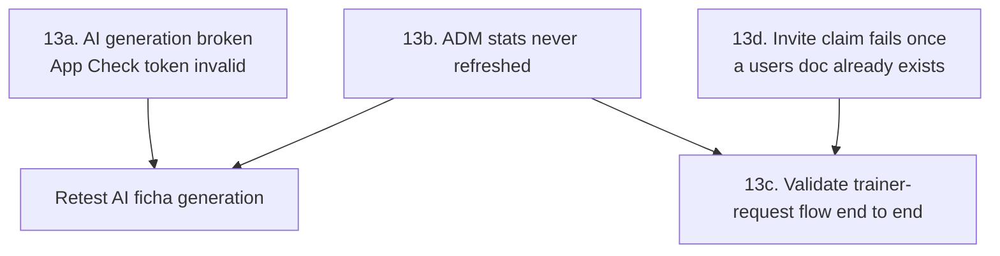
```mermaid
flowchart TD
    A[13a. AI generation broken\nApp Check token invalid] --> D[Retest AI ficha generation]
    B[13b. ADM stats never refreshed] --> C[13c. Validate trainer-request flow end to end]
    E[13d. Invite claim fails once\na users doc already exists] --> C
    B --> D
```

**13a. AI ficha generation fails — "Firebase App Check token is invalid"**
- [x] **Repro:** on the installed debug build, `StudentDetailsScreen` → "Ficha Personal" → "Com IA"
      → send any message with the Gemini provider selected → reply is always `Erro ao chamar a
      IA: Firebase App Check token is invalid.` (confirmed via screenshot, 2026-08-19). OpenAI
      provider not yet retested against this same build — check both once the fix lands, since
      App Check protects Firestore/Auth too, not just the AI Logic call.
- [x] **Root cause — confirmed live via `adb logcat` 2026-08-19:** `MainApplication.kt` installs
      `DebugAppCheckProviderFactory` for any debuggable build (see §8's App Check item) — the
      sideloaded/`installDebug` APK on this phone is debuggable, so it generates a random **debug
      token**, logged on every app start:
      `DebugAppCheckProvider: Enter this debug secret into the allow list in the Firebase Console
      for your project: 1dce3124-8e1c-4fe8-9c25-1aa9be85ae4f`. §8 already flagged App Check
      enforcement itself as a pending manual step, but never called out this *separate*
      debug-token registration sub-step, which is required specifically for debug builds
      regardless of Play Integrity enforcement status. An unregistered debug token is rejected
      server-side as unrecognized/invalid — matching the exact error text seen.
- [x] **Fix — done 2026-08-19:** registered `1dce3124-8e1c-4fe8-9c25-1aa9be85ae4f` in Firebase
      Console → App Check → Apps → `com.example.personalapp` → ⋮ → Manage debug tokens → Add
      debug token → Salvar. The app showed as "Não registrado" with no attestation provider at
      all (the pending §8 manual step) — the debug-token action was still reachable directly from
      the row's ⋮ menu without registering Play Integrity first. Note for later: this token is
      tied to this specific app install; a fresh install (data wipe) or a different test device
      will need its own token registered the same way — worth documenting in a short "dev setup"
      note once there's more than one test device in rotation. Play Integrity itself is still
      "Não registrado" — that's the separate §8 item for real release-build attestation, not
      needed for debug-build testing.
- [x] **Regression test (manual) — passed 2026-08-19:** sent a real prompt from `AIWorkoutScreen`
      (Gemini) on the physical device. The `App Check token is invalid` error is gone — the call
      now reaches Gemini's backend for real, confirmed by a *different* error surfacing instead:
      `This model is currently experiencing high demand. Spikes in demand are usually temporary.
      Please try again later.` — a transient Gemini-side capacity response (HTTP 503-class,
      unrelated to App Check/auth), not a bug in this app. This is also the first live
      confirmation the Firebase AI Logic migration (§3) actually works end-to-end, which GOALS.md
      had flagged as unverified since it was written. Retry once demand clears; if it persists
      across many retries/hours, that would be worth a fresh look, but one instance is expected
      Gemini API behavior, not a regression.

**13b. ADM Gestão tab (trainer count, total users, pending requests) never refreshed after first
load — done 2026-08-19**
- [x] **Repro:** `AdminViewModel.loadUserStats()` and `loadTrainerRequests()` both ran exactly
      once, in `init{}`. Any Firestore change after the ViewModel was constructed (a new trainer
      promoted, a new `trainerRequests` doc written) never appeared in the Gestão tab without a
      full process kill + cold start — a same-session tab switch or even backgrounding/resuming
      the app wasn't enough, since the `ViewModel` instance (and its `StateFlow`s) survives that.
      This is exactly why "Personais: 0" stayed stuck even with an active Trainer already using
      the app, and why a submitted trainer-access request didn't show up in "Solicitações
      Pendentes".
- [x] **Root cause:** one-shot `.get()` Firestore reads in `init{}` with no listener and no
      re-trigger path anywhere in the UI layer — not a data problem, a missing-refresh problem.
- [x] **Fix:** made `loadUserStats()`/`loadTrainerRequests()` public on `AdminViewModel`; call
      both from a `LaunchedEffect(Unit)` in `UserManagementTab` (`AdminDashboardScreen.kt`) —
      re-runs every time this composable re-enters composition, i.e. every time the Gestão tab is
      selected, no extra state needed. Added a manual refresh `IconButton` next to "Solicitações
      Pendentes" for an on-demand recheck without leaving the tab.
- [x] **Regression test (manual) — passed 2026-08-20:** on-device, `alexmiguel011014@gmail.com`
      tapped "Solicitar acesso de Trainer" while the ADM's Gestão tab was already open in the
      background; switching back to the tab showed the new pending request without restarting the
      app. Confirms the `LaunchedEffect(Unit)` re-trigger fix works for real, not just compiles.

**13d. Claiming an invite permanently fails once a `users/{uid}` doc exists for that account —
found 2026-08-19 (`alexmiguel011014@gmail.com`), worked around manually, needs a real fix**
- [x] **Repro:** on `LoginScreen`, an authenticated account with an existing `users/{uid}` Firestore
      doc enters a trainer-minted invite code → claim silently fails (Firestore
      `PERMISSION_DENIED`, surfaced to the user as the raw exception string, not a helpful
      message). Confirmed live 2026-08-19. Two distinct starting states both reach this same dead
      end, and are worth telling apart because only one has a safe automatic fix:
      1. **Genuinely-unclaimed STUDENT** (`role: STUDENT`, `trainerId: null`) — e.g. an account
         previously promoted/rejected through some other admin action that still left a doc
         behind, or any future path that writes a `users/{uid}` doc before the invite is claimed.
         *Checked against the code: today's plain self-registration (`AuthRepository.register()` →
         `login()`) does **not** itself write a `users/{uid}` doc — a purely-registered,
         never-touched account is still doc-less and claims fine via the existing `create` rule.
         This case matters for any account that picked up a doc some other way (see case 2, or a
         future flow) while still logically "unclaimed".*
      2. **Account already has an incompatible role** — most likely what actually happened to
         `alexmiguel011014@gmail.com`: earlier in this same session it was used to test the
         ADM's "Promover manualmente" UID-paste form (`AdminViewModel.promoteToTrainer()`, a
         `SetOptions.merge()` write setting `role: TRAINER`), which — like the working fix in
         13b/13c — creates a real `users/{uid}` doc with `role: TRAINER`. Reusing that same
         account as a STUDENT then hits a doc that already has an unrelated role. **This case
         should not be silently auto-resolved** — a STUDENT invite claim silently overwriting an
         existing TRAINER doc would be a real privilege/data-loss bug, not a fix.
- [x] **Root cause:** `AuthRepository.claimInvite()` always does a plain
      `transaction.set(userRef, mapOf(role="STUDENT", trainerId=<real>, ...))` with no branch for
      "does this uid already have a doc, and if so, what's actually in it". Firestore evaluates
      any write to an existing doc as `update`, and `firestore.rules`' `update` rule requires
      `role`/`trainerId` to stay byte-identical to `resource.data` (the anti-self-promotion
      guarantee) — with no exception carved out for the one legitimate case (1) where changing
      `trainerId` from `null` is exactly what should be allowed. Compounding this: `claimInvite()`'s
      caller (`AuthViewModel.claimInvite()`, `AuthViewModel.kt:110-112`) surfaces the raw Firebase
      exception message on failure (`e.message ?: "Código inválido"`) — for a rules rejection this
      is an opaque `PERMISSION_DENIED` string, giving no hint that the real problem is "this
      account already has a role" vs. any other reason the code could be rejected.
- [x] **Fix — two parts (implemented 2026-08-19, not yet republished to the live Console):**
      1. **`firestore.rules`**, `users/{uid}` `allow update`: add a narrow exception, additive to
         the existing unchanged-fields check, covering *only* case 1 above (existing role is
         already `STUDENT` **and** existing `trainerId` is `null`) — presenting the same
         currently-valid/unused-invite proof the `create` rule already requires:
         ```
         allow update: if isAdmin() || (
           isSignedIn() && request.auth.uid == uid &&
           (
             (
               field(request.resource.data, 'role') == field(resource.data, 'role') &&
               field(request.resource.data, 'trainerId') == field(resource.data, 'trainerId')
             ) ||
             (
               field(resource.data, 'role') == 'STUDENT' &&
               field(resource.data, 'trainerId') == null &&
               request.resource.data.role == 'STUDENT' &&
               request.resource.data.trainerId ==
                 get(/databases/$(database)/documents/invites/$(request.resource.data.inviteCode)).data.trainerId &&
               get(/databases/$(database)/documents/invites/$(request.resource.data.inviteCode)).data.used == false
             )
           )
         );
         ```
         Case 2 (already `TRAINER`/`ADM`, or already linked to a different trainer) deliberately
         stays blocked — that's correct behavior, not a bug, and needs an explicit ADM decision
         (demote/unlink first), not a client-driven overwrite.
      2. **UX for case 2, `AuthViewModel.claimInvite()`:** catch a Firestore
         `PERMISSION_DENIED`/`FirebaseFirestoreException` specifically and map it to a clear
         message (e.g. "Esta conta já está vinculada a um perfil existente — fale com o
         administrador.") instead of forwarding the raw exception text, so this doesn't require a
         support conversation + manual Console lookup to diagnose next time.
- [x] **Regression test (manual) — case 1 passed 2026-08-20; case 2 accepted as UI-unreachable
      (see below).**
      1. **Case 1 — passed.** Registered a fresh test account (`teste@teste.com`), manually created
         its `users/{uid}` doc (`role: STUDENT, trainerId: null`, simulating a path that leaves an
         unclaimed doc behind), had a trainer (`alexmiguel011014@gmail.com`) generate an invite,
         claimed it from the test account — confirmed success, `RoleRouter` routed into
         `StudentNavigation` (verified on-device: "Treinos"/"Evolução" tabs, "Nenhuma ficha
         atribuída ainda"). **Real deployment bug found and fixed along the way, not a code bug**:
         the first claim attempt failed with the exact pre-fix "already linked" error even though
         the local `firestore.rules` file had the §13d exception. Root cause: the rules **published
         on the live Firebase Console were stale** — an older version without the §13d `update`
         exception (confirmed by having the user paste the live rules text back for comparison).
         The user had believed this was already republished (see the "13b/13c" pass), but it
         hadn't actually gone out. Republishing the current local file fixed it immediately — no
         code change needed. **Process takeaway**: after any `firestore.rules` edit, verify what's
         *live* by reading it back from the Console, don't just trust "I published it" from memory
         — this cost real debugging time chasing a phantom code bug that didn't exist.
      2. **Case 2 — accepted as structurally unreachable via the UI, not hands-on tested.** Traced
         `RoleRouter`: an account with an existing role (`TRAINER`, or already-linked `STUDENT`)
         never reaches the invite-claim screen at all — it's routed straight into
         `AppNavigation`/`StudentNavigation` instead. The rule is defense-in-depth against a direct
         API/DB write, not something a normal user flow can trigger, so a click-through regression
         test isn't structurally possible without a raw authenticated Firestore call outside the
         app. User decision: accept this as covered by code review + UI routing, skip the extra
         verification step.
      - **Two unrelated real bugs surfaced during this test pass — both fixed and verified
        on-device 2026-08-21:**
        1. `TrainerRepository`'s `users where trainerId==X and role==STUDENT` listener query
           (the §7 "unify" model's linked-student sync) failed with `PERMISSION_DENIED` — confirmed
           live via logcat (`Listen for QueryWrapper(...) failed: Status{code=PERMISSION_DENIED}`).
           `firestore.rules`' `users/{uid}` collection only allowed self-read or `isAdmin()` — no
           rule let a trainer read/list their own linked students' `users/{uid}` docs, so the
           "linked student" half of the §7 unify model had never actually synced into a trainer's
           `Meus Alunos` list. **Fixed**: added `isOwningTrainer(field(resource.data, 'trainerId'))`
           to the `users/{uid}` `allow read` rule, republished. **Verified on-device**: after the
           fix, `alexmiguel011014@gmail.com`'s "Meus Alunos" correctly showed *two* cards (the
           original `students/` draft + the newly-linked `users/` account from the 13d case-1
           test) — before the fix only the draft ever appeared.
        2. The Trainer's main screen (`MainScreen`/students list) had **no logout button** — found
           when trying to switch test accounts, had to force-close the app instead. **Fixed**:
           added a logout `IconButton` (`Icons.AutoMirrored.Filled.Logout`) to `MainScreen`'s
           `TopAppBar`, threaded `onLogout` through `AppNavigation()` from `RoleRouter` (same
           `viewModel.logout()` pattern already used for ADM/Student). **Verified on-device**:
           tapping it returns to `LoginScreen` cleanly.
        Both changes verified via `./gradlew compileDebugKotlin verify assembleDebug` (all green)
        before on-device testing.

**13c. Trainer-request flow (`trainerRequests`) — end-to-end validation — done 2026-08-20**
- [x] `firestore.rules`' `trainerRequests/{uid}` block was republished in the Firebase Console
      (user-confirmed 2026-08-19) and no `PERMISSION_DENIED` was seen in logcat afterward — the
      rules side is live. Full pass confirmed on-device 2026-08-20:
      `alexmiguel011014@gmail.com` (a STUDENT account) tapped "Solicitar acesso de Trainer" on
      `LoginScreen`, the request appeared live in the ADM's "Solicitações Pendentes" (see 13b),
      "Aceitar" promoted it to TRAINER. The whole trainer-onboarding feature (GOALS.md's "Post-MVP
      addition") is now verified end-to-end, not just "compiles and rules are live". Side effect
      worth noting: this reused `alexmiguel011014@gmail.com` as the test account, so it's now a
      real TRAINER — no longer available as a clean unclaimed-STUDENT fixture for 13d below, which
      needs a fresh account instead.

---

## 14. Research — cost-effective AI providers for a future constraint-aware ficha generator
(2026-08-19, via `/newgoal /repertoire`)

Feeds §15 below only for its *future* phase (real in-app AI re-integration) — §15's immediate
deliverable (the prompt-template + paste flow) ships regardless of this section and needs no AI
API of its own. Domain grounding: see `REPERTOIRE.md` (scientific + competitive-landscape lenses).

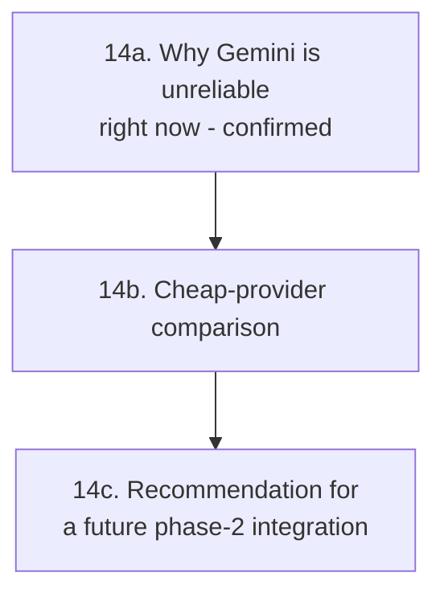
```mermaid
flowchart TD
    A[14a. Why Gemini is unreliable\nright now - confirmed] --> B[14b. Cheap-provider comparison]
    B --> C[14c. Recommendation for\na future phase-2 integration]
```

**14a. Why the Gemini errors are real and external, not a bug in this app**
- The `App Check token is invalid` error (§13a) was this app's own bug, now fixed. The `This
  model is currently experiencing high demand` error reported afterward (2026-08-19) is a
  **separate, well-documented, industry-wide problem with Gemini's free/Developer API tier**,
  not something fixable in this codebase: Google cut the Gemini API free-tier quota by 50-92%
  on 2025-12-07, and a further wave of "model overloaded" errors was widely reported starting
  2026-01-16. This app's Firebase AI Logic integration (§3) uses exactly this free
  "Gemini Developer API" tier by design (the whole point of the §3 migration was staying on
  Firebase's free Spark plan). **The user's instinct to not trust Gemini here going forward is
  correct, not overly cautious** — this isn't a transient blip to wait out, it's the tier's
  current normal operating condition.

**14b. Cheap-provider landscape (pricing, structured-output support, reliability notes)**

| Provider / model | Price (in/out per 1M tokens) | Structured JSON output | Notes |
|---|---|---|---|
| Gemini 2.5 Flash-Lite (free Developer tier, current integration) | $0.10 / $0.40 (paid tier; free tier is what's failing) | Yes | Cheapest Google option, but the free tier is exactly what's currently unreliable (14a) — a **paid** Gemini tier might sidestep this, but that reopens the Blaze-plan decision §3 deliberately avoided. |
| **GPT-5 Nano (OpenAI)** | ~$0.05 / — (cheapest OpenAI tier) | Yes (`response_format`) | **This app already has a working OpenAI HTTP integration** (`GenerativeAiService.generateWithOpenAi()`, `api.openai.com/v1/chat/completions`) — currently pointed at `gpt-4o-mini` (GOALS.md §5e), which is no longer the cheapest/current option. Switching the model string is near-zero engineering cost. |
| DeepSeek V3.2 / V4 Flash | $0.14 / $0.28 | Yes (`json_object` mode) | Cheapest true frontier-quality option. Real caveat found: DeepSeek's own API has **its own documented uptime fluctuations under peak demand** — the standard industry mitigation is a multi-provider fallback, i.e. the same class of risk this section exists to get away from, not a strictly safer bet than Gemini. Would need a brand-new HTTP integration (no existing code path, unlike OpenAI). |
| Claude Haiku 4.5 (Anthropic) | $1 / $5 | Yes (tool-use/structured mode) | Pricier than the above, but Anthropic models have a strong instruction-following reputation (relevant given the volume-budget math in `REPERTOIRE.md` needs to be followed *exactly*, not approximately). No existing integration in this app — would need a new HTTP client, same lift as DeepSeek. |

**14c. Recommendation for a future phase-2 — superseded 2026-08-19 by the user's explicit choice
(see §16): give the trainer all four providers now rather than wait-and-see on just one.**
- [x] ~~Cheapest path to re-enable in-app AI with real reliability: point the already-wired OpenAI
      integration at a current cheap model before building a new provider integration.~~
      Superseded — §16 builds DeepSeek and Claude now regardless, per explicit user direction.
      The underlying cost point still stands (OpenAI's `gpt-4o-mini` model id in
      `GenerativeAiService` is stale — worth a follow-up bump to a current cheap model, tracked
      informally here, not urgent enough for its own numbered item).
- [x] ~~Only build a DeepSeek/new-provider integration if a real evaluation shows the cheap-OpenAI
      path isn't accurate enough.~~ Superseded — built directly in §16, not gated on an
      evaluation. The evaluation itself is still worth doing eventually (which provider actually
      follows the volume-budget math best), just informally, whenever real usage accumulates —
      not a blocker for shipping the choice.
- [ ] Keep Gemini wired as an optional fallback (§3's existing code), but stop treating it as the
      default/primary path in any UI copy until Google's free-tier reliability changes — still
      accurate advice, unaffected by the §16 expansion (Gemini stays one of four choices, just
      not the one to lead with in copy/defaults).

---

## 15. Feature — replace in-app AI ficha generation with a prompt-template + paste workflow
(2026-08-19, via `/newgoal`)

The immediate, ship-now response to §14a: stop depending on a live in-app AI call for ficha
generation. Instead, give the trainer a pre-written formatting prompt (authored once, embedded in
the app) that they combine with their own requirements and run in *whatever* AI app they already
have (ChatGPT, Gemini app, Claude, web — doesn't matter, no API integration needed for this to
work) — then paste the reply back into the app's existing Smart Paste importer, extended to also
parse the muscle-activation annotations `REPERTOIRE.md` validated. The trainer keeps 100% manual
edit control afterward — nothing new needed there, `ManualWorkoutScreen`'s existing exercise-list
editing already applies to imported fichas exactly like manually-typed ones.

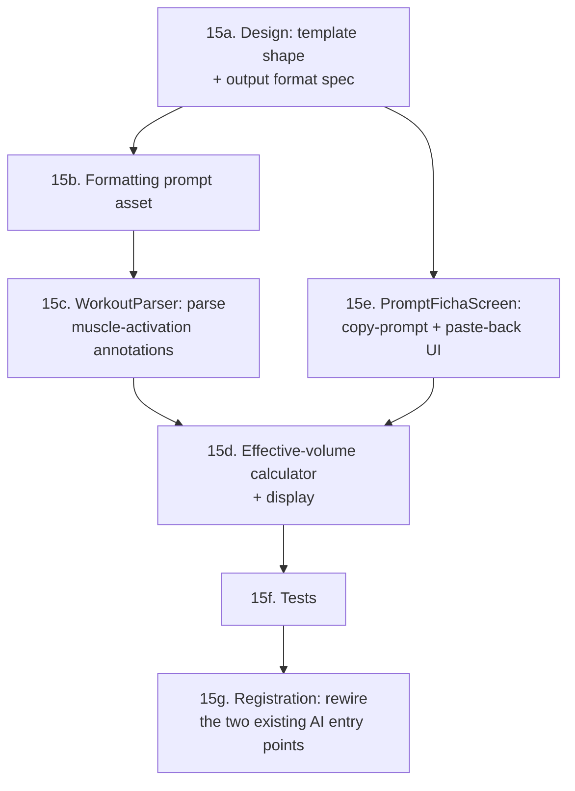
```mermaid
flowchart TD
    A[15a. Design: template shape\n+ output format spec] --> B[15b. Formatting prompt asset]
    B --> C[15c. WorkoutParser: parse\nmuscle-activation annotations]
    C --> D[15d. Effective-volume calculator\n+ display]
    A --> E[15e. PromptFichaScreen:\ncopy-prompt + paste-back UI]
    E --> D
    D --> F[15f. Tests]
    F --> G[15g. Registration: rewire\nthe two existing AI entry points]
```

**15a. Design rationale**
- [x] **Output format**: extend, don't replace, the existing Smart Paste shape (`WorkoutParser.kt`
      — `Ficha X` header line + `Exercício NxM` lines, GOALS.md's own module docs) with an
      *optional* trailing annotation per exercise line naming which muscles it hits and at what
      coefficient from `hypertrophy_volume_reference.md`, e.g.:
      `Nome do exercício 4x10 [Músculo:coeficiente, Músculo:coeficiente]` (example values omitted — GOALS.md §33)
      Optional so a line with no annotation (or a human pasting a plain WhatsApp-style ficha,
      today's existing use case) still parses exactly as before — this is additive, not a
      breaking format change.
- [x] **Explicit out of scope for this pass** (prevents scope creep): no new in-app AI API call
      (that's §14's later phase, if ever); no anatomy-diagram/heatmap visualization (Hevy/Boostcamp
      style, per `REPERTOIRE.md` §2) — this pass shows effective volume as a simple per-muscle
      number-vs-band line, not a body diagram; no change to `AIWorkoutViewModel`'s JSON-based
      direct-call contract — that code stays as-is, just unwired from the primary UI path (§14c
      keeps the door open to re-enable it later without a rewrite).

**15b. Formatting-prompt asset**
- [x] New asset `app/src/main/assets/ficha_prompt_template.md` — the fixed prompt text the app
      hands the trainer, containing: (1) the exact output format spec from 15a with a worked
      example, (2) the full `hypertrophy_volume_reference.md` table content (reused verbatim —
      already bundled, no duplication of research), (3) an instruction to compute and report
      effective volume per targeted muscle as `Σ(sets × coefficient)` against whatever weekly
      target the trainer states, applying the existing RIR adjustment rules from the same table —
      this is the exact validated method from `REPERTOIRE.md` §1, written into the prompt as
      plain instructions so any general-purpose AI (not just Gemini) can follow it.

**15c. `WorkoutParser.kt` — parse the muscle-activation annotation**
- [x] New regex for the optional trailing `[Muscle:coef, Muscle:coef, ...]` block per exercise
      line, parsed into a `Map<String, Double>` on the exercise (nullable/empty when absent —
      backward compatible with every existing `WorkoutParserTest` case, which must keep passing
      unchanged).

**15d. Effective-volume calculator + display**
- [x] New pure function: given a parsed ficha's exercises (sets × per-muscle coefficients), sum
      `sets × coefficient` per muscle across the whole ficha → effective weekly volume per muscle.
      Display as a compact per-muscle line (muscle name, computed number, generic MEV/MAV/MRV band
      as context text, per `REPERTOIRE.md` §2's finding that a bare number without a
      range/context is the wrong UX) — added to the ficha view already shown on
      `ManualWorkoutScreen`/`StudentDetailsScreen`, not a new screen.

**15e. `PromptFichaScreen` — copy-prompt + paste-back UI**
- [x] New screen (or a new mode on the existing `AIWorkoutScreen`, reusing its student-profile
      auto-fill from `buildPrompt()`'s existing field-gathering logic): a text field for the
      trainer's own requirements (what they want in the ficha, target volumes per muscle, etc.),
      a **"Copiar Prompt"** button that concatenates 15b's template + the student's existing
      profile fields + this free text, and copies it to the clipboard (`ClipboardManager`, same
      API already used for the invite-code share sheet) — then the existing "Importador
      Inteligente" paste box (already on `ManualWorkoutScreen`) is where the trainer pastes the
      AI's reply back in. No new paste UI needed, just the "Copiar Prompt" half.

**15f. Tests**
- [x] `WorkoutParserTest`: new cases for the muscle-activation annotation (present, absent,
      malformed — skipped, not errored, same convention as every other unparseable line today).
      Found and fixed a real bug while writing these: a comma-decimal coefficient (e.g.
      `[Costas:0,75]`) silently parsed wrong (comma also separates muscles in the same bracket) —
      the annotation format now requires a period, documented in the prompt template and in a
      code comment, not just fixed silently.
- [x] New unit test for the effective-volume calculator: multiple exercises contributing
      fractional credit to the same muscle sum correctly; a muscle with zero contributing
      exercises reports 0, not a crash.
- [ ] **(manual)** confirm "Copiar Prompt" actually populates the system clipboard on a real
      device — Compose clipboard interaction isn't meaningfully covered by a JVM/Robolectric test.

**15g. Registration — rewire the two existing AI entry points**
- [x] `StudentDetailsScreen`'s "Ficha Personal" dialog ("Manual" vs. "Com IA") and
      `WorkoutBuilderScreen`'s "Criar com IA" button both currently navigate straight to
      `AIWorkoutScreen` (the live-chat direct-call screen, GOALS.md §5d) — repoint both at the new
      `PromptFichaScreen` instead. Done when: neither entry point reaches a live Gemini/OpenAI API
      call without the trainer explicitly choosing to (§14c keeps that path available, just not
      the default one a tap away).

---

## 16. Feature — DeepSeek + Claude as selectable providers, dedicated Settings tabs
(2026-08-19, via `/newgoal`)

Supersedes part of §15g: the user's direction here is to *expand* the direct in-app AI path
(more provider choice), not fully retire it in favor of §15's prompt-and-paste flow — both now
coexist as first-class options (see 16a). Grounds provider specifics in real API docs (endpoint,
auth header, request/response shape) so `/execgoals` implements against a checked spec, not a
guess — DeepSeek and Claude have genuinely different wire formats from each other, this matters.

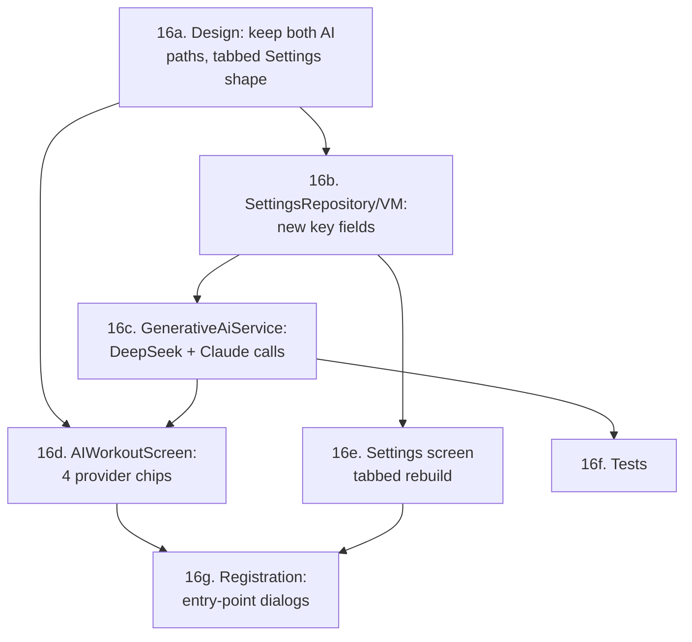
```mermaid
flowchart TD
    A[16a. Design: keep both AI\npaths, tabbed Settings shape] --> B[16b. SettingsRepository/VM:\nnew key fields]
    A --> E[16d. AIWorkoutScreen:\n4 provider chips]
    B --> C[16c. GenerativeAiService:\nDeepSeek + Claude calls]
    C --> E
    B --> F[16e. Settings screen\ntabbed rebuild]
    C --> G[16f. Tests]
    E --> H[16g. Registration:\nentry-point dialogs]
    F --> H
```

**16a. Design rationale**
- [x] **Amend §15g**: don't hide `AIWorkoutScreen` behind `PromptFichaScreen` — keep both reachable.
      The "Ficha Personal" dialog (`StudentDetailsScreen`) and `WorkoutBuilderScreen`'s "Criar com
      IA" now offer a choice between **"IA no app"** (`AIWorkoutScreen`, direct call, now 4
      providers to pick from) and **"Prompt para IA externa"** (§15's `PromptFichaScreen`) —
      giving the trainer a live in-app fallback *and* a fully external option, not forcing one.
- [x] **`AiProvider` enum expands**: `GEMINI, OPENAI, DEEPSEEK, CLAUDE`. Gemini stays the only
      project-level/free provider (Firebase AI Logic, §3); the other three are all
      **BYO-key**, exactly the pattern OpenAI already established — no new architecture, just two
      more branches of something that already works.
- [x] **Settings becomes tabbed**, reusing the `NavigationBar` + `selectedTab` pattern already
      proven in `AdminDashboardScreen` (§5e) for consistency rather than inventing a second
      "sectioned screen" convention in the same app. Starts with **one tab, "IA"**, holding
      everything AI-related (Gemini's status card + three BYO-key fields). Adding a future
      settings category later is one more entry in the tab list + one more `when` branch — no
      rearchitecture needed when that day comes, which is the actual ask ("já começa a organizar
      melhor").

**16b. `SettingsRepository`/`SettingsViewModel` — new key storage**
- [x] Mirror the existing `openaiApiKey` pattern exactly: two new `stringPreferencesKey`s
      (`deepseek_api_key`, `claude_api_key`) in `SettingsRepository`, two new `Flow<String>`
      exposures + `saveXApiKey()` functions, surfaced on `SettingsViewModel` the same way
      `openaiApiKey`/`saveOpenaiApiKey` already are.

**16c. `GenerativeAiService` — DeepSeek and Claude calls**
- [x] **DeepSeek — reuses the existing OpenAI request/response classes verbatim.** DeepSeek's API
      is explicitly OpenAI-wire-format-compatible (confirmed via current API docs,
      `api-docs.deepseek.com`): same `Authorization: Bearer <key>` header, same
      `{"model": ..., "messages": [{"role", "content"}]}` request shape, same
      `{"choices": [{"message": {"content"}}]}` response shape already modeled by
      `OpenAiChatRequest`/`OpenAiChatResponse`. Only two things differ from the existing
      `generateWithOpenAi()`: base URL `https://api.deepseek.com/chat/completions` and model id
      `deepseek-chat` (current general-purpose alias; `deepseek-v4-flash`/`deepseek-v4-pro` also
      exist per §14b's pricing research — verify which is current/recommended at implementation
      time, same staleness caveat already written for `GEMINI_MODEL_ID`). Read the key from
      `settingsRepository.deepseekApiKey`, same blank-key-check/error-string convention as OpenAI.
- [x] **Claude — new request/response shape, NOT OpenAI-compatible.** Anthropic's Messages API:
      `POST https://api.anthropic.com/v1/messages`. Headers: `x-api-key: <key>` (not
      `Authorization: Bearer`), `anthropic-version: 2023-06-01` (a stable API-version string,
      unrelated to model version — do not confuse the two), `Content-Type: application/json`.
      Body: `{"model": "claude-haiku-4-5", "max_tokens": 4096, "messages": [{"role": "user",
      "content": fullPrompt}]}`. Response: `{"content": [{"type": "text", "text": "..."}]}` (a
      list of content blocks, not a single string — take the first `text`-type block). New
      `@Serializable` classes needed: `ClaudeMessageRequest(model, maxTokens, messages)`,
      `ClaudeMessage(role, content)`, `ClaudeResponse(content: List<ClaudeContentBlock>)`,
      `ClaudeContentBlock(type, text)` — same `HttpURLConnection` + `kotlinx.serialization`
      pattern already used for OpenAI, no new HTTP dependency. Read the key from
      `settingsRepository.claudeApiKey`.
- [x] Both new branches follow the exact error-handling shape `generateWithOpenAi()` already
      established: blank-key check returns a clear Portuguese error string before making any
      network call, non-2xx response passes the body through in the error string (not a generic
      "failed"), and `FirebaseCrashlytics.getInstance().recordException(e)` on any thrown
      exception — consistency with the one pattern this file already got right, not a new style.

**16d. `AIWorkoutScreen` — four provider chips**
- [x] Extend the existing `FilterChip` row (currently Gemini/ChatGPT only) with "DeepSeek" and
      "Claude" chips, same `provider by remember { mutableStateOf(...) }` selection pattern.

**16e. Settings screen — tabbed rebuild**
- [x] Rebuild `SettingsScreen` per 16a's tab shape (`NavigationBar` with one "IA" tab today).
      Inside the IA tab: keep the existing Gemini info card unchanged, and one `OutlinedTextField`
      + `PasswordVisualTransformation` per BYO-key provider (OpenAI, DeepSeek, Claude) — **one
      shared "Salvar" action saving all three at once** (cheaper than three separate FABs/buttons
      for what's functionally one form), matching the existing single-FAB pattern but extended to
      write all three keys together.

**16f. Tests**
- [x] **Descoped, reasoning recorded 2026-08-19**: a real `GenerativeAiServiceTest` would need
      either a new test dependency (MockWebServer — this project has consistently avoided adding
      an HTTP test/client dependency for a single POST call, same reasoning that kept OpenAI on
      plain `HttpURLConnection` in the first place) or loosening the request/response data
      classes from `private` to something a same-package test file could reach — neither is
      proportionate to add just for this. Consistent with the existing gap: `generateWithOpenAi()`
      itself has never had a unit test either, so this isn't a new hole, just staying honest about
      an old one. Verification for all three BYO-key providers stays manual — plug in a real key
      and send one message from `AIWorkoutScreen`, same as how OpenAI has always been checked.

**16g. Registration**
- [x] Update the "Ficha Personal" dialog (`StudentDetailsScreen`) and `WorkoutBuilderScreen`'s
      "Criar com IA" entry point per 16a's amended design (choice between `AIWorkoutScreen` and
      `PromptFichaScreen`, not just the latter as §15g originally specified).

---

## 17. Feature — student connection clarity, trainer-granted permissions, self-assessment
(2026-08-19, via `/newgoal`)

**Not yet started — the user flagged this as a real gap but was explicitly unsure whether now is
the right time to build it ("não sei se agora é o melhor momento"). This section is the plan for
when they decide to; running `/execgoals` against it is a separate, later decision, not implied by
writing it.**

Grounded in a direct code read (not assumption) before designing anything, since the request
questioned whether the current model is architecturally broken:

- **"Meus Alunos" already merges both states** — `TrainerRepository.getStudents()` reads one Room
  `users` table populated by *two* Firestore listeners: `students/{id}` drafts (`AddStudentScreen`,
  no Firebase Auth account) and `users/{uid}` docs where `trainerId` matches (real linked/claimed
  accounts). A trainer already sees both kinds of "aluno" in one list — the data layer isn't
  fragmented. What's actually missing is **visual distinction on the card** between "cadastrado,
  ainda não conectado" and "conectado" — a UI gap, not an architecture one.
- **`AddStudentScreen` should stay** — it's the same pattern real competing tools use (Trainerize,
  TrueCoach: "add a client record" and "invite them to the app" are two separate, sequential
  steps, not one). A trainer meeting a new client in person, before that person has installed
  anything, needs somewhere to write down what they already know. Removing it would regress a
  real, common workflow to solve a labeling problem — fix the label, not the feature.
- **Real bug found while reading `AuthRepository.claimInvite()` for this pass**: the claim write
  is `transaction.set(userRef, mapOf(...))` — a full overwrite, not a merge. Harmless *today*
  (nothing lets an unclaimed self-registered STUDENT write anything to their own profile yet, per
  the code read), but it becomes a real data-loss bug the moment any self-service capability
  ships: a student who filled out a self-assessment (17e) *before* claiming an invite would have
  it silently wiped the moment they claim. Rather than touch the claim mechanism (out of scope,
  risk of regressing §7/§13d's already-working invite logic), **every new self-service capability
  in this section is scoped to apply only to already-linked (claimed) students** — matches the
  user's own framing ("aluno... conectar para o personal e aí sim [fazer coisas]") and sidesteps
  the overwrite risk entirely rather than papering over it.

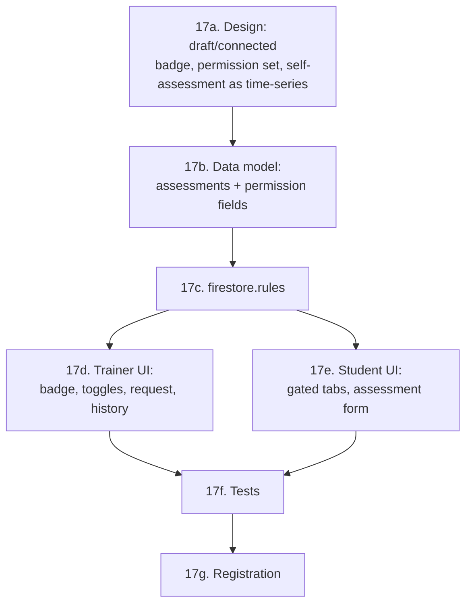
```mermaid
flowchart TD
    A[17a. Design: draft/connected\nbadge, permission set, self-\nassessment as time-series] --> B[17b. Data model:\nassessments + permission fields]
    B --> C[17c. firestore.rules]
    C --> D[17d. Trainer UI:\nbadge, toggles, request, history]
    C --> E[17e. Student UI:\ngated tabs, assessment form]
    D --> F[17f. Tests]
    E --> F
    F --> G[17g. Registration]
```

**17a. Design rationale**
- [ ] **Draft vs. connected badge**: purely visual, uses the existing `UserEntity.linked` field
      already returned by the merged query — no new data needed. Closes the actual confusion the
      user flagged without touching the data model.
- [ ] **Permission set stays small and named, not a generic feature-flag framework**: exactly two
      toggles, both trainer-controlled and default OFF (per "que o personal libera... quando
      personal autorizar"):
      - `canSelfAssess` — student may fill out a self-assessment when the trainer requests one.
      - `canLogBiometrics` — student may log their own weight/measurements (distinct from the
        trainer's own biometric entries on `StudentDetailsScreen`).
      A third or fourth toggle can be added later the same way if a real need shows up — building
      a generic per-feature permission engine now for two known toggles is speculative flexibility
      this project's own conventions already avoid elsewhere.
- [ ] **Self-assessment is a time-series collection (`assessments/{id}`), not a single overwritable
      profile field** — mirrors the existing `biometrics`/`workoutLogs` pattern (Firestore source
      of truth + Room mirror), giving the trainer a real history instead of only ever seeing the
      latest answers. Content grounded in the **PAR-Q+** (Physical Activity Readiness
      Questionnaire), the international-standard pre-exercise health screening tool used
      industry-wide before a new client starts training — 7 general yes/no health-risk questions
      (heart condition needing medical clearance, chest pain during/at rest, dizziness or loss of
      consciousness, a bone/joint problem, current blood-pressure/heart medication, any other
      medical reason) — plus the profile fields `UserEntity` already has (`goal`,
      `experienceLevel`, `trainingDays`), not an invented bespoke form. A "yes" answer should be
      flagged visibly to the trainer (liability/safety relevance), not just logged silently.
- [ ] **Request is pull-based, not push** — the trainer "requesting" an assessment just flips
      `pendingAssessmentRequest = true` on the student's own doc; the student sees it next time
      they open the app (same pattern already used for role-promotion — GOALS.md explicitly keeps
      push notifications/FCM out of scope project-wide). No new messaging infrastructure needed.

**17b. Data model**
- [ ] New Room entity `AssessmentEntity` + Firestore collection `assessments/{id}`:
      `studentId`, `trainerId`, `requestedAt`, `submittedAt` (null until answered), `parQAnswers`
      (map of question key → boolean), `goal`/`experienceLevel`/`trainingDays` snapshot at
      submission time (so history reflects what was true *then*, not the current live profile).
      Room migration (schema version bump, exported schema committed under `app/schemas/`, per
      CLAUDE.md's own convention — no `fallbackToDestructiveMigration` reliance).
- [ ] New fields on `UserEntity`/`users/{uid}`: `canSelfAssess: Boolean = false`,
      `canLogBiometrics: Boolean = false`, `pendingAssessmentRequest: Boolean = false`. Extend
      `FirestoreMappers.kt` (`toFirestoreMap()`/`toUserEntity()`) — same three-places-in-lockstep
      rule CLAUDE.md already documents for this data layer.
- [ ] `TrainerRepository`: `requestAssessment(studentId)` (sets the pending flag),
      `getAssessmentsForStudent(studentId): Flow<List<AssessmentEntity>>`,
      `setStudentPermission(studentId, canSelfAssess, canLogBiometrics)`.
- [ ] `StudentRepository`: `submitAssessment(answers, profileSnapshot)` (writes the doc, clears
      the pending flag), `logOwnBiometric(entry)` (only meaningful when `canLogBiometrics` is
      true — the rule in 17c is the real gate, this is just the write path).

**17c. `firestore.rules`**
- [ ] `assessments/{id}`: `allow create` if `isOwningTrainer(request.resource.data.trainerId)`
      (the request) **or** if the caller is the student themselves, `request.resource.data.studentId
      == request.auth.uid`, and their own `users/{uid}.canSelfAssess == true` (the submission —
      same `get()`-a-related-doc pattern already used for invite validation). `allow read` if
      owning trainer or the student themselves (same shape as `workoutLogs`).
- [ ] `users/{uid}` self-`update`: add one more narrow, additive exception (same style as §13d's
      re-claim exception) permitting `pendingAssessmentRequest` to change **only** `true → false`
      and **only** as part of the same write that creates an `assessments/{id}` doc for that
      student — this is the "submitting an assessment clears its own pending flag" self-write,
      distinct from `canSelfAssess`/`canLogBiometrics` themselves, which stay trainer-only
      (`isAdmin() || isOwningTrainer(...)`), never student-settable.
- [ ] `biometrics/{entryId}` `allow create`: add a narrow exception permitting a student to create
      their own entry (`request.resource.data.studentId == request.auth.uid`) only when their own
      `users/{uid}.canLogBiometrics == true` — additive to the existing `isOwningTrainer`-only
      create rule, not a replacement.

**17d. Trainer-side UI**
- [ ] Student list/card (`StudentsScreen`/`MainScreen`): a small badge — "Conectado" vs
      "Cadastrado (aguardando conexão)" — driven by the existing `linked` field.
- [ ] `StudentDetailsScreen`: new "Permissões" section with two switches
      (`canSelfAssess`/`canLogBiometrics`), a "Solicitar Autoavaliação" button (enabled only when
      `canSelfAssess` is already on — request presupposes permission, not the other way around),
      and an assessment-history list (newest first, flags any "yes" PAR-Q answer visibly).

**17e. Student-side UI**
- [ ] `StudentNavigation`: reads the student's own `canSelfAssess`/`canLogBiometrics` from their
      already-synced profile (via `StudentRepository`'s existing listener, no new sync mechanism)
      and conditionally shows the corresponding tab/action — hidden entirely, not just disabled,
      when the trainer hasn't granted it.
- [ ] Pending-assessment banner/screen: when `pendingAssessmentRequest == true`, show the PAR-Q
      questions (pre-filled `goal`/`experienceLevel`/`trainingDays` from the current profile,
      editable) → submit writes `assessments/{id}` + clears the pending flag in the same logical
      action (17c's rule requires this).
- [ ] Self-log biometrics screen: reuses the existing `WeightChart`/biometric-entry UI pattern
      already built for the trainer side (`StudentDetailsScreen`/`Components.kt`) rather than
      building a second one — same component, a student-facing write path gated by 17c's rule.

**17f. Tests**
- [ ] Room DAO test for `AssessmentEntity` CRUD + the new migration (same in-memory-DB pattern
      `AppDaoTest` already uses — note the existing caveat: written and compiling is verifiable
      here, actually *running* needs a device/emulator, same as every other `androidTest` in this
      project).
- [ ] **(manual)** `firestore.rules` changes always need live verification after publishing — this
      is no different from every other rules change this session: publish, then confirm both the
      trainer-request path and the student-submit path actually work, and that a `canSelfAssess ==
      false` student is genuinely blocked (not just hidden in the UI) from creating an
      `assessments/{id}` doc directly.

**17g. Registration**
- [ ] Wire the new "Permissões"/assessment-history section into `StudentDetailsScreen`'s existing
      layout (not a new top-level screen — it belongs alongside the other per-student management
      already there). Wire the new student-side screens into `StudentNavigation`'s existing tab
      list, conditionally per 17e.

---

## 18. Build — Cross-platform: bring the app to iOS via Kotlin Multiplatform
(2026-08-21, via `/newgoal /repertoire`)

> **ABANDONED 2026-10-07 (owner decision).** The Android and iOS apps will be rebuilt from scratch later,
> so this migration is not continued: PR #2 (`feature/kmp-ios`, tip `bac30b23735b2739e9fd2bba11dbbe0190be459c`)
> and PR #3 (`claude/tarefas-abertas-front-9834f6`, tip `7c96edcf67fd09706e1276d219b1015a3883822f`) were closed
> unmerged and both remote branches deleted. The commits survive only in local worktrees until those are
> removed; to restore one, `git push origin <tip>:refs/heads/<name>`. Every mention of those branches in
> §18–§31 below is history. Items here that are still `[ ]` will not be executed.

The single biggest architecture change to this project since it began — bigger than the §4a
Firestore migration. Full research feeding this section is in `REPERTOIRE.md` Part 2 (regulatory
lens: what iOS distribution actually costs/allows in 2026; competitive lens: why KMP fits this
specific codebase better than a Flutter/React Native rewrite). This section is the *how*; that
file is the *why these choices*.

**Business framing (confirmed with the user, drives scope/sequencing below):** free/test phase
now (current client base is under 10 students, staying free through ~20), paid platforms
(App Store + Play Store) only once the trainer actually starts charging students and the pricing
math is done. That means this section explicitly plans for **zero ongoing cost**, not "cheapest
possible paid tier" — every choice below is free-tier-first, with the paid migration path
documented (18g) but not built now.

**Cross-platform connectivity is not a subsystem to build.** Android↔Android, Android↔iOS, and
iOS↔iOS all resolve automatically once the iOS app talks to the same Firestore project the
Android app already uses — Firestore is the shared source of truth regardless of client platform
(§4a). The real engineering risk isn't "connecting" the platforms, it's making sure the *shared*
Kotlin code has zero hidden Android-only assumptions that would silently produce
platform-divergent behavior (e.g. a date/time formatter that behaves differently, a JSON shape
that only round-trips correctly on one platform). Item 18h below is what actually protects this.

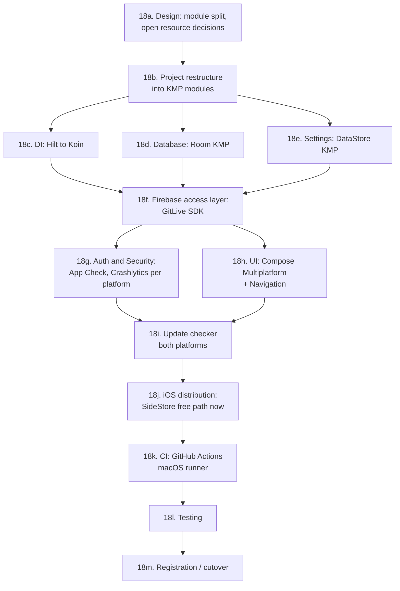
```mermaid
flowchart TD
    A[18a. Design: module split,\nopen resource decisions] --> B[18b. Project restructure\ninto KMP modules]
    B --> C[18c. DI: Hilt to Koin]
    B --> D[18d. Database: Room KMP]
    B --> E[18e. Settings: DataStore KMP]
    C --> F[18f. Firebase access layer:\nGitLive SDK]
    D --> F
    E --> F
    F --> G[18g. Auth and Security:\nApp Check, Crashlytics per platform]
    F --> H[18h. UI: Compose Multiplatform\n+ Navigation]
    G --> I[18i. Update checker\nboth platforms]
    H --> I
    I --> J[18j. iOS distribution:\nSideStore free path now]
    J --> K[18k. CI: GitHub Actions\nmacOS runner]
    K --> L[18l. Testing]
    L --> M[18m. Registration / cutover]
```

**18a. Design rationale and open decisions**
- [x] **Framework choice: Kotlin Multiplatform + Compose Multiplatform**, not Flutter/React
      Native. Decided per `REPERTOIRE.md` Part 2 §4 — this app already *is* Kotlin/Compose, so
      KMP reuses the existing domain/data layer and most Compose UI directly; Flutter/React Native
      would both be full rewrites from zero. Compose Multiplatform reached stable iOS support in
      version 1.8.0 (May 2025) and Navigation reached stable multiplatform status in 1.10.0
      (January 2026) — both current and load-bearing enough to build on, not bleeding-edge risk.
- [x] **iOS distribution: SideStore (free Apple ID sideload) for the free/test phase, Apple
      Developer Program ($99/yr) deferred until the trainer starts charging.** Per
      `REPERTOIRE.md` Part 2 §3: there is no zero-cost path to a *professional* iOS distribution
      (TestFlight, alternative marketplaces, and the App Store all require the same $99/year
      membership just for Apple's mandatory notarization step) — SideStore is the only genuinely
      free route, and it's viable at this app's current scale because the trainer already
      configures each Android device by hand today, so a one-time per-iPhone SideStore pairing
      is the same category of effort, not new overhead. Real limitation accepted: max 3
      sideloaded apps at once on the person's iPhone (irrelevant unless they already sideload
      other things), and updates depend on SideStore's periodic re-sign/refresh actually
      succeeding (mitigated by 18i's expiry warning).
- [x] **Decided 2026-08-21: no local Mac access** (confirmed with the user — owns an iPhone for
      testing, but no Mac, and there is no legal free equivalent: Apple's EULA restricts macOS
      virtualization to genuine Apple hardware, ruling out a "hackintosh"-style VM on the
      existing Windows dev machine). **Plan**: do everything that doesn't need Xcode now
      (18b–18g) using CI (18k) as the iOS verification gate instead of local compilation; rent a
      real cloud-hosted Mac by the hour (e.g. MacinCloud, ~US$1/hr, genuine Apple hardware — not
      a licensing violation, unlike a local VM) only when 18h/18j's Xcode-only steps (initial
      signing certificate, SideStore source pairing) are actually reached. Not rented yet — no
      need until then.
- [x] **Module shape**: rename/restructure the existing single `app` Android module into a KMP
      layout — `shared/` (or `composeApp/`, matching current JetBrains project-template
      convention) holding `commonMain` (business logic, ViewModels, repositories, Compose UI,
      Room database, Koin modules) plus `androidMain`/`iosMain` (platform-specific `expect`/
      `actual` implementations only: DB file path, DataStore file location, App Check provider,
      Crashlytics/CrashKiOS wiring, update-download mechanism). A thin `androidApp` module wraps
      `commonMain` for the existing Android entry point (`MainApplication`, manifest); a
      generated Xcode project wraps it for iOS. This is the standard KMP+Compose Multiplatform
      project shape (JetBrains' own multiplatform wizard produces this layout) — not a bespoke
      structure invented for this app.

**18b. Project restructure into KMP modules**
- [x] **Toolchain checkpoint — done and verified 2026-08-21.** New `:shared` module (branch
      `feature/kmp-ios`) using `org.jetbrains.kotlin.multiplatform` +
      `com.android.kotlin.multiplatform.library` — **not** the classic `com.android.library`,
      which AGP 9 made incompatible with the Kotlin Multiplatform plugin (confirmed live: the
      classic plugin combo fails with an explicit error naming the new plugin as Google's own
      recommended migration). Targets: the Android library target plus `iosX64()`/`iosArm64()`/
      `iosSimulatorArm64()`. Holds one trivial common function + test on purpose — this is the
      "does the whole toolchain actually work" checkpoint before any real logic moves in, exactly
      as planned. **Verified for real, not just "configured":**
      - Android side, locally: `:app:compileDebugKotlin` (now depending on `:shared`) succeeds,
        `:shared:testAndroidHostTest` (the commonTest run on the JVM/Android host) passes, and
        the full `./gradlew verify assembleDebug` still passes project-wide.
      - iOS side, via CI (this Windows dev machine can't compile Kotlin/Native's Apple targets at
        all — confirmed current fact, not an assumption): new `.github/workflows/ios-ci.yml` on
        `macos-latest` (free — this repo is public) compiles all three iOS targets **and** runs
        the shared module's test on the iOS simulator — both green, ~2 minutes.
      - **Two real, previously-undiscovered bugs found and fixed while getting this checkpoint
        green** (see §11 for detail): `gradlew`'s missing executable bit (broke *every* CI run on
        this project, iOS and Android both, unrelated to this migration) and the never-added
        `GOOGLE_SERVICES_JSON` repo secret. Both fixed; `main`'s own `android-ci.yml` is now
        confirmed green for the first time.
- [ ] Move every file with zero Android-framework imports into `commonMain` first (data models —
      `Exercise`, `PerformedSet`, `WorkoutEntity` fields, `WorkoutParser.kt`'s pure parsing logic,
      `AIWorkoutResponse`/`AIWorkout`/`AIExercise` — these are the lowest-risk, highest-value
      moves since they have no platform dependency today). Done when: `WorkoutParserTest` (already
      dependency-free Kotlin) runs unmodified from `commonTest` on both the JVM (Android) test
      target and `iosSimulatorArm64` test target.

**18c. Dependency injection: Hilt → Koin**
- [ ] **Hilt has no Kotlin Multiplatform support at all** (confirmed current, `REPERTOIRE.md`
      research) — this is a hard blocker, not a preference. Replace every `@HiltViewModel`/
      `@Inject`/`@Module`/`@InstallIn` with Koin's `module { }`/`viewModel { }`/`get()` DSL,
      declared in `commonMain` so the same DI graph serves both platforms. `androidApp` calls
      `startKoin { androidContext(...) }` in `MainApplication.onCreate()`; the iOS entry point
      calls the equivalent `initKoin()` from Swift/iosApp. Done when: every existing
      `hiltViewModel()` call site in Compose screens compiles against Koin's `koinViewModel()`
      instead, and `./gradlew :app:testDebugUnitTest` still passes (repository/ViewModel tests
      updated to Koin's test-module-override pattern instead of Hilt's `@TestInstallIn`).

**18d. Database: Room → Room Kotlin Multiplatform**
- [x] **No SQLDelight migration needed** — Room 2.7+ added official KMP support, and Room 3.0
      (March 2026) makes iOS/JS/WASM first-class targets, per current Android Developers docs.
      This is the single biggest research-confirmed cost-saver in this whole plan: the existing
      `AppDatabase`, all entities (`UserEntity`, `WorkoutEntity`, `WorkoutLogEntity`, etc.), and
      every `AppDao` query move into `commonMain` largely unchanged.
- [ ] The **only** required platform split is the database builder/file-path function (Android
      and iOS locate the SQLite file differently) — write one `expect fun getDatabaseBuilder(): 
      RoomDatabase.Builder<AppDatabase>` in `commonMain`, `actual` implementations in
      `androidMain` (existing `Context`-based path) and `iosMain` (`NSDocumentDirectory`-based
      path, per Room's own current KMP setup guide). Done when: a round-trip insert/read against
      the same `AppDao` query compiles and runs on both `androidUnitTest` and a real
      `iosSimulatorArm64` test target.
- [ ] **Re-verify all existing Room migrations** (`MIGRATION_5_6`, the `linked` flag migration
      6→7, `app/schemas/`) still apply cleanly once the database class lives in `commonMain` —
      schema export path may need updating in `build.gradle.kts` for the new module location.

**18e. Settings/preferences: DataStore → DataStore Multiplatform**
- [x] DataStore Preferences (not DataStore Proto) has official multiplatform support already —
      confirmed via current Android Developers KMP setup docs. `SettingsRepository`'s existing
      `stringPreferencesKey`s (Gemini/OpenAI/DeepSeek/Claude API keys) move to `commonMain`
      largely unchanged.
- [ ] Platform split needed only for the DataStore file location: `expect`/`actual` for the
      preferences file path (Android: existing `Context.dataStore` delegate; iOS: a path under
      `NSDocumentDirectory`, mirroring 18d's DB path split). Done when: a saved API key
      round-trips correctly on both platforms.
- [ ] **Re-verify §8's backup-exclusion fix** (`data_extraction_rules.xml`/`backup_rules.xml`
      excluding the DataStore file from Android auto-backup) still applies at the new file
      location after the module restructure — don't silently lose that protection in the move.

**18f. Backend access layer: Firebase via the GitLive Kotlin SDK**
- [x] **Google ships no official Firebase KMP SDK** (confirmed current, mid-2026) — use the
      community-maintained `dev.gitlive:firebase-firestore`/`firebase-auth` (`GitLiveApp/
      firebase-kotlin-sdk` on GitHub), the established option for exactly this gap, actively
      maintained, in production use by other teams. The newer `KFire` alternative is still beta
      as of this research — not a safe bet for an app already depending heavily on Firestore
      transactions (`AuthRepository.claimInvite`) and listeners.
- [ ] Rewrite `TrainerRepository`/`StudentRepository`/`AuthRepository`'s direct
      `com.google.firebase.firestore.*`/`com.google.firebase.auth.*` calls against GitLive's API
      in `commonMain` — same snapshot-listener/transaction *shape* (GitLive's API deliberately
      mirrors the Android Firebase SDK's), but a real rewrite, not a drop-in. Done when: the
      existing `startListening(trainerId)` mirror-into-Room behavior and `claimInvite()`'s
      transactional re-claim logic (§13d) both pass equivalent tests against GitLive on both
      platforms.
- [ ] `FirestoreMappers.kt`'s entity↔doc mapping moves to `commonMain` largely unchanged (it's
      already plain-map-based, not tied to any Android-only Firestore API surface).
- [ ] **`GenerativeAiService`'s HTTP calls (OpenAI/DeepSeek/Claude via plain `HttpURLConnection`)
      need a multiplatform HTTP client** — `HttpURLConnection` is JVM/Android-only. Use Ktor
      Client (JetBrains' own multiplatform HTTP library, the standard pairing with KMP) with the
      `Darwin` engine on iOS and existing `OkHttp`/`CIO` engine on Android. Gemini's Firebase AI
      Logic SDK call (`generateWithGemini()`) is Android-only today (`com.google.firebase:
      firebase-ai`) — confirm whether it has an iOS equivalent before assuming Gemini stays
      available on iOS; if not, either drop Gemini as an iOS-side provider option (the other
      three BYO-key providers already work fine here since they're plain HTTP) or scope that as
      a known iOS gap, not a silent omission.

**18g. Auth and Security — platform-specific pieces GitLive doesn't cover**
- [ ] **App Check**: GitLive's SDK doesn't wrap App Check. Keep Android's existing
      `DebugAppCheckProviderFactory`/`PlayIntegrityAppCheckProviderFactory` wiring in
      `androidMain` unchanged; add a thin `iosMain` `actual` bridging to Firebase iOS SDK's own
      App Check (App Attest provider for release, debug provider for local iOS testing) — a
      real native-bridge implementation, not optional, since `firestore.rules`'/Auth's security
      posture assumes App Check is active on every client.
- [ ] **Crashlytics**: no drop-in multiplatform equivalent exists yet (confirmed current
      research). Options, pick one rather than defaulting silently: (a) **CrashKiOS**
      (Touchlab's KMM crash-reporting bridge, explicitly built for this exact gap, forwards
      crashes to the existing Firebase Crashlytics project) — closest to today's behavior,
      recommended; (b) drop Crashlytics on iOS specifically and rely on manual bug reports during
      the free/test phase — acceptable given the small current user count, revisit once paid.
- [ ] Re-verify §8's App Check debug-token registration flow (§13a) still applies correctly once
      requests can come from either platform's debug provider — the Firebase Console's debug
      token allow-list is per-install, not per-platform, so this should be mechanically the same
      process repeated once per iOS test device, not a new mechanism.

**18h. UI: Jetpack Compose → Compose Multiplatform, Navigation**
- [ ] Move every screen composable with no Android-only API calls (`ContentType`/autofill
      semantics, `LocalConfiguration`, Android-specific icons) into `commonMain` — per current
      migration reports for exactly this move (existing Jetpack Compose app → Compose
      Multiplatform), most Composables are reported to work unchanged; the real work is
      resources (no generated Android `R` class in common code — move string/icon resources to
      Compose Multiplatform's resource system) and anything directly touching
      `android.content.Context`/`ClipboardManager`/Android permissions APIs (`expect`/`actual`
      those specifically, e.g. `PromptFichaScreen`'s clipboard copy from §15e).
- [ ] Adopt the official Compose Multiplatform Navigation library (stable since 1.10.0) as a
      drop-in for the existing Navigation Compose usage (`AppNavigation.kt`'s `Screen` sealed
      class/`NavHost` already maps closely to the multiplatform API). iOS-specific: swipe-back
      gesture needs an explicit `iosMain` UIKit gesture recognizer or Compose Cupertino — native
      back-swipe isn't automatic, confirm current guidance at implementation time (this is an
      area still actively evolving per the research).
- [ ] **Explicitly re-verify each Android-only UI fix already shipped this project** doesn't
      silently regress on iOS: the `NonObservableLocale` fix (§10, `LocalConfiguration.current
      .locales[0]`), the R8/lint sweep (§8/§10, Android-build-only, doesn't apply to iOS but
      shouldn't be assumed equivalent-safe without checking), and `Icons.AutoMirrored.*` usage
      (already correctly multiplatform-safe per §13's fix this session).

**18i. In-app update checker — both platforms (user's explicit ask)**
- [ ] New `commonMain` `UpdateChecker`: reads a small `latest.json` manifest (version code,
      changelog note, platform-specific download URL) hosted in this same public GitHub repo
      (e.g. via GitHub Releases or a raw file on `main`) — no new backend needed, reuses existing
      free infrastructure (the repo is already public, confirmed 2026-08-21).
- [ ] **Automatic check**: on app launch (not a true background job — keeps this portable across
      platforms without needing a cross-platform WorkManager equivalent, consistent with this
      project's existing "no speculative infrastructure" convention), compare the running app's
      version against the manifest; if newer, show a non-blocking banner.
- [ ] **Manual check**: a "Verificar atualização" button in Settings (new tab or added to the
      existing "IA" tab's shell — §16's tabbed Settings already anticipated more categories being
      added later), calling the same `UpdateChecker` on demand.
- [ ] **Android-specific action**: banner/button opens the new `.apk` download URL directly
      (Android already trusts "install from unknown sources" for this app, per the existing
      sideload distribution model) — the person taps through Android's own install prompt, same
      as today's manual reinstall, just without needing you physically present.
- [ ] **iOS-specific action**: since SideStore already re-signs/refreshes from its configured
      source periodically, the in-app banner's role is different — show **days remaining until
      the current signature expires** (the real risk flagged in 18a) with a "atualizar agora"
      button that triggers SideStore's refresh directly if a URL scheme/deep link for that
      exists, or at minimum clear instructions, so an expiring app is never a silent surprise.

**18j. iOS distribution: SideStore free path (now) → Apple Developer Program (later, when paid)**
- [ ] Host the built `.ipa` + an AltStore/SideStore-format "source" JSON (app metadata + download
      URL + version) somewhere stable and free — a GitHub Release asset on this same public repo
      is the natural choice, consistent with 18i's update-manifest hosting.
- [ ] Document (in this file, not just in chat) the one-time per-iPhone SideStore setup steps —
      this becomes the "dev setup note" the project has flagged needing before (§13a already
      noted the same need for App Check debug tokens once more than one test device exists).
- [ ] **(manual, deferred)** When the trainer starts charging students: enroll in the Apple
      Developer Program ($99/yr), switch distribution to TestFlight (up to 10,000 testers, no
      per-device technical setup for the end user), and revisit whether the Play Store's one-time
      $25 fee is also worth paying at that point (§11 already declined this for Android at the
      free stage — same reasoning to revisit, not redo, once there's real revenue).

**18k. CI: build iOS on GitHub Actions' macOS runner**
- [x] **Pulled forward and done first, ahead of its original position in the plan — done
      2026-08-21.** Since this dev machine can't compile Kotlin/Native's Apple targets at all
      (confirmed, not assumed — Kotlin/Native's Apple-target compiler requires macOS/Xcode's
      toolchain), CI had to exist *before* any real iOS-affecting code could be verified, not
      after. New `.github/workflows/ios-ci.yml`, `macos-latest`, triggered on push to
      `main`/`feature/kmp-ios` + `workflow_dispatch`: compiles all three iOS Kotlin/Native
      targets and runs `:shared`'s test on the iOS simulator. **Confirmed green** (~2 min) and
      **confirmed free**: this repository is public, and GitHub Actions macOS runner minutes are
      unlimited/free on public repos (confirmed current, `REPERTOIRE.md` research) — no CI cost
      concern here, unlike a private repo where macOS minutes bill at 10× the standard rate.
      Producing a signed `.ipa` is deferred to 18j (needs real signing setup, not yet done).
- [x] Kept separate from `android-ci.yml`, which is unaffected — confirmed both workflows pass
      independently (`android-ci.yml` on `main`, `ios-ci.yml` on `feature/kmp-ios`).

**18l. Testing**
- [ ] Move `WorkoutParserTest` (already dependency-free) to `commonTest` — done when it passes on
      both `testDebugUnitTest` (Android/JVM) and an `iosSimulatorArm64` test run.
- [ ] `AuthRepositoryTest` (MockK-based) needs a KMP-compatible mocking approach — MockK is
      JVM-only; either keep this test Android-only (acceptable, it's testing Android-specific
      Firebase mock plumbing today, not core logic) or migrate the assertions it covers into a
      `commonTest` against GitLive's SDK using a fake/in-memory implementation instead of a mock.
      Don't silently drop the coverage — decide and document which.
- [ ] `AppDaoTest`/`workoutLog_roundTripsPerformedSets` (Room in-memory, currently `androidTest`-
      only) — re-run against Room's KMP in-memory test builder on `iosTest` too, given 18d's
      migration; this is genuinely new coverage the project didn't have before (Room's iOS path
      was untested until this move).
- [ ] `TrainerGoldenPathTest.kt` (Compose UI test) — Compose Multiplatform's iOS UI-testing
      tooling is comparatively less mature than Android's `ui-test-junit4`; confirm current
      support at implementation time. If iOS Compose UI testing isn't practical yet, keep this
      test Android-only and say so explicitly rather than silently losing golden-path coverage
      with no note.

**18m. Registration/cutover**
- [ ] Once 18a–18l are green on both platforms, cut the existing `app` module over to depend on
      `shared` as its only source of truth (no dead duplicate Android-only copies of anything
      that moved to `commonMain`) — verified via a full `./gradlew verify assembleDebug` pass
      identical in spirit to every other verification gate this project already uses, plus the
      equivalent iOS build succeeding in CI (18k).
- [ ] Update `CLAUDE.md` and `README.md` to describe the new KMP module shape — this is exactly
      the kind of cross-cutting convention change CLAUDE.md exists to document (per its own
      existing "Module documentation strategy" note, §1).

---

## 19. Build — Cross-platform: bring the app to Web (Compose Multiplatform for Web)
(2026-09-12, via `/newgoal`; implementation started same day via `/execgoals`)

**Business framing (confirmed with the user):** a viability test, not a commitment — the trainer
wants to know whether a browser build is good enough to show real students *before* paying
Apple's $99/yr Developer fee that §18's iOS path eventually needs. **iOS is not paused or
dropped** — it keeps evolving independently on `feature/kmp-ios`; this is explicitly a
**separate front**, done on its own `feature/kmp-web` branch (forked from `feature/kmp-ios` to
reuse its Koin/GitLive/SQLDelight/Compose-Multiplatform groundwork instead of re-doing it) so
neither line of work blocks or interferes with the other.

**The one fact that makes Web worth trying before/alongside iOS:** unlike iOS (§18a — no Mac, CI
is the only verification gate), Kotlin/JS compiles and runs **locally on this Windows dev
machine**, in a real browser, no cloud rental and no CI wait.

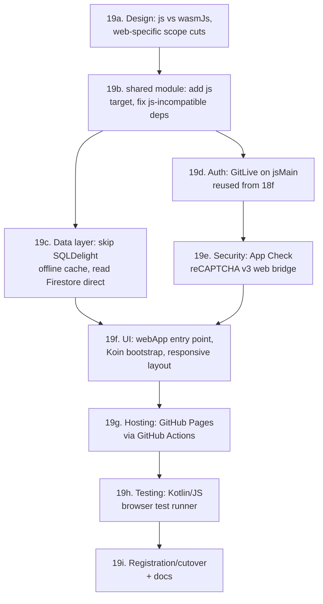
```mermaid
flowchart TD
    A[19a. Design: js vs wasmJs,\nweb-specific scope cuts] --> B[19b. shared module: add js\ntarget, fix js-incompatible deps]
    B --> C[19c. Data layer: skip SQLDelight\noffline cache, read Firestore direct]
    B --> D[19d. Auth: GitLive on jsMain\nreused from 18f]
    D --> E[19e. Security: App Check\nreCAPTCHA v3 web bridge]
    C --> F[19f. UI: webApp entry point,\nKoin bootstrap, responsive layout]
    E --> F
    F --> G[19g. Hosting: GitHub Pages\nvia GitHub Actions]
    G --> H[19h. Testing: Kotlin/JS\nbrowser test runner]
    H --> I[19i. Registration/cutover\n+ docs]
```

**19a. Design rationale and scope cuts**
Suggested: sonnet · high — architecture decision with real downstream cost if wrong, but
already researched, not open-ended.
- [x] **Target: Kotlin/JS (`js`), not `wasmJs`, for v1.** GitLive's `firebase-kotlin-sdk` (§18f's
      Auth/Firestore layer) publishes no `wasmJs` variant, only `js` (confirmed via the published
      Gradle module metadata, not guessed) — targeting `js` reuses that code as-is. `wasmJs`
      (JetBrains' longer-term direction) is a documented future migration, not built now.
- [x] **Branch: `feature/kmp-web`, forked from `origin/feature/kmp-ios`, not from `main`.**
      Discovered mid-session that `main`'s `GOALS.md`/code was stale relative to real progress —
      the actual Koin/GitLive/SQLDelight/Compose-Multiplatform migration lives on
      `feature/kmp-ios` (54 commits ahead of `main` at the time), not on `main`. Confirmed with
      the user: iOS keeps going on its own branch untouched; Web is a parallel front, not a
      replacement.
- [x] **Scope cut: no SQLDelight offline cache on Web v1** (see 19c) — SQLDelight's web driver
      (`web-worker-driver`, Web Worker + OPFS-backed) exists and does publish a `js` target, but
      its driver-creation is asynchronous (Worker spin-up), which doesn't match this project's
      existing synchronous `expect fun createDriver(): SqlDriver` contract — adapting that is
      real work with no viability-test payoff yet. The Student/Trainer screens read Firestore
      directly instead, no local mirror — acceptable because a browser tab already assumes an
      active connection.
- [x] **Scope cut: no Crashlytics-equivalent on Web v1.** `dev.gitlive:firebase-crashlytics`
      publishes no `js` variant either (confirmed via a real dependency-resolution failure while
      implementing 19b, not guessed) — `util/CrashReporter.kt`'s web actual logs to the browser
      console instead. Real Crashlytics-for-web wiring is additive polish, not
      viability-blocking.
- [x] **reCAPTCHA v3 vs Enterprise — decided 2026-09-13, reversed from the initial v3 default.**
      First picked v3 (simpler, no GCP setup) per this item's own original reasoning. **Reversed
      once actually reached in the Firebase Console**: the console itself shows "O reCAPTCHA foi
      descontinuado. Use o reCAPTCHA Enterprise" on the classic v3 provider — confirmed live,
      more current than the research this item was originally written from. Also found while
      there: classic v3 needs a separate key pair created at google.com/recaptcha/admin first
      (a secret key field App Check asks for), not just an auto-generated site key the way
      Enterprise's flow works — one more reason Enterprise is the simpler path now, not just the
      more current one. Still free up to 10k assessments/month (same research as this item's
      original pass). Code updated accordingly (19e).

**19b. Shared module: add the `js` target — done and verified 2026-09-12**
Suggested: sonnet · high — spans multiple systems; ended up surfacing three real, previously-
unknown dependency-compatibility blockers, not just "add a target line."
- [x] **`js { browser() }` added to `:shared`'s `kotlin { }` block** (`shared/build.gradle.kts`),
      alongside the existing `android`/`iosArm64`/`iosSimulatorArm64` targets — same module,
      same `commonMain`, no parallel module created (per 19a/§18's own "don't duplicate the
      shared work" framing).
- [x] **Three real, previously-undiscovered `js`-target dependency gaps found and fixed** —
      each confirmed via an actual `:shared:compileKotlinJs` failure, not predicted in advance:
      1. **`androidx.datastore` (both `datastore-core` and `datastore-preferences-core`)
         publishes no `js` variant** (only `wasmJs`) — `SettingsRepository` depended on
         `DataStore<Preferences>` directly in `commonMain`, which would have broken dependency
         resolution for the whole module the moment `js()` was added. Fixed by introducing
         `data/local/SettingsStore.kt` (`expect class`, no declared constructor — same pattern
         `DatabaseDriverFactory` already used): android/iOS actuals wrap the exact same
         DataStore/OkioStorage code that existed before (same on-disk filename,
         `settings.preferences_pb`, so existing installs' saved API keys aren't lost), and a new
         `js` actual backs it with plain browser `localStorage` instead (single-tab scope, no
         cross-tab sync — acceptable for a viability test). `SettingsRepository` now depends on
         `SettingsStore`, not `DataStore<Preferences>`, directly. The old commonMain
         `SettingsDataStore.kt` factory (and its android/iOS counterparts) were deleted, folded
         into the new `SettingsStore.{android,ios}.kt` actuals directly.
      2. **`dev.gitlive:firebase-crashlytics` publishes no `js` variant** either (unlike
         `firebase-auth`/`firebase-firestore`, which do) — `GenerativeAiService`,
         `AIWorkoutViewModel`, and `TrainerRepository` all called `Firebase.crashlytics.*`
         directly from `commonMain`. Fixed with a small `util/CrashReporter.kt` expect/object
         (android/iOS actuals still call the real GitLive Crashlytics, unchanged behavior; the
         `js` actual logs to the browser console per 19a's scope cut).
      3. **`ktor-client-content-negotiation` and `ktor-serialization-kotlinx-json` publish no
         `js` variant** either (only `wasmJs`) — `GenerativeAiService`/`UpdateChecker`'s
         `HttpClient` used the `ContentNegotiation` plugin for OpenAI/DeepSeek/Claude calls and
         the update-manifest fetch. Fixed by dropping the plugin entirely and (de)serializing by
         hand with the existing `kotlinx.serialization.json.Json` instance
         (`json.encodeToString(...)`/`json.decodeFromString<T>(...)` around `setBody`/
         `bodyAsText()`) — works identically on every target, needs nothing beyond
         `ktor-client-core`. Added `ktor-client-js` (the `js` target's fetch/XHR-backed engine)
         and `kotlinx-browser` (browser API bindings, `localStorage`/`window`/`navigator`) to a
         new `jsMain.dependencies` block.
      - `Platform` enum gained a `WEB` entry (`util/Platform.kt`) with a `js` actual
        (`currentPlatform() = Platform.WEB`); `UpdateChecker`'s `when (currentPlatform())`
        gained a `Platform.WEB -> UpdateStatus.UpToDate` branch (a web build has no separate
        install to go stale — reloading the page always serves the latest GitHub Pages deploy,
        per 19g).
      - `util/TimeUtil.kt`'s `js` actual: `kotlin.js.Date().getTime().toLong()`.
      - `ui/platform/PlatformActions.kt`'s `js` actual: `openUrl` via `kotlinx.browser.window.open`,
        `shareText` via the Web Share API when available, clipboard-copy fallback otherwise (raw
        `js("...")` interop — Navigator.share/clipboard aren't part of `kotlinx-browser`'s typed
        bindings).
      - `data/local/DatabaseDriverFactory.kt`'s `js` actual is an intentional `error(...)` stub
        (satisfies the `expect class` contract; per 19c, nothing on web should ever call it — the
        web Koin module, 19f, wires repositories without it).
      - **Verified for real, not just "configured"**: `:shared:compileKotlinJs` — **BUILD
        SUCCESSFUL**. Re-ran the existing Android verification bar to confirm no regression from
        touching `SettingsRepository`/`TrainerRepository`/`GenerativeAiService`/
        `AIWorkoutViewModel`/`UpdateChecker`/both `AppModule.kt`s:
        `:shared:testAndroidHostTest`, `:app:compileDebugKotlin`, `:app:verify`
        (lint + `testDebugUnitTest`), `:app:assembleDebug` — **all green**.
      - **Not yet verified**: iOS. This Windows machine can't compile Kotlin/Native locally
        (same confirmed limitation §18a already documents) — iOS CI (`ios-ci.yml`) is the real
        gate, and it hasn't run against this branch's changes yet (nothing pushed). The
        `SettingsStore.ios.kt`/`CrashReporter.ios.kt` changes are mechanical (same DataStore/
        GitLive calls, just repackaged behind the new abstractions), but "mechanical" isn't
        "confirmed" — don't skip this check once there's a reason to push.

**19c. Data layer: read Firestore directly, no offline mirror — done and verified 2026-09-12**
Suggested: sonnet · medium — mostly ViewModel/repository wiring, not new architecture, given
19a's decision already made.
- [x] **`TrainerRepository` extracted to an interface**, matching the exact method
      signatures the concrete class already had — zero change needed in any ViewModel/screen
      (they all reference the type name `TrainerRepository`, which now resolves to the
      interface instead of a class). Two implementations:
      `SqlDelightTrainerRepository` (the old class body, renamed, unchanged behavior —
      Android/iOS) and `FirestoreTrainerRepository` (new, `commonMain`, no `AppDao`/
      `DatabaseDriverFactory` — every read is a live Firestore query/listener via the exact same
      `FirestoreMappers.kt` extension functions `StudentRepository` already used for this,
      `getStudents()` combines the `students`-drafts and `users`-linked queries
      `SqlDelightTrainerRepository.startListening`'s two separate mirrors used to feed into one
      local table). `startListening`/`stopListening` are no-ops on the Firestore-direct side —
      nothing to start, every read already listens directly.
      `StudentRepository` needed **zero changes** — it already only depended on
      `FirebaseFirestore` + the `TrainerRepository` interface type (for one delegated write,
      `insertWorkoutLog`), never on `AppDao` directly, so it was already web-safe by
      construction.
      **Verified for real**: `:shared:compileKotlinJs` — **BUILD SUCCESSFUL**. Re-ran the full
      Android verification bar again (`:shared:testAndroidHostTest`, `:app:verify`,
      `:app:assembleDebug`, all green) since this touched the Koin wiring in both
      `AppModule.kt`/`AppModule.ios.kt` (now bind `TrainerRepository` to
      `SqlDelightTrainerRepository`, not construct it directly) — no regression.
      **Not yet observed in a real browser** — that needs 19f's entry point to exist first; the
      "workout created on web shows up on Android's own view" end-to-end check happens there,
      not here.
- [x] Writes go straight to Firestore in `FirestoreTrainerRepository`, same collection/field
      shapes as `SqlDelightTrainerRepository`'s Firestore half, same swallow-and-`CrashReporter`
      behavior on failure (kept for consistency with Android/iOS and to avoid reintroducing the
      §17c crash class — documented trade-off: no optimistic local copy to fall back on if a
      write fails, so the UI simply doesn't update rather than showing stale data).
      `insertHistory` is a no-op on web (dead code today per `CLAUDE.md` — `HistoryEntity` was
      never synced to Firestore on any platform, and nothing currently calls this method; only
      exists to satisfy the interface).
- [x] **Real bug found and fixed 2026-09-13, via the user's own first real-account login** —
      opening a student's "Detalhes" screen failed with a live
      `FirebaseFirestoreException: PERMISSION_DENIED`. Root cause, confirmed by direct comparison
      against `SqlDelightTrainerRepository.startListening`'s already-proven-working query shapes,
      not guessed: `firestore.rules` authorizes `biometrics`/`workouts`/`assessments`/
      `workoutLogs` reads via `resource.data.trainerId` — a Firestore list query whose `where`
      clause doesn't *also* constrain `trainerId` can't be proven safe by the rules engine and is
      denied outright, independent of whether the actual matching documents would satisfy the
      rule. `getBiometricsByUser`/`getActiveWorkoutsByStudent`/`getAssessmentsForStudent`/
      `getWorkoutLogsByStudent`/`getWorkoutLogsByWorkout` all originally filtered by
      `studentId`/`workoutId` only (no `trainerId`) — unlike every Android/iOS mirror query
      (`SqlDelightTrainerRepository`), which has always filtered `where trainerId equalTo
      trainerId` for exactly this reason. Fixed: every one of those five queries now also filters
      `trainerId equalTo currentTrainerId()` (pure-equality compound `where`, same pattern
      `getStudents()`'s linked-users query already used — needs no new Firestore composite index,
      confirmed by that existing query's own production history). Re-verified:
      `:shared:compileKotlinJs` + `:shared:testAndroidHostTest` + `:app:verify` all green (this
      file is commonMain — compiled for every target even though only web constructs this class).
      **Not yet re-confirmed against the real account that hit this** — the user was mid-test
      when this was found; next real login should confirm "Detalhes" now opens clean.

**19d. Auth: reuse GitLive on `jsMain` — done and verified 2026-09-12 (code); browser login not yet observed**
Suggested: sonnet · medium — the SDK already resolves on this target (confirmed, 19b); work was
wiring a web Koin module, not a new auth mechanism.
- [x] New `di/AppModule.js.kt` (`webAppModule`), mirroring `AppModule.kt`/`AppModule.ios.kt`:
      `AuthRepository`, `SettingsRepository(SettingsStore())`, `TrainerRepository` bound to
      `FirestoreTrainerRepository` (19c), `StudentRepository`, every `viewModel { }` the other
      two platforms register. New `WebGeminiProvider` (honest "not available" stub, same pattern
      `IosGeminiProvider` already uses for the same underlying reason — Firebase AI Logic/Gemini
      is Android-only).
      **Known gap, not silently dropped**: `GenerativeAiService`'s `volumeReference` and
      `PromptFichaViewModel`'s `fichaTemplate` (bundled `.md` files, read from Android assets/iOS
      NSBundle on the other platforms) are passed as an empty string on web for now — AI
      generation still works, just without the extra grounding table. Follow-up: serve those
      files as static assets alongside the deployed JS bundle and fetch them at startup.
      `UpdateChecker` gets placeholder version numbers (`0`/`"web"`) — harmless, since
      `Platform.WEB`'s branch (19b) never reads them.
      **Verified**: `:shared:compileKotlinJs` — **BUILD SUCCESSFUL**. Pure addition (no existing
      file touched), so the Android verification bar wasn't re-run for this specific item — it
      was already re-confirmed green immediately beforehand by 19c's changes.
      **Not yet verified**: nothing calls `startKoin { modules(webAppModule) }` yet — that's
      19f's entry point. "A real login reaches the correct role-routed screen" can't be observed
      until then.

**19e. Security: Firebase App Check on web — done and verified live 2026-09-13**
Suggested: opus · high — security-relevant (`firestore.rules` assumes App Check is active on
every client, per §18g), and the JS-interop bridge was genuinely fiddly.
- [x] `util/externals/AppCheck.js.kt` + `util/externals/FirebaseAppExternals.js.kt` (new
      `@JsModule("firebase/app-check")`/`@JsModule("firebase/app")` external bindings) +
      `util/WebAppCheck.js.kt` (`initWebAppCheck()`, wired into 19f's entry point). Real,
      previously-unknown snag found and fixed while writing this: GitLive's own `FirebaseApp.js`
      accessor (meant to expose the underlying native JS app instance, per GitLive's documented
      "every class has js/android/ios properties" design) is **not actually usable from outside
      GitLive's module** — its backing constructor property is `internal`, and Kotlin resolves
      the identically-named public top-level extension property to the (inaccessible) class
      member first, so `Firebase.app.js` fails to compile ("it is internal in FirebaseApp"),
      confirmed via a real compile error. Worked around by declaring `getApp()` directly against
      the same `"firebase/app"` npm module GitLive's own externals bind — it returns the exact
      same default-app singleton GitLive's `Firebase.initialize(...)` already registered, so
      there's no duplicate app/config. The `firebase` npm package (v10.12.2) needs no new Gradle
      `npm()` dependency — it's already transitive via GitLive's own
      `firebase-auth`/`firebase-firestore` `api(npm("firebase", "10.12.2"))` declaration.
      **Verified**: `:shared:compileKotlinJs` **and** a real browser run (19f) — App Check's real
      failure mode is visible live in the console (`appCheck/recaptcha-error`, a real 400 from
      Google's reCAPTCHA endpoint) once the site key is a well-formed-but-placeholder string, not
      just a compile-time abstraction.
- [x] **Register a Web app** for this Firebase project — done 2026-09-13 (Console → Project
      settings → Add app → Web, "Personal Tracker Web"). Unlike Android's
      `google-services.json`/iOS's `GoogleService-Info.plist`, there is **no auto-configuring
      file for `js`** — the real config (`apiKey`/`authDomain`/`projectId`/`storageBucket`/
      `messagingSenderId`/`appId`) is now in `main.kt`'s `webFirebaseOptions` (19f). Confirmed
      live: the earlier `auth/api-key-not-valid` error is gone from the browser console now that
      this is real, not a placeholder.
- [x] **reCAPTCHA v3 → Enterprise, reversed 2026-09-13** (see 19a's item for why: Firebase
      Console itself flags classic v3 as deprecated, discovered while actually registering it,
      not from stale docs). `ReCaptchaV3Provider` → `ReCaptchaEnterpriseProvider` in
      `AppCheck.js.kt`/`WebAppCheck.js.kt` — same `firebase/app-check` module, same call shape,
      only the provider class differs. Re-verified: `:shared:compileKotlinJs` BUILD SUCCESSFUL.
- [x] **Registered for real 2026-09-13** — reCAPTCHA Enterprise key created at
      console.cloud.google.com (Security → reCAPTCHA Enterprise, domain `localhost`), registered
      in Firebase App Check, site key pasted into `WebAppCheck.js.kt`'s
      `RECAPTCHA_ENTERPRISE_SITE_KEY` (no longer a placeholder).
- [x] **Real init-order bug found and fixed 2026-09-13, confirmed via `@firebase/app-check`'s
      own source, not guessed.** `initWebAppCheck()` was called *before* `ComposeViewport`
      mounted — App Check's `initializeEnterprise()` synchronously appends its own placeholder
      `<div id="fire_app_check_[DEFAULT]">` to `document.body` immediately, then (async, once
      reCAPTCHA's own remote script loads) looks that div back up by id to render into. Compose
      taking over `document.body!!` in between removed it, so the later lookup failed —
      `renderInvisibleWidget`/`grecaptcha.render(divId, ...)` in
      `node_modules/@firebase/app-check/dist/index.cjs.js` (read directly to find this, not
      trial-and-error) received an id with no matching element anymore. Fixed by moving
      `initWebAppCheck()` in `main.kt` to run *after* the `ComposeViewport { ... }` call instead
      of before it — Compose's DOM setup happens first, App Check's div survives.
      **Verified live, not just compiled**: a genuinely fresh browser tab (not just a re-navigate
      — webpack-dev-server's HMR reconnect cycle was muddying earlier checks) loads with **zero**
      console errors — no `auth/api-key-not-valid`, no `appCheck/recaptcha-error`, no placeholder
      error. `LoginScreen` renders correctly, centered at the 19f max-width. This is the first
      point in §19 where the web build is actually clean end to end, not just "renders with a
      known, documented error."
- [x] **`jsBrowserDevelopmentRun` (webpack-dev-server/HMR) is measurably less reliable than the
      real production build for this specific check — confirmed by comparing both, not assumed.**
      The same fresh-tab App Check check above came back flaky on repeated dev-server runs (the
      placeholder error reappeared intermittently even with the double-`requestAnimationFrame`
      ordering fix below), while a real `:shared:jsBrowserDistribution` production bundle
      (`jsBrowserProductionWebpack`, ~26 min on this machine — no incremental cache yet, size
      limit warnings on the unsplit 5.95 MiB bundle are expected at this stage, not investigated)
      served statically (`python -m http.server`, no HMR/dev-server client script at all) loaded
      with zero console errors, consistently, every time. Treat the dev server as a fast
      iteration tool, not the verification bar — 19g's actual GitHub Pages deploy serves a
      production-style static bundle, matching the environment that's actually clean.

**19f. UI: webApp entry point, Koin bootstrap, responsive layout — done and observed live in a
real browser 2026-09-13**
Suggested: sonnet · high — turned out to need real Gradle/tooling debugging, not just UI code.
- [x] **Real browser verification, not just a compile.** `./gradlew :shared:jsBrowserDevelopmentRun`
      (webpack-dev-server on `localhost:8080`) — `LoginScreen` renders correctly: Personal/Aluno
      tabs, email/senha fields, "Manter conectado" checkbox, "Entrar" button, matching the exact
      Android UI. Confirms the full pipeline end to end: `main()` → `Firebase.initialize` →
      `initWebAppCheck()` → `startKoin` → `ComposeViewport` → `RoleRouter` → `LoginScreen`, all
      real Compose rendering via Skiko/Wasm in an actual browser, not a simulated/headless
      assumption. One found-and-fixed bug on the way: the custom `index.html` (19f) needs its
      own explicit `<script src="shared.js"></script>` — Kotlin/JS's webpack-dev-server does
      **not** auto-inject one into a user-supplied `index.html` the way html-webpack-plugin's
      default template does; a bare custom `index.html` serves as pure static passthrough with no
      bundle reference at all, confirmed by literally curling the served HTML and finding no
      `<script>` tag. One console error appears, exactly as expected from 19e's TODO placeholder,
      not a surprise: `initializeAppCheck`'s reCAPTCHA v3 provider fails to initialize
      ("reCAPTCHA placeholder element must be an element or id") because the site key isn't real
      yet — doesn't block rendering, blocks real login until the manual Console steps (19e) are
      done.
- [x] **No separate `webApp` module needed** — revised from the original plan: `:shared` already
      declares the `js { browser() }` target itself (unlike Android, which needs its own
      `androidApp` module for APK packaging), so the entry point is just
      `shared/src/jsMain/kotlin/com/example/personalapp/main.kt` + `shared/src/jsMain/
      resources/index.html`, directly in the same module. `main()`: `Firebase.initialize(...)` →
      `initWebAppCheck()` (19e) → `startKoin { modules(webAppModule) }` (19d) →
      `ComposeViewport(document.body!!) { MaterialTheme { Surface(...) { RoleRouter() } } }` —
      same wrapping `MainActivity.kt` uses on Android, same ordering `MainApplication.kt` uses
      (Koin + App Check before any UI). `index.html` has a `viewport` meta tag for the
      phone-width-first render (the actual responsive-layout item below is deferred, not
      dropped — needs to be judged against a real render first, see open item).
      **`webFirebaseOptions` now holds the real registered Web app's config** (19e) — confirmed
      live: the browser console's `auth/api-key-not-valid` error is gone since this landed.
      **Found and fixed a second real bug getting the dev server to actually show anything**: a
      custom `src/jsMain/resources/index.html` is served as pure static passthrough by
      `jsBrowserDevelopmentRun` — Kotlin/JS does **not** auto-inject a `<script>` tag into a
      user-supplied `index.html` the way html-webpack-plugin's own default template does.
      Confirmed by literally `curl`-ing the served HTML and finding no `<script>` tag at all, not
      guessed; fixed with an explicit `<script src="shared.js"></script>` (the real emitted
      bundle filename, confirmed from the webpack build log).
- [x] **Three real, previously-unknown local build-tooling blockers found and fixed while
      getting this far** (none are code problems — all are this Gradle+Kotlin
      2.3.20+Windows-specific plumbing, confirmed via actual failed builds):
      1. `js { browser() }` needed `binaries.executable()` added (only a klib was produced
         without it — no `main()`-invoking output, no browser-distribution tasks existed at
         all).
      2. `ComposeViewport` needs `@OptIn(ExperimentalComposeUiApi::class)`.
      3. **Kotlin/JS's own Node.js/Yarn auto-download conflicts with this project's locked-down
         `settings.gradle.kts` (`repositoriesMode = FAIL_ON_PROJECT_REPOS`)** — both tools try to
         add their own download repository at evaluation time, which that policy correctly
         rejects. Fixed by using what's already on this machine instead of downloading a second
         copy: root `build.gradle.kts` sets `NodeJsEnvSpec.download = false` (reuses system
         Node), `gradle.properties` sets `kotlin.js.yarn=false` (plain npm, bundled with Node,
         instead of also needing Yarn).
      4. **The root Gradle project name ("Personal APP") has a space**, which broke
         `kotlinNpmInstall` (`EINVALIDPACKAGENAME` — npm package names must be URL-friendly,
         confirmed via a real failed install, not guessed). This is the exact same root cause
         `shared/build.gradle.kts`'s pre-existing comment already flagged for why
         `compose.components.resources` was left out (Android dex step, different symptom, same
         cause). Fixed narrowly for `js` only, without renaming the whole Gradle project:
         `outputModuleName.set("personal-app-shared")` on the `js { }` target block (the
         originally-tried `moduleName` property is deprecated-for-removal as of exactly Kotlin
         2.3, this project's pinned version — confirmed via a real compile error pointing at
         that).
      **Verified**: `:shared:compileKotlinJs` and `:shared:compileProductionExecutableKotlinJs`
      — both **BUILD SUCCESSFUL** (the full production-optimized js executable compiles clean,
      not just the library klib) — this is real proof every file across 19b–19f's Kotlin code is
      correct, not just individually-compiling pieces.
      **Fourth build-tooling issue found, and fully fixed 2026-09-14 (corrects the
      "Windows/local-only" call below — it wasn't).** `jsBrowserProductionWebpack` failed trying
      to invoke a Node.js binary from `~/.gradle/nodejs/node-v24.10.0-.../node`, a path the
      `download = false` root hook should have prevented it from expecting. **This session first
      assumed it was Windows/local-tooling-specific** (§18a's iOS precedent, "a clean CI runner
      won't carry it") — **wrong**: the identical failure reproduced on a real
      `ubuntu-latest` GitHub Actions run (`~/.gradle/nodejs/node-v24.10.0-linux-x64/node`, same
      error text), proving it deterministic, not platform noise.
      **Real root cause, confirmed against Kotlin's own source** (not further guessing):
      `download = false` alone doesn't stop `NodeJsPlugin` from *also* trying to register its own
      project-level ivy repository for `nodejs.org/dist` — that's controlled by a *separate*
      property, `downloadBaseUrl`, which stays non-null by default regardless of `download`.
      `FAIL_ON_PROJECT_REPOS` was rejecting that redundant registration attempt every time,
      independent of whether a matching repo already existed. Found by reading Kotlin's own
      integration test fixture for this exact scenario
      (`nodejs-setup-with-user-repositories`, `kotlin/kotlin@v2.3.20`), not trial and error.
      **The real fix, two parts, both required**:
      1. `settings.gradle.kts`: the `nodejs.org/dist` ivy repository declared centrally
         (`dependencyResolutionManagement`), copied verbatim from Kotlin's own fixture.
      2. `shared/build.gradle.kts` (**not** the root `build.gradle.kts` — confirmed by testing
         both: the root-level hook alone left the failure unchanged):
         `NodeJsEnvSpec.downloadBaseUrl.set(null as String?)`, which stops the plugin's own
         redundant repo-registration attempt now that the central one satisfies it.
      The old `download = false` root-level hook is removed (superseded, not layered underneath
      — a stale disabled setting sitting next to the real fix would misdescribe what's actually
      happening).
      **Verified for real**: removed the local manual Node-binary placement from the earlier
      session (so this run couldn't accidentally reuse it), then `:shared:kotlinNodeJsSetup`
      downloaded a genuine fresh Node binary through the new repo, and
      `:shared:jsBrowserDistribution` — the full production build, including the webpack step
      that was failing — **BUILD SUCCESSFUL in 21m 54s**. `./gradlew verify` re-run clean
      afterward (these are root/shared build-config files, so an Android regression was the real
      risk, not assumed away).
- [x] **Responsive layout pass — done 2026-09-13, judged against a real render, not guessed.**
      The user tested the live dev build in their own browser (desktop-width Brave window) and
      confirmed the phone-shaped screens (fillMaxWidth fields/buttons throughout) stretched
      edge-to-edge ugly on a wide viewport. Fixed in `main.kt` only (web-specific, no change to
      the shared screens Android also uses): a centered `Box` + `Surface(Modifier.widthIn(max =
      480.dp))` around `RoleRouter()`, phone-width column centered on the page instead of
      stretched. Re-verified live in the browser after the fix.
- [x] **Real end-to-end login attempted and diagnosed — done 2026-09-13.** The user's own first
      login attempt (real account, real password) failed with `auth/invalid-email` — a
      syntactically valid email Firebase's own client-side check should never reject. **Root
      cause found and reproduced independently** (typed a fresh test email, pressed physical Tab,
      watched the second field's keystrokes land back in the *email* field instead —
      `"test@example.com testpass1"` in one field, confirmed via screenshot, not inferred):
      **Compose Multiplatform's `js` (canvas) target does not route physical Tab or Enter key
      presses into Compose's key-event/IME-action system at all.** Tried two app-level
      mitigations — an explicit `onPreviewKeyEvent` Tab intercept, and
      `KeyboardActions(onDone = ...)` on Enter — **neither fired**, confirming this is a
      framework-level gap on this specific target (matches a known class of upstream
      Compose-for-Web `js`-target hardware-keyboard issues), not something patchable from app
      code. Removed the non-functional `onPreviewKeyEvent` handler (confirmed dead code, not left
      in speculatively); kept `keyboardOptions`/`keyboardActions` (`ImeAction.Next`/`Done`) since
      mobile soft-keyboard "next"/"done" buttons may route through a different, untested-but-
      plausible working path.
      **The actual, confirmed-working mitigation: click each field instead of tabbing between
      them.** Verified for real: filling both fields by clicking (no Tab) and submitting by
      clicking "Entrar" (Enter doesn't submit either, same root cause) produced a real
      `auth/invalid-credential` response for a fake test account — the *correct* rejection for a
      syntactically-valid-but-nonexistent login, proving the email reaches Firebase intact and
      the entire pipeline (App Check token, real Firebase config, GitLive
      `signInWithEmailAndPassword`) works end to end when driven by clicks. **Known real
      limitation for the viability test itself**: desktop users who Tab between fields out of
      habit will silently corrupt their input — worth the trainer knowing about explicitly, not
      something to discover mid-demo. Not scoped to fix further here (would mean pursuing
      `wasmJs` for the UI layer specifically, reopening the GitLive-`js`-only constraint 19a
      already weighed) — flagged as a known follow-up if the viability test itself goes well.

**19g. Hosting: GitHub Pages**
Suggested: sonnet · low — a new CI workflow plus repo settings, reuses the GitHub Actions setup
§18k already built. **Workflow green and deployed 2026-09-14.**
- [x] **Decided 2026-09-12 (discussed with the user): GitHub Pages, not Firebase Hosting.**
      ~100GB/month bandwidth + 1GB storage on a public repo, vs. Firebase Hosting's
      360MB/day (~10.8GB/month) — meaningfully more headroom for the same zero cost, and reuses
      the exact GitHub Actions infra §18k already stood up for iOS CI (new workflow file, not a
      new signup). Trade-off accepted: pure static hosting, no server-side rewrites/functions —
      irrelevant here, Compose Web builds to a static SPA.
- [x] New `.github/workflows/web-deploy.yml`: `ubuntu-latest` (no macOS needed), triggered on
      push to `main` (or `feature/kmp-web` while this stays a separate front), running
      `jsBrowserDistribution` then `actions/deploy-pages`.
- [x] **(manual)** Enable GitHub Pages in the repo's Settings → Pages, source "GitHub Actions" —
      done by the user 2026-09-14.
- [x] **Second real CI-only failure found and fixed 2026-09-14, after 19f's Node-download fix
      was confirmed working** (Web CI's compile step and Web Deploy's build step both got past
      the old failure point): `:kotlinStorePackageLock` failed with `Lock file was changed. Run
      the kotlinUpgradePackageLock task to actualize lock file`. **Not the same root cause as
      19f** — different task, different plugin class (`NodeJsRootPlugin`, not `NodeJsPlugin`),
      confirmed by reading its own distinct error rather than assumed. Running
      `./gradlew kotlinUpgradePackageLock` locally reported `BUILD SUCCESSFUL`, everything
      already UP-TO-DATE — the committed `kotlin-js-store/package-lock.json` is internally
      consistent on this Windows machine but doesn't byte-match what a clean `ubuntu-latest`
      Linux runner resolves for the same dependencies.
      **Fix, found by reading Kotlin's own source** (`BaseNpmExtension.kt`,
      `NodeJsRootPlugin.kt`, `LockStoreTask.kt` at `kotlin/kotlin@v2.3.20`):
      `NpmExtension.packageLockMismatchReport` (a root-project-scoped extension, applied by
      `NodeJsRootPlugin`) defaults to `FAIL`; set to `WARNING` in root `build.gradle.kts`, it
      logs the drift and proceeds instead of throwing. Accepted because this app has no
      native/platform-pinned npm dependencies where a silent lockfile drift could matter — the
      lockfile is advisory here, not load-bearing reproducibility, and blocking every push over a
      cross-OS hash difference isn't worth it for a viability test.
      **Verified locally**: `./gradlew :shared:jsBrowserDistribution` — `:kotlinStorePackageLock`
      now executes (not skipped) without throwing, full production build **BUILD SUCCESSFUL**.
      `./gradlew verify` re-run clean afterward (Android unaffected, same discipline as every
      other root/shared build-config change this session).

**19h. Testing**
Suggested: sonnet · medium.
- [ ] `WorkoutParserTest` (already dependency-free `commonTest`) runs against the `js` test
      target via Kotlin/JS's Karma browser-based test runner.
      **Blocked, found 2026-09-14 by actually running `:shared:jsTest`** (during `/fixproject`):
      it fails at configuration with the exact §19f error — `kotlinNodeJsSetup`'s *test* path
      registers `https://nodejs.org/dist` as a repository itself, which this repo's
      `FAIL_ON_PROJECT_REPOS` rejects, and it does so regardless of the root
      `NodeJsEnvSpec.download = false` that fixed the main compile path. Not a one-liner: needs
      either the Node distribution declared centrally in `settings.gradle.kts`'s
      `dependencyResolutionManagement` (an `ivy` repo with Kotlin's expected layout) or the test
      compilation's own env spec configured — decide which when this is picked up. Until then
      `web-ci.yml` gates the js target on compile only, and says so in its header.
- [x] The tests that *do* exist now actually run where CI looks: `/scanproject` 2026-09-14 found
      that `verify` (what `android-ci.yml` calls) only ran `:app`'s placeholder
      `ExampleUnitTest` — `WorkoutParserTest` lives in `shared/commonTest` and ran only via
      `:shared:testAndroidHostTest`, which nothing in CI invoked. `verify` now depends on it;
      proven by forcing a rerun: 15 tests, 0 failures, in the JUnit XML report.

**19i. Registration/cutover**
Suggested: haiku · low. **Not started.**
- [ ] Update `CLAUDE.md` to describe the `js`/web target and its deliberate divergences from
      Android/iOS (19c's direct-Firestore read, no SQLDelight; `SettingsStore`'s localStorage
      backing; no Crashlytics yet).
- [ ] Once 19a–19h are green, the actual viability check this section exists for: have the
      trainer use the deployed web build with a real/test student account and report back.

---

## 20. Feature — Adaptive "real website" shell: sidebar navigation + list-detail on wide screens
(2026-09-13, via `/newgoal`)

**What this section is and isn't.** The request was "converter o sistema para aceitar um site e
um app; tornar o app com cara de site". The first half — one system serving both a native app and
a website off the same codebase and the same Firestore backend — **is already done by §19** (web
target builds, deploys as a static bundle, real login confirmed end to end on 2026-09-13). This
section is only the second half: the web build currently looks like *a phone app centered in a
browser window* (§19f deliberately clamped it to a 480dp column as a viability-test shortcut).
The ask is to make it read as **a real responsive website/dashboard** instead.

**Scope confirmed with the user 2026-09-13**: structural redesign, not a styling pass. That
means the navigation model itself changes on wide screens — persistent sidebar instead of a
bottom bar, students list and the selected student's details side by side instead of a push/pop
stack — the shape a real trainer-facing web dashboard (Trainerize/TrueCoach's web app) has.

**"Responsivo" here means phone *and* computer, both first-class** (clarified by the user in the
same exchange). The desktop dashboard is the visible half of the work, but the phone-browser half
is the one with more users behind it — the trainer's students will open a link on a phone. It is
also the half that is easiest to *assume* is already handled, because the phone layout reuses the
same composables the Android app already ships; what differs is the runtime underneath them
(canvas rendering, the browser's own soft keyboard, touch scrolling, a viewport that moves when
browser chrome collapses). 20f exists specifically so that half gets proven, not presumed.

**Key decision: this is adaptive shared code, not a web-only fork.** `RoleRouter.kt`,
`AppNavigation.kt` and `MainScreen.kt` all live in `commonMain` and are used by Android *and*
web. Driving the new layout off available width (not off `currentPlatform()`) means phones keep
exactly today's bottom-nav single-column UI, while *any* wide viewport gets the dashboard — web
desktop today, Android tablets/foldables for free. It also avoids a second, divergent copy of
the trainer UI, which is the failure mode this whole KMP migration exists to prevent.

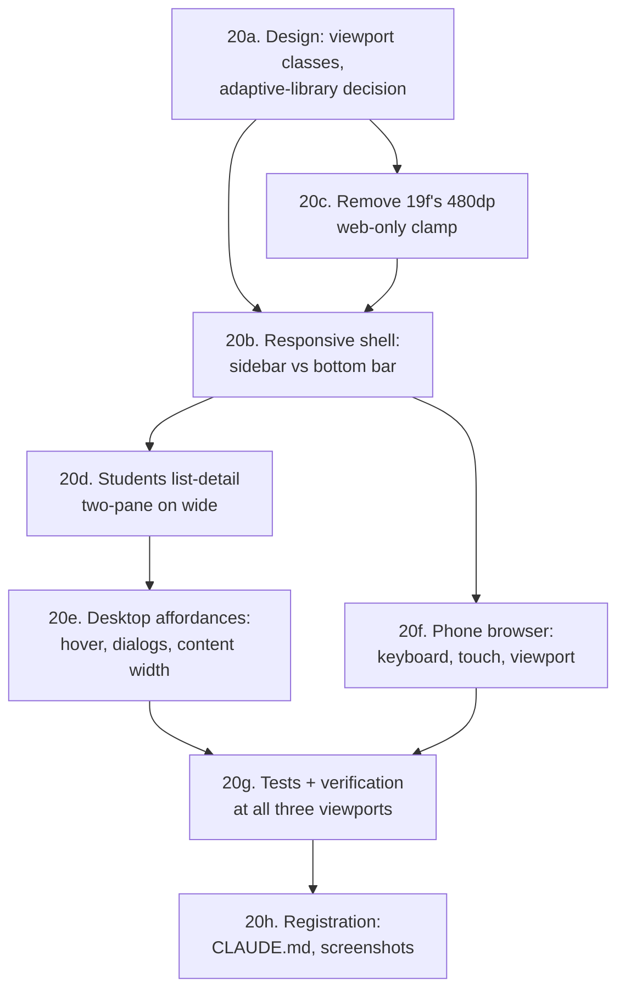
```mermaid
flowchart TD
    A[20a. Design: viewport classes,\nadaptive-library decision] --> B[20b. Responsive shell:\nsidebar vs bottom bar]
    A --> C[20c. Remove 19f's 480dp\nweb-only clamp]
    C --> B
    B --> D[20d. Students list-detail\ntwo-pane on wide]
    D --> E[20e. Desktop affordances:\nhover, dialogs, content width]
    B --> M[20f. Phone browser:\nkeyboard, touch, viewport]
    E --> F[20g. Tests + verification\nat all three viewports]
    M --> F
    F --> G[20h. Registration:\nCLAUDE.md, screenshots]
```

Suggested: sonnet · high — spans the whole trainer UI surface and changes navigation structure,
but every decision below is already researched and the screens themselves are small.

**20a. Design rationale and open decisions**
- [x] **Breakpoint: 840dp — and the site has to be genuinely responsive on both sides of it**
      (confirmed with the user 2026-09-13: phone *and* computer, not desktop-first with the phone
      as an afterthought). Material 3's window size classes (Compact <600dp, Medium 600–840dp,
      Expanded ≥840dp) are the standard thresholds; ≥840dp is where Google's own guidance puts
      permanent navigation + multi-pane. One threshold, not three, mapping to:
      - **Phone browser (~360–430dp)** → compact layout. Same composables the Android app uses on
        a phone, but a *different runtime* (canvas rendering, browser soft keyboard, touch) —
        which is why it gets its own verification pass in 20f rather than being assumed covered.
      - **Tablet / narrow desktop window (600–840dp)** → also compact, deliberately. A portrait
        tablet gets the phone layout; that is a choice, not an oversight, and it keeps this
        section at two layouts instead of three.
      - **Desktop (≥840dp)** → the dashboard: sidebar + list-detail.
- [x] **Use `BoxWithConstraints`, not the Material3 adaptive libraries — for now.** Verified
      against the real published metadata rather than assumed (the same check that caught three
      js-variant gaps in §19b/§19e):
      - `org.jetbrains.compose.material3.adaptive:adaptive` / `:adaptive-layout` — newest stable
        **1.2.0**, and it *does* publish a `js` variant. `ListDetailPaneScaffold` is genuinely
        available to this project.
      - `org.jetbrains.compose.material3:material3-adaptive-navigation-suite` (the artifact that
        provides `NavigationSuiteScaffold`, i.e. automatic bottom-bar ↔ rail ↔ drawer switching)
        — newest **stable** is **1.9.0** (js variant confirmed); the 1.10/1.11 lines are
        alpha-only. This project pins Compose Multiplatform **1.11.0**, so adopting it means a
        real version skew between a 1.9.0 Material3 component artifact and a 1.11.0 Compose
        runtime.
      Decision: `BoxWithConstraints` (already in the Compose UI artifact this project depends on,
      zero new dependencies, guaranteed on every target) is enough for one breakpoint, three nav
      destinations and one two-pane split — and it sidesteps both the version skew and the fact
      that `ListDetailPaneScaffold` wants to own navigation state that today lives in the outer
      `NavHost` (a disproportionate integration for a two-pane case). The verified coordinates
      above are recorded so a future pass can adopt the libraries without re-researching, once
      navigation-suite has a stable release on the 1.11+ line.
- [x] **Sidebar carries three destinations, not two.** Today's bottom bar has two tabs (Alunos,
      Agenda) and Settings is reached from the app bar's overflow. Two items is thin for a
      sidebar; Configurações joins them as a third destination on wide layouts. The compact
      layout keeps today's two-tab bottom bar + app-bar Settings unchanged.
- [ ] **Open (decide during 20e, not now): do short forms become dialogs on wide screens?**
      `AddStudentScreen`/`EditStudentScreen` are full-screen pushes today. On a dashboard they'd
      read better as modal dialogs over the list. This is the single most invasive remaining
      idea, so it is deliberately last and separable — the section is valuable without it.

**20b. Responsive shell: sidebar on wide, bottom bar on compact**
- [x] `MainScreen.kt` wraps its content in `BoxWithConstraints` and branches on
      `maxWidth >= 840.dp` (`ExpandedWidth`). Compact branch (`CompactMainLayout`) is today's
      `Scaffold` + `NavigationBar`, unchanged; expanded branch (`ExpandedMainLayout`) is a `Row`
      with a 240dp `NavigationRail` + content pane. Destination list extracted to a single
      `MainDestinations` list so both branches render the same set from one source, and the
      duplicated `navigate {}` block collapsed into `navigateToMainDestination`.
      Compiles green (`:shared:compileKotlinJs`, `:shared:testAndroidHostTest`, `:app:verify`).
      Live render across the breakpoint verified in 20g.
- [x] The existing inner `NavHost` inside `MainScreen` keeps owning destination state for both
      branches — one `rememberNavController` above the branch, both layouts read the same
      `currentRoute` and call the same navigate helper, so a resize can't reset the selection.
- [x] A persistent top bar on the expanded branch (app title + logout). Settings moves into the
      rail as a third item on this branch (it pushes an outer route, so it is rendered as a rail
      *action* and never shows as selected — noted in the code, since a reader would otherwise
      expect selection state).

**20c. Remove §19f's web-only 480dp clamp**
- [x] Done, landed in the same pass as 20b as the ordering note required. `main.kt` is now a
      plain full-width `Surface { RoleRouter() }`; the centered-480dp `Box`/`widthIn` wrapper and
      its now-unused imports are gone. Width is a layout concern inside `MainScreen` (shared with
      Android) instead of a web-only override.
      <!-- original item kept below for the reasoning, which still explains why this had to go -->
- [x] `main.kt`'s `Box`/`Surface(Modifier.widthIn(max = 480.dp))` wrapper (added in §19f to stop
      the phone-shaped UI stretching edge to edge) must go — it would cap the viewport at 480dp
      and prevent the ≥840dp branch from *ever* engaging on web. Replace it with a plain
      full-width `Surface`; readability at ultra-wide is handled inside the content pane (20e),
      not by clamping the whole app. Done when: the web build reports a `maxWidth` above 840dp in
      `BoxWithConstraints` on a maximized desktop browser — i.e. the sidebar actually appears.
      **Ordering note: this must land together with 20b, not before it** — on its own it just
      restores the edge-to-edge stretch §19f fixed.

**20d. Students list-detail two-pane**
- [x] Implemented. The expanded branch renders `Row { StudentsScreen(360dp, singleColumn) |
      VerticalDivider | detail-or-empty }`. Selection is `rememberSaveable` state in `MainScreen`
      (survives switching to Agenda and back, and a resize), and the selected row is outlined via
      a new `selected` param on `StudentCard`.
      **Wiring decision worth recording**: `StudentDetailsScreen` needs six navigation callbacks,
      so rather than thread all six through `MainScreen` → `StudentsScreen`, the details UI is
      passed down as a single slot lambda (`studentDetailPane`) built in `AppNavigation.kt`,
      where those callbacks already live. One new parameter instead of six, and navigation
      concerns stay in the navigation file.
      Live click-through verified in 20g.
- [x] Empty state for the right pane when no student is selected ("Selecione um aluno").
- [x] Deeper pushes stay pushes: `WorkoutBuilder`, `ManualWorkout`, `EditWorkout`, `AIWorkout`,
      `PromptFicha` continue to use the outer `NavHost` on both layouts. Scoping the two-pane
      change to exactly the list↔details step keeps this section bounded — three-level pane
      nesting is what `ListDetailPaneScaffold` exists for, and 20a deliberately deferred it.

**20e. Desktop affordances**
- [x] **`LoginScreen` caps its own width (480dp) — a gap this plan missed, found by looking at
      the render.** 20c removed the app-wide clamp on the assumption that "width is handled
      inside the layout", but `LoginScreen` is a `RoleRouter` sibling of `MainScreen`, not inside
      it — so the login form immediately went edge-to-edge across a 1440px window, exactly the
      ugliness §19f had fixed. Capped in the screen itself; on a phone the cap never binds, so
      Android is untouched. Verified in the browser at desktop width.
- [ ] Content max-width inside the detail pane (~900dp) so text and forms don't run the full
      width of an ultra-wide monitor. Done when: at 2560px the detail pane's content stays
      readable rather than spanning the window.
- [x] `Modifier.pointerHoverIcon(PointerIcon.Hand)` on `StudentCard` — the clickable element the
      trainer hits most on the dashboard. Deliberately not sprayed across every button in the app
      in this pass: Material 3's own buttons already read as interactive, and a blanket change
      would touch every screen for little gain. Revisit if the trainer reports specific spots
      that don't feel clickable.
- [ ] Revisit 20a's open dialog-vs-push question for `AddStudent`/`EditStudent` with the new
      layout actually on screen, and either implement it or record the decision not to.

**20f. The site on a phone browser — the other half of "responsivo"**
Not the same runtime as the Android app on the same phone: Compose renders to a `<canvas>`, input
goes through the browser's own soft keyboard and touch events, and the viewport moves as browser
chrome collapses. A desktop window narrowed below 840dp exercises the *layout* branch but proves
nothing about any of that, so this gets its own verification pass. **Likely the highest-traffic
path of all** — the trainer's students will open a link on their phone, not on a computer.
- [ ] **Soft keyboard on a real phone browser — verify before building anything else in 20f.**
      Two upstream Compose-for-Web bugs covered exactly this (`JetBrains/compose-multiplatform`
      **#4836** "TextField not opening keyboard in mobile browser", **#3943** "software keyboard
      is not shown again if focus not changing"); both are **closed/fixed** (confirmed via the
      GitHub API, last updated Dec 2024) and this project is far past those versions on Compose
      Multiplatform 1.11.0 — but §19 produced three separate `js`-target surprises that all
      looked fine on paper, so this is checked, not assumed. Done when: tapping the e-mail field
      on the deployed site in mobile Chrome *and* mobile Safari raises the keyboard and the typed
      characters land in the right field. **If it fails, stop and re-plan** — an unusable login
      on phones would undercut the whole point of the web target, and the fallback (Kotlin/Wasm
      instead of Kotlin/JS) reopens §19a's GitLive-is-`js`-only constraint.
- [ ] Touch scrolling and tap targets through the canvas: the students list scrolls with a finger
      (momentum, no stuck/jumpy behavior), rows are comfortably tappable, and the page itself
      doesn't double-scroll (canvas scroll fighting browser scroll). Done when: a full scroll
      through a list longer than the screen behaves like a normal mobile page.
- [ ] Viewport height with collapsing browser chrome: the layout doesn't leave a dead strip or
      clip the bottom nav when the mobile address bar hides on scroll. Done when: the bottom bar
      stays reachable at both address-bar states.
- [ ] The 840dp breakpoint behaves on a real phone in **landscape** — many phones exceed 840dp
      wide in landscape and would flip to the sidebar dashboard mid-session. Decide deliberately
      whether that's wanted (it is defensible: a landscape phone genuinely has the width) or
      whether the expanded branch should also require a minimum height; record the decision
      either way rather than letting orientation decide it by accident.
- [ ] **(manual)** All of the above needs a real phone pointed at the deployed URL (19g) — a
      desktop browser's device-emulation mode does not reproduce the soft keyboard or real touch
      behavior faithfully enough to close these items.

**20g. Tests and verification**
- [x] `./gradlew verify` (lint + unit tests) and `:shared:compileKotlinJs` stay green — run after
      the 20b/20c/20d batch: `:shared:compileKotlinJs`, `:shared:testAndroidHostTest` and
      `:app:verify` all BUILD SUCCESSFUL, with only a pre-existing unrelated deprecation warning
      (`MenuAnchorType` in `Components.kt`). Re-run after any further 20e/20f work.
- [ ] `TrainerGoldenPathTest.kt` (§9's Compose UI test, Android-instrumented) still passes — it
      drives the trainer flow through the real screens, so a navigation restructure is exactly
      what it exists to catch. **(manual)** if no emulator is available in the environment doing
      the work; note the result rather than skipping silently.
- [ ] Verified live on the web build at **three** viewports, with a screenshot of each, since
      "responsivo" is the acceptance criterion and only a render proves it: a real phone browser
      (20f), a narrow desktop window (<840dp — should be indistinguishable from the phone layout),
      and maximized desktop (sidebar + two-pane). Use the production static bundle, not
      `jsBrowserDevelopmentRun` — §19e recorded that the dev server's HMR is measurably less
      reliable for this kind of check.
      **Partially done.** 2026-09-13, logged-out at both widths: at 1024px/DPR-1.25 (819dp, just
      under the breakpoint) the compact layout is correctly active, and at 1500px (1200dp) the
      login form renders as a centered 480dp column instead of spanning the monitor.
      **2026-09-21, logged in (§21a/§21d): confirmed at both desktop widths too** — sidebar +
      list + "Selecione um aluno" above 840dp, compact bottom-bar layout below it, on the real
      trainer account. **Still open: the real-phone-browser pass (§20f)** — none of this used an
      actual phone, and §20f's own items (soft keyboard, touch scroll, viewport chrome) are a
      distinct runtime from a resized desktop window.
      Two dev-server gotchas worth knowing for whoever runs this next: viewport emulation leaves
      the Compose canvas blank until a reload (it re-measures on load, not on resize), and DPR
      matters — the 840dp breakpoint is ~1050 CSS px at DPR 1.25, not 840.
- [ ] Confirm on a real Android phone that the **native app** didn't change (the compact branch is
      supposed to be byte-for-byte today's behavior). **(manual)** — needs the physical device,
      and is a separate check from 20f's phone-*browser* pass.

**20h. Registration**
- [ ] Update `CLAUDE.md`: the trainer UI now has two layouts driven by one 840dp breakpoint in
      `MainScreen.kt`, the sidebar carries a third destination the bottom bar doesn't, and the
      list-detail split replaces a push on wide screens. This is exactly the kind of
      non-obvious-from-reading-one-file convention `CLAUDE.md` exists to hold.
- [ ] Update §19f's own note in this file to point at §20 — its "responsive layout pass" item
      recorded the 480dp clamp as the answer, and 20c supersedes it. Leave the history, add the
      pointer.

---

## 21. Fix — Login reaches a frozen screen on the web build
(2026-09-13, via `/newgoal`)

**Symptom, reported by the user 2026-09-13:** "não consegui logar, deu tela travada" — logging in
on the web build lands on a stuck screen. Nobody has yet seen §20's dashboard as a result, which
is why §22 (the visual redesign they actually asked for) is blocked behind this section: you
cannot judge, let alone iterate on, the appearance of a screen that never renders.

**Timing makes §20 the prime suspect, not a coincidence.** Login worked end to end on this same
build earlier the same day (§19e/§19f: a real account reached the trainer screens, and a fake one
correctly returned `auth/invalid-credential`). The only thing that changed in between is §20's
restructure of `MainScreen` — the screen that renders immediately after a TRAINER logs in.

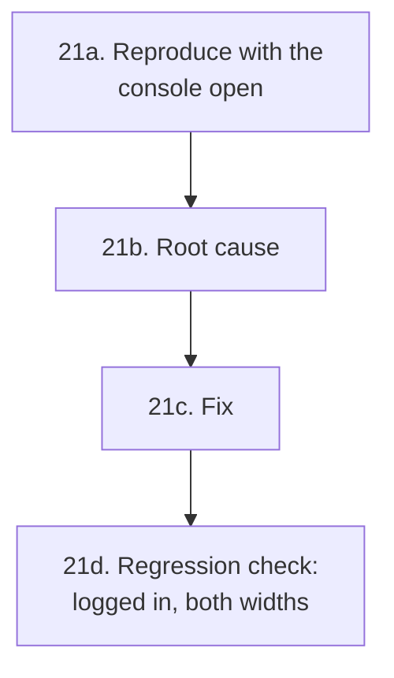
```mermaid
flowchart TD
    A[21a. Reproduce with the\nconsole open] --> B[21b. Root cause]
    B --> C[21c. Fix]
    C --> D[21d. Regression check:\nlogged in, both widths]
```

Suggested: sonnet · high — small surface, but it is a blocking regression and the first suspect
below is subtle enough that "it looks fine" is not the same as "it is fixed".

**21a. Reproduce and capture evidence — before changing any code**
- [x] **(manual) Done 2026-09-21, on the live GitHub Pages deploy of `c92bbda` (the `weight(1f)`
      fix's own commit).** Real trainer account, DevTools open. (1) The "Entrar" spinner did not
      hang — login completed and rendered "Meus Alunos" immediately. (2) No red console error
      reported. (3) First attempt was a narrower effective width (DevTools docked, eating half
      the window) and correctly showed the **compact** layout (bottom bar, single column) — not a
      bug, exactly §20a's designed behavior below 840dp. Closing DevTools and maximizing then
      showed the **expanded** layout: sidebar, students list, "Selecione um aluno" in the detail
      pane. **This resolves the suspect question below**: a clean render with no console error
      and a spinner that stopped rules out Suspect 2 (an uncaught `Flow` exception would either
      show a red error or leave the spinner spinning forever) — it was Suspect 1 alone.

**21b. Root cause — two concrete candidates, found by reading the §20 diff**
- [x] **Suspect 1 (strongest, confirmed present in the code): `Modifier.fillMaxSize()` on `Row`
      children that should be `Modifier.weight(1f)`.** `MainScreen.kt:195` (the content pane next
      to the 240dp `NavigationRail`) and `MainScreen.kt:207` (the detail pane next to the 360dp
      list). Inside a `Row`, `fillMaxSize()` claims the *full* incoming width rather than what is
      left after a fixed-width sibling — so the content pane is laid out 240dp (and the detail
      pane 360dp) wider than the space available and is pushed off the right edge. The screen is
      not frozen, it is drawn where nobody can see it. This alone plausibly produces exactly the
      reported symptom on a wide window.
      **Fixed 2026-09-13** — both children now use `weight(1f).fillMaxHeight()`. Compiles green
      (`:shared:compileKotlinJs`, `:shared:testAndroidHostTest`, `:app:verify`).
      **Whether this was *the* cause is still unconfirmed** — it is definitely a bug and is
      definitely gone, but a wrongly-positioned pane and a never-resolving spinner look different
      to a user, and 21a's evidence (which of the two it was) has not been captured yet. Do not
      close §21 on this item alone.
- [x] **Suspect 2: ruled out 2026-09-21** — §21a's live login showed a clean console and a
      spinner that stopped, which is the opposite of what an uncaught `Flow` exception in
      `combine(drafts, linked)` would produce. `getStudents()` was never touched by this fix and
      didn't need to be.
- [x] Recorded: **Suspect 1 (the `fillMaxSize()`/`weight(1f)` bug) was the actual cause**, ruled
      in by §21a's evidence, not just "fixed something and it started working".

**21c. Fix**
- [x] Suspect 1 confirmed (21a/21b) — the `weight(1f)`/`fillMaxHeight()` fix already applied is
      the actual, sufficient fix. No further change needed here.
- [x] While in `MainScreen`: `StudentsScreen` carries its own `Scaffold` (it owns the FAB), so
      the expanded layout currently nests a `Scaffold` inside the outer one, inside a `Row`.
      **Checked and deliberately left alone**: the inner `Scaffold` only places the FAB at the
      bottom-right *of the 360dp list pane*, which is where it belongs for a list pane, and it
      is not implicated in the freeze. §22c removes the FAB outright, which dissolves the nesting
      on its own — flattening it now would be churn that §22 immediately undoes.

**21d. Regression check**
- [x] `./gradlew verify`, `:shared:compileKotlinJs`, `:shared:testAndroidHostTest` green
      (2026-09-13, after the `weight(1f)` fix).
- [x] **(manual) Done 2026-09-21** — logged in, on the deployed web build, at a window **above**
      840dp: sidebar (Alunos/Agenda/Configurações), students list, and "Selecione um aluno" in
      the detail pane, all visible at once. This is also §20g's own long-open "logged-in
      dashboard... cannot be [verified] from this side" item — closing it here too.
- [x] **(manual) Done 2026-09-21** — the same session at a narrower effective width (DevTools
      docked) rendered the compact bottom-bar layout, matching the Android app's shape.
- [ ] **(manual)** The Android app itself (not the web build) still logs in and navigates
      normally on a real device — `MainScreen` is shared code, so a fix here lands on the phone
      too, but this needs an actual Android install to confirm, not just the shared-code review.

---

## 22. Feature — Visual identity: stop looking like an Android app
(2026-09-13, via `/newgoal`)

**The request:** after §20 changed the *structure* (sidebar, two panes), the user's verdict was
still "o visual ainda parece com de um app". That is a different axis from §20 and the reason
§20 alone was never going to satisfy it: §20 moved boxes around, but every box is still drawn in
stock Material 3 — baseline purple, heavily rounded corners, elevation on everything, a circular
floating action button, a card grid with lots of air. Those are Android-app signals regardless of
where the panes sit.

**Direction, confirmed with the user 2026-09-13** (they picked all three offered axes):
1. **Theme** — colours, fonts, corner radii, shadows: stop reading as Material baseline.
2. **Components and density** — cards/FAB/whitespace → denser rows, ordinary buttons, more
   information per screen, the way a web dashboard presents a list.
3. **Site chrome** — a real header with brand identity, and a footer. The app currently opens
   straight into content, the way an app does.

**Was blocked on §21; unblocked 2026-09-21** once §21a/§21d confirmed the login fix live. 22a–22e
built and verified below (compiles/tests green; the human "does it still look like an app?"
verdict is still the trainer's own call, not this session's — see 22e).

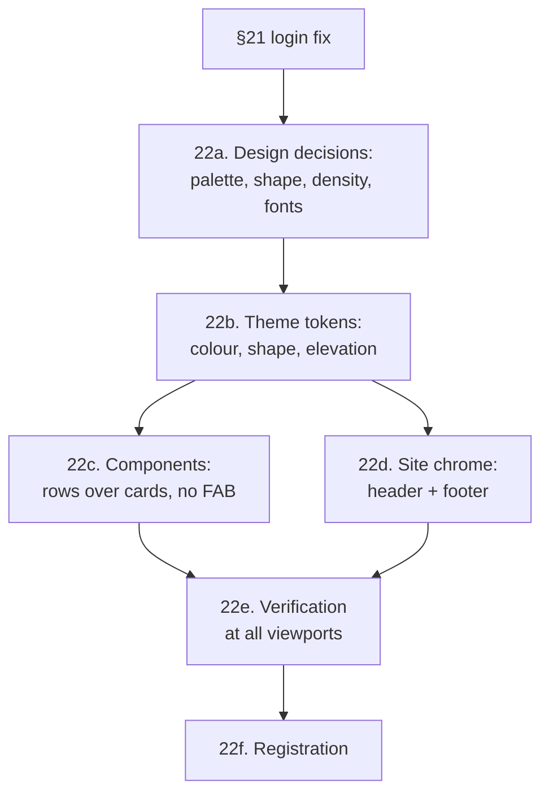
```mermaid
flowchart TD
    Z[§21 login fix] --> A[22a. Design decisions:\npalette, shape, density, fonts]
    A --> B[22b. Theme tokens:\ncolour, shape, elevation]
    B --> C[22c. Components:\nrows over cards, no FAB]
    B --> D[22d. Site chrome:\nheader + footer]
    C --> E[22e. Verification\nat all viewports]
    D --> E
    E --> F[22f. Registration]
```

Suggested: sonnet · high — broad surface (touches most screens) and the acceptance criterion is
subjective, which means more iteration passes than a typical feature.

**22a. Design decisions**
- [x] **Typography is the one axis with a hard technical blocker, and it is worth knowing before
      anyone promises a font change.** Compose for Web does *not* use the browser's or system's
      fonts — Skiko renders text itself, so a custom typeface has to be bundled as font *bytes*
      through Compose Resources (`commonMain/composeResources/font/...`). This project
      **deliberately excludes `compose.components.resources`**, documented in
      `shared/build.gradle.kts`: its resource-ID codegen embeds the project's own folder path,
      which contains a space (`Personal APP`), and DEX rejects space characters in class names —
      the *same* root cause that broke `kotlinNpmInstall` in §19f. So a custom font requires
      first resolving that: rename the project directory (fixes the root cause once and unblocks
      Compose Resources generally) or keep the built-in typeface and get the "not an app" effect
      from weight/size/letter-spacing/colour instead.
- [x] **Decided 2026-09-21 by taking this item's own stated default** (the user was not asked —
      "no custom font" was already the recorded fallback if they didn't care either way): no
      folder rename, built-in typeface, "not an app" effect comes from palette/density instead.
      Revisit if the trainer specifically asks for a custom font later.
- [x] Palette and shape scale picked and implemented as named constants in
      `shared/.../ui/theme/AppTheme.kt` (§22b) — indigo accent, neutral slate secondary (replaces
      Material's default pale-lavender secondaryContainer, the actual source of the old
      screenshots' purple tint), a distinct teal tertiary, 4–10dp corner radii.
      **One real limitation found empirically, not assumed**: Material3's `Button` composable
      does not read its shape from the theme's `Shapes` at all — it defaults to a fixed pill/
      stadium shape regardless of what `Shapes(...)` is passed to `MaterialTheme`. Confirmed by
      screenshot on this exact Compose Multiplatform 1.11.1 build: every `Shapes` value changed
      except buttons, which stayed fully rounded. `Shapes` still reduces every `Card`/`Dialog`/
      `OutlinedTextField` corner (they do read the theme scale) — buttons specifically would need
      an explicit `shape = MaterialTheme.shapes.medium` passed at each call site, which was not
      swept across the app in this pass (recorded as open work in §22c).
      **Elevation → 1dp borders is not yet swept either** — `Outline`/`OutlineVariant` tokens now
      exist in `AppTheme.kt` for this, but no existing `Card` was changed to use a border instead
      of its default elevation. Left for a follow-up pass rather than touching every `Card` call
      site in this one.

**22b. Theme tokens**
- [x] `ui/theme/AppTheme.kt` added: `lightColorScheme(...)` from 22a's palette + a reduced-radius
      `Shapes`, wrapped in one `AppTheme { }` composable. Replaces the bare `MaterialTheme { }` in
      both `main.kt` (web) and `MainActivity.kt` (Android) — one theme, both platforms, one import
      each. Elevation conventions (1dp borders) are the one piece **not** carried through — see
      22a's note.
- [x] Swept and verified 2026-09-21 (not just assumed): `grep -rn "Color(0x" ui/screen/*.kt` finds
      exactly one hit, `SuccessGreen` in `Components.kt`, already documented as filling a real
      Material3 gap (no "success" role exists). §5d's earlier sweep held.
- [x] Dark theme confirmed out of scope — `AppTheme.kt` has no dark branch, recorded in its own
      header comment.

**22c. Components and density**
- [x] `StudentsScreen` rewritten: the old 2-column `LazyVerticalGrid` of 100dp `StudentCard`s
      (renamed `StudentListItem`, `Components.kt`) is now a dense single-column list of rows —
      small avatar (still carries the gender distinction that used to tint the whole card),
      name + goal, a left accent bar for the selected row instead of a border. Used identically
      by the compact layout (a full-width phone list) and the §20d 360dp desktop pane.
- [x] `FloatingActionButton` replaced with an ordinary `Button` in a header row next to "Meus
      Alunos" (shorter label "Novo" on the narrow desktop pane, full "Cadastrar Aluno" elsewhere).
- [x] Desktop-only padding tightened (16dp → 12/8dp) inside `StudentsScreen`, gated on the same
      `singleColumn` flag §20d already uses to mean "the desktop list pane" — the compact/phone
      path is untouched, still full 16dp and the row height stays touch-friendly.
- [ ] **Not done — scope cut, recorded rather than rushed.** `StudentDetailsScreen` (274 lines: six
      navigation callbacks, four dialogs, invite-code flow, biometrics/workout/assessment lists)
      still reads as "a stack of cards", not "a heading + section structure". This screen carries
      real business logic beyond layout, and reworking its structure in the same pass as the
      theme/list changes above risked a regression nobody would catch without dedicated
      attention. Left for its own follow-up pass.

**22d. Site chrome**
- [x] Brand header: `ExpandedMainLayout`'s `TopAppBar` title is now an icon + "Personal Tracker"
      wordmark instead of the plain text `TopAppBar` title §20b added.
- [x] Footer added below the content `Row`, expanded-layout only: "Personal Tracker" / a version
      string. **The version is a static placeholder** ("v1.0"), not wired to
      `UpdateChecker.currentVersionName` (`SettingsScreen`'s real source) — that lives behind a
      `koinViewModel()` this pure-chrome composable doesn't take. Fine for "nothing heavy" today;
      wire it for real if it needs to track releases without a manual edit.
- [x] Confirmed both are expanded-layout only — `CompactMainLayout` (the phone/phone-browser path)
      is untouched, still its original plain-title `Scaffold` + bottom bar.

**22e. Verification**
- [x] Green 2026-09-21 after the 22b/22c/22d batch: `:shared:compileKotlinJs`,
      `:shared:testAndroidHostTest`, `:app:verify` (unit tests + lint) — all `BUILD SUCCESSFUL`.
      Also self-checked the pre-login screen live via `:shared:jsBrowserDevelopmentRun` in a
      local browser: the neutral background, indigo accent and reduced text-field/card radii all
      render as intended (this is also where the button-shape limitation above was found).
- [ ] **(manual)** Side-by-side screenshots, before and after, at desktop width — the acceptance
      criterion here is a human verdict ("ainda parece app?"), so the check is the trainer looking
      at it, not a passing test. **Needs the trainer to open the deployed site post-push and say
      whether this reads as "less app" or not** — expect at least one iteration round regardless.
- [ ] **(manual)** Confirm on a real Android phone that the compact layout still looks right with
      the new theme — the theme is shared, so this pass *does* change the native app's appearance
      (unlike §20, which left it alone). **If the trainer wants the phone app to keep its current
      look, that is a real fork the two platforms would need — flag it, don't assume the answer.**

**22f. Registration**
- [x] `CLAUDE.md` updated: where `AppTheme` lives and that it's the one file to touch for
      palette/shape changes, plus the button-shape and elevation-vs-border gaps so they aren't
      silently reopened by a future edit.
- [x] Typography decision (no rename, built-in font) recorded next to the existing
      `compose.components.resources` note in `shared/build.gradle.kts`.

---

## 23. Build — The web front as its own product: React/Next, backend first
(2026-09-22, via `/newgoal`)

**The request:** "o front do site e do android não precisa ser o mesmo, até pq os sites costumam
ter caras diferentes. o site que você fez está inteiramente android expandido."

That verdict is correct, and §22 was aimed at the wrong layer. The cause is not palette or corner
radius — it is the rendering model. Confirmed on the deployed build 2026-09-22 by reading the live
DOM: the entire page is

```
DIV#app > DIV > DIV > #shadow-root > DIV > CANVAS
```

`document.body.innerText` returns an **empty string**; the word "Entrar" does not exist in the
HTML. Compose Multiplatform's `js` target paints the whole UI into one `<canvas>` via Skiko.
Measured consequences, all verifiable on the live site:

- no text selection, no Ctrl+F, no copying a student's name
- Google indexes a blank page — zero SEO
- password managers and browser autofill cannot see the fields
- **no URLs**: a student cannot be opened in a new tab, a screen cannot be linked or shared
- fonts are rasterised by Skia, not the browser's text engine — the reason the text "doesn't read
  as web"
- **4.9 MB transferred / 14.5 MB decoded** on first load (`shared.js` 6,095 KB + `.wasm` 8,450 KB)

A strategic fact that pushed the decision: JetBrains' own FAQ states they have shifted focus away
from JS Canvas to Wasm "due to resource constraints" — `js` is the de-prioritised target, and this
project cannot move to `wasmJs` because GitLive's Firebase SDK publishes only a `js` variant
(already recorded in `shared/build.gradle.kts`).

**Decisions, confirmed with the user 2026-09-22:**

1. **Option C — a separate web front in a web stack** (React/Next + the Firebase JS SDK), chosen
   over forking the Compose UI into a `webMain` source set (keeps every canvas limitation above)
   and over Compose HTML (real DOM, reuses the Kotlin logic, but loses Material 3 entirely and
   means hand-building every input, dialog and date picker).
2. **Mensalidades: level 1 (manual tracking) only — but with a gate** so level 2 (real charging)
   plugs in later without a model change. See 23c.
3. **Separate route trees: `/app` (trainer) and `/aluno` (student)**, not one role-switching root.
   Rejected specifically because one surface serving two audiences is the exact mistake this
   section exists to undo.
4. **A simple public landing page is in scope.** Not a vanity item — §12's refresh shows it is a
   category-standard feature (TrueCoach's "Public profiles", `trainerize.me`).
5. **The project is called "Personal Tracker".** The user does not care which name; this one is
   already the `<title>`, the Pages deployment and the expanded top bar. Only `CompactMainLayout`
   still says "Personal APP" — see 23m.

**The price of Option C, stated plainly so it is never a surprise:** business logic gets a second
implementation in TypeScript. `commonMain` is 7,617 lines, of which ~2,843 are logic
(ViewModels, repositories, `FirestoreMappers`, `WorkoutParser`, `GenerativeAiService`). The Kotlin
copies stay — Android needs them — so the two must be kept in step **by hand**; there is no
compiler catching a drift. The Kotlin originals are the reference implementation, and any TS port
that disagrees with them is a bug in the TS port. It also discards the web half of §19–§22: §19's
js target and deploy plumbing and §21's web-only login fix go away entirely, while §20's adaptive
layout and §22's theme survive because they live in `commonMain` and Android keeps using them.

**Method, chosen by the user 2026-09-22 — backend first, no CSS.** Build the whole data layer,
rules and every screen as unstyled HTML, validate it works, and only then design. This is the
direct lesson of §22: a visual pass over something unproven is wasted twice.

> **The one constraint that makes this method safe:** "simple CSS" must not mean "loose HTML
> files". Phase 1 is already Next.js with the real component tree — just with no styling at all:
> bare `<form>`, bare `<table>`, unclassed `<h1>`. If phase 1 is static HTML instead, phase 2
> stops being a visual pass and becomes a rewrite, which defeats the whole point.

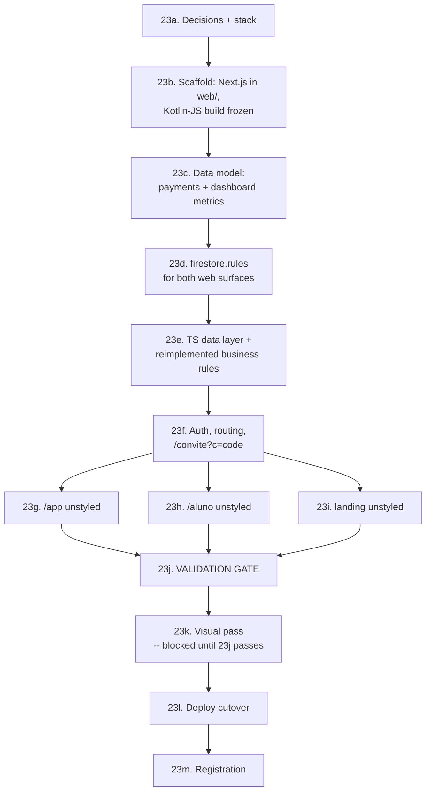
```mermaid
flowchart TD
    A[23a. Decisions + stack] --> B[23b. Scaffold: Next.js in web/,\nKotlin-JS build frozen]
    B --> C[23c. Data model:\npayments + dashboard metrics]
    C --> D[23d. firestore.rules\nfor both web surfaces]
    D --> E[23e. TS data layer +\nreimplemented business rules]
    E --> F[23f. Auth, routing,\n/convite?c=code]
    F --> G[23g. /app unstyled]
    F --> H[23h. /aluno unstyled]
    F --> I[23i. landing unstyled]
    G --> J[23j. VALIDATION GATE]
    H --> J
    I --> J
    J --> K[23k. Visual pass\n-- blocked until 23j passes]
    K --> L[23l. Deploy cutover]
    L --> M[23m. Registration]
```

Suggested: opus · high for 23c–23f — a new data model, security rules and hand-ported business
rules are where a wrong decision is expensive and quiet. sonnet · medium for 23g–23i, which are
mechanical CRUD screens once the data layer exists.

**23a. Decisions and stack**
- [x] Record the canvas evidence above as the justification, so a future session does not "fix"
      the look by tuning the theme again.
      **Done 2026-09-22 in two places:** this section's preamble (the live-DOM evidence), and
      `CLAUDE.md`'s "Visual theme (GOALS.md §22)" section — which is where a future session about
      to edit `AppTheme.kt` actually looks. It now states the web build's app-like look is the
      canvas renderer, not the palette, and that `AppTheme.kt` is no longer the lever for the site.
- [x] Confirm Next.js version and whether the App Router is used. Default to the App Router —
      `/app` and `/aluno` as separate route groups is precisely its model.
      **Confirmed 2026-09-22** by scaffolding with `create-next-app@latest` (23b): **Next.js
      16.3.6**, Turbopack as the default bundler, **React 19.2.8** (pinned by Next itself —
      `npm view react` reports 19.3.0, Next deliberately trails it; don't "upgrade" React past
      what Next pins), TypeScript, **App Router**, `src/` directory, ESLint 9 flat config.
      Two conventions that differ from pre-16 Next and bite anyone writing routes from memory:
      `PageProps<'/route'>` / `LayoutProps<'/route'>` are **global type helpers, no import
      needed**, generated by `next dev`/`next build`/`next typegen`; and a page's `params` is a
      **Promise** (`const { slug } = await props.params`). The scaffold's own `web/AGENTS.md` warns
      that this Next differs from model training data and points at
      `web/node_modules/next/dist/docs/` — **read those before writing route code.**
- [x] Decide the component library **for phase 2 only**, and write the decision down now so phase
      1 does not accidentally pick one: **shadcn/ui** is the recommendation (components are copied
      into the repo and owned outright, Tailwind, no inherited look). **MUI is explicitly ruled
      out** — it is Material Design, the exact visual language this section exists to escape;
      choosing it would reproduce the problem in a new language.
      **Status 2026-09-22 — left open on purpose.** The half that protects phase 1 is done and
      verified: the scaffold has no Tailwind and no component dependency (`web/package.json`
      depends only on `next`/`react`/`react-dom`). The pick itself is still the trainer's. They
      reacted well to `ui.shadcn.com/blocks` as a *reference site*, which is not the same as
      choosing the library — and shadcn/ui brings Tailwind with it, a real consequence for 23k.
      Confirm with them before 23k starts, not after.
      **Resolved 2026-09-30: no library.** The trainer brought their own static template (the
      ALLU prototype: `DESIGN.md` + five HTML pages and one `styles.css`) and asked for it to be
      implemented on the web front (those files live untracked in the outer checkout, not in git).
      Its CSS is plain and small, so `web/` still depends on
      `next`/`react`/`react-dom` only — no Tailwind, no shadcn/ui, no icon package (the navigation
      icons are inline SVG, as in the template). Nothing here is built on Material.
**Phase 2 decision 2026-10-02 (§24):** use Tailwind v4 + shadcn/ui, with A · Estúdio as the implementation default, light theme, and the ALLU personal brand. This starts a deliberate visual phase and does not change the phase 1 no-library decision above.

**23b. Scaffold, and what happens to the Kotlin/JS build**
- [x] Next.js project at `web/` in this repo. Same repo, not a separate one — the Firestore schema
      and `firestore.rules` are shared with Android and must not diverge across repositories.
      **Scaffolded 2026-09-22:** `create-next-app@latest web --typescript --app --src-dir --eslint
      --no-tailwind --empty --use-npm --disable-git`. `--no-tailwind` and `--empty` are what make
      phase 1 CSS-free from the first commit (the default template ships Tailwind plus a styled
      splash page); `--disable-git` because this is already inside a git worktree. The folder-name
      space (`Personal APP`) that broke `kotlinNpmInstall` in §19f did not bite here — npm derives
      the package name from `web`, not from the path. Three route stubs, each with its own layout:
      `/` (23i), `/app` (23g), `/aluno` (23h).
      **Verified:** `npm run build` (4 static routes); `npx eslint .` exit 0; zero `.css` files
      emitted under `.next/static`; and driven in the browser against `next start` — the link on
      `/` navigates to `/app`, each area renders its own layout header, `lang="pt-BR"`, no console
      errors, **0 stylesheets, 0 `<style>`, 0 elements with `class`** (the only `style` attribute
      on the page is Next's own `next-route-announcer`, framework accessibility plumbing). And the
      check this whole section exists for: `document.body.innerText` now returns the page's text,
      where the canvas build returned an empty string.
      `web/README.md` replaced — the boilerplate pointed at a wrong path (`app/page.tsx`), offered
      four package managers, and recommended a deploy target 23l hasn't chosen. The generated
      `web/AGENTS.md` and `web/CLAUDE.md` (a one-line `@AGENTS.md` import) were kept: they carry
      Next 16-specific guidance and are directory-scoped, so they add to the root `CLAUDE.md`
      rather than competing with it. `npm install` warns that `unrs-resolver`'s postinstall script
      wasn't allowed (npm 11's allow-scripts); lint passes without it, so it was left unapproved.
- [x] **Do not delete the Kotlin/JS web build yet.** It works and it is deployed; deleting it
      first leaves the trainer with nothing while the replacement is half-built. Freeze it: no new
      web-only work lands in `shared/src/jsMain`, and it keeps deploying until 23l.
      **Done 2026-09-22:** nothing deleted, `web-deploy.yml` untouched and still deploying. The
      freeze is written into `CLAUDE.md` (new "Web front (GOALS.md §23)" section) so any session
      in this repo sees it before touching `jsMain`.
- [x] Record the eventual removal list so it is a decision, not an oversight: the `js` target in
      `shared/build.gradle.kts`, `shared/src/jsMain/**`, `web-deploy.yml`/`web-ci.yml`, and
      `.claude/launch.json`'s `web` entry. Removed at 23l, not before.
      **Completed 2026-09-22 — the list above was short by five items**, found by grepping for
      every Kotlin/JS artifact outside `jsMain` rather than trusting it. The full list:
      - `shared/build.gradle.kts`: the `js { }` target block, the `jsMain.dependencies { }` block,
        and its own `NodeJsPlugin` hook (the `downloadBaseUrl` workaround near the top)
      - `shared/src/jsMain/**`
      - root `build.gradle.kts`: **both** Kotlin/JS hooks — `NodeJsPlugin`'s `downloadBaseUrl`
        (§19f) and `NodeJsRootPlugin`'s `packageLockMismatchReport` (§19g)
      - `kotlin-js-store/` — the committed npm lock for Kotlin/JS's own dependencies
      - `gradle.properties`: `kotlin.js.yarn=false`
      - `gradle/libs.versions.toml`: the `kotlinxBrowser` version and the `ktor-client-js` /
        `kotlinx-browser` library entries
      - `.github/workflows/web-ci.yml` (runs `:shared:compileKotlinJs`) and `web-deploy.yml`
        (`:shared:jsBrowserDistribution` → Pages)
      - `.claude/launch.json`'s `web` entry
      - `CLAUDE.md`: the `main.kt (web)` mention in the Visual theme section, and the freeze notes

      **Carry over before deleting — 23e needs these and they exist nowhere else in the repo:**
      - the Firebase web app config, `webFirebaseOptions` in `shared/src/jsMain/.../main.kt`
        (applicationId, apiKey, projectId, storageBucket, gcmSenderId, authDomain)
      - the reCAPTCHA Enterprise site key for App Check, in
        `shared/src/jsMain/.../util/WebAppCheck.js.kt`

      Both are public client identifiers by design, not secrets — Firebase's security lives in
      `firestore.rules` and App Check, and the secret half of the reCAPTCHA key stays in Google
      Cloud. But they only exist in those two files, so deleting `jsMain` first loses them.

      **Found while completing the list — this one matters for 23l.** The site key's own comment
      says it was registered for **domain `localhost`**, and on 2026-09-22 the live deploy's
      console showed `appCheck/recaptcha-error` on `alexmiguel011014-stack.github.io`. That's
      consistent with the Pages domain never having been added to the key. Login still works live
      (§21a), so App Check isn't rejecting these requests today — but whatever host 23l picks must
      be added to the key's allowed domains, and App Check enforcement must not be switched on for
      web until it is. Two cutover details that follow from how Pages works: deleting
      `web-deploy.yml` alone changes nothing visible, because Pages keeps serving the last deployed
      artifact; and if 23l moves to another host, the Pages site has to be unpublished or
      redirected, or the old canvas build keeps living at the old URL.

**23c. Data model — mensalidades (level 1) and the dashboard's numbers**

Built 2026-09-22 as pure TypeScript in `web/src/domain/` (`dates.ts`, `payments.ts`,
`students.ts`, `metrics.ts`): types that mirror the Firestore documents, plus every derivation the
dashboard needs. No Firestore calls (that is 23e) and no clock — every "today" is an argument.
**Verified:** `npm test` → 50 tests, 4 files; `npx eslint .` exit 0; `npm run build` type-checks
all of it. And, because the whole point of `dates.ts` is that results don't depend on the machine:
the suite was re-run with every Node process forced into UTC+14 (`Pacific/Kiritimati`) and UTC−10
(`Pacific/Honolulu`) — 7 processes confirmed in each zone, 50/50 both times. (Setting `TZ` in the
shell does *not* work on this Windows machine — Node silently ignored it and kept São Paulo; the
zone has to be set from inside Node, which is how the check was actually done.)
Test runner: **Vitest 5, alone** — not the six-package recipe in Next's bundled guide, which is
for React component tests (jsdom, Testing Library); those arrive with the first component test.
Installing it surfaced a peer conflict with the scaffold's `@types/node@^20`: resolved by aligning
the types with the actual runtime (`@types/node@^24`, `"engines": {"node": ">=24"}`), not by
forcing — Node 20 reached end of life in April 2026, and this project runs on Node 24.

- [x] New trainer-scoped Firestore collection `payments`, one document **per month per student** —
      not a "subscription" object. Recurring billing expressed as generated rows keeps history
      honest and turns "who is late" into a plain query instead of a computed projection.
      **Modeled:** the id is deterministic, `{studentId}_{YYYY-MM}`, so generating a month's
      charges twice (two tabs, a reload mid-write) lands on the same documents instead of
      duplicating them — writers must still create-if-absent, never a blind `set`, or regenerating
      would wipe a recorded `paidAt`. **Plus a second collection this item didn't foresee:**
      `billingPlans/{studentId}` (`amountCents`, `dueDay` 1–31 clamped to the month's last day,
      `active`), the source a monthly charge is generated from. It cannot be fields on
      `users/{uid}`: **Firestore rules are per document, not per field**, a linked student reads
      their own users doc, and the trainer decided the student doesn't see their billing (23d).
      The collections themselves come into existence with 23e's first write and 23d's rules.
- [x] Document shape: `id, trainerId, studentId, amountCents, currency, dueDate, paidAt?, method?,
      source, externalId?, note?, createdAt`.
      **Corrected while modeling — no field is optional.** `paidAt`, `method`, `externalId` and
      `note` are always written, `null` when empty: `where("paidAt", "==", null)` only matches
      documents where the field *exists* and is null, so a charge saved without it would vanish
      from every "unpaid" query. And `dueDate` is a calendar date string `"YYYY-MM-DD"`, not an
      instant — a due date is a day, and storing it as a timestamp is how "due on the 10th"
      becomes the 9th after a UTC conversion. Instants (`paidAt`, `createdAt`) stay epoch ms, the
      Kotlin side's convention.
- [x] **`amountCents` is an integer.** Money is never a float anywhere in this codebase.
      **Enforced:** `isValidAmountCents` (safe integer > 0) gates charge creation, and
      `parseAmountCents` turns what the trainer types into cents *without* a float ever existing —
      `"150,10"` parsed as 150.1 × 100 is 15009.999…, which is exactly the bug it prevents. pt-BR
      only (`,` decimal, `.` thousands); an ambiguous `"150.50"` is rejected, not guessed.
- [x] **Status is derived, never stored**: `paidAt != null` → paid; else `dueDate` in the past →
      overdue; else pending. A stored status drifts away from `paidAt` the first time a write
      half-fails.
      **Implemented** as `paymentStatus(payment, today)`. Due *today* is pending, not overdue.
- [x] **This is the gate the user asked for.** `source` (`"manual" | "gateway"`) and `externalId`
      exist from day one even though only `"manual"` is ever written. When level 2 arrives, a
      gateway webhook writes the *identical* document shape with `source: "gateway"` — a new
      writer, not a new model, and every existing query keeps working untouched. Level 2 itself
      (gateway choice, Cloud Function, webhook, fiscal responsibility) stays out of scope and
      becomes its own section.
      **In the type, with its meaning pinned:** `source` says which system owns the charge's
      lifecycle. A manual charge paid by Pix outside the app is still `source: "manual"`,
      `method: "pix"`; a gateway only ever touches documents it owns.
- [x] Decide whether the Android app shows `payments` at all. Recommendation: **not initially** —
      it is a desk activity, and leaving it web-only avoids a Kotlin model + sync listener for a
      screen nobody opens on a phone. Flag it rather than assuming; it is a real product choice.
      **Decided by the trainer 2026-09-22: no.** Payments are web-only — no Kotlin model, no
      SQLDelight table, no sync listener.
- [x] Specify the dashboard's metrics against collections that already exist, so the home screen
      needs no new data beyond `payments`: student count and connected-vs-pending split (`users`);
      sessions logged this week (`workout_logs`); adherence, logged vs scheduled (`workout_logs` ×
      `schedules`); **students gone quiet**, last log older than N days (`workout_logs`); pending
      assessment requests (`users.pendingAssessmentRequest`); month revenue and overdue list
      (`payments`).
      **Specified as tested functions in `metrics.ts` — and the spec above was wrong in three
      places, each found by reading the Kotlin side rather than trusting the plan:**
      1. **Students are two collections, not `users`.** Drafts the trainer registered live in
         `students/{id}` (role `"student"`); accounts that claimed an invite live in `users/{uid}`
         (role `"STUDENT"`, uppercase). And claiming an invite never deletes or marks the draft, so
         afterwards the same person is in both — **the Kotlin app lists them twice today**
         (`FirestoreTrainerRepository.getStudents` concatenates with no dedup;
         `SqlDelightTrainerRepository` mirrors both into one table under different ids). The only
         link is two hops away: `users/{uid}.inviteCode` → `invites/{code}.draftId` →
         `students/{draftId}`, and `draftId` is written but never read anywhere. `mergeStudents`
         takes that map (23e builds it from the trainer's invites) and drops claimed drafts; it
         never matches by name. The Kotlin-side fix is out of §23's scope and was flagged as a
         separate task — it touches `firestore.rules` (the claiming student can't write the trainer's
         `students/{draftId}`), so it needs a rules publish too.
      2. **A session is not a document.** The Kotlin app writes one `workoutLogs` document per
         *exercise* (`StudentViewModel.logSession`), each with its own `currentTimeMillis()` taken
         inside the loop — six exercises, six documents, six timestamps. Counting documents
         inflates "sessions" six- to tenfold; grouping by timestamp splits one session into many.
         A session is a **(student, local day) with at least one log** (`trainedDays`). Also: the
         Firestore collection is `workoutLogs`; `workout_logs` is the SQLDelight table name.
      3. **Adherence is measured against `users.trainingDays`, not `schedules`.** `schedules`
         documents are weekly recurring appointment slots (`dayOfWeek`, `hour`) that exist only for
         students trained in person; `trainingDays` is on every student and is literally "the days
         this student should train". Both use the Kotlin UI's strings — `"Segunda"`, `"Terça"`, …,
         `"Sábado"`, `"Domingo"`, accented — so matching is exact (with NFC normalisation, tested).
         Every trained day counts, planned or not (swapping Monday for Tuesday is still full
         adherence), capped at 100%, and the window starts no earlier than the day the student
         joined. Drafts have no adherence — they can't log anything yet.

      Definitions 23g's dashboard should use — proposed, the trainer can change any of them, and
      all computed in the trainer's zone (`America/Sao_Paulo`, passed explicitly):
      - **Sessions** = the last 7 days, rolling — not a Monday-to-Sunday week, which reads 0 every
        Monday morning, exactly when a trainer looks.
      - **Adherence** = the last 28 days: exactly four of every weekday, where a 7-day window lets a
        single missed day swing a 3-day plan by 33 points.
      - **Gone quiet** = linked, joined at least N days ago, no trained day in the last N days
        (N = 7); never-trained first, then the longest silence.
      - **Money** = three numbers, not one: *expected* (charges due this month, paid or not),
        *received* (charges paid this month in the trainer's local calendar, whatever month they
        were due — a Pix at 23:00 on the 31st is that month's money even though UTC says the 1st),
        and *overdue* (unpaid past due, any month, oldest first).

**23d. Security rules**

Done 2026-09-24, and it started with a near miss worth reading before anyone touches
`firestore.rules` again. **The two KMP lines each implemented §17 on their own, and their rules
files diverged.** What the trainer published on 2026-09-21 is the Android line's version
(`claude/tarefas-abertas-front-9834f6`, commit `af2b9b0`), which makes `canSelfAssess` /
`canLogBiometrics` immutable for the student and ties clearing `pendingAssessmentRequest` to the
assessment batch. This branch still had its own older §17 rules, where a student could grant
themselves both permissions with a plain update. Had 23d been written on top of this branch's file
and published, that hole would have gone back into production. So the first commit only synced
this file to the published version, byte for byte (`b9c19ac`), and 23d's changes sit on top of it,
where their diff against production is readable. **This branch's `firestore.rules` is now the one
to publish; the Android branch's copy is behind it and must not be published again** — that would
drop the rules for `payments`/`billingPlans` (so the web's charges would be denied) and reopen the
holes below. (Published 2026-09-28 — see the last item.)

**Verified against the real Firestore emulator:** `npm run test:rules` → 48 rules tests, all green
(`web/rules/firestore.rules.test.ts`; emulator via `firebase.json` at the repo root, a `demo-`
project id so it never reaches the real project, Java 21 — this machine's PATH has Java 8; the JDK
21 Gradle already provisioned under `~/.gradle/jdks/` is used for the command, nothing installed
system-wide). **And the proof the tests mean something:** `assertFails` passes on *any* failure, so
the same suite was run against the published rules (`RULES_FILE=…`) — 14 rules tests fail there,
exactly the ones encoding a new guarantee, and the other 34 pass on both, including the Android
app's real flows (its claim transaction and its assessment batch), reproduced as the app writes
them. (The 48th test and one rules change came from 23e — see there. Counting 23e's 3 data-layer
tests, which run in the same suite: 16 fail against the published rules, 35 pass on both.)
`firebase-tools` pulls in 5 moderate advisories (OpenTelemetry, `uuid`, via Google Cloud client
libraries); all are dev-only — `npm audit --omit=dev` reports 0 for what ships to the browser.

- [x] Extend `firestore.rules` for `payments`: a trainer reads/writes only their own
      `trainerId`-scoped documents. **A student must not read them** — decide explicitly whether a
      student may see their own payment status; defaulting to "no" until asked is the safe read.
      **Decided by the trainer 2026-09-22: no** — a student does not see their own payment status.
      The same trainer-only rule applies to `billingPlans`, the second collection 23c added; and
      this decision is precisely why neither can store anything on `users/{uid}`, which the student
      reads.
      **Done, and stricter than planned — the rules now enforce 23c's model server-side**, so it no
      longer depends on every client behaving: the exact field set (every field present, `paidAt`
      explicitly null — a missing field would drop the charge from unpaid queries; no stored
      `status`; no `id` field, the document id carries it as in `FirestoreMappers.kt`, which 23e's
      converter must match), `amountCents` an integer > 0, `BRL` only, a real `YYYY-MM-DD` due date,
      the method from a fixed list, and the document id equal to `{studentId}_{month of dueDate}`.
      Clients may only create `source: "manual"` charges (a level-2 gateway would write through the
      Admin SDK, which bypasses rules); a gateway-owned charge can't be edited or deleted from a
      client. Updates may change the amount, the due day *within* the month (the id encodes the
      month), and settlement — including undoing a mistaken "paid". `billingPlans/{studentId}`:
      trainer-only, doc id = studentId, `dueDay` 1–31.
- [x] Rules for the student web surface: a student reads their own `users` document, their own
      `workouts`, `workoutLogs`, `biometrics` and `assessments`, and writes only what §17 already
      permits. This should largely reuse §17's existing rules rather than inventing a parallel set.
      (Collection name corrected 2026-09-22: this item originally said `workout_logs`, which is the
      SQLDelight table — a rule written for it would match nothing.)
      **The existing rules already cover the reads** (tested: own profile, own *assigned* fichas
      only, the query `/aluno` will run). The web does change the threat model, though: in the
      Android app, abusing a permissive rule means modifying the app; in a browser, the Firebase SDK
      is already loaded on the page and the console is one keystroke away. Three gaps in the
      published rules were closed for that reason, each with a test that fails against the
      published version:
      1. A student could edit their own `inviteCode` and `createdAt` — harmless until 23c, which made
         them the inputs for dropping a claimed draft and for the adherence and "gone quiet"
         windows. Now immutable for the student.
      2. §17's rule says the request flag may be cleared "only in the same batch that creates the
         assessment", but it only checked `existsAfter` — pointing `lastAssessmentId` at an *older*
         assessment dismissed the trainer's request without submitting anything. Now it must not
         have existed before the batch (`!exists` + `existsAfter`); the Android app's real batch
         still passes.
      3. `workoutLogs` updates checked only the *new* `studentId`, so one student could overwrite
         another's log and re-attribute it to themselves. Now the existing document must be theirs.
- [x] Rules for claiming an invite by URL (23f) — the same constraint as the in-app flow: a user
      can never write their own `role` or `trainerId` (see `CLAUDE.md`'s Role routing note).
      **Same transaction as the app, so same rules — and two gaps closed in them.** The invite was
      not single-use: the create rule checked the invite was unused but not that the same write
      marked it used, so a claim could leave it open for the next person. Now the batch must leave
      it used (`getAfter`), and marking an invite used is only accepted when the caller's own users
      doc names it after the batch — nobody can burn someone else's invite. And a claim (create or
      the §13d re-claim) could arrive with `canSelfAssess` / `canLogBiometrics` already switched on;
      the self-update branch froze those flags, but not the claim. Now it can't. A
      `/convite?c=<code>` link gets seen by more eyes than a typed code (chat previews, browser
      history), which is what made these worth closing now.
- [x] **Human-in-the-loop:** publishing rules happens in the Firebase console and cannot be done
      from here. Same standing pattern as §7/§17 — hand the user the file and wait.
      **Published by the trainer on 2026-09-28** — this branch's file as of 23e (`004a029`), which
      nothing after it changed, sent again that day. The live rules are now this branch's copy.
      Not read back from here (that needs the trainer's login): the first trainer-side check in 23j
      is the confirmation, since the dashboard only loads under these rules — under the old ones it
      shows its "regras do §23d já foram publicadas?" message instead. **Confirmed live the same
      day:** the trainer signed in on the deployed site and the dashboard loaded their real numbers
      (1 student, connected; 0 sessions in 7 days).
      **File ready 2026-09-24** — publish **this branch's** `firestore.rules`, not the Android
      branch's copy (see the note at the top of 23d). Safe to publish before the web uses any of
      it: every flow the Android app runs today passes against it (the 34 shared tests). **Sent to
      the trainer twice the same day:** the first copy (commit `b25adab`) lacked the
      missing-charge read that 23e found; the second (with 23e's commit) supersedes it, and
      publishing the first one first does no harm. **This is now a prerequisite for 23j, not
      optional polish:** `loadTrainerSnapshot` queries `payments` and `billingPlans`, which the
      published rules deny outright (no rules = default deny), so the trainer dashboard cannot load
      against production until this is published — the emulator run against the published rules
      shows exactly that. Copy-paste in the console as before, or — now that `firebase.json`
      exists — `firebase deploy --only firestore:rules --project personalapp-88129` after
      `firebase login` (the trainer's own credentials; not something this session can do).

**23e. TypeScript data layer and the ported business rules**

Done 2026-09-24. **"The Kotlin side is the reference" first needed an answer to *which* Kotlin**,
because §23d had just found the two KMP lines diverged. Compared before porting anything: the
document shapes both lines write are the same (same field names, same defaults) — the Android
line's `FirestoreMappers.kt` differs in *how* it reads (a lenient `fieldOrNull`: a wrongly-typed
field reads as its default instead of throwing), which the web adopts. `WorkoutParser.kt` and its
test differ only cosmetically; `PromptFichaViewModel` differs only in how it loads the template;
and the two prompt assets are byte-identical across lines (the Android line moved them to
`composeResources/files/`). So every port below matches what the phone runs.

**Verified:** `npm test` → 93 unit tests; `npm run test:rules` → 51 emulator tests (48 rules + 3
data layer); eslint clean, no warnings; clean `next build` type-checks all of it.

- [x] Firebase JS SDK wiring: Auth, Firestore, App Check. The web App Check config already exists
      and works (§19e/§19g) — reuse those values rather than re-registering the app.
      **`web/src/data/firebase.ts`** — one browser-only `getFirebase()`; everything else takes a
      `Firestore` as a parameter, so the same code runs against production, the emulators and the
      tests. The Firebase web config and the App Check site key are carried over from `jsMain`
      into `web/src/data/firebaseConfig.ts` — the two values §23b said must survive §23l — with the
      note that they're public identifiers, not secrets. `NEXT_PUBLIC_FIREBASE_EMULATORS=true`
      points the app at the local emulators under the demo project (App Check skipped there; the
      emulators don't enforce it). Its runtime behaviour gets exercised by 23f's login, in the
      browser; here it is covered by the type-check only.
- [x] Collection accessors mirroring `FirestoreMappers.kt`'s document shapes exactly. Any
      disagreement with the Kotlin mapper is a bug in the TS side.
      **`web/src/data/converters.ts`** — drafts, linked students, workout logs, payments and billing
      plans: the Kotlin defaults, the Android line's leniency, and payment writes that produce
      exactly the field set the rules accept (all eleven fields, nulls explicit, no `id`).
      **`web/src/data/trainerData.ts`** — `loadTrainerSnapshot` runs the same queries the Kotlin
      app does (so no new composite index), fetches each invite by code to build the dedup map
      (the rules forbid listing invites), and hands it all to 23c's pure functions;
      `ensureMonthlyCharges` does create-if-absent in a transaction. Readers and writers for
      workouts, schedules, biometrics and assessments land with the screens that use them
      (23g/23h), on the same conventions — built and tested where they're used, not ahead.
      **The emulator test caught a real rules bug, predicted before it ran:** create-if-absent
      has to *read* the charge first, and for a charge that doesn't exist yet `resource` is null,
      so `isOwningTrainer(resource.data.trainerId)` denied the read — monthly charges could never
      have been generated. The payments read rule now takes ownership of a missing charge from the
      plan it would be generated from (`billingPlans/{studentId}` — no plan, no answer, so no
      probing). Against the previous §23d candidate, exactly the two tests covering this fail.
- [x] Port `WorkoutParser` (§15, Smart Paste). **Keep its deliberate sets-vs-reps rule** — the
      smaller of the two numbers is sets, so both `"Supino 3x12"` and `"Biceps 12x4"` mean the
      same thing. `WorkoutParserTest` is the specification; port the test cases alongside it, or
      this quietly regresses.
      **Ported to `web/src/domain/workoutParser.ts` with all 15 `WorkoutParserTest.kt` cases.**
      Copying the regexes literally would have changed behaviour *without any error*: Java's
      `[^]]` means "anything but `]`", while in JavaScript `[^]` means "any character" — a mutation
      run with the literal regex compiled fine and failed 5 tests, 3 of them original Kotlin
      cases. Java's `\s` is ASCII-only, so the phone skips a line joined by the no-break space
      WhatsApp copies (U+00A0); the web does the same rather than parse text the phone rejects —
      normalising it would have to happen on both platforms at once. Kotlin's 32-bit
      `toIntOrNull` and its whitespace set (it keeps a byte-order mark JavaScript's `trim` strips)
      are mirrored in `web/src/domain/kotlin.ts`. **One deliberate difference:** a `NaN` or
      `Infinity` muscle coefficient is rejected — Kotlin accepts it and then can't serialize the
      ficha (kotlinx refuses NaN by default). `exercisesJson` / `performedSetsJson` are written the
      way kotlinx writes them (nulls omitted) and read the way it reads them (one malformed element
      fails the whole list).
- [x] Port `GenerativeAiService`'s OpenAI/DeepSeek/Claude paths. Gemini goes through Firebase AI
      Logic and is Android-only (`IosGeminiProvider` is already an honest stub) — decide whether
      web gets Gemini at all, or the same honest stub.
      **Superseded by the trainer's decision, 2026-09-24:** the web gets the §15 prompt flow, not
      direct AI calls — the trainer copies the prompt into whichever AI app they already use and
      pastes the reply into Smart Paste. `web/src/domain/fichaPrompt.ts` ports
      `PromptFichaViewModel.buildPrompt` exactly, including a Kotlin quirk worth knowing:
      `trimIndent()` runs *after* interpolation, so a multi-line medical note keeps the whole
      profile block indented on the phone — reproduced so both build the same prompt. The template
      is spliced with split/join, not `replace`, because `$&` in the table would be read as a
      replacement pattern. The templates stay single-sourced in `app/src/main/assets/` (the tests
      read them there); how the page loads them is 23g's call. Direct generation stays on Android.
- [x] **New security problem Option C introduces, with no equivalent on Android.** The trainer's
      AI provider key lives in `SettingsDataStore` on-device on Android. In a browser it would sit
      in `localStorage`, readable by any XSS and by any browser extension. Options: proxy the
      calls through a Cloud Function so the key never reaches the client; or keep BYO-key on web
      and state the exposure in the UI. **Do not silently copy the Android approach into the
      browser** — the threat model is not the same.
      **Resolved by the same decision:** no provider key ever reaches the browser, because the web
      makes no AI calls at all. A Cloud Function proxy stays possible later as its own item (it
      needs the Blaze plan).

**23f. Auth, routing and the invite link**

Done 2026-09-24. **One structural decision made here, because it fixes the invite link's shape:
the site is a static export** (`output: "export"` in `web/next.config.ts`). Phase 1 needs no
server — auth and data are the Firebase client SDK in the browser, and security is
`firestore.rules` — and a static build deploys to any host 23l picks, including where the site
lives today (GitHub Pages). It also makes Next fail fast, in `next dev` too, on anything that would
need a server (Server Actions, route handlers reading the request, cookies, redirects, dynamic
routes without `generateStaticParams`; see `node_modules/next/dist/docs/01-app/02-guides/
static-exports.md`). Its cost: a path segment whose value isn't known at build time needs a server,
so **the invite link is `/convite?c=CODE`, not `/convite/CODE`**. Invites are single-use and
short-lived, so no link of value exists in the old shape. Reversible by deleting one line, if 23l
ever picks a server-rendered host.

**Verified end to end in the browser**, against the Auth + Firestore emulators with the §23d/§23e
rules loaded (`npm run seed:emulators` sets up a trainer, a draft and its invite; the app runs with
`NEXT_PUBLIC_FIREBASE_EMULATORS=true`) — every network call went to `127.0.0.1`, none to the real
project: the invite link with the code in lowercase (normalised to `AB12CD34`, as the Android field
does) → create an account → the claim → landed on `/aluno`; the emulator then showed the invite
`used: true` and a `STUDENT` account with the trainer's id and the invite's pre-filled name. The
student sent to `/app` bounced to `/aluno`; "Sair" went to `/entrar`; a wrong password showed "E-mail
ou senha incorretos."; the trainer's login — with the e-mail padded with spaces and a trailing tab,
the bug found on the Android emulator on 2026-09-17 — landed on `/app`; the trainer sent to `/aluno`
bounced to `/app`; reopening the used invite with a new account showed "Código de convite já
utilizado" and left that account signed in, unclaimed, able to try another code — as on Android.
Console: dev-server noise plus the one expected 400 (the wrong-password request). Plus `npm test` →
98 unit tests (role mapping, routing, messages) and `npm run test:rules` → 56 emulator tests (the
claim through the real rules, its refusal messages, the profile read of an account with no document
yet); eslint clean; static build of all six routes.

- [x] Login and session, reusing the `stayLoggedIn` semantics documented in `CLAUDE.md` — if the
      preference is false, actually call `signOut()`; do not leave Firebase's session alive while
      the UI pretends otherwise.
      **Same invariant, kept by construction instead of by a sign-out at startup:** "Manter
      conectado" maps onto Firebase's own persistence — checked is `browserLocalPersistence`,
      unchecked is `browserSessionPersistence`, a session that ends with the tab. So there is
      never a Firebase session alive that the UI pretends isn't there, and nothing to sign out of
      on the next visit. Default unchecked, as on Android. Also: the e-mail is trimmed (the
      2026-09-17 bug), "Esqueci minha senha" sends Firebase's reset e-mail with a message that
      doesn't reveal whether the account exists, and the fields are real form fields (`type=email`,
      `autocomplete`) — so the browser's password manager works, one of the things the canvas
      build couldn't do.
- [x] Role gate: `ADM`/`TRAINER` → `/app`, `STUDENT` → `/aluno`, unclaimed student → the invite
      flow. Route-level, not a component-level `when`.
      **Each area's layout guards itself** (`RequireArea`), fed by `destinationFor` — a port of
      `RoleRouter`'s `when` over `AuthRepository.resolveRole` (role uppercased; a missing document
      or unknown value reads as `STUDENT`; a `NONE` account gets the Android LoginScreen's "no role
      assigned yet" message). One difference by design: an ADM lands on `/app`, since the Android
      admin dashboard has no web counterpart in §23. The gate is navigation, not security — the
      data is protected by `firestore.rules`.
- [x] **`/convite/<código>`** — the student opens a link, creates an account and lands connected.
      This is the single clearest thing Option C buys that the canvas build could not do at all,
      and it is the student-onboarding path, so it is not optional polish.
      **Built as `/convite?c=CODE`** (static export, above). `claimInvite` ports
      `AuthRepository.claimInvite` — the same transaction, document and messages, including the
      translation of a permission error into "Esta conta já está vinculada a um perfil existente —
      fale com o administrador." A signed-in trainer, an already-connected student and an
      unclaimed account each get their own screen; a link without a code offers a field to type it.
      The generator of these links is the trainer's screen (23g) — until then an invite comes from
      the Android app's "Compartilhar", and the web link needs only its code.

**23g. `/app` — the trainer surface, unstyled**

In progress — built and committed in parts. Entity pages use query parameters
(`/app/alunos/detalhe?id=…`), not path segments, because of 23f's static export.

**Part 1 done 2026-09-24 — dashboard and student list, verified in the browser** against the
emulators, with a seed (`web/scripts/seed-emulators.mjs`) where every student exists to make one
number checkable by eye, and the expected values written down *before* opening the page. All
matched on the second attempt: 6 students (4 connected, 2 waiting — the draft Ana's invite
superseded not counted twice), **4 sessions in 7 days out of 12 per-exercise log documents** in that
window, 35% adherence (Carla excluded: no planned day since she joined), Bruno gone quiet since the
12th and Carla — joined two days ago — not flagged, Diego's pending assessment, R$ 270,00 expected /
R$ 150,00 received / R$ 120,00 overdue. **The first attempt showed R$ 150,00 expected — a real race,
found here and not by the unit tests:** React's dev double-mount ran two loads at once; both read
before either wrote, one created Bruno's September charge, the other found it existing, created
nothing and — since the reload depended on having created something — showed a snapshot without
it. The database was right (one charge, no duplicate); the screen was stale. In production the
same happens with two tabs. `loadTrainerView` now reloads whenever a charge was missing, whoever
created it; an emulator test runs two loads in parallel and fails 3/3 against the old logic, passes
3/3 against the new. (One dev-only leftover: the "N cobranças geradas agora" notice usually doesn't
show under the double-mount, because the run that survives is the one that found the charge already
there; the numbers are right regardless.) Every console error in the session accounted for: the
deliberate wrong-password 400, a lookup 400 for an account the emulator reset had deleted, HMR
reconnects across a dev-server restart, and two 409s — the race's transaction contention, retried
by the SDK. 103 unit + 58 emulator tests, eslint and tsc clean.

- [x] Dashboard home with 23c's metrics as a plain list of numbers.
      **`/app`**, with §23c's windows. Opening it is what keeps mensalidades current:
      `loadTrainerView` creates this month's charge for any active plan missing one (and skips the
      transactions entirely when nothing is missing). "Today" is taken once per load in the
      browser's own zone — the trainer's calendar — so every figure on screen agrees. A
      permission error names the likeliest cause at this stage: §23d's rules not yet published.
- [x] Student list with search and filter, and the student detail view (data + performance charts).
      **List done (part 1):** `/app/alunos` — name, goal, connection and a medical-restriction flag
      (what the Android list shows), accent- and case-insensitive search ("ALVES" finds Bruno
      Alves), filter by connection, sorted by pt-BR collation.
      **Registration, invite and the detail's data done (part 2, 2026-09-24):** `/app/alunos/novo`
      and `/app/alunos/detalhe?id=` port the Android add/edit forms and `SqlDelightTrainerRepository`'s
      writes field for field — including a value that would have gone wrong unnoticed: the Android
      form stores intermediate level as the abbreviation **`"Interm."`**, so the web stores exactly
      that. A draft's page generates the invite link (the Android code format, 8 uppercase hex; a
      taken code comes back as permission-denied from the rules and gets a fresh one); a connected
      student's page carries §17's permissions and the assessment request. **The whole onboarding
      loop now runs on the web alone, verified in the browser against the emulators:** register
      Júlia (the form refused her until a training day was picked, as Android does) → generate her
      link → sign out → open it, create her account → back as the trainer, she's listed once, as
      connected (her draft superseded) → grant self-assessment → request one → the dashboard lists
      her under pending assessments. The emulator then showed her account in exactly the shape the
      phone reads (`"Interm."`, `["Terça", "Quinta"]`, the invite code, the §17 flags). The same loop
      is an emulator test (create → invite → claim → one connected student), plus rules-level tests
      for the draft rewrite, the account merge, the permissions and the request.
      **Left out on purpose:** the Android form's optional first measurement (weight/height into
      `biometrics`) — those are Doubles on the Kotlin side, a whole number from JavaScript lands in
      Firestore as an integer, and whether the phone's lenient reader then shows it or shows 0 is
      unverified; measurements come with the evolution part once that's settled. And deleting a
      student — on Android it deletes a connected student's own profile document; destructive, and
      nothing in §23 asks for it.
      **Performance done (part 4, 2026-09-28) — the phone's charts as tables, phase 1:** a connected
      student's page adds "Autoavaliações" (every PAR-Q+ sent, newest first, the "sim" answers
      spelled out with their questions), "Medidas" (all measurements, newest first, plus "Nova
      medida"), "Progressão de carga" (pick an exercise, see each session's heaviest set) and
      "Atividade recente" (the last ten logs with their sets). A draft's page shows only its
      measurements — it has no account, so no sessions or self-assessments of its own.
      **The int/Double question is settled:** GitLive 2.7.0's decoder reads any `Number` as a Double
      (`decoders.kt`, `is Number -> value.toDouble()`), so a whole number written from JavaScript —
      stored as a Firestore integer — shows on the phone as the same value. Measurements are now
      written from the web, in `BiometricEntity`'s exact field set. Two things it does differently,
      on purpose: `height` is 0 (the Android trainer path fills it by parsing the student's
      *medical notes* as a number — a bug, harmless since height is never shown, and the student's
      own path already writes 0); and a comma decimal ("72,5") is accepted, as the Android
      add-student form does and its measurement dialog doesn't. **New measurements only for a
      connected student**, for the reason fichas are (below) — which is also why the web's
      registration form has no first measurement: it would land on the draft.
      **Kept identical to the phone, for the trainer to judge in 23j:** a set's load counts in the
      progression only if the phone's `toFloatOrNull` reads it — "22.5" yes, **"22,5" no** — so the
      table and the phone's chart agree. A student typing Brazilian decimals has those sets silently
      left out on both; whether to accept commas is a decision for both platforms at once.
      **Verified in the browser against the emulators** (the seed now has Ana's measurements, loads
      rising 1 kg a day with a comma-typed second set, and Bruno's PAR-Q+ with one "sim"), expected
      values written down first — all matched: Ana's progression 20 → 22 → 24 → 27 → 29 → 31 kg (the
      comma sets ignored), switching exercise; her last ten logs newest first ("31x12 · 33,5x10");
      her measurements; "abc" refused, "72,5" saved — the emulator held `weight` 72.5 and `height`/
      `bodyFat` as integer 0, `BiometricEntity`'s fields exactly; Bruno's assessment flagged with
      the bone/joint question; Maria's draft page with no assessments or progress, and measurements
      blocked with the reason. Emulator tests: the phone's own student query sees a web-recorded
      measurement; another trainer can't list a student's assessments. 144 unit + 65 emulator
      tests, eslint and tsc clean, static build.
- [x] Ficha: list, manual creation, Smart Paste, AI generation.
      **Done (part 3, 2026-09-24).** A student's page lists their fichas with
      `WorkoutBuilderScreen`'s controls (edit, activate/deactivate, delete after a confirmation).
      `/app/fichas/editar?aluno=…[&id=…]` is `PromptFichaScreen` and `ManualWorkoutScreen` on one
      page: copy the §15 prompt (23e's port, fed by the Android asset files — `predev`/`prebuild`
      copy them into `public/prompt/`, generated and gitignored, so there is still one copy), paste
      the AI's reply into Smart Paste, add or remove exercises by hand, read the effective volume per
      muscle, save. Saves port `withDerivedStatus`: active means `status: "assigned"`, the only
      fichas the rules let a student read — skip it and every web-made ficha is invisible on the
      phone (an emulator test runs the phone's own student query and fails when it's skipped).
      Smart Paste matches both Android screens, including a detail easy to miss: a recognised name
      fills the name only while it's blank.
      **Stricter than Android, on purpose: new fichas only for a connected student.** A ficha is
      keyed to the student's id, and claiming an invite gives the student a new one (their
      account's uid), so a ficha made for a draft stays on the draft and the student never sees it.
      Android allows it; the web says on screen why not. Same root as the duplicate-student task.
      **Verified in the browser against the emulators:** a draft's page and a direct editor URL both
      refuse a new ficha, with the reason; saving an empty ficha shows both errors; the prompt came
      out with the profile and the request in the Kotlin shape; an AI reply wrapped in prose filled
      "Ficha A" and three exercises (the reps-first "Biceps 12x4" as 4×12), with Peitoral 4,0 /
      Costas 3,0 / Delt.ant 2,0 / Bíceps 1,5 effective sets; a non-numeric set count was refused;
      add, remove, save → listed as active since today, and the emulator held exactly
      `WorkoutEntity.toFirestoreMap`'s fields (integer times, a kotlinx-readable `exercisesJson`);
      deactivate → `draft` with `assignedAt` null; activate again; edit — a second paste replaced
      the exercises but not the typed name, the name saved trimmed, same document, `createdAt` kept;
      delete, cancelled once, then confirmed. **Not verifiable here:** the in-app browser denies
      clipboard writes outright, so "Copiar prompt" showed its fallback (the prompt in a box, to
      copy by hand); the copy itself is for 23j, in a real browser. 122 unit + 63 emulator tests,
      eslint and tsc clean, static build of ten routes.
      **Found, for the next rules change:** `workouts` create checks the trainer but not that the
      student is theirs, and the phone's student query doesn't filter by trainer — a trainer who
      knew another trainer's student's uid could put a ficha in that student's app. `biometrics`
      and `schedules` have the same shape. uids aren't discoverable, so the risk is low; batch it
      with the archive change below.
- [x] Schedule. Mensalidades: register, mark paid, overdue list.
      (The overdue list is on the dashboard already; registering plans and marking paid is not.)
      **Mensalidades done (part 6, 2026-09-28).** A student's page gets "Mensalidade": register the
      plan (amount in reais, due day 1–31), edit it (future charges only — a charge already
      generated is adjusted on its own), pause and reactivate it, and every charge so far.
      `/app/mensalidades` ("Mensalidades" in the nav, and linked from the dashboard) shows a month's
      charges (this one by default; a picker lists every month with charges), what's still overdue
      from earlier months, and who has no plan yet. On each unpaid charge: "Marcar como pago" (how,
      and on which day — so a Pix recorded on the 2nd still counts in the month it arrived) and
      "Ajustar" (amount, and due date within the month — the rules allow no more, since the id
      carries the month); on a paid one, "Desfazer pagamento". No delete: an active plan would
      regenerate a deleted charge on the next load.
      **Two things found and fixed along the way.** (1) **A new plan billed a month already past
      due:** registering on the 28th with due day 10 made the dashboard create this month's charge,
      overdue the moment it existed. Now a plan charges from `firstBillableMonth` — its creation
      month if that month's due date was still ahead, else the next month — from its `createdAt`,
      so no schema or rules change. (2) **Billing on a draft now follows the person.** Plans are
      allowed for drafts (billing is web-only and doesn't need the app — unlike fichas), but a claim
      gives the person a new id while the plan stays keyed by the draft's. `TrainerSnapshot` now
      carries `claimedDraftByAccount`, and `domain/billing.ts` maps a claimed draft's plan and
      charges to the account — its page shows them and never offers a second plan; the dashboard's
      overdue list names them too.
      **Verified in the browser against the emulators,** expected values written down first:
      September R$ 270,00 expected / R$ 150,00 received, Bruno's August charge overdue, four students
      without a plan. Marked that August charge paid in cash on 02/09 → September's received became
      R$ 270,00 and the overdue list emptied; August showed it "Pago em 02/09/2026 (Dinheiro)" with
      R$ 0,00 received in August; the emulator held `method: "cash"`. Undone → overdue again, month
      kept. Adjusted Bruno's September charge to R$ 100,00 due 30/09 → expected R$ 250,00; an October
      date was refused (the browser's own `max`, and the same check in code for browsers without a
      date picker). Carla, due day 5 → "A primeira cobrança sai em outubro", no charge created;
      Diego, due day 30 → September's charge created at once; pause and reactivate; Maria, still a
      draft, got a plan and a charge. **Then Maria claimed her invite** (a test account on the Auth
      emulator): she's listed once, connected, under her new id; her account's page shows the plan
      and the charge made on the draft, with no form to register another; she's not in "sem
      mensalidade". Emulator tests: plan create/update/pause, a second registration refused by the
      rules, settle/undo/adjust, a cross-month adjustment and another trainer's write refused.
      169 unit + 68 emulator tests, eslint and tsc clean, static build.
      **Schedule done (part 5, 2026-09-28):** `/app/agenda` ("Agenda" in the nav) is
      `ScheduleScreen` as one table — Segunda to Domingo across, 06h to 21h down, the day's count in
      each header (the phone's "N agendados"). Pick a student, then "Agendar" in a free slot; each
      booking is a `schedules` document in `ScheduleEntity`'s exact shape. Two additions: "Remover"
      (the phone's repository has the delete, its screen never offers it — a wrong booking couldn't
      be undone), and a slot shows every booking in it (the phone shows the first it finds; two
      devices can book the same slot at once, and none should hide). Only connected students can be
      booked, for the reason fichas can't go to a draft. **Verified in the browser against the
      emulators** (the seed books Ana 07h on her three days, Bruno 18h on his two): the five
      bookings in the right cells, 107 free slots with "Agendar" disabled until a student is picked,
      the picker listing only the four connected students; booking Carla on Segunda 08h → the cell
      and "Segunda (2)", the emulator holding `{dayOfWeek: "Segunda", hour: "08h"}`; "Remover" →
      free again. Emulator test: the booked student can read their slot, another trainer can't
      remove it. 150 unit + 66 emulator tests.
- [x] Archive/pause a student (one boolean, per §12's cheap-wins list).
      **Done 2026-10-02 (Web only):** an optional `paused` flag defaults to false on drafts and linked
      students; the roster opens on Activos and offers Pausados/Todos, with pause/reactivate on the
      detail page. Paused students leave active dashboard counts, agenda and recent activity, while
      history, account login, assigned content, session logging, and billing remain available. A
      paused unclaimed draft cannot be claimed; Rules deny it without exposing the draft to the
      invitee. Android/iOS remain unchanged and continue listing paused students as this section
      warned. Verified by 415 Web unit tests and 144 emulator tests; the combined Rules still need
      owner review/publication.- [ ] **No CSS.** Not "minimal styling" — none. A stylesheet in phase 1 is how phase 1 becomes
      phase 2 by accident.
      **Holding so far:** every page under `web/src` is bare HTML — no stylesheet, `className` or
      `style` anywhere.

**23h. `/aluno` — the student surface, unstyled**

Done 2026-09-28. Ports of the phone's student screens, through `StudentRepository`'s exact queries
and writes. **They already work under the rules published today (af2b9b0)** — run against that copy
(`RULES_FILE`), every student-side emulator test passes; what fails there is the trainer side,
which reads `payments`/`billingPlans` and so needs §23d published (already 23j's prerequisite).

- [x] My ficha, log a session, my evolution, PAR-Q+ self-assessment (§17's permission rules still
      govern what is even offered).
      **`/aluno`** (StudentWorkoutsScreen): the assigned fichas only — the phone's query, and all
      the rules let a student read — each with its exercises in a `<details>` and "Registrar treino
      de hoje"; plus the pending-assessment banner when the trainer asked and self-assessment is
      granted. **`/aluno/treino?ficha=`** (StudentLogSessionScreen): rows of weight and reps per
      exercise; on save, one `workoutLogs` document per exercise with a complete row, in
      `WorkoutLogEntity`'s shape — in one batch, so a session saves whole or not at all. Kept from
      the phone: rows keyed by exercise name, `setNumber` = the row's position (a skipped row
      leaves a gap), weight as free text. Changed on purpose: rows start at the ficha's target set
      count (the phone starts at one); zero reps don't count; and **a plain comma decimal is saved
      with a dot** — a Brazilian phone keyboard types "32,5", which the progression can't read on
      either platform (part 4's open question), so what the web writes is readable everywhere.
      **`/aluno/evolucao`** (StudentEvolutionScreen): own measurements, "Registrar medida" only
      while `canLogBiometrics` (hidden, not disabled — the rules are the gate), and the same
      progression and recent-activity tables as the trainer's page (moved to `app/_shared/`).
      **`/aluno/avaliacao`** (StudentAssessmentScreen): the seven PAR-Q+ questions as Sim/Não
      radios, goal, level and training days prefilled from the profile; one batch writes the
      assessment and clears the request (`lastAssessmentId`), which the rules require.
- [x] Mobile-first from the first line of markup. The student is on a phone browser essentially
      always; this surface never inherits the dashboard's layout.
      Its own layout (two links, the phone's two tabs), one column, no wide tables, `inputMode`
      on every number field so a phone opens the numeric keyboard. **Verified at 375 px, against
      the emulators** (the seed now gives Ana an assigned and an inactive ficha plus measurement
      permission, and lets Diego answer his pending request): no horizontal scroll on any page;
      Ana saw only "Ficha A"; logged Supino 32,5×12 and 32,5×10 (the middle row blank) and
      Agachamento 40×10 plus a 0-rep row → exactly two documents, `"32.5"` with set numbers 1 and
      3, the 0-rep row dropped, Remada absent; her progression then showed today's 32,5 kg, her own
      "71,8" measurement listed first; her assessment page said none pending. Diego saw the banner
      and answered with one "sim" (medication), "Interm." and Terça/Quinta → the banner gone, and
      the trainer's page showed it flagged, newest first. Trainer side: the dashboard's pending
      list emptied; Ana's page showed her session and measurement. **One testing lesson:** the
      browser tool's form fill sets radios and checkboxes in the DOM without the click React
      listens for, so the first attempt submitted the defaults — redone with real element clicks
      (text fields and selects fill fine). 178 unit + 73 emulator tests, eslint and tsc clean.

**23i. Public landing, unstyled**
- [x] One page: what the service is, and the entry points to login and invite.
      **Done 2026-09-28.** `/` says what Personal Tracker is, then one section per audience — what
      the trainer gets (dashboard, fichas with the AI they already use, each student's evolution,
      agenda and mensalidades) and what the student gets — with the ways in: "Entrar" (header and
      the trainer's section) and, for students, "Tenho um código de convite" (`/convite`) or "Já
      tenho conta". Static on purpose: the build's `out/index.html` carries all of it, for a
      first visit or a search engine; the only client code is a shortcut for someone already
      signed in ("Ir para o painel" / "Ir para as minhas fichas" / "Usar um código de convite",
      from `destinationFor`), shown to nobody else. Verified in the browser against the
      emulators: nothing for a visitor, the trainer's and the student's shortcut each pointing at
      their area.

**23j. Validation gate — blocks 23k**

Passed 2026-09-28.

- [x] Every flow in 23g/23h/23i exercised end to end against real Firestore data, with the browser
      tooling driving it (DOM, page text, console, network — not screenshots; there is nothing to
      look at yet, by design).
      **Met in two halves, stated plainly.** The tooling drove every flow end to end (each 23g/23h
      part and 23i, as recorded there) against the Firestore emulator running the real
      `firestore.rules`, checking the stored documents; it can't drive production, since that
      means signing in with the trainer's own credentials. Production data was the trainer's half:
      the next item.
- [x] The trainer runs their own real workflow on the unstyled build and confirms the *data* and
      the *flows* are right.
      **Confirmed by the trainer 2026-09-28** on the deployed site ("parece que deu tudo certo"):
      their dashboard with their real numbers, then the trainer flows.
- [x] Rules verified against a real student account, not just a trainer one. §17's live test
      failed on exactly this (`assessments/… PERMISSION_DENIED` from unpublished rules) — a
      trainer-only pass proves nothing about a student's permissions.
      **Confirmed by the trainer 2026-09-28:** signed in with a student account on the deployed
      site and used the student side (ficha, logging a session), with §23d's rules live.
- [x] **Do not start 23k until this item is checked.** That is the entire point of the method.
      **Checked 2026-09-28.** 23k starts with 23a's open item: the component library.

**23k. Visual pass — started 2026-09-30 from the trainer's ALLU template**
- [x] Only now: component library, design tokens, layout, typography.
      **Done 2026-09-30, on branch `claude/template-web-allu` (from `feature/kmp-web`).** One
      stylesheet, `web/src/app/globals.css`, imported by the root layout: the template's tokens
      (forest `#173d32`, leaf `#c6e778`, paper `#f8f8f3`…), its system-font stack and its class
      names, plus a layer of defaults for bare elements (forms, tables, `<dl>`, `<details>`,
      alerts) so every phase-1 screen picks up the look without a class per tag. The phase-1 tree
      was kept: same routes, same data hooks, same `domain/` and `data/` (untouched); only
      markup around them changed. Frame: `_shared/AppShell.tsx` (rail + nav, used by `/app` and
      `/aluno`) and `_shared/PublicShell.tsx` (landing, sign-in, invite). Screens rebuilt to the
      template's layouts: **Hoje** (`/app`: week strip, agenda of the day, roster, last record;
      §23c's numbers kept below), **Agenda** (week strip picks the day, hours listed under it),
      **Alunos** (directory of cards), the student page (avatar heading, panels), and a new
      **Registros** (`/app/registros`: the book of sessions, measurements and self-assessments,
      by day — `ledger.ts` + tests). The student area reuses the shell with a 720px centred
      column, 52px set rows and a sticky save button.
      **Responsive:** >1050px rail + two-column work grid; 861–1050px rail, narrower grid;
      ≤860px (tablet portrait and phone) the rail becomes a slim top bar and navigation moves
      to a bottom tab bar (a deliberate step beyond the template's ≤760px top bar: five
      destinations do not fit a top row, and the tab bar is where a thumb reaches); ≤600px one
      column, week strip in 4 columns, tables turn into labelled rows (`table.stack`), form
      fields 16px so iOS does not zoom. **Verified:** `tsc`, `eslint`, `vitest` (187), and a
      static `next build` with `NEXT_PUBLIC_BASE_PATH=/Personal_app_android` (17 routes); in the
      Browser pane against the seeded emulators, every trainer, student and public route at
      335/390/600/768/834/1024/1440px has no horizontal overflow, the tab-bar labels are not
      truncated from 335px, booking and removing an agenda slot still work, and screens were
      looked at on phone, tablet and desktop. **Not verified:** a real phone or tablet (touch,
      safe-area inset on a notched iPhone, `env()` behaviour), a contrast measurement of every
      pair (the template's greens were kept as given; `#729846` focus ring and the muted greys
      are the ones worth measuring), keyboard-only and screen-reader passes, Safari/Firefox.
      **Name, decided by the trainer 2026-09-30: "ALLU personal"** (web only) — supersedes
      §23m's "Personal Tracker" for the website. The wordmark is the template's "ALLU." with
      "personal" beside it (`_shared/Wordmark.tsx`), tab titles read "<page> — ALLU personal",
      the landing heading and footers say it too. The Android app's name is untouched.
      **Deviations from the template, left to Claude's judgement by the trainer 2026-09-30
      ("faz do seu jeito"):** on a tablet or phone the navigation is a bottom tab bar, not the
      template's top row (five destinations do not fit one row; a thumb reaches the bottom);
      "Mensalidades" stays as a fifth navigation item beyond the template's four. The template's
      demo labels ("Página demonstrativa", fictitious names) were not carried over — the screens
      show real data.
- [x] Reference sites the trainer reacted positively to (2026-09-22): `ui.shadcn.com/blocks` for
      the dashboard shape (sidebar + metric cards + data table), `truecoach.co` and
      `trainerize.com` for category language, `linear.app` for density.
      **Superseded 2026-09-30** by the trainer's own template, which takes the sidebar shape from
      the first reference but deliberately avoids the metric-card wall (`DESIGN.md`).
- [x] Carry §22's findings forward so they are not rediscovered: the "everything is purple" effect
      came from Material's default containers, and density beat decoration. Both are Material 3
      lessons, so verify they still apply once Material is gone.
      **Checked 2026-09-30:** no Material anywhere on the web (the palette is the template's
      greens on off-white), and the screens stay dense — lists with hairline rules instead of
      cards, except the student directory where a card is the tap target.

**23l. Deploy cutover**
- [x] Deploy the Next.js build. Decide the target — GitHub Pages needs a static export, which
      constrains the App Router's server features; Vercel/Firebase Hosting do not. Pick based on
      whether anything server-side is actually needed (the Cloud Function from 23e might decide
      this).
      **Narrowed 2026-09-24:** 23e's decision removed the Cloud Function (no AI calls on the web),
      and 23f made the site a static export — so this is now a free choice of *static* host, with
      no technical constraint left. Two things to carry into it: on GitHub Pages the site is served
      under `/Personal_app_android/`, which needs `basePath`/`assetPrefix` in `next.config.ts`
      (Firebase Hosting serves at the root and doesn't) — and then the one hand-written fetch of a
      `public/` file, `web/src/data/promptAssets.ts`, needs the same prefix, since Next doesn't add
      it to `fetch`; and the chosen domain must be added to the App Check reCAPTCHA key (23b's
      finding).
      **Done 2026-09-28 — GitHub Pages, the trainer's choice, at the same address as before:**
      `https://alexmiguel011014-stack.github.io/Personal_app_android/`. The new site took the
      Kotlin/JS build's place there (the trainer accepted the old one going down before 23j ends).
      `web/next.config.ts` reads the sub-path from `NEXT_PUBLIC_BASE_PATH` (empty locally) and sets
      `trailingSlash`, so every route is a directory `index.html` any static host serves; the two
      hand-built URLs — the prompt assets' `fetch` and the invite link, now
      `…/Personal_app_android/convite/?c=CODE` — read the same variable. `web-deploy.yml` builds
      `web/` (lint, unit tests, static build with the sub-path) instead of the Kotlin/JS target,
      which still compiles in `web-ci.yml` until the removal below. **Verified before the push:**
      that exact build served locally the way Pages serves a project site (sub-path, directory
      index, `404.html`), against the emulators — landing, sign-in, dashboard, list, a student's
      page, the ficha editor loading its prompt assets, an invite link carrying the sub-path and
      claimed through to the student area, direct loads of the agenda and mensalidades pages.
      **After the deploy:** every route answers 200 and an unknown one the site's 404; the served
      HTML is the Next site (no `<canvas>`); reCAPTCHA Enterprise loads with the App Check key on
      this domain, with no console errors. The App Check token exchange itself only happens on the
      first Firebase call — the trainer's first sign-in is its check (same domain and key the
      Kotlin/JS site used). **Checked the same day:** the trainer signed in on the live site and the
      dashboard loaded from production — App Check accepted the domain. **Watch out:** `main`'s own copy of `web-deploy.yml` still builds the
      Kotlin/JS target, so a push to `main` before this branch is merged would put the old site
      back.
- [x] Only after the new site is live and verified: remove 23b's list.
      **Done 2026-09-28, after 23j passed and with the trainer's go-ahead** — the whole list:
      the `js { }` target, the `jsMain` dependencies and the `NodeJsPlugin` hook in
      `shared/build.gradle.kts`; both Kotlin/JS hooks in the root `build.gradle.kts`; the
      `nodejs.org/dist` ivy repository (and its now-unused `URI` import) in `settings.gradle.kts`
      — one more item the list missed; `kotlin.js.yarn` in `gradle.properties`; `kotlinxBrowser`,
      `ktor-client-js` and `kotlinx-browser` in the version catalog; `shared/src/jsMain/**`;
      `kotlin-js-store/`; and `.claude/launch.json`, whose only entry ran the Kotlin/JS dev
      server. `web-ci.yml` wasn't deleted but repurposed: it now checks `web/` on every push and
      pull request (lint, unit tests, build, emulator tests), since `web-deploy.yml` only guards
      what gets published. **Verified:** `./gradlew verify assembleDebug` — `android-ci.yml`'s
      own gate, which only runs on `main`, so run locally here — BUILD SUCCESSFUL.

**23m. Registration**
- [x] `CLAUDE.md` gains a web section: `web/` layout, which business rules are hand-ported and
      where their Kotlin originals live, and the rule that the Kotlin side is authoritative.
      **Done 2026-09-28:** "Web front (GOALS.md §23)" now has the layout of `web/`, the rule (the
      Android line in production is the reference; a web-only difference must change nothing the
      phone reads), and a table of every hand port against its Kotlin original — each path
      checked to exist on `claude/tarefas-abertas-front-9834f6`.
- [x] Standardise the name to **"Personal Tracker"** — `CompactMainLayout`'s title is the one
      remaining "Personal APP".
      **Done on this branch**, plus one this item missed: the launcher label (`app_name` in
      `strings.xml`), whose note in `store-listing/listing-copy.md` is updated to match. Both are
      string-only changes; the `commonMain` one compiled in CI (`web-ci.yml`'s `compileKotlinJs`,
      green on `4933cb8`). **Not done on the Android line in production**
      (`claude/tarefas-abertas-front-9834f6`), whose top bar and launcher label still say "Personal
      APP" — a visible change on the installed app, for that branch's next release. What stays
      "Personal APP" on purpose: the root Gradle project name and the folder, which are not
      user-facing (§19f is why renaming them costs more than it's worth).
- [x] Record the AI-key decision from 23e wherever the final answer lands.
      **In `CLAUDE.md`'s web section:** no AI provider key ever reaches the browser; the web builds
      the §15 prompt and reads the pasted reply; direct generation stays on Android.

---

## 24. Feature — Visual pass: a design system for the trainer and student areas
(2026-09-29, via `/newgoal`)

> **Status 2026-10-05 — direction chosen and applied: B · Energia.** The trainer picked B from
> `web/design/preview.html` (warm paper `#faf9f7`, ink-dark rail `#12161c`, burnt orange `#c2410c`, Barlow Condensed
> headings over Inter, 6 px corners). It is applied by re-theming `web/src/app/globals.css` (colour and type tokens in
> `:root`, status colours kept as green/amber/red with a word) — layout, class names, breakpoints and every
> component are unchanged — and `layout.tsx` imports the two fonts from `@fontsource/*` (Latin subset, 7 files,
> 159 KB, self-hosted). Checked in headless Chrome against the emulators at 1440 and 390 px on the landing, sign-in,
> ADM, trainer and student screens; two pre-existing layout bugs surfaced and were fixed (the ADM figures strip
> unboxed by `dl > div { display: contents }`, and the "attention" pills in the ADM overview rendered green).
> **Not done:** contrast was reasoned from the tokens (orange on paper ≈ 4.9:1, white on orange ≈ 5.2:1), not
> measured with a tool; the 3D figure is a separate piece and was not touched; the older open boxes in this
> section (per-screen reviews against the template) were not re-ticked.

**The request:** "faz um template de sugestão para o app personal. pense na área do aluno e
personal" — the day after the trainer asked "existe algum site com templates pré-definidos que
ajudam a escolher isso? se você já tiver sugestões me fale também". §23j passed on 2026-09-28, so
§23k (the visual pass) is unblocked; **this section is §23k made concrete**: where templates come
from, three suggested directions to choose between (each drawn for both areas), and the ordered
work that applies the pick.

**Goal type: Feature** — a restyle of an app that works and was just validated, so *behaviour must
not change*. Two things come first on purpose: research (24a) and a human pick (24b). Changing a
direction inside a preview costs an edit; changing it after every screen is built costs a rewrite.
The trainer can stop after 24b and still have what they asked for — a suggestion to look at and
choose from.

**Not touched by this section:** `web/src/domain/**` and `web/src/data/**` (validated, hand-ported
from Kotlin; not visual concerns), `firestore.rules`, and the Android app (Material 3 stays — the
trainer said the two needn't match, 2026-09-22).

### What the research found (2026-09-29)

**1. Where "templates" come from.** No single site hands over a finished template for this app;
the useful ones split into layouts, themes and full starters:

| Source | What it gives | Cost | Verdict |
|---|---|---|---|
| `ui.shadcn.com/create` | Pick a *style*, base colour, theme, font, icons and radius with a live preview; the CLI then writes components to match (`--preset`). Styles: Vega (classic), Nova (compact), Maia (soft, rounded), Lyra (boxy, sharp), Mira (dense), Luma, Sera, Rhea | free, open source | **the template chooser** |
| `ui.shadcn.com/blocks` | Whole layouts installable by CLI: `dashboard-01` (sidebar + charts + data table), `sidebar-03`/`-07`, `login-03`/`-04`, signup | free | **layouts** (the trainer already liked it) |
| `tweakcn.com` | Visual theme editor with preset themes for shadcn; exports the CSS variables (Tailwind v3/v4, OKLCH or HSL) | free, open source | **palettes** |
| `tremor.so` | 35+ dashboard/chart components on React + Tailwind + Radix | free; premium blocks | overlaps shadcn's `chart` — not needed |
| Vercel's Next.js templates gallery | Complete starters, filterable by use case and CSS library | mostly free | browsing only; not evaluated per template |
| shadcnblocks.com, shadcncraft.com, shadcndesign.com | Commercial block libraries and Figma kits for shadcn | paid tiers | not needed; not evaluated in depth |

**2. What the category looks like — measured, not guessed** (computed styles read from the live
sites on 2026-09-29):

| Site | Page / ink | Main button | Radius | Type |
|---|---|---|---|---|
| truecoach.co | white / `#12161C` | orange `#F44E27`, white label | 5 px | Gotham + HongKong, weights 700–900 |
| trainerize.com | white / `#241F20` | yellow `#FFCA10` with dark label (or dark with yellow label) | 4 px | Poppins |
| everfit.io | transparent (white) / `#1B1B1B` | black, white label | 8 px and pill | Inter |
| hevyapp.com | white / `#0A0A0A` | blue `#1D83EA`, white label | 3 px | Inter |
| linear.app (density reference) | `#08090A` / `#F7F8F8` | light grey pill | pill | Inter Variable, weight 510 |

The category is **white surfaces, near-black ink, one loud accent, small radii, a grotesque sans**.
Two of those accents fail WCAG AA with the white label they use — TrueCoach's orange is 3.52:1 and
Hevy's blue 3.83:1, against the 4.5:1 required — so an accessible palette is a small edge over the
category, not a compromise.

**3. What each area needs** (the principles every direction below follows):

- **Trainer, `/app` — a desk tool, used for long stretches:** a sidebar, dense readable tables,
  numbers that line up (tabular figures), a triage view first ("who needs me today"), and the
  student page split into tabs instead of one long scroll. Density from Linear, layouts from
  shadcn's `dashboard-01`. Text is real text — selectable, searchable — the point of Option C.
- **Student, `/aluno` — a phone in a gym, one hand, sometimes sweaty or in dim light:** one thing
  at a time, a bottom tab bar, controls of 48 px, primary actions at the thumb (sticky bottom bar),
  native inputs and pickers (numeric keypad via `inputMode`), high contrast. On a desktop it is a
  *centred column*, never a stretched phone screen (the 2026-09-22 complaint, in reverse).
- **The logging screen follows the pattern Hevy made standard:** one row per set with the previous
  value, weight and reps, a numeric keypad and large tap targets. Sources describe Hevy's rows as
  previous / kg / reps / check with a rest timer. Our rows are weight and reps today; 24m offers
  the "Anterior" column.
- **One brand, two densities.** Same tokens, same components; `data-area` on each layout switches
  base size and control height. Two audiences want opposite layouts (§23 decision 3), not two brands.

**4. Stack.** Tailwind CSS v4 + shadcn/ui, unchanged from the recommendation of 2026-09-22 and now
better supported: shadcn's default base is **Base UI since July 2026** (`npx shadcn init -b radix`
keeps Radix; both are supported and every update ships for both). Its catalogue has everything the
screens need — `sidebar`, `table`, `tabs`, `field`, `native-select`, `toggle-group`, `sheet`,
`alert-dialog`, `skeleton`, `spinner`, `empty`, `progress`, `chart` (Recharts v3, with an
`accessibilityLayer` prop for keyboard and screen readers) — and its tokens are plain CSS variables
(`--background`, `--primary`, `--radius`, `--chart-1…5`, `.dark` overrides), so a direction is a
block of variables, not a fork. MUI stays ruled out (it is Material — the look this whole effort
escapes); a runtime CSS-in-JS kit adds cost a static export doesn't need; hand-building every
dialog, menu and table in plain CSS repeats what §23 chose Option C to avoid. Static-export facts,
from the local Next 16 docs: `next/font/google` self-hosts at build time (the browser makes no
request to Google); the default image loader isn't supported (no `next/image` needed here);
Tailwind v4 installs as `tailwindcss @tailwindcss/postcss` + `@import 'tailwindcss'`.

### Three suggested directions (a "template" for each area)

Same information architecture in all three; they differ in tokens, type, shape and feel.

| | **A · Estúdio** | **B · Energia** | **C · Acolhedor** |
|---|---|---|---|
| Feel | calm, professional; Linear / Vercel | sporty, confident; TrueCoach | warm, encouraging; wellness apps |
| Accent | indigo `#4F46E5` (the Android app's own accent) | burnt orange `#C2410C` | deep teal `#0F766E` |
| Surfaces | cool grey page, white cards, hairline borders | warm white page, white cards, ink headings | cream page, soft tinted panels |
| Type | Inter | Barlow Condensed (headings) + Inter | Figtree |
| Radius | 8 px | 6 px | 14 px |
| shadcn style | Nova (compact) | Vega | Maia (soft) |
| Trainer area | white sidebar, indigo active item, dense tables | ink sidebar with orange active item, large condensed titles | cream sidebar, roomy cards |
| Student area | white column, indigo full-width buttons, bottom tabs | condensed section titles, orange CTA, big numerals for weight × reps | big rounded cards, teal CTA, friendly empty states |

Palette (hex is the source of truth; light mode; dark is 24j):

| Token | A · Estúdio | B · Energia | C · Acolhedor |
|---|---|---|---|
| page (`--background`) | `#F7F7F8` | `#FAF9F7` | `#FBF8F3` |
| card / popover | `#FFFFFF` | `#FFFFFF` | `#FFFFFF` |
| foreground | `#111113` | `#12161C` | `#1F1B16` |
| muted | `#F0F0F2` | `#F1EEE9` | `#F3EEE6` |
| muted-foreground | `#5C5C66` | `#575C66` | `#645C52` |
| border (cards, dividers) | `#E3E3E8` | `#E6E3DE` | `#E9E1D5` |
| input (control border) | `#8A8A96` | `#87837D` | `#89806F` |
| primary and ring | `#4F46E5` | `#C2410C` | `#0F766E` |
| primary-foreground | `#FFFFFF` | `#FFFFFF` | `#FFFFFF` |
| accent (hover, selected) | `#EEF0FF` | `#FFEDD5` | `#D7F3EE` |
| accent-foreground | `#312E81` | `#7C2D12` | `#134E4A` |
| chart 1–5 | `#4F46E5 #0F766E #C2410C #64748B #BE185D` | `#C2410C #1D4ED8 #0F766E #57534E #A21CAF` | `#0F766E #C2410C #A16207 #7E22CE #475569` |

Status colours, shared by all three (never colour alone — every badge also carries its word: "Pago",
"A vencer", "Em atraso", "Conectado"): success `#15803D` (badge `#166534` on `#DCFCE7`), warning
`#B45309` (`#92400E` on `#FEF3C7`), destructive `#B91C1C` (`#991B1B` on `#FEE2E2`). The accent is
never green, red or amber, so it can't be mistaken for a status — B's burnt orange sits nearest to
warning amber, which is why the word always travels with the colour.

**Checked with a script (WCAG 2.2 contrast), every pair passes:** body text 16.2–17.6:1 on the page;
secondary text 6.2–6.4:1 (5.7–5.8:1 on muted chips); primary with a white label 5.2–6.3:1, and as
link text on the page 4.9–5.9:1; accent pairs ≥ 8.1:1; control border vs card ≥ 3.4:1 (the tightest
is A's against the page, 3.19:1, over the 3:1 non-text minimum); focus ring vs page ≥ 4.9:1; chart
colours vs card 4.7–7.6:1; status text on white 5.0–6.5:1 and badges 6.4–6.8:1. Card borders
(≈ 1.2:1) are decorative and deliberately light. shadcn's stock light `--input` (≈ `#E5E5E5`) is only
about 1.3:1 on white, below the 3:1 non-text minimum, so `input` is darker here on purpose. Option B's
vivid orange (`#F44E27`, TrueCoach's) needs an ink label — 5.16:1 — and fails with white; the deep
orange above is the one that works with white labels and as link text.

**Recommendation: A · Estúdio for both areas** — the shape the trainer already reacted to (shadcn
blocks + Linear density); its indigo keeps the Android app's accent, so the two products read as
one brand without matching; and it's the only accent with no collision risk against the status
colours. If the trainer wants the student side warmer, C's tokens on `/aluno` alone are the
natural mix (tokens live on the area's layout root, so the two areas can differ). B is the boldest
and the one most likely to be chosen for taste rather than fit.

### Delivery strategy — read before touching `web/`

- **Work on a branch, `feature/web-visual`, cut from `feature/kmp-web`.** Installing Tailwind turns
  on its Preflight reset for *every* page — the bare, still-unstyled ones included — and
  `web-deploy.yml` publishes every push to `feature/kmp-web`. Pushing the foundation there would put
  a half-styled site on the live URL the trainer now uses. The workflow doesn't watch the new
  branch; Web CI does run on pull requests into `feature/kmp-web`, so a draft PR gets lint, unit
  tests, build and emulator tests. **Opening a PR or pushing is the trainer's call.**
- **Seeing the real app before merging:** a `workflow_dispatch` run of `web-deploy.yml` on the
  branch puts the branch's build on the Pages URL until the next deploy from `feature/kmp-web`
  restores the current one. Only with the trainer's OK, and when no real student is on the site
  (ask). The alternative that never touches the live URL is running it locally against the seeded
  emulators.
- Commits per area, verified before moving on (the standing cadence). `feature/kmp-web` receives
  the branch once, at 24l.

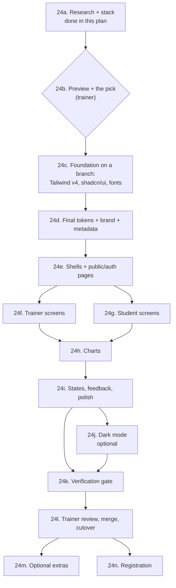
```mermaid
flowchart TD
    A["24a. Research + stack<br/>done in this plan"] --> B{"24b. Preview + the pick<br/>(trainer)"}
    B --> C["24c. Foundation on a branch:<br/>Tailwind v4, shadcn/ui, fonts"]
    C --> D["24d. Final tokens + brand + metadata"]
    D --> E["24e. Shells + public/auth pages"]
    E --> F["24f. Trainer screens"]
    E --> G["24g. Student screens"]
    F --> H["24h. Charts"]
    G --> H
    H --> I["24i. States, feedback, polish"]
    I --> J["24j. Dark mode<br/>optional"]
    I --> K["24k. Verification gate"]
    J --> K
    K --> L["24l. Trainer review, merge, cutover"]
    L --> M["24m. Optional extras"]
    L --> N["24n. Registration"]
```

Suggested: sonnet · high for 24b–24e and 24k — the choices are visual and subjective (direction,
shells, the accessibility gate), so a wrong call costs iterations, not data; sonnet · medium for
24c and 24f–24i — repeated patterns once tokens and shells exist; haiku · low for 24n. No opus
anywhere: nothing here touches data, rules or auth, so nothing is irreversible. This is a manual
recommendation only; it doesn't switch the model.

**24a. Research, stack and directions**
- [x] Template sources compared and a stack recommended (tables above): Tailwind v4 + shadcn/ui,
      `lucide-react`, shadcn `chart`, `native-select` for mobile forms, shadcn's toast component
      (Sonner-based or Base UI's — whichever the CLI offers for the chosen base), optional
      `next-themes`. Sources fetched 2026-09-29: shadcn installation, theming, blocks, chart,
      sidebar, dark-mode, native-select, component-catalogue and changelog pages (`create`, July
      2026 Base UI default); `tweakcn.com`; `tremor.so`; Tailwind's install and theme docs; the
      local Next 16.3.6 docs (CSS, static exports, fonts).
- [x] Category language measured from the live sites (table above) and Hevy's set-logging pattern
      researched; the trainer's own references (2026-09-22) carried in: `ui.shadcn.com/blocks` for
      the dashboard shape, TrueCoach / Trainerize for category language, Linear for density.
- [x] Three directions defined and their palettes contrast-checked (table above); §22's lessons kept
      — "everything is purple" came from Material's default surfaces, not the accent, and density
      beat decoration — re-checked now that Material is gone: none of the palettes tint surfaces with
      the accent beyond the single `accent` token.
- [x] Font availability confirmed in Next 16.3.6's own Google-font list: Inter, Barlow Condensed,
      Figtree (plus Geist, Plus Jakarta Sans, DM Sans, Sora, Outfit, Manrope, Onest, Public Sans as
      substitutes if the trainer wants a different feel).

**24b. The suggestion preview and the pick (manual)**
- [ ] Persist the preview as `web/design/preview.html` (outside `src/` and `public/`, so it never
      ships): one self-contained file — no framework, no Firebase, fixtures with the seed's names
      (Ana, Bruno, Carla, Diego) — with a switcher for the three directions and, per direction, four
      screens: the trainer's Painel, a trainer's student page (tabs + a chart), the student's home,
      and the student's log-session at 375 px. The first version was shown inline in the
      conversation on 2026-09-29. Done when it opens by double-click, works offline, and every
      screen renders in every direction using exactly the hex values above.
- [ ] **(manual)** The trainer answers, after opening it: (1) a direction for `/app` and one for
      `/aluno` — they may differ; (2) anything to change — accent hue, corner radius, font; (3) dark
      mode: yes, later or no (default: later); (4) a logo to use, or a wordmark is fine. Written
      here with the date. **Also settles §23a's open item: shadcn/ui + Tailwind is the default if
      the trainer doesn't object.**
- [ ] Iterate the preview on their changes until they say which. One round is the target, three the
      limit; each round is an edit of the same file. Done when the pick is recorded under this item.

**24c. Foundation, on the branch (no visual decisions in it)**
- [ ] Cut `feature/web-visual` from `feature/kmp-web` (see the delivery strategy). Done when the
      branch exists locally and `git status` is clean.
- [ ] Baseline before touching anything, written here for 24k: `npm test` 178+ and `npm run
      test:rules` 73 passing, and the production bundle — transfer size and JS chunk count of `/`,
      `/entrar/`, `/app/`, `/aluno/`, from `out/` or the network panel.
- [ ] Tailwind v4 per the local Next docs (`web/node_modules/next/dist/docs/01-app/01-getting-started/11-css.md`):
      `npm install -D tailwindcss @tailwindcss/postcss`, `postcss.config.mjs` with the
      `@tailwindcss/postcss` plugin, `src/app/globals.css` with `@import 'tailwindcss'`, imported
      in the root layout — **before** shadcn's init, whose Next guide assumes Tailwind exists. Done
      when a utility class renders in `next dev` and `npm run build` passes.
- [ ] `npx shadcn@latest init` in `web/` (check `--help` for the flags first; the default base is
      Base UI, `-b radix` for Radix — take the default unless a block needed later lacks it). The
      repo already has the `@/*` → `./src/*` alias it needs. Base colour `neutral`, CSS variables
      on. Done when `components.json`, `src/lib/utils.ts` (`cn`) and the token block in
      `globals.css` exist, `package.json` gained only what the CLI added, and lint + build are green.
- [ ] Fonts with `next/font/google` in `src/app/fonts.ts` — `subsets: ["latin"]` covers pt-BR
      accents — as CSS variables. Only the chosen direction's families remain after 24d. Done when
      the built HTML links self-hosted font files and no request goes to Google.
- [ ] Add the components the screens need (all confirmed in the catalogue): button, input, label,
      textarea, field, native-select, select, checkbox, radio-group, switch, toggle-group, badge,
      card, table, tabs, dropdown-menu, dialog, alert-dialog, sheet, sidebar, separator, skeleton,
      spinner, empty, alert, avatar, breadcrumb, tooltip, progress, toast, chart. Done when each
      imports and the build passes; nothing is rendered with them yet.
- [ ] Token guard: `web/scripts/check-contrast.mjs` (`npm run check:contrast`) reads the token pairs
      from `globals.css` and fails below 4.5:1 for text and 3:1 for UI, wired into `web-ci.yml`.
      Done when it passes on the chosen palette and a deliberately bad token makes it fail.
- [ ] Conventions written **now**, not at the end (a friend joins and reviews PRs): `CLAUDE.md`'s
      "No CSS until §23k starts" bullet becomes the design-system rules — colours only through
      tokens (no raw hex or arbitrary colour in components), Tailwind classes only (no inline
      `style`, no CSS modules), primitives in `src/components/ui/`, composed pieces in
      `src/components/`, one theme file, native controls on the student side. Done when the branch's
      `CLAUDE.md` says it.
- [ ] A populated demo seed, `npm run seed:demo` (`scripts/seed-demo.mjs`, separate from
      `seed-emulators.mjs` so §23g's checkable numbers stay put): ~12 students, 8 weeks of sessions,
      three months of measurements, a few overdue charges — so tables and charts have a real shape
      when reviewed. Done when it runs on a fresh emulator and the dashboard shows it.

**24d. Final tokens, brand and metadata (after the pick)**
- [ ] `globals.css` `:root` from the chosen palette — page, card, foreground, muted, border, input,
      primary, accent, ring, sidebar, chart 1–5, the three status colours and their badge tints —
      plus `--radius`, the font variables, and two densities set by a `data-area` attribute on each
      area's layout root: trainer 14 px text / 36 px controls, student 16 px / 48 px. Tailwind v4
      derives spacing utilities from `--spacing`, so a per-area override may scale paddings and
      heights for free — **verify that it does**; if not, size props per area. If the areas use
      different directions, each layout carries its own token block. Done when both areas render
      from tokens alone and `check:contrast` is green.
- [ ] Drop the unchosen directions' fonts and tokens.
- [ ] Brand: a wordmark ("Personal Tracker") and a simple glyph as SVG — `src/app/icon.svg` (Next's
      metadata-file convention; the base path is handled) — used in the sidebar, login and landing.
      **(manual)** if the trainer supplies a logo instead. Done when the tab shows the icon on the
      deployed path.
- [ ] Metadata: a title template `%s · Personal Tracker`, a description and `theme-color`. **Every
      route gets its own title** — client pages can't export `metadata`, so each is wrapped by a
      server `page.tsx` that does, as `app/fichas/editar/page.tsx` already is. `/app/`, `/aluno/`
      and `/convite/` are `noindex` (they are login shells; only `/` should be found by a search
      engine). Open Graph title, description and image for `/` and `/convite/`, so a WhatsApp
      preview of an invite link shows "Seu personal convidou você" on a real card (`metadataBase`
      = the Pages URL, a static `opengraph-image` per route). Done when the built HTML of those
      routes carries the tags.

**24e. Shells and public/auth pages**
- [ ] Root layout: fonts, the toast host, a "pular para o conteúdo" skip link, a global
      `:focus-visible` ring, `prefers-reduced-motion` respected. Done when tabbing from a fresh load
      reaches the skip link first.
- [ ] Trainer shell (`/app`): shadcn `Sidebar` (icon-collapsible; a `Sheet` below `md`) with Painel,
      Alunos, Agenda, Mensalidades and lucide icons; a header with the page title / breadcrumb and a
      user menu (name and e-mail, "Sair"; the theme toggle joins in 24j). Basis: the `dashboard-01`
      and `sidebar-07` blocks (CLI-installable; check Base UI support when adding them). Done when
      the four pages render inside it at 1280 px, the sidebar becomes a sheet at 375 px, and the
      current item carries `aria-current`.
- [ ] Student shell (`/aluno`): a compact header (wordmark, Sair) and a bottom tab bar (Fichas,
      Evolução — the phone's two tabs) on narrow screens, respecting safe-area insets; on wide
      screens a centred column no wider than ~560 px. Done when it holds at 375 / 768 / 1280 with
      no full-width table and no stretched-phone look.
- [ ] `/entrar/`, `/convite/` (a `login-03`/`-04`-style card; the invite screen says what happens
      next; "Manter conectado" keeps its meaning), `/` (hero, the two audience sections already
      written, one call to action each; no stock photography), `not-found` (this is what GitHub
      Pages serves as its 404) and `error`. Done when each passes 24k's checks.
- [ ] `RequireArea`'s bare "Carregando…" becomes a branded full-page skeleton, so the auth check
      doesn't flash raw text before the shell appears.

**24f. Trainer screens** (in order of value to the trainer; each is restyle only — the domain
functions and their numbers don't change)
- [ ] **Painel:** four KPI cards (alunos conectados, sessões em 7 dias, aderência em 28 dias,
      a receber / em atraso), one prioritised "Atenção" card that merges *sem treinar há 7 dias ou
      mais*, *avaliações pendentes* and *em atraso* with a link to each student, and the money
      table as a compact card. Numbers set in tabular figures. Done when the seed's known values
      still read exactly: 6 students (4 connected, 2 waiting), 4 sessions / 7 days, 35 % adherence,
      Bruno quiet, Diego pending, R$ 270,00 / R$ 150,00 / R$ 120,00.
- [ ] **Alunos:** a table — name with an initials avatar, goal, connection badge, medical-restriction
      flag as icon *and* text — with a search field, the connection filter as a toggle group, "N de M
      alunos", an empty state and a primary "Cadastrar aluno"; the name is the link. Below `md` rows
      become stacked cards. Done when search ("ALVES" finds Bruno), filter and sort behave as in §23g.
- [ ] **Novo / editar aluno** (`StudentForm`): shadcn `Field` groups (dados, treino, saúde), gender
      and level as radio / toggle groups, training days as a Seg–Dom toggle group, inline field
      errors plus a summary alert, a sticky action bar. `profileErrors` is untouched.
- [ ] **Aluno:** a header (avatar, name, connection badge, phone, actions) and `Tabs` — Resumo,
      Fichas, Evolução, Avaliações, Mensalidade — instead of eight stacked sections; the tab lives in
      `?tab=` so it is linkable and survives the static export; the medical note is a warning
      callout; permissions are switch rows with a one-line explanation; the invite link is a
      read-only field with a copy button and a visible "Copiado". Done when a draft shows only the
      tabs it can have (no Evolução / Avaliações), as today.
- [ ] **Fichas:** the list as rows with an Ativa / Inativa badge and an action menu; the editor
      (`/app/fichas/editar/`) as two columns — left the three steps (pedir à IA → importador →
      ficha), right a sticky preview with the exercise table and the effective-volume bars drawn
      against the 12–20 band the phone only states in a sentence; delete through an `AlertDialog`.
      Smart Paste and the prompt are unchanged. Done when a paste still fills the name and exercises
      exactly as verified in §23g part 3.
- [ ] **Agenda:** the week grid with hour rows and booking chips; an empty slot reveals a "+" on hover
      *and* focus; the student picker as a combobox; below `md` a one-day-at-a-time switcher. The
      `aria-label`s of §23g part 5 are kept (they are what a screen reader and the tests find).
- [ ] **Mensalidades:** month select, two KPI cards (previsto, recebido), the table with a
      `StatusBadge`, a row menu (Marcar como pago → a dialog with method, day and note; Ajustar →
      a dialog; Desfazer → an `AlertDialog`), earlier-months overdue as a warning card, and the
      "sem mensalidade" list. Done when marking paid moves the totals exactly as verified in §23g
      part 6.

**24g. Student screens** (phone first; verified at 375 px, then checked at 1280)
- [ ] **Home:** a greeting, the pending-assessment banner as a primary-tinted card, one card per
      ficha — name, "N exercícios", "Última vez: dd/mm" (from the student's own logs), the exercise
      list in an accordion, a full-width "Iniciar treino" — and the empty state "Nenhuma ficha
      atribuída ainda. Fale com seu personal."
- [ ] **Registrar treino:** a progress line ("2 de 5 exercícios"); each exercise a card with its
      target ("Alvo: 3×12 · 40kg") and rows `Série | Peso (kg) | Reps` of 48 px inputs
      (`inputMode` decimal / numeric, `enterKeyHint="next"`); "Adicionar série"; a sticky bottom bar
      "Salvar sessão", disabled until a row is complete, with a live count; a success screen that
      summarises the session. Comma-decimal normalisation and the row rules of §23h are untouched.
- [ ] **Evolução:** the latest weight as a large figure with the change since the previous one and a
      mini chart; "Registrar medida" in a bottom sheet, only while `canLogBiometrics` (still
      hidden, not disabled); the exercise picker as a **native** select plus the progression chart;
      recent sessions as cards, not a table.
- [ ] **Autoavaliação PAR-Q+:** an intro card; each question a card with a 48 px Não | Sim segmented
      control; a progress bar ("3 de 7"); a "sim" gets a subtle warning border; goal, level
      (segmented) and training days; a sticky "Enviar para o personal"; a success state. The seven
      questions and their order are `PAR_Q`'s, untouched.
- [ ] Native controls on this side wherever a phone has a better one (`select`, number inputs): the
      trainer side may use the custom `Select`; this side uses `native-select`. Done when no student
      screen scrolls horizontally at 375 px and every tap target is ≥ 44 px (48 px for primary ones).

**24h. Charts** (phase 1 has none; the tables were the stand-in)
- [ ] Wrappers over shadcn's `chart` (Recharts v3): **weight** line (student Evolução, trainer's
      student tab); **load progression** for the selected exercise (maximum per session, the
      series `loadProgression` already yields); **sessions per week** bars for the Painel — needs a
      new pure `sessionsPerWeek(logs, today, zone, weeks)` in `domain/metrics.ts` on top of
      `trainedDays` (the definition of a session is unchanged: a student-day) with unit tests.
- [ ] Each chart: a title and unit, colours from `--chart-n`, `accessibilityLayer`, the phone's own
      empty message ("Adicione mais medidas para ver o gráfico"), and a **"Ver dados" toggle that
      shows the existing table** — the tables stay: they are the accessible and no-JS view, and they
      were validated in §23g.
- [ ] Loaded through `next/dynamic` so pages without charts don't pay for Recharts. Done when the
      route sizes are recorded against 24c's baseline and the difference is explained.

**24i. States, feedback and polish**
- [ ] Skeletons replace every "Carregando…"; errors share one `Alert` with a retry; empty states use
      the `Empty` component with a next step; numbers use tabular figures everywhere.
- [ ] Toasts on: ficha salva, pagamento registrado / desfeito, horário agendado / removido, medida
      salva, autoavaliação enviada. Today several of these navigate or refresh in silence.
- [ ] `window.confirm` becomes an `AlertDialog` (excluir ficha, desfazer pagamento), with focus
      returning to the trigger.
- [ ] Motion stays small (≈ 150 ms, opacity / transform only) and vanishes under
      `prefers-reduced-motion`.
- [ ] Copy pass: every visible string in pt-BR; **validation messages that tests assert are not
      reworded** (`workoutErrors`, `parseMeasurement`, `profileErrors`, …).

**24j. Dark mode (optional — only with the trainer's "sim" from 24b)**
- [ ] `next-themes` per shadcn's guide (`attribute="class"`, `defaultTheme="system"`,
      `suppressHydrationWarning` on `<html>`, no flash — verify on the static export), `.dark`
      tokens derived from the chosen palette (tweakcn can generate them), a toggle in the trainer's
      user menu; the student side follows the system setting. Done when `check:contrast` also
      passes the dark tokens and the charts stay legible.

**24k. Verification gate**
- [ ] Automated: `npm test` (178 + new), `npm run lint`, `npx tsc --noEmit`, `npm run build`,
      `npm run test:rules` (73, unchanged), `check:contrast`, Web CI green.
- [ ] Every route driven with the browser tooling against the seeded emulators at 375 / 768 / 1280 /
      1920 px: no horizontal page scroll (tables scroll inside their container), no console errors,
      and the flows of §23g / §23h repeated — remembering that the new radios, switches and
      checkboxes are custom elements the earlier form-fill shortcut can't set: use real clicks.
- [ ] `axe-core` injected into each route (install as a dev dependency, evaluate its bundle in the
      page): zero serious or critical violations; a keyboard-only pass through trainer login →
      Painel → an aluno → salvar uma ficha, and student login → registrar um treino.
- [ ] Bundle vs the 24c baseline: no route grows unexplained; charts are lazy.
- [ ] `/designreview` on the deployed URL (or on page captures at 1280 and 375 px if the browser pane
      can render them) — the repo's design-critique command, run against the rubric.
- [ ] The original complaints, checked literally: at ≥ 1024 px `/app` reads as a web dashboard
      (sidebar, tables, selectable text); `/aluno` at 1280 px is a centred column, not a stretched
      phone; nothing resembles Material (no FAB, no tonal-purple surfaces).

**24l. Trainer review, merge and cutover**
- [ ] **(manual)** The trainer reviews the branch build — a temporary deploy from the branch (see the
      delivery strategy; needs their OK and no real students online) or locally against the demo
      seed — as trainer and as student, on desktop and on their phone, and signs off or lists fixes.
      Screenshots welcome; fixes are new items here, not a reopened 24f–24g.
- [ ] **(manual)** Merge `feature/web-visual` into `feature/kmp-web` (push and PR only on their say),
      let Web CI and the deploy run, then repeat the route sweep of 24k on the live URL —
      unauthenticated routes, then the trainer's own login.
- [ ] `main` still deploys the Kotlin/JS build until this branch reaches it (memory:
      *pages-deploy-main-risk*). **(manual)** decide with the trainer when `feature/kmp-web` goes to
      `main`; until then, no push to `main`.

**24m. Optional extras (each independent; only with the trainer's yes)**
- [ ] **"Anterior" column** in Registrar treino — last session's weight × reps for that exercise and
      set, the Hevy pattern. A pure `previousSets(logs, exercise)` in `domain/progression.ts`, with
      tests; the student's own logs are already loaded on that screen.
- [ ] A command palette (`Ctrl/⌘ K`, shadcn `command`) to jump to a student from anywhere in `/app`.
- [ ] An installable student site: a web manifest and icons, with `start_url` and `scope` carrying
      the base path — check first that the static export supports the manifest file convention.
- [ ] A print stylesheet for a ficha ("imprimir ficha"), for trainers who still hand out paper.

**24n. Registration**
- [ ] `CLAUDE.md`'s web section finalised: the design-system rules from 24c, the two densities, the
      tokens file, "native controls on the student side", the accessibility contract (contrast
      pairs, targets ≥ 44 px on the student side, focus visible, names on every control, colour never
      alone), and the note that the seed / e2e recipes now need real clicks. `web/README.md`
      updated (`check:contrast`, `seed:demo`, the preview file).
- [ ] GOALS.md: §23k and §23a's library item ticked with the decision recorded; the memory notes
      updated — the *backend-first* method's design phase is done and the "no CSS" rule is lifted;
      the chosen direction is recorded.
- [ ] Remove what shouldn't ship: the unchosen tokens and fonts, and `web/design/preview.html` if
      the trainer doesn't want to keep it as a living reference.

**Out of scope (deliberately):** new product features beyond 24m's four (chat, nutrition, habits,
payment gateway — §12's backlog); the Android app's look; translations; photography, illustration
or video; brand identity beyond a wordmark and a glyph; analytics; email templates; an offline /
service-worker mode.

**Risks, and what contains them**
- *A half-styled site reaches production* — the branch strategy; nothing merges before 24k.
- *Preflight restyles the bare pages the moment Tailwind is installed* — same containment.
- *Markup changes break behaviour* — the domain and data layers are untouched and covered by 178 unit
  and 73 emulator tests; screens keep their labels, `aria-label`s and validation messages; the
  browser sweep of 24k repeats the §23g / §23h flows.
- *Bundle growth* (Recharts, the primitives) — measured against a baseline; charts are lazy.
- *Subjective quality* — the pick comes first, in a preview; trainer checkpoints at 24b and 24l;
  captures or the live URL at four widths.
- *Base UI is new to this project* — it's shadcn's default and Radix stays one flag away
  (`-b radix`); decide at 24c, don't mix the two.
- *The browser pane can be hidden, and then captures fail* — fall back to DOM checks plus the
  trainer's own screenshots, which is how earlier passes worked.
- *A friend joins mid-way* — the conventions land at 24c, and the branch goes through PR review.

---

## 25. Feature — Make creating fichas as easy as possible: several treinos at once, a PDF-backed exercise catalog, and (gated) in-site generation
(2026-09-30, via `/newgoal`)

**Superseded in part by §33 (2026-10-06):** wherever 25a/25c/25f/25i say the reference table is put in the prompt, is a public catalog file under `public/prompt/`, or can be kept in the trainer's own AI project ("já tenho a tabela" switch), that is no longer true: the prompts carry no table, the public files are gone, the switch was removed, and the catalog is read from the gated Firestore document `appData/exerciseCatalog`. The splitter, the review screen, the Gemini tab and the volume bands of this section stand.

**Superseded in part by §34 (2026-10-07):** the review as its own step, the request shortcuts (25f), the in-site Gemini tab (25i) and the single/multi prompt templates are gone — the editor now has one static "Prompt de formatação de ficha", the importer, and the ficha's treino cards (`TreinosEditor`); a ficha is a named set of treinos, at most two per student. The splitter (`parseWorkouts`), the treino cards' editing, the volume bands and the catalog loading of this section stand.

**The request:** "facilitar o máximo possível a criação da ficha." The trainer has a PDF of exercises
with their partial muscle activations and wants an AI chat inside the site that always has that
context — but found no free chat, and believes Gemini Flash no longer has a free tier. Second idea:
keep the copy-the-prompt / paste-the-answer flow, but make the site understand that the answer holds
**1, 2, 3 … N treinos** (Ficha A, B, C…) and split them automatically, "like Excel does". Plus: "if
there is an easier way I did not think of, tell me."

**Goal type: Feature** — a bounded addition to a web front that works and is live — with a research
block in front (25a) because two of the trainer's assumptions needed checking before designing.
Research is done (2026-09-30); 25a records the result so nothing is looked up twice.

**What the research changed, in five lines (the short answer to the trainer):**
1. **Gemini Flash is still free** — on Google's own pricing page today (`gemini-3.8-flash`,
   `gemini-3.5-flash`, `gemini-3.5-flash-lite`… are "Free of charge"), and Firebase AI Logic lists
   `gemini-3.8-flash` and `gemini-3.5-flash-lite` as available on the free Spark plan. What went
   away is the **2.5 family** on AI Logic ("limited to projects that actively used them in the
   past"; 2.5 Flash retires 2026-10-16) — the likely reason it "stopped existing". Model ids rotate,
   so nothing here may hard-code one in more than one place. Caveat that matters for a health app:
   on the free tier "content used to improve our products" — student data must not go there by
   default (25i).
2. **A chat is not the easiest way in.** The two real problems are (i) the AI must know the PDF and
   (ii) the site must cope with several treinos in one answer. (i) is solved by putting the PDF's
   table **in the site** as a catalog (25c) — it is then "always saved", needs no chat memory, and
   the site can compute every muscle coefficient itself instead of trusting the AI to copy them.
   (ii) is solved by a splitter + review screen + one-click save of all fichas (25d–25e).
3. Do those first. They work with **any** AI app the trainer already uses, cost nothing, and need no
   quota, key, or server. The in-site chat (25h–25i) is second, and gated on a spike.
4. The in-site chat, if the spike passes, is **Firebase AI Logic from the browser** — the same
   no-key, App-Check-protected, Spark-plan path the Android app already uses. It needs no server, so
   §23e's "no provider key ever reaches the browser" still holds; what it reverses is §23e's "the web
   makes no AI calls", and only with the trainer's explicit say-so (given 2026-09-30, conditional on
   the spike).
5. A no-code bridge exists today: keep the PDF in a **Claude Project / ChatGPT Project** and use a
   short prompt (25f's "já tenho a tabela" switch). Fragile — each vendor changes limits — so it is a
   fallback, not the plan.

**Not touched by this section (explicit, to stop scope creep):** the Android app and its parser
(`WorkoutParser.kt`, `ficha_prompt_template.md` — the phone reads the same stored documents and keeps
pasting one ficha at a time); `firestore.rules` (no new collection or field); Mensalidades, Agenda,
Registros; editing an *existing* ficha (stays single-ficha); the student area; paid AI tiers;
muscle heat-maps; persisting chat history; OCR of scanned pages beyond the one-time PDF conversion.

**Where this executes:** the web front lives on `main` since PR #4 (2026-09-30) and on
`feature/kmp-web`. Execute on a branch from `main` and open a PR (the deploy gates on lint + tests +
build). `main`'s `GOALS.md` does not contain §23 or this section — copy §25 there first, or run
`/execgoals` from a checkout whose `GOALS.md` has it. Numbering: §24 is an uncommitted plan in the
`feature-kmp-web` worktree (superseded by §23k's ALLU template) — that is why this is §25.

**Status 2026-09-30 (executed in part, on `feature/multi-ficha`, PR #6 against `main`):** 25d, 25e (all but
the catalog enrichment), 25f, and 25i's code are built and verified as far as a laptop allows — splitter,
review screen, atomic save, multi-treino prompt with quick picks, and the **Gemini tab**, whose network call
was exercised with a stubbed server (the real SDK ran). **Open:** 25c (the catalog — the trainer confirmed the
PDF is the same table as `hypertrophy_volume_reference.md`, so there is nothing to convert, only the lookup to
build), the Firebase console steps and the live check of the Gemini call (25h, `(manual)`), and the AI Studio
limits. The trainer's go-ahead to build the Gemini tab came before the 25h spike, so the spike was folded into
the implementation; its go/no-go criteria remain the acceptance test of the live tab.

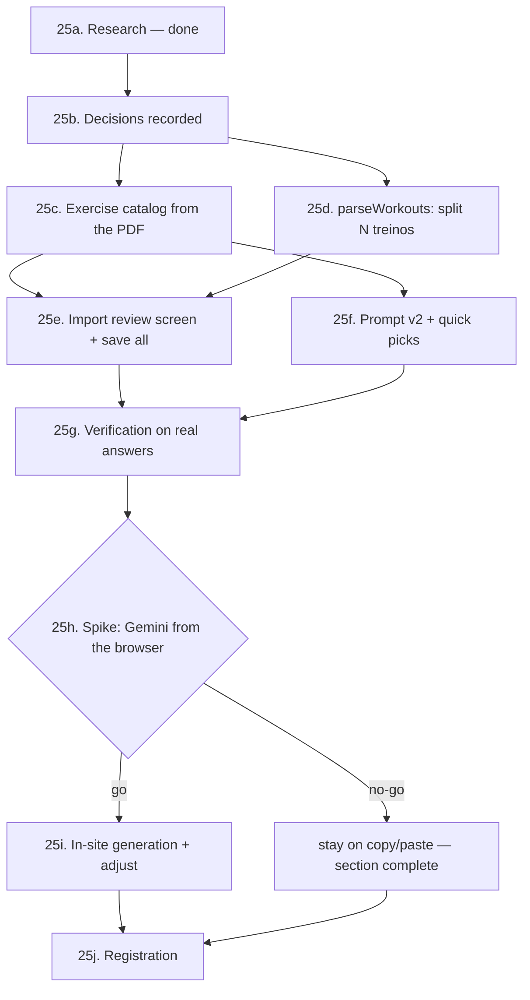
```mermaid
flowchart TD
    A[25a. Research — done] --> B[25b. Decisions recorded]
    B --> C[25c. Exercise catalog from the PDF]
    B --> D[25d. parseWorkouts: split N treinos]
    C --> E[25e. Import review screen + save all]
    D --> E
    C --> F[25f. Prompt v2 + quick picks]
    E --> G[25g. Verification on real answers]
    F --> G
    G --> H{25h. Spike: Gemini from the browser}
    H -- go --> I[25i. In-site generation + adjust]
    H -- no-go --> J[stay on copy/paste — section complete]
    I --> K[25j. Registration]
    J --> K
```

Suggested: sonnet · high — additive TypeScript in a tested domain layer; the parser (25d) and the catalog match (25c) are where a wrong edge case silently corrupts a saved ficha, so they get high effort; the rest is medium.

**25a. Research — what the free options really are (checked 2026-09-30)**

Suggested: sonnet · medium — already done; kept so the decision can be re-read, not repeated.

- [x] Gemini Developer API free tier: **exists.** Source: <https://ai.google.dev/gemini-api/docs/pricing> —
      free input/output for `gemini-3.8-flash`, `3.7-flash`, `3.6-flash`, `3.5-flash`,
      `3.5-flash-lite`, `3.1-flash-lite`, `2.5-flash`, `2.5-flash-lite`, `2.5-pro` and others;
      context caching free; "Content used to improve our products" applies to every free-tier
      model. Rate limits are **not published per model** — "viewed in Google AI Studio"
      (<https://ai.google.dev/gemini-api/docs/rate-limits>). Third-party blogs quote 5–15 requests
      per minute and 100–1,500 per day for Flash-class models and mention quota cuts on 2025-12-07
      and in April 2026; treat those numbers as indicative only — read the real ones in AI Studio
      (manual item below).
- [x] Firebase AI Logic (the route that keeps the key out of the browser):
      <https://firebase.google.com/docs/ai-logic/models> — on the free Spark plan:
      `gemini-3.8-flash`, `gemini-3.5-flash-lite` (plus TTS/Live models); Blaze only:
      `gemini-3.1-pro-preview` and image models; Gemini 2.5 models "limited to projects that
      actively used them in the past"; **App Check enforcement becomes required for AI Logic on
      2026-11-02** (this site already initialises App Check with reCAPTCHA Enterprise in
      `web/src/data/firebase.ts`). Web SDK: `import { getAI, getGenerativeModel, GoogleAIBackend }
      from "firebase/ai"` (<https://firebase.google.com/docs/ai-logic/get-started?platform=web&api=dev>);
      works in a pure static browser app; no billing needed for the Gemini Developer API; structured
      output via `generationConfig.responseMimeType = "application/json"` + `responseSchema`
      (<https://firebase.google.com/docs/ai-logic/generate-structured-output>). The web docs fetched do
      **not** show system instructions or `startChat` samples — the spike (25h) must confirm both.
- [x] Android's `AndroidGeminiProvider.kt` pins `gemini-3.7-flash`, which is **not** in the Spark list
      fetched today (`gemini-3.8-flash`, `gemini-3.5-flash-lite`). Not this section's job to fix, but
      it may be why the phone's Gemini call misbehaves — recorded as the last item of 25j.
- [x] Chat apps with persistent project context — a zero-code way to "keep the PDF": ChatGPT
      Projects on the free plan allow 5 files per project (secondary source; OpenAI's help page
      returned 403 to the fetch tool); Claude Projects exist on the free plan, 30 MB per file
      (secondary sources); **Gemini Gems are being migrated to "Skills"** — personal accounts lose
      Gems in November 2026, and Skills only "will gain … adding Google Drive files or notebooks for
      context" (<https://9to5google.com/2026/09/30/gemini-skills-free/>). Verdict: usable today,
      unstable over months; never make the site depend on one vendor's project feature.
- [x] Chrome's built-in AI (Gemini Nano, Prompt API): **rejected.** Desktop only — "Chrome for
      Android, iOS … not yet supported"; needs 22 GB free disk and a >4 GB-VRAM GPU or 16 GB RAM;
      supported languages "en, ja, es, de, fr" — no Portuguese; small context
      (<https://developer.chrome.com/docs/ai/prompt-api>).
- [x] Puter.js (<https://developer.puter.com/tutorials/free-llm-api/>): "user-pays" model, no API key
      and no backend — works on a static site, but every user must sign in to a third-party (Puter)
      account and student data would pass through it. **Not chosen**: one more vendor and account for
      no gain over Firebase AI Logic, which the project already uses.
- [x] Free APIs that need a key (Groq, OpenRouter `:free` models, Mistral "Experiment", Cerebras,
      Cloudflare Workers AI): all would need a **server-side proxy** to keep the key out of the
      browser (a Cloudflare Worker would do; Firebase Functions needs Blaze, which §3 refused), i.e.
      a second vendor plus a server. Their limits change fast (a secondary source reports Groq's
      Llama 3.3 70B leaving the free tier on 2026-08-16). **Plan B only**, if the 25h spike fails on
      quota and the trainer still wants an in-site chat.
- [x] **Field research for the browser integration (2026-09-30)** — what Firebase documents for AI Logic on the
      Web, so the tab is built the documented way: **(1)** initialise with `getAI(app, { backend: new
      GoogleAIBackend(), useLimitedUseAppCheckTokens })`; limited-use tokens are minted per request, live 5
      minutes and, with replay protection enforced, can be used once — the site turns them on whenever App Check
      is initialised (everywhere but the emulators). **(2)** Enforce App Check for the AI Logic API in the
      console (Security → App Check → APIs); without a valid token the answer is `403 PERMISSION_DENIED: To
      access this model, you must enforce Firebase App Check`; `localhost` needs a registered debug token
      (<https://firebase.google.com/docs/ai-logic/app-check>). **(3)** `systemInstruction` goes in
      `getGenerativeModel` and `model.startChat()` keeps the history, so a follow-up is just `sendMessage`
      (<https://firebase.google.com/docs/ai-logic/chat>, `.../system-instructions>`) — the open question from
      the first pass is closed. **(4)** Structured output is `generationConfig.responseMimeType =
      "application/json"` + a `Schema` (its size counts as input tokens). **(5)** Errors worth telling the
      trainer about: 403 (App Check / API not enabled — both "Gemini Developer API" and "Firebase AI Logic API"
      must be on; or an API-key restriction missing `firebasevertexai.googleapis.com`), 404 (retired model), 429
      (quota), 503 (overloaded) (<https://firebase.google.com/docs/ai-logic/error-codes>). **(6)** The default
      per-user limit is 100 requests/minute; the Spark free quota amounts are NOT on Firebase's pricing page —
      they point to the Gemini pricing page, which defers to AI Studio. **(7)** Google's own advice for the
      retiring models: do not hard-code the id — use Remote Config (free, client template parameter) to change
      it without a deploy (<https://firebase.google.com/docs/ai-logic/change-model-name-remotely>). All seven
      are implemented or documented in `web/src/data/gemini.ts`, `domain/aiErrors.ts` and `web/README.md`.
- [ ] **(manual)** In Google AI Studio (<https://aistudio.google.com/rate-limit>), signed in with the
      project's Google account, read the actual free-tier limits (requests/minute, requests/day,
      tokens/minute) for `gemini-3.8-flash` and `gemini-3.5-flash-lite` and paste them under this
      item. If the page shows `0` or the model is missing, note the region/billing reason — this is
      the most likely explanation of "no longer exists" besides the 2.5 retirement. Done when: the
      two rows of numbers are written here with today's date.
- [x] **(manual)** The trainer says which PDF this is: is it the source of the table already in
      `app/src/main/assets/hypertrophy_volume_reference.md` (5.4 KB, used today in the prompt), or a larger/different document? Put the
      PDF at `dev/exercise-reference.pdf` (or give the path). Done when: the file is in the repo
      (or the path is written here) and this item says which case it is. Copyright: confirm it is
      fine to keep the PDF in the repository, else keep it outside and commit only the derived table.
      **Resolved 2026-09-30 by the trainer: it is the same table** as `hypertrophy_volume_reference.md` — nothing to
      convert, and the PDF itself is not added to the repository. 25c's first item is therefore a no-op.

**25b. Decisions recorded before any file changes**

Suggested: sonnet · medium — writing down decisions already argued above, so execution does not re-litigate them.

- [x] Write these decisions into this section (or `CLAUDE.md`'s web section) as settled, each with
      its reason, before code: **(1)** the catalog lives in the site (single-sourced from
      `hypertrophy_volume_reference.md`, extended by the PDF), the AI only chooses exercises and
      set/rep schemes, and the **site** fills `muscleActivation` from the catalog; **(2)** the
      multi-treino splitter is **web-only** — `parseWorkoutName`/`parseExercises`/`applyPaste` stay
      byte-for-byte as they are (they mirror `WorkoutParser.kt`, and the phone must keep agreeing with
      them); **(3)** the stored document is unchanged (`workouts/{id}` with `exercisesJson`), so the
      phone reads what the web saves exactly as before; **(4)** the multi-treino prompt template is a
      **web-only** asset — the shared `ficha_prompt_template.md` asks for one ficha and the phone's
      parser would pile A+B+C into one; **(5)** in-site generation ships only if 25h's go/no-go passes,
      and never sends name, phone or medical notes by default. Done when: the five decisions are
      written where the next session will read them.
      **Recorded 2026-09-30** in `CLAUDE.md`'s web section (PR #6): the splitter and the two prompts are web-only and
      `parseWorkoutName`/`parseExercises`/`applyPaste` do not change (2); the stored document is unchanged (3); the
      multi-treino prompt is web-only (4); in-site generation exists with name/medical notes withheld by default and
      every failure pointing at the copy-and-paste tab (5). Decision (1) — the **site** fills `muscleActivation` from
      a catalog — is the one not built yet (25c): until then the AI still emits the `[Músculo:coef]` annotations and
      the Gemini schema carries `ativacao`.

**25c. The exercise catalog — the PDF's table, inside the site**

Suggested: sonnet · high — parses two different table shapes from a hand-written Markdown file and
feeds a matcher whose mistakes change a student's recorded volume.

- [x] Reconcile the PDF with the existing table (depends on the manual item in 25a). Two cases:
      **(a)** the PDF is the same table → nothing to convert, go on; **(b)** it has more exercises or
      muscles → convert the extra rows into the **same Markdown format**, appended to
      `app/src/main/assets/hypertrophy_volume_reference.md` (single source: Android's prompt and the
      web's both read it, and the prompt grows for both — acceptable, it only adds rows). If the PDF is
      scanned images, say so in the note and stop at a typed table the trainer proofreads
      (`(manual)`). Done when: every exercise in the PDF appears in the Markdown once, and the diff
      was checked row by row against the PDF by the trainer.
      **Case (a), 2026-09-30:** the trainer confirmed the PDF is the same table — nothing to convert or append. The
      catalog build script, `exerciseCatalog.ts` and their tests (the next three items) are still to do.
- [x] `web/scripts/build-exercise-catalog.mjs`, run from `prebuild` and `predev` next to
      `copy-prompt-assets.mjs`: reads `../../app/src/main/assets/hypertrophy_volume_reference.md` and
      writes the generated, gitignored `web/public/prompt/exercise-catalog.json` (same generated-copy
      convention as the prompt assets). Two table shapes must parse: **wide tables** (one column per
      muscle, cells `0`, `0,25`, `0,5`, `0,75`, `1`; decimal comma → number) and the **monoarticular
      table** (columns `1,0 / 0,75 / 0,5 / 0,25`, each cell a `;`-separated list of muscles, `-` for
      empty). Output: `{ version, exercises: [{ name, group, muscles: { "<muscle label exactly as in
      the header>": coefficient } }] }`. Keep muscle labels **verbatim** (`Delt. ant.`, `Tríceps
      geral`…) so keys match what the AI annotations and already-saved fichas use. A row that cannot
      be parsed fails the build with its line number — never silently skipped.
- [x] `web/src/domain/exerciseCatalog.ts`: `normalizeName(text)` (lowercase, accents folded, collapse
      spaces/punctuation; drop "com barra/halteres/na máquina" qualifiers only as a *second*
      attempt), `lookupExercise(catalog, name)` → `{ entry, how: "exact" | "normalized" | "close" } |
      null`, and `catalogActivation(entry)` → the `Record<string, number>` stored as
      `muscleActivation`. "Close" = all significant tokens of the shorter name appear in the longer
      one **and** exactly one catalog entry qualifies; two candidates or none → `null` (ambiguity is
      surfaced to the trainer in 25e, never guessed). Pure, no I/O, catalog passed in.
- [x] Tests (`exerciseCatalog.test.ts`, plus a test of the build script's parser against the real
      Markdown file so a future edit that breaks the table fails CI): an exact name returns the source row
      with its muscle labels (row values omitted here — GOALS.md §33; §33 moved these tests to a synthetic
      catalog and kept only a structural check of the real source); accent and case variants match; a name
      with a known equipment qualifier matches by the second attempt; a bare first word is ambiguous → null;
      an exercise not in the table → null; a monoarticular row keeps its muscle labels; every catalog
      coefficient is one of 0, 0.25, 0.5, 0.75, 1.
      Done when: `npm test` passes and the JSON for today's table has the expected entry count (count
      the table rows in the test, do not hard-code a guess).

**25d. `parseWorkouts` — split one answer into N treinos**

Suggested: sonnet · high — the core of the trainer's request; the regex and the fallbacks decide
whether a real AI answer becomes 3 correct fichas or 1 merged wrong one.

- [x] New pure function in `web/src/domain/workoutParser.ts`, **added beside** the existing ones, which
      are not edited: `parseWorkouts(text): { workouts: ParsedWorkout[]; warnings: string[] }` where
      `ParsedWorkout = { name: string; exercises: Exercise[] }`. It walks the lines once: a **header
      line** starts a new treino; every other line goes through the existing per-line exercise logic
      (factor that part of `parseExercises` into a shared helper so the exercise rules exist once, with
      the existing tests still green **unchanged**).
      **Done 2026-09-30** (PR #6). `parseWorkouts(text): { workouts, warnings }` sits beside the untouched
      single-ficha functions; the per-line exercise rule was factored into `exerciseFromLine`, which
      `parseExercises` now calls (the ported `workoutParser.test.ts` passes unchanged).
- [x] Header rules (case-insensitive; `S` = `JAVA_REGEX_SPACE` as in the existing patterns): the word
      `Ficha`, `Treino` or `Dia` + `[A-G]` or `[1-7]` (the existing `NAME_PATTERN`'s alphabet), allowed
      after leading decoration the AI adds despite instructions — `#`/`##`, `**`, `__`, `>`, `-`, `•`,
      `1.` / `1)` — and allowed to carry a subtitle after ` - `, ` – `, ` — ` or `:` (`Treino A — Peito
      e tríceps`). Name = the header plus its subtitle, decoration stripped, at most 60 characters; a
      header with no subtitle is just `Treino A`, identical to `parseWorkoutName`'s output. A line is a
      header **only if it has no `NxM` pattern** (so `Dia 1 3x10` stays an exercise line) — the exercise
      pattern wins.
      **Done.** The letter/number must end the word (`(?![\p{L}\p{N}])`), so "Treino Abdominal" is not "Treino A";
      decoration is stripped only on the new path; names are canonicalised ("treino b" → "Treino B") and capped at 60
      characters; a line with an NxM is an exercise even if it starts like a header.
- [x] Edge cases, each with a test: exercise lines **before** the first header → a treino named
      `Treino 1`; **no header at all** → exactly one treino holding every exercise (named like
      `parseWorkoutName` would, else `Treino 1`), so a plain WhatsApp-style paste behaves as today; two
      headers with the same letter → keep both, the second becomes `Treino A (2)`; a header with no
      exercises → dropped and reported in `warnings` ("Treino C não tem exercícios"), not thrown; more
      than 7 treinos → all parsed, a warning says the phone's header alphabet ends at G/7; blank lines,
      commentary lines, markdown rules (`---`) and code-fence lines are ignored; the no-break space
      WhatsApp inserts keeps behaving as the existing tests pin; tab-separated lines `Treino⇥Exercício⇥
      Séries⇥Reps` (a paste from Excel/Sheets — the trainer's own "like Excel" analogy) are recognised
      when **every** non-empty line has ≥ 3 tab-separated cells with a numeric sets cell: group by the
      first column.
      **Done**, with two deliberate differences from the wording above: more than 7 treinos gives a soft "confira se
      a separação está certa" warning (the phone's alphabet limit is about *pasting*, not about names), and the
      spreadsheet mode needs every non-empty line to have ≥ 3 tab cells and one whole-number sets cell.
- [x] Tests (`workoutParser.test.ts`, appended; **no existing case edited**): (1) a realistic ABC answer
      inside a code fence, with `[Músculo:coef]` annotations on every line → 3 treinos, annotations
      parsed per exercise; (2) the same answer without annotations; (3) a markdown-heavy answer
      (`## Treino A`, bold exercise lines — if bold lines fail the existing pattern, strip emphasis
      markers before matching, in the new path only); (4) `Dia 1…Dia 5`; (5) commentary before,
      between and after treinos; (6) each edge case above; (7) the property **"concatenating the
      exercises of `parseWorkouts(text)` equals `parseExercises(text)`"** for every fixture — proof the
      splitter neither loses nor invents lines; (8) for text with 0 or 1 header, `parseWorkouts` agrees
      with `applyPaste`'s name and list. Done when: all pass and the `workoutParser.test.ts` diff
      contains only additions.
      **Done** in `workoutParser.multi.test.ts` (a separate file, so the ported one is literally untouched) with
      fixtures in `domain/__fixtures__/multiFicha.ts`: ABC in a code fence with annotations, the same without,
      markdown-heavy, `Dia 1–3`, chatter and an empty treino, repeated letter, exercises before the first header,
      spreadsheet, and the property "the exercises of all treinos, in order, equal `parseExercises(text)`" over seven
      fixtures. A mutation check (breaking the header rules) made the suite fail, so the tests do bite. **Not done:**
      real AI answers as fixtures — that is 25g's manual item.

**25e. Import review screen and "save all"**

Suggested: sonnet · high — touches the screen every ficha goes through and writes several documents;
the atomic save and the "never guess" handling of unmatched exercises are the risk.

- [x] `web/src/data/workouts.ts`: `saveWorkouts(db, trainerId, workouts, now)` using `writeBatch` so the
      N fichas are **all saved or none** (a half-saved ABC is worse than a failed save); each through
      `withDerivedStatus` and `workoutToFirestore` exactly as `saveWorkout` does. `createdAt` values
      are `now + offset` so the trainer's list (sorted newest first in `loadStudentWorkouts`) shows A, B,
      C in order — or, if the list's sort is changed instead, say which in the commit. N ≤ 7 by the
      parser's own cap, far under Firestore's 500 writes per batch.
      **Done** (`writeBatch`; `createdAt = now + offset` so the trainer's newest-first list reads A, B, C).
- [x] Data-layer test in `web/rules/dataLayer.test.ts` (emulator): the owning trainer saves 3 fichas in
      one batch and reads 3; a **different** trainer's batch is denied entirely (nothing written); a
      student sees only the `assigned` ones afterwards, sorted by name. Done when `npm run test:rules`
      passes. (No rules change is expected; if a test fails, stop and report — §23d's rules are live and
      never edited without the published-copy discipline in `CLAUDE.md`.)
      **Done:** two tests — three fichas in one batch are all visible to the owning trainer and the student, in order;
      a batch holding one forbidden ficha writes none. `npm run test:rules`: 75 passed. No rules change.
- [x] `web/src/app/app/fichas/editar/FichaEditor.tsx` (new ficha only — editing an existing ficha keeps
      today's single-ficha flow untouched): when the pasted text parses into **≥ 2** treinos, replace
      the single name/list editor with a **review panel**: "Encontrei 3 treinos: Treino A (6
      exercícios), Treino B (5), Treino C (7)", one card per treino with an editable name, its exercise
      rows (remove a row, reuse the existing add-exercise form per treino), an "incluir" checkbox, and
      the parser's `warnings` in a `role="status"` block. With 0–1 treinos the screen is exactly today's.
      **Done** as `MultiFichaReview.tsx` (name, "incluir", remove-exercise, warnings in `role="status"`). **Not done:**
      the per-treino "add exercise" form — each saved ficha is editable afterwards from the student's page like any
      other. Editing an existing ficha is untouched (the panel never appears there).
- [x] Catalog enrichment in the review panel: each exercise is looked up with `lookupExercise`; a match
      fills `muscleActivation` from the catalog (replacing a hand-typed annotation only when they
      differ — show "usei a tabela" — because the table is the source of truth); no match keeps the
      AI's own annotation if it parsed, else `null`, and the row shows **"sem ativação no catálogo"**
      with a `<select>` of the catalog's exercises to pick one (covers the ambiguous case from 25c).
      Nothing is guessed silently; nothing blocks saving either.      **Verified 2026-10-02 after review:** exact/normalized catalog matches may fill automatically; a `close` suggestion stays unselected until the trainer explicitly chooses it, and only then can its canonical name/coefficient affect preview or save. Legacy/imported activation rejects non-finite values and values outside 0–1. The generated catalog contains 50 exercises; all 415 Web unit tests, lint, TypeScript, and both root/Pages static builds pass. The live Gemini experiment remains open.
- [x] Weekly volume across the **selected** treinos: a table of effective volume per muscle summed over
      all included fichas (`calculateEffectiveVolume` on the concatenated exercises — the prompt already
      promises "em TODAS as fichas da semana"), against the generic 4–8 / 12–20 bands the prompt states,
      in words as well as colour (never colour alone). Done when it updates live as exercises are
      removed.
      **Done** (`domain/volumeBands.ts`, tested): per-muscle total over the included treinos, with where it falls
      against the 4 / 12–20 bands in words. It uses the annotations the AI gives; without the catalog a treino
      with none shows "sem ativação muscular" and contributes nothing.
- [x] "Salvar N fichas" → `saveWorkouts` → on success navigate to the student's page (as the single save
      does) with the list showing all N; on failure keep everything on screen with the existing error
      text pattern. Disabled while saving; the button label states the count.
      **Done:** the label states the count, the button is disabled while saving, a failure keeps everything on
      screen and says none was saved.
- [x] Layout: the panel follows `globals.css` (cards, `table.stack`, ≥44px controls, 16px fields on
      touch); verified at 390, 834 and 1280 px with no horizontal overflow (the probe used in §23k).
      Done when: a pasted 3-treino answer becomes 3 saved fichas in one click and the student's
      `/aluno` shows "Treino A/B/C".
      **Done, verified at 390 px** (screenshot: stacked cards and table, no horizontal overflow) and read on a desktop
      width; the full 335–1440 px probe of §23k was not re-run for this screen.

**25f. Prompt v2 — the AI is told to answer in a way the site can split**

Suggested: sonnet · medium — text and a small prompt builder; correctness is checked by the 25g round
trip, not by reasoning.

- [x] New web-only asset `web/src/prompt/ficha_prompt_multi.md` (not under `app/src/main/assets/`; the
      volume table is still spliced in from the shared file at `$TABLE_PLACEHOLDER$`, so there is one
      copy of the table). Differences from the shared template: it tells the AI that **the request may
      need several treinos and to return all of them in one answer**; every treino starts on its own
      line `Treino A`, `Treino B`… (optionally ` — <foco>`); **the whole answer goes inside ONE code
      block** (the chat app's "copy" button then copies raw text, with no bold, bullets or rendered
      tables — the usual reason pasted answers come out messy); only exercise lines and headers inside
      the block, commentary outside it; exercise names **exactly as written in the reference table**, so
      the site can match them; sets × reps only per line — the `[Músculo:coef]` block becomes
      **optional** (the site fills it from the catalog), which also shortens every answer; the weekly
      volume instruction stays. Include a worked 3-treino example.
      **Done** at `web/prompt/ficha_prompt_multi.md` (not `web/src/prompt/`), copied by `copy-prompt-assets.mjs`. A
      test splits the template's own worked example with `parseWorkouts` into the treinos it promises. **Deviation:**
      the `[Músculo:coef]` block stays REQUIRED for now — it only becomes optional once 25c exists to fill it.
- [x] `web/src/domain/fichaPrompt.ts`: `buildMultiFichaPrompt(...)` beside `buildFichaPrompt` (which is
      not changed — it mirrors `PromptFichaViewModel.buildPrompt`); `FichaEditor` uses the multi version
      for new fichas. Test: the prompt contains the table once, the profile block, the request and the
      "ONE code block" instruction; the existing `fichaPrompt.test.ts` cases pass unchanged.
      **Done** (`fichaPrompt.multi.test.ts`; the phone-mirroring `fichaPrompt.test.ts` is untouched). New fichas use
      the multi prompt; editing an existing ficha keeps the shared one.
- [x] Quick picks above "O que você quer nesta ficha?" (chips/selects that **compose the request text**,
      which stays editable, so nothing is hidden): number of treinos (default = the student's
      `trainingDays` count, e.g. 3 days → 3; "deixe a IA decidir"), split (ABC, ABCD, ABCDE,
      Upper/Lower, Push/Pull/Legs, Full body), weekly target per muscle group (default "12–20 séries
      efetivas"), emphasis (free text), equipment/time limits (free text). Pure helper
      `composeRequest(options)` in `domain/` with tests (3 days → "3 treinos (ABC)", PPL → names
      Push/Pull/Legs, empty options → today's empty request).
      **Done** (`domain/fichaRequest.ts` + `RequestBuilder.tsx`): treinos (default = the student's training days),
      split, weekly target, emphasis, limits; **"Montar o pedido"** writes into the textarea, which stays editable.
- [x] **"Já tenho a tabela no meu projeto" switch** (the no-code bridge from 25a): when on, the prompt
      omits the table and says "use a tabela de referência que está nos arquivos do projeto"; shown with
      a one-paragraph how-to (create a Project in Claude/ChatGPT, upload the PDF/Markdown once, paste the
      instructions text). Test: with the switch on, the prompt has no table and is shorter by about its
      size. The copied prompt's length is shown ("≈ N mil caracteres") so the trainer sees the effect.
      **Done:** the prompt swaps the table for a one-line note; the copied prompt's size is shown ("≈ 9,8 mil
      caracteres" with the table). The how-to paragraph for creating a Project is not written — say if wanted.
- [x] Privacy line in the copy-paste flow: a checkbox "Incluir nome e restrições médicas no prompt"
      (default **on**, as today — the trainer chooses the AI app) that, when off, replaces them with
      "Aluno" and "não informado". Test both. Done when the profile block changes accordingly.
      **Done**, default on as today. When off, name → "Aluno" and the notes → "há restrições registradas pelo
      personal (texto não enviado por privacidade)" (or "não informado" if there are none), so the AI stays cautious
      without being given the text.

**25g. Verification on real answers**

Suggested: sonnet · medium — mostly running and reading, with manual judgement on real AI output.

- [x] Run `tsc`, `eslint`, `vitest` (`npm test`), `npm run test:rules` (Java 21; emulators), and a static
      build with `NEXT_PUBLIC_BASE_PATH=/Personal_app_android`. Done when all are green.
      **Green 2026-09-30:** `tsc`, `eslint`, 241 unit tests, 75 emulator tests, static build with the Pages base path.
- [ ] **(manual)** With the trainer's real PDF context, run the new prompt in a chat app they use for
      **three different requests** (3 days, 5 days, upper/lower) and paste each answer into the site.
      Record, per answer: how many treinos were detected vs. intended, how many exercises matched the
      catalog (exact/normalized/close/none), and what the review panel got wrong, if anything. Done
      when: all three produce the right number of fichas, and any miss is either fixed in 25c/25d with a
      new test or written down as a known limit. Save the three raw answers as test fixtures
      (`web/src/domain/__fixtures__/`) — real AI output is the test the regexes actually face.
- [x] Browser check against the seeded emulators (Browser pane, as in §23k): paste a 3-treino fixture →
      review → save → `/app/alunos/detalhe` lists 3 fichas → sign in as the seeded student → `/aluno`
      shows 3 cards; then paste a 1-treino answer and confirm the old single flow is unchanged; then
      edit an existing ficha and confirm no panel appears.
      **Done** for the main path: a markdown-heavy ABC answer → "Encontrei 3 treinos" → saved → the trainer's page
      lists all three and the seeded student's `/aluno` shows them; a single-treino paste is unchanged; "Voltar ao
      importador" works. **Not checked:** editing an existing ficha with the new editor (the panel is gated by `!existing`).

**25h. Spike — can the site call Gemini for free, from the browser? (gate for 25i)**

Suggested: opus · high — external-service behaviour, quotas and a privacy trade-off; a wrong "go" costs
the trainer their reliability, a wrong "no-go" costs them the feature they asked for.

- [ ] **(manual)** Firebase console → Build → AI Logic: confirm the Gemini Developer API is enabled for
      this project (recorded as done for Android in an earlier session) and turn on **App Check
      enforcement for AI Logic** (mandatory from 2026-11-02 anyway). For local tests, register a debug
      token as the AI Logic docs describe (`self.FIREBASE_APPCHECK_DEBUG_TOKEN`). The spike runs
      against the **real** project from a throwaway page, not the app shell and not the emulators.
- [x] Write the go/no-go criteria **before** running anything, here: *go* if, on the real project,
      **(1)** `getGenerativeModel` with a system instruction and a JSON `responseSchema` works from
      `firebase/ai` (typecheck under firebase 12.x; confirm `startChat`, or fall back to resending the
      history); **(2)** 10 requests for different fake profiles (no names or notes) return schema-valid
      JSON with the requested number of treinos in ≥ 9 of 10; **(3)** p95 latency ≤ 30 s; **(4)** a
      normal trainer day (assume 20 generations) triggers no quota error, given the AI Studio numbers
      from 25a; **(5)** ≥ 90 % of returned exercise names match the catalog (25c) without help; **(6)**
      nothing needs billing. Any failure → no-go.
      **Kept as the acceptance test of the live tab, not as a gate:** on 2026-09-30 the trainer said to build the tab
      directly ("vamos criar uma aba para ele e tentar implementar novamente"), so no separate spike was run. The six
      criteria above are what to check on the deployed site once the console steps are done.
- [x] Spike code: one `web/src/data/aiGenerate.ts` with the model id in **one exported constant** and a
      comment pointing at <https://firebase.google.com/docs/ai-logic/models> (ids rotate — the Android
      file already documents a retirement); system instruction = the multi-treino prompt (25f) without
      the student block; `responseSchema` = `{ treinos: [{ nome, exercicios: [{ nome, series, reps }] }] }`
      (the AI picks catalog names; no coefficients asked). Do **not** wire it into `FichaEditor` yet.
      **Superseded:** built straight into `web/src/data/gemini.ts` (model id in `GEMINI_DEFAULT_MODEL`, Remote Config
      override `ficha_model_name`, JSON schema `{ treinos: [{ nome, exercicios: [{ nome, series, reps, ativacao }] }] }`)
      and wired into the editor (25i). The network call was exercised with a **stubbed server**: right endpoint, the
      system instruction with the table, the schema, a de-identified user message, chat history on the follow-up, and
      a 429 shown as a plain message. It has **not** run against Google.
- [ ] Run the 10-request experiment; record the table (request, treinos asked/returned, valid JSON,
      matched %, latency, errors) in this section with the date. Done when: a written **GO** or
      **NO-GO**, with the numbers that justify it, and — if no-go — the cheapest alternative chosen
      (stay on copy/paste; or the Plan B proxy from 25a, which is a separate decision for the trainer,
      not started here).

**25i. In-site generation — only if 25h says GO**

Suggested: opus · high — sends student-related data to a third party and adds the site's first AI call;
the privacy defaults and the failure fallbacks are the part that cannot be wrong.

- [x] Request builder `web/src/domain/aiRequest.ts` (pure): builds the user message from the quick picks
      (25f) and a **de-identified** profile — sex, goal, level, training days; **no name, phone or
      medical text by default** ("Restrições médicas: informadas pelo personal" only as a flag if any
      exist, and an optional "incluir as restrições médicas" checkbox, off, with a line saying that on
      the free tier Google may use the content to improve its products). Tests: no field of the
      student's name/phone/notes appears in the output by default; with the checkbox on, only the notes
      do.
      **Done** (`aiGemini.test.ts`): no name/medical text by default, a "há restrições registradas" flag when there
      are notes, both only with the box ticked.
- [x] Response mapper `web/src/domain/aiResponse.ts` (pure): schema JSON → the same `ParsedWorkout[]` as
      25d, so **one review panel (25e) serves both paths**; unknown/empty fields tolerated, names
      trimmed, sets coerced to integers with a warning on anything odd. Tests with recorded fixtures
      from the spike.
      **Done** (`aiResponse.test.ts`, synthetic payloads: odd types, missing names, bad coefficients, empty
      treinos). **Not done:** recorded fixtures from real Gemini answers — none exist until the live check.
- [x] `FichaEditor`: a "Gerar com IA" button next to "Copiar prompt" (the copy flow stays; it is the
      fallback, and the default if the AI call is disabled or fails), a loading state, then the review
      panel. Errors (quota 429, overload 503, offline, schema mismatch) show a plain message and say
      "use o prompt copiado" — never a dead end. A follow-up box "Ajustar" sends the previous answer
      plus the instruction ("troque o supino por inclinado") and re-renders the panel; the conversation
      lives in component state only (no persistence, per the section's scope).
      **Done as a tab** ("Gemini (gerar aqui)" beside "Outra IA (copiar e colar)"), as the trainer asked: shared
      request box, "Gerar" / "Gerar de novo", "Ajustar" (same chat), loading state, plain errors that point at the
      other tab, results into the same review screen.
- [x] Usage guard: a client-side counter of generations per day shown as "N de ~20 hoje" (soft — the real
      limit is server-side); the model-id constant is the only place to change when Google rotates
      models. Done when: turning the feature off (one constant/flag) leaves the site exactly as after
      25g.
      **Done** as a soft per-browser count ("N gerações hoje neste navegador"; failures are not counted). There is no
      "de ~20" because the real quota is unknown until the AI Studio limits are read (25a, manual).
- [x] Decision record: edit §23e's "no AI calls on the web" note and `CLAUDE.md`'s web paragraph to say:
      the web may call Gemini **only** through Firebase AI Logic (no key in the browser), de-identified
      by default, free tier only; any other provider still needs its own decision.
      **Done in `CLAUDE.md`** (PR #6): the web may call Gemini only through Firebase AI Logic, de-identified by
      default; §23e's own text is left as the historical record.

**25j. Registration**

Suggested: haiku · low — documentation and index edits, fully specified.

- [x] `CLAUDE.md` web section: the catalog (generated by `build-exercise-catalog.mjs`; source of truth is
      `hypertrophy_volume_reference.md`), the web-only multi-treino splitter and template and why
      `parseWorkoutName`/`parseExercises` must not change, the `saveWorkouts` atomic batch, and (if 25i
      ships) the AI-call rule. `web/README.md`: the new script and asset. The hand-port table's
      "web-only, no Kotlin original" note gains `parseWorkouts`, the catalog and `saveWorkouts`.
      **Done for what exists** (splitter, `saveWorkouts`, the two web-only prompts, the AI-call rule) in `CLAUDE.md` and
      `web/README.md` (which also lists the Firebase console steps); the catalog's part waits for 25c.
- [x] GOALS.md: tick items with what was actually verified and what was not (as §23k does); commit each
      verified item on its own (the repository's cadence); never push without being asked.
      **Done 2026-09-30** — this pass.
- [ ] Follow-up, not part of this feature: **(manual)** check whether the Android `gemini-3.7-flash`
      constant (`AndroidGeminiProvider.kt`) is still served on the free Spark plan — the AI Logic model
      list fetched on 2026-09-30 shows `gemini-3.8-flash` and `gemini-3.5-flash-lite`. If it is gone the
      phone's Gemini button fails; a one-line change, noted in §15/§16's provider text.
- [ ] Done-when for the whole section: the trainer pastes a real AI answer with 3–5 treinos into the
      **live** site, reviews the split, saves, and the student sees every ficha — and, if 25i shipped,
      generates the same from the site without leaving it. Not done when the code exists.

---

## 26. Feature — ADM console on the web: monitor and manage the personais
(2026-10-01, via `/newgoal`)

**The request:** "preciso criar uma conta adm para gerenciar o acesso dos personais. Vai ser uma página
diferente. Essa página vai monitorar quantos personais eu tenho cadastrado, vai poder cadastrar personal e
ver as atividades de cada um, saber quanto ele está cobrando, quantos alunos tem, quantas atividades ele
executa no web, e outras coisas que você julgar pertinente." And: "para criar minha conta ADM vou usar um
email meu e preciso criar a senha — cadastra direto no Firebase?"

**Goal type: Feature** — a new area added to a web front that works and is live (`/app` for the trainer,
`/aluno` for the student), plus one manual bootstrap step (26b) and a rules change (26d). Research is done
(2026-10-01) and recorded in 26a so nothing is looked up twice.

**The short answer to "how do I create the ADM account": yes, directly in the Firebase console — it is the
only way, by design.** The rules forbid anyone from granting themselves a role (`users/{uid}.role` can only be
written by an existing ADM), the site has no server, and the console bypasses the rules. So the *first* ADM is
minted by hand, in two steps (exact clicks in 26b): **(1)** Authentication → Users → *Add user* (your e-mail +
a strong password — you choose it right there); **(2)** Firestore → collection `users` → add a document whose
ID is that user's UID, with the string field `role` = `ADM` (exactly upper case). That is all the code needs:
`resolveProfile` (`web/src/data/session.ts`) reads `role`, and `firestore.rules`' `isAdmin()` is
`users/{uid}.role == 'ADM'`. The phone already honours it too — its ADM dashboard (`AdminViewModel.kt`:
counts, trainer list, promote-by-UID, the `trainerRequests` queue) works with this same account today.
Everything after that — creating personais, suspending, watching their activity — is this section, and every
later ADM is created from the first one.

**What exists today (so the plan does not rebuild it):**
- Web: `destinationFor` (`web/src/data/session.ts`) sends an ADM to `/app` — the trainer area — because "the
  admin dashboard has no web counterpart"; `Area` is `"/entrar" | "/app" | "/aluno" | "/convite"`;
  `RequireArea` accepts only `"/app" | "/aluno"`; `AppShell` knows `area: "trainer" | "student"`.
- Rules (`firestore.rules`): `isAdmin()` may read, create and update **every `users` doc** and read/delete
  `trainerRequests`; it can **not** read `students`, `workouts`, `workoutLogs`, `payments`, `billingPlans`,
  `assessments` — those are trainer-owner-only. A trainer is whoever has `role == 'TRAINER'` and is the
  record's `trainerId` (`isOwningTrainer`).
- Phone: trainers are onboarded by self-registration (role-less account → STUDENT by default) + a
  `trainerRequests/{uid}` mailbox (`{ email, createdAt }`) the ADM approves (`users/{uid}.role = TRAINER`) — or
  by promoting a UID by hand.

**What the research changed (five lines):**
1. **Metrics come from two places, on purpose.** Counts the rules already allow the ADM to run
   (`users where role == 'TRAINER'`, linked students per trainer) are read live with Firestore count queries.
   Everything else (what a trainer charges, sessions, adherence, web activity) lives in data the ADM cannot
   read — and should not: opening `payments`/`students`/`workoutLogs` to the ADM would expose every
   student's name and health notes to the platform owner just to add numbers up. Instead the trainer's own
   web session writes a small **summary document** and **activity counters** (26c); the ADM reads only those.
   Cheaper (one read per trainer), no composite indexes, privacy-minimising — at the price of being
   **self-reported and as fresh as the trainer's last web visit**, which the screens must say.
2. **"Quantas atividades ele executa no web" cannot be derived from existing data** (a document written by the
   web and by the phone look the same), so it needs its own counters — which is also exactly the right
   definition: it counts what happens *on the web*.
3. **Suspending a trainer = a rules-enforced flag, not an Auth switch.** Disabling a Firebase Auth account
   needs the Admin SDK (a server, i.e. the Blaze plan §3 refused); from the browser the only lever is
   `users/{uid}.accessStatus`, enforced inside `isOwningTrainer` — and **frozen against the trainer's own
   writes**, or a suspended trainer could simply un-suspend themselves (26d).
4. **Creating a personal from the ADM's browser works without a server** by using a second Firebase app
   instance for `createUserWithEmailAndPassword` (the primary session is not replaced), then a **password
   reset e-mail** so the trainer picks their own password and the ADM never knows it (Spark: 150 reset e-mails
   per day; 100 new accounts per hour per IP).
5. **MFA for the ADM account is possible on the free plan** (TOTP, after switching the project to Identity
   Platform — a free switch, 3,000 daily-active-users cap on Spark) and is the one hardening step worth taking
   because this account can read and promote everyone. It is optional here (26k) and does not block anything.

**Assumptions to confirm (stated so nobody has to guess):** "quanto ele está cobrando" is read as *what the
personal charges his students* — the mensalidades the web already tracks (active plans, expected / received /
overdue). If it instead means *what the platform charges the personal* (a subscription), that is a different
feature (plans, invoices, probably a payment gateway) and is **out of scope** — the data model below leaves
room (`users/{uid}.plan`) without building it. Likewise: suspending a trainer does **not** lock out that
trainer's students (they keep their ficha and can still log sessions) — flip that default in 26i if the
platform's terms say otherwise.

**Not touched by this section (explicit, to stop scope creep):** the student area; the trainer's own screens
(beyond the tracking calls in 26f and the suspended-account message); Android (it will simply see permission
errors for a suspended trainer — a friendlier message there is a separate item); deleting a trainer or their
Auth account (needs the Admin SDK — "suspend" is the supported verb); any payment gateway; e-mailing trainers
from the site; reading or listing any student's name, notes or workouts from the admin pages; adding a chart
library (the pages use lists, tables and a CSS strip — the ALLU look has no metric-card wall).

**Where this executes:** `web/` on `main` (the live site publishes from there). Work on a branch from `main`
and open a PR (CI gates on lint + tests + build + the emulator rules tests). **`firestore.rules` changes in
26d are code until the trainer publishes them** by hand (console copy-paste or `firebase deploy --only
firestore:rules`), after diffing against what is live — the admin pages work only after that. This file's
numbering skips §19–§25 on purpose: they live on `feature/kmp-web`'s copy of `GOALS.md` and are not in
`main`'s; the web decisions this plan leans on (static export, no server, Spark plan, App Check on, no AI key
in the browser) are restated where they matter.

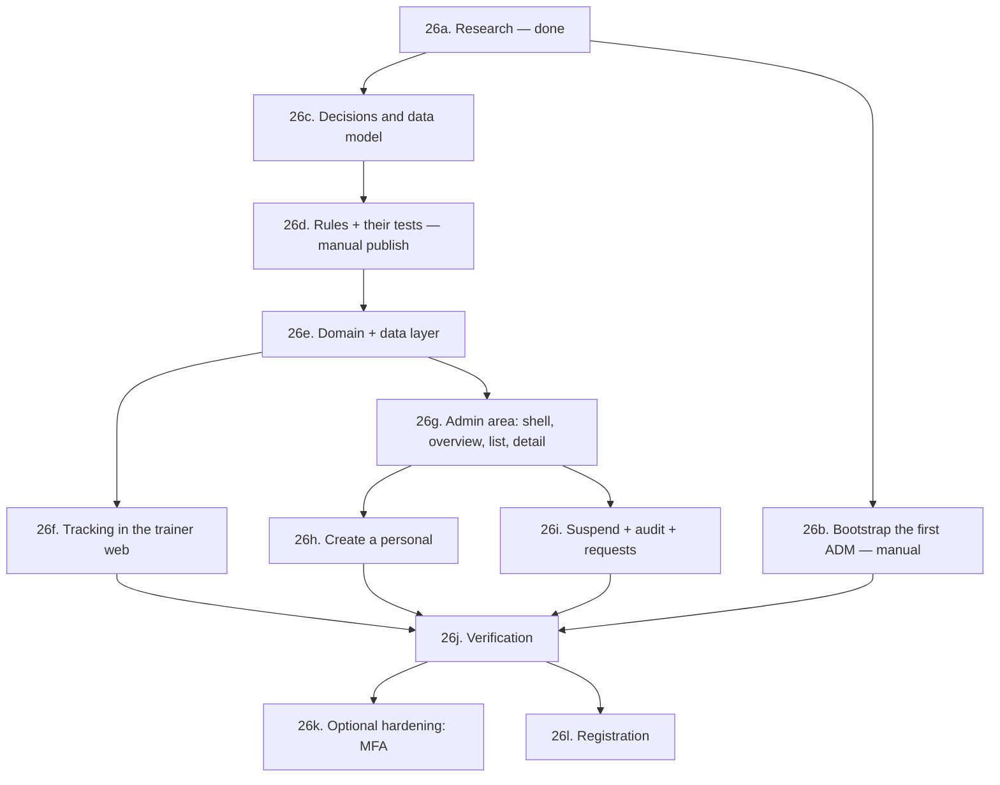
```mermaid
flowchart TD
    A[26a. Research — done] --> B[26b. Bootstrap the first ADM — manual]
    A --> C[26c. Decisions and data model]
    C --> D[26d. Rules + their tests — manual publish]
    D --> E[26e. Domain + data layer]
    E --> F[26f. Tracking in the trainer web]
    E --> G[26g. Admin area: shell, overview, list, detail]
    G --> H[26h. Create a personal]
    G --> I[26i. Suspend + audit + requests]
    F --> J[26j. Verification]
    H --> J
    I --> J
    B --> J
    J --> K[26k. Optional hardening: MFA]
    J --> L[26l. Registration]
```

Suggested: opus · high — the module mixes security rules, auth flows and a new area on a live site; the rules (26d) and the create/suspend flows (26h–26i) are where a mistake is expensive, the pages are medium.

**26a. Research — what the platform allows (checked 2026-10-01)**

Suggested: sonnet · medium — already done; kept so the decisions can be re-read, not repeated.

- [x] Creating the first ADM: Firebase console → Authentication → Users → *Add user* creates an e-mail/password
      account with the password you type (Email/Password is already enabled — the site logs in with it);
      Firestore console writes bypass the rules, which is why the role document can be created there. Nothing
      in the client SDKs can mint a role (the rules deny it) and there is no custom-claims setup in this project
      (roles live in `users/{uid}.role`, read by `resolveProfile` and by `isAdmin()`).
- [x] Creating users from client code without losing the current session: the documented method is
      `createUserWithEmailAndPassword`, which signs the new user in on **that Auth instance**; the established
      pattern is a **second app** — `initializeApp(config, "name")` → `getAuth(secondary)` → create → `signOut`
      → `deleteApp`. (<https://firebase.google.com/docs/auth/web/manage-users> for the methods; the secondary-app
      pattern is community-established, not a documented recipe — hence the manual verification in 26j.)
      Disabling a user is **not** on the client SDK (Admin SDK only); deleting needs a recent sign-in.
- [x] Auth quotas (<https://firebase.google.com/docs/auth/limits>): Spark — password-reset e-mails **150/day**,
      verification e-mails 1,000/day; new accounts **100/hour per IP**; registered users unlimited.
- [x] MFA (<https://firebase.google.com/docs/auth/web/totp-mfa>): TOTP (authenticator app) needs the **Identity
      Platform upgrade** (a free switch; Spark projects capped at 3,000 daily active users), the modular Web SDK
      ≥ 9.19.1 (the site has 12.x), and a **verified e-mail** on the account; enabling TOTP is done through the
      Admin SDK/REST per the doc (check the console toggle first). Sign-in then throws
      `auth/multi-factor-auth-required` → `getMultiFactorResolver` → `assertionForSignIn`. SMS MFA needs Blaze —
      not an option.
- [x] Firestore aggregation (<https://firebase.google.com/docs/firestore/query-data/aggregation-queries>):
      `getCountFromServer`, `getAggregateFromServer` with `sum()` / `average()`; they honour filters, bill far
      fewer reads than fetching the documents, and rely on the indexes the query already uses — **verify at
      implementation** whether a `sum` with an equality filter asks for a composite index (the SDK error carries
      the console link; creating it would be a `(manual)` step). The plan avoids the question by reading
      summary documents instead of summing payments.
- [x] Rules limits (<https://firebase.google.com/docs/firestore/quotas>): at most **10** `get()/exists()/
      getAfter()` per single-document or query request, **20** for batched writes/transactions, and the same
      document fetched twice **counts twice**. `isOwningTrainer` already costs one `get` per call (via
      `myRole()`); the suspension check must reuse that single fetch (26d), never add a second one.
- [x] The phone's ADM dashboard already does: counts (`users where role == 'TRAINER'`), a trainer list, promote by
      UID (`set(merge)` of `{ role: 'TRAINER', name }`), and the `trainerRequests` accept/reject — the web console
      mirrors those capabilities (same writes, so the two stay interchangeable) and adds what the phone lacks.
- [ ] **(manual)** Firebase console → App Check → APIs: note whether **Authentication** enforcement is on (it is
      not required today). If it is, the secondary app in 26h must initialise App Check too, with the same
      reCAPTCHA Enterprise provider. Done when the answer (on/off) is written here.
- [ ] **(manual)** Firebase console → Authentication → Templates: set the **password-reset** template to
      Portuguese with a sentence that explains it is the trainer's first access ("Defina sua senha para entrar no
      ALLU personal"). Done when a test e-mail reads right and lands outside spam on a Gmail and an Outlook
      address.

**26b. Bootstrap the first ADM account — manual, can be done today**

Suggested: haiku · low — a checklist for the trainer (the account owner), nothing for code to do.

- [ ] **(manual)** Use an e-mail you control and read often, **not** an address already used as a personal or a
      student (one account = one role). A dedicated address is safest; the same inbox receives password resets.
      Pick a long, unique password (a password manager's) — it is typed once, in the next step.
- [ ] **(manual)** Firebase console → project → **Authentication → Users → Add user** → e-mail + password →
      *Add user*. Copy the **User UID** shown in the table (a ~28-character string). Done when the user appears
      in the list.
- [ ] **(manual)** Firebase console → **Firestore Database → Data** → collection `users` → *Add document* →
      **Document ID = the UID pasted exactly** (not auto-ID) → fields: `role` (string) = `ADM`, `name` (string) =
      your name, `email` (string) = the same e-mail, `createdAt` (number) = a Unix time in milliseconds (any
      current value, e.g. `1790000000000`). Do **not** add `trainerId`. Done when the document exists under that
      exact ID and `role` reads `ADM` in capitals.
- [ ] **(manual)** Check it works: on the phone the app opens the ADM dashboard; on the site, `/entrar` signs in
      and — until 26g ships — lands on `/app` (the trainer area, empty for an ADM). That landing is correct for
      now. Done when one of the two shows you signed in as an ADM.
- [ ] **(manual)** Make the account recoverable and not single-point: confirm the reset e-mail reaches the inbox
      ("Esqueci minha senha" on `/entrar`), and create a **second ADM** the same way with another e-mail you
      control (a partner, a backup address). Only the console can mint an ADM, so losing the only one means
      doing it by hand again — easy, but better not at 2 a.m. Done when both can sign in.

**26c. Decisions and the data model — written down before any code**

Suggested: sonnet · medium — the decisions are already argued above; this fixes names and shapes so the rules
and the code agree.

- [ ] Record, in this section or `CLAUDE.md`'s web section, the settled decisions with their reasons:
      **(1)** the admin pages read only *counts* the rules already allow plus **self-reported summaries**
      (`trainerStats`, `trainerActivity`) — never a student's document; **(2)** "cobrando" = what the personal
      charges his students; **(3)** suspension is `accessStatus` enforced by rules, with the Auth account
      untouched, and students keep access; **(4)** onboarding has three doors — create an account (26h),
      approve a `trainerRequests` entry, promote by UID — all producing the same `users/{uid}` shape; **(5)**
      every ADM action is appended to an audit log; **(6)** no new npm dependency. Done when written.
- [ ] The documents (all keys listed so the rules can allow-list them; a missing optional field reads as its
      default, as everywhere in `data/converters.ts`):
      - `users/{uid}` for a trainer: `role: 'TRAINER'`, `name`, `email`, `createdAt` (ms), `createdBy` (the ADM's
        uid, when created from the console page), `accessStatus` (`'active' | 'suspended'`; **missing = active**),
        `suspendedAt` (ms) and `suspendedReason` (string, ≤ 200) — written only by an ADM.
      - `trainerStats/{trainerId}`: `trainerId`, `updatedAt`, `lastSeenAt`, `students` `{ total, linked, pending }`,
        `sessions7d`, `adherence28d` (number 0–1 or null), `quiet` (count), `pendingAssessments` (count),
        `billing` `{ month: 'YYYY-MM', activePlans, planCents, expectedCents, receivedCents, overdueCents }`. These
        are exactly the figures `dashboardFigures` (`web/src/domain/dashboard.ts`) and the trainer snapshot already
        compute on `/app`, so writing them costs nothing new to compute.
      - `trainerActivity/{trainerId}_{YYYY-MM}`: `trainerId`, `month`, `updatedAt`, `actions` — a map of integer
        counters (`login`, `studentCreated`, `inviteGenerated`, `fichaSaved`, `geminiGenerated`, `chargePaid`,
        `bookingAdded`, `measurementAdded`, `assessmentRequested`) — and `activeDays`, an array of
        `'YYYY-MM-DD'` strings (the trainer's local days with any action; ≤ 31 per month).
      - `adminAudit/{autoId}`: `at` (ms), `adminUid`, `action` (`trainer.create | trainer.suspend |
        trainer.reactivate | trainer.promote | request.reject | trainer.resetEmail`), `targetUid`, `note`
        (≤ 200). Append-only.
- [ ] The metric definitions (pure, in `domain/adminMetrics.ts`, so every screen says the same thing): **uso**
      — *Ativo* (last seen ≤ 7 days), *Quieto* (8–30), *Sumido* (> 30), *Nunca entrou* (no `lastSeenAt`);
      **ações em 30 dias** — the sum of the counters of the months a 30-day window touches (month buckets, so
      "last 30 days" is approximate at the edges and says so); **dias ativos em 30 dias** — the count of
      `activeDays` inside the window; **ticket médio** — `planCents / activePlans`; **taxa de recebimento do
      mês** — `receivedCents / expectedCents` (blank when expected is 0); **dado desatualizado** — a summary
      older than 14 days is flagged, never hidden.

**26d. Rules — the riskiest part; every change tested and seen failing first**

Suggested: opus · xhigh — authorisation changes on a live database shared with the phone; a hole here is a
privilege escalation, a mistake there locks every trainer out. Not safely retryable: the file is published by hand.

- [ ] `isOwningTrainer(trainerId)` (`firestore.rules`): keep it to **one** `get()` of the caller's `users` doc
      and check both facts from it — `role == 'TRAINER'` **and** `accessStatus != 'suspended'` (missing =
      active) — instead of calling `myRole()` and then fetching again. Done when the number of `get()`s on every
      existing rule path is unchanged (read each `allow` that reaches `isOwningTrainer` and count; the limit is
      10 per request, repeats count twice) and all 76 existing emulator tests still pass untouched.
- [ ] `users/{uid}`, the **self-update branch**: add `accessStatus`, `suspendedAt`, `suspendedReason`, `createdBy`
      and `plan` to the fields a caller may not change on their own document (the same pattern `canSelfAssess`
      and `canAddSets` use). **Without this a suspended trainer un-suspends themselves** — the first new test
      below exists to prove it. The invite-claim `grantsNoPermissions` stays as is (a claim never carries these).
- [ ] `trainerStats/{trainerId}`: `read` by `isAdmin()` or `isOwningTrainer(trainerId)`; `create`/`update` only by
      `isOwningTrainer(trainerId)` with the key set allow-listed and typed (`trainerId == the path`, ints ≥ 0,
      `adherence28d` null-or-0..1, `billing.month` a `YYYY-MM` string); `delete` by `isAdmin()` only.
- [ ] `trainerActivity/{id}`: same read; write by `isOwningTrainer(request.resource.data.trainerId)` with
      `id == trainerId + '_' + month`, `actions` keys allow-listed and every counter an int ≥ its previous value
      on update (monotonic — a counter can't be rewound), `activeDays` ≤ 31 strings; `delete` by `isAdmin()`.
- [ ] `adminAudit/{id}`: `create` and `read` by `isAdmin()` only, `adminUid == request.auth.uid`, `at` an int,
      `action` in the allow-list; **no `update`, no `delete`** (append-only).
- [ ] Tests (`web/rules/firestore.rules.test.ts`, plus `dataLayer.test.ts` for the functions of 26e): a suspended
      trainer is **denied** on a matrix of every trainer-owned collection (read and write on `students`,
      `workouts`, `schedules`, `biometrics`, `payments`, `billingPlans`, `invites` create, `trainerStats`,
      `trainerActivity`) and **still allowed** to read their own `users` doc (so the app can say why); a trainer
      **cannot** set their own `accessStatus` back to `active` (nor create the field on a doc that lacks it); an
      ADM can suspend and reactivate; a student of a suspended trainer **still reads their assigned workouts and
      writes their own logs** (decision 3); a trainer cannot write another trainer's `trainerStats` or
      `trainerActivity`; an ADM cannot write them either (counters are the trainer's own); a trainer cannot read
      another's stats; `adminAudit` accepts an ADM's create, rejects a trainer's and any update/delete; the stats
      shape tests reject a float cents value and a missing key. Then **run the new tests against the old rules**
      (`RULES_FILE=<origin/main copy> npm run test:rules`) and record that the "rejects X" ones fail there — the
      repository's rule: `assertFails` passes on any failure.
- [ ] **(manual)** Publish the updated `firestore.rules` (diff first against what is live; `main`'s copy is the
      live one). Until then the admin pages show permission errors and trainers' tracking writes fail silently.
      Done when a trainer's `/app` visit creates a `trainerStats` document in the console.

**26e. Domain and data layer**

Suggested: sonnet · high — pure functions and thin Firestore wrappers with many edge cases (dates, buckets,
defaults); correctness is cheap to test and expensive to discover on the live site.

- [ ] `web/src/domain/activity.ts` (+ test): `ActivityKind` (the nine counters), `emptyActions()`,
      `monthOf(day)`, `activityDocId(trainerId, month)`, `shouldWriteLastSeen(lastWrittenMs, nowMs)` (throttle:
      at most once per 10 minutes) — pure, no storage, no clock.
- [ ] `web/src/domain/adminMetrics.ts` (+ test, boundary cases for each definition in 26c): `usageStatus`,
      `actionsInWindow`, `activeDaysInWindow`, `averageTicketCents`, `collectionRate`, `isStale`, the row type
      the list renders, and `trainersCsv(rows)` — quotes and doubled quotes escaped, and **a cell starting with
      `=`, `+`, `-`, `@` or a tab is prefixed with `'`** so a trainer named `=HYPERLINK(...)` cannot run in a
      spreadsheet.
- [ ] `web/src/data/converters.ts`: `toTrainerUser`, `toTrainerStats`, `toTrainerActivity`, `toAuditEntry` —
      lenient like the rest (missing field → default; an unknown `accessStatus` reads as active; a malformed
      document → `null`, filtered out). Extend `Profile` in `data/session.ts` with `accessStatus` so the session
      knows a trainer is suspended.
- [ ] `web/src/data/admin.ts`: `loadTrainers(db)` (`users where role == 'TRAINER'`), `loadTrainerStats(db)`,
      `loadActivity(db, trainerId, months)`, `countLinkedStudents(db, trainerId)` (`getCountFromServer`, `role ==
      'STUDENT'` + `trainerId`), `loadTrainerRequests(db)`, `setAccessStatus(db, adminUid, trainerUid, status,
      reason)`, `promoteToTrainer(db, adminUid, uid, name)` (the phone's `set(merge)` write, plus `createdBy`),
      `rejectRequest(db, adminUid, uid)`, and `recordAudit(...)`. Every mutating function writes its audit entry
      in the **same batch**, so an action without its record cannot happen.
- [ ] `web/src/data/activity.ts`: `trackActivity(db, trainerId, kind, now, timeZone)` — one `setDoc(..., { merge:
      true })` on the month document with `increment(1)` on `actions.<kind>` and `arrayUnion(day)` on
      `activeDays`; **never throws** (a failed counter must not fail the action it counts) and returns
      nothing the caller needs. `writeTrainerStats(db, trainerId, figures, snapshot, now)` builds the document
      from what `/app` already loaded.
- [ ] Data-layer tests (`web/rules/dataLayer.test.ts`, emulator): the counters accumulate across calls and
      across a month boundary; `trackActivity` swallows a permission error; `setAccessStatus` writes the audit
      entry atomically; `loadTrainers` returns only trainers; `countLinkedStudents` counts only that trainer's
      linked students. Done when `npm run test:rules` and `npm test` pass.

**26f. Tracking in the trainer's web session**

Suggested: sonnet · medium — one-line calls at known success points, plus the summary write on the dashboard.

- [ ] On `/app` (the "Hoje" dashboard, which already loads the snapshot): once per browser session record
      `login` (guard with a `sessionStorage` flag), set `lastSeenAt`, and write `trainerStats` — throttled with
      `shouldWriteLastSeen` so reloading does not write every time. The numbers are those `dashboardFigures`
      returns; `billing.activePlans`/`planCents` come from `snapshot.plans`.
- [ ] One `trackActivity` call, on the success path only, in each handler: student drafted
      (`studentCreated`), invite generated (`inviteGenerated`), ficha saved (`fichaSaved`, counted per ficha, so
      a 3-treino import adds 3), charge marked paid (`chargePaid`), booking added (`bookingAdded`), measurement
      added by the trainer (`measurementAdded`), self-assessment requested (`assessmentRequested`), Gemini
      generation succeeded (`geminiGenerated` — which also tells the ADM who is spending the project's free AI
      quota). Done when each, exercised in the browser against the emulators, increments the right counter and
      today's day appears in `activeDays`.
- [ ] A transparency line in the trainer area's footer: "O uso do site é contabilizado de forma agregada
      (quantidade de ações e dias de uso) para a administração da plataforma; nenhum dado de aluno é incluído."
      Done when it shows on `/app`.

**26g. The admin area: shell, overview, directory, detail**

Suggested: sonnet · high — a new route group with its own guard, and several data-heavy pages that must stay
readable on a phone (the ALLU rules: ≥ 44px controls, `table.stack`, no horizontal overflow).

- [ ] Routing: add `"/admin"` to `Area` and `destinationFor` — **an ADM now goes to `/admin`** (update the tests
      in `web/src/data/session.test.ts` that pin ADM → `/app`, and the comment that explains the old choice);
      `RequireArea` accepts `"/admin"`; `web/src/app/admin/layout.tsx` wraps `AppShell` (extend `AppShell`'s
      `area` to `"admin"`, `data-area="admin"` in the CSS) with the navigation *Visão geral · Personais ·
      Solicitações · Minha conta* (new icons in `_shared/icons.tsx`: a shield and a team); route titles via
      `metadata` as the other areas do. An ADM opening `/app` is sent back to `/admin`.
- [ ] `/admin` — **Visão geral**, in the ALLU template's language (the `dl.figures` strip and quiet lists, not
      a wall of cards): personais cadastrados (ativos / suspensos), alunos conectados (the sum of the count
      queries), personais ativos nos últimos 7 dias, solicitações pendentes, and — from the summaries, labelled
      "n de N personais com resumo recente" — cobrança prevista / recebida / em atraso do mês. Below: **Atenção**
      (personais *Sumidos* or *Nunca entraram*, summaries older than 14 days, overdue amounts above a threshold
      that is a constant at the top of `adminMetrics.ts`), **Uso do mês** (top personais by actions, Gemini
      generations per personal), and a **Links úteis** list (Firebase console, Google AI Studio's rate-limit
      page, the live site). Done when every number on the page can be traced to a document or a count query.
- [ ] `/admin/personais` — the directory: name, e-mail, **status** (Ativo / Suspenso), **uso** (the four labels),
      alunos, última visita, ações em 30 dias, cobrança do mês (previsto · recebido), "resumo de dd/mm"; search by
      name or e-mail, filter by status and by uso, sort by any column; each row a link to the detail; a button
      **Exportar CSV** (`trainersCsv`). The whole row is the tap target on a phone, as in the students'
      directory.
- [ ] `/admin/personais/detalhe?id=` — one personal: identity (name, e-mail, `createdAt`, `createdBy`), the status
      controls of 26i, **alunos** (the live count next to the reported one, so a drift is visible), **atividade**
      (a table by month of every counter, and a 30-day strip — `<ol>` of 30 marked squares with the day and the
      count in `title` and in text for screen readers), **cobrança** (planos ativos, ticket médio, previsto /
      recebido / em atraso, taxa de recebimento, and "resumo atualizado em dd/mm hh:mm" with the stale flag), and
      the audit entries for this personal. Done when each block renders with no data (a brand-new trainer) as an
      honest "ainda sem dados", not zeros that look like facts.
- [ ] `/admin/conta` — the ADM's own page: the signed-in e-mail, a button that sends *me* a password-reset
      e-mail, how many ADMs exist (`users where role == 'ADM'` count), and — when 26k ships — the MFA status.
- [ ] Layout checks as in the ALLU visual pass: `tsc`, `eslint`, no horizontal overflow at 335 / 390 / 600 / 768 /
      834 / 1024 / 1440 px on every `/admin` route (the iframe probe used before), and the page titles read
      "<página> — ALLU personal".

**26h. Create a personal from the console**

Suggested: opus · high — handles credentials, two systems (Auth and Firestore) that can half-succeed, and a
second app instance; the failure paths are the point.

- [ ] `/admin/personais/novo`: name, e-mail (and an optional phone). On submit, in this order: **(1)** build a
      random 20-character password from `crypto.getRandomValues` (never shown, never stored); **(2)**
      `initializeApp(config, "admin-create-trainer")` with the same `firebaseConfig` — and, **when running on the
      emulators, `connectAuthEmulator` on that second Auth instance too** (or the call goes to production);
      initialise App Check on it only if the 26a manual check found Authentication enforcement on;
      **(3)** `createUserWithEmailAndPassword` there, then `signOut` and `deleteApp` in a `finally`; **(4)** with
      the **primary** session, create `users/{newUid}` = `{ role: 'TRAINER', name, email, createdAt,
      createdBy: adminUid, accessStatus: 'active' }` and the `trainer.create` audit entry in one batch; **(5)**
      `sendPasswordResetEmail(email)` so the trainer sets their own password. The ADM stays signed in throughout.
- [ ] Failure handling, each with a message and a test where it can be tested: `auth/email-already-in-use` →
      "esse e-mail já tem uma conta" with the two ways forward (promote it by UID on the requests page, or use
      another e-mail); `auth/weak-password`/`invalid-email` can't happen with the generated password and the
      form's own validation; **step 4 failing after step 3 succeeded** leaves an Auth account with no `users`
      document (which the site reads as an unclaimed student) — the page must keep the new UID on screen and
      offer **"Concluir cadastro"**, which retries only step 4 (idempotent: `set` with the same data), so an
      orphan is never silently left behind; **step 5 failing** is not fatal — the personal exists, the page says
      so and offers **"Reenviar e-mail de senha"** (also available on the detail page). Rate limits (100 accounts
      per hour per IP, 150 reset e-mails per day) are shown as a plain message.
- [ ] Fallback for a trainer who never receives the e-mail: an explicit, opt-in **"Gerar senha temporária"** on
      the detail page of a personal the ADM just created — it shows a random password **once** (copy button,
      cleared on leaving the page, never stored) and records `trainer.resetEmail`-style audit text; it exists
      because a reset e-mail in a spam folder is the most likely onboarding failure. Implemented only if the
      reset e-mail test of 26a (manual) shows it is needed; otherwise skipped and noted here.
- [ ] **E-mail quality (GOALS.md §27):** the form's e-mail field runs `validateEmail` from
      `domain/emailPolicy.ts` (§27d) — syntax, the "você quis dizer…?" typo hint, throwaway domains — if §27d
      has landed; a typo here costs a day of "I never got the e-mail". No `email_verified` gate applies to a
      personal created this way: the reset link they must click is the proof the address is theirs (§27b).
- [ ] Test the whole flow against the Auth + Firestore emulators in the browser (a throwaway e-mail, then sign in
      as the new trainer from a private window with the password from the emulator's reset link) and record the
      result here. Done when the new trainer lands on `/app`, and the ADM was never signed out.

**26i. Suspend, reactivate, audit, requests**

Suggested: opus · high — the enforcement is in the rules (26d), but the flows and the suspended-account
experience are what a real person meets; getting the wording and the guards right matters.

- [ ] On the detail page: **Suspender acesso** (asks for a short reason, ≤ 200 characters, then a
      "Deseja suspender?" Sim/Não using `_shared/ConfirmDialog.tsx`) and **Reativar acesso**; both go through
      `setAccessStatus` (audit in the same batch). An ADM cannot suspend an ADM or themselves (the button is
      absent, the function refuses, and the rules need no special case because only a `TRAINER` is ever
      suspended in the UI). Done when suspend → the trainer's very next request fails and reactivate → works.
- [ ] The suspended trainer's experience: `resolveProfile` carries `accessStatus`; `destinationFor` sends a
      suspended TRAINER to `/entrar`, which shows "Sua conta de personal está suspensa. Fale com o administrador."
      and **Sair** (the existing `role: NONE` message pattern) — never a blank screen or a wall of permission
      errors. A trainer already inside a session is bounced at the next `RequireArea` check, and any in-flight
      write fails with the plain "Não foi possível salvar" the pages already show. Add the matching test to
      `session.test.ts`.
- [ ] `/admin/solicitacoes`: the `trainerRequests` queue (e-mail, date) with **Aprovar** (the same `set(merge)`
      the phone does — `role: 'TRAINER'`, `name` from the e-mail's local part, editable before confirming —
      then deletes the request, with a `trainer.promote` audit entry) and **Recusar** (`request.reject`), each
      behind the Sim/Não dialog; plus **Promover por UID** (the phone's fallback) for an existing account that
      never made a request. Done when approving makes that person a trainer on their next sign-in.
- [ ] The audit history: a list of the latest 50 `adminAudit` entries on the overview ("Atividade da
      administração": quem fez o quê, quando) and the per-trainer filter on the detail page. Read-only.

**26j. Verification**

Suggested: sonnet · high — mostly running and reading, with manual judgement on the live site.

- [ ] Seed script: extend `web/scripts/seed-emulators.mjs` with an ADM account (`admin@teste.dev`, role `ADM`),
      a second trainer with students, and `trainerStats`/`trainerActivity` documents with a spread of states
      (active, quiet, away, never seen, suspended, stale summary, overdue) so every admin screen has something
      honest to show; keep the script's header comment in step.
- [ ] Run `tsc`, `eslint`, `vitest`, `npm run test:rules` (Java 21) and the static build with
      `NEXT_PUBLIC_BASE_PATH=/Personal_app_android`. Done when all are green and the "seen failing on the old
      rules" run of 26d is recorded.
- [ ] Browser, against the emulators: ADM login → `/admin`; every page above on desktop, tablet and phone widths
      with the overflow probe; create a personal (26h) and sign in as them; they work in `/app` and the
      counters move; the ADM suspends them → their next action fails and they see the suspended message;
      reactivate → works; a trainer opening `/admin` is sent to `/app`; a student opening it to `/aluno`; an ADM
      opening `/app` is sent to `/admin`; keyboard-only through the create form and the suspend dialog.
- [ ] **(manual)** On the live site, after the rules are published: sign in as the ADM; create a real test
      personal with a throwaway address and confirm the reset e-mail arrives and works; sign in as them, do a
      few things, and watch the counters appear on `/admin`; suspend and reactivate; confirm Android's ADM
      dashboard still works with the same account. Record anything that surprised you here.

**26k. Optional hardening — MFA for the ADM account**

Suggested: opus · high — touches the login page that every user passes through; a regression locks people out.

- [ ] **(manual)** Decide whether to enable it now. It is recommended once real trainers' data is on the
      platform, costs nothing, and adds one authenticator-app code at each ADM sign-in. Steps for the trainer: in
      the console, upgrade Authentication to **Identity Platform** (free switch), enable **TOTP**, and verify the
      ADM's e-mail (send the verification mail from `/admin/conta`).
- [ ] Code (only if enabled): on `/admin/conta` an **enrol** flow (`TotpMultiFactorGenerator.generateSecret` →
      QR/URI → confirm a code → `assertionForEnrollment`); on `/entrar` handle `auth/multi-factor-auth-required`
      with `getMultiFactorResolver` + a code field + `assertionForSignIn` — for **any** account that has it, so
      nothing here may change the path of users without MFA. Unit-test the error→resolver branching with a fake
      error; test the happy path by hand (an authenticator app on a phone). Done when an ADM with MFA signs in
      only with the code and a trainer without MFA signs in exactly as before.

**26l. Registration**

Suggested: haiku · low — documentation and index edits, fully specified.

- [ ] `CLAUDE.md` web section: the `/admin` area (guard, nav, why the ADM no longer lands on `/app`), the three
      new collections and what writes them, the **suspension semantics** (flag + rules, Auth untouched, students
      keep access, frozen against self-writes), the **secondary app pattern** and its emulator caveat, and that
      the admin pages deliberately read no student document. `web/README.md`: the routes table and the "first
      ADM" steps from 26b.
- [ ] `store-listing/privacy-policy.md`: a paragraph that the platform operator sees, per personal, aggregate
      counts (alunos, ações, dias de uso, resumo de cobrança) and never a student's data from the admin pages;
      the pre-existing fact that an ADM *can* read every `users` document is stated, not hidden. `(manual)` —
      the trainer reviews and decides the wording. Done when the file says it and the trainer has read it.
- [ ] GOALS.md: tick items with what was actually verified and what was not (as the earlier sections do), commit
      each verified item on its own, never push without being asked.
- [ ] Done-when for the whole section: the ADM signs in on the **live** site, lands on `/admin`, sees the real
      trainers with their counts and activity, creates a personal who then signs in and works, and suspends and
      reactivates one — with the audit trail showing it. Not done when the code exists.

---

## 27. Feature — Require a verified e-mail before an account gets a profile
(2026-10-01, via `/newgoal`)

**The request:** "O nosso sistema atual recebe qualquer tipo de email falso, consegue exigir apenas emails
válidos? pense em alguma forma de executar isso e me retorna, se achar solução implemente no goals."

**Goal type: Feature** — a hardening of two flows that already work (student sign-up on `/convite`, and the
rules behind it). Research is done (2026-10-01) and recorded in 27a.

**The short answer.** Today **yes, any fake address gets in** — checked in the code, not assumed: the invite page
calls `createUserWithEmailAndPassword(auth, email.trim(), password)` and goes straight on to claim the invite;
the only check is the browser's `<input type="email">` (`a@b` passes); nothing anywhere calls
`sendEmailVerification` (no match in `web/` or `app/`); and `firestore.rules` never looks at
`request.auth.token.email_verified`. Firebase itself checks *syntax only* — it cannot know whether a mailbox
exists. **Yes, it can be required, and there is exactly one thing that proves an address is real: send a link
to it and have its owner click.** That is Firebase's *verified e-mail*. The plan makes **the rules** refuse a
profile to any account whose address is not verified — enforcement on the server side, because anything done
only in the page can be skipped by calling the Auth API directly (the Firebase API key is public by design, so
anyone can create an Auth account without ever opening the site). The page work (27d–27e) is the friendly side
of that: tell the person to check their inbox, and catch typos and throwaway domains *before* they cost a day.

**What "valid" can honestly mean here (three layers, each with its limit):**
1. **Looks like an address** (stricter than the browser) and **is probably not a typo** (`gmial.com` →
   "você quis dizer gmail.com?") — client only, a courtesy, bypassable.
2. **Not a known throwaway domain** (mailinator & co.) — client only, a short list, never complete; verification
   does *not* stop these (a throwaway inbox receives the link too), which is why the list exists at all.
3. **The owner of the mailbox confirmed it** — enforced in `firestore.rules`. This is what turns a typo
   (`ana@gmail.con`, `ana@gmial.com`) or an invented address into an account that **can never claim an invite**:
   the link goes nowhere, so the claim is refused. It also stops someone claiming an invite under *another
   person's* address.

**What exists today (so the plan does not rebuild it):**
- Web: `web/src/app/convite/InviteClaim.tsx` (create account or sign in → `claimInvite` →
  `/aluno`), `web/src/data/invites.ts` (the claim transaction; maps `permission-denied` to "Esta conta já está
  vinculada a um perfil existente" — which would be a *wrong* message for an unverified account),
  `web/src/data/authErrors.ts`, `web/src/data/session.ts` (`Session.signedIn` has `uid`/`email`/`profile`, no
  verified flag), `SessionProvider.tsx` (`refresh()` re-reads the profile for `auth.currentUser`).
- Rules: a student's profile is created by the invite claim (`users/{uid}` create, plus the re-claim *update*
  for an account that already has a role-less doc); `trainerRequests/{uid}` is `allow create: if isSignedIn() &&
  request.auth.uid == uid` — **any** signed-in account, including a fake one, can queue a "promote me" request
  that the ADM then sees. Rules tests build users with `env.authenticatedContext(uid)` (no token claims).
- Android: `AuthRepository.register` creates the account and logs in; `claimInvite` and `requestTrainerAccess`
  follow; no verification. The rules are shared by every client, which is why Android is a module here (27g).
- Auth quotas (<https://firebase.google.com/docs/auth/limits>): Spark — address-verification e-mails
  **1,000/day**, password-reset e-mails 150/day (separate counter), and **150 requests per IP per hour** for
  verification. Plenty for a personal-trainer platform; the Resend button gets a cooldown anyway.

**What the research changed (five lines):**
1. **The gate goes on the *entry doors*, not on everything.** Verified e-mail is required to **create** a
   student profile (invite claim), to **re-claim** one, and to **queue a trainer request**. It is *not*
   required for anything an existing account does day to day — students who already have a profile (and no
   verified e-mail, because nobody ever asked) keep working untouched ("grandfathered"); locking them out
   would be the worst possible rollout.
2. **The token is the catch.** `request.auth.token.email_verified` is read from the ID token, which only
   changes when the token is **refreshed** — clicking the link in the mail does not update the page that is
   open. The page must `user.reload()` and then `getIdToken(true)` *before* retrying the claim, or the rules
   still see `false` and the student is refused although they did everything right. This is the one subtle
   thing in the whole section and gets its own test (27i).
3. **Verification happens wherever the link is opened** (often the phone's mail app, while the form is on a
   laptop), so the waiting screen needs "Já confirmei" plus an automatic re-check when the tab regains focus.
4. **Trainers created by the ADM (§26h) need no gate:** their role comes from the ADM's decision, and the
   password-reset link they must click to set a password is itself proof the mailbox is theirs. Only the ADM's
   form gets the layer-1/2 checks (typo hint, throwaway domains), because a typo there costs a day.
5. **Bots are a separate problem, and a bigger switch.** Unverified accounts that anyone can still create
   through the Auth API stay *empty* (no profile, no request, no data — that is what the rules gate buys); they
   only clutter Authentication → Users. Stopping the creation itself means reCAPTCHA Enterprise / App Check
   enforcement for Authentication, which needs the Identity Platform switch that §26k also needs — recorded as an
   optional decision (27h), not built.

**Not touched by this section (explicit, to stop scope creep):** phone/SMS verification (needs billing); e-mail
link (passwordless) sign-in (5 e-mails/day on Spark — unusable); deleting orphan unverified Auth accounts (Admin
SDK — a by-hand console job if it ever matters); a change-e-mail feature (none exists; if one is ever added it
must use `verifyBeforeUpdateEmail`, never a plain update); a custom sender domain/SMTP for the verification mail
(needs a domain — deferred; the page tells people to look in the spam folder instead); gating `invites` *reads*
(the 8-hex-character code is the secret and a throwaway mailbox could be verified anyway — revisit only if abuse
is seen); making existing students verify (a soft nudge is offered in 27e, nothing forced).

**Where this executes:** `web/` and `firestore.rules` on `main`, branch + PR (CI gates lint, tests, build and the
emulator rules tests). **Rollout order matters and is the whole risk:** the page work ships first (it behaves
the same under old and new rules), Android parity (27g) second *if* its student path is live, and the
**`firestore.rules` publish is last and by hand** (console copy-paste or `firebase deploy --only
firestore:rules`, diffed against what is live). Publishing the rule before the page ships makes every new
student's claim fail with a misleading message. **§26d also edits `firestore.rules`** (suspension check): if both
sections are in flight, merge one, rebase the other, and publish **one** combined file — never two overlapping
copies.

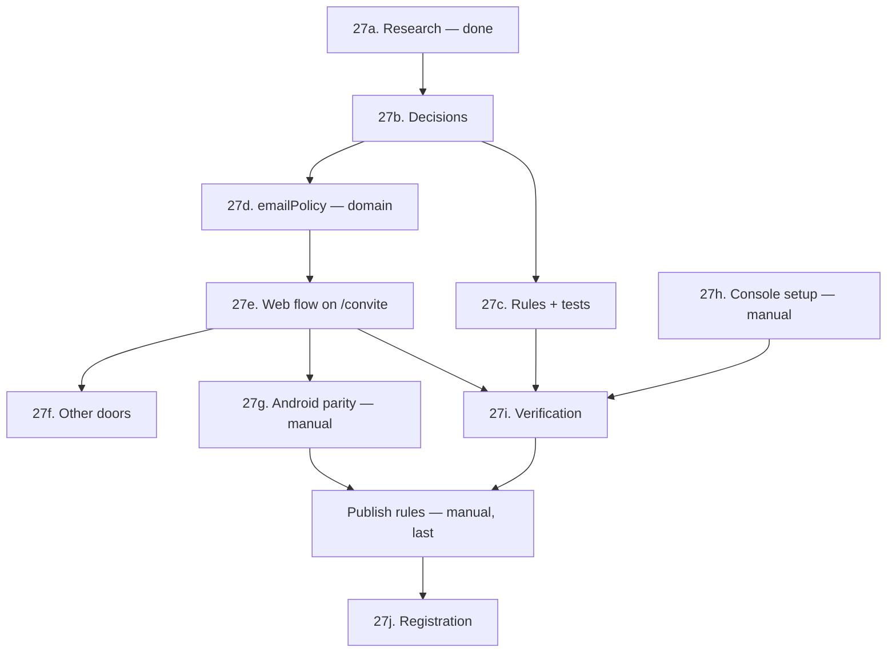
```mermaid
flowchart TD
    A[27a. Research — done] --> B[27b. Decisions]
    B --> C[27c. Rules + tests]
    B --> D[27d. emailPolicy — domain]
    D --> E[27e. Web flow on /convite]
    E --> F[27f. Other doors]
    E --> G[27g. Android parity — manual]
    H[27h. Console setup — manual] --> I[27i. Verification]
    C --> I
    E --> I
    I --> P[Publish rules — manual, last]
    G --> P
    P --> J[27j. Registration]
```

Suggested: opus · high — a security rule on a live site with a token-timing trap and a rollout order; the rules (27c) are the expensive part, the page and the policy are ordinary work.

**27a. Research — what the platform allows (checked 2026-10-01)**

Suggested: sonnet · medium — already done; kept so the decisions are not looked up twice.

- [x] The check Firebase can enforce: `request.auth.token.email_verified` — "true if the user has verified they
      have access to the e-mail address" (<https://firebase.google.com/docs/rules/rules-and-auth>); accounts
      created with e-mail + password start unverified; `sendEmailVerification(user)` sends the link
      (<https://firebase.google.com/docs/auth/web/manage-users>) and accepts a continue URL back to the site.
      The docs do not say the open page's token updates by itself — treated as "it does not" (27e/27i prove it).
- [x] Quotas and limits recorded above (1,000 verification e-mails/day, 150 requests/IP/hour on Spark).
- [x] Server-side alternatives considered and **not** chosen: *blocking functions* (`beforeCreate`, could reject
      domains and even require verification at sign-up) need the Identity Platform upgrade **and** deployed Cloud
      Functions, i.e. the Blaze plan §3 refused; reCAPTCHA Enterprise bot protection for e-mail sign-up is real
      but is a console switch with its own free-tier limits — optional (27h). Rules + the verified-e-mail claim
      cost nothing and need no server.
- [x] Emulator behaviour: the Auth emulator sends no mail; it prints verification links and exposes the pending
      codes on `GET /emulator/v1/projects/{project}/oobCodes` (<https://firebase.google.com/docs/emulator-suite/connect_auth>),
      so a test can fetch a code and apply it (`accounts:update` with the `oobCode`) — 27i's helper.
- [x] Not confirmed and not needed: whether completing a *password-reset* link also flips `emailVerified`.
      The design does not depend on it (trainers are not gated); 27i's live check records what happens.

**27b. Decisions (settled here, so nobody re-argues them mid-build)**

Suggested: sonnet · medium — decisions already made; the item below is the one to confirm.

- [x] **Enforcement is `request.auth.token.get('email_verified', false) == true` in the rules**, in a helper
      `hasVerifiedEmail()` next to `isAdmin()`. It reads the token, **not a document**, so it costs nothing
      against the per-request `get()` limits §26d is careful about.
- [x] **Gated:** `users/{uid}` **create** (invite claim) and the **re-claim update** branch (the self branches
      that edit a profile are untouched); `trainerRequests/{uid}` **create**. **Not gated:** every other write of
      an existing account; the ADM's `isAdmin()` branches; `invites` reads and the invite's `used` flip (it can
      only happen in a batch whose `users` write is gated).
- [x] **Grandfathering:** no existing account is locked out, none is forced to verify. The soft nudge (27e) is
      the only touch.
- [x] **Client courtesy checks are labelled as such** in code comments: `domain/emailPolicy.ts` is a UX nicety,
      never a security boundary; the rules are.
- [x] **(manual)** Confirm the one product choice: new students **must** verify before they get their ficha (the
      plan's default — it is the point of the request). The alternative — let them in and merely nag — is not
      enforceable and is not planned. Done when the trainer has said yes (or changed it) in chat. **Confirmed 2026-10-01** ("minha ideia é essa … quero criar essa caixinha de verificação"); a throwaway
      inbox getting through is accepted.

**27c. Rules and their tests**

Suggested: opus · xhigh — an auth/security change to the one rules file every client shares; a mistake either locks students out or leaves the door open, and publishing is by hand and not testable in CI.

- [x] `firestore.rules`: add `hasVerifiedEmail()` and put it into the **self branch of `users` create** and into
      the **re-claim branch of `users` update** (alongside the existing `isSignedIn() && request.auth.uid ==
      uid`), and into `trainerRequests` **create**. Update the schema comment at the top of the file (one line:
      what is gated and why). Nothing else changes; run the existing suite to prove it. **Done 2026-10-01.**
- [x] `web/rules/firestore.rules.test.ts` and `web/rules/dataLayer.test.ts`: the helpers build users with no
      token claims (`env.authenticatedContext(uid)`, `signedInAs(uid)`) — make the **default verified**
      (`{ email_verified: true }`) so the existing tests keep meaning what they meant, add an explicit
      **unverified** helper, and use it only in the new cases:
      unverified → **create** `users/{uid}` by a valid claim **fails**; unverified → **re-claim update fails**;
      unverified → **create `trainerRequests/{uid}` fails**; the same three **pass** when verified;
      a **grandfathered unverified student** (profile already exists) can still update their own profile, create
      a `workoutLog`, an `assessment` and a biometric, and read their own profile — proving nothing else is
      gated; an unverified user still cannot claim *someone else's* uid (unchanged denial, kept as a regression
      test); `email_verified` **absent** from the token (the old default) is treated as unverified. **Done 2026-10-01:** `as()`/`signedInAs()` are verified by default; `asUnverified`/`asWithoutClaim`
      serve the new cases; "accounts that already exist are not affected" is a describe block of its own
      (unconfirmed student: read, edit, log, assess, measure; unconfirmed trainer: read, grant, invite).
- [x] **Seen failing on the old rules** (CLAUDE.md's discipline — `assertFails` passes on any failure): run
      `RULES_FILE=<origin/main copy of firestore.rules> npm run test:rules`; the three new "unverified is
      refused" tests **must fail** there and pass here, every other test passes on both. Record the counts in
      this item, as §23d/§25 did. **Done 2026-10-01:** against `origin/main`'s copy exactly the 3 new tests fail (claim, re-claim and trainer
      request from an unconfirmed address); the other 80 pass on both files.
- [x] `npm run test:rules` (emulators, Java 21 — see `web/README.md`) green. Done when the file is merged *and
      not yet published*; the publish is its own manual item below. **83/83 on 2026-10-01. Merged: no. Published: no.**
- [ ] **(manual)** Publish the updated `firestore.rules` — **only after 27e is merged and deployed and, if 27g
      applies, the Android change is out** — after diffing against the live copy (CLAUDE.md: never publish
      without a diff). If §26d is also pending, publish the combined file. Then run the live checks in 27i.
      **Order decided 2026-10-01:** merge the PR → wait for the Pages deploy to finish green → publish the rules
      (the Android condition above is waived by the 27g decision). Publishing earlier is harmless to students who
      already have a profile, but a new student could not yet see the confirmation screen.

**27d. Address quality — `domain/emailPolicy.ts` (pure, no Firestore, no clock)**

Suggested: sonnet · medium — ordinary pure code with a table-driven test; the care is in not rejecting real addresses.

- [x] `validateEmail(input): { ok: true; email: string; suggestion?: string } | { ok: false; reason: ... }`:
      trim; lower-case the **domain** only (Firebase lower-cases the whole address, but the local part is shown
      back as typed); one `@`; local part 1–64 characters, no spaces, no leading/trailing/double dots; domain of
      at least two labels, each letters/digits/hyphens not starting or ending with `-`, last label ≥ 2 letters
      (or `xn--` punycode); total ≤ 254. **Deliberately does not support quoted local parts or comments** —
      nobody types them and they are a classic source of bypasses; noted in a comment. `+tags` and dots stay
      valid (`ana+treino@gmail.com` is a real address).
- [x] **Throwaway domains**: a short const list (~40) of the best-known disposable-mail services, matched on the
      domain **and its subdomains**, result `{ ok: false, reason: "disposable" }` with the message "Use um e-mail
      pessoal que você acessa — endereços temporários não funcionam." The comment says plainly: *never complete,
      client-only, the rules' verification is the enforcement*. No third-party list package (100k+ entries in the
      bundle for a courtesy).
- [x] **Typo hint, never an auto-correction**: if the domain is exactly one edit (insert/delete/substitute/swap)
      from a short list of the domains this audience uses — `gmail.com`, `hotmail.com`, `outlook.com`,
      `yahoo.com`, `yahoo.com.br`, `icloud.com`, `live.com`, `uol.com.br`, `bol.com.br`, `terra.com.br` — or
      ends in a near-miss of `.com` / `.com.br` (`.con`, `.cmo`, `.vom`), return `suggestion`; an address that
      *is* on the list is never flagged. The page shows "Você quis dizer `ana@gmail.com`?" with two buttons —
      *Usar esse* and *Manter o que digitei* — so a legitimate rare domain is never blocked.
- [x] Unit test, table-driven: valid (plain, dotted, `+tag`, subdomain, punycode, long-but-legal), invalid (every
      rule above, plus `a@b`, `a@b.c`, `@x.com`, `x@.com`, `x@com`, spaces, two `@`), disposable (domain and
      subdomain; a real domain that merely *contains* a listed name is **not** flagged), typos (each listed
      pattern → the right suggestion; `gmail.com` itself → none). Done when `tsc`, `eslint`, `vitest` are green. **Done 2026-10-01** (`domain/emailPolicy.ts` + test; the list has 52 domains; real providers one letter
      from a common one — `mail.com`, `email.com`, `ymail.com`, `gmx.com`… — are never "corrected").

**27e. The web flow on `/convite`**

Suggested: sonnet · high — a small state machine (form → waiting → claim) with the token-refresh trap and two Auth failure paths; opus if the first attempt trips on the refresh behaviour.

- [x] Session: `Session.signedIn` gains `emailVerified: boolean`, read from `user.emailVerified` in
      `SessionProvider.load`; `refresh()` already re-reads `auth.currentUser`, so after a `reload()` it shows the
      new value. `data/session.ts` types follow; no route's `destinationFor` changes.
- [x] `domain/emailVerification.ts` (pure): `verificationContinueUrl(origin, basePath, code)` — builds
      `<origin><basePath>/convite/?c=<CODE>` **with the trailing slash and the `NEXT_PUBLIC_BASE_PATH` prefix**
      (CLAUDE.md: any hand-built URL on Pages must) and URL-encodes the code; `resendWaitSeconds(lastSentAt, now,
      cooldownSeconds = 60)`. Unit tests for both (with and without a base path).
- [x] `data/emailVerification.ts`: `sendVerification(user, continueUrl)` (wraps `sendEmailVerification`);
      `confirmVerified(user)` → `await user.reload()`; if `user.emailVerified`, `await user.getIdToken(true)`
      and return `true` — **the token refresh is the point**; `discardUnverifiedAccount(user)` (`deleteUser`, for
      "usei o e-mail errado"; a just-created account is recent enough to delete). Take narrow interfaces so the
      unit tests use fakes: reload-then-refresh order, no refresh when still unverified, errors propagate.
- [x] `InviteClaim.tsx`: after `createUserWithEmailAndPassword`, validate first (27d, inline `role="alert"`, the
      typo suggestion as two buttons), then `sendVerification` and show a **waiting panel** instead of claiming:
      "Confirme seu e-mail" · the address · "Enviamos um link para **ana@…**. Abra e clique nele. Não achou?
      Veja a caixa de spam." · **Reenviar** (disabled during the cooldown, shows the seconds) · **Já confirmei**
      (`confirmVerified`; on `true` claim and go to `/aluno`; on `false` say "Ainda não vimos a confirmação —
      abra o link do e-mail e tente de novo") · **Usei o e-mail errado** (`discardUnverifiedAccount`, back to the
      form, `ConfirmDialog` Sim/Não) · **Sair**. Re-check automatically when the tab regains focus
      (`visibilitychange`). In **sign-in mode**, an account with `!emailVerified` lands on the same panel (no
      mail is sent unprompted — a "Enviar e-mail de confirmação" button). The claim runs **only** after
      `confirmVerified` returned `true`. Existing classes only; controls ≥ 44px; the status text is
      `role="status"`, focus moves to the panel heading. **Done 2026-10-01** (`convite/VerifyEmailPanel.tsx`; the Firebase Auth instance also asks for Portuguese
      mail: `auth.languageCode = "pt-BR"` in `data/firebase.ts`; `.auth-card` wraps long addresses).
- [x] `claimInvite` (`data/invites.ts`): when the transaction ends in `permission-denied` **and** the current
      user is unverified, return "Confirme seu e-mail antes de aceitar o convite." instead of the misleading
      "já vinculada" message (the caller passes the flag; the function's signature stays backward-compatible).
      Test the branch with the fake the existing tests use. **Not needed (2026-10-01):** the page claims only after `confirmVerified` returned `true`, so an unconfirmed
      account never reaches the claim from the web, and a refused claim of a confirmed one still means what the
      old message says. Left unchanged.
- [x] `authErrors.ts`: add `auth/unauthorized-continue-uri` and `auth/invalid-continue-uri` ("O link de
      confirmação não pôde ser enviado — avise o administrador."), `auth/requires-recent-login`, and keep
      `auth/too-many-requests`; unit-test the new codes.
- [ ] **(optional)** Soft nudge for grandfathered accounts: a dismissible line in the student area header —
      "Confirme seu e-mail para poder recuperar sua senha" with a send button — shown only when
      `emailVerified === false`. Skip if it adds noise; nothing depends on it. **Skipped for now (2026-10-01).**
- [x] `tsc`, `eslint`, `vitest` green; no new stylesheet. Done when the page behaves as 27i's browser run says. **Done 2026-10-01** (331 unit tests).

**27f. Other doors**

Suggested: haiku · low — wiring and a decision record.

- [ ] The ADM's "Cadastrar personal" form (§26h, when it exists) runs `validateEmail`; no `email_verified` gate
      for trainers it creates — the reset link is the proof. If §26h is built first, this item is its follow-up;
      the one-line pointer is already in §26h.
- [x] The web has **no writer of `trainerRequests`** (only Android writes it), so the web needs no change for
      that door; §26i's request list will from now on contain only verified addresses — say so in its empty-state
      text only if it reads naturally.

**27g. Android parity — `(manual)`, other branch**

Suggested: sonnet · medium — small Kotlin change, but on a different branch and it must precede the rules publish.

- [ ] **(manual)** On the Android production line (`claude/tarefas-abertas-front-9834f6`), check whether a student
      can still reach `register` → `claimInvite`, and whether `requestTrainerAccess` is reachable. If neither is
      live: record "not applicable — rules can be published" here and stop. If either is: after `register`,
      call `auth.currentUser?.sendEmailVerification()`; show a "Confirme seu e-mail" state with resend; call
      `reload()` then `getIdToken(true)` before `claimInvite` / `requestTrainerAccess`; map `PERMISSION_DENIED`
      on an unverified user to "Confirme seu e-mail antes". Ship it **before** the rules are published, or the
      old build's new students are refused with the wrong message. Test on a device (or the existing
      `AuthRepository` seam if the branch has one) and record it here. **Checked 2026-10-01: it applies.** On that branch `LoginScreen.kt` (register mode → `register`, the invite
      field → `claimInvite`, "pedir acesso" → `requestTrainerAccess`) and `AuthViewModel.kt` reach all three gated
      writes, with no verification anywhere. So either this change ships first, or the trainer decides to publish
      anyway and send new students through the web link (an account that confirmed on the web can still claim
      on the phone; one registered on the phone and never confirmed cannot).
      **Decision 2026-10-01 (trainer): Android and iOS are set aside for now.** The rules go out without the
      phone change: new students sign up through the web invite link, and the phone's own sign-up/claim will be
      refused (with its misleading "já vinculada" message) until it learns the confirmation flow. Left open as a
      follow-up; nothing else in this section waits on it.

**27h. Console setup — `(manual)`, nothing to code**

Suggested: haiku · low — a short click list, fully specified.

- [ ] **(superseded by §32c, 2026-10-05 — do that instead)** **(manual)** Firebase console → Authentication → **Templates** → *Email address verification*: language
      **Português (Brasil)**, sender name **ALLU personal**, a short subject and body that says what the link is
      for. Do this *before* the live test, or the first mails go out in English.
- [ ] **(manual)** Authentication → Settings → **Authorized domains**: confirm `alexmiguel011014-stack.github.io`
      is listed (the continue URL must be on an authorized domain; sign-in already needs it, so it should be) —
      a missing one shows up as `auth/unauthorized-continue-uri` on the first live attempt.
- [ ] **(manual, optional)** Decide on bot protection for e-mail sign-up (reCAPTCHA Enterprise / App Check
      enforcement for Authentication). It needs the **Identity Platform** switch that §26k's MFA also needs — do
      both together or neither; start in *audit* mode; read the free-tier limits in the console first. Only worth
      it if junk accounts actually show up in Authentication → Users. Record the decision here.
- [ ] **(manual)** Know the deliverability limit and accept it: the verification mail comes from Firebase's own
      sender and may land in spam on Gmail/Outlook — hence the spam hint in the page. A custom domain + SMTP is
      the permanent fix and is deferred until there is a domain.

**27i. Verification**

Suggested: sonnet · high — proving the token-refresh behaviour and the rules from the *outside* is the whole job.

- [x] `web/scripts/verify-email.mjs <email>`: reads `GET ${AUTH}/emulator/v1/projects/${PROJECT_ID}/oobCodes`,
      takes the newest `VERIFY_EMAIL` code for that address and applies it (`accounts:update` with the
      `oobCode`). Seed accounts (`seed-emulators.mjs`) are left as they are — their profiles exist, so they are
      the **grandfathered** case on purpose; add one more seeded *unverified student with a profile* if none
      reads that way. Document both in `web/README.md`. **Done 2026-10-01** (the seeded students are the grandfathered case as they are; README updated).
- [x] Run `tsc`, `eslint`, `vitest`, `npm run test:rules` (Java 21) and the static build with
      `NEXT_PUBLIC_BASE_PATH=/Personal_app_android`. Done when all are green and the "seen failing on the old
      rules" run of 27c is recorded. **Done 2026-10-01:** all green; static build 17/17 pages.
- [x] **From the outside, like an attacker** (against the emulators): create an account with the Auth REST API
      (`accounts:signUp`, no page involved), then attempt the invite-claim write through the Firestore REST API
      with that token → **refused**; apply the verification, refresh the token → the same write **succeeds**.
      Record both results here. This is the test that proves the rule, not the page. **Done 2026-10-01**, Auth REST + Firestore REST, no page: unconfirmed token → `403 PERMISSION_DENIED`; link
      applied, **same old token** → `403` again (the stale-token trap is real); refreshed token → `200 OK`.
- [x] Browser, against the emulators, on desktop and phone width (overflow probe): new student on
      `/convite/?c=…` → the waiting panel shows and **no `users/{uid}` document exists** yet; **Já confirmei**
      before verifying stays on the panel; run the helper → **Já confirmei** claims and lands on `/aluno`
      **without a page reload** (this is the stale-token case — it must pass); the Resend cooldown counts down;
      **Usei o e-mail errado** deletes the account and returns to the form; `ana@gmial.com` offers the
      suggestion, a `mailinator.com` address is refused; sign-in mode with an unverified account shows the
      panel; a grandfathered unverified student signs in and uses `/aluno` normally; keyboard-only through the
      panel. **Done 2026-10-01** (Browser pane, DOM-driven): throwaway domain refused; `maria@gmial.com` → "Você quis
      dizer maria@gmail.com?" → *Usar esse* → account created, link sent with continue URL
      `/convite/?c=AB12CD34`, **no `users` doc** (404), "Já confirmei" → "Ainda não vimos…"; helper run →
      "Já confirmei" → claimed (role STUDENT, invite used) and on `/aluno` **in the same page, no reload**;
      *Manter o que digitei* → panel → *Usei o e-mail errado* (dialog opens on *Não*) → *Sim* deletes the
      account (sign-in then says EMAIL_NOT_FOUND) and the form comes back with the address; sign-in mode with
      an unconfirmed account → panel, no mail sent unasked; *Enviar* → countdown 59 s; confirmed elsewhere +
      tab shown again → re-checked by itself; seeded unconfirmed Ana signs in and uses `/aluno`. Phone width
      (375 px): a long address overflowed by 27 px — fixed (`overflow-wrap`), then 0 overflow on the form, the
      suggestion, the panel and the dialog; buttons 44–48 px tall. Keyboard-only was not run (the pane was
      hidden); focus lands on the panel heading and the dialog on *Não*, checked in the DOM.
- [ ] **(manual)** On the live site, after the console setup (27h) **and the rules publish**: use a real inbox you
      own. Record: how long the mail took; inbox or spam; whether the link returned to `/convite/?c=…`;
      claim works. Then register with a **made-up address on a real domain** (`zzz-nao-existe-123@gmail.com`):
      the account is created, the claim is **refused** — that is the proof the requirement holds. Also note, for
      the record, whether a trainer who finishes the password-reset link shows as *verified* in the console.

**27j. Registration**

Suggested: haiku · low — documentation and ticks, fully specified.

- [x] `CLAUDE.md` web section: the rule (new student profiles and trainer requests need a verified e-mail;
      existing accounts are grandfathered), the helper name `hasVerifiedEmail()` and the three places it is
      used, the **`reload()` + `getIdToken(true)`** requirement before any gated write, and that
      `domain/emailPolicy.ts` is UX-only. `web/README.md`: the console steps from 27h and the emulator helper. **Done 2026-10-01.**
- [x] GOALS.md: tick each item with what was actually verified and what was not, commit each verified item on its
      own, never push without being asked.
- [ ] Done-when for the whole section: on the live site, a brand-new student with a real inbox can sign up, is
      told to confirm, confirms, and lands on their ficha; an invented address creates an account that **cannot**
      claim an invite; and no student who had a profile before is affected. Not done when the code exists, and
      not done until the rules are published.

---

## 28. Feature — Keep only the previous ficha: replacing a ficha archives the current one and deletes the older one
(2026-10-01, via `/newgoal`)

**Superseded by §34 (2026-10-07):** the "Substituir a ficha atual?" question, the one-previous-ficha history, `archivedAt` and `replaceFicha` no longer exist. A student keeps at most two **named fichas**; a third deletes the oldest (after a confirmation); Desativar/Ativar is gone. What stays true from here: nothing is deleted without the trainer's own action (no background job on Spark), `workoutLogs` are never touched, and treinos the phone wrote are never silently lost (they read as one "Ficha atual").

**The request:** "tem que ver como vamos gerenciar o excesso de fichas criadas também, para evitar de gastar espaço
à toa. Eu queria criar um histórico que salva somente a ficha passada da pessoa e o resto exclui."

**Goal type: Feature** — a retention rule added to a flow that already works (the ficha editor and the student's
page). Research is done (2026-10-01) and recorded in 28a.

**The short answer.** It can be done on the Spark plan, in the browser, with no server: when the trainer
**replaces** a student's ficha, the app — in one atomic batch — saves the new treinos, moves the current ones to the
**ficha anterior** (the history) and deletes whatever was already in the history. A student ends up with at most the
current ficha plus one previous. Nothing runs in the background (that would need Cloud Functions / Scheduler, i.e. the
Blaze plan), and **nothing is ever deleted that the feature did not itself archive one replacement earlier**.

**One honest point first — space is not the problem, clutter is.** A treino is one small document (a name and a JSON
list of exercises: a few KB), and Spark's free Firestore stores 1 GiB (<https://firebase.google.com/docs/firestore/quotas>)
— hundreds of thousands of treinos. What *does* pile up with every "Nova ficha": **(1)** the trainer's student page
lists every treino ever saved and loads all of them on each visit (reads are capped at 50,000/day on Spark); **(2)** a
new treino is **active from its first save** (`newWorkout` → `isActive: true`), so unless the trainer deactivates or
deletes the old ones by hand, the student sees the old and the new A/B/C side by side; **(3)** old plans stay for ever.
The rule fixes those three; the space saved is a bonus. (The thing that really grows over the years is `workoutLogs` —
one document per exercise per session — and the progress charts need it, so it is left alone; see "Not touched".)

**What exists today (so the plan does not rebuild it):**
- A "ficha" in this app is **one treino**: `workouts/{id}` = `{ trainerId, studentId, name ("Treino A — …"), isActive,
  exercisesJson, createdAt, status ('draft'|'assigned'), assignedAt }` (`domain/workouts.ts`, `data/converters.ts`, a
  mirror of `FirestoreMappers.kt`). There is **no grouping** of A/B/C into a cycle and **no archive state**. `status`
  is derived (`withDerivedStatus`): active ⇒ `assigned` (the student can read it), inactive ⇒ `draft` (hidden).
- Creation: `FichaEditor.tsx` `save()` (one treino) and `saveAll()` (several at once through `saveWorkouts`, one batch,
  `createdAt` staggered by 1 ms). **Both only add** — nothing ever retires the previous ones. `WorkoutsSection.tsx` (the
  student page) lists them all, newest first, with Editar / Desativar-Ativar / Excluir (`window.confirm`).
- Rules: on `workouts` the owning trainer may create, update and delete; a student may only read their own *assigned*
  ones; no field is validated — so a new field needs **no rules change**.
- Kotlin: `toWorkoutEntity` reads only the eight known fields and `toFirestoreMap` writes only those, so an extra field
  is ignored by the phone (checked on `claude/tarefas-abertas-front-9834f6`).
- Logs: `workoutLogs` carry `workoutId` + `exerciseName`; the dashboard counts days and the progress charts group by
  `exerciseName` — **deleting a treino does not break any past record or chart**. The student's logging screen opens a
  treino by id from the *current* list, so only treinos the student can still see matter there.

**What the research changed (four lines):**
1. **"The previous ficha" needs a definition, because the data has no cycles.** Chosen: it is *whatever the trainer's
   last replacement retired* — decided at the moment of replacing, never guessed from dates. One web-only field,
   `archivedAt`, marks exactly those treinos. Guessing cycles from `createdAt` gaps works for AI batches and fails for
   treinos added one at a time — and a wrong guess here deletes data.
2. **The delete is bounded by construction.** The only documents the feature may delete are **inactive treinos of that
   student that already carry `archivedAt`** — ones it archived itself at the previous replacement. Drafts the trainer
   prepared, treinos the trainer deactivated by hand, and anything the phone wrote are never candidates.
3. **Every other writer fails safe.** A save that does not carry `archivedAt` (the phone toggling or editing; the web's
   own Editar/Ativar) turns an archived treino into an ordinary inactive one — it is **kept**; losing the field can only
   mean "not deleted later". The delete filter also requires `isActive === false`, so an archived treino that was
   re-activated is untouched even if the field survived a merge-write.
4. **No scheduler on Spark ⇒ the delete happens inside the trainer's own action** (the replace), after a confirmation
   that lists what will go. Considered and not chosen: Firestore TTL (deletes by age, not "keep the previous one",
   configured outside the code, billing implications not verified) and Cloud Functions / Scheduler (Blaze plan).

**Assumptions to confirm (28b):** "ficha" = all of a student's *active* treinos at the moment of replacing (A/B/C
together), not one treino at a time; history depth is exactly **one** previous ficha; the previous ficha is for the
trainer's eyes only (the student never sees it); and replacing is a **question asked each time** the student already
has an active ficha ("Substituir" / "Só adicionar"), never automatic — adding a "Treino D" next to A/B/C must stay
possible.

**Not touched by this section (explicit, to stop scope creep):** `workoutLogs` retention (a separate item if reads ever
become a problem — e.g. keep N months — and it must keep the progress charts working); `invites`/`students` drafts left
behind after a claim; undoing a deletion (there is none — the dialog says so); a one-click "voltar para a ficha
anterior" swap (Ativar/Desativar do it by hand); the phone's screens (it shows history treinos as ordinary inactive
ones); any scheduled or age-based cleanup; a bulk "limpar tudo" button for the existing backlog (the existing Excluir
does it, treino by treino).

**Where this executes:** `web/` on `main`, branch + PR (CI gates lint, tests, build and the emulator rules tests). **No
`firestore.rules` change is expected, so nothing to publish** — unlike §27; if a rules test in 28e shows otherwise, treat
it as a rules change (the "seen failing on the old rules" run and the manual publish) before going on. Independent of
§26 and §27.

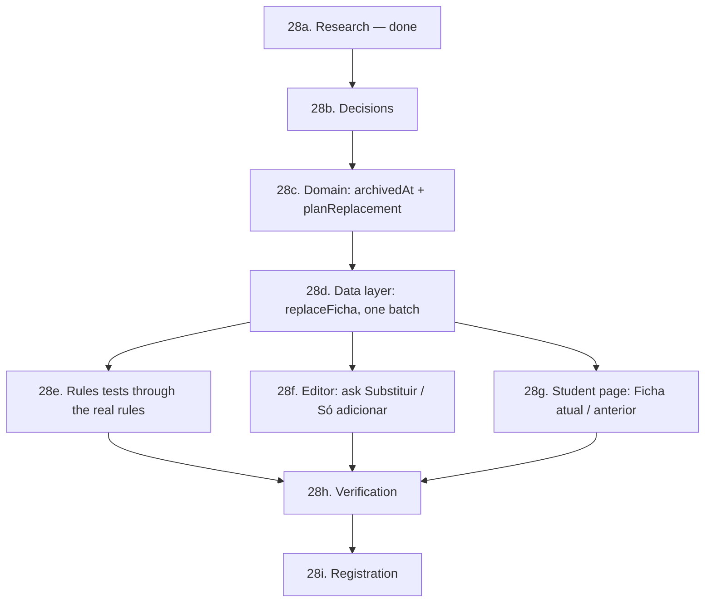
```mermaid
flowchart TD
    A[28a. Research — done] --> B[28b. Decisions]
    B --> C[28c. Domain: archivedAt + planReplacement]
    C --> D[28d. Data layer: replaceFicha, one batch]
    D --> E[28e. Rules tests through the real rules]
    D --> F[28f. Editor: ask Substituir / Só adicionar]
    D --> G[28g. Student page: Ficha atual / anterior]
    E --> H[28h. Verification]
    F --> H
    G --> H
    H --> I[28i. Registration]
```

Suggested: opus · high — the feature deletes data; the bounds of the delete (28c–28d) are where a mistake is expensive, the dialog and the page are ordinary UI work.

**28a. Research — what the code and the platform say (checked 2026-10-01)**

Suggested: sonnet · medium — already done; kept so the decisions are not looked up twice.

- [x] Data model and flows as listed above (read from `domain/workouts.ts`, `data/workouts.ts`, `data/converters.ts`,
      `FichaEditor.tsx`, `WorkoutsSection.tsx`, `firestore.rules`): one treino per document, no cycles, no archive,
      creation only adds, the owning trainer may delete, no field validation.
- [x] Kotlin parity: `FirestoreMappers.kt` `toWorkoutEntity` / `toFirestoreMap` use eight fields; an extra field is
      ignored on read; a phone save rewrites only those eight (a plain `set` drops `archivedAt` — the safe direction;
      a merge-write would keep it, which the `isActive === false` guard of 28c covers).
- [x] Free quotas (Spark): 1 GiB stored, 50,000 reads, 20,000 writes and 20,000 deletes per day
      (<https://firebase.google.com/docs/firestore/quotas>) — a replace is a handful of operations.
- [x] Client SDK limit that shapes the design: a web transaction cannot run a *query*, so the replace reads the
      student's treinos once and then writes one batch (≤ 500 operations; the plan refuses above 450). Two tabs
      replacing at the same instant could leave two active fichas (never lost data) — accepted, one trainer on one
      device being the real case.

**28b. Decisions (settled here, so nobody re-argues them mid-build)**

Suggested: sonnet · medium — decisions already made; the last item is the one to confirm.

- [x] "Ficha" for this feature = all of a student's **active** treinos when the replace happens; adding one extra
      treino stays possible ("Só adicionar").
- [x] History depth = **1**: the current ficha plus one previous; not configurable in v1.
- [x] The delete is part of the replace, confirmed with a list of what goes; no background job; no bulk button.
- [x] Logs, charts, biometrics, payments and schedules are untouched; the student never sees the history.
- [x] **(manual)** Confirm the two product choices: **(1)** replacing is asked **every time** the student already has an
      active ficha (*Substituir* / *Só adicionar*) instead of always replacing; **(2)** the previous ficha is visible
      to the trainer only. Done when the trainer has said yes (or changed it) in chat. **Confirmed 2026-10-01** ("pode fazer como sugeriu").

**28c. Domain — `archivedAt` and the replacement plan (pure, no Firestore, no clock)**

Suggested: opus · high — this is where the bound of the delete lives; every rule above becomes a test.

- [x] `Workout.archivedAt: number | null`. `toWorkout` reads it with the existing `int()` helper (absent or malformed ⇒
      `null`); `workoutToFirestore` writes it **only when non-null**, so every document written for a non-archived
      treino stays exactly what it is today (what the phone reads and writes); `withDerivedStatus`: active ⇒
      `archivedAt: null` (re-activating takes a treino out of the history). Tests: absent / number / string / negative,
      written only when set, activation clears it, every existing converter test still passes unchanged. **Done 2026-10-01** (converter tests: absent/number/string/fraction/null, written only when set; activation clears it).
- [x] `domain/fichaHistory.ts` — `planReplacement(existing, incoming, now) → { toCreate, toArchive, toDelete }`:
      `toArchive` = existing with `isActive`, each becoming `withDerivedStatus({ ...w, isActive: false })` +
      `archivedAt: now`; `toDelete` = existing with `archivedAt !== null && !isActive` — **and only when `toArchive` is
      non-empty** (a replace that retires nothing never deletes the history); `toCreate` = incoming, normalised active.
      The three lists are disjoint by id (throw if not — it would be a bug, not a case). Table-driven tests: nothing
      existing; only active; active + history; history treino re-activated (not deleted); hand-deactivated and draft
      treinos untouched; a student with 40 old inactive treinos and no history ⇒ **none deleted**; nothing active but
      a history ⇒ **none deleted**; a second replace deletes exactly the first replace's archive; `toDelete` never
      contains an active treino. Done when `tsc`, `eslint`, `vitest` are green. **Done 2026-10-01** (`domain/fichaHistory.ts` + test, 15 cases incl. the 40-old-inactive and nothing-active-but-history
      ones; also `splitFichas` for the page).

**28d. Data layer — `replaceFicha`, one atomic batch**

Suggested: opus · high — the write path of a delete; atomicity and the error paths are the point.

- [x] `data/workouts.ts` `replaceFicha(db, trainerId, studentId, incoming, now)`: reads the student's treinos with
      `loadStudentWorkouts` (equality filters, no composite index), runs `planReplacement`, and commits **one
      `writeBatch`**: `set` the new treinos, `set` the archived copies, `delete` the old history. Refuses with a typed
      error above 450 operations. Returns `{ created, archived, deleted }` (names included) so the screen can report it.
      A failed commit writes nothing; a retry re-plans from fresh data. **Done 2026-10-01**; it also refuses an incoming treino of another student before reading anything.
- [x] Unit-test the part that does not need Firestore (the operation list built from a plan); the rest is 28e. **Done:** the operation count and the lists are tested in `fichaHistory.test.ts`; the batch itself in 28e.

**28e. Rules tests — through the real rules, expecting no rules change**

Suggested: sonnet · high — emulator tests; the discipline is reading the failures honestly.

- [x] `web/rules/dataLayer.test.ts`: `replaceFicha` as the owning trainer lands new + archive + delete together; as
      **another trainer** it fails as a whole with nothing partially written; a **student** cannot write any of it and
      cannot read an archived treino (inactive ⇒ draft) while still reading the active ones. **Done 2026-10-01:** 5 tests through the real rules (replace; a second replace deletes exactly the first archive;
      nothing active ⇒ history kept; another trainer / the student refused with nothing changed; another student's treino
      refused).
- [x] `web/rules/firestore.rules.test.ts`: a `workouts` document carrying `archivedAt` is accepted on create and update
      by the owning trainer. Run `npm run test:rules` (Java 21). If a case fails because of the rules, **stop** — that is
      a rules change (xhigh, the "seen failing on the old rules" run, a manual publish), not part of this plan's size. **Done:** 2 tests; `npm run test:rules` is 90/90 and **no rules change was needed** — nothing to publish for §28.

**28f. The editor — ask "Substituir" or "Só adicionar"**

Suggested: sonnet · high — two save paths and a destructive choice that must be impossible to trigger by accident.

- [x] `FichaEditor.tsx`, in `save()` (a **new** treino only — editing an existing one never replaces) and `saveAll()`:
      load the student's treinos first (if the load fails, fall back to a plain add and delete nothing); if there is at
      least one active treino, open `ConfirmDialog` **"Substituir a ficha atual?"**: "O aluno tem hoje: <names>.
      **Substituir**: a ficha atual vira a *ficha anterior* (o aluno deixa de vê-la) e a que já era a anterior
      (<names and dates, or "nenhuma">) é **excluída para sempre**. **Só adicionar**: a nova se junta às que já
      existem e nada é apagado." *Só adicionar* is the default focus, Escape and backdrop (the dialog's "Não"), *Substituir*
      is the "Sim". A student with no active treino gets no question — a plain add, as today. *Substituir* calls
      `replaceFicha`; *Só adicionar* calls the existing `saveWorkout(s)`. **Done 2026-10-01, with one change from the plan:** the dialog has three answers — *Cancelar* (default focus,
      Escape, backdrop: nothing is saved), *Só adicionar*, *Substituir* — so a stray Escape can never save or delete
      (the plan had Escape = *Só adicionar*). `ConfirmDialog` gained an optional middle button.
- [x] Error text when the replace fails: nothing was changed (it is one batch) — "Não foi possível substituir. Nada foi
      alterado." Controls ≥ 44 px, text ≥ 12 px, no new stylesheet. **Done** ("Não foi possível substituir. Nada foi alterado.").

**28g. The student's page — "Ficha atual" and "Ficha anterior"**

Suggested: sonnet · medium — a grouped list on an existing screen.

- [x] `WorkoutsSection.tsx`: group the list into **Ficha atual** (active), **Ficha anterior — histórico**
      (`archivedAt !== null && !isActive`, each with "arquivada em dd/mm/aaaa" and the line "será excluída quando você
      substituir a ficha de novo") and **Outras (inativas)** (drafts and hand-deactivated). Editar / Ativar / Excluir
      stay on every treino; *Ativar* on a history treino goes through the normal save and so leaves the history (28c).
      Existing classes only; phone-width check. **Done 2026-10-01.**
- [x] The student's own screens are untouched (an archived treino is a draft and invisible — proved in 28e). **Verified** in the browser and in 28e.

**28h. Verification**

Suggested: sonnet · high — proving the bounds of a delete from the outside is the whole job.

- [x] Run `tsc`, `eslint`, `vitest`, `npm run test:rules` (Java 21) and the static build with
      `NEXT_PUBLIC_BASE_PATH=/Personal_app_android`. Done when all are green; record the counts here. **Done 2026-10-01:** `tsc`, `eslint` clean; 349 unit tests; 90 emulator tests; static build 17/17 pages.
- [x] Browser, against the emulators (seeded student with an active A/B/C): save a new ficha → the dialog lists A/B/C;
      **Só adicionar** keeps everything; save again → **Substituir**: the old ones appear under *Ficha anterior*, the new
      ones are active, and the student (logged in) sees only the new ones; replace once more → the first history is
      **gone** and the second ficha is now the history; a hand-deactivated treino and a draft **survive both replaces**;
      re-activating a history treino takes it out of the history and it survives the next replace; a student with
      nothing active gets no question. Phone width (overflow probe), keyboard-only through the dialog (Escape = *Só
      adicionar*). Record the result here. **Done 2026-10-01** (Browser pane, DOM-driven, seeded Ana with one active and one draft ficha): the dialog lists her
      active treino and "(nenhuma)" as history; **Cancelar** (the dialog's cancel event) saves nothing; **Só adicionar**
      adds Treino A/B with nothing archived or deleted; **Substituir** archives Ficha A, Treino A, Treino B
      (`archivedAt` set), creates Treino C/D, and the page shows Ficha atual / Ficha anterior (histórico) / Outras
      (inativas) with "Arquivada em 01/10/2026"; **Ativar** on a history treino clears its `archivedAt`; the next
      replacement (the single-treino form this time) listed "Treino A, Treino B" as the history to delete, **deleted
      exactly those**, archived C/D/Ficha A, created Treino E, and the draft "Ficha B — em revisão" survived both
      replacements; logged in as Ana, `/aluno` shows only Treino E. At 375 px: no overflow on the student page and the
      dialog (its three buttons wrap to two rows, 48 px tall). Keyboard-only was not run (the pane was hidden);
      default focus on *Cancelar* and the Escape path were checked in the DOM.
- [x] A failure test: replace as a trainer whose write is refused — nothing is archived, created or deleted. **Done in 28e:** another trainer and the student are refused and `a1`/`history1` are unchanged.

**28i. Registration**

Suggested: haiku · low — documentation and ticks, fully specified.

- [x] `CLAUDE.md` web section: the web-only `archivedAt` field (ignored by the phone, written only when set), the
      three guards (inactive + archived only; nothing deleted unless something is archived in the same replace; one
      atomic batch), that nothing is deleted outside a replace, and the accepted two-tab race. GOALS.md: tick each
      item with what was actually verified, commit each verified item on its own, never push without being asked. **Done 2026-10-01.**
- [ ] Done-when for the whole section: on the live site a trainer replaces a student's ficha, sees the old one under
      *Ficha anterior*, replaces again and sees the first one gone; the student only ever saw the current one; no log,
      chart or number on the dashboard changed. Not done when the code exists.

---

## 29. Feature — Account settings for ADM, trainer, and student (web)
(2026-10-01, via `/newgoal`)

**The request:** create account settings entered from the profile area shown in the reference image, for ADM, trainer, and student: upload an account image, change password, add a personal phone number for future use, change e-mail, and include the other basic account controls that fit this screen.

**Goal type: Feature** — extend the existing authenticated web areas with one shared account-settings experience and role-specific routes. This section plans web code only; no Android or iOS source changes.

**Baseline before this goal (checked against `origin/main`):**
- `web/src/app/_shared/AppShell.tsx` renders the profile chip in the reference: initials-only `Avatar`, current Auth e-mail, role label, and a separate sign-out button. The same shell serves all three areas.
- ADM already has `/admin/conta` in `web/src/app/admin/conta/page.tsx`. It shows the signed-in e-mail, ADM count, an MFA placeholder, and a password-reset-email action; extend it and preserve those existing account/admin details.
- Trainer and student areas use `/app` and `/aluno`; their layouts are `web/src/app/app/layout.tsx` and `web/src/app/aluno/layout.tsx`. `RequireArea` already enforces the authenticated role.
- `SessionProvider` exposes Auth e-mail and `emailVerified`. The ADM trainer directory also reads the mirrored `users/{uid}.email`, so a confirmed Auth e-mail change must refresh that document field.
- `users/{uid}` already carries a `phone` field. Firestore rules protect role and trainer ownership; any new profile writes must keep role, trainerId, and ADM-controlled permission fields protected.
- `Avatar.tsx` displayed initials. Firebase Storage was not configured in `firebase.json`, had no Storage rules, and was not connected by `data/firebase.ts`.

**Decisions for this feature:**
- Use shared settings sections for profile and sign-in/security, with `/admin/conta`, `/app/conta`, and `/aluno/conta` routes. The profile chip is an account link, with sign-out remaining a distinct action. Keep account access discoverable at phone width even if the desktop rail is hidden.
- A profile image belongs to the signed-in user. Store a UID-scoped Storage path, read it through authenticated Firebase Storage access, and keep initials as the fallback. Do not store a long-lived download token as though it were private.
- The phone is optional contact information in Firestore, separate from Firebase Auth phone sign-in or SMS verification. Show it as unverified; do not send SMS.
- Firebase Auth remains the source of truth for e-mail and password. After a new e-mail is confirmed, refresh Auth state and synchronize the ADM-facing `users/{uid}.email` mirror to the verified Auth token. Show a retry state if that mirror write fails after Auth has changed.
- Do not add name editing in this pass: the linked student's `users/{uid}.name` is also trainer-managed profile data. Keep the existing ADM MFA placeholder separate; MFA implementation is out of scope.
- Do not change Android/iOS source. `firestore.rules` and Firebase project configuration are shared infrastructure; test existing client permissions and treat any live rules publication or billing-related console action as a separate manual gate.

**Research (checked 2026-10-01):** Firebase documents `verifyBeforeUpdateEmail` as sending a confirmation link and applying the new e-mail only after verification; password and primary e-mail changes require recent authentication. Private Storage rules can scope file access to the authenticated UID. Cloud Storage for Firebase requires the Firebase project to use the Blaze plan; there may be no-cost usage, but enabling billing is still an owner decision. See [Firebase Auth user management](https://firebase.google.com/docs/auth/web/manage-users), [Firebase Auth JS reference](https://firebase.google.com/docs/reference/js/auth.User), [Storage rule conditions](https://firebase.google.com/docs/storage/security/rules-conditions), and [Storage billing requirements](https://firebase.google.com/docs/storage/faqs-storage-changes-announced-sept-2024).

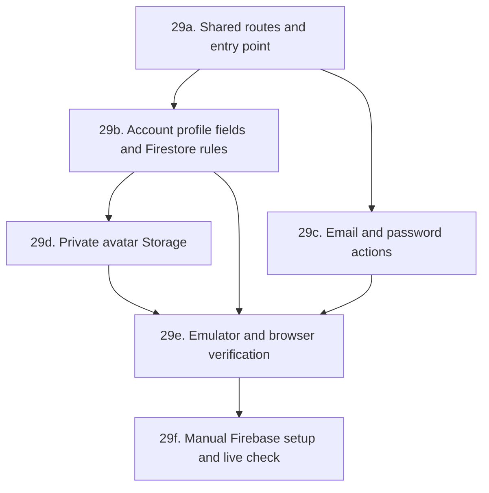
```mermaid
flowchart TD
    A[29a. Shared routes and entry point] --> B[29b. Account profile fields and Firestore rules]
    A --> C[29c. Email and password actions]
    B --> D[29d. Private avatar Storage]
    B --> E[29e. Emulator and browser verification]
    C --> E
    D --> E
    E --> F[29f. Manual Firebase setup and live check]
```

Suggested: gpt-6-astra · xhigh — e-mail changes, private avatar storage, and shared Firestore rules cross identity and ownership boundaries; an error could expose an image, leave the admin directory stale, or weaken account permissions.

### 29a. Shared settings routes and profile entry

Suggested: sonnet · medium — shared-shell routing and one account page extended across three roles.

- [x] Extend the existing ADM account page and add `/app/conta` and `/aluno/conta`, backed by shared account-settings components rather than three divergent forms. Keep each route behind its existing `RequireArea`; a trainer or student cannot enter another role's area.
- [x] Make the profile identity/avatar in `AppShell` link to that role's account route; keep `SignOutButton` separate. Provide an equally visible entry at narrow widths. Display current role and e-mail verification state.
- [x] Preserve the existing ADM count, MFA placeholder, and reset-password action unless each is moved to an equally visible security section. No ADM MFA implementation is part of this section.
- [ ] **Done when:** the profile entry opens the right account route for all three roles at desktop and phone widths, while sign-out remains a separate control and role guards still reject cross-area routes.

### 29b. Contact phone and account-owned profile fields

Suggested: sonnet · high — profile writes need a narrow owner boundary without changing role or trainer permissions.

- [x] Add an optional personal-phone field to the shared settings form. Format for display, validate plausible Brazilian/international input, and persist the normalized contact value to the signed-in user's own `users/{uid}.phone`; leave empty as a supported state. Do not reuse this as Auth's verified phone number.
- [x] In `firestore.rules`, permit only the intended self-owned account fields needed by this feature. Keep `role`, `trainerId`, suspension/access status, trainer permissions, and another user's document out of the self-edit set. Constrain the e-mail mirror to the signed-in, verified Auth e-mail.
- [x] Add rule tests for ADM, trainer, and student: own phone/profile-field update succeeds; another UID, role/trainerId changes, privilege fields, and unverified or mismatched e-mail mirror writes fail. Retain the existing assessment and trainer-owned-student permission behaviors.
- [x] **Done when:** phone changes survive reload for all three roles, empty is valid, and rule tests prove self-only edits cannot grant roles, alter trainer ownership, change access permissions, or impersonate another e-mail.

### 29c. Change e-mail and password

Suggested: opus · high — Auth confirmation, recent-login handling, and the ADM directory mirror form one multi-step account state change.

- [x] E-mail: use `verifyBeforeUpdateEmail`, never `updateEmail`. Keep the current e-mail active until the new address is confirmed; show pending, sent, expired/error, and success states; support returning to the correct account page (including the site's configured base path). After confirmation, reload the Firebase user, refresh its ID token, update the Firestore e-mail mirror, and refresh the session. If mirror synchronization fails, retain a clear retry action and show which address Auth currently owns.
- [x] Password: offer a current-password reauthentication flow followed by `updatePassword`; handle `requires-recent-login` with a retry prompt. Keep the existing password-reset-email route as recovery fallback for users who cannot remember their current password.
- [x] Clear password inputs after success, require matching new-password confirmation, provide actionable error text, and never write or log credentials to Firestore or diagnostics.
- [ ] **Done when:** an unconfirmed new address never replaces the current Auth e-mail; a confirmed change updates Auth, the trainer directory, and the visible session; stale-login and mirror-write failures recover without a misleading success state; password changes require successful reauthentication and reset e-mail still works.

### 29d. Private account image

Suggested: opus · high — a new Storage bucket and rules surface must prove owner-only reads and writes.

- [x] Add the Firebase Storage web client and emulator connection. Upload one avatar to a stable UID-scoped path, validate image MIME type and size in the UI and again in Storage rules, support replace/remove, and fall back to initials on missing image or load failure. Limit visibility to the user's own account surfaces in this feature.
- [x] Add `storage.rules` that allow only the matching signed-in UID to read, replace, or delete their avatar, with an image content-type allowlist and a small maximum size. Apply App Check consistently with the existing web Firebase setup. Store the Storage path, not a bearer download token, in the profile.
- [x] Add Storage Emulator configuration and tests for owner success, cross-UID denial, unauthenticated denial, invalid MIME/oversized file denial, replacement, and removal. The account UI must remain usable when upload is unavailable.
- [ ] **(PENDING — needs Blaze)** **Manual Firebase precondition:** before enabling production uploads, the owner checks the project's plan, bucket, App Check and expected billing; do not enable Blaze or create a production bucket automatically. If billing is not approved, keep upload unavailable with a clear message and initials fallback.
- [ ] **Done when:** emulator tests prove the path and file constraints, all three roles can manage only their own image, removal returns to initials, and the live upload is enabled only after the owner completes the Firebase setup.

### 29e. Verification, compatibility, and registration

Suggested: opus · high — emulator rules and end-to-end role coverage are the evidence for the security boundary.

- [x] Run the project's web checks: TypeScript, ESLint, Vitest, Firestore rules tests, Storage rules tests, and static build with the configured base path. Fix failures in scope before marking items complete.
- [ ] In a DOM-driven browser against emulators, sign in as ADM, trainer, and linked student. For each: open settings from the profile entry; save/clear phone; request e-mail change, prove old e-mail remains until confirmation, confirm and prove ADM's trainer listing refreshes; change password with fresh auth and exercise the stale-auth/error and reset-link states; upload/replace/remove an avatar where Storage is configured.
- [ ] Check phone width and keyboard access: visible settings entry, labels and error/status announcements, focus after save/error, controls at least 44 px, no horizontal overflow. Confirm the account screen never displays another user's avatar or exposes student training/health data.
  > **Checked 2026-10-05** (Browser pane, Auth/Firestore/Storage/Functions emulators, seeded data; DOM-driven):
  > ADM sign-in lands on `/admin`, the profile entry opens `/admin/conta` and `Sair` is a separate control; phone
  > saves/normalises, rejects `123`, accepts empty and survives a reload; password change refuses a mismatch and a wrong
  > current password, succeeds, clears the fields; e-mail change keeps the old address active ("Aguardando confirmação…")
  > until the emulator link is opened, then Auth and the `users` mirror both read the new address; avatar upload,
  > replace, remove (back to initials), a `.txt` and a 2.5 MB file are refused. The personal's `/app/conta` shows the
  > read-only plan and invoice; a student who claimed an invite (Lia) can open `/aluno/conta`, save a phone, and sees no
  > training/health data. At 375 px: no horizontal overflow, labels present, form fields 16 px, controls ≥ 44 px (the
  > wordmark and "Voltar" links were 25/19 px — fixed), the settings entry is visible in the tab bar and the profile chip.
  > An ADM opening `/aluno/conta` is sent back to `/admin`. **Not exercised:** e-mail change, password change and avatar
  > for the trainer and student roles (same shared component, only the ADM was driven), focus handling after save/error,
  > and the ADM *trainer-directory* refresh after a trainer's e-mail change.
  >
  > **Checked 2026-10-06** with `web/e2e/account.mjs` (headless Chrome over the emulators; real typing and Tab; the
  > emulators' REST used to verify what the page claims) — **trainer 44/44, student 43/43, and both at 390 px 45/45 and
  > 46/46**: phone (formatted, persisted, `123` refused, empty accepted); e-mail change refused with a wrong password,
  > pending with the old address still signing in, then — from the emulator's link — Auth, the `users` mirror *and the
  > ADM's trainer directory* all show the new address; password mismatch / wrong current / success, fields cleared, old
  > one stops working; avatar upload, replace (one object at `account-avatars/{uid}/profile`), `.txt` and 2.5 MB refused,
  > remove deletes the object; the trainer sees the student's initials, never their private photo; Tab order reaches every
  > field, every stop has a name and a focus ring; 390 px has no overflow, controls ≥ 44 px, fields 16 px.
  > **Found and fixed:** the fields and buttons were `disabled` while saving, which drops keyboard focus to `<body>` —
  > they are now `readOnly` / `aria-disabled` with a double-submit guard (`AccountSettings.tsx`, `AccountAvatarSettings.tsx`),
  > and the phone error is tied to its field (`aria-invalid`, `aria-describedby`).
  > **The ADM screens had the same defect and were fixed the same day** (`web/e2e/admin-focus.mjs`, 13/13; 1/13 before the
  > fix): every button that starts an action (`/admin/conta`, `/admin/planos`, the trainer detail panel — terms, trial
  > extension, invoice, due date, payment, invite resolution —, `/admin/personais/novo`, `/admin/solicitacoes`) is now
  > `aria-disabled` with a guard in its handler, so pressing Enter leaves focus on it; where the button legitimately goes
  > away after success (a closed editor, a paid invoice, a created trainer) the new `_shared/FocusNotice.tsx` takes focus
  > only if it would otherwise fall to `<body>`, so the next Tab continues from the result message.
  > **Still not covered:** the screen-reader experience itself (only the DOM contract was checked), the buttons that
  > merely open a form or dialog (they stay `disabled={busy}`; focus is not on them when busy starts), and the live site with
  > real Firebase (emulators only).
- [x] Regression-check the existing cross-client Firestore rule cases. Do not edit Android/iOS files. Because `firestore.rules` is shared, do not publish it to Firebase until the owner reviews the exact combined diff and approves the live rules step.
- [x] Update `CLAUDE.md` and `web/README.md` with account fields, Auth flows, Storage rules/emulator setup, and the manual Firebase/billing gate. Tick only behaviorally verified items here.
- [ ] **Done when:** all three live web roles can use their own account settings on the deployed site; the e-mail and password flows follow Firebase's confirmation/reauthentication requirements; avatar access is private; and the owner has completed the Storage setup. If Storage billing is declined, keep avatar upload open/deferred and do not mark the whole feature complete.

---

### 29f. Manual Firebase setup and live check

Suggested: haiku · low — console work and a controlled-account check, both owner-operated.

- [ ] **(PENDING — needs Blaze)** **Manual, only after the owner approves billing:** create/configure the Storage bucket, deploy the reviewed `storage.rules`, and verify Storage App Check. Do not enable Blaze or provision production resources automatically; if the owner declines, leave avatar upload deferred and 29d open.
- [ ] **Manual, only after the owner reviews the exact combined diff:** publish `firestore.rules` to Firebase. Confirm the existing client permissions and ADM-managed fields remain intact; no Android/iOS source change is included in this goal.
- [ ] After the site deployment and Firebase setup, use controlled ADM, trainer, and student accounts to verify profile image upload/replace/remove, phone save, confirmed e-mail change and trainer-directory update, password change/reset, and access denial between roles. Do not use student health data for this check.
- [ ] **Done when:** the owner-approved Firebase configuration is live, the three controlled accounts pass the stated checks on the deployed site, and the avatar is readable only under its authorized UID path.

**Implementation status in the current worktree:** shared account settings exist at `/admin/conta`, `/app/conta`, and `/aluno/conta`; profile navigation, optional phone, verified e-mail synchronization, reauthenticated password change, and the UID-scoped avatar path are implemented in Web code. `storage.rules` and the Storage Emulator are configured. Local verification on 2026-10-02 passed: 397 Web unit tests, ESLint, TypeScript, 139 Firestore/Storage/Functions Emulator tests, and static builds at root and `/Personal_app_android/`. Synthetic DOM checks opened account settings for ADM, trainer, and student; the 390px ADM page had no horizontal overflow and the profile/sign-out controls measured 44px. Full in-browser e-mail confirmation, password recovery, avatar lifecycle, keyboard QA, production Storage setup, publishing reviewed rules, and controlled live checks remain open.

---

### 29g. Change own name — once every 60 days (2026-10-06)

The trainer asked that every user (ADM, trainer, student) be able to correct their own name, at most once every 60 days.
`firestore.rules` already let a user write their own `name` with no limit, so the limit is new on the rules side too.

- [x] Pure rules in `web/src/domain/accountName.ts` (+ test): `normalizeAccountName` (trim, collapse whitespace, 2–80 characters, no control characters), `canChangeName`, `nextNameChangeAt`, `daysUntilNameChange` (never counts from before the server's stamp).
- [x] `data/account.ts`: `loadPersonalAccount` returns `name` and `nameChangedAt`; `savePersonalName` writes `{ name, nameChangedAt: serverTimestamp() }` and re-reads the stamp.
- [x] **Rules v5** (`firestore.rules`, archived as `firestore-rules/versions/v5.rules`): `validSelfNameChange` — a rename must carry `nameChangedAt == request.time`, differ from the current name, be 2–80 characters, trimmed, without control characters, and the previous stamp must be missing or ≥ 60 days old; the stamp cannot move without a rename; nothing else may ride along. The trainer's correction of a student's name is unchanged and does not touch the stamp. Tests: "own name, once every 60 days (rules v5)" (18 cases, 7 of which fail against v4) and "account name data flow" (4).
- [x] `_shared/AccountNameSettings.tsx` on the three account pages: explains the rule, asks "Alterar seu nome?" before using the wait up, then shows when it unlocks; the field and button lock while the wait lasts and after a reload. Refusals (too short, same name) never open the dialog.
- [x] Browser tests (`web/e2e/account.mjs`, now also `admin`): cancel writes nothing, a valid name asks first, confirming stores the name and a server stamp within two minutes of now, the screen locks with "faltam 60 dias" and the right unlock date, a second change is not offered, still locked after a reload, focus is not lost, the trainer's student list and the ADM's directory show the new name. Trainer 56/56, student 55/55, ADM 53/53 and 59/59, 58/58, 56/56 at 390 px.
- [ ] **Manual:** publish `firestore.rules` v5 before the site that carries this screen is merged — against v4 the new `nameChangedAt` field is refused and the save fails with "Não foi possível alterar o nome". Check the diff first (`firestore-rules/versions/v4.rules` → `v5.rules`).
- Not covered: a change of name does not rewrite names copied elsewhere — a connected student's old `students/{draft}` document, past `adminAudit` entries — and the shell's profile chip still shows the e-mail, not the name. Android and iOS were not touched; they never write a user's own `name`, but a whole-document `set` of a user by the phone (the ADM promotion) would reset the stamp.

## 30. Feature — ADM plan defaults, trainer billing, capacity, and student recovery (web)

**Type:** Feature · **Priority:** High · **Scope:** Web ADM and trainer flows only. Do not edit Android or iOS source or alter their invite behavior under this goal. This active-code cap applies to invitations generated through the website; mobile invite creation is out of scope.

The platform subscription introduced here is distinct from `trainerStats.billing`, `payments`, and `billingPlans`, which describe what a trainer charges their own students (Goal 26). Start with ADM-recorded invoices and payments; do not add a payment gateway, automatic PIX/card collection, or automatic Firebase billing-plan changes. Do not invent prices or seat counts: all numeric values are configured by the owner.

The web app is static and currently writes invites directly to Firestore. The site must show a live active/limit count and stop new website-generated codes through its cooperative atomic Web flow at the per-trainer cap. This is a website-flow limit, not a global cap: mobile invite creation and direct writes outside that flow are not globally limited and can exceed it. Read current invite state, including codes from other clients, and block additional Web-flow codes while the actual count is at or above the configured limit. A callable Cloud Function is an option for a trusted server boundary and requires Blaze; enabling billing/deploying it remains a manual owner decision. [Firestore query security](https://firebase.google.com/docs/firestore/security/rules-query) · [Cloud Functions pricing requirements](https://firebase.google.com/docs/functions/quotas-pricing).

**Invite-expiry decision (2026-10-01):** new Web-created invite codes do not expire automatically (`expiresAt: null`); the trainer cancels them manually, and the ADM can resolve an unused legacy invite. A legacy invite with no `expiresAt` remains active until the ADM resolves it. For compatibility, records that already have a numeric `expiresAt` retain their time-based active/expired behavior, including domain tests; this does not add expiry to new invites. Do not describe the Web-created codes as expiring.

> **Superseded in part by §35 (2026-10-09):** the ADM "defaults" card and `platformBillingConfig/trialDefaults` (30a), the trial student cap, the manual-invoice **UI** and the "charge during trial" checkbox (30b/30c) are replaced by plans with a trial-days field and a payment ledger (`platformPayments`) under "Mensalidades". Everything else here stays.

Suggested: gpt-6-astra · xhigh — plan selection affects financial records, access rules, and concurrent website invitation quotas.

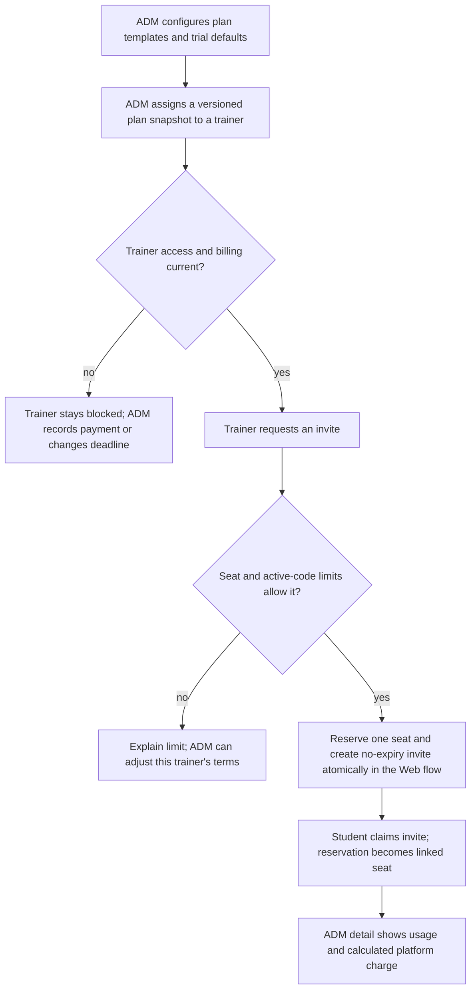
```mermaid
flowchart TD
  A[ADM configures plan templates and trial defaults] --> B[ADM assigns a versioned plan snapshot to a trainer]
  B --> C{Trainer access and billing current?}
  C -- no --> D[Trainer stays blocked; ADM records payment or changes deadline]
  C -- yes --> E[Trainer requests an invite]
  E --> F{Seat and active-code limits allow it?}
  F -- no --> G[Explain limit; ADM can adjust this trainer's terms]
  F -- yes --> H[Reserve one seat and create no-expiry invite atomically in the Web flow]
  H --> I[Student claims invite; reservation becomes linked seat]
  I --> J[ADM detail shows usage and calculated platform charge]
```

### 30a. ADM defaults and versioned plan templates

- [x] Add an ADM-only `Planos`/`Padrões` page, e.g. `/admin/planos`, with editable named templates. Each template includes monthly base price in integer cents, included linked students, recurring price per active student above the included amount, maximum number of simultaneously active invitation codes. Do not hard-code the user's example values X/Y/W/Z/H/J.
- [x] Include configurable trial defaults: maximum linked students, duration, and any invite limits; store the effective start/end and limits on the individual trainer assignment. Trial has no platform charge unless the owner explicitly configures otherwise.
- [x] Applying a template copies its values and template version into that trainer's subscription record. Editing a template changes only future assignments; it never silently changes an existing trainer's amount, quota, or deadline.
- [x] Apply the current configured default when the ADM provisions a new trainer. If defaults have not been configured, leave that trainer pending until the ADM assigns terms. Do not retroactively assign or suspend existing trainers; require an explicit per-trainer assignment.

### 30b. Per-trainer terms in the ADM detail

- [x] Extend `/admin/personais/detalhe?id=UID` with an ADM-only subscription panel to choose a template, override every price/quota/trial field, and set an effective date. Show the source template/version and the final values so overrides are visible.
- [x] Show linked seats, reserved seats for active pending invitations, remaining included seats, active invitation codes (current/maximum) and remaining code slots, the monthly amount at current usage, billing period, due date, payment state, and access state. Draft `students/{id}` records without an invite do not consume a seat; accepted extra students count once and incur the configured recurring extra-seat amount.
- [x] Keep platform subscription data separate from trainer-to-student payments and plans. A trainer can read their own effective terms and invoices but cannot write pricing, quotas, trial dates, payment state, or access state.

### 30c. Trial, invoice, payment, extension, and blocking

- [x] Record each platform billing period as a manual invoice with trainer UID, plan snapshot, linked-seat count, base and extra-seat calculation, amount in cents, period, due date, status, ADM actor, and timestamps. The ADM can record an out-of-band payment and an optional nonsensitive reference; no card/bank credentials or student health data.
- [x] **Privacy-safe invoice aggregation verified:** the ADM callable counts linked students and active invite reservations server-side, calculates the invoice from that total, and returns only aggregate counts and prices; Emulator tests confirm it does not return invite documents or health/contact fields.
- [x] Allow the ADM to extend an individual due date by any positive day count and to extend a trial explicitly. Record the old/new deadline, day count, actor, timestamp, and reason in the append-only `adminAudit` log.
- [x] A trainer whose trial expires without an assigned paid plan, or whose unpaid invoice passes its due date, is blocked from trainer-only actions until the ADM records payment (or assigns valid trial/paid terms). An extension changes the deadline; if an account is already blocked, extending alone does not restore access. Recording payment restores billing access only; it does not clear a separate manual `accessStatus: suspended` decision.
- [x] Enforce the billing gate in Firestore Rules as well as the web UI, using an ADM-managed billing summary on `users/{uid}` if that preserves the existing owner check's read cost. Compare the stored deadline to `request.time`; no scheduled job is needed for the expiry gate. Preserve admin recovery access. Keep linked students' own account state unchanged by a trainer billing lock unless a separate product decision changes that behavior.

### 30d. Website limit for simultaneously active invitation codes

- [x] Track two independent limits: billable seats are linked student accounts for this trainer plus active, unused invite reservations; active-code count is unclaimed, uncancelled, unrevoked invitation documents for this trainer. New Web invites have no expiry and are cancelled manually. A legacy invite without `expiresAt` remains active until ADM resolution; a legacy record with numeric `expiresAt` keeps its existing time-based behavior for compatibility. Enforce the seat limit and the maximum simultaneous active codes separately. Show the trainer's active / limit count in the invite form and stop new codes through the cooperative website flow at the cap. The ADM detail does not list raw invite documents; it shows the exact active-code/reservation count through the privacy-safe callable aggregate, which returns counts and prices only. Resolving a code still requires the trainer to provide it. Claiming converts the reserved seat to a linked seat and frees the code slot; manual cancellation or ADM resolution also frees it.
- [x] Reconcile the trainer's displayed counts against current linked students and invites. Treat every unused, unresolved legacy invitation without `expiresAt` as active until the ADM explicitly resolves it; never silently free or double-reserve its seat. Keep the unresolved ADM count separate until a privacy-safe aggregate/backend is available.
- [x] Serialize cooperating website code creation with the per-trainer reservation/revision transaction. This prevents concurrent attempts through that Web flow from exceeding its cap; it does not globally constrain mobile invite creation or direct Firestore writes outside the flow. Count active codes from other clients and block additional website-flow creation until the actual count is below the configured limit. Do not require Android/iOS source changes or alter their invite flows.
- [x] Enforce access/trial/payment/seat/active-code checks atomically for website actions. Show trainers a clear reason and the exact extra monthly price before an invite that will add a billable seat; require confirmation. ADM edits and any explicit over-limit emergency override require a reason and audit record.

### 30e. ADM emergency student registration under a trainer

- [x] Add a `Cadastrar aluno` recovery action inside the selected trainer's ADM detail. It creates a minimal draft under that trainer and optionally prepares the normal invite flow; identify the selected trainer clearly and audit who created it. Do not create a student Auth account with a shared/ADM-known password or skip the student's normal email verification and invite claim.
- [x] Permit the ADM path only for a valid, non-suspended trainer with an assigned, currently valid paid plan or trial; enforce this access/billing gate in Firestore Rules using server request time, not only the caller's clock. A draft without an invite does not reserve a seat or incur an extra-seat charge, matching 30b. Apply the seat/trial cap, active-code cap, price confirmation, and any quota adjustment or audited override in the normal invite-reservation flow. Do not expose unrelated trainers' student records or health fields in the recovery UI.

### 30f. Data protection, audit, and compatibility

- [x] Keep plan templates ADM-writable only; trainer subscriptions/invoices ADM-writable only, with trainer read limited to their own documents. Users cannot self-promote, change trainer ownership, extend trials, alter `accessStatus`, or mark themselves paid. Add least-privilege Rules tests for ADM, trainer, student, unauthenticated, and direct forged writes.
- [x] Record plan assignment/override, invoice creation, payment, deadline/trial extension, invite reservation/claim/cancel/ADM resolution (and legacy expiry handling), manual student creation, and override in `adminAudit`, preserving append-only rules and strict action schemas. Do not grant ADM access to student health data as a side effect.
- [x] Preserve current trainer self-registration/request approval and admin trainer creation flows, or explicitly route each through assigning a plan before activation. Verify old subscription records are not silently rewritten. Preserve existing manual suspension semantics and audit history.

### 30g. Verification and completion

- [x] Add unit tests for price arithmetic in integer cents, included/extra seat boundaries, trials, deadline extensions, and template snapshot behavior; Firestore Rules tests for direct tampering and trainer lock; and emulator tests for concurrent cooperating website reservations, claim/cancel, legacy `expiresAt` compatibility, capacity, billing, and ADM recovery creation. Include proof that the Website limit does not claim to cover mobile or direct writes outside its cooperative flow.
- [ ] Drive the Web ADM and trainer flows end to end: edit defaults, assign and override plans, provision a trainer, use trial, fill seats, verify extra price, send/claim/cancel no-expiry invites, resolve a legacy no-expiry invite as ADM, and test time-based expiry only for a legacy record with `expiresAt`; create a recovery draft, mark an invoice paid, extend a due date, and confirm blocked access is restored only by payment when overdue. Verify both allowed and denied paths.
  > **Checked 2026-10-05** (same setup): created a plan template (R$ 49,90 · 2 included · R$ 6,50 extra · 3 codes · trial
  > 2/7 d → saved as v1); assigned it to the seeded personal as a paid plan (template values copied); billable seats
  > = 4 linked + 1 reserved invite = 5 → R$ 69,40 (49,90 + 3 × 6,50) matches the estimate and the invoice; emitted the
  > invoice, extended its due date by 5 days, registered payment (state "Paga"); the personal sees the same terms and
  > invoice read-only on `/app/conta`. Invite cap: with 1 of 3 codes in use, two more were issued (with the extra-seat
  > warning) and a fourth was refused with "Limite de códigos ativos atingido (3/3)"; a student claiming an invite
  > moved linked 4 → 5 and active codes 3 → 2 and left a "Convite aceito" audit entry; the ADM resolved a legacy invite
  > by code (reserved 2 → 1, audited); the ADM emergency "Cadastrar aluno" created a draft that reserves no seat.
  > **Not exercised:** the trial path and trial cap, blocking by an overdue invoice (the due-date field has `min=today`,
  > so an overdue invoice cannot be created from the UI — covered by `platformFlows.test.ts` instead), concurrent
  > invite attempts, and the default-template assignment when the ADM provisions a new personal.
  >
  > **Checked 2026-10-06** with `web/e2e/billing.mjs` (23/23): a template with a 2-student trial cap assigned as a free trial
  > → the panel says so and says it charges nothing, the invoice button is unavailable, the trainer sees "Teste" with its
  > end date, and a new invite is refused with "Limite de alunos do teste atingido (5/2)" **and no invite document is
  > written**; the trial can be extended; switching to a paid plan and issuing an invoice leaves the trainer working;
  > with the due date and the access deadline in the past (written into the emulator — the site has no clock job) the
  > trainer's area shows "Conta temporariamente bloqueada" with re-check and sign-out, `/app/conta` still shows the plan
  > and invoice, the student list is locked, **an extension that is still in the past does not unlock**, and registering
  > the payment does. **Still not covered:** concurrent invite attempts; the default template applied when the ADM
  > provisions a new personal; the same flows against the real Firebase project.
- [ ] **Done when:** all configured prices and limits are owner-controlled, invoice and audit records match the calculation, concurrent attempts through the cooperating website flow cannot exceed its active-code cap, the displayed count updates after claim/cancel and legacy-expiry compatibility handling, trainer blocking is enforced by rules, and out-of-scope mobile/direct-write behavior remains explicitly outside the Web limit.

### 30h. Manual Firebase setup and rollout gate

- [ ] **(PENDING — needs Blaze)** (the Functions part; indexes/emulators do not wait) **Manual, after owner approval:** configure Firestore indexes/emulators and, only if a callable is selected, enable Blaze and deploy reviewed Functions. Never turn on billing or deploy production rules/functions automatically. If Blaze is declined, keep the website-flow limit in the reviewed cooperative atomic path and do not describe it as a global Firestore-enforced limit.
- [ ] **(PENDING — needs Blaze)** (the Functions part; the rules publish does not wait) **Manual, after owner reviews the exact combined rules diff:** publish Firestore Rules and any Functions. Confirm ADM recovery writes are narrowly scoped, website invite creation respects the cap, and the locked trainer remains recoverable by ADM.
- [ ] Test with controlled ADM, trainer, and student accounts after deployment. Do not use real payment credentials, real customer financial data, or student health data for verification.

**Implementation status in the current worktree:** Web code includes versioned plan/trial defaults, per-trainer terms, billing and invoice controls, an ADM student-recovery draft, a cooperative active-invite cap, and privacy-safe ADM aggregation through callable Functions. The ADM sees linked seats, active invite reservations/codes, and totals without reading raw invite profiles. New Web invites have no expiry and are cancelled manually; legacy no-expiry invites remain active until ADM resolution, and numeric legacy expiry remains supported. A blocked account cannot be reopened by invoice extension or plan reassignment while the current invoice is unpaid; payment and audit linkage are covered by Rules and Functions Emulator tests. Mobile invite creation and direct writes outside the cooperative Web flow are not globally limited. Local verification passed: 397 unit tests, lint, TypeScript/Functions build, 139 Firestore/Storage/Functions Emulator tests, root static export and HTTP route/asset smoke, plus the `/Personal_app_android/` compatibility build. Full ADM/trainer browser flows and production Firestore/Functions publication, Blaze approval, and controlled live checks remain open.

---
## 31. Process — Web security review and Cloudflare Pages readiness
(2026-10-02, via `/newgoal`)

**The request:** determine what visitors and signed-in users can copy from the web site, reduce unauthorized access to account data, and assess moving the web deployment from GitHub Pages to Cloudflare Pages because the current GitHub Pages setup may require a public source repository.

**Goal type: Process** — security and hosting readiness for the existing static web client. This plan does not implement changes. Scope is the website, Firebase configuration/rules, and deployment workflow; do not edit Android or iOS source. Shared Firestore-rule changes must be emulator-tested against existing client behavior. Any mitigation that requires changing Android/iOS clients is a scope decision to bring back to the owner before implementation.

**Baseline checked 2026-10-02:**
- `web/next.config.ts` uses Next.js static export (`output: "export"`) and accepts `NEXT_PUBLIC_BASE_PATH`; `.github/workflows/web-deploy.yml` sets `/Personal_app_android` for GitHub Pages. Firebase Auth, Firestore, Storage, and Gemini calls run from the browser; there is no private web server layer in this deployment.
- Site HTML, JavaScript, CSS, images, and any other assets delivered to a visitor can be saved or copied. A browser user can also copy any data their account is authorized to read. Hosting changes, minification, disabled right-click, and copy-blocking overlays cannot make already delivered content secret; security work must prevent unauthorized data access and minimize data returned to each role.
- Rules reviewed in the current worktree deny anonymous Firestore access, but ADM reads include whole `users/{uid}` documents; Firestore rules cannot redact individual fields from a document. In addition, a signed-in user who knows an invite code can read that invite document, which currently contains student contact/health fields. Codes are short, and invitations without expiry remain active until cancelled/resolved. Confirm the final Goal 30 state before changing these shared rules.
- Gemini requests originate in the browser, and the visible use counter is client-side. Verify Firebase AI Logic's deployed App Check/authentication enforcement and quota controls in the Firebase console; UI role checks alone are not a security boundary.
- GitHub Pages on GitHub Free requires a public source repository; paid plans can publish from private repositories, while the published Pages site remains public. Cloudflare Pages supports Git-based deployment from private GitHub repositories and static Next.js export. Cloudflare preview URLs are public by default unless protected.
- Repository files show local configuration only. The Firebase/Cloudflare console settings, currently published rules, deployed response headers, and source repository visibility were not verified as part of this plan.

**Security and hosting decisions:**
- Report separately on (1) source-repository visibility, (2) public site assets, and (3) Firebase data available to anonymous, ADM, trainer, and student accounts. Do not promise to prevent copying by a user who can already view the data.
- Prioritize invite-document minimization and safe invite lookup, then ADM access to user profiles and Gemini abuse controls. Preserve existing student claim and trainer/admin flows; do not weaken rules to accommodate a UI query.
- Treat Firebase browser configuration and reCAPTCHA site keys as public identifiers, not server secrets. Search source and exported assets for actual private credentials without printing them; rotate any confirmed exposed secret through the owner-controlled service.
- Cloudflare Pages is a viable static host: use the `web` project directory, Node 24, `npm ci`, `npm run build`, `out` as the artifact directory, and leave `NEXT_PUBLIC_BASE_PATH` unset for a root-hosted custom domain or `pages.dev` URL. A private Git repository hides Git history/source, not the deployed JavaScript or data returned to the browser.
- Keep production domain/DNS, GitHub App installation or permission changes, Firebase console settings, and live Firestore/Storage rule publication as owner-controlled manual steps. Keep GitHub Pages available until the Cloudflare deployment has passed acceptance and rollback is documented.
- Cloudflare preview deployments are public by default. Before connecting a preview to Firebase, either use an approved staging Firebase project or protect the preview with Cloudflare Access and ensure production data is not exposed to preview builds. Do not assume Access protection on one hostname protects every `pages.dev` or preview alias.
- Add response security headers only after a report-only CSP and browser checks cover Next.js hydration, Firebase Auth, Firebase endpoints, and reCAPTCHA Enterprise. A restrictive header that breaks sign-in is not a completed security improvement.

**Research (checked 2026-10-02):** Cloudflare documents Next.js static export, Git integration, private repository access, preview deployments, Pages limits, custom domains, and `_headers`; Firebase documents its security checklist, API-key handling, Firestore rule/query behavior, App Check, Auth authorized domains, and AI Logic security. See [Cloudflare static Next.js deployment](https://developers.cloudflare.com/pages/framework-guides/nextjs/deploy-a-static-nextjs-site/), [Cloudflare Git integration](https://developers.cloudflare.com/pages/configuration/git-integration/), [Cloudflare preview deployments](https://developers.cloudflare.com/pages/configuration/preview-deployments/), [Cloudflare headers](https://developers.cloudflare.com/pages/configuration/headers/), [GitHub Pages eligibility](https://docs.github.com/en/pages/getting-started-with-github-pages), [Firebase security checklist](https://firebase.google.com/support/guides/security-checklist), [Firestore rules and queries](https://firebase.google.com/docs/firestore/security/rules-query), [App Check for web](https://firebase.google.com/docs/app-check/web/recaptcha-enterprise-provider), and [Firebase AI Logic security checklist](https://firebase.google.com/docs/ai-logic/security-checklist).

**Execução local e registro de risco (2026-10-02; sem alterações em produção):**
- **Assets públicos — esperado:** HTML, JavaScript, CSS, imagens e prompts/tabela de referência do Gemini entregues ao navegador podem ser salvos por qualquer visitante. O export tem zero source maps; a busca de padrões de credenciais privadas em arquivos rastreados e histórico acessível não encontrou correspondências. Firebase Web API key e chave de site reCAPTCHA são identificadores públicos esperados, não segredos.
- **Leitura por papel — risco médio de excesso para ADM:** visitantes anônimos não leem Firestore; avatares em Storage só são lidos pelo UID proprietário. Trainer lê seus alunos e registros vinculados; aluno lê o próprio perfil/medidas/registros e treinos atribuídos. As regras do ADM permitem a leitura dos documentos completos `users/{uid}`, inclusive contato e observações de saúde, pois Firestore não mascara campos dentro de um documento. Uma conta autorizada pode salvar os dados que lê.
- **Convites — risco alto de privacidade:** `allow get` em `invites/{code}` permite que qualquer conta autenticada que saiba o código baixe o documento inteiro, incluindo nome, telefone, gênero, objetivo, experiência, observações médicas e dias de treino. Os códigos são 8 dígitos hexadecimais (32 bits), sem throttling por código nas Rules; convites Web não expiram por decisão do dono de 2026-10-01 e dependem de cancelamento manual. A regra atual não restringe a leitura ao destinatário do convite. Isso permite copiar os campos se o código for obtido ou adivinhado; o callable de billing não expõe os documentos crus.
- **Gemini/App Check — console pendente:** chamadas de AI Logic partem do navegador e o contador em `localStorage` pode ser apagado ou contornado. O client pede tokens App Check de uso limitado e as callables aplicam App Check fora do Emulator; o enforcement de produção, autenticação/quotas AI Logic, domínios Auth e allowlist da chave reCAPTCHA não foram conferidos no console. A documentação do Firebase indica enforcement obrigatório para AI Logic a partir de 2026-11-02.
- **Dependências:** `npm audit --omit=dev` do Web reportou quatro alertas high no caminho Firebase → Firestore → `@grpc/grpc-js@1.9.16`; esse pacote não aparece no export estático e os avisos dependem de uso gRPC server específico. Functions reporta nove caminhos moderate, zero high/critical, principalmente a cadeia `uuid` via `firebase-admin@13.10.0`/`firebase-functions@6.6.0`; as correções indicadas exigem majors. Nenhum pacote foi alterado automaticamente.
- **Cloudflare:** export estático raiz gerou 26 rotas; smoke HTTP local retornou 200 para `/`, áreas e contas ADM/trainer/aluno, `/convite/`, `/entrar/` e um chunk JS, sem prefixo GitHub Pages. A build com `/Personal_app_android/` também passou. O workflow de CI agora instala Functions em Node 22 e roda Rules Emulator com Java 21 após checks Web em Node 24; YAML validado localmente, sem execução remota do Actions. Não há `_headers` no repositório.
- **Não verificado fora do checkout:** visibilidade/plano do GitHub, proteção de branch/status obrigatório, integração GitHub App da Cloudflare, URLs e proteção de previews, DNS/domínio, cabeçalhos publicados, regras Firebase atualmente publicadas, App Check/AI Logic/Auth settings e plano/bucket Storage.

**[PENDENTE — a opção por callable depende do Blaze, 2026-10-08]** **Decisão necessária antes de corrigir a exposição de convites:** o cliente Android/iOS legado lê `invites/{code}` diretamente e as Rules não podem ocultar campos do documento. A opção de claim mediada por callable devolve apenas os campos necessários, mas requer migração dos clientes móveis e infraestrutura Firebase/Blaze; a projeção segura do diretório ADM também exige uma coleção/backend com migração das telas. Não alterei Android/iOS nem implantei backend; aguardo autorização explícita para essa mudança de escopo.

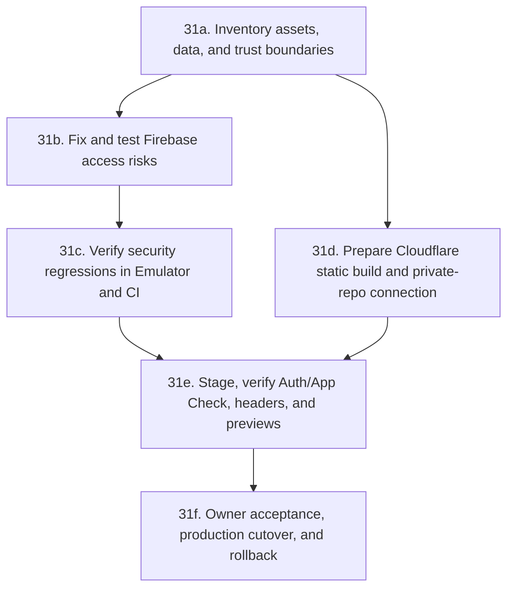
```mermaid
flowchart TD
    A[31a. Inventory assets, data, and trust boundaries] --> B[31b. Fix and test Firebase access risks]
    B --> C[31c. Verify security regressions in Emulator and CI]
    A --> D[31d. Prepare Cloudflare static build and private-repo connection]
    C --> E[31e. Stage, verify Auth/App Check, headers, and previews]
    D --> E
    E --> F[31f. Owner acceptance, production cutover, and rollback]
```

Suggested: gpt-6-astra · xhigh — invite and account rules expose sensitive student data if changed incorrectly, while production hosting/Auth cutover spans multiple owner-controlled services.

### 31a. Inventory site-copy and data-access boundaries

Suggested: sonnet · high — map the static browser bundle and each role's actual Firebase read paths before changing rules.

- [x] Inspect the exported `web/out` assets and source-map settings for private credentials, unintended student data, admin-only content, and client-side prompts. Record the result without copying any secret value into logs or this plan. Distinguish Firebase's public client config from service-account keys, private API keys, or bearer tokens.
- [x] Trace Firestore and Storage reads for anonymous visitors, ADM, trainer, student, and a second account with a different trainer. Include direct SDK/API access, not just hidden UI routes. Document which fields each role can receive and which outputs can be saved by design.
- [x] Confirm the invite threat model: exact-code lookup, code entropy, enumeration/rate controls, cancellation, legacy invites without expiry, and which PII/health fields are stored in the invite document. Treat a valid invite link/code as a credential that may be copied or forwarded.
- [ ] Confirm current deployed Firestore/Storage rules, App Check enforcement, AI Logic authentication settings, Auth authorized domains, and repository visibility with the owner-controlled consoles; record code-vs-console drift.
- [x] **Done when:** a concise risk register names each exposed asset/data class, who can read it, how it can be copied, severity, and the enforcing layer (UI, Firebase rule, App Check, or backend); no claim equates obfuscation or hosting privacy with data authorization. Owner-console drift remains pending above.

### 31b. Reduce unauthorized Firebase data access

> **2026-10-05 — rules v4 narrows invite reads.** A spent invite (used, cancelled, revoked, expired) is now readable
> only by its trainer, an ADM and the account that claimed it; a live invite is still readable by any signed-in user
> who knows the code (the claim reads it before the account exists), and a missing code still answers "invalid".
> Tests: `web/rules/firestore.rules.test.ts` "reading an invite (rules v4)" (6 of the 11 fail against v3, proving they
> discriminate) and the two claim messages in `dataLayer.test.ts`. Cost on the phone: a spent code now ends in
> PERMISSION_DENIED, so `AuthRepository.claimInvite` shows its "account already linked" text instead of "código já
> utilizado" — an Android wording fix, not made. **Still open:** live invites remain readable to anyone holding the
> code (32-bit random codes; stronger codes or a callable need the Android/iOS claim to change), and the ADM's whole-
> document read of `users/{uid}`.

Suggested: opus · xhigh — invite claims, ADM profile access, shared rules, and Gemini requests cross identity and sensitive-data boundaries.

- [ ] Minimize invite documents so code lookup returns only claim-required fields. Evaluate stronger random codes, safe cancellation/expiry behavior, and abuse throttling. Preserve the existing Android/iOS claim flow without source edits; if a sound fix needs a client migration or backend, document options and stop for an explicit scope decision before making that change.
- [ ] Review broad ADM reads of `users/{uid}`. Decide whether a separate least-privilege admin directory/backend is needed so ADM screens do not receive student health/contact fields merely to list trainers. Do not rely on Firestore rules to hide selected fields within one document; test trainer creation, promotion, billing, recovery, and directory flows after any approved data-shape change.
- [x] Verify role/ownership checks on every Firestore and Storage path, including list versus get, cross-trainer access, disabled accounts, and exact invite claims. Add Emulator tests for anonymous, unrelated authenticated user, same trainer, different trainer, student, and ADM cases.
- [ ] Verify App Check enforcement and authenticated-use settings for Firebase AI Logic, and whether direct Gemini calls can bypass the trainer-only UI. Set practical quota/abuse controls at the service boundary; treat the `localStorage` usage counter as non-authoritative.
- [x] Confirm no private server credentials ship in Git history, `web/out`, browser source maps, or `NEXT_PUBLIC_*` variables. If an actual credential was exposed, remove it and coordinate owner-side rotation; public Firebase config and reCAPTCHA site keys are expected in a web client.
- [ ] **Done when:** automated direct-access tests prove least privilege for all roles, invite responses contain only claim-required data, and remaining risks that require Android/iOS edits or owner decisions are explicit rather than silently bypassed.

### 31c. Keep security behavior covered

Suggested: sonnet · high — Firebase Emulator tests should catch rule regressions before either static host is changed.

- [x] Add or update Firestore/Storage Emulator tests for every access boundary changed in 31b, including both current Web flows and compatible legacy clients where their rules behavior is shared.
- [x] Run the repository's existing web lint, unit tests, static build, and rules emulator suite; add the rule suite to CI if it is not already a required check. Do not mark rule work complete based only on UI visibility.
- [ ] **Done when:** CI exercises the revised authorization rules and all positive and negative role tests pass without edits to Android/iOS source.

### 31d. Prepare Cloudflare Pages without exposing production

Suggested: sonnet · medium — the app already exports static files; the main changes are build settings, root-path URLs, and host configuration.

- [x] Prove the Cloudflare-compatible static build settings locally: project root `web`, Node 24, `npm ci`, `npm run build`, output directory `out`, and no GitHub Pages `NEXT_PUBLIC_BASE_PATH`. The clean root export and root routes/assets (`/convite/`, `/entrar/`, account and dashboard routes) returned HTTP 200; GitHub Pages base-path compatibility also builds.
- [ ] Verify invite claiming and Firebase Auth action links end-to-end on an isolated preview at the root path; static route responses alone do not verify those Firebase flows.
- [ ] If the owner chooses Cloudflare Git integration, request access only to this repository and document the required GitHub App permissions. Keep the source repository visibility unchanged unless the owner separately chooses to change it.
- [ ] Configure an isolated preview using a staging Firebase project, or protect it with Cloudflare Access and prove production Firebase credentials/data are not reachable from the preview. Check both the branch preview and immutable deployment URL.
- [ ] **Done when:** a preview build serves every exported route at the intended root URL, production is untouched, and the private-source/public-output distinction is documented for the chosen GitHub plan and Cloudflare setup.

### 31e. Verify web identity, anti-abuse, and response headers

Suggested: opus · high — domain allowlists, reCAPTCHA, Auth action links, and CSP can break or weaken sign-in when misconfigured.

- [ ] On the approved staging host, verify sign-in/out, role routing, password reset, email verification/change continuation links, invite claim, Firestore and avatar access, and App Check from a real browser session. Add the staging and final production hostnames to Firebase Auth authorized domains and the reCAPTCHA Enterprise site-key allowlist only after owner approval.
- [ ] Verify deployed AI Logic App Check/auth enforcement and Firebase rule versions in their consoles; test that a copied invite URL/code or direct API call cannot read unrelated private fields.
- [ ] Configure a report-only Content Security Policy and suitable `X-Content-Type-Options`, `Referrer-Policy`, `Permissions-Policy`, and frame policy through Cloudflare Pages `_headers`; review violations and then enforce a policy that keeps required Firebase/reCAPTCHA/Auth flows working.
- [ ] **Done when:** staging checks pass for all three roles, network responses do not contain data beyond each role's need, preview access is intentional, and the live response headers match the approved policy.

### 31f. Owner production cutover and rollback

Suggested: sonnet · medium — domain and account changes are external operations with an explicit rollback path.

- [ ] Present the risk register, Cloudflare plan/build evidence, required Firebase console changes, GitHub App scope, estimated hosting limits/costs, and rollback steps for owner approval. Do not change DNS, connect a repository, publish Firebase rules, or disable GitHub Pages as part of local implementation.
- [ ] After explicit owner approval, deploy to Cloudflare, verify the production custom domain and `pages.dev` exposure policy, Firebase Auth/App Check, role flows, response headers, and error logs. Keep the previous Pages deployment recoverable until acceptance.
- [ ] **Done when:** the owner has accepted the observed public-site behavior and role data boundaries, the chosen host/domain is live, and documented rollback has been tested without modifying Android/iOS source.

## 32. Feature — Branded Firebase e-mails: the verification, password and e-mail-change mails, and the page their link opens
(2026-10-05, via `/newgoal`)

> **PENDING until the Blaze plan (2026-10-08, owner decision).** Saving any Authentication → Templates change shows
> "As atualizações de modelos de e-mail não estão disponíveis para este projeto… entre em contato com o suporte do
> Firebase". The owner concluded the console does not allow template edits (and so a custom action URL for them) without
> a Blaze account; Firebase's message itself only says to contact support, so the Blaze link is **unconfirmed** — a
> support ticket (text in the 2026-10-08 conversation) can settle it. Everything in the repository is done and live
> (the `/acao/` page, `web/email/`, the docs); only the console items below wait. The public-facing name already
> works and is done. Resume: when Blaze exists (or support enables templates), start at 32c "Probe the editor".

**The request:** "vamos personalizar esse email para ter uma cara mais atrativa para meu programa" — with a
screenshot of the verification mail §27 sends to a new student.

**Goal type: Feature** — an additive polish of three flows that already work (§27 verification, §7/§26h
password reset, §29 e-mail change). Nothing is broken; nothing in `firestore.rules`, Android or iOS changes.
Research is done (2026-10-05) and recorded in 32a. This plan **extends §27h's one-line "template" item**
(which only asked for a sender name and a short body) — do 32c instead of that item, not both.

**What the screenshot shows (baseline, read from the image 2026-10-05):**
- **Subject** `Verifique seu e-mail do app project-681428046020` and **signature** `Equipe do app
  project-681428046020`: `%APP_NAME%` is Firebase's *public-facing name*, which is still the auto-generated
  `project-<project number>` (the number is `messagingSenderId` in `web/src/data/firebaseConfig.ts`). This is the
  ugliest thing in the mail and a **30-second console fix** (32c) — no code.
- **Sender** `noreply@personalapp-88129.firebaseapp.com` — Firebase's default sender; no brand, default avatar.
- **Body** is Firebase's stock pt-BR text: a bare "Olá," (accounts here have no Auth display name — the name
  lives in Firestore `users/{uid}.name`), the action link printed as a raw ~700-character URL, no colours, no
  button, no wordmark.
- **The link** opens `https://personalapp-88129.firebaseapp.com/__/auth/action?mode=verifyEmail&…&continueUrl=<the
  invite page>&lang=pt-BR` — Firebase's default, unbranded handler page on a `firebaseapp.com` address; only its
  "Continuar" brings the person to the site. (`lang=pt-BR` is `auth.languageCode`, set in `web/src/data/firebase.ts`.)
- Do **not** copy that link or its one-time code into the repo or any doc.

**What is and is not within reach on the free Spark plan** (the project stays on Spark — §3, §23e):

| Part of the e-mail | Controlled by | Reachable now? | Where |
|---|---|---|---|
| Name in subject/signature (`%APP_NAME%`) | Console → Project settings → *Public-facing name* | Yes | 32c |
| Sender name, reply-to, subject, body (HTML if the editor keeps it) — per template, per language | Console → Authentication → Templates | Yes | 32c–32d |
| The page the link opens (branded, one-click "Continuar") | Console *Customize action URL* + **our own page** | Yes — a static page, no server | 32e, 32g |
| Sender address / domain, deliverability (spam folder) | Custom domain (DNS) or custom SMTP | Needs a domain the owner does not have yet | deferred, 32h |
| Full layout freedom, logo image, web fonts | Own sending backend (Admin SDK link + a mail provider) | Needs Blaze (§3 refused it) | deferred, 32h |

**What the research changed (five lines):**
1. **Two of the three biggest wins cost no code**: the public-facing name and the template text/sender name are
   console settings. They are done by hand (32c) and the repo keeps the exact text it pastes (32d) because the
   console has no versioning.
2. **The branded page is the real code work.** A custom action URL makes Firebase send the person to a page *we*
   host, with `mode`, `oobCode`, `apiKey`, `continueUrl` and `lang` appended; the page finishes the job with
   `applyActionCode` / `checkActionCode` / `verifyPasswordResetCode` + `confirmPasswordReset`. The site is a static
   export, so this is an ordinary client route (`/acao/`), the same family as `/convite/` — no server.
3. **`continueUrl` arrives in the query string, so it is attacker-controlled.** The handler must only send the
   person on to the site's own origin and base path, never to an arbitrary address (open redirect / phishing).
   This is the one security-relevant piece and gets a test.
4. **The action URL is set per template and applies to every client** (web, Android's `sendPasswordResetEmail`,
   iOS): after the switch an Android reset link lands on the web page, which is a browser page today as well
   (Firebase's hosted one) — no regression, but it means the handler must fully work **before** the console is
   switched, and a broken handler would break password recovery for everyone. Hence 32g's order and rollback.
5. **No image, no web font in v1.** The site's wordmark is typographic ("no approved logo file" —
   `web/src/app/_shared/Wordmark.tsx`), many mail clients block remote images by default, and one old report says
   `` shows in the console preview but not in the delivered mail. A table-based HTML wordmark ("ALLU" + orange
   full stop + "personal") on the ink-dark band works everywhere and matches the site (direction B "Energia").

**Not touched by this section (explicit, to stop scope creep):** Android/iOS source; `firestore.rules` (no rules
change, so `firestore-rules/versions/` and `check:rules-version` are not involved); the in-page waiting room
`convite/VerifyEmailPanel.tsx` copy (it already tells people to check spam); e-mail-link (passwordless) sign-in and
SMS (§27 "not touched"); multi-factor mails; any language other than pt-BR; sending any e-mail from code other than
the three Firebase already sends; Cloud Functions / Blaze; a custom sender domain or SMTP (decision only, 32h).

**Where this executes:** `web/` on a branch from `main` → PR (CI gates lint, tests, build); the Firebase-console
steps are the owner's, by hand. Commit each verified item on its own; do not push without being asked.
**The rollout order is the whole risk** (32g): merge and deploy the page → prove it live → only then switch the
console's action URLs, **verification first, password reset last**.

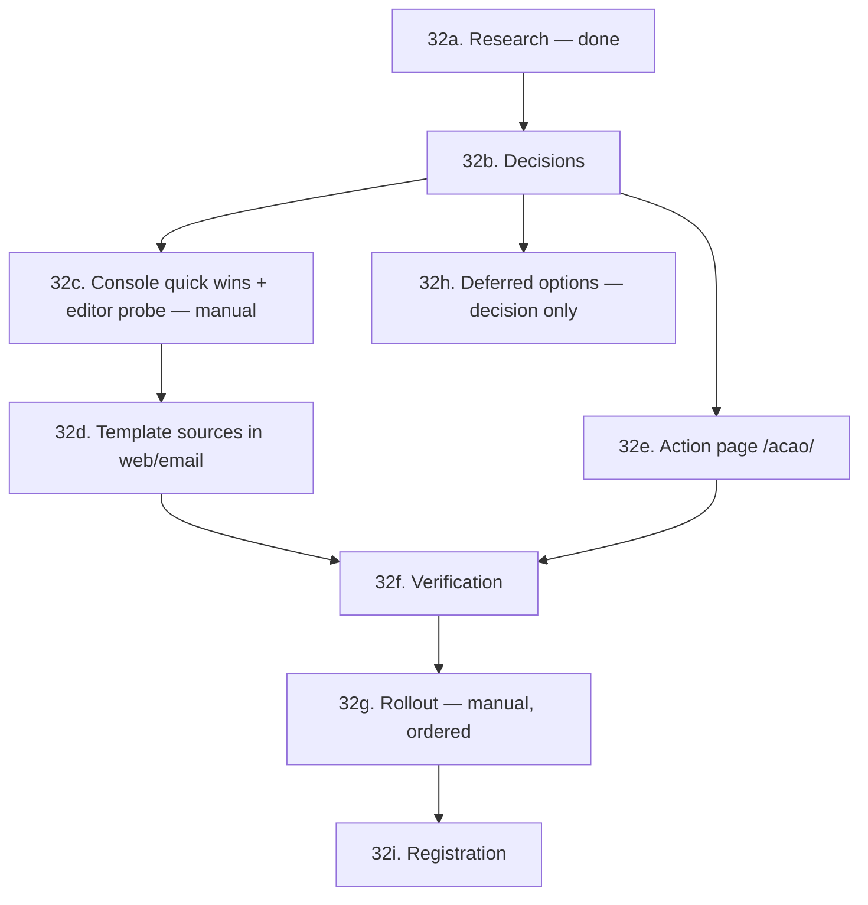
```mermaid
flowchart TD
    A[32a. Research — done] --> B[32b. Decisions]
    B --> C[32c. Console quick wins + editor probe — manual]
    B --> E[32e. Action page /acao/]
    C --> D[32d. Template sources in web/email]
    D --> F[32f. Verification]
    E --> F
    F --> G[32g. Rollout — manual, ordered]
    B --> H[32h. Deferred options — decision only]
    G --> I[32i. Registration]
```

Suggested: sonnet · high — ordinary web work, except the action page (one-time auth codes, an open-redirect guard,
the password-reset path every role depends on) and the console switch that points every client at it.

**32a. Research — what the platform allows (checked 2026-10-05)**

Suggested: sonnet · medium — already done; kept so none of it is looked up twice.

- [x] **Verified in Firebase's own docs/help:** the console's *Templates* tab edits, per email type, the sender
      name, the sender address, the reply-to, the subject and the message; placeholders are `%LINK%`, `%APP_NAME%`,
      `%EMAIL%`, `%DISPLAY_NAME%` and, for the change mail, `%NEW_EMAIL%`; `%APP_NAME%` is the *Public-facing
      name* on the Settings page; a template can set its own **action URL** and Firebase appends `mode` and
      `oobCode` (the custom-handler guide lists `apiKey`, `continueUrl`, `lang` too)
      (<https://support.google.com/firebase/answer/7000714>,
      <https://firebase.google.com/docs/auth/custom-email-handler>).
- [x] **Handler recipe (same guide):** `verifyEmail`/`recoverEmail`/`verifyAndChangeEmail` →
      `applyActionCode(auth, oobCode)` (`checkActionCode` first when the old address must be shown);
      `resetPassword` → `verifyPasswordResetCode(auth, oobCode)` then `confirmPasswordReset(auth, oobCode,
      newPassword)`; the handler may live "on Firebase Hosting or another platform" — i.e. on our Pages site.
- [x] **HTML is an intended capability:** the Identity Platform config's `EmailTemplate` carries `bodyFormat:
      PLAIN_TEXT | HTML`, and `notification.sendEmail.method` is `DEFAULT | CUSTOM_SMTP`
      (<https://docs.cloud.google.com/identity-platform/docs/reference/rest/v2/Config>).
- [x] **Custom domain** for the From and the link domain = DNS TXT + CNAME records, up to 24 h to verify, one SPF
      record per domain (<https://firebase.google.com/docs/auth/email-custom-domain>); needs a domain.
- [x] **Quotas** (<https://firebase.google.com/docs/auth/limits>): Spark — verification mails 1,000/day, e-mail
      change mails 1,000/day, password-reset mails 150/day. Plenty; no plan restriction on templates is stated.
- [x] **Own sending** exists — Admin SDK `generateEmailVerificationLink` / `generatePasswordResetLink` /
      `generateVerifyAndChangeEmailLink` return the link and "the developer emails it with a custom SMTP"
      (<https://firebase.google.com/docs/auth/admin/email-action-links>) — but it runs server-side (Blaze).
- [x] **NOT verified (docs summaries disagree, or silent) — resolved by hand in 32c, not assumed here:**
      (1) whether the console editor really keeps HTML, inline styles and tables, or shows plain text only (the
      Help article lists the message as editable for some types only; the custom-handler guide says HTML is
      supported); (2) whether `` survives in the *delivered* mail (a 2017 firebase-js-sdk report says the image
      proxy breaks it — not confirmed or refuted since); (3) whether template editing needs anything beyond Spark (a
      third-party blog claims Blaze; Firebase's limits page names no such rule); (4) which console template
      `verifyBeforeUpdateEmail` (§29) uses and whether its link's `mode` is `verifyAndChangeEmail`; (5) that
      `%NEW_EMAIL%` is filled in that mail; (6) the real expiry of each link (do not put a number in the copy until
      read from the docs/console); (7) whether *SMTP settings* needs the Identity Platform switch or billing (32h).

**32b. Decisions (owner — recommended defaults are written in; change them here, not mid-build)**

Suggested: haiku · low — a short list the owner confirms or edits.

- [x] **Scope** (default taken as written, 2026-10-05): console copy + own action page now (tiers 1–2 of the table above); custom domain / SMTP / own
      sending stay deferred (32h). *Default: yes.*
- [x] **Brand string** (default taken as written, 2026-10-05): **`ALLU personal`** for the public-facing name and the sender name — what the site's tab
      title, header and landing already say (`web/src/app/layout.tsx`, `Wordmark.tsx`). The Android app's name
      "Personal Tracker" is not used in mails. If the §23m rename lands, only the public-facing name (and the
      wordmark in the three template files) change, because bodies/subjects use `%APP_NAME%`. *Default: yes.*
- [x] **Header** (default taken as written, 2026-10-05): typographic wordmark, no image (see "What the research changed" 5). Revisit when an approved
      logo file exists. *Default: yes.*
- [x] **Action page route** (default taken as written, 2026-10-05): `/acao/` (ASCII, Portuguese, like `/entrar/` and `/convite/`), one page for every mode
      and every client. *Default: yes.*
- [ ] **Reply-to:** an address the owner actually reads, chosen by the owner in the console; **never committed**
      (the source repo may be public — §31). *Default: owner picks.*
- [x] **Greeting** (default taken as written, 2026-10-05): no `%DISPLAY_NAME%` (it renders empty here). *Default: yes.*

**32c. Console quick wins + editor probe (manual)**

Suggested: haiku · low — a click list, plus writing down what the editor actually does.

- [x] **(manual) Public-facing name** (done 2026-10-08: Project settings → *Nome exibido ao público* = `ALLU personal`; verified by a real reset mail whose subject and signature now say "ALLU personal" instead of `project-681428046020`) → Firebase console → Project settings → General → *Public-facing name* =
      `ALLU personal`. Done when the next verification/reset mail says "ALLU personal" in subject and signature.
- [ ] **(PENDING — needs Blaze)** **(manual) Probe the editor** on *Authentication → Templates → Password reset* (the safest template to test:
      the sender triggers it on their own account; 150/day): choose language **Português (Brasil)**; note whether the
      message box accepts HTML, a `<table>`, inline `style=""`, a `<a href="%LINK%">` button, an ``; whether an
      HTML-comment/unsupported tag is stripped on save; any size limit. Send the real mail to your own address
      (`Entrar → Esqueci minha senha`, or the ADM's reset button) and read it in **Gmail web and Gmail on the phone,
      light and dark**. Record the findings under this item (dated). Done when the findings answer 32a(1)–(2).
- [ ] **(PENDING — needs Blaze)** **(manual) Map the templates:** trigger an **e-mail change** from `/app/conta` (§29) on a test account and note
      which template renders, the `mode=` in the link, and whether `%NEW_EMAIL%` is filled (32a(4)–(5)). Done when the
      mapping is written here and 32d knows how many template files it needs.
- [ ] **(PENDING — needs Blaze)** **(manual) Template language:** make sure the **pt-BR** variant is the one customised, **and** that the
      default/English variant is not left stock — Android's reset mail does not set `languageCode`. Done when a mail
      requested with and without `languageCode` both arrive branded.
- [ ] **(PENDING — needs Blaze)** **(manual) Read the link expiries** the console/docs state for verification, reset and change links (32a(6));
      write them here only if the mail copy will mention them (default: it does not).

**32d. Template sources in the repo**

Suggested: sonnet · medium — fiddly HTML for mail clients, low risk; the lint test is what keeps it honest.

- [x] (done 2026-10-05) `web/email/verify-email.html`, `web/email/reset-password.html`, `web/email/change-email.html` (+
      `recover-email.html` only if 32c shows a template that needs it), each the **exact text pasted into the
      console**, plus `web/email/README.md` with: the subject and sender name per file, the paste steps, the
      placeholders used, and "the console has no versioning — this folder is the record". Done when each file is
      one self-contained HTML fragment using only Firebase placeholders.
- [x] **Design (direction B "Energia", mail-safe)** — done 2026-10-05: `<table role="presentation">` layout, `max-width:560px`,
      inline styles only, `font-family: Arial, Helvetica, sans-serif`; page background `#faf9f7`; white card with
      `1px solid #e6e3de` and 6 px corners; **header band `#12161c`** with "ALLU" in white heavy type, the full stop
      in `#fb923c`, and "personal" small in `#e6e3de`; heading 22 px `#12161c`; body 16 px / 1.5; **button**
      `background:#c2410c;color:#ffffff;font-weight:700;padding:14px 28px;border-radius:6px` (tap target ≥44 px,
      white-on-orange ≈5.2:1) with `bgcolor` on the cell for Outlook; muted footer 12 px `#575c66`; every cell sets
      its own background so a client's dark-mode inversion cannot make text vanish; **no ``, no `<style>`, no
      `<script>`, no remote font**.
- [x] **Copy (pt-BR, same tone as the site)** — done 2026-10-05; `change-email.html` leaves `%NEW_EMAIL%` out until 32c shows it fills (it says "este é o novo endereço" instead): *verify* — subject `Confirme seu e-mail no %APP_NAME%`, heading
      "Confirme seu e-mail", "Falta um passo para usar o %APP_NAME%: confirme que %EMAIL% é o seu endereço.",
      button "Confirmar meu e-mail"; *reset* — subject `Redefina sua senha do %APP_NAME%`, heading "Crie ou
      redefina sua senha", "Recebemos um pedido para criar ou redefinir a senha de %EMAIL% no %APP_NAME%." (it
      also serves the trainer the ADM creates in §26h, who sets a first password), button "Definir minha senha";
      *change* — subject `Confirme seu novo e-mail no %APP_NAME%`, heading "Confirme o novo e-mail", button
      "Confirmar novo e-mail" (use `%NEW_EMAIL%` only if 32c proved it fills). Every file ends with a plain
      fallback — "Se o botão não abrir, copie e cole este endereço no navegador: %LINK%" — and "Se não foi você,
      ignore este e-mail: nada muda na sua conta." Sender name `ALLU personal`.
- [ ] **(PENDING — needs Blaze)** **Only if 32c shows the editor is plain-text only:** add a short `*.txt` sibling per template (heading line,
      one sentence, `%LINK%`, the ignore line) and paste that instead. Skip otherwise.
- [x] **Test** (done 2026-10-05: 16 tests; the pure linter is `src/domain/authEmailTemplates.ts` and "fails a template with an  added" is the proof it can fail) `web/src/domain/authEmailTemplates.test.ts` (reads `web/email/*.html` with `node:fs`): each file has
      `%LINK%` in an `href` **and** as visible fallback text; uses `%APP_NAME%`; no `%DISPLAY_NAME%`; has no
      `<script`, `<style`, `<link`, `` added.

**32e. The branded action page `/acao/`**

Suggested: sonnet · high — one-time auth codes, an open-redirect guard and the password-reset path; the pure parts
carry the tests.

- [x] (done 2026-10-05) **First read** `web/AGENTS.md` and the relevant guide under `web/node_modules/next/dist/docs/` (this Next is
      not the one models remember: `useSearchParams` and static export, `params` as a Promise); follow `/convite`
      (`web/src/app/convite/page.tsx`, `InviteClaim.tsx`) for the Suspense + client-component shape.
- [x] (done 2026-10-05; 15 tests) **Pure rules** `web/src/domain/authAction.ts` (+ `.test.ts`, no Firebase, no clock):
      `parseActionLink(search)` → `{ mode, oobCode, continueUrl, lang }` with `mode` narrowed to
      `verifyEmail | resetPassword | recoverEmail | verifyAndChangeEmail | null`; `safeContinueUrl(raw, origin,
      basePath)` → the URL **only if** its origin equals `origin` and its path starts with `basePath`, otherwise
      `null` (the page then offers `/entrar/`); keeps the full query (§29's `accountEmailChange=confirmed` must
      survive); `actionErrorMessage(code, mode)` for `auth/expired-action-code`, `auth/invalid-action-code`,
      `auth/user-disabled`, `auth/user-not-found`, `auth/weak-password`, network. Tests: a `continueUrl` on another
      host, `javascript:`, `//evil.example`, a different port, a base-path escape (`/Personal_app_android/../x`) and
      userinfo (`https://site@evil`) are all rejected; the invite URL from `verificationContinueUrl` passes.
- [x] (done 2026-10-05; 8 tests) **Data** `web/src/data/authAction.ts` (+ `.test.ts` with the same mock style as `account.test.ts`): thin
      wrappers — `inspectAction` (`checkActionCode`), `applyVerification` (`applyActionCode`), `previewReset`
      (`verifyPasswordResetCode`), `submitNewPassword` (`confirmPasswordReset`); after a successful *verify* in a
      browser where the same account is signed in, call `confirmVerified` (§27, `data/emailVerification.ts`) so the
      invite page it returns to is already verified and the rules see the fresh token — best effort, errors
      swallowed. Done when each wrapper's call order and the swallow are asserted.
- [x] (done 2026-10-05; the title is the page's own `metadata`, as `/convite` does, not a `layout.tsx`) **Page** `web/src/app/acao/page.tsx` + `ActionClient.tsx` + a `layout.tsx` title (like `/entrar`), inside
      `PublicShell` and the existing `auth-card` styling; extend `globals.css` only (no new stylesheet; text ≥12 px,
      controls ≥44 px, fields 16 px). States, all in pt-BR with a heading that takes focus:
      *loading* → *success* / *error* per mode — **verifyEmail / verifyAndChangeEmail**: applied on load, "E-mail
      confirmado" + **Continuar** (to `safeContinueUrl`, else `/entrar/`); **resetPassword**: show the address, new
      password + confirmation (same minimum as the rest of the site), "Senha atualizada" + **Entrar**, never signs in
      by itself; **recoverEmail**: explicit confirm button, never applied on load; **unknown/missing mode or code**:
      "Link inválido" + `/entrar/`; **expired/used**: say so and say what to do ("volte à página do convite e
      toque em Reenviar" / "peça outro link em Entrar → Esqueci minha senha"). The `oobCode` stays in memory; the
      page makes no request until `mode` and `oobCode` are both present.
- [x] **Fits the CSP** (checked by inspection 2026-10-05: the page's only network calls are the Firebase Auth SDK's, same as `/convite`; the header is Report-Only and is served only by a Cloudflare host, not by GitHub Pages or the dev server, so it could not be loaded under it here) (`web/public/_headers`): no new origin is needed — `identitytoolkit.googleapis.com` is in
      `connect-src`. Done when the page loads under that header with no new violation in the console.
- [x] (done 2026-10-05; run against the emulator for verify, reset and change — it issues no recovery code for `verifyBeforeUpdateEmail`) **Local helper** `web/scripts/action-link.mjs <email> [verify|reset]`, mirroring `scripts/verify-email.mjs`:
      reads the Auth emulator's `oobCodes`, takes the newest code of that type for the address and prints
      `http://localhost:3000/acao/?mode=…&oobCode=…&continueUrl=…` (the emulator's own `oobLink` points at its own
      page, not ours). Emulator-only, like its sibling.

**32f. Verification**

Suggested: sonnet · medium — mostly re-running the project's own gates, then driving the page end to end.

- [x] (done 2026-10-05) From `web/`: `npm test`, `npm run lint`, `npx tsc --noEmit` (`npx next typegen` first on a fresh checkout),
      `npm run build`, and the static build with `NEXT_PUBLIC_BASE_PATH=/Personal_app_android` (the page must work
      under the sub-path and end its route in `/`). `npm run test:rules` is not needed (no rules change) — say so.
- [x] (done 2026-10-05, record below) **Drive it on the emulators** with the Browser pane (`npm run dev:local`; DOM/text and console, not desktop
      screenshots): sign up on `/convite` → get the handler URL with `action-link.mjs` → the page confirms and
      **Continuar** returns to the invite → opening the same URL again shows the expired/used state; request a reset
      → handler URL → set a password → sign in with it; a `continueUrl=https://evil.example/` falls back to
      `/entrar/`; no `mode` shows "Link inválido"; check the layout at 375 px and desktop width.
- [ ] **(PENDING — needs Blaze)** **Visual check of the real mails is the owner's:** ask for a screenshot of each mail (Gmail web and phone,
      light and dark) and say which state it should show — do not capture the desktop.
- [x] Done when all gates are green and the end-to-end run above is recorded here with its date.
      **Record (2026-10-05):** `npm test` 462/462 (45 files), `npm run lint` and `npx tsc --noEmit` clean, static build
      green at the root and with `NEXT_PUBLIC_BASE_PATH=/Personal_app_android` (`/acao` among the 27 routes).
      Driven in the Browser pane against the **shared** Auth emulator (another session's — so no re-seed; fresh
      `acao-*@teste.dev` accounts made through the Auth REST API instead of `/convite`, which needs a seeded
      invite): verify link → "E-mail confirmado", `Continuar` = the invite URL, account `emailVerified` true, no
      console errors; the same link again → the spent-code message; `continueUrl=https://evil.example/…` → only
      "Ir para Entrar" (`/entrar/`), no external link rendered; reset link → mismatch error, then "Senha
      atualizada", the new password signs in and the old one is refused; change link → "Novo e-mail confirmado"
      with `?accountEmailChange=confirmed` kept on `Continuar`; no or unknown `mode` → "Link inválido"; the 375 px
      layout read correctly. **Not driven:** `recoverEmail` (the emulator issues no recovery code for
      `verifyBeforeUpdateEmail`; its branch is covered by the data tests) and the §27 round trip through
      `/convite`'s "Já confirmei" (`confirmVerified` is unit-tested). The other session reset the shared emulator
      mid-run; the reset check was repeated on a fresh account right after.

**32g. Rollout (manual, in this order — wrong order breaks links)**

Suggested: sonnet · high — an ordered owner checklist; the step that points every client at the new page is the
risky one, which is why it is last and per template.

- [x] (done 2026-10-06: PR #14 merged as `840df67`, `web-deploy` succeeded; `/acao/` answers 200 live, checked 2026-10-08) **Merge and deploy:** PR → CI green → merge → `web-deploy.yml` publishes to Pages. Then open
      `https://alexmiguel011014-stack.github.io/Personal_app_android/acao/` live: it must load (200) and show
      "Link inválido" with no parameters. **Do not touch the console before this passes.**
- [ ] **(manual) Authorized domains:** Authentication → Settings → Authorized domains lists
      `alexmiguel011014-stack.github.io` (§27h already asks for this; a custom action URL needs it too).
- [ ] **(PENDING — needs Blaze)** **(manual) Paste the templates** from `web/email/` (sender name, subject, body, reply-to) for *Email address
      verification*, *Password reset* and the change template (32c's mapping), in the pt-BR language variant. The
      action URL is still Firebase's default at this point, so nothing can break yet. Send a real mail per template
      to your own address and read it (Gmail web + phone). Done when each looks as designed, or 32d is adjusted.
- [ ] **(PENDING — needs Blaze)** **(manual) Switch the action URL, one template at a time**, to
      `https://alexmiguel011014-stack.github.io/Personal_app_android/acao/`: **verification first** (a real
      `+alias` sign-up through `/convite` — the link must confirm, return to the invite, and "Já confirmei" must
      pass), then the **change** template (an e-mail change from `/app/conta`), then **password reset last** (reset
      the owner's own ADM account and sign in with the new password, **before** telling anyone). Done when each
      template has been proven end to end after its own switch.
- [ ] **(PENDING — needs Blaze)** **Rollback, written down before the first switch:** in the console, clear the custom action URL (or reset the
      template to default) — links already sent keep working because the one-time code is the same under either
      handler; nothing in the data changes. Keep a second ADM account (§26) signed in while testing the reset.
- [ ] **(PENDING — needs Blaze)** **Done when:** all three templates are branded, their links open `/acao/` and complete, the rollback was read
      (not necessarily used), and the dated results are recorded here.

**32h. Deferred options (decision only — none are built by this section)**

Suggested: haiku · low — recording a decision, not doing work.

- [ ] **Custom sender domain** — fixes "comes from `firebaseapp.com`" and helps the spam folder; needs a domain the
      owner owns, DNS TXT + CNAME records and up to 24 h (32a). Worth doing when the project has a domain (it would
      also serve the §31 Cloudflare move). Record the owner's decision.
- [ ] **Custom SMTP** (console *Templates → SMTP settings*, API `CUSTOM_SMTP`) — Firebase's own templates sent
      through the owner's mail provider; improves the sender and deliverability, **not** the layout. Whether it needs
      the Identity Platform switch (§26k/§27h already weigh that switch) or billing is **unverified** — read the
      console before deciding. Record the decision.
- [ ] **(PENDING — needs Blaze)** **Own sending** (Admin SDK link + a mail provider, full HTML, logo, fonts) — needs a server, i.e. Blaze (§3,
      §30). Revisit only if the console templates prove too limited (32c) *and* Blaze is accepted for other reasons.
- [ ] **Trigger to revisit:** students report the mail in spam, or the owner wants a logo/web-font layout.

**32i. Registration**

Suggested: haiku · low — documentation so the new thing is findable, last because it describes what exists.

- [x] (done 2026-10-05) `CLAUDE.md` → "Web front": a short paragraph — the e-mails are Firebase's, branded through the console
      from `web/email/` (no versioning there); links open `/acao/` once the console's action URLs are switched;
      `safeContinueUrl` is the only thing that may redirect from it; no image/web font in mails; rollout order.
- [x] (done 2026-10-05) `web/README.md`: replace the §27 "Templates" console step with a pointer to a new *Branded Firebase e-mails
      (GOALS.md §32) — console steps* section (32g's checklist), add the `/acao` row to the Routes table, and
      document `scripts/action-link.mjs` next to `verify-email.mjs`.
- [x] (done 2026-10-05) GOALS.md: mark §27h's template item "superseded by §32c" and tick this section's items with dates as they are
      verified; record 32b's decisions and 32c's findings in place.
- [x] **Done when** (2026-10-05): a reader who has never seen this plan can find, from `CLAUDE.md` or `web/README.md`, where the
      templates live, how to change them, and how the link page works.

## 33. Feature — Hide the trainer's exercise-reference table: out of the prompts, the screen, the public files and the bundle
(2026-10-06, via `/newgoal`)

**Superseded in part by §34 (2026-10-07):** 33c's web templates (single / multi / Gemini system instruction, `buildWebFichaPrompt`) and 33e's review screen with the Gemini tab were replaced by one static `ficha_prompt_format.md` and the unified ficha editor. What §33 built stands: the gated `appData/exerciseCatalog` document and rules v6, the muscles filled in by name at save, the per-muscle volume totals and the volume-adjust request, the ≤3 "Quis dizer…?" names, and the leak test / build scan / `e2e:ficha-privacy` guards.

**The request:** for "gerar ficha com meia ajuda da IA" (the copy-and-paste prompt, §25f) the prompt shows the
reference table — the ruler paragraph followed by every table — which comes from the trainer's own PDF (§5, the
2026-08-17 note; §25c). The owner does **not** want that, nor "any information that points to the PDF", visible: they
want all of it hidden "com o máximo de rigor possível" on the site, **while the AI-assisted ficha flow keeps working**.

**Goal type: Feature** — a bounded change to a flow that works (nothing is broken; the owner's requirement changed).
It borrows from Fix (a leak inventory first) and Process (a repo-exposure decision list, 33i) as minorities; the
Feature module governs. Research is done (2026-10-06) and recorded in 33a so nothing is looked up twice.

**The short answer to the owner — what the research found (verified by reading the code and by fetching the live site):**
1. **It is worse than "the prompt shows it".** `web/scripts/copy-prompt-assets.mjs` and `build-exercise-catalog.mjs`
   publish the table as two ordinary files under `/prompt/` of the static site, and **anyone on the internet — no
   login — can download both** (checked live 2026-10-06: HTTP 200 on the Markdown table and on the JSON catalog).
   The same table also goes to Google inside the Gemini tab's system instruction, visible in every trainer's
   network panel. Hiding only the prompt would leave the front door open.
2. **The repository is PUBLIC** (`gh repo view` → `PUBLIC`): the Android asset
   `app/src/main/assets/hypertrophy_volume_reference.md` is readable at github.com / raw.githubusercontent.com
   (HTTP 200 anonymously), it is in the git history, and this very file (§5, the 2026-08-17 note) pastes a condensed
   copy and names the PDF. Android is off-limits for this work, so that part is a **decision for the owner (33i)**,
   not something this section can finish — and it is the biggest residual exposure.
3. **A static site cannot hide data from the browser that computes with it.** Anything the page uses is, in the end,
   in that browser's memory and network panel. What *can* be done on the free Spark plan, and what this plan does:
   (a) the AI prompts carry **no table at all** (so nothing to see on screen, nothing in the clipboard, nothing sent
   to Google); (b) the table moves out of every public file and out of the JS bundle into **one Firestore document
   that only an approved, active trainer (and the ADM) can read** (rules v6); (c) the UI stops naming the table or
   listing its rows; (d) **tests and a build scan make a re-leak fail CI**. The only *complete* concealment is
   computing on a server (Cloud Function → Blaze) — recorded as decision D4 (33i), **not** enabled here.
4. **Without the table the AI no longer does the exact volume arithmetic.** It is told only to produce exercise names
   plus sets × reps; the **site** (which still has the table, behind the gate) fills in each exercise's muscles and
   the per-muscle volume it already shows on the review screen. To keep the loop useful, 33e adds a "ask the AI to
   adjust the volume" helper that sends back **aggregated** totals only — never a coefficient. Trade-off, stated plainly:
   the first draft may sit further from the weekly target than today's; the review screen and the helper close the gap.

**Who can see the reference, before → after this section:**

| Who / where | Today | After 33 |
|---|---|---|
| Anyone on the internet (no login) | downloads the Markdown table and the JSON catalog from `/prompt/` | nothing — the files are gone from the site (and a scan keeps them gone) |
| Signed-in student, or a trainer who is suspended / billing-locked | the same public files | nothing — rules v6 deny the document |
| Approved, active trainer | the whole table on screen (the prompt textarea, the clipboard), a full "Catálogo" dropdown, "tabela" wording | **no table on screen, in prompts or in the clipboard**; still reachable by **DevTools** (the document is in their browser's memory/network), plus the per-muscle totals and ≤3 "did you mean" names the review screen computes — the residual of any client-side design (D3, D4) |
| Google (Gemini tab) | receives the full table in every chat | receives no table |
| Anyone reading the repository | Android asset, `GOALS.md` paste, PDF file name, git history | unchanged by this section except the `GOALS.md` paste/name (33j); the Android asset and history are **D1** |

**Not touched by this section (explicit, to stop scope creep):** Android and iOS — source, assets, `WorkoutParser.kt`,
`GenerativeAiService`, the phone's own prompt and its copy of the table (the phone is authoritative for what it
stores and keeps working as is); the "boneco 3D" / muscle-map figure (a separate plan — note its working label was
also "§32", now taken by the branded e-mails, so it needs the next free number when it lands); the document shape of
`workouts` (`exercises[].muscleActivation` stays, 33a-S6); billing, accounts, e-mails; enabling Blaze or deploying a
Cloud Function; rewriting git history; changing the repository's visibility (33i is decisions only).

**Where this executes:** `web/` plus `firestore.rules` (rules **v6**) on a new branch from `main` → PR (CI gates
lint, tests, build, the new leak scan). **Never publish the rules, never run the publish script against production,
never merge or push** without the owner asking — those are 33h's manual, ordered steps. Commit each verified item on
its own. Numbering: §33 because §32 is the branded e-mails on `main`.

```mermaid
flowchart TD
    A[33a. Findings — done] --> B[33b. Decisions]
    B --> C[33c. Prompts without the table]
    B --> D[33d. Hidden delivery - Firestore document + rules v6]
    C --> E[33e. Review screen, editor copy, volume helper]
    D --> E
    E --> F[33f. Guards - leak tests, build scan, CI]
    F --> G[33g. Browser verification]
    G --> H[33h. Rollout — manual, ordered]
    B --> I[33i. Repo exposure — decisions only]
    H --> J[33j. Docs and registration]
    I --> J
```

Suggested: opus · high — a security-motivated change across prompts, the data layer, UI and rules; the rules, the
gated delivery and the rollout order (33d, 33h) are the part that cannot be retried casually.

**33a. Findings — where the reference reaches a reader today (verified 2026-10-06)**

Suggested: haiku · low — already done; kept so none of it is rediscovered.

- [x] **S1 — the copyable prompt.** `FichaEditor.tsx` builds it with `buildMultiFichaPrompt` (new fichas) or
      `buildFichaPrompt` (existing ficha), splices the whole table in at `$TABLE_PLACEHOLDER$`, shows it in a
      `<textarea aria-label="Prompt">` and writes it to the clipboard. Templates: `web/prompt/ficha_prompt_multi.md`
      (web-only), `app/src/main/assets/ficha_prompt_template.md` (Android's, used for an existing ficha).
- [x] **S2 — the Gemini tab.** `GeminiPanel.tsx` splices the table into `web/prompt/ficha_system_gemini.md` and
      `data/gemini.ts` sends it as the system instruction from the browser (network panel; Google receives it).
- [x] **S3 — public static files.** `scripts/copy-prompt-assets.mjs` copies the Android table and template into
      `web/public/prompt/`; `scripts/build-exercise-catalog.mjs` writes `public/prompt/exercise-catalog.json` (every
      exercise with its muscles and coefficients); `data/promptAssets.ts` and `data/exerciseCatalog.ts` `fetch` them.
      Gitignored, but **deployed**: both return HTTP 200 anonymously on the live site.
- [x] **S4 — the review screen** (`MultiFichaReview.tsx`): a dropdown listing **every** catalog exercise with its group
      ("Escolher exercício no catálogo…"), the labels "Usei a tabela" / "Ativação do catálogo", and the per-muscle
      effective-volume table (numbers). The numbers are an **oracle**: typing one exercise shows its row of the table.
- [x] **S5 — UI wording** that names the table: `FichaEditor.tsx` ("Aguarde o carregamento da tabela de exercícios…",
      the "Já tenho a tabela de exercícios no meu projeto de IA" switch, "Carregando tabela…"), `GeminiPanel.tsx`
      ("já conhecendo a tabela de exercícios e ativações musculares", "carregar a tabela de referência"),
      `MultiFichaReview.tsx` ("Não foi possível carregar a tabela…", "Carregando tabela…"); `SHORT_TABLE_NOTE` in
      `domain/fichaPrompt.ts` ("…está nos arquivos do meu projeto…") is itself a pointer.
- [x] **S6 — stored data (accepted, not changeable here).** `workouts/{id}.exercises[].muscleActivation` holds the
      coefficients of the exercises actually prescribed; the phone writes and reads the same field, and no student
      screen displays it (grep: only the editor, the review and `domain/`). Readable under the existing rules only by
      the owning trainer and the linked student. This **cannot** reconstruct the table, only the rows used.
- [x] **S7 — repository and history.** Public repository; the Android asset; this file's pasted table and PDF file
      name (§5, around lines 225–430); one fixture label in `web/src/domain/exerciseCatalog.test.ts`; git history.
- [x] **S8 — copies already out.** Whatever was fetched or cached before the next deploy (browser caches, GitHub
      Pages' short cache, search/archive crawlers). Hiding is forward-looking; the table is already disclosed to
      anyone who looked (D2).
- [x] **S9 — what does NOT need hiding** (kept on purpose): the web-only templates' format rules, the generic weekly
      bands ("4–8 / 12–20 séries por grupo", public science, already on the review screen), the muscle labels (plain
      anatomy), the Android parsing format `Nome SxR [Músculo:coef]` that `workoutParser.ts` still reads (phone parity).

**33b. Decisions (owner — the recommended default is already written in; change it here, not mid-build)**

Suggested: haiku · low — recording choices; nothing is built here.

- [ ] **(manual) Delivery of the table to the editor.** Default: **one Firestore document, `appData/exerciseCatalog`,
      readable only by an approved active trainer and the ADM, writable only by the ADM** (rules v6, 33d). Rejected:
      keeping a static file or a bundled constant (public), obfuscation/encoding (not security), Remote Config
      (fetchable without sign-in), Storage (needs Blaze). Alternative: a callable Function (D4, Blaze).
- [ ] **(manual) Unrecognised exercise names on the review screen.** Default: **no full list**; show "sem ativação
      calculada" and up to **3** closest names as "Quis dizer…?" (`domain/exerciseCatalog.ts` already finds one close
      match). Alternative: no suggestions at all (stricter, more manual fixing).
- [ ] **(manual) Numbers on the review screen.** Default: keep the per-muscle effective-volume **numbers** (the §25e
      feature the trainer asked for) and accept the oracle (33a-S4) as a residual. Alternative: show only the band
      words ("abaixo do mínimo / na faixa ideal / acima") — fewer clues, less useful.
- [ ] **(manual) The "I already have the table in my AI project" switch.** Default: **remove it** (its note is a pointer
      and there is no table left to keep). Alternative: an ADM-only private short prompt — not recommended.
- [ ] **(manual) The "adjust volume" helper (33e).** Default: **yes** — a button that sends back aggregated totals
      ("Peitoral 8 séries efetivas — abaixo da faixa 12–20") so the AI can rebalance without ever seeing a coefficient.
- [ ] **(manual) Source of the table for the publish script.** Default: the Android asset (it is what exists);
      `CATALOG_SOURCE=<path>` overrides it, so the owner can later keep a private copy outside the repository (D1).
- [ ] **Done when:** each default above is either confirmed or replaced here with a dated note.

**33c. Prompts without the table**

Suggested: sonnet · high — prompt wording drives what the AI returns and what the parser accepts; small mistakes
silently break the paste flow, so every change gets a test against the real parser.

- [x] **A web-only single-treino template, `web/prompt/ficha_prompt_single.md`**, for *editing an existing ficha*: the
      phone's template (Android asset, not to be changed) asks for `[Músculo:coeficiente]` blocks that only make sense
      with the table. The new one asks for one treino title + `Nome SÉRIESxREPS` lines, no brackets, one code block,
      same rules as the multi template. Done when: `FichaEditor.tsx` uses it for an existing ficha and a pasted
      reply of that shape parses through `applyPaste` to the same exercises.
      **Done (2026-10-06):** `ficha_prompt_single.md` written; `FichaEditor.tsx` uses it for an existing ficha; `fichaPrompt.multi.test.ts` proves its own worked example reads through `parseWorkouts`/`applyPaste` (one treino, three exercises, no muscle blocks).
- [x] **Rewrite `web/prompt/ficha_prompt_multi.md` and `web/prompt/ficha_system_gemini.md`**: remove the table section
      and its placeholder, "exatamente como está na tabela de referência", every mention of coefficients, the scale
      and the RIR adjustments "da tabela"; replace with "use nomes comuns de exercícios em português, sem marca de
      equipamento" and a **generic** volume paragraph (distribute the weekly target across the returned treinos; direct
      work counts fully, merely assisting work counts less — **no numbers other than the public bands 4–8 / 12–20**).
      Example exercises in the templates must be generic names that are **not** rows of the catalog (a test in 33f
      proves it). Keep the output-format rules (one code block, `Treino A — foco`, `Nome SxR`, JSON schema for
      Gemini) byte-compatible with what `parseWorkouts` / `treinosFromAi` read. Done when: neither file contains
      `$TABLE_PLACEHOLDER$`, "tabela", "coeficiente", "régua" or "PDF", and the parser tests still pass.
      **Done (2026-10-06):** Both rewritten (generic names and generic volume paragraph; the output-format rules unchanged, the multi example still splits into Treino A/B/C). The examples use names that are not catalog rows — `domain/referenceLeak.test.ts` (33f) is what proves it against the real source. A line added for the 33e volume helper: "se eu te enviar depois um resumo do volume por músculo, ajuste as séries…".
- [x] **`domain/fichaPrompt.ts`**: delete `SHORT_TABLE_NOTE` and the `shortPrompt` option; the web builders drop the
      `volumeReference` parameter (add `buildWebFichaPrompt(template, student, request, { deidentify })` = template +
      profile block + request). `buildFichaPrompt` and `TABLE_PLACEHOLDER` **stay** for Kotlin parity (its test reads the
      phone's template and table from the repository, never at runtime). Done when: nothing under `web/src/app` or
      `web/src/data` references `TABLE_PLACEHOLDER`, `volumeReference` or `SHORT_TABLE_NOTE`.
      **Done (2026-10-06):** `SHORT_TABLE_NOTE`, `shortPrompt`, `buildMultiFichaPrompt` removed; `buildWebFichaPrompt(template, student, request, { deidentify })` added and it **throws** if a template still carries the placeholder; `buildFichaPrompt`/`TABLE_PLACEHOLDER` kept for phone parity with its test untouched. grep finds no use of them under `web/src/app` or `web/src/data`.
- [x] **`data/promptAssets.ts` + `scripts/copy-prompt-assets.mjs`**: `PromptAssets` loses `volumeReference` and the
      Android template; gains `singleTemplate`; the script copies **only** the three web-only templates and **deletes
      stale generated files** (`hypertrophy_volume_reference.md`, `ficha_prompt_template.md`, `exercise-catalog.json`)
      from `public/prompt/` so an old local build can never ship them. Done when: after `npm run build`,
      `out/prompt/` holds only the three web-only templates.
      **Done (2026-10-06):** `PromptAssets` is now `{ singleTemplate, multiTemplate, geminiSystem }`; the script copies only the three web templates (list shared with the build scan in `scripts/lib/webTemplates.mjs`) and deletes the stale reference/template/JSON files. Verified by the build: `out/prompt/` holds exactly those three (33f scan).
- [x] **`GeminiPanel.tsx`**: the system instruction is `assets.geminiSystem` as is (no splice); the intro and error
      lines stop naming a table. Done when: the instruction string passed to `startFichaChat` is asserted table-free.
      **Done (2026-10-06):** The panel passes `assets.geminiSystem` unchanged to `startFichaChat`; intro and error lines no longer name a table; `aiGemini.test.ts` asserts the instruction file carries no placeholder.

**33d. Hidden delivery — one gated document, rules v6, no public file**

Suggested: opus · xhigh — Firestore rules, an ADM write path, a manual production seeding step and a deploy that
removes public files; a wrong order makes the editor lose its catalog for real users.

- [x] **Rules v6** (`firestore.rules`, header `// Rules version: 6`, archive `firestore-rules/versions/v6.rules`
      identical, `npm run check:rules-version` green): `match /appData/{docId}` — `allow get` only for `docId ==
      'exerciseCatalog'` and `isSignedIn() && (isAdmin() || isOwningTrainer(request.auth.uid))` (reuses the existing
      helpers: role `TRAINER`, not suspended, billing current); `allow list: if false`; `allow create, update` only
      `isAdmin()` and a shape check (`keys().hasOnly(['version','exercises','updatedAt'])`, `version` string ≤ 64,
      `exercises` a list of 1–300, `updatedAt` int); no delete; students and everyone else denied. Add the collection
      to the schema comment at the top of the file. Done when: the file and `v6.rules` are identical and the CI guard passes.
      **Done (2026-10-06):** v6 written (`appData/{docId}`: `get` only for `exerciseCatalog`, ADM or `isOwningTrainer(request.auth.uid)`; no list; ADM-only create/update with a shape check; no delete), archived as `firestore-rules/versions/v6.rules`, `check:rules-version` green. NOT published — that is 33h, the owner's.
- [x] **Rules tests** in `web/rules/firestore.rules.test.ts` ("the exercise catalog document (rules v6)"): anonymous,
      student, suspended trainer and billing-locked trainer **cannot get it**; active trainer and ADM **can**; nobody can
      list or query the collection; trainer and student cannot write; ADM can write a valid document and cannot write
      extra keys, a non-list `exercises`, an empty or oversized list, or delete. Per this repo's rule, run them once
      against v5 (`RULES_FILE=firestore-rules/versions/v5.rules npm run test:rules`) and record how many fail —
      `assertFails` on its own proves nothing. Done when: green on v6 and visibly red on v5.
      **Done (2026-10-06):** 15 tests. Full emulator suite 204/204 on v6. Against v5 only the 2 positive tests fail (v5 denies everything by default, so the negatives cannot show anything there); the negatives were proved with five mutated v6 copies (open-all, no shape check, no docId check, role-only, list open) — each mutant failed exactly the test that guards it.
- [x] **Data layer** — `data/exerciseCatalog.ts`: `loadExerciseCatalog(db)` reads `appData/exerciseCatalog` with
      `getDoc`, parses it with the existing `parseCatalog`, keeps the result **in module memory only** (never
      `localStorage`/IndexedDB; the SDK is on its default memory cache — verified), and **clears it on sign-out**
      (hook where the session signs out, `data/session.ts`); `permission-denied` becomes a plain "sem acesso ao
      catálogo" state; no `console.*` ever prints the document. Test through the emulator in `web/rules/` (a
      data-layer test beside `dataLayer.test.ts`): trainer gets it, student gets "sem acesso".
      **Done (2026-10-06):** `loadExerciseCatalog(db, uid)` reads `appData/exerciseCatalog`, memory-only cache per uid, cleared by `SessionProvider` whenever nobody is signed in, `CatalogAccessError` for permission-denied, no logging. Tested in `web/rules/exerciseCatalog.test.ts` (trainer gets it; student, suspended and billing-locked get the access error; cache/clear; unpublished and malformed documents).
- [x] **Builder becomes a library:** `scripts/build-exercise-catalog.mjs` keeps `parseExerciseCatalog` and `--stdout`
      but **no longer writes under `public/`**; `predev`/`prebuild` in `package.json` stop calling it; its tests
      (`domain/exerciseCatalog.test.ts`) change accordingly and use a small **synthetic** catalog, not real rows.
      **Done (2026-10-06):** `build-exercise-catalog.mjs` is parse-only; the source and the CLI moved to `scripts/lib/catalogSource.mjs` (`CATALOG_SOURCE` override); `predev`/`prebuild` only copy the web templates; `exerciseCatalog.test.ts` now uses a synthetic catalog (the real source is checked for structure only).
- [x] **Publish script (owner-run), `scripts/publish-exercise-catalog.mjs` + `npm run catalog:publish`**: reads the
      source (`CATALOG_SOURCE` or the Android asset), builds the catalog, signs in as the ADM (e-mail from env or
      prompt, password from env or a hidden prompt — **never stored, never logged, never in the repository**), writes
      `appData/exerciseCatalog` with `{ version, exercises, updatedAt }`, prints only the version and the count.
      Emulator mode via the existing `NEXT_PUBLIC_FIREBASE_EMULATORS`. Done when: against the emulators with the
      seeded `admin@teste.dev` it creates the document and the editor reads it; a second run with an unchanged
      source reports "already up to date".
      **Done (2026-10-06):** Written and exercised against the emulators by `rules/exerciseCatalog.test.ts`: creates the document as an ADM, prints only version and count (the test checks the password and content are not printed), a second run says "Already up to date", a non-ADM or wrong password writes nothing. Deviation from the plan: it defaults to the EMULATORS and needs `--production` (plus typing the project id) for the real project, instead of reading `NEXT_PUBLIC_FIREBASE_EMULATORS`.
- [x] **Seed:** `scripts/seed-emulators.mjs` also writes the catalog document (same builder), so `dev:local`, the e2e
      scripts and the rules tests have it; update the header comment. Done when: after `npm run seed:emulators` the
      document exists and `dev:local` shows recognised exercises on the review screen.
      **Done (2026-10-06):** Writes `appData/exerciseCatalog` from the same builder (a warning, not a failure, when the source is missing); verified by the browser test: after `reseed()` the trainer reads the document (REST 200) and the review recognises exercises.
- [x] **Done when:** no file the build copies or generates under `web/public/` contains any exercise row, the ruler
      or the table's headings (33f proves it), and the editor loads the catalog only through Firestore.
      **Done (2026-10-06):** Verified twice: the clean static build scanned by `check:leak` (175 text files, `out/prompt/` = the three web templates) and the browser test (old `/prompt/` table and catalog files 404, the phone's template 404, every loaded script free of phrases, the editor reading the catalog only via Firestore).

**33e. Review screen, editor copy and the volume helper**

Suggested: sonnet · medium — UI wording and one small pure function with tests; behaviour of saving is unchanged.

- [x] **Remove the full catalog dropdown** from `MultiFichaReview.tsx` (the "Catálogo" `<optgroup>` and its group
      suffixes); keep only up to **3** "Quis dizer…?" suggestions from a new pure `suggestExercises(catalog, name,
      limit = 3)` in `domain/exerciseCatalog.ts` (token-overlap ranking, deterministic, tested on a synthetic catalog).
      Done when: no screen lists more than 3 catalog names, and an unrecognised name says "sem ativação calculada —
      o volume não conta este exercício" with the suggestions (if any).
      **Done (2026-10-06):** The "Catálogo" `<optgroup>` and its group suffixes are gone from `MultiFichaReview.tsx`; `suggestExercises` (cap `MAX_SUGGESTIONS = 3`, enforced inside) and `offeredSuggestions` (the close match first) in `domain/exerciseCatalog.ts`, tested on a synthetic catalog; the row shows "Quis dizer:" buttons ("Usar …") for at most 3 names, or "Sem ativação calculada — o volume não conta este exercício." (browser check: 33g).
- [x] **Neutral wording everywhere** (33a-S5): "Usei a tabela" / "Ativação do catálogo" → a neutral "Músculos reconhecidos"
      / "Ajustado à mão"; "Carregando tabela…" / "…carregamento da tabela de exercícios…" / "…carregar a tabela de
      referência…" → "Carregando dados dos exercícios…" / "Não foi possível carregar os dados dos exercícios; os
      músculos não serão calculados automaticamente."; remove the short-prompt switch and its state from
      `FichaEditor.tsx`; the Gemini intro says the AI "monta os treinos" and the site "calcula os músculos". Done
      when: `grep -ri "tabela" web/src/app` finds no user-visible string about the reference.
      **Done (2026-10-06):** All the strings moved to `domain/editorCopy.ts` (`EDITOR_COPY`, so the leak test in 33f can read them); the short-prompt switch was removed in 33c; `grep -ri tabela web/src/app` now finds only the unrelated billing sentence in `BillingSection.tsx`. **Found while executing, not in the plan:** the single-ficha editor's "Músculos" column printed every exercise's coefficients (a table row verbatim) — it now says "calculados" or "—" (`FichaEditor.tsx`).
- [x] **Volume numbers per 33b.** If the default holds, keep them. If the owner chose bands-only, `MultiFichaReview.tsx`
      shows `volumeBand(sets).label` only and the numeric column goes. Either way the screen never shows a single
      exercise's row (only totals across the included treinos).
      **Done (2026-10-06):** Default kept (the per-muscle numbers are totals across the included treinos; no single exercise's row is shown). The owner's choice in 33b is still open; bands-only would be a one-column change in `MultiFichaReview.tsx` and in the editor's volume list.
- [x] **The volume helper** (`domain/volumeFeedback.ts`, pure, tested): `buildVolumeAdjustMessage(volume)` turns the
      review's per-muscle totals into one pt-BR paragraph — muscles below 12, above 20, and the numbers — and **nothing
      else** (no exercise names, no coefficients). Gemini tab: an "Ajustar volume" button sends it through the
      existing follow-up path (`buildAdjustMessage` style) and the answer reopens the review; copy tab: a "Copiar
      pedido de ajuste de volume" button copies it. Done when: tests prove the message contains only muscle labels,
      totals and band words, and that an all-ideal plan produces "nada a ajustar" instead of a request.
      **Done (2026-10-06):** `domain/volumeFeedback.ts`: `includedVolume`, `buildVolumeAdjustMessage` (only muscles ≥ 4 effective sets that are below 12 or above 20; null when nothing to adjust), tested. Wired in the UI: the review shows the request in a read-only box with "Copiar pedido de ajuste de volume", and the Gemini tab has "Ajustar volume com o Gemini" (sends it through the same chat). Typecheck/lint/unit tests only so far — the click-through is 33g.
- [x] **Unit tests for the prompt flow** (`fichaPrompt*.test.ts`, `aiGemini.test.ts`, `fichaRequest.test.ts` as needed):
      update the ones that expected a table; add: the multi and single prompts for a sample student contain the
      profile, the request and the format rules and **no** placeholder.
      **Done (2026-10-06):** Done in 33c (`fichaPrompt.multi.test.ts`: both web templates, `buildWebFichaPrompt`, no placeholder, deidentify; `aiGemini.test.ts`: the instruction file carries no placeholder); `fichaPrompt.test.ts` (the phone's prompt) is untouched. Unit suite 487/487.

**33f. Guards — a re-leak must fail the build**

Suggested: sonnet · high — the guard is only as good as its sentinels; a vacuous pass is the failure mode to design out.

- [x] **Sentinel set, `web/scripts/lib/referenceSentinels.mjs`**, derived at run time from the source
      (`CATALOG_SOURCE` or the Android asset, via `parseExerciseCatalog`): the document title line, the ruler
      paragraph's first sentence, the section headings, the PDF's file name and the words "hypertrophy_volume_reference"
      and "exercise-catalog", plus **every exercise name**. **If the source cannot be read, or yields no sentinels,
      the guard FAILS** (never passes vacuously); `LEAK_SENTINELS_FILE` can supply a list when the source has moved.
      **Done (2026-10-06):** `loadSentinels()` derives, at run time from the source, the title and every heading of 3+ words, the first five words of each prose line, and every exercise name (50 names, 18 phrases today), plus two file-name phrases; it THROWS when the source is missing/empty or yields nothing (proved in the unit test). `LEAK_SENTINELS_FILE` replaces the source; deviation: the reference's original file name is not written in any tracked file — the owner supplies it with `LEAK_EXTRA_PHRASES=a|b` (documented in 33j). `findLeaks`/`isLeak` never return the matched text.
- [x] **Leak unit test** (`domain/referenceLeak.test.ts`): every text the product can put in front of a user or send to
      an AI — the three web templates, `buildWebFichaPrompt` for both flows, the Gemini system instruction,
      `buildAiUserMessage`, `buildAdjustMessage`, `buildVolumeAdjustMessage`, and the user-visible strings of the editor,
      review and Gemini components (exported constants, not scraped JSX) — contains **no sentinel**, no
      "tabela de referência", "coeficiente", "régua", "PDF", and, from the exercise names, **no match at all in the
      templates' examples** and **fewer than 3 distinct names** anywhere else (a lone generic word like "Stiff" in an
      example is not a leak; a pasted list is). Done when: it fails if a row of the real table is pasted into any template.
      **Done (2026-10-06):** 37 tests: the three templates, the built prompts (multi, single, deidentified, Gemini user message, follow-up, volume request), every `EDITOR_COPY` sentence and the source of the four editor components carry no phrase, no name (templates/prompts/copy tolerate 0, components fewer than 3) and none of the naming words; it catches a pasted prose line, heading or three names and is not trigger-happy about one. Proved to discriminate: appending 1.5 KB of the real table to the multi template made 3 tests fail; restored, 37/37.
- [x] **Build scan, `web/scripts/check-no-reference-leak.mjs` (`npm run check:leak`)** over `web/out/`: fails when any
      file (HTML, JS, JSON, CSS, `.md`, `.map`) contains a title/ruler/heading/file-name sentinel, or **3+ distinct
      exercise names**, or when `out/prompt/` holds anything but the web-only templates, or when any source map exists.
      Prints file + sentinel kind, never the matched table text. Done when: seeding `web/public/prompt/` with a copy
      of the old table makes it fail (prove it once, then undo), and a clean build passes.
      **Done (2026-10-06):** Clean build (`NEXT_PUBLIC_BASE_PATH=/Personal_app_android`): 175 text files scanned, `out/prompt/` holds exactly the three web templates, exit 0 (this also verifies 33c's `copy-prompt-assets` item). Proved to fail: with the old table, a catalog JSON and a source map dropped into `out/`, it listed 6 problems and exited 1; cleaned, exit 0. Never prints matched text.
- [x] **CI wiring:** a "No reference table in the build" step after `npm run build` in `.github/workflows/web-ci.yml`
      **and** in `.github/workflows/web-deploy.yml` (before "Upload Pages artifact", so a leaking site is never
      published). Done when: both workflows run it and fail the job on a hit.
      **Done (2026-10-06):** A "No reference table in the build" step (`npm run check:leak`) after the build in `web-ci.yml`, and after "Build static site" and before "Upload Pages artifact" in `web-deploy.yml`, whose stale "prebuild copies the Android assets" comment was corrected. Not yet run on GitHub Actions (nothing was pushed).
- [x] **Convention for future tests:** tests and fixtures from now on use **synthetic** exercises, never real rows
      (the one real label left in `exerciseCatalog.test.ts` is replaced). Written in `web/README.md` (33j).
      **Done (2026-10-06):** Partly: the real label in `exerciseCatalog.test.ts` is gone (that file is now synthetic, and the real source is only checked for structure). Clarification found by scanning the repo: parser fixtures (`workoutParser.multi.test.ts`, `__fixtures__/multiFicha.ts`, `aiResponse.test.ts`…) use common gym exercise NAMES in the phone's `Nome SxR` format — names, never coefficients, notes or rows — and stay as they are; the rule is "no coefficients, no prose, no rows". The README sentence is 33j's.

**33g. Browser verification**

Suggested: sonnet · medium — the same headless-Chrome + emulator pattern as `e2e/account.mjs`.

- [x] **`web/e2e/ficha-privacy.mjs` (`npm run e2e:ficha-privacy`)**, signed in as the seeded trainer: opens a student's
      new-ficha screen; clicks "Copiar prompt"; reads the textarea and `navigator.clipboard` text and asserts no sentinel;
      reads the whole DOM text and every loaded script/response body for sentinels; asserts
      `GET /prompt/hypertrophy_volume_reference.md` and `/prompt/exercise-catalog.json` are **404** (dev server) and the
      three web-only templates are 200; pastes a synthetic AI answer, checks recognised exercises show their muscles
      and the per-muscle volume appears, an unrecognised one shows the "sem ativação" line with ≤3 suggestions and **no**
      dropdown of the full list; opens the Gemini tab and asserts its visible text names no table.
      **Done (2026-10-06):** Written and green: 40/40 on desktop and 40/40 at 390 px (Chrome headless over CDP against the emulators, like `account.mjs`). It reads the prompt textarea, the clipboard, the Gemini tab, the page text and all 24 loaded scripts; asserts the old public files 404; pastes an answer built from the source's own exercise names (none written in the file), checks recognised exercises, no dropdown, ≤3 suggestions per row, the volume table and the volume-adjust request; saves and checks `exercisesJson` carries `muscleActivation` for a recognised exercise and none for an invented one. Proved to discriminate: with the old table served from `public/prompt/` and appended to the multi template it went 36/40 (404 check, prompt on screen, prompt on clipboard failing); restored, 40/40. Deviation: proved by re-planting the leak rather than by checking out `main`'s old tree.
- [x] **Access checks** in the same script: signed in as the seeded **student** (`ana@teste.dev`) and as the suspended
      trainer (`suspended@teste.dev`), a direct Firestore REST read of `appData/exerciseCatalog` with their ID token is
      denied; as the trainer it succeeds; with no token it is denied.
      **Done (2026-10-06):** Firestore REST with real emulator ID tokens: trainer 200, ADM 200, student 403, suspended trainer 403, no token 403.
- [x] **Done when:** the script is green on desktop and 390 px, red against the pre-change code (prove once, then
      restore), and its recipe is added to `web/README.md` "Browser tests".
      **Done (2026-10-06):** Green 40/40 on desktop and 40/40 at 390 px; red when the leak is re-planted (36/40); the recipe is in `web/README.md` "Browser tests".

**33h. Rollout (manual, ordered — this is where real users could be hurt)**

Suggested: opus · xhigh — publishing rules, seeding production and a deploy that deletes public files; do it in this
order and stop at the first surprise. `/execgoals` prepares the PR and the exact checklist; **the owner runs these.**

- [ ] **(manual) 1. PR open, CI green** — including the new leak step. State in the PR, at the top, the order below.
- [ ] **(manual) 2. Publish rules v6** (console copy-paste or `firebase deploy --only firestore:rules` with the owner's
      login) **after diffing it against what is live**: the diff `versions/v5.rules` → `v6.rules` must show only the
      `appData` block and the schema comment. Never publish the Android branch's rules copy (its header numbers collide).
- [ ] **(manual) 3. Seed production once**: `npm run catalog:publish` signed in as the owner's ADM account; confirm in
      the console that `appData/exerciseCatalog` exists (version + exercise count). Do this **before** the merge: a
      deploy without the document leaves the editor with no muscles ("catálogo indisponível").
- [ ] **(manual) 4. Merge → the deploy publishes the site** (the artifact replaces the old one, so the two public files
      disappear). Wait out Pages' short cache (about ten minutes).
- [ ] **(manual) 5. Verify live:** `curl -I` the two old `/prompt/` URLs → **404**; the three web-only templates → 200;
      sign in as a real trainer → copy a prompt → the text has no table; paste a sample answer → muscles and volume
      appear; the Gemini tab runs; a student account cannot read the document (REST call → 403).
- [ ] **(manual) 6. Residual copies:** browsers that visited before keep the old files until their cache expires; web
      archives or search caches may hold them — the owner may request removal; nothing in this repository can undo it.
- [ ] **Rollback, written before step 2:** rules v6 are additive (leaving them published harms nothing). If the editor
      misbehaves after the deploy, revert the web PR **only** if the document is unreadable for trainers — and know that
      reverting re-publishes the public files, so prefer fixing forward (re-seed, or check the trainer's account status).
- [ ] **Done when:** steps 1–5 are done and dated here, with what step 5 returned.

**33i. Repository and server-side exposure — decisions only (none executed; Android/iOS stay untouched)**

Suggested: haiku · low — recording owner decisions with the facts needed to take them.

- [ ] **(manual) D1 — the public repository.** Facts: public; the Android asset, history, forks and clones hold the
      table; `GOALS.md` pastes a copy (33j trims it, history keeps it). Options: (a) accept; (b) make the repository
      private — GitHub Pages from a private repository needs a paid plan, so pair it with moving hosting to Cloudflare
      Pages (§31 already assesses readiness); (c) remove the asset and rewrite history — needs an Android change
      (the phone loads that asset) and does not recall existing copies. **Recommended: (b), together with the §31
      cutover.** Until decided this is the largest residual exposure.
- [ ] **(manual) D2 — already disclosed.** The table has been downloadable from the live site since the web launch
      and from the repository since August; treat it as seen by anyone who looked, and judge accordingly.
- [ ] **(manual) D3 — the numbers oracle** (33a-S4). Default accepts it; the stricter option is bands-only (33b).
- [ ] **(manual) D4 — the only complete fix: compute on a server.** A callable Function would receive exercise names
      and return muscles/volume (and could even call Gemini itself), so the table never leaves the server. It needs
      Blaze (§3, §30 — the owner has not enabled it, and this plan does not). Revisit if D1(a)/(b) is not acceptable or
      if an approved trainer is judged a threat. The client already reads the catalog through one seam
      (`data/exerciseCatalog.ts`), so swapping Firestore for a callable later does not touch the screens.
- [ ] **(manual) D5 — App Check enforcement on Firestore** (console) makes scripted scraping of the document with a
      stolen trainer token harder; check the console state and record it.
- [ ] **(manual) D6 — alias coverage.** After 33h, have a trainer generate three fichas with the AI app they use and
      count the exercises that needed a manual fix. If more than about a quarter, add synonyms **to the private source**
      that `catalog:publish` reads (never to a tracked file — a synonym list would reveal the catalog's names).
- [ ] **Done when:** each of D1–D6 has a dated decision here.

**33j. Docs and registration**

Suggested: haiku · low — documentation so the new rule is findable and the old exposure is trimmed; last because it
describes what exists.

- [x] **`CLAUDE.md` → "Web front":** one paragraph — the reference table is never shipped, prompted, bundled or named
      on screen; it lives only in the gated `appData/exerciseCatalog` document, seeded by `catalog:publish`; prompts
      carry names + sets × reps only and the site fills the muscles; the leak test/scan are the guard; **do not** reproduce
      rows, the ruler or the source's file name in any tracked file. Update the `domain/fichaPrompt.ts` row of the
      hand-port table (the phone's template/table are no longer copied to the web).
      **Done (2026-10-06):** New paragraph "The trainer's exercise reference is hidden (§33)"; the `buildFichaPrompt` row of the hand-port table now says the web no longer copies or uses the phone's template/table; the §25 paragraph says `copy-prompt-assets.mjs` copies only the three web templates; the rules paragraph lists v6.
- [x] **`web/README.md`:** replace lines 24–29 (the "copied to `public/prompt/`; the reference table stays
      single-sourced" paragraph); add `catalog:publish`, `check:leak`, `e2e:ficha-privacy`, the `CATALOG_SOURCE` and
      `LEAK_SENTINELS_FILE` variables, the synthetic-fixtures convention, and the 33h order; document the rules v6 block.
      **Done (2026-10-06):** The old "copied next to the shared Android assets" paragraph replaced by a section "The trainer's exercise reference stays hidden" (where it lives, `catalog:publish` incl. `--production`, the guards and `LEAK_*` variables, contributor rules incl. the synthetic-fixtures convention, what a static site cannot hide, the rollout order); `e2e:ficha-privacy` added to "Browser tests".
- [x] **`GOALS.md`:** mark §25a/§25c/§25f/§25i wording about the table in the prompt, the public catalog and the
      "já tenho a tabela" switch as **superseded by §33**; in §5's 2026-08-17 note **delete the pasted table block and
      replace the PDF's file name with "the trainer's reference PDF"** (history keeps them — D1); tick this section's
      items with dates as they are verified and record 33b's decisions and 33h's live results in place.
      **Done (2026-10-06):** A "Superseded in part by §33" note at the top of §25; in §5's 2026-08-17 note the pasted table block is replaced by a pointer and the PDF's file name by "the trainer's reference PDF"; two example lines elsewhere that carried a coefficient row (§15 annotation example, §25c test description) were neutralised. A scan of the tracked docs now finds no ruler, heading or PDF name (only the Android asset's own file name, which is public in the repository and cannot change here — D1). History keeps everything.
- [x] **Done when:** a reader who has never seen this plan can find, from `CLAUDE.md` or `web/README.md`, where the table
      lives, how to update it, which tests guard it, and what must never be committed; and a search of tracked
      documentation for the ruler, the headings or the PDF's file name finds nothing outside git history.
      **Done (2026-10-06):** Verified 2026-10-06: `CLAUDE.md` and `web/README.md` say where the reference lives, how to update it (`catalog:publish`), which tests guard it and what must never be committed; a scan of all tracked docs for the source's title, headings and prose openings finds nothing (the document title that was wrapped across two lines in §5 was the last hit and is trimmed), and none names the PDF. What remains is the Android asset's own file name (public in the repository; D1) and generic exercise names in old plan prose.

## 34. Feature — Fichas as simple named cards: a ficha is a named set of treinos, at most two per student, and the "Pedir à IA" card becomes one "Prompt de formatação de ficha"
(2026-10-06, via `/newgoal`)

**The request (owner, in Portuguese, with two screenshots — the student page's "Fichas" list and the "Nova ficha" page):**
"vamos ter que reescrever isso… refazer cada passo, e o que já tiver sido alterado na sessão passada você sobrescreve."
**Image 1 (student page):** replace the list with **one simple card per ficha — the name the trainer gave it plus its
modification date**. A new ficha makes "the card go down" and creates a new card with its own date. **At most 2 active
fichas; the third deletes the oldest.** No "Desativar" button — only **Editar** (which opens the *same screen as creating a
ficha*) and **Excluir**, the latter with a confirmation card saying "esse processo não pode ser desfeito".
**Image 2 (new ficha):** **the whole "Pedir à IA (opcional)" card is deleted.** In its place, **one card on top titled
"Prompt de formatação de ficha"** that tells an external AI how to build the ficha so the site accepts the format. The
ficha gets **an input to name it**, and then the rest continues — naming each treino too.

**Goal type: Feature** — a bounded change to flows that work (nothing is broken; the owner's design changed). One minority
of **cleanup** (code that dies with the removed card) rides inside it. Research is done (2026-10-06, by reading the code on
`claude/hide-reference-table` and the Firestore rules) and recorded in 34a so nothing is looked up twice.

**What this overwrites (so nobody "fixes" it back).** This section supersedes, where they conflict: §28 (the "Substituir a
ficha atual?" question, the one-previous-ficha history, `archivedAt`, `replaceFicha`); §25e/§25f/§25i (the multi-treino review
as a separate step, the request shortcuts, the **in-site Gemini tab**); §33c/§33e's **web prompt templates** (single / multi /
Gemini system instruction, `buildWebFichaPrompt`) and the "Incluir o nome e as restrições médicas" switch. What §33 built
**stays and must keep passing**: the gated `appData/exerciseCatalog` document and rules v6, the muscles filled in by name
at save, the per-muscle volume totals and the "adjust the volume" helper, ≤3 "Quis dizer…?" names, the leak test/scan and
`e2e:ficha-privacy` (the last one gets its clicks updated, not its assertions weakened).

**The short answer.** No new collection and **no rules change**: a ficha is the set of `workouts/{id}` documents that share
one web-only map field `ficha: { id, name, createdAt, updatedAt, order }`. The student page lists fichas as cards (name +
"Modificada em dd/mm/aaaa" + Editar + Excluir). Creating a third ficha first asks, then — in one atomic batch — creates the new
treinos and deletes **every treino of the oldest ficha and nothing else**. Editing opens the editor pre-filled with the whole
ficha (name + all treinos). Treinos that existed before this change (no `ficha` field) appear as **one** card, "Ficha atual",
so nothing disappears and nothing is deleted by the migration.

**Not touched (explicit, to stop scope creep):** Android and iOS (source, assets, the phone's own prompt; the phone keeps
reading and writing `workouts` as it does — it ignores the new field, and a phone save drops it, which only makes that treino
read as a legacy one); `firestore.rules` and `firestore-rules/versions/` (v6 stays exactly as it is); `workoutLogs` and the
progress charts (a ficha's deletion never touches a log); billing, accounts, e-mails, the ADM console (its Gemini counter keeps
reading old data); `parseWorkouts` / `applyPaste` / `parseWorkoutName` / `parseExercises` (Kotlin mirrors — **must not
change**); the exercise reference (§33); the student's logging screen (`aluno/treino`).

**Where this executes:** `web/` only, on a **new branch from `claude/hide-reference-table`** — this plan edits the files §33
rewrote (`editorCopy.ts`, `MultiFichaReview.tsx`, `volumeFeedback.ts`, the prompts, the leak guards), so it cannot start from
`main` until §33 is merged. PR, never merge or push without the owner asking. Commit each verified item on its own; every
commit must leave `npm test`, `npm run lint`, `npx tsc --noEmit` and `npm run build` green (hence the add-beside-then-remove
order in 34d/34h). Read `web/AGENTS.md` and the relevant guide in `web/node_modules/next/dist/docs/` before touching route code
(no new route is added: `/app/fichas/editar` only changes its query parameter, static export rules from §23f still apply).
Reply to the owner in Portuguese.

```mermaid
flowchart TD
    A[34a. Findings and decisions] --> B[34b. Model and pure domain]
    B --> C[34c. Data layer - create, save, delete]
    A --> D[34d. Format-prompt asset and guards]
    C --> E[34e. Ficha editor screen]
    D --> E
    C --> F[34f. Student page - simple cards]
    C --> G[34g. Student's own page - grouped]
    E --> H[34h. Remove what became dead]
    F --> H
    G --> H
    H --> I[34i. Verification - unit, emulator, browser]
    I --> J[34j. Rollout - manual]
    J --> K[34k. Docs and registration]
```

**34a. Findings and decisions**

Suggested: sonnet · medium — already researched; what is left is recording the owner's answers to the open choices.

What exists today (verified 2026-10-06 — do not re-research):
- A "ficha" is **one treino**: `workouts/{id}` = `{ trainerId, studentId, name, isActive, exercisesJson, createdAt, status
  ('draft'|'assigned'), assignedAt, archivedAt? }` (`domain/workouts.ts`, `data/converters.ts` `toWorkout`/`workoutToFirestore`).
  Status is derived (`withDerivedStatus`): active ⇒ `assigned` — the only thing firestore.rules let a student read.
- Student page `app/app/alunos/detalhe/WorkoutsSection.tsx`: three groups (Ficha atual / Ficha anterior / Outras), a status
  line and the full exercise list per treino, **Editar** (link `?aluno=&id=<workoutId>`) / **Desativar-Ativar** / **Excluir**
  (`window.confirm`). Only `StudentDetail.tsx` uses it.
- Editor `app/app/fichas/editar/FichaEditor.tsx` (597 lines): card "Pedir à IA (opcional)" (`RequestBuilder`, the "O que você
  quer…" textarea, two tabs — copy-and-paste and `GeminiPanel` —, "Incluir o nome e as restrições médicas", "Copiar prompt"
  with the student's profile) → card "Importador Inteligente" → either `MultiFichaReview` (≥2 treinos found) or a one-treino
  form → on save, if the student has an active treino, the "Substituir a ficha atual?" dialog → `replaceFicha`.
  Editing is per treino and always the one-treino form.
- `data/workouts.ts`: `loadStudentWorkouts` (trainerId + studentId, newest first), `loadMyWorkouts` (student: `status ==
  'assigned'`), `saveWorkout`, `saveWorkouts` (atomic batch), `deleteWorkout`, `replaceFicha` (§28). Tests for them live in
  `web/rules/dataLayer.test.ts` ("replacing a ficha (GOALS.md §28)") and `src/domain/fichaHistory.test.ts`.
- Student home `app/aluno/page.tsx` lists the assigned treinos flat (sorted by name); `aluno/treino/LogSession.tsx` opens one by id.
- Rules: on `workouts` the owning trainer creates/updates/deletes (create/update also require the student to be linked), a
  student reads only their own *assigned* ones; **no field is validated, so a new field needs no rules change**. Kotlin's
  mapper reads only the known fields and writes only those (§28 checked it), so an extra field is ignored by the phone.
- Nothing else reads `workouts` (checked with `git grep`: no dashboard, billing or ADM screen counts them). Logs carry
  `workoutId` + `exerciseName`; charts group by `exerciseName`, so deleting a treino never breaks a record.
- The Gemini modules (`data/gemini.ts`, `domain/ai{Errors,Request,Response,Usage}.ts`) and `RequestBuilder`/`fichaRequest.ts`
  are imported **only** by the card being deleted (and their own tests, and `referenceLeak.test.ts`). The ADM console shows
  a `geminiGenerated` counter from `trainerActivity`; old documents carry it.

Decisions (the defaults below are what 34b–34k build; the owner can change any of them before `/execgoals`):
- [x] **D1 — Data model:** a ficha = the treinos sharing `workouts/{id}.ficha = { id, name, createdAt, updatedAt, order }` (a
      single map, so it is all-or-nothing). Considered and not chosen: a `fichas/{id}` collection — it needs rules v7, a student
      read rule, and a two-document consistency the rules cannot check; the owner would have to publish rules again for no
      user-visible gain.
- [x] **D2 — Cap:** at most **2** fichas per student. Creating a third deletes the **oldest by creation** (`ficha.createdAt`),
      so editing a ficha never changes which one is "oldest" and the bottom card is always the one that goes.
- [x] **D3 — Order:** **newest on top**, for the trainer's cards and the student's page ("o card vai descer" = the existing card
      is pushed down by the new one).
- [x] **D4 — No active/inactive in the UI:** every treino the web saves is active (`isActive: true`, `status: 'assigned'`);
      "Desativar/Ativar" disappears. (A phone-side deactivation is overwritten the next time the ficha is saved on the web.)
- [x] **D5 — The card:** name + "Modificada em dd/mm/aaaa" + **Editar** + **Excluir**, nothing else (no exercise list, no
      status line, no treino count). To see a ficha's content the trainer opens **Editar**.
- [x] **D6 — Delete:** the shared `ConfirmDialog` (not `window.confirm`), text "Esse processo não pode ser desfeito."; it deletes
      that ficha's treinos in one batch; `workoutLogs` are never touched (same rule as §28).
- [x] **D7 — Confirmation before the third:** creating a third ficha first asks ("a mais antiga — «X» — será excluída para sempre.
      Esse processo não pode ser desfeito."). Not in the request; added because the deletion is automatic and irreversible
      (owner decision O2 in 34j: keep or drop).
- [x] **D8 — Existing data:** treinos without `ficha` that are **active** form **one** virtual ficha, "Ficha atual" (id
      `legacy`, date = their latest assignment/creation). It is a normal card: Editar (saving **adopts** it — the treinos get a
      real `ficha` map and the name the trainer typed) and Excluir. Treinos without `ficha` that are **inactive** (the §28
      history, drafts, hand-deactivated) are **hidden, never counted, never deleted** by the UI (owner decision O1 in 34j).
- [x] **D9 — The "Pedir à IA" card is deleted entirely**, including the in-site **Gemini** tab and the student-profile prompt;
      the Gemini code is deleted with it (git history keeps it; the `geminiGenerated` activity key stays so old counters render).
- [x] **D10 — The new card is formatting only:** a static text (no student data, no volume guidance, no persona) that tells an
      external AI how to answer so `parseWorkouts` can read it. The trainer pastes it into their own AI together with their own
      request. The ficha's name is **typed by the trainer**, never parsed from the AI's answer.
- [x] **D11 — Edit = the create screen, pre-filled:** ficha name + every treino; treinos can be added and removed; pasting an AI
      answer **replaces** the treino list (nothing is written until "Salvar ficha").
- [x] **D12 — Student's page:** the student sees **both** fichas, grouped under the ficha's name, newest first; treinos inside a
      ficha in the order the trainer saved them.
- [x] **D13 — Activity counter:** `fichaSaved` is recorded once per ficha saved (it used to count treinos).
- [x] **Done when:** the owner has read D1–D13 and either left them or changed them here, with the date (the answers to D2, D3, D7
      and D8 change code in 34b/34e/34f).
      **Done (2026-10-07):** the owner ran `/execgoals` after reading D1–D13 in the `/newgoal` report and changed none of them, so they stand as written.

**34b. Model and pure domain (no Firestore, no clock)**

Suggested: sonnet · high — it fixes the stored shape the phone also reads, and the grouping rules decide what is deleted later.

- [x] **`domain/workouts.ts`:** add `ficha: FichaMembership | null` to `Workout`, with `FichaMembership = { id: string; name:
      string; createdAt: number; updatedAt: number; order: number }`; **remove `archivedAt`** (§28) from the type and stop
      `withDerivedStatus` touching it (nothing reads it any more: hidden legacy treinos are recognised by `isActive` alone).
      Comment on the field: web-only, ignored by the phone, dropped by a phone save (that treino then reads as legacy).
      Done when: `npx tsc --noEmit` is clean once the callers in 34c–34h are updated.
      **Done (2026-10-06):** `FichaMembership` and `Workout.ficha` added with the web-only comment. **Deviation:** `archivedAt` is NOT removed here but in 34h together with `fichaHistory.ts`, which still reads it — removing it now would break the build between the two areas. `withDerivedStatus` is untouched until then.
- [x] **`data/converters.ts`:** `toWorkout` reads `ficha` **leniently** — an object with a non-blank string `id` and `name`; its
      numbers fall back (`createdAt` → the treino's `createdAt`, `updatedAt` → that, `order` → 0); anything else (absent, a
      string, an array, a missing id) ⇒ `null`, never a throw. `workoutToFirestore` writes `ficha` **only when non-null** (so a
      legacy or phone-shaped document is byte-for-byte what it was) and no longer writes `archivedAt` (an old document that has
      one keeps it harmlessly; nothing reads it). Done when: converter tests cover absent / malformed / partial / round trip /
      "a document without `ficha` serialises to exactly the old keys".
      **Done (2026-10-06):** `ficha()` reader (lenient, never throws) + write-only-when-set in `workoutToFirestore`; `converters.test.ts` covers absent / 13 malformed shapes / partial numbers / round trip / "a document without `ficha` has exactly the old keys". `archivedAt` writing is dropped in 34h with its field.
- [x] **`domain/fichas.ts` (new, pure) with `fichas.test.ts` beside it:**
      `MAX_FICHAS = 2`, `LEGACY_FICHA_ID = "legacy"`, `LEGACY_FICHA_NAME = "Ficha atual"`;
      `interface Ficha { id; name; createdAt; updatedAt; legacy: boolean; treinos: Workout[] }`;
      `groupFichas(workouts): Ficha[]` — **newest first** (`createdAt` desc, id as tie-break). Real fichas = treinos grouped by
      `ficha.id` (whatever their `isActive`); name from the member with the greatest `updatedAt`, `createdAt` = the smallest,
      `updatedAt` = the greatest. The virtual ficha = treinos with `ficha === null && isActive` (name/id above; `createdAt` =
      the smallest treino `createdAt`; `updatedAt` = the greatest `assignedAt ?? createdAt`); treinos with `ficha === null &&
      !isActive` are **excluded**. Treinos inside a ficha: real → by `ficha.order`, then `createdAt`, then name; legacy → by name
      (`localeCompare("pt-BR", { numeric: true })`, what the student's page does today — §25e staggered their `createdAt` newest-first,
      so `createdAt` would reverse them).
      `planNewFicha(existing, incoming): { toCreate; toDelete }` — keeps the newest `MAX_FICHAS − 1` existing fichas and puts
      **every treino of the others** in `toDelete` (a legacy active ficha included; hidden legacy treinos never); throws if a
      treino id would be in both lists. It only ever sees one student's treinos (the caller loads them with both equality filters).
      `fichaNameErrors(name)` — blank (Kotlin blank, `isKotlinBlank`) ⇒ "Nome da ficha é obrigatório."; longer than 80 after
      `kotlinTrim` ⇒ "Nome da ficha: no máximo 80 caracteres." `fichaSaveErrors(name, treinos)` — the ficha's name errors, "Adicione
      pelo menos um treino." for none, and for each treino `workoutErrors` + `exerciseErrors`, each prefixed with the treino's name
      (the text `saveAll` builds today).
      Done when the tests cover: no treinos; legacy only (one card, "Ficha atual", hidden inactive ignored); real only; real +
      legacy (two cards, order); three fichas ⇒ `planNewFicha` deletes exactly the oldest one's treinos; the oldest is a legacy
      one; two fichas ⇒ deletes the older; one or zero ⇒ deletes nothing; a treino with a malformed `ficha` reads as legacy;
      treino ordering both ways; name rules (blank, 80, 81, control spaces).
      **Done (2026-10-06):** `domain/fichas.ts` + `fichas.test.ts` (no treinos; legacy-only with hidden inactive ignored; real; real + legacy order and tie-break; name/date of the member saved last; a dropped map reads as legacy; `planNewFicha` with 0/1/2/3 fichas, legacy oldest, hidden never listed, double-listed refused; name and save rules). Verified: `npx vitest run src/domain/fichas.test.ts src/data/converters.test.ts` green, `npx tsc --noEmit` clean.

**34c. Data layer (create, save, delete — the destructive part)**

Suggested: opus · xhigh — an automatic deletion of a student's fichas; the bound ("only the oldest ficha's own treinos") has to be right the first time.

- [x] **`data/workouts.ts` — `loadStudentFichas(db, trainerId, studentId): Promise<Ficha[]>`** = `groupFichas(await
      loadStudentWorkouts(…))`. `loadStudentWorkouts` stays as the one query (it still returns hidden legacy treinos; the grouping
      hides them). `loadMyWorkouts` keeps its query (`status == 'assigned'`).
      **Done (2026-10-06).**
- [x] **`createFicha(db, trainerId, studentId, draft, now)`** with `FichaDraft = { name: string; treinos: { name: string;
      exercises: Exercise[] }[] }` → `{ created: Ficha; deleted: Ficha[] }`. Refuses a draft that fails `fichaSaveErrors`; reads the
      student's treinos **once**; builds the treinos (new `crypto.randomUUID()` each, `isActive: true`, `createdAt: now`, `ficha =
      { id: <new uuid>, name: kotlinTrim(name), createdAt: now, updatedAt: now, order: index }`, passed through
      `withDerivedStatus`); runs `planNewFicha`; refuses with `FichaTooLarge` above `MAX_FICHA_OPERATIONS = 450` (creates + deletes —
      refused rather than split, it must stay atomic); then **one `writeBatch`**: sets for the new treinos, deletes for `toDelete`.
      Same-instant two-tab races (a client transaction cannot run a query) may leave three fichas — never lost data: accepted and
      noted in a comment.
      **Done (2026-10-06):** reuses `newWorkout` for each treino and attaches the `ficha` map; `FichaTooLarge` above `MAX_FICHA_OPERATIONS`; one `writeBatch`.
- [x] **`saveFicha(db, trainerId, studentId, fichaId, draft, now)`** with `draft.treinos[].id: string | null`: re-reads the
      student's treinos; the ficha must exist (else `FichaNotFound`); every given `id` must belong to **that ficha** (else throw
      before writing — never overwrite another ficha's or another student's treino); kept treinos keep their `createdAt`/`assignedAt`,
      new ones (no id) are created; **treinos of the ficha missing from the draft are deleted**; every written treino carries
      `ficha = { id, name, createdAt: <the ficha's>, updatedAt: now, order: index }`; for `fichaId === LEGACY_FICHA_ID` the `id` is
      a **new uuid** (adoption) and `createdAt` is the virtual ficha's, so it keeps its place in the order. One batch.
      **Done (2026-10-06):** also refuses a treino id listed twice. Legacy adoption takes a new uuid and keeps the virtual ficha's `createdAt`.
- [x] **`deleteFicha(db, trainerId, studentId, fichaId)`**: re-reads, deletes exactly the treinos `groupFichas` puts in that ficha
      (the legacy one: the active legacy treinos) in one batch; `FichaNotFound` if it is already gone (the screen says "A ficha já
      não existe — a lista foi atualizada."). Never touches `workoutLogs`, hidden legacy treinos or another student's treinos.
      **Done (2026-10-06).**
- [x] **Emulator tests in `rules/dataLayer.test.ts`** (replace the "replacing a ficha (GOALS.md §28)" block; same `seed`/`stateOf`
      helpers): (1) `createFicha` with 3 treinos — one `ficha.id`, `order` 0..2, all active/assigned, `createdAt == updatedAt == now`,
      and the linked student's own query sees them; (2) a second ficha — `loadStudentFichas` returns it first; (3) a **third** deletes
      exactly all treinos of the oldest ficha and leaves the newest, the new one, another student's treinos, hidden legacy inactive
      treinos and every `workoutLogs` document; (4) the oldest being the legacy active ficha is deleted, legacy inactive are not;
      (5) another trainer / the student writing ⇒ rejected and **nothing changes** (all-or-nothing, as the existing batch test);
      (6) `saveFicha` — name, exercises and `updatedAt` change on every treino, `createdAt` and `ficha.createdAt` do not; an added
      treino appears; a removed one is deleted; an `id` of another ficha is refused with nothing written; legacy adoption gives a
      new `ficha.id`, the typed name and keeps the creation order; (7) `deleteFicha` removes exactly its treinos, a stale call
      throws `FichaNotFound` without writing; (8) a draft over the size bound is refused before any write.
      Done when: `npm run test:rules` (Java 21) passes **and** each deletion-bound test was seen failing once against a
      deliberately widened delete (e.g. `planNewFicha` deleting every ficha) — a "does not delete X" test proves nothing until it
      has failed.
      **Done (2026-10-06):** a new block "fichas as named sets of treinos (GOALS.md §34)" with 11 tests (the 8 listed cases, plus "another trainer / the student cannot create, save or delete" and an invalid-ficha refusal). `npm run test:rules` for `rules/dataLayer.test.ts`: 50/50 green on the emulators (Java 21). **Mutation check:** with `planNewFicha`'s delete deliberately widened (`.slice(0)`) 5 tests failed (second ficha, third ficha, pre-ficha oldest, other-ficha id, deleteFicha), then the bound was restored. **Deviation:** the old "replacing a ficha (§28)" block stays until 34h (it tests `replaceFicha`, which is deleted there).

**34d. The format prompt: asset and guards (added beside the old files; the old ones go in 34h)**

Suggested: sonnet · medium — a short text with a hard contract (the parser must read what it asks for) plus plumbing.

- [x] **`web/prompt/ficha_prompt_format.md` (new, pt-BR).** Formatting rules only: it says the answer will be pasted into a site that
      reads the format automatically; **all treinos in the same answer, inside ONE code block** (plain text, no bold, lists or
      tables; comments outside the block); each treino starts with a title line `Treino A`, `Treino B`… (optionally `Treino A —
      Peito e tríceps`; `Treino 1`, `Treino 2` for day-based); one line per exercise `Nome do exercício SÉRIESxREPS` (SÉRIES = number
      of sets, REPS a number or a range like 10-12); simple, consecrated Brazilian-Portuguese exercise names without equipment
      brand; **no** muscles, percentages, notes, numbering or bullets on the line; **do not name the whole ficha** (the trainer
      types that on the site); the same example block as `ficha_prompt_multi.md` (known clean); it ends with an open line the
      trainer can type after ("Meu pedido para o treino:"). It carries **no student data and no volume guidance**. It must not
      contain the words "tabela" (singular), "coeficiente", "régua", "PDF" or any name the leak test derives (§33f).
      **Done (2026-10-07):** the file is in place (same example block as the old multi template; ends with "Meu pedido para o treino:"); no student data, no volume advice, none of the forbidden words.
- [x] **Plumbing, alongside the old files:** `scripts/lib/webTemplates.mjs` — add `ficha_prompt_format.md` to `WEB_TEMPLATES` (old three
      stay until 34h); `src/data/promptAssets.ts` — add `loadFormatPrompt(): Promise<string>` (same `fetch` with the base path as
      `fetchText`); `scripts/check-no-reference-leak.mjs` follows `WEB_TEMPLATES` (no edit expected).
      **Done (2026-10-07):** `WEB_TEMPLATES` got the new file beside the old three (the old ones left in 34h), `loadFormatPrompt()` added to `data/promptAssets.ts`; `check-no-reference-leak.mjs` follows `WEB_TEMPLATES` unchanged.
- [x] **Guards:** `referenceLeak.test.ts` scans the new file as text with the same sentinels. A new test pins its contract: the first
      fenced block of the prompt, fed to `parseWorkouts`, returns exactly the treinos the prompt shows (so the example can never
      drift from the parser), and the file contains "UM ÚNICO bloco de código" and no `{name}`-like placeholder.
      Done when: `npm test` and `npm run check:leak` are green with the new file present and the old ones still served.
      **Done (2026-10-07):** `fichaPrompt.format.test.ts` pins the contract (one block, "Treino A", no profile/volume text, the closing line) and parses the prompt's own example into exactly the treinos it shows; `referenceLeak.test.ts` scans the file. `npm test` green; `npm run build` + `npm run check:leak` green with the old files still served (172 text files scanned).

**34e. The ficha editor screen**

Suggested: sonnet · high — the largest change: one screen replaces three paths (single form, multi review, per-treino edit), with state, a destructive confirmation and the leak guards around it.

- [x] **URL contract:** `/app/fichas/editar?aluno=<id>` (new) and `…&ficha=<fichaId>` (edit; `legacy` for the virtual ficha). The old
      `&id=<workoutId>` is no longer read (the only link that built it is `WorkoutsSection`, replaced in 34f). The loader uses
      `loadStudentFichas`; an unknown ficha shows "Ficha não encontrada. Voltar". New fichas stay connected-students-only (as today).
      **Done (2026-10-07):** `?aluno=` for new, `&ficha=` for edit (`legacy` for the virtual one); `&id=` is no longer read (its only builder, `WorkoutsSection`, is gone).
- [x] **Layout, top to bottom** — `<h1>` "Nova ficha" / "Editar ficha"; **card 1 "Prompt de formatação de ficha"**; **card 2 "Importador
      Inteligente"**; **card 3 "Ficha"**. The card "Pedir à IA (opcional)" is **deleted entirely**: no `RequestBuilder`, no "O que você
      quer nesta ficha?" textarea, no tabs, no `GeminiPanel`, no "Incluir o nome e as restrições médicas", no student-profile prompt and
      no "Tamanho do prompt" hint, no `buildWebFichaPrompt` call.
      **Done (2026-10-07):** verified in `e2e/fichas.mjs`: the section headings read "Prompt de formatação de ficha | Importador Inteligente | Ficha", and no "Pedir à IA", Gemini tab, request shortcuts or "Incluir o nome…" remain (desktop 53/53, mobile 57/57).
- [x] **Card 1:** one sentence ("Cole este texto na IA que você usa, junto com o seu pedido, para ela devolver a ficha no formato que
      o site entende."), a **"Copiar prompt"** button that copies inside the click (the text is fetched up front, as the template is
      today; disabled until loaded), a `role="status"` line ("Prompt copiado! Cole na sua IA de preferência." / the manual-copy
      fallback), and the text itself in a read-only `<textarea aria-label="Prompt de formatação">` inside `<details><summary>Ver o texto
      do prompt</summary>`. A load failure shows `role="alert"` "Não foi possível carregar o prompt. Recarregue a página."
      **Done (2026-10-07):** copy button copies the prompt (clipboard stubbed in the test; what is copied has the format rules and nothing of the student), text inside `<details>`, status line and load-failure alert in place.
- [x] **Card 2:** the paste box (`aria-label="Texto para importar"`) with the copy "Cole aqui a resposta da IA. Cada título (Treino A, B,
      C…) vira um treino abaixo." Pasting runs `parseWorkouts` and **replaces** the treino list below (create and edit); the parser's
      warnings show in a `role="status"` list; text with no exercise changes nothing. Nothing is saved until "Salvar ficha".
      **Done (2026-10-07):** paste replaces the treino list; parser warnings listed; text with no exercise changes nothing and says so.
- [x] **Card 3 — the ficha:** first the **"Nome da ficha"** input (`<label>`; placeholder "Ex: Hipertrofia – outubro"; required, trimmed
      with `kotlinTrim`, 80 max), then **"Treinos (N)"**: one card per treino — the existing `MultiFichaReview` card with its
      `ExerciseRow`/`AddExercise` (rename the component to `TreinosEditor` or keep the file; the pieces stay): **"Nome do treino"**
      input, exercise rows (name, séries, reps, Remover, the muscle status sentence from `EDITOR_COPY`, ≤3 "Quis dizer…?" buttons),
      the "Adicionar exercício" form, and a **"Remover treino"** button that replaces the old "Incluir" checkbox (it drops the treino
      from the in-memory list; nothing is deleted until save); a **"Adicionar treino"** button appends an empty treino card; the empty
      state says "Nenhum treino ainda. Cole a resposta da IA acima ou adicione um treino." Below: the volume block
      ("Volume efetivo por músculo (soma dos treinos)", band table, "Copiar pedido de ajuste de volume") fed by **all** treinos —
      `includedVolume` in `domain/volumeFeedback.ts` stops needing the `include` flag (takes `{ exercises }[]`; update its test).
      The one-treino form ("Lista de exercícios" table, "Novo exercício" fieldset, "nesta ficha" volume) is **removed**.
      **Done (2026-10-07):** `MultiFichaReview.tsx` became `TreinosEditor.tsx` (git mv, `ExerciseRow`/`AddExercise` kept); name input, "Nome do treino", "Remover treino" (replaces "Incluir"), "Adicionar treino", the empty state, and the volume block fed by all treinos (`includedVolume` lost its `include` flag; its test updated). The one-treino form is gone.
- [x] **Save — "Salvar ficha"** (`button-primary`; disabled while saving or while the exercise data loads — `EDITOR_COPY.loading` /
      `waitToSave` as today): validate with `fichaSaveErrors` (+ `exerciseErrors` per treino) into a `role="alert"` list; apply the
      exercise data's muscles to **every** treino, new and edited (`applyCatalogActivations`, `tidied`) as `saveAll` does today.
      **Create:** `loadStudentFichas`; if `length >= MAX_FICHAS` open the `ConfirmDialog` — title "Você já tem 2 fichas", text "Ao
      salvar, a mais antiga — “{nome}”, modificada em {dd/mm/aaaa} — será excluída para sempre. Esse processo não pode ser
      desfeito.", yes "Excluir a mais antiga e salvar", no "Cancelar" (Cancel/Escape/backdrop leave everything as it is) — then
      `createFicha`. If the fichas cannot be read, show a plain error and save nothing ("nothing is ever deleted on a guess").
      **Edit:** `saveFicha`. Then `router.push` back to the student. `trackActivity(…, "fichaSaved", …)` once per ficha. Errors keep
      today's wording ("Não foi possível salvar a ficha. Tente de novo." — and nothing was written).
      **Done (2026-10-07):** validation with `fichaSaveErrors`; muscles applied to every treino; create asks "Você já tem 2 fichas" before a third (Cancelar keeps everything — checked in Firestore; confirming deletes only the oldest); edit uses `saveFicha`; `fichaSaved` once per ficha. Verified end to end in `e2e/fichas.mjs`.
- [x] **Edit mode:** name and treinos pre-filled from the loaded ficha (treinos keep their ids). For the legacy ficha the name starts
      as "Ficha atual" and a note says "Esta ficha foi criada antes dos nomes de ficha; ao salvar, ela passa a ter o nome acima."
      **Done (2026-10-07):** pre-filled name and treinos (ids kept); the legacy ficha starts as "Ficha atual" with the adoption note, and saving it adopts it (checked: the treino now carries the `ficha` map, the hidden inactive one is untouched).
- [x] **Copy and styles:** every new sentence about the exercise data stays in `EDITOR_COPY` (the leak test reads it); the Gemini-only
      strings go in 34h. Reuse `.review` / `.review-card`; add only what is missing to `globals.css` (one stylesheet; controls ≥44px,
      text ≥12px, fields 16px on touch widths, tables with `className="stack"` + `data-label` — §23k).
      **Done (2026-10-07):** nothing new about the exercise data was written inline (`EDITOR_COPY` reused); `.review` / `.review-card` reused, no new CSS for the editor; the only stylesheet changes are the student-page ficha group and the card title (34g) and the removal of the tab/Gemini rules (34h).
- [ ] **Switch the plumbing:** the editor stops calling `loadPromptAssets`; it calls `loadFormatPrompt`.
      Done when: against the emulators — a new ficha (paste → name → save), an edit (rename a treino, remove one, add an exercise)
      and the third-ficha dialog (cancel keeps, confirm deletes the oldest) all work; the page text at desktop and phone width reads as
      described (checked through the Browser pane's page text / DOM, not desktop screenshots — the owner confirms the **look** from a
      screenshot they send of "Nova ficha" at desktop width and ≤430px); `npm test`, `npm run lint`, `npx tsc --noEmit`, `npm run
      build`, `npm run check:leak` green.
      **Status (2026-10-07) — everything but the owner's look is done:** the editor calls `loadFormatPrompt`; a new ficha, an edit and the
      third-ficha dialog work against the emulators (`e2e:fichas` 53/53 desktop, 57/57 mobile); the page text/DOM reads as described at
      both widths; the five checks are green. **Left open on purpose:** the owner confirms the *look* from a screenshot of "Nova ficha"
      at desktop width and ≤430px (agents do not take desktop screenshots).

**34f. Student page: one simple card per ficha**

Suggested: sonnet · medium — a small screen, but it carries the delete confirmation the owner asked for.

- [x] **Replace `alunos/detalhe/WorkoutsSection.tsx` with `FichasSection.tsx`** (update the import in `StudentDetail.tsx`): the section
      title "Fichas", the "Nova ficha" link (connected students only, with today's "Conecte o aluno pelo convite…" text otherwise),
      a short note "Até 2 fichas por aluno — ao criar a terceira, a mais antiga é excluída.", and the cards from
      `loadStudentFichas`, newest first: `<article>` with `<h3>` = the ficha's name, `<p>Modificada em dd/mm/aaaa</p>` (`formatDate`
      of `localDate(updatedAt, timeZone)`), **Editar** (link to `?aluno=&ficha=`) and **Excluir**. Nothing else: no "Ficha atual /
      anterior / Outras" groups, no status line, no exercise list, no Desativar/Ativar. Empty: "Nenhuma ficha ainda." Loading and
      error texts as today.
      **Done (2026-10-07):** `FichasSection` is keyed by student in `StudentDetail` (moving between students never shows the previous one's cards). **Deviation:** "Editar" is rendered as `className="button"` — as a bare inline link it was 19px tall at 390px, under the project's 44px rule (the old section had the same defect).
- [x] **Excluir:** the shared `ConfirmDialog` — title "Excluir a ficha “{nome}”?", text "Esse processo não pode ser desfeito. O aluno deixa
      de ver os {N} treinos desta ficha; o histórico de cargas dele não é apagado.", no "Cancelar", yes "Excluir"; confirm calls
      `deleteFicha` and reloads the list; `FichaNotFound` shows "A ficha já não existe — a lista foi atualizada." and reloads.
      Done when: with 0, 1 and 2 fichas the page matches D5; Escape, the backdrop and "Cancelar" keep the ficha; confirming removes only
      that ficha's treinos (checked in Firestore) and the student's `workoutLogs` are unchanged; `npm run lint` / `tsc` / `build` green.
      **Done (2026-10-07):** verified in `e2e/fichas.mjs`: the dialog names the ficha and says "Esse processo não pode ser desfeito."; Escape and "Cancelar" keep it; confirming deletes only that ficha's treinos; `workoutLogs` count unchanged (24 vs 24).

**34g. Student's own page: fichas grouped under their name**

Suggested: sonnet · medium — a small, user-visible change on the student's side.

- [x] **`aluno/page.tsx`:** group the student's assigned treinos with `groupFichas`; one `<section>` per ficha, newest first, with the ficha's
      name as `<h2>` and each treino's card (title `<h3>`, the `<details>` exercise list and "Registrar treino de hoje" link as today)
      in the ficha's order. A student with only pre-change treinos sees one group, "Ficha atual". The empty text "Nenhuma ficha
      atribuída ainda. Fale com seu personal." stays. Adjust the `.workout-card h2` rules in `globals.css` so the card title keeps the
      look it has now. `aluno/treino` is not touched.
      Done when: a seeded student with two fichas sees both groups in the right order with the right names; a student with legacy
      treinos sees "Ficha atual"; the heading order is valid (h1 → h2 → h3).
      **Done (2026-10-07):** `<section class="ficha-group">` per ficha (name as `<h2>`, treinos as `<h3>` cards), newest first; the card-title CSS keeps its old look. Verified with the seeded students: Bruno sees "Terceira (editada)" then "Definição — outubro" with their treinos; Ana sees one group, "Ficha atual".

**34h. Remove what became dead**

Suggested: sonnet · medium — mechanical, but each deletion must be proven unused first.

For each item below, run `git grep` for the symbol/file name first and delete only when no importer remains outside what is being deleted:
- [x] `fichas/editar/GeminiPanel.tsx`, `RequestBuilder.tsx`; `data/gemini.ts`; `domain/aiErrors.ts`, `aiRequest.ts`, `aiResponse.ts`, `aiUsage.ts` and
      `aiGemini.test.ts`, `aiResponse.test.ts`; `domain/fichaRequest.ts` and its test.
      **Done (2026-10-07):** deleted (with `data/gemini.ts`, `ai{Errors,Request,Response,Usage}.ts`, their tests, `fichaRequest.ts` + test); `git grep` showed no importer left before each removal.
- [x] `web/prompt/ficha_system_gemini.md`, `ficha_prompt_single.md`, `ficha_prompt_multi.md`; `WEB_TEMPLATES` = `["ficha_prompt_format.md"]` only and
      `STALE_FILES` gains the three removed names (so an old local `public/prompt/` is cleaned by `copy-prompt-assets.mjs`);
      `promptAssets.ts` loses `loadPromptAssets` and the old fields; `referenceLeak.test.ts` loses the Gemini/single/multi builds and its
      component-source list is updated to the files that exist.
      **Done (2026-10-07):** deleted; `WEB_TEMPLATES` is just the format prompt, `STALE_FILES` lists the three removed names; `promptAssets.ts` keeps only `loadFormatPrompt`; `fichaPrompt.multi.test.ts` was deleted with them (its worked-example check moved to `fichaPrompt.format.test.ts`); `public/prompt/` and `out/prompt/` hold only `ficha_prompt_format.md`.
- [x] `domain/fichaPrompt.ts`: remove `buildWebFichaPrompt`, `deidentified`, `WebPromptOptions` and their tests; **keep `buildFichaPrompt`** and
      `TABLE_PLACEHOLDER` (the phone's port, with its test).
      **Done (2026-10-07):** `buildWebFichaPrompt`, `deidentified`, `WebPromptOptions` removed; `buildFichaPrompt` and `TABLE_PLACEHOLDER` (the phone's port, with its test) kept.
- [x] `domain/fichaHistory.ts` + `fichaHistory.test.ts`; in `data/workouts.ts`: `replaceFicha`, `ReplacementTooLarge`, `ReplacementResult`,
      `saveWorkout`, `saveWorkouts`, `deleteWorkout`, `newWorkout` (when unused); `MAX_REPLACEMENT_OPERATIONS`.
      **Done (2026-10-07):** removed with `replaceFicha`, `ReplacementTooLarge`, `ReplacementResult`, `saveWorkout(s)`, `deleteWorkout` and `MAX_REPLACEMENT_OPERATIONS`; **`archivedAt`** is gone from the `Workout` type, the converter and `withDerivedStatus` (an old document that carries it keeps it harmlessly). `newWorkout` stays (used by `createFicha`/`saveFicha`). In the tests: the §28 block of `rules/dataLayer.test.ts` and the one-treino-writer tests were replaced by two rules-level tests of what a student may read; `rules/firestore.rules.test.ts`'s `archivedAt` block became the equivalent for the `ficha` map.
- [x] `domain/editorCopy.ts`: the Gemini-only strings (`geminiIntro`, `promptModelError`, `askGeminiVolume`); CSS used only by what was deleted
      (`.tabs`… — only after `git grep` shows no other user).
      **Done (2026-10-07):** `geminiIntro`, `promptModelError`, `askGeminiVolume` removed; the `.tabs` / `.gemini-*` rules are gone from `globals.css` (nothing else used them).
- [x] **Keep:** `"geminiGenerated"` in `domain/activity.ts`, the ADM label "Gerações Gemini", the seed's use of it and the rules test that
      writes it — old counters must keep rendering.
      Done when: `git grep -niE "gemini"` in `web/src`, `web/scripts`, `web/e2e` lists only `activity.ts`, the ADM label, the seed/rules-test
      counter and comments; `web/public/prompt/` and `out/prompt/` hold only `ficha_prompt_format.md`; `npm test`, `npm run lint`, `npx tsc
      --noEmit`, `npm run build`, `npm run check:leak` green.
      **Done (2026-10-07):** kept in `domain/activity.ts`, the ADM label, the seed and the rules test. `git grep -niE gemini` in `web/src`, `scripts`, `e2e`, `rules`, `prompt` now lists only those, `webTemplates.mjs` (the removed names in `STALE_FILES` and a comment), `ficha-privacy.mjs` (the 404 checks for the removed templates) and one ADM shortcut link to Google AI Studio's rate limits in `admin/page.tsx` (left: the ADM console is out of scope here — owner may drop the link). `npm test`, `npm run lint`, `npx tsc --noEmit`, `npm run build`, `npm run check:leak` green.

**34i. Verification — unit, emulator, browser**

Suggested: sonnet · high — end-to-end flows against the emulators, on two viewports, plus updating a test that guards §33.

- [x] **Seed (`scripts/seed-emulators.mjs`):** keep the pre-change shaped treinos for one student (they show as the virtual "Ficha atual") and give
      another seeded student two real fichas (one with a `ficha` map and two treinos each) so both shapes exist. Done when `npm run seed:emulators`
      runs and both shapes show.
      **Done (2026-10-07):** Ana keeps the pre-ficha shape (active + hidden inactive), Bruno gets two real fichas of two treinos each; header comment updated; `npm run seed:emulators` runs (the bench seeds with it).
- [x] **`e2e/fichas.mjs` + `package.json` script `e2e:fichas` + a line in `web/README.md` "Browser tests"** (same CDP bench as the other `e2e/*.mjs`; `mobile`
      argument for 390px). Checks: (1) the student page shows the legacy treinos as one card "Ficha atual" with "Modificada em" and only Editar/Excluir;
      (2) "Nova ficha" shows card "Prompt de formatação de ficha", **no** "Pedir à IA", no Gemini, no "Incluir o nome…"; (3) saving with an empty name shows
      "Nome da ficha é obrigatório."; paste a 3-treino answer, name it, save ⇒ the new card is **on top**, with today's date, the old card below it;
      (4) a third ficha ⇒ the dialog names the oldest; Cancelar keeps both; confirming leaves exactly two cards and the right documents in Firestore;
      (5) Editar opens the same screen with name and treinos filled; rename a treino, remove one, add an exercise, save ⇒ the date is refreshed and the
      documents match; (6) Excluir ⇒ dialog text "Esse processo não pode ser desfeito."; Escape keeps; confirm deletes only that ficha's treinos; `workoutLogs`
      count unchanged; (7) the seeded student's home groups by ficha name, newest first; (8) on mobile: no horizontal scroll, buttons ≥44px.
      **Done (2026-10-07):** `e2e/fichas.mjs`, `npm run e2e:fichas`, README line. Passes 53/53 on desktop and 57/57 with `mobile`. It navigates through the app's own router (`window.next.router.push`): with full page loads Chrome's six connections per host fill with Firestore streams the emulator keeps open for ~45 s, and a later save stalled for 45 s (a bench artifact already described in the README, not a site defect — the standalone probe of the same save took 1 s).
- [x] **Update `e2e/ficha-privacy.mjs` to the new screen — its assertions are not weakened:** drop the Gemini-tab step; the removed templates answer 404 and
      `ficha_prompt_format.md` answers 200; the copyable text is now card 1's (it must have the format rules and **no** student profile / "Pedido do
      Professor" / student name); the review checks move to card 3 (recognised exercises, no catalog listing, ≤3 suggestions, volume block, the
      volume-adjust request) with "Salvar ficha" instead of "Salvar 2 fichas"; every `clean(...)` leak check stays. Done when it passes at desktop and mobile.
      **Done (2026-10-07):** Gemini step dropped; the three retired templates answer 404 and `ficha_prompt_format.md` 200; the copyable text is card 1's (format rules, no student profile); the treino checks moved to `.treinos`; "Salvar ficha" replaces "Salvar 2 fichas"; every `clean(...)` leak check stays. Passes 39/39 on desktop and 39/39 on mobile.
- [x] **Full run from `web/`:** `npm test`, `npm run lint`, `npx tsc --noEmit` (after `npx next typegen` on a fresh checkout), `npm run build`, `npm run
      check:leak`, `npm run check:rules-version` (still v6, unchanged), `npm run test:rules`, then `e2e:fichas` and `e2e:ficha-privacy` (both viewports) on the
      `dev:local` bench. Also `git diff --stat <branch point>.. -- app shared firestore.rules firestore-rules` is empty (Android and rules untouched).
      Done when: all green; results recorded here with the date.
      **Done (2026-10-07):** `npm test` 482 passed (45 files); `npm run lint` clean; `npx tsc --noEmit` clean; `npm run build` ok; `npm run check:leak` ok (172 text files); `npm run check:rules-version` (v6, identical to its archive); `npm run test:rules` (via the Java 21 emulators) 209 passed in 6 files; `e2e:fichas` and `e2e:ficha-privacy` on both viewports as above. `git diff -- app shared firestore.rules firestore-rules` is empty.

**34j. Rollout (manual — nothing here is run by `/execgoals`)**

Suggested: n/a — owner steps; listed so they are not forgotten.

- [ ] **(manual) No rules to publish for this section** — v6 is unchanged; whatever state §33h left it in still applies and still comes first.
- [ ] **(manual) Merge order:** this branch is stacked on §33's; merge §33 first (or both together). Pages deploys from `main` (`web-deploy.yml`).
- [ ] **(manual) Live check after deploy, on a test student:** their existing treinos appear as one "Ficha atual"; create a ficha (card appears on top);
      create a second; create a third and read the dialog; sign in as that student and see both fichas grouped. (The third step deletes data — use a test student.)
- [ ] **(manual) O1 — hidden legacy inactive treinos** (the §28 history, drafts, hand-deactivated): stay in Firestore, invisible to everyone, uncounted.
      Decide: leave them, or later run a one-off purge. Record the date and the choice here.
- [ ] **(manual) O2 — the confirmation before the third ficha (D7):** keep or drop it. Record here.
- [ ] **(manual) O3 — the in-site Gemini is gone:** the Firebase AI Logic API / Gemini Developer API can be switched off in the console and the Remote Config parameter
      `ficha_model_name` deleted; nothing in the code calls them any more. (App Check stays: Firestore uses it.)
- [ ] **Done when:** O1–O3 each have a dated decision, and the live check passed.

**34k. Docs and registration**

Suggested: haiku · low — documentation so the new rules are findable and the old behaviour is not described as current; last because it describes what exists.

- [x] **`CLAUDE.md` → "Web front":** replace the paragraph "Replacing a student's ficha keeps only the previous one (§28)" with one on the new model — a ficha is the
      set of treinos sharing `workouts/{id}.ficha`; at most 2, the third deletes the oldest by creation after a confirmation; the grouping and the legacy rule (one
      virtual "Ficha atual", hidden inactive treinos); delete and cap are bounded to one ficha's own treinos; `workoutLogs` are never touched; the phone ignores the
      field and a phone save drops it; `fichaSaved` counts fichas. Update "No AI provider key ever reaches the browser" to: the site calls **no** AI — the trainer copies
      the "Prompt de formatação de ficha" into their own AI and pastes the answer. Fix the §25 paragraph and the §33 paragraph's mentions of the single/multi/Gemini
      templates (now `web/prompt/ficha_prompt_format.md` only) and the hand-port table rows for `domain/workouts.ts` / `data/workouts.ts` (web-only `ficha` map).
      **Done (2026-10-07):** the §28 paragraph became "A ficha is a named set of treinos, at most two per student" (model, grouping and legacy rule, cap and delete bounds, the phone's behaviour, the cards, `fichaSaved`); the AI paragraph became "The site calls no AI"; the §25 and §33 paragraphs and the hand-port table now name `ficha_prompt_format.md`, `createFicha`/`saveFicha`/`TreinosEditor` and the `ficha` map.
- [x] **`web/README.md`:** the prompt-files paragraph and any Gemini/Firebase AI Logic/Remote Config steps; add `e2e:fichas`.
      **Done (2026-10-07):** the "Fichas" section rewritten, the Gemini console steps replaced by a note that they can be switched off, `e2e:fichas` listed, and the connection-pool note now mentions in-app navigation.
- [x] **`GOALS.md`:** mark §25e/§25f/§25i, §28 and §33c/§33e's template parts "Superseded in part by §34" (as §33j did for §25); in §23's list of web-only differences
      replace `archivedAt` with the `ficha` map; tick this section's items with dates as they are verified and record deviations in place.
      **Done (2026-10-07):** "Superseded in part by §34" notes at the head of §25 and §33 and "Superseded by §34" under §28; this section's items ticked with dates. **Deviation:** §23 has no entry for `archivedAt` among its web-only differences (it was only ever recorded in §28 and `CLAUDE.md`), so there was nothing to replace there; the `ficha` map is recorded in `CLAUDE.md` and in this section instead.
- [x] **Done when:** a reader who has never seen this plan can find the ficha model and its limits from `CLAUDE.md`, and no document still presents "Substituir a ficha
      atual?", "Ficha anterior (histórico)", the Gemini tab or "Incluir o nome e as restrições médicas" as current behaviour.
      **Done (2026-10-07):** `git grep` in `CLAUDE.md` and `web/README.md` finds no "Substituir a ficha atual?", "Ficha anterior (histórico)", Gemini tab or "Incluir o nome e as restrições médicas" described as current behaviour.

**Done when (the whole section):** a trainer opens a student, sees one simple card per ficha (name + modification date, Editar and Excluir only), creates a ficha from a
single screen that starts with the "Prompt de formatação de ficha" card and asks for the ficha's name and each treino's name, creates a third and sees the oldest go after a
clear confirmation, edits and deletes (with "Esse processo não pode ser desfeito."), and the student sees both fichas under their names — proven by `e2e:fichas`, with
§33's privacy test still green and Android and the Firestore rules untouched.

## 35. Feature — ADM "Mensalidades": plans built from zero, a one-click "Pago", and who is in day / late (web)
(2026-10-09, via `/newgoal`)

**The request (owner, Portuguese, with three screenshots of `/admin/planos`):** the ADM screen has no visible way to mark a personal as paid — make it
obvious. Add a **Mensalidades** section that monitors who has a plan, who has none, who is up to date and who is not. Remove image 1 ("Padrão do teste
grátis" — *"prefiro cadastrar a modalidade manualmente"*); keep only **Modelos de plano**. Remove the **"Motivo da alteração"** fields (image 2). In the
new-plan form drop **"Máximo de alunos durante o teste"** (image 3). Build the plan from zero: **name, mensalidade, alunos incluídos, adicional mensal por
aluno excedente, máximo de códigos de convite ativos ao mesmo tempo, período de teste** (0 = no trial; N days = open trial, *"a cobrança vai para o próximo
mês"*). Every plan is paid: each personal shows **"plano cadastrado"** with a **Pago** option and **how long is left until it expires**, in the Mensalidades tab.

**Goal type: Feature** — a bounded change to an ADM console that works (§26, §30). Research is done (2026-10-09, reading `origin/main`'s `web/`, `functions/`,
`firestore.rules`, §26/§30) and recorded below so nothing is looked up twice.

**Supersedes in part §30:** 30a's "ADM defaults" card and `platformBillingConfig/trialDefaults`; the per-trial student cap (`trialMaxStudentSeats`); 30c's
manual-invoice **UI** (emit invoice, extend due date) and the trial-with-charge checkbox. What §30 built and **stays**: plan templates and versioning, the
per-trainer snapshot (`platformSubscriptions`), the billing gate (`users/{uid}.platformBillingStatus/Until` + `trainerBillingIsCurrent` + `RequireArea`), the
active-invite-code cap, ADM student recovery, `adminAudit`, trial extension, invite resolution, and the invoice data/functions/rules (dormant, see 35-D3).

### What the research found (so the plan does not rebuild it, and does not re-discover the traps)

1. **"Marcar como pago" exists but cannot work on the owner's plan.** It is the last block of `/admin/personais/detalhe?id=…`
   (`PlatformSubscriptionPanel.tsx`, "Registrar pagamento"), shown only for an *unpaid invoice*; invoices are created only by the `issuePlatformInvoice`
   callable (`functions/src/index.ts`; rules: `platformInvoices` → `allow create: if false`), which needs **Blaze** — and the owner stayed on Spark (§3, §30h
   "PENDING — needs Blaze"). So in production there is never an invoice, hence never a "Pago". The fix is a payment record the ADM's browser can write under
   Rules, with no Cloud Function.
2. **Every item in the screenshots lives in one file**, `web/src/app/admin/planos/page.tsx` ("Padrão do teste grátis" card, two "Motivo da alteração" inputs,
   "Máximo de alunos durante o teste"). `trialMaxStudentSeats` is also in `domain/platformBilling.ts` (terms, `canCreatePlatformInvite`),
   `data/platformPlans.ts`, `data/platformSubscriptions.ts` (parse + `TERM_KEYS`), `data/platformInvites.ts:177` (message), `app/app/alunos/detalhe/StudentDetail.tsx:335`,
   `PlatformSubscriptionPanel.tsx`, `functions/src/index.ts:19,75`, `firestore.rules` `validTemplate` (`hasAll` — so the rules reject a template without it today),
   and the tests (`platformBilling.test.ts`, `web/rules/firestore.rules.test.ts`, `platformFlows.test.ts`, `e2e/billing.mjs`).
3. **Name collision to fix:** the ADM overview's "Resumo de mensalidades do mês" (Previsto/Recebido/Em atraso, `trainerStats.billing`) is what *trainers charge their
   students* (§26). The new "Mensalidades" is what *trainers pay the platform*. The overview block gets renamed (35e) so the two are never confused.
4. **The access gate is already built and must be fed, not replaced.** `trainerBillingIsCurrent` (rules) and `RequireArea` allow a trainer only when
   `platformBillingStatus ∈ {trial, current}` and `platformBillingUntil` is null or in the future (`pending` and `blocked` are locked; legacy accounts with both fields
   absent stay open). Every state below is a value of those two fields, so a time-based expiry needs **no scheduled job** — the rules compare to `request.time`.
5. **Rules are versioned** (`// Rules version: N` + `firestore-rules/versions/vN.rules`, CLAUDE.md "Security rules"); `adminAudit` has a strict per-action schema, so a new
   audit action means a rules branch **and** a rules test. ADM reads of `users` (role == TRAINER) and `platformSubscriptions` (whole collection) are already allowed.

### Decisions (S = the owner said it; D = this plan decided it — flip any D before `/execgoals` if it is wrong)

| # | Decision |
|---|---|
| S1 | The "Padrão do teste grátis" card goes away entirely; new personais stay without a plan until the ADM assigns one by hand. No "default plan" setting remains. |
| S2 | No "Motivo da alteração" in the plan form. The audit entry still exists, with a fixed note (`Plano criado` / `Plano atualizado`). |
| S3 | No student cap during a trial. A plan has exactly: name, monthly base (cents), included students, extra per student above included (cents), max simultaneous active invite codes, trial days. |
| S4 | Trial days `0` = no trial. `N > 0` = open (uncapped, free) trial of N days; **charging starts after it** — a payment made during the trial is counted from the trial's end, not from today. |
| D1 | **Payment adds one calendar month.** New expiry = (current expiry date if still in the future, else *today*) + 1 month, month-end clamped (31 Jan → 28/29 Feb), valid through 23:59:59.999 America/Sao_Paulo of that date (same `-03:00` convention as `dueDateDeadline`). Late payers restart from the payment day, not from the missed date. |
| D2 | **No trial (0 days) ⇒ no access until the first payment.** Status `pending` (already locked by Rules and `RequireArea`). A trainer never gets a second free trial: the trial is granted only when the trainer has no earlier subscription (or one with `trialStartedAt == null`); re-assigning a plan afterwards changes terms only and leaves status and expiry untouched. |
| D3 | **New append-only ledger `platformPayments`**, ADM-written from the browser (Spark-compatible). The invoice flow (`issuePlatformInvoice`, `getPlatformBillingUsage`, `platformInvoices`) stays in `functions/`/Rules/data layer **dormant** for a future Blaze decision; only its ADM *UI* is removed, and a trainer still reads legacy invoices read-only. |
| D4 | The amount is what the ADM confirms in the dialog (**pre-filled** with base + extras for *linked* students; reserved invite seats are not readable by the ADM client under the privacy rules, so they are not counted). It is a record of what was received, not a computed invoice. |
| D5 | A mistaken click is fixable: **Estornar** works on the most recent payment only, and only while the trainer's expiry still equals that payment's new expiry (so nothing later has changed it). It needs a reason (≤200). |
| D6 | "Vence em breve" = ≤ **5** days left (`DUE_SOON_DAYS`, one constant). |
| D7 | Reason inputs stay only on the discretionary actions that bend the rules: extend trial, resolve invite, estorno. Plan create/edit, plan assignment and "Marcar como pago" ask for none (fixed audit notes). |
| D8 | Navigation: add **Mensalidades** (`/admin/mensalidades`); rename "Planos e padrões" → **Modelos de plano** (route `/admin/planos` unchanged). |
| D9 | Accounts that predate §30 (no billing fields, no subscription) are **not** locked; the list shows them as "Sem plano · acesso liberado (conta anterior)". Nothing is applied retroactively (§30a). |

**Not touched (explicit):** Android and iOS (source, invites); Blaze, Cloud Functions deployment, App Check config; payment gateway/PIX automation; e-mail/WhatsApp
reminders; a scheduled blocking job; revenue dashboards; trainer-to-student billing (`billingPlans`, `payments`, `trainerStats.billing`, §26); deleting the old
`platformBillingConfig/trialDefaults` document or any existing template/subscription/invoice data (old documents stay readable; they are rewritten only when edited).

**Where this executes:** `web/` + `firestore.rules`/`firestore-rules/` + `web/rules/` tests + a small tolerance change in `functions/src/index.ts`, on a **new branch from `main`**
(`feature/admin-mensalidades`). Commit each verified item; every commit leaves `npm test`, `npm run lint`, `npx tsc --noEmit`, `npm run build` green. PR only — never push, merge,
publish rules or enable Blaze unasked. (This section was written on `main`; the old local `feature/kmp-web` branch carries an unrelated, older `GOALS.md`.)

Suggested (whole plan): opus · high — money records + Rules; the UI-only modules below are marked lower.

```mermaid
flowchart TD
  A[35a Pure rules: dates, states, payment maths] --> B[35b Rules + data layer: ledger, plan shape, assign semantics]
  B --> C[35c Modelos de plano page cleanup]
  B --> D[35d Mensalidades page + Marcar como pago]
  D --> E[35e Trainer detail, directory badge, overview]
  B --> F[35f Trainer side: conta + blocked copy]
  C --> G[35g Verification: unit, rules, e2e, screenshots]
  E --> G
  F --> G
  G --> H[35h Docs, registration, owner rollout]
```

**Progress (2026-10-09, via `/execgoals`):** everything the owner can verify without production is done and proven: `npm test` (502), `eslint`, `tsc`, `next build`, `check:leak`, `check:rules-version`, functions build, `npm run test:rules` (227 pass; 15 of them fail on the v6 rules, as they must), `e2e:mensalidades` (32/32), `e2e:admin-focus` (13/13), `e2e:account trainer` (56/56), plus screenshots.
**Still open — only the two owner steps in 35h:** review and publish rules **v7** (diff v6 → v7 first; do it **before** deploying the site, or the new pages get "permission denied"), then try it with controlled accounts in production. Nothing was published, pushed, committed or deployed.
**Two things the e2e found and fixed on the way:** a dialog mounted only while open dropped focus to <body> on close (`_shared/useRestoreFocus.ts`), and the trainer detail used the access state read when the page opened, so a second action was refused as "updated elsewhere" (`loadTrainerBilling`).

### 35a. Pure rules first (no Firebase, fully unit-tested)

Suggested: sonnet · high — small pure functions, but every later screen trusts them.

- [x] `web/src/domain/dates.ts`: add `addMonths(date, months)` (month-end clamp; year roll; leap 29 Feb → 28 Feb next year) and `daysBetween(from, to)`; cases in `dates.test.ts`.
      Done when: 31 Jan+1 → 28 Feb (29 in leap), 31 Dec+1 → 31 Jan next year, `daysBetween` is negative when `to` is earlier.
      **Done (2026-10-09):** `addMonths` (clamp, year roll, leap day) and `daysBetween` added; `dates.test.ts` now 12 tests, all green.
- [x] New `web/src/domain/mensalidades.ts` (+ `.test.ts`): `DUE_SOON_DAYS = 5`; `endOfDayDeadline(date)` (`T23:59:59.999-03:00`); `nextPaidThrough(now, currentUntil)` implementing D1;
      `mensalidadeOf({ hasSubscription, mode, billingStatus, billingUntil, trialEndsAt, accessStatus }, now)` → `{ state, daysLeft | daysLate, expiresOn }` with `state ∈
      sem_plano | aguardando | teste | em_dia | vence_breve | atrasado` (+ a `sem_vencimento` flag for a legacy `current` with `until == null`) and `sortRank` (atrasado, aguardando,
      vence_breve, teste, em_dia, sem_plano); `mensalidadeLabel(...)` → "Em dia · vence em 12 dias", "Vence hoje", "Em atraso há 3 dias", "Em teste · 5 dias restantes",
      "Aguardando pagamento", "Sem plano". Days are **calendar days in São Paulo** (expires today ⇒ "vence hoje", still allowed; the day after ⇒ "atraso há 1 dia").
      Done when: tests cover each state, the boundaries (1 ms before/after expiry, last day, exactly `DUE_SOON_DAYS`), pending/blocked, a suspended account (state is still billing's; the badge is separate), the
      legacy accounts of D9, and `nextPaidThrough` for trial-in-progress, current-in-future, expired, null and a month-end date.
      **Done (2026-10-09):** `domain/mensalidades.ts` + `mensalidades.test.ts` (17 cases: every state, the last-valid-day and 1 ms boundaries, `DUE_SOON_DAYS`, trial-end/expired/null/month-end for `nextPaidThrough`, legacy accounts); `npm test` green.
- [x] `web/src/domain/platformBilling.ts`: remove `trialMaxStudentSeats` from `PlatformBillingTerms`/`snapshotPlatformTrainerTerms`; add `planName` to the snapshot; `canCreatePlatformInvite` keeps only the
      active-code cap (drop the `trial_student_seat_limit` reason); update `platformBilling.test.ts`. Done when: a trial trainer with many students can still issue codes up to `maxActiveInviteCodes`, and the old
      trial-cap test is replaced by that one.
      **Done (2026-10-09):** `trialMaxStudentSeats` removed from terms/snapshot, `planName` added, `canCreatePlatformInvite` keeps only the active-code cap (its caller in `data/platformInvites.ts` updated); the old trial-cap tests became "no trial student cap" tests.

### 35b. Rules, ledger and data layer

Suggested: opus · xhigh — Firestore Rules + money records; a mistake here is silent and hard to undo.

- [x] **Ledger shape** `platformPayments/{autoId}`: `trainerUid, paidAt, paidBy, amountCents (int ≥ 0), paymentReference (null | ≤120), newUntil (int), paidThroughDate ("YYYY-MM-DD"), previousUntil (int|null),
      previousStatus, previousMode, planName, templateId, templateVersion, snapshotVersion, voidedAt (null|int), voidedBy (null|string), lastAuditId`. Parser `parsePayment` in `data/platformSubscriptions.ts`.
      **Done (2026-10-09):** `PlatformPayment` + `parsePayment` in `data/platformSubscriptions.ts`; exercised end to end by `rules/platformFlows.test.ts` (record, renewal, trial→paid, void).
- [x] **Rules** (bump the version per CLAUDE.md — if v6 is still unpublished when this runs, edit v6 and its archive together; otherwise v7 — and keep `firestore-rules/versions/vN.rules` identical):
      (1) `validTemplate`: drop `trialMaxStudentSeats` from `hasAll`/`hasOnly`; (2) `platformBillingConfig`: deny every create/update (and the `platform.defaults.update` audit branch goes);
      (3) `validBillingAuditForUser` actions += `payment.record`, `payment.void`; (4) `validAudit` branches for both, with exact key sets (base + `paymentId, amountCents, paymentReference, paidThroughDate` + billing keys);
      (5) `match /platformPayments/{id}`: `read` for the ADM or the owning trainer (own `trainerUid`; no unfiltered list for trainers); `create` only by the ADM with the audit linked, the user document ending at
      `{platformBillingStatus: 'current', platformBillingUntil: newUntil}`, `newUntil > request.time`, and — when the subscription's `mode` was `trial` — that subscription ending as `paid`;
      `update` only to void (`voidedAt/voidedBy/lastAuditId` from null) and only when `get(user).platformBillingUntil == newUntil` and the user ends at `previousStatus/previousUntil` (and the subscription mode restored if it flipped); `delete: false`.
      Done when: the file validates in the emulator and `npm run check:rules-version` passes.
      **Done (2026-10-09):** Rules **v7** (v6 may already be published, so a new number, not an edit): `firestore.rules` + `firestore-rules/versions/v7.rules`, `npm run check:rules-version` OK, and the whole suite runs against the emulator. Added: `platformPayments`, audit actions `payment.record`/`payment.void`, the subscription mode flip; changed: `validTemplate` (no `trialMaxStudentSeats`); retired: `platformBillingConfig` and `platform.defaults.update`.
- [x] **Rules tests** (`web/rules/firestore.rules.test.ts`, `platformFlows.test.ts`), each "denies" test **seen failing against the previous rules** (`RULES_FILE=<previous copy> npm run test:rules`): ADM records a payment (trial→paid and renewal) and the
      trainer's gate reopens; trainer, student, anonymous and a forged ADM write without the audit are denied; negative amount, `newUntil` in the past, double void, void after a later payment, and a trainer reading another trainer's payments are denied;
      a template with `trialMaxStudentSeats` is rejected and one without it accepted; every write to `platformBillingConfig` is denied; a trainer still cannot write its own `platformBillingStatus/Until`.
      **Done (2026-10-09):** `npm run test:rules` on JDK 21: **6 files, 227 tests pass**. Against the v6 file (`RULES_FILE=firestore-rules/versions/v6.rules`) **15 of them fail** — every positive ledger/template test and the retired-defaults test — proving they discriminate. The pure "denies X" cases (trainer/student/anonymous, missing audit…) pass on v6 too, as `assertFails` always does; they guard the new rules, they do not prove the difference.
- [x] `data/platformPlans.ts`: delete the trial-defaults API (`loadPlatformTrialDefaults`, `savePlatformTrialDefaults`, their types and `DEFAULTS_DOCUMENT`); `createPlatformPlanTemplate`/`updatePlatformPlanTemplate` lose the reason argument and write the fixed notes;
      the template parser ignores a leftover `trialMaxStudentSeats` on old documents and the writer always drops it.
      **Done (2026-10-09):** defaults API and reason arguments removed; the parser ignores the old `trialMaxStudentSeats` and the next save drops it (asserted in `platformFlows.test.ts`).
- [x] `data/platformSubscriptions.ts`: remove `applyPlatformDefaultsToNewTrainer` and its callers (`data/admin.ts` ×2, `app/admin/personais/novo/page.tsx`; the "new personal" flow now ends with "defina o plano em Mensalidades");
      remove `trialMaxStudentSeats` from `TERM_KEYS`/parsers (old snapshots still parse); `assignPlatformSubscription` implements D2 (first assignment: trial days > 0 ⇒ `trial` + `trialEndsAt`, else `paid` + status `pending`; later assignments keep status/expiry),
      never sets `chargeDuringTrial: true` (field kept as `false` so the existing rules shape does not change) and takes no reason; add `loadAllPlatformSubscriptions(db)`, `recordPlatformPayment(db, adminUid, trainerUid, { amountCents, reference })`
      (one transaction: read user + subscription, **abort if `platformBillingUntil` changed since the screen loaded**, write payment + user + audit [+ subscription mode flip]), `voidPlatformPayment(db, adminUid, paymentId, reason)`,
      `loadPlatformPayments(db)` (`orderBy paidAt desc`, `limit 500`, single-field order so no composite index) and `loadTrainerPlatformPayments(db, uid)`.
      **Done (2026-10-09):** callers gone (`data/admin.ts` ×2, the new-personal page and the requests page now say "cadastre o plano em Mensalidades"); `assignPlatformSubscription` implements D2, `recordPlatformPayment`/`voidPlatformPayment` implement D1/D5 incl. the stale-screen guard — all covered by `platformFlows.test.ts` and `e2e/mensalidades.mjs`.
- [x] `functions/src/index.ts`: `trialMaxStudentSeats` becomes optional in `SubscriptionSnapshot`/`parseSubscription` so a new snapshot does not make the dormant callables throw; `npm --prefix functions run build` stays green.
      **Done (2026-10-09):** the field is dropped from the snapshot type and parser; `npm --prefix functions run build` is green.
- [x] `data/platformInvites.ts:177` and `StudentDetail.tsx:335`: remove the trial student-cap message and the "Vagas reservadas no teste" row (the active-code count stays).
      Done when: a trial trainer's invite form shows only "códigos ativos X/Y".
      **Done (2026-10-09):** the trial-cap message and the "Vagas reservadas no teste" row are gone; `tsc`, `eslint` and `next build` are green (not yet exercised in a browser — covered by 35g).

### 35c. "Modelos de plano" page (`/admin/planos`)

Suggested: sonnet · medium — mostly deletions and one rewritten form.

- [x] `app/admin/planos/page.tsx`: delete the "Padrão do teste grátis" card and every `trialDraft`/`defaultsReason`/`planReason` state; heading becomes "Modelos de plano" ("Crie os planos que você atribui a cada personal. Valores em reais; cada edição cria uma nova versão.").
      **Done (2026-10-09):** page rewritten as "Modelos de plano"; `e2e/mensalidades.mjs` asserts the card, the reason box and the trial cap are gone.
- [x] New/edit form with exactly: **Nome do plano**, **Mensalidade (R$)**, **Alunos incluídos**, **Adicional mensal por aluno excedente (R$)**, **Máximo de códigos de convite ativos ao mesmo tempo**, **Período de teste (dias)** with the hint
      "0 = sem teste. Com dias, o teste é em aberto (sem limite de alunos) e a cobrança começa depois dele." — no reason field, no trial student cap.
      **Done (2026-10-09):** six fields + the trial hint; verified by the e2e (labels) and a screenshot.
- [x] Cards show the six values (trial shown as "Sem teste" or "N dias de teste"); empty state "Nenhum plano cadastrado. Crie o primeiro para poder atribuí-lo a um personal."
      **Done (2026-10-09):** verified by the e2e ("Sem teste" / "7 dias de teste") and a screenshot.
- [x] `admin/layout.tsx`: nav = Visão geral · Personais · **Mensalidades** (`wallet`) · **Modelos de plano** (`clipboard`) · Solicitações · Minha conta. Done when: nothing on the page says "padrão", "motivo" or "alunos durante o teste", and an old template (with the removed field) opens, edits and saves clean.
      **Done (2026-10-09):** nav order and labels done; the old template opening/saving clean is asserted in `platformFlows.test.ts` (the removed field disappears on save).

### 35d. "Mensalidades" page (`/admin/mensalidades`) — the new section

Suggested: sonnet · high — the screen the owner will live in; money action with a confirmation.

- [x] New `app/admin/mensalidades/{layout,page}.tsx`: loads trainers (`loadTrainers`), all subscriptions, templates and recent payments once (parallel), derives each row with `mensalidadeOf`. Header "Mensalidades — Quem tem plano, quem pagou e quando cada acesso expira."
      **Done (2026-10-09):** `/admin/mensalidades` loads trainers, subscriptions, templates and payments once (`data/mensalidades.ts`); a failing ledger read only drops "último pagamento".
- [x] Summary figures that double as filters: **Sem plano · Aguardando pagamento · Em teste · Em dia · Vencem em até 5 dias · Em atraso** (counts add up to "Todos"); a search box (name/e-mail); sort by urgency (default), name or expiry date. A suspended account shows an extra "Suspenso" badge.
      **Done (2026-10-09):** figure buttons with `aria-pressed`, search and the three sorts; counts add up to "Todos" (7 = 1+1+1+4 in the run).
- [x] Each row (table on wide screens, stacked card at 375 px): name + e-mail (link to the detail), **Plano cadastrado: <name>** or "Sem plano", the state badge, **"Expira em dd/mm/aaaa · faltam N dias"** (or "atrasado há N dias" / "teste termina em N dias" / "aguardando o primeiro pagamento"),
      mensalidade (R$), last payment date, and the action: **[Marcar como pago]** when a plan exists, **[Cadastrar plano]** when not, plus "Detalhes".
      **Done (2026-10-09):** table that stacks at phone width (`table.stack`), badge + label, expiry date, plan price, last payment, actions; no horizontal scroll at 390 px (asserted).
- [x] **Marcar como pago** opens a confirmation panel: trainer + plan, **Valor recebido (R$)** (pre-filled per D4, editable), optional **Referência** (≤120, no card/bank data), and a live line "O acesso passa a valer até dd/mm/aaaa" from `nextPaidThrough`. Confirm calls `recordPlatformPayment`;
      success notice "Pagamento registrado. Acesso até dd/mm/aaaa." and the row updates. A stale-screen conflict shows "Este personal foi atualizado em outro lugar. Recarregue." and writes nothing. Double-click cannot create two payments.
      **Done (2026-10-09):** `MarkPaidDialog`: pre-filled amount, reference, the live "acesso até" line; a stale screen is refused with nothing written (asserted).
- [x] **Cadastrar plano** (for "Sem plano"): choose a template, start date (default today, not in the future), shows the consequence ("Teste grátis de N dias até dd/mm" or "O acesso começa após o primeiro pagamento"), link "Personalizar valores" to the detail; no reason field.
      No templates ⇒ message with a link to "Modelos de plano".
      **Done (2026-10-09):** `AssignPlanDialog`: plan, start date, the consequence line ("Teste grátis de 7 dias, até …" / "o acesso só começa depois do primeiro pagamento"); the no-templates case links to Modelos de plano.
- [x] Accessibility/focus follows `e2e/admin-focus.mjs`'s conventions (`FocusNotice`, labelled inputs, keyboard-operable panel, no color-only state: badges carry text). Done when: the owner can mark a personal as paid in two clicks from the list and see the new expiry without leaving the page.
      **Done (2026-10-09):** `e2e/admin-focus.mjs` 13/13. It found two real bugs, both fixed: a conditionally mounted dialog lost focus on close (`_shared/useRestoreFocus.ts`) and the detail panel used a stale billing state after the first action (`loadTrainerBilling`).

### 35e. Trainer detail, directory and overview

Suggested: sonnet · medium.

- [x] `PlatformSubscriptionPanel.tsx`: new top block **"Mensalidade"** (plan name, state badge, expiry + countdown, **Marcar como pago**, payment history with **Estornar** on the latest, which asks for a reason); keep the plan-assignment form but **without** modality select, trial student cap, "cobrar durante o teste"
      and reason (per D2 it shows what will happen); keep "Prorrogar teste" and "Resolver convite" (with their reasons, D7). **Remove the invoice UI** (current invoice, emit, extend due date) per D3. The usage block keeps working when the callable is unavailable (it already degrades to "Ainda sem dados").
      **Done (2026-10-09):** top "Mensalidade" block, payments list with Estornar on the latest, plan form without modality/trial cap/reason, trial extension and invite resolution kept; invoice UI removed (data/functions/rules dormant).
- [x] `app/admin/personais/page.tsx`: each card gets a "Plano: <name> · <state>" line from the same derivation (one extra collection read); `domain/adminMetrics.ts` `trainersCsv` gains "Plano" and "Mensalidade" columns (+ test).
      **Done (2026-10-09):** cards show badge + plan + label; `trainersCsv` gained "Plano da plataforma" and "Mensalidade da plataforma" (unit-tested); directory page checked in the browser.
- [x] `app/admin/page.tsx`: rename the block "Resumo de mensalidades do mês" → **"Cobranças dos personais aos alunos"** (copy: "O que os personais cobram dos próprios alunos"); add a compact **"Mensalidades da plataforma"** row (em dia · vencem em breve · em atraso · sem plano) linking to `/admin/mensalidades`, and add "Mensalidade em atraso" to the "Precisam de atenção" reasons.
      Done when: nobody can mistake the two kinds of mensalidade, and the overview's counts equal the Mensalidades page's.
      **Done (2026-10-09):** block renamed "Cobranças dos personais aos alunos", new "Mensalidades da plataforma" row linking to the tab, late personais join "Precisam de atenção"; audit names for the new actions added (checked on a screenshot).

### 35f. Trainer side

Suggested: sonnet · medium.

- [x] `_shared/TrainerPlatformBilling.tsx` → "Plano e mensalidade": plan name and prices, state + expiry + countdown, own payment history (non-voided), legacy invoices read-only below. Still reachable while blocked (`/app/conta` exception stays).
      **Done (2026-10-09):** "Plano e mensalidade" panel (plan, state, expiry, own payments, legacy invoices); a locked trainer still reads it (asserted).
- [x] `RequireArea.tsx` copy: `pending` ⇒ "Seu plano foi cadastrado e aguarda o primeiro pagamento — ou o administrador ainda vai configurá-lo."; expired ⇒ "Sua mensalidade venceu em dd/mm/aaaa. Fale com o administrador para regularizar." Done when: a trainer blocked by expiry sees the date, and paying (ADM side) reopens the area after "Verificar novamente".
      **Done (2026-10-09):** new copy for `pending` and for an expired expiry (names the date); payment unlocks after the re-check (asserted).

### 35g. Verification

Suggested: sonnet · high — rewrites two e2e scripts whose subject changed.

- [x] Unit/lint/types/build: `npm test`, `npm run lint`, `npx tsc --noEmit`, `npm run build`, `npm run check:rules-version`, `npm run check:leak` — all green; `npm --prefix functions run build` green.
      **Done (2026-10-09):** `npm test` 502 pass, `eslint` clean, `tsc --noEmit` clean, `next build` OK, `check:leak`, `check:rules-version` and the functions build — all green.
- [x] `npm run test:rules` (emulators, Java 21) green, with the new ledger cases from 35b and the "seen failing against the old rules" check recorded.
      **Done (2026-10-09):** `npm run test:rules` on JDK 21: **6 files, 227 tests pass**; run against the v6 file (`RULES_FILE=firestore-rules/versions/v6.rules`) **15 of them fail** — every positive ledger/template test and the retired-defaults test — so they discriminate. The pure "denies X" cases pass on v6 too (`assertFails` accepts any failure); they guard the new rules but do not prove the difference. Java: a portable Temurin 21.0.12 (checksum matched Adoptium's) in the session scratchpad, nothing installed.
- [x] Rewrite `web/e2e/billing.mjs` for the new model (it asserts trial caps, invoice emission and due-date extension that no longer exist) and update `web/e2e/admin-focus.mjs`; add `web/e2e/mensalidades.mjs` + `"e2e:mensalidades"` in `package.json`:
      create a 0-day plan and a 7-day plan → assign to three trainers → list shows Sem plano / Aguardando / Em teste with the right countdown → mark paid (trial: expiry = trial end + 1 month; pending: today + 1 month) → "Em dia" → estorno restores the previous state →
      trainer's `/app` is locked while `pending`/expired and open after payment → a forged second click does not double-pay. Done when: every step passes against the emulators (record the check count in the Done line, as §30g did).
      **Done (2026-10-09):** `e2e/billing.mjs` deleted (trial caps, invoices and due-date extension no longer exist), `e2e/mensalidades.mjs` added (`npm run e2e:mensalidades`): **32/32**; `e2e/admin-focus.mjs` rewritten: **13/13**; `e2e/account.mjs trainer`: 56/56 still pass.
- [x] Screenshots at 375 px and 1280 px of Modelos de plano, Mensalidades (every state), the pay confirmation and the trainer-blocked screen; light and dark if the shell supports both.
      **Done (2026-10-09):** captured at 1440 px and 390 px (the harness viewports) of Modelos de plano, Mensalidades, the pay dialog, the trainer detail and the overview; light theme only. "Every state" is covered by the list shot (Aguardando, Em teste, Em dia, Sem plano, Suspenso) plus the e2e's Em atraso assertion.

### 35h. Docs, registration and owner rollout

Suggested: haiku · low — documentation and checklists; last because it describes what exists.

- [x] `CLAUDE.md` ("ADM console"/"Security rules"): the plan shape, the trial and payment rules (D1/D2), the ledger and its Rules, the dormant invoice flow, the rules version added; `web/README.md`: `e2e:mensalidades`, the owner rollout order.
      **Done (2026-10-09):** `CLAUDE.md` (platform-subscriptions paragraph, rules-version list: v7) and `web/README.md` (billing paragraph, `e2e:mensalidades`) rewritten.
- [x] `GOALS.md`: add "Superseded in part by §35" under §30's header (30a defaults, trial cap, 30c invoice UI) and tick this section's items with dates; record deviations in place.
      **Done (2026-10-09):** the note sits under §30's header; this section's items are ticked with dates and the open ones carry the reason.
- [ ] **(manual — owner)** Review the rules diff (previous → new) and publish them **before** deploying the site (the new pages need the `platformPayments` rules); never publish automatically; no Blaze needed.
- [ ] **(manual — owner)** With controlled test accounts in production: create a plan, assign it, mark paid, check the trainer's countdown, estorno one payment. No real card/bank data, no student health data.
- [x] **Done when (the whole section):** from the ADM menu the owner opens **Mensalidades**, sees every personal as *sem plano / aguardando / em teste / em dia / vence em breve / em atraso* with the days left, registers a payment in two clicks (access moves one month, from the trial's end if still in trial),
      builds a plan from the six fields with no reason box, no default-trial card and no trial student cap — proven by `e2e:mensalidades`, `npm run test:rules`, and Android/iOS untouched.
      **Done (2026-10-09):** `e2e:mensalidades` 32/32, `test:rules` 227/227, Android/iOS untouched (the diff touches only `web/`, `functions/src/index.ts`, `firestore.rules`, `firestore-rules/`, `GOALS.md`, `CLAUDE.md`). The two `(manual — owner)` items above remain, so the section stays open.

## Suggested build order (what blocks what) — revised 2026-08-18

**Done** (§0, §1 CLAUDE.md, §2 git, §4a Firestore migration, §5d UI debt + AI button wiring, §7
firestore.rules + self-registration, §8 INTERNET/backup-exclusion/R8, §9 first real tests, §10
lint) — see each section's `[x]` items for what was actually verified, not just attempted.

**Also done (2026-08-17, via `/execgoals`):** §7 invite-code linking (unify model), §5b Student
screens, §5e ADM Dashboard (Crashlytics + real counts + OpenAI as a real second provider), §8
Firebase App Check, §5c Trainer recent-activity + generalized `LineChart`. Verified via
`./gradlew compileDebugKotlin testDebugUnitTest lint` (all green) — not runtime-tested on a
device/emulator (none set up in this environment). **Two manual console steps still needed before
any of this is live**, not doable from here: publish the updated `firestore.rules` (invites +
users create/delete rules) in the Firebase console, and register the app for App Check enforcement
(Console → App Check → Play Integrity).

**Also done (2026-08-17, via `/execgoals`, same day):** §5d hypertrophy volume reference grounding
(text-embedding approach) — not yet checked against a live API call, see the item itself.

**Also done (2026-08-18, via `/execgoals`):** §1 KDoc pass (`WorkoutParser`, `AdminViewModel`),
§6 connectivity items confirmed accurate against the code, §9 Compose UI golden-path test
(`TrainerGoldenPathTest.kt`) + single `./gradlew verify` command, §11 `.github/workflows/android-ci.yml`,
§10 splitting `StudentDetailsScreen.kt`/`ManualWorkoutScreen.kt`, §11 release keystore + signing
config (verified via a real `assembleRelease`), §11 privacy policy + store listing copy drafted.
**Real bug found and fixed while verifying §6/writing the §9 test**: `WorkoutEntity.status` was
never actually set to `"assigned"` by anything — the Student's "Meus Treinos" query would have
matched zero workouts, ever. Fixed in `TrainerRepository` (see §6 for detail).

**Also done (2026-08-18, later the same day — §3 decision revised):** the user reconsidered and
chose to stay on Firebase's free Spark plan rather than pay for Blaze, which ruled out the Cloud
Function proxy entirely. Migrated Gemini to the **Firebase AI Logic SDK** instead (free on Spark,
officially maintained, no client-held key) — this fully resolves §3's deprecated-SDK and
key-exposure concerns without any billing change. Trade-off: Gemini is now one shared
project-level configuration instead of a key per trainer; **OpenAI stays fully per-trainer**
(unaffected, still BYO-key) as the alternative for anyone who wants that. §6's Cloud Function
contract item is now moot for the same reason. Verified via
`./gradlew compileDebugKotlin compileDebugAndroidTestKotlin verify assembleRelease` (all green).
**New manual Firebase Console step** (join the two already pending — see §8): enable the project
for Gemini access at Build → AI Logic → Get started → "Gemini Developer API" (free) — the app's
Gemini calls will fail at runtime until that's done. CI workflow itself also still unverified
until the `GOOGLE_SERVICES_JSON` repo secret is added (manual, user-only).

**Also decided (2026-08-18):** not publishing to the Play Store — small client base, the store's
ongoing overhead (Data Safety form, listing upkeep, review process) isn't worth it. Distribution
is direct (sideloaded signed APK) instead; dropped the Play Store-only prerequisites accordingly
(kept the privacy policy and release signing — both useful regardless of distribution channel).

**MVP checklist complete: 58/58.** Everything achievable without external decisions/access this
session doesn't have is done. What's left is either a manual step only the user can do (the three
Firebase Console steps above, the `GOOGLE_SERVICES_JSON` CI secret) or explicitly deferred
(§12 Phase 2 — only if/when prioritized, each deserving its own `/newgoal` pass when the time
comes).

**Post-MVP addition (2026-08-18/19, live device testing):** discovered while testing on a real
device — there was no way to create the *first* TRAINER account. Self-registration always yields
role=STUDENT by design (`AuthRepository.register()`, no self-promotion, see §7); only an ADM can
grant TRAINER, and `firestore.rules`' `isAdmin()` bypass already permitted this, but nothing in
the UI exposed it. Iterated through two designs (see conversation) before landing on a
**request/approve flow**, matching how the user actually wants to onboard trainers:

- A self-registered (unlinked) STUDENT can tap "Solicitar acesso de Trainer" on `LoginScreen`
  (`AuthViewModel.requestTrainerAccess()` → `AuthRepository`), writing a self-owned
  `trainerRequests/{uid}` doc (email + timestamp) — a pure mailbox, carries no privilege by
  itself.
- The ADM's Gestão tab lists pending requests (`AdminViewModel.loadTrainerRequests()`) with
  **Aceitar**/**Recusar** buttons. Aceitar writes `role: TRAINER` to `users/{uid}` (the same
  `isAdmin()`-gated write already built) and deletes the request; Recusar just deletes it.
  Approval takes effect immediately — no code to relay, the person just needs to re-login.
- Kept the earlier UID-paste form too, relabeled "Promover manualmente (avançado)" — a fallback
  for a request that never landed (offline write, etc.), not the primary path anymore.
- **New `firestore.rules` addition**: `trainerRequests/{uid}` (self-create by the owner, ADM-only
  read/delete) — bundle this into the same Console rules-publish as the other pending rule
  changes.

Compiled (`compileDebugKotlin`) and installed on a physical device (Samsung SM-S926B) for
verification at each iteration.

**Post-MVP fixes (2026-08-19, via `/newgoal` — see §13):** further live-device testing surfaced
three items, tracked with the `fix.md` repro/root-cause/fix/regression-test discipline instead of
this narrative log from here on — §13a (App Check) and §13b (ADM refresh) are fixed and verified
live; §13c (trainer-request end-to-end) and §13d (invite claim on an existing doc) still need
work — §13d's rules diff + UX fix aren't implemented yet.

**AI ficha strategy pivot (2026-08-19, via `/newgoal /repertoire` — see `REPERTOIRE.md`, §14,
§15):** after §13a's fix, the *next* Gemini error the user hit (`This model is currently
experiencing high demand`) turned out to be a real, external, industry-wide free-tier reliability
problem (confirmed via research, §14a) — not something to keep debugging in this codebase.
Decision: stop leading with live in-app AI calls for now. §15 replaces the direct-call
`AIWorkoutScreen` path with a prompt-template-and-paste workflow (provider-agnostic — the trainer
uses whatever AI app they already have) that also adds effective-volume-per-muscle math
(`Σ sets × activation-coefficient`, validated against real dose-response literature in
`REPERTOIRE.md` §1) to the ficha output. §14 researches cheap providers for a *later* phase-2
re-integration (recommendation: repoint the already-wired OpenAI path at a current cheap model
before building any new provider integration) — doesn't block §15. Run `/execgoals` against §15
first (it's the immediate, shippable half), then §13c/§13d, then §14 only when the user wants
in-app AI back.

**Provider choice expanded, Settings reorganized (2026-08-19, via `/newgoal` — see §16):** the
user chose to expand rather than narrow the in-app AI path — DeepSeek and Claude join
Gemini/OpenAI as selectable providers (all three non-Gemini providers BYO-key, same pattern),
and Settings becomes tabbed (starting with one "IA" tab) so future settings categories have
somewhere to go without a redesign. This amends §15g: `AIWorkoutScreen` stays reachable alongside
`PromptFichaScreen`, both offered from the same entry points, not one replacing the other. Run
`/execgoals` against §16 together with §15 — they share entry-point registration (16g/15g) and
should land in the same pass.

**§13d/§15/§16 implemented and verified via `compileDebugKotlin`, `testDebugUnitTest`, `lint`
(all green) — 2026-08-19, via `/execgoals`.** A real parsing bug was found and fixed while writing
the new `WorkoutParserTest` cases: a comma-decimal coefficient in a `[Muscle:coef]` annotation
silently parsed wrong because comma also separates muscles in the same bracket — the annotation
format now requires a period, documented in the prompt template. Remaining opens are all manual
(reconnect the device, republish `firestore.rules`, add test API keys for DeepSeek/Claude to
verify end-to-end) — no code left to write for §13d/§15/§16.

**§17 planned but explicitly not started (2026-08-19, via `/newgoal`) — student connection
clarity, trainer-granted permissions (`canSelfAssess`/`canLogBiometrics`), and a PAR-Q-based
self-assessment feature (`assessments/{id}`, time-series like `biometrics`).** Grounded in a real
code read: `AddStudentScreen`'s draft flow is not architecturally broken (the trainer's student
list already merges drafts + linked accounts) and should stay, matching how Trainerize/TrueCoach
also separate "add a client record" from "invite them to the app" — the actual gap is just a
missing visual badge for draft-vs-connected. A real latent bug was also found while researching
this: `AuthRepository.claimInvite()` overwrites (not merges) the claiming account's profile,
which would silently wipe any self-entered data (like a self-assessment) filled in before
claiming — every new capability in §17 is deliberately scoped to already-linked students only, to
avoid that risk without having to touch the working claim mechanism. The user was explicit that
now might not be the right time to build this — §17 is ready whenever they decide, not queued for
immediate execution.

**§18 planned (2026-08-21, via `/newgoal /repertoire`) — bring the app to iOS via Kotlin
Multiplatform + Compose Multiplatform, distributed free through SideStore until the trainer
starts charging students.** Triggered by a direct user need, not speculative scope: the trainer's
real client base includes iPhone users, and per `REPERTOIRE.md` Part 2, there is no zero-cost way
to distribute a *professional* iOS build (TestFlight and every 2026-era alternative marketplace,
including Brazil's new CADE-mandated one, still requires the same $99/yr Apple Developer Program
membership for mandatory notarization) — SideStore (free-Apple-ID sideload with periodic
self-refresh) is the one genuinely free route, judged acceptable at the current sub-20-student
scale given the trainer already does comparable per-device setup manually for Android today. Key
technical finding that de-risks this significantly: **Room now has official first-class Kotlin
Multiplatform support as of Room 3.0 (March 2026)**, so the existing Room-based data layer mostly
just moves into shared code rather than needing a separate database engine (SQLDelight) — this
was the single biggest unknown going in and turned out to be a non-issue. The two real forced
rewrites are **Hilt → Koin** (Hilt has zero KMP support, confirmed current) and the Firebase
access layer (**no official Google KMP Firebase SDK exists**; using the community-maintained
GitLive `firebase-kotlin-sdk`, the established option). Cross-platform connectivity
(Android↔Android/Android↔iOS/iOS↔iOS) needs no separate engineering — it's a free consequence of
both platforms sharing one Firestore backend, not a subsystem to build. §18 is a large,
foundational restructure — run `/execgoals` against it only when ready to commit real time to it,
and confirm Mac access (18a's one open item) before starting the UI/distribution-heavy back half
(18h onward).

**§18 started 2026-08-21 — toolchain checkpoint (18b) and CI (18k) done and verified green,
first real code of the migration.** Working on branch `feature/kmp-ios`, not `main` — this is a
large, multi-step migration best kept isolated until it's stable. Confirmed with the user: no
Mac access (18a decided — CI is the iOS verification gate for now, a cloud Mac rental is deferred
until the Xcode-only steps in 18h/18j are actually reached, not needed yet). Set up the new
`:shared` KMP module (using AGP 9's `com.android.kotlin.multiplatform.library` plugin, not the
classic `com.android.library`, which AGP 9 made incompatible with Kotlin Multiplatform) and
verified the whole toolchain end-to-end: Android compiles/tests locally, iOS compiles and its
test runs on CI's free macOS runner (public repo). **Found and fixed two real, previously-hidden
bugs unrelated to the migration itself while getting this green**: `gradlew` was committed
without its executable bit, breaking every CI run (Android and iOS) since at least the last two
pushes to `main`; and the `GOOGLE_SERVICES_JSON` repo secret documented as a pending manual step
in §11 had still never actually been added. Both fixed directly — `main`'s `android-ci.yml` is
now confirmed green for the first time this project has had working CI. Next: 18b's remaining
item (move `WorkoutParser`/data models into `commonMain`), then 18c onward in order.
