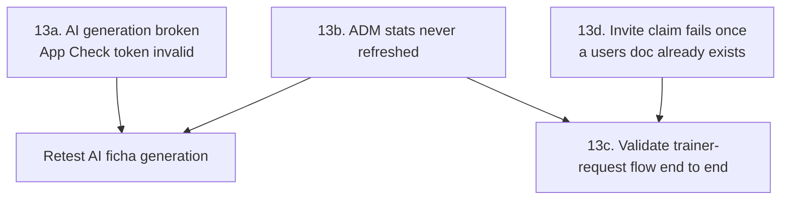

<!-- Archived from GOALS.md on 2026-09-17: every item under this section was [x]. -->
<!-- Cross-references like §13 elsewhere in GOALS.md point here. -->

## 13. Post-MVP Fixes & Validation (2026-08-19, via `/newgoal`)

Found via real-device testing (Samsung SM-S926B) after the MVP (§§0-11) and the trainer-request
flow addition were installed. Fix-type items: current (wrong) behavior → root cause → fix →
regression test, per `fix.md`'s discipline — a patch without a stated root cause isn't done.



**13a. AI ficha generation fails — "Firebase App Check token is invalid"**
- [x] **Repro:** on the installed debug build, `StudentDetailsScreen` → "Ficha Personal" → "Com IA"
      → send any message with the Gemini provider selected → reply is always `Erro ao chamar a
      IA: Firebase App Check token is invalid.` (confirmed via screenshot, 2026-08-19). OpenAI
      provider not yet retested against this same build — check both once the fix lands, since
      App Check protects Firestore/Auth too, not just the AI Logic call.
- [x] **Root cause — confirmed live via `adb logcat` 2026-08-19:** `MainApplication.kt` installs
      `DebugAppCheckProviderFactory` for any debuggable build (see §8's App Check item) — the
      sideloaded/`installDebug` APK on this phone is debuggable, so it generates a random **debug
      token**, logged on every app start:
      `DebugAppCheckProvider: Enter this debug secret into the allow list in the Firebase Console
      for your project: 1dce3124-8e1c-4fe8-9c25-1aa9be85ae4f`. §8 already flagged App Check
      enforcement itself as a pending manual step, but never called out this *separate*
      debug-token registration sub-step, which is required specifically for debug builds
      regardless of Play Integrity enforcement status. An unregistered debug token is rejected
      server-side as unrecognized/invalid — matching the exact error text seen.
- [x] **Fix — done 2026-08-19:** registered `1dce3124-8e1c-4fe8-9c25-1aa9be85ae4f` in Firebase
      Console → App Check → Apps → `com.example.personalapp` → ⋮ → Manage debug tokens → Add
      debug token → Salvar. The app showed as "Não registrado" with no attestation provider at
      all (the pending §8 manual step) — the debug-token action was still reachable directly from
      the row's ⋮ menu without registering Play Integrity first. Note for later: this token is
      tied to this specific app install; a fresh install (data wipe) or a different test device
      will need its own token registered the same way — worth documenting in a short "dev setup"
      note once there's more than one test device in rotation. Play Integrity itself is still
      "Não registrado" — that's the separate §8 item for real release-build attestation, not
      needed for debug-build testing.
- [x] **Regression test (manual) — passed 2026-08-19:** sent a real prompt from `AIWorkoutScreen`
      (Gemini) on the physical device. The `App Check token is invalid` error is gone — the call
      now reaches Gemini's backend for real, confirmed by a *different* error surfacing instead:
      `This model is currently experiencing high demand. Spikes in demand are usually temporary.
      Please try again later.` — a transient Gemini-side capacity response (HTTP 503-class,
      unrelated to App Check/auth), not a bug in this app. This is also the first live
      confirmation the Firebase AI Logic migration (§3) actually works end-to-end, which GOALS.md
      had flagged as unverified since it was written. Retry once demand clears; if it persists
      across many retries/hours, that would be worth a fresh look, but one instance is expected
      Gemini API behavior, not a regression.

**13b. ADM Gestão tab (trainer count, total users, pending requests) never refreshed after first
load — done 2026-08-19**
- [x] **Repro:** `AdminViewModel.loadUserStats()` and `loadTrainerRequests()` both ran exactly
      once, in `init{}`. Any Firestore change after the ViewModel was constructed (a new trainer
      promoted, a new `trainerRequests` doc written) never appeared in the Gestão tab without a
      full process kill + cold start — a same-session tab switch or even backgrounding/resuming
      the app wasn't enough, since the `ViewModel` instance (and its `StateFlow`s) survives that.
      This is exactly why "Personais: 0" stayed stuck even with an active Trainer already using
      the app, and why a submitted trainer-access request didn't show up in "Solicitações
      Pendentes".
- [x] **Root cause:** one-shot `.get()` Firestore reads in `init{}` with no listener and no
      re-trigger path anywhere in the UI layer — not a data problem, a missing-refresh problem.
- [x] **Fix:** made `loadUserStats()`/`loadTrainerRequests()` public on `AdminViewModel`; call
      both from a `LaunchedEffect(Unit)` in `UserManagementTab` (`AdminDashboardScreen.kt`) —
      re-runs every time this composable re-enters composition, i.e. every time the Gestão tab is
      selected, no extra state needed. Added a manual refresh `IconButton` next to "Solicitações
      Pendentes" for an on-demand recheck without leaving the tab.
- [x] **Regression test (manual) — passed 2026-08-20:** on-device, `alexmiguel011014@gmail.com`
      tapped "Solicitar acesso de Trainer" while the ADM's Gestão tab was already open in the
      background; switching back to the tab showed the new pending request without restarting the
      app. Confirms the `LaunchedEffect(Unit)` re-trigger fix works for real, not just compiles.

**13d. Claiming an invite permanently fails once a `users/{uid}` doc exists for that account —
found 2026-08-19 (`alexmiguel011014@gmail.com`), worked around manually, needs a real fix**
- [x] **Repro:** on `LoginScreen`, an authenticated account with an existing `users/{uid}` Firestore
      doc enters a trainer-minted invite code → claim silently fails (Firestore
      `PERMISSION_DENIED`, surfaced to the user as the raw exception string, not a helpful
      message). Confirmed live 2026-08-19. Two distinct starting states both reach this same dead
      end, and are worth telling apart because only one has a safe automatic fix:
      1. **Genuinely-unclaimed STUDENT** (`role: STUDENT`, `trainerId: null`) — e.g. an account
         previously promoted/rejected through some other admin action that still left a doc
         behind, or any future path that writes a `users/{uid}` doc before the invite is claimed.
         *Checked against the code: today's plain self-registration (`AuthRepository.register()` →
         `login()`) does **not** itself write a `users/{uid}` doc — a purely-registered,
         never-touched account is still doc-less and claims fine via the existing `create` rule.
         This case matters for any account that picked up a doc some other way (see case 2, or a
         future flow) while still logically "unclaimed".*
      2. **Account already has an incompatible role** — most likely what actually happened to
         `alexmiguel011014@gmail.com`: earlier in this same session it was used to test the
         ADM's "Promover manualmente" UID-paste form (`AdminViewModel.promoteToTrainer()`, a
         `SetOptions.merge()` write setting `role: TRAINER`), which — like the working fix in
         13b/13c — creates a real `users/{uid}` doc with `role: TRAINER`. Reusing that same
         account as a STUDENT then hits a doc that already has an unrelated role. **This case
         should not be silently auto-resolved** — a STUDENT invite claim silently overwriting an
         existing TRAINER doc would be a real privilege/data-loss bug, not a fix.
- [x] **Root cause:** `AuthRepository.claimInvite()` always does a plain
      `transaction.set(userRef, mapOf(role="STUDENT", trainerId=<real>, ...))` with no branch for
      "does this uid already have a doc, and if so, what's actually in it". Firestore evaluates
      any write to an existing doc as `update`, and `firestore.rules`' `update` rule requires
      `role`/`trainerId` to stay byte-identical to `resource.data` (the anti-self-promotion
      guarantee) — with no exception carved out for the one legitimate case (1) where changing
      `trainerId` from `null` is exactly what should be allowed. Compounding this: `claimInvite()`'s
      caller (`AuthViewModel.claimInvite()`, `AuthViewModel.kt:110-112`) surfaces the raw Firebase
      exception message on failure (`e.message ?: "Código inválido"`) — for a rules rejection this
      is an opaque `PERMISSION_DENIED` string, giving no hint that the real problem is "this
      account already has a role" vs. any other reason the code could be rejected.
- [x] **Fix — two parts (implemented 2026-08-19, not yet republished to the live Console):**
      1. **`firestore.rules`**, `users/{uid}` `allow update`: add a narrow exception, additive to
         the existing unchanged-fields check, covering *only* case 1 above (existing role is
         already `STUDENT` **and** existing `trainerId` is `null`) — presenting the same
         currently-valid/unused-invite proof the `create` rule already requires:
         ```
         allow update: if isAdmin() || (
           isSignedIn() && request.auth.uid == uid &&
           (
             (
               field(request.resource.data, 'role') == field(resource.data, 'role') &&
               field(request.resource.data, 'trainerId') == field(resource.data, 'trainerId')
             ) ||
             (
               field(resource.data, 'role') == 'STUDENT' &&
               field(resource.data, 'trainerId') == null &&
               request.resource.data.role == 'STUDENT' &&
               request.resource.data.trainerId ==
                 get(/databases/$(database)/documents/invites/$(request.resource.data.inviteCode)).data.trainerId &&
               get(/databases/$(database)/documents/invites/$(request.resource.data.inviteCode)).data.used == false
             )
           )
         );
         ```
         Case 2 (already `TRAINER`/`ADM`, or already linked to a different trainer) deliberately
         stays blocked — that's correct behavior, not a bug, and needs an explicit ADM decision
         (demote/unlink first), not a client-driven overwrite.
      2. **UX for case 2, `AuthViewModel.claimInvite()`:** catch a Firestore
         `PERMISSION_DENIED`/`FirebaseFirestoreException` specifically and map it to a clear
         message (e.g. "Esta conta já está vinculada a um perfil existente — fale com o
         administrador.") instead of forwarding the raw exception text, so this doesn't require a
         support conversation + manual Console lookup to diagnose next time.
- [x] **Regression test (manual) — case 1 passed 2026-08-20; case 2 accepted as UI-unreachable
      (see below).**
      1. **Case 1 — passed.** Registered a fresh test account (`teste@teste.com`), manually created
         its `users/{uid}` doc (`role: STUDENT, trainerId: null`, simulating a path that leaves an
         unclaimed doc behind), had a trainer (`alexmiguel011014@gmail.com`) generate an invite,
         claimed it from the test account — confirmed success, `RoleRouter` routed into
         `StudentNavigation` (verified on-device: "Treinos"/"Evolução" tabs, "Nenhuma ficha
         atribuída ainda"). **Real deployment bug found and fixed along the way, not a code bug**:
         the first claim attempt failed with the exact pre-fix "already linked" error even though
         the local `firestore.rules` file had the §13d exception. Root cause: the rules **published
         on the live Firebase Console were stale** — an older version without the §13d `update`
         exception (confirmed by having the user paste the live rules text back for comparison).
         The user had believed this was already republished (see the "13b/13c" pass), but it
         hadn't actually gone out. Republishing the current local file fixed it immediately — no
         code change needed. **Process takeaway**: after any `firestore.rules` edit, verify what's
         *live* by reading it back from the Console, don't just trust "I published it" from memory
         — this cost real debugging time chasing a phantom code bug that didn't exist.
      2. **Case 2 — accepted as structurally unreachable via the UI, not hands-on tested.** Traced
         `RoleRouter`: an account with an existing role (`TRAINER`, or already-linked `STUDENT`)
         never reaches the invite-claim screen at all — it's routed straight into
         `AppNavigation`/`StudentNavigation` instead. The rule is defense-in-depth against a direct
         API/DB write, not something a normal user flow can trigger, so a click-through regression
         test isn't structurally possible without a raw authenticated Firestore call outside the
         app. User decision: accept this as covered by code review + UI routing, skip the extra
         verification step.
      - **Two unrelated real bugs surfaced during this test pass — both fixed and verified
        on-device 2026-08-21:**
        1. `TrainerRepository`'s `users where trainerId==X and role==STUDENT` listener query
           (the §7 "unify" model's linked-student sync) failed with `PERMISSION_DENIED` — confirmed
           live via logcat (`Listen for QueryWrapper(...) failed: Status{code=PERMISSION_DENIED}`).
           `firestore.rules`' `users/{uid}` collection only allowed self-read or `isAdmin()` — no
           rule let a trainer read/list their own linked students' `users/{uid}` docs, so the
           "linked student" half of the §7 unify model had never actually synced into a trainer's
           `Meus Alunos` list. **Fixed**: added `isOwningTrainer(field(resource.data, 'trainerId'))`
           to the `users/{uid}` `allow read` rule, republished. **Verified on-device**: after the
           fix, `alexmiguel011014@gmail.com`'s "Meus Alunos" correctly showed *two* cards (the
           original `students/` draft + the newly-linked `users/` account from the 13d case-1
           test) — before the fix only the draft ever appeared.
        2. The Trainer's main screen (`MainScreen`/students list) had **no logout button** — found
           when trying to switch test accounts, had to force-close the app instead. **Fixed**:
           added a logout `IconButton` (`Icons.AutoMirrored.Filled.Logout`) to `MainScreen`'s
           `TopAppBar`, threaded `onLogout` through `AppNavigation()` from `RoleRouter` (same
           `viewModel.logout()` pattern already used for ADM/Student). **Verified on-device**:
           tapping it returns to `LoginScreen` cleanly.
        Both changes verified via `./gradlew compileDebugKotlin verify assembleDebug` (all green)
        before on-device testing.

**13c. Trainer-request flow (`trainerRequests`) — end-to-end validation — done 2026-08-20**
- [x] `firestore.rules`' `trainerRequests/{uid}` block was republished in the Firebase Console
      (user-confirmed 2026-08-19) and no `PERMISSION_DENIED` was seen in logcat afterward — the
      rules side is live. Full pass confirmed on-device 2026-08-20:
      `alexmiguel011014@gmail.com` (a STUDENT account) tapped "Solicitar acesso de Trainer" on
      `LoginScreen`, the request appeared live in the ADM's "Solicitações Pendentes" (see 13b),
      "Aceitar" promoted it to TRAINER. The whole trainer-onboarding feature (GOALS.md's "Post-MVP
      addition") is now verified end-to-end, not just "compiles and rules are live". Side effect
      worth noting: this reused `alexmiguel011014@gmail.com` as the test account, so it's now a
      real TRAINER — no longer available as a clean unclaimed-STUDENT fixture for 13d below, which
      needs a fresh account instead.
