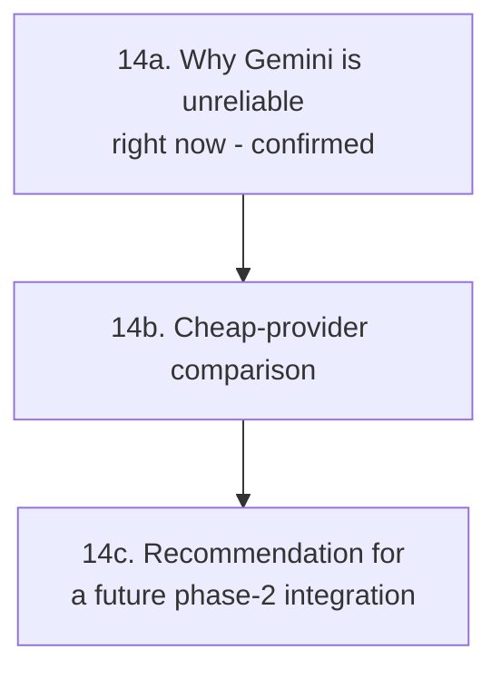

<!-- Archived from GOALS.md on 2026-09-17: every item under this section was [x]. -->
<!-- Cross-references like §14 elsewhere in GOALS.md point here. -->

## 14. Research — cost-effective AI providers for a future constraint-aware ficha generator
(2026-08-19, via `/newgoal /repertoire`)

Feeds §15 below only for its *future* phase (real in-app AI re-integration) — §15's immediate
deliverable (the prompt-template + paste flow) ships regardless of this section and needs no AI
API of its own. Domain grounding: see `REPERTOIRE.md` (scientific + competitive-landscape lenses).

**14a. Why the Gemini errors are real and external, not a bug in this app**
- The `App Check token is invalid` error (§13a) was this app's own bug, now fixed. The `This
  model is currently experiencing high demand` error reported afterward (2026-08-19) is a
  **separate, well-documented, industry-wide problem with Gemini's free/Developer API tier**,
  not something fixable in this codebase: Google cut the Gemini API free-tier quota by 50-92%
  on 2025-12-07, and a further wave of "model overloaded" errors was widely reported starting
  2026-01-16. This app's Firebase AI Logic integration (§3) uses exactly this free
  "Gemini Developer API" tier by design (the whole point of the §3 migration was staying on
  Firebase's free Spark plan). **The user's instinct to not trust Gemini here going forward is
  correct, not overly cautious** — this isn't a transient blip to wait out, it's the tier's
  current normal operating condition.

**14b. Cheap-provider landscape (pricing, structured-output support, reliability notes)**

| Provider / model | Price (in/out per 1M tokens) | Structured JSON output | Notes |
|---|---|---|---|
| Gemini 2.5 Flash-Lite (free Developer tier, current integration) | $0.10 / $0.40 (paid tier; free tier is what's failing) | Yes | Cheapest Google option, but the free tier is exactly what's currently unreliable (14a) — a **paid** Gemini tier might sidestep this, but that reopens the Blaze-plan decision §3 deliberately avoided. |
| **GPT-5 Nano (OpenAI)** | ~$0.05 / — (cheapest OpenAI tier) | Yes (`response_format`) | **This app already has a working OpenAI HTTP integration** (`GenerativeAiService.generateWithOpenAi()`, `api.openai.com/v1/chat/completions`) — currently pointed at `gpt-4o-mini` (GOALS.md §5e), which is no longer the cheapest/current option. Switching the model string is near-zero engineering cost. |
| DeepSeek V3.2 / V4 Flash | $0.14 / $0.28 | Yes (`json_object` mode) | Cheapest true frontier-quality option. Real caveat found: DeepSeek's own API has **its own documented uptime fluctuations under peak demand** — the standard industry mitigation is a multi-provider fallback, i.e. the same class of risk this section exists to get away from, not a strictly safer bet than Gemini. Would need a brand-new HTTP integration (no existing code path, unlike OpenAI). |
| Claude Haiku 4.5 (Anthropic) | $1 / $5 | Yes (tool-use/structured mode) | Pricier than the above, but Anthropic models have a strong instruction-following reputation (relevant given the volume-budget math in `REPERTOIRE.md` needs to be followed *exactly*, not approximately). No existing integration in this app — would need a new HTTP client, same lift as DeepSeek. |

**14c. Recommendation for a future phase-2 — superseded 2026-08-19 by the user's explicit choice
(see §16): give the trainer all four providers now rather than wait-and-see on just one.**
- [x] ~~Cheapest path to re-enable in-app AI with real reliability: point the already-wired OpenAI
      integration at a current cheap model before building a new provider integration.~~
      Superseded — §16 builds DeepSeek and Claude now regardless, per explicit user direction.
      The underlying cost point still stands (OpenAI's `gpt-4o-mini` model id in
      `GenerativeAiService` is stale — worth a follow-up bump to a current cheap model, tracked
      informally here, not urgent enough for its own numbered item).
- [x] ~~Only build a DeepSeek/new-provider integration if a real evaluation shows the cheap-OpenAI
      path isn't accurate enough.~~ Superseded — built directly in §16, not gated on an
      evaluation. The evaluation itself is still worth doing eventually (which provider actually
      follows the volume-budget math best), just informally, whenever real usage accumulates —
      not a blocker for shipping the choice.
- [x] **Done 2026-09-16** — Gemini stays wired but is no longer the default anywhere:
      `AIWorkoutScreen`'s initial chip is ChatGPT (OpenAI, the provider with the working
      BYO-key path §14c recommended leading with), Gemini is the *last* chip and labelled
      "Gemini (grátis, instável)", and the `provider` default parameter on both
      `AIWorkoutViewModel.sendMessage()` and `GenerativeAiService.generateWorkout()` is
      `AiProvider.OPENAI`. Verified as part of the §18h build (`verify assembleDebug` green).
