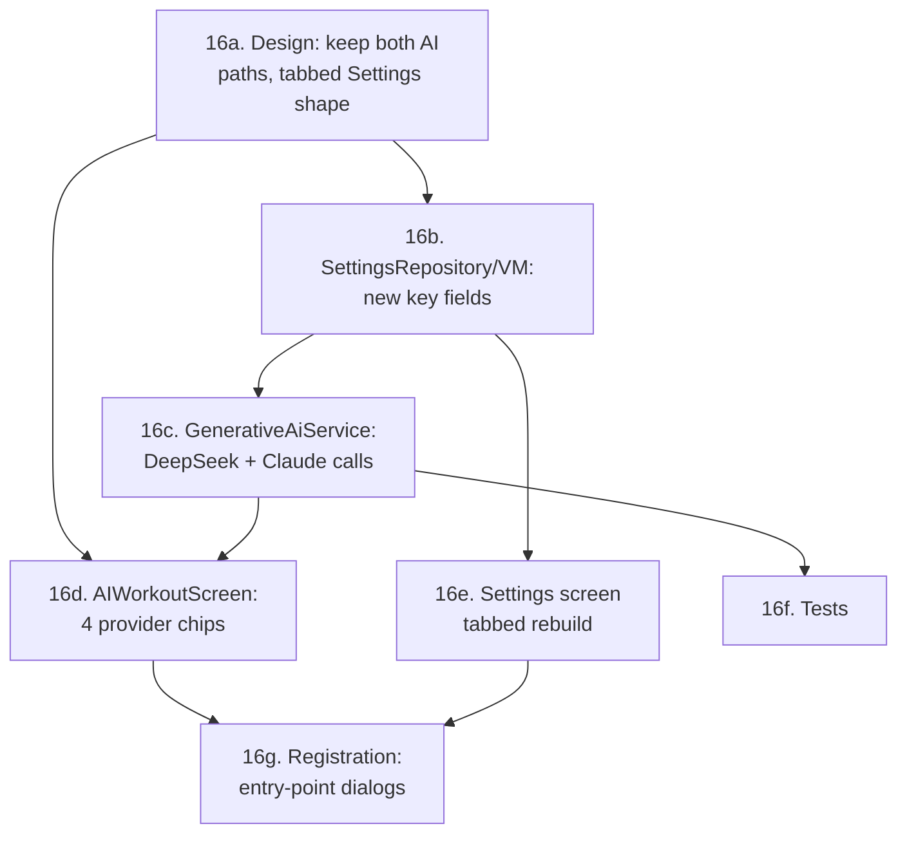

<!-- Archived from GOALS.md on 2026-09-17: every item under this section was [x]. -->
<!-- Cross-references like §16 elsewhere in GOALS.md point here. -->

## 16. Feature — DeepSeek + Claude as selectable providers, dedicated Settings tabs
(2026-08-19, via `/newgoal`)

Supersedes part of §15g: the user's direction here is to *expand* the direct in-app AI path
(more provider choice), not fully retire it in favor of §15's prompt-and-paste flow — both now
coexist as first-class options (see 16a). Grounds provider specifics in real API docs (endpoint,
auth header, request/response shape) so `/execgoals` implements against a checked spec, not a
guess — DeepSeek and Claude have genuinely different wire formats from each other, this matters.

**16a. Design rationale**
- [x] **Amend §15g**: don't hide `AIWorkoutScreen` behind `PromptFichaScreen` — keep both reachable.
      The "Ficha Personal" dialog (`StudentDetailsScreen`) and `WorkoutBuilderScreen`'s "Criar com
      IA" now offer a choice between **"IA no app"** (`AIWorkoutScreen`, direct call, now 4
      providers to pick from) and **"Prompt para IA externa"** (§15's `PromptFichaScreen`) —
      giving the trainer a live in-app fallback *and* a fully external option, not forcing one.
- [x] **`AiProvider` enum expands**: `GEMINI, OPENAI, DEEPSEEK, CLAUDE`. Gemini stays the only
      project-level/free provider (Firebase AI Logic, §3); the other three are all
      **BYO-key**, exactly the pattern OpenAI already established — no new architecture, just two
      more branches of something that already works.
- [x] **Settings becomes tabbed**, reusing the `NavigationBar` + `selectedTab` pattern already
      proven in `AdminDashboardScreen` (§5e) for consistency rather than inventing a second
      "sectioned screen" convention in the same app. Starts with **one tab, "IA"**, holding
      everything AI-related (Gemini's status card + three BYO-key fields). Adding a future
      settings category later is one more entry in the tab list + one more `when` branch — no
      rearchitecture needed when that day comes, which is the actual ask ("já começa a organizar
      melhor").

**16b. `SettingsRepository`/`SettingsViewModel` — new key storage**
- [x] Mirror the existing `openaiApiKey` pattern exactly: two new `stringPreferencesKey`s
      (`deepseek_api_key`, `claude_api_key`) in `SettingsRepository`, two new `Flow<String>`
      exposures + `saveXApiKey()` functions, surfaced on `SettingsViewModel` the same way
      `openaiApiKey`/`saveOpenaiApiKey` already are.

**16c. `GenerativeAiService` — DeepSeek and Claude calls**
- [x] **DeepSeek — reuses the existing OpenAI request/response classes verbatim.** DeepSeek's API
      is explicitly OpenAI-wire-format-compatible (confirmed via current API docs,
      `api-docs.deepseek.com`): same `Authorization: Bearer <key>` header, same
      `{"model": ..., "messages": [{"role", "content"}]}` request shape, same
      `{"choices": [{"message": {"content"}}]}` response shape already modeled by
      `OpenAiChatRequest`/`OpenAiChatResponse`. Only two things differ from the existing
      `generateWithOpenAi()`: base URL `https://api.deepseek.com/chat/completions` and model id
      `deepseek-chat` (current general-purpose alias; `deepseek-v4-flash`/`deepseek-v4-pro` also
      exist per §14b's pricing research — verify which is current/recommended at implementation
      time, same staleness caveat already written for `GEMINI_MODEL_ID`). Read the key from
      `settingsRepository.deepseekApiKey`, same blank-key-check/error-string convention as OpenAI.
- [x] **Claude — new request/response shape, NOT OpenAI-compatible.** Anthropic's Messages API:
      `POST https://api.anthropic.com/v1/messages`. Headers: `x-api-key: <key>` (not
      `Authorization: Bearer`), `anthropic-version: 2023-06-01` (a stable API-version string,
      unrelated to model version — do not confuse the two), `Content-Type: application/json`.
      Body: `{"model": "claude-haiku-4-5", "max_tokens": 4096, "messages": [{"role": "user",
      "content": fullPrompt}]}`. Response: `{"content": [{"type": "text", "text": "..."}]}` (a
      list of content blocks, not a single string — take the first `text`-type block). New
      `@Serializable` classes needed: `ClaudeMessageRequest(model, maxTokens, messages)`,
      `ClaudeMessage(role, content)`, `ClaudeResponse(content: List<ClaudeContentBlock>)`,
      `ClaudeContentBlock(type, text)` — same `HttpURLConnection` + `kotlinx.serialization`
      pattern already used for OpenAI, no new HTTP dependency. Read the key from
      `settingsRepository.claudeApiKey`.
- [x] Both new branches follow the exact error-handling shape `generateWithOpenAi()` already
      established: blank-key check returns a clear Portuguese error string before making any
      network call, non-2xx response passes the body through in the error string (not a generic
      "failed"), and `FirebaseCrashlytics.getInstance().recordException(e)` on any thrown
      exception — consistency with the one pattern this file already got right, not a new style.

**16d. `AIWorkoutScreen` — four provider chips**
- [x] Extend the existing `FilterChip` row (currently Gemini/ChatGPT only) with "DeepSeek" and
      "Claude" chips, same `provider by remember { mutableStateOf(...) }` selection pattern.

**16e. Settings screen — tabbed rebuild**
- [x] Rebuild `SettingsScreen` per 16a's tab shape (`NavigationBar` with one "IA" tab today).
      Inside the IA tab: keep the existing Gemini info card unchanged, and one `OutlinedTextField`
      + `PasswordVisualTransformation` per BYO-key provider (OpenAI, DeepSeek, Claude) — **one
      shared "Salvar" action saving all three at once** (cheaper than three separate FABs/buttons
      for what's functionally one form), matching the existing single-FAB pattern but extended to
      write all three keys together.

**16f. Tests**
- [x] **Descoped, reasoning recorded 2026-08-19**: a real `GenerativeAiServiceTest` would need
      either a new test dependency (MockWebServer — this project has consistently avoided adding
      an HTTP test/client dependency for a single POST call, same reasoning that kept OpenAI on
      plain `HttpURLConnection` in the first place) or loosening the request/response data
      classes from `private` to something a same-package test file could reach — neither is
      proportionate to add just for this. Consistent with the existing gap: `generateWithOpenAi()`
      itself has never had a unit test either, so this isn't a new hole, just staying honest about
      an old one. Verification for all three BYO-key providers stays manual — plug in a real key
      and send one message from `AIWorkoutScreen`, same as how OpenAI has always been checked.

**16g. Registration**
- [x] Update the "Ficha Personal" dialog (`StudentDetailsScreen`) and `WorkoutBuilderScreen`'s
      "Criar com IA" entry point per 16a's amended design (choice between `AIWorkoutScreen` and
      `PromptFichaScreen`, not just the latter as §15g originally specified).
